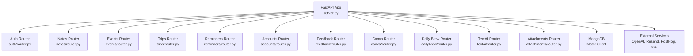
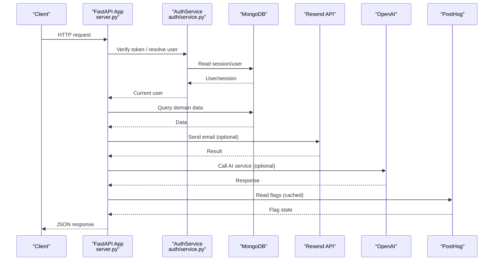
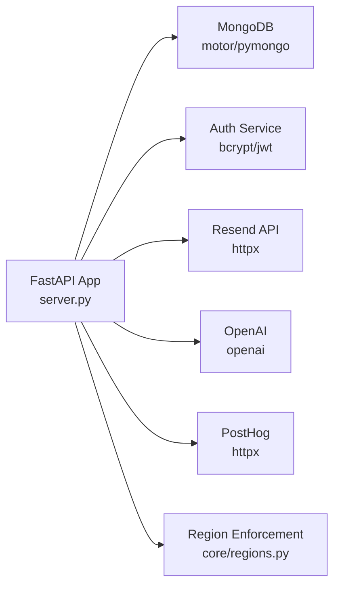

# Deployment & Operations

<cite>
**Referenced Files in This Document**
- [server.py](file://server.py)
- [requirements.txt](file://requirements.txt)
- [Procfile](file://Procfile)
- [core/deps.py](file://core/deps.py)
- [auth/service.py](file://auth/service.py)
- [auth/email_service.py](file://auth/email_service.py)
- [openai_client.py](file://openai_client.py)
- [core/regions.py](file://core/regions.py)
- [featureflags.py](file://featureflags.py)
</cite>

## Table of Contents
1. [Introduction](#introduction)
2. [Project Structure](#project-structure)
3. [Core Components](#core-components)
4. [Architecture Overview](#architecture-overview)
5. [Detailed Component Analysis](#detailed-component-analysis)
6. [Dependency Analysis](#dependency-analysis)
7. [Performance Considerations](#performance-considerations)
8. [Troubleshooting Guide](#troubleshooting-guide)
9. [Conclusion](#conclusion)
10. [Appendices](#appendices)

## Introduction
This document provides deployment and operations guidance for the Nueco Backend, a FastAPI application that exposes REST APIs for notes, events, trips, reminders, accounts, feedback, attachments, daily news, text/AI features, and push notifications. It covers environment configuration, database setup, external service credentials, deployment procedures (including containerization), monitoring and logging, health checks, performance metrics, scaling considerations, backup and recovery, maintenance tasks, security considerations, and troubleshooting.

## Project Structure
The backend is organized by feature modules with shared core utilities:
- server.py: Application entrypoint, routers registration, startup/shutdown hooks, indexes, CORS, middleware, static assets, and health endpoint
- core/: Shared dependencies, region enforcement, repository helpers, rate limiting
- auth/: Authentication, sessions, email sending
- Feature modules: accounts, attachments, canva, dailybrew, events, feedback, notes, reminders, textai, trips
- openai_client.py: OpenAI client configured via residency-checked base URL
- featureflags.py: Server-side PostHog feature flag refresh
- Procfile: Uvicorn process definition
- requirements.txt: Python dependencies

**Diagram sources**
- [server.py:175-214](file://server.py#L175-L214)
- [server.py:338-342](file://server.py#L338-L342)
- [server.py:345-433](file://server.py#L345-L433)

**Section sources**
- [server.py:1-214](file://server.py#L1-L214)
- [Procfile:1-2](file://Procfile#L1-L2)
- [requirements.txt:1-121](file://requirements.txt#L1-L121)

## Core Components
- Application bootstrap and routing: The app loads environment variables from .env, initializes MongoDB via Motor, registers API routes under /api, includes feature routers, sets up CORS, and defines startup/shutdown lifecycle hooks.
- Health check: A simple GET /api/health returns status and timestamp.
- Database indexing: On startup, the app creates or updates indexes across collections to optimize queries and enforce TTLs where applicable.
- Region enforcement: At startup, all external service endpoints and regions are validated against an Australian allowlist; boot fails if any declaration is missing or non-compliant.
- Background tasks: Daily brew cache prewarmer, feature flag refresher, and speechmatics job sweeper are started as background tasks on startup.
- Static assets: Serves privacy policy, terms, robots.txt, optional staging APK download, and `/.well-known/assetlinks.json` for Android App Links verification (Digital Asset Links statements for `com.riostudio.memopad`; cert fingerprints must be colon-separated uppercase hex SHA-256 — Google's parser rejects base64).

Key environment variables used at runtime:
- MONGO_URL, DB_NAME: MongoDB connection and database name
- JWT_SECRET: Required for signing access tokens
- ALLOWED_ORIGINS: Comma-separated list of allowed CORS origins
- APP_BASE_URL: Base URL used in emails and links
- OPENAI_API_KEY or EMERGENT_LLM_KEY: AI provider key
- SMTP_PASS, SMTP_FROM: Email provider credentials
- POSTHOG_PROJECT_API_KEY, POSTHOG_HOST: Analytics host and project key
- EXPO_PUSH_* URLs, RESEND_BASE_URL, SPEECHMATICS_BASE_URL, CANVA_* URLs, AWS_REGION, MONGODB_REGION: External service endpoints and regions enforced by core.regions

**Section sources**
- [server.py:14-20](file://server.py#L14-L20)
- [server.py:168-173](file://server.py#L168-L173)
- [server.py:338-342](file://server.py#L338-L342)
- [server.py:345-433](file://server.py#L345-L433)
- [auth/service.py:24-33](file://auth/service.py#L24-L33)
- [auth/email_service.py:14-24](file://auth/email_service.py#L14-L24)
- [openai_client.py:15-23](file://openai_client.py#L15-L23)
- [core/regions.py:55-77](file://core/regions.py#L55-L77)
- [featureflags.py:11-16](file://featureflags.py#L11-L16)

## Architecture Overview
The backend runs as a single FastAPI process served by Uvicorn. It connects to MongoDB and multiple external services. All outbound endpoints and regions are centrally declared and validated to ensure data residency compliance.

**Diagram sources**
- [server.py:175-214](file://server.py#L175-L214)
- [core/deps.py:24-51](file://core/deps.py#L24-L51)
- [auth/service.py:202-273](file://auth/service.py#L202-L273)
- [auth/email_service.py:26-64](file://auth/email_service.py#L26-L64)
- [openai_client.py:15-23](file://openai_client.py#L15-L23)
- [featureflags.py:25-46](file://featureflags.py#L25-L46)

## Detailed Component Analysis

### Environment Configuration and Secrets
- Load order: server.py loads .env at startup; other modules also load .env when imported.
- Required variables:
  - MONGO_URL, DB_NAME: MongoDB connection and target database
  - JWT_SECRET: Must be set; otherwise startup raises a value error
  - ALLOWED_ORIGINS: Optional; defaults to permissive CORS if not set
  - APP_BASE_URL: Required for email link generation
  - OPENAI_API_KEY or EMERGENT_LLM_KEY: Required for AI features
  - SMTP_PASS, SMTP_FROM: Required for email sending
  - POSTHOG_PROJECT_API_KEY, POSTHOG_HOST: Required for analytics
  - External service endpoints and regions: OPENAI_BASE_URL, SPEECHMATICS_BASE_URL, EXPO_PUSH_SEND_URL, EXPO_PUSH_RECEIPTS_URL, RESEND_BASE_URL, CANVA_AUTHORIZE_URL, CANVA_TOKEN_URL, CANVA_API_BASE_URL, AWS_REGION, MONGODB_REGION
- Validation: core.regions.validate_all() enforces presence, scheme validity, and Australian region declarations at startup; any failure aborts the process.

Operational notes:
- Use secret management systems (e.g., cloud secrets managers) to inject these variables into your runtime environment.
- Ensure each external service endpoint uses HTTPS and is declared with an Australian region.

**Section sources**
- [server.py:14-18](file://server.py#L14-L18)
- [server.py:320-330](file://server.py#L320-L330)
- [auth/service.py:24-33](file://auth/service.py#L24-L33)
- [auth/email_service.py:14-24](file://auth/email_service.py#L14-L24)
- [openai_client.py:15-23](file://openai_client.py#L15-L23)
- [core/regions.py:144-165](file://core/regions.py#L144-L165)
- [core/regions.py:55-77](file://core/regions.py#L55-L77)

### Database Setup and Indexing
- Connection: Motor async client initialized with MONGO_URL; DB selected via DB_NAME.
- Indexes: Startup creates compound indexes for efficient sorting and filtering across notes, events, trips, push tokens, users, sessions, devices, user keys, and feature events. Some indexes include TTL or partial filters.
- Best practices:
  - Ensure MongoDB is accessible from the deployment environment.
  - Monitor index creation logs; failures are logged but do not stop the app.
  - Review indexes periodically to align with query patterns.

**Section sources**
- [server.py:16-18](file://server.py#L16-L18)
- [server.py:345-433](file://server.py#L345-L433)

### External Service Integration
- Email: Uses Resend API with timeout; requires SMTP_PASS and SMTP_FROM; base URL resolved via regions.
- AI: OpenAI client created with base_url from regions; requires OPENAI_API_KEY or EMERGENT_LLM_KEY.
- Analytics: PostHog feature flags refreshed server-side; requires POSTHOG_PROJECT_API_KEY and POSTHOG_HOST.
- Push notifications: Expo push send/receipts URLs required and validated.
- Storage: AWS region validated; bucket name handled elsewhere.

Operational notes:
- All external endpoints must be declared and use Australian regions.
- Timeouts are applied to prevent blocking workers on slow external calls.

**Section sources**
- [auth/email_service.py:26-64](file://auth/email_service.py#L26-L64)
- [openai_client.py:15-23](file://openai_client.py#L15-L23)
- [featureflags.py:25-46](file://featureflags.py#L25-L46)
- [core/regions.py:55-77](file://core/regions.py#L55-L77)

### Monitoring and Logging
- Logging: Standard Python logging configured at INFO level with timestamps and module names.
- Health check: GET /api/health returns healthy status and UTC timestamp.
- Metrics: No built-in metrics endpoint; integrate with your platform’s metrics collection (e.g., Prometheus, cloud APM).
- Observability: Add structured logging and request tracing in middleware if needed.

**Section sources**
- [server.py:23-27](file://server.py#L23-L27)
- [server.py:168-173](file://server.py#L168-L173)

### Scaling Considerations
- Horizontal scaling: Run multiple Uvicorn workers behind a reverse proxy/load balancer. Each worker maintains its own MongoDB connections and background tasks.
- Database connection pooling: Motor manages connection pools; tune pool size based on concurrency and MongoDB limits.
- Rate limiting: Integrate a rate limiter middleware (e.g., slowapi) to protect endpoints from abuse.
- External service rate limiting: Respect provider quotas; implement retries with backoff and circuit breakers where appropriate.

[No sources needed since this section provides general guidance]

### Backup and Recovery
- MongoDB backups: Use your MongoDB provider’s backup strategy (snapshots, point-in-time recovery). Ensure backups are stored in compliant regions.
- Restore procedure: Stop writes during restore if necessary; verify indexes and data integrity post-restore.
- Disaster recovery: Maintain runbooks for failover to another region or provider; test regularly.

[No sources needed since this section provides general guidance]

### Maintenance Tasks
- Periodic review of indexes and query performance.
- Rotate secrets (JWT_SECRET, API keys) following provider guidelines.
- Update dependencies via requirements.txt and retest.
- Validate region declarations after vendor changes.

[No sources needed since this section provides general guidance]

### Security Considerations
- Secrets management: Store all sensitive variables in a secure secrets manager; never commit secrets to code.
- Network security: Enforce HTTPS for all external endpoints; restrict inbound traffic via firewall rules and VPC settings.
- Compliance: Region enforcement ensures data residency; validate vendor endpoints and regions regularly.
- Authentication: Access tokens are bound to sessions; logout invalidates sessions. Ensure proper token handling in clients.
- CORS: Configure ALLOWED_ORIGINS explicitly in production to limit cross-origin requests.

**Section sources**
- [auth/service.py:24-33](file://auth/service.py#L24-L33)
- [core/regions.py:144-165](file://core/regions.py#L144-L165)
- [server.py:320-330](file://server.py#L320-L330)

## Dependency Analysis
The application depends on:
- FastAPI and Starlette for web framework
- Motor and PyMongo for MongoDB
- httpx for async HTTP calls
- bcrypt and PyJWT for authentication
- OpenAI SDK for AI features
- Resend SDK/API for email
- PostHog for analytics

**Diagram sources**
- [server.py:1-20](file://server.py#L1-L20)
- [core/regions.py:55-77](file://core/regions.py#L55-L77)
- [auth/service.py:24-33](file://auth/service.py#L24-L33)
- [auth/email_service.py:26-64](file://auth/email_service.py#L26-L64)
- [openai_client.py:15-23](file://openai_client.py#L15-L23)
- [featureflags.py:25-46](file://featureflags.py#L25-L46)

**Section sources**
- [requirements.txt:1-121](file://requirements.txt#L1-L121)
- [core/regions.py:55-77](file://core/regions.py#L55-L77)

## Performance Considerations
- Indexing: Ensure indexes match query patterns; avoid unnecessary indexes that increase write overhead.
- Concurrency: Tune Uvicorn workers and threads; consider async I/O patterns for external calls.
- Timeouts: Apply timeouts to external calls to prevent worker starvation.
- Caching: Cache frequently accessed data (e.g., feature flags) server-side to reduce external calls.
- Backpressure: Implement rate limiting and circuit breakers for external services.

[No sources needed since this section provides general guidance]

## Troubleshooting Guide
Common issues and resolutions:
- Missing environment variables:
  - Symptom: Startup errors indicating required variables are not set.
  - Resolution: Provide all required variables (MONGO_URL, DB_NAME, JWT_SECRET, APP_BASE_URL, OPENAI_API_KEY/EMERGENT_LLM_KEY, SMTP_PASS, SMTP_FROM, POSTHOG_PROJECT_API_KEY, POSTHOG_HOST, and all external service endpoints/regions).
- Region validation failure:
  - Symptom: Boot fails with region-check errors listing missing or non-Australian variables.
  - Resolution: Set all required endpoint and region variables to valid Australian values; ensure HTTPS schemes.
- Authentication failures:
  - Symptom: 401 responses for protected endpoints.
  - Resolution: Ensure JWT_SECRET is correctly set and clients send valid bearer tokens; verify sessions exist and are not expired.
- Email delivery issues:
  - Symptom: Emails not sent or errors in logs.
  - Resolution: Check SMTP_PASS and SMTP_FROM; verify Resend endpoint and network connectivity; inspect logs for errors.
- AI service errors:
  - Symptom: Requests to AI endpoints fail.
  - Resolution: Confirm OPENAI_API_KEY or EMERGENT_LLM_KEY; verify OPENAI_BASE_URL points to a valid Australian endpoint.
- Health check:
  - Use GET /api/health to verify the service is running and responsive.

**Section sources**
- [auth/service.py:24-33](file://auth/service.py#L24-L33)
- [core/regions.py:144-165](file://core/regions.py#L144-L165)
- [auth/email_service.py:26-64](file://auth/email_service.py#L26-L64)
- [openai_client.py:15-23](file://openai_client.py#L15-L23)
- [server.py:168-173](file://server.py#L168-L173)

## Conclusion
The Nueco Backend is a modular FastAPI application with strong data residency enforcement, robust authentication, and integration with external services. Proper environment configuration, careful secret management, and adherence to regional constraints are critical for secure and compliant deployments. Operational best practices include comprehensive logging, health checks, scalable deployment patterns, and proactive maintenance.

[No sources needed since this section summarizes without analyzing specific files]

## Appendices

### Deployment Procedures

#### Development
- Install dependencies from requirements.txt.
- Create a .env file with required variables for local development.
- Start the server using Uvicorn as defined in Procfile.

**Section sources**
- [requirements.txt:1-121](file://requirements.txt#L1-L121)
- [Procfile:1-2](file://Procfile#L1-L2)

#### Staging and Production
- Containerize the application using a Dockerfile that installs dependencies and runs Uvicorn.
- Inject environment variables via your platform’s secret management.
- Deploy behind a reverse proxy/load balancer with TLS termination.
- Ensure all external service endpoints and regions are declared and validated.

[No sources needed since this section provides general guidance]

### Health Check Endpoints
- GET /api/health: Returns healthy status and timestamp.

**Section sources**
- [server.py:168-173](file://server.py#L168-L173)

### Monitoring and Metrics
- Logging: Standard Python logging at INFO level.
- Metrics: Integrate with platform-specific metrics collection; add custom metrics for key operations.
- Alerts: Configure alerts for health check failures, high error rates, and external service timeouts.

**Section sources**
- [server.py:23-27](file://server.py#L23-L27)

### Scaling Patterns
- Horizontal scaling: Multiple instances behind a load balancer.
- Database: Use managed MongoDB with connection pooling; monitor connection usage.
- External services: Implement retries, backoffs, and circuit breakers; respect rate limits.

[No sources needed since this section provides general guidance]

### Backup and Recovery
- MongoDB: Use provider-backed snapshots and point-in-time recovery.
- Restore: Follow provider instructions; validate data integrity post-restore.
- DR plan: Define RTO/RPO; test failover scenarios regularly.

[No sources needed since this section provides general guidance]

### Security Checklist
- Secrets: Store in secure vaults; rotate regularly.
- Network: Enforce HTTPS; restrict inbound/outbound traffic.
- Compliance: Validate region declarations; audit external endpoints.
- Authentication: Use session-bound tokens; enforce logout behavior.

**Section sources**
- [auth/service.py:24-33](file://auth/service.py#L24-L33)
- [core/regions.py:144-165](file://core/regions.py#L144-L165)
- [server.py:320-330](file://server.py#L320-L330)