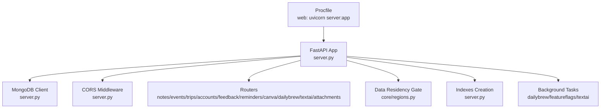
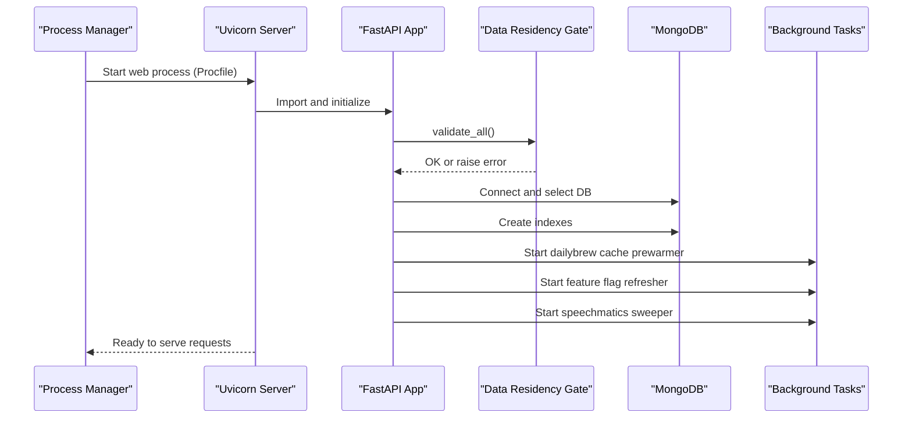
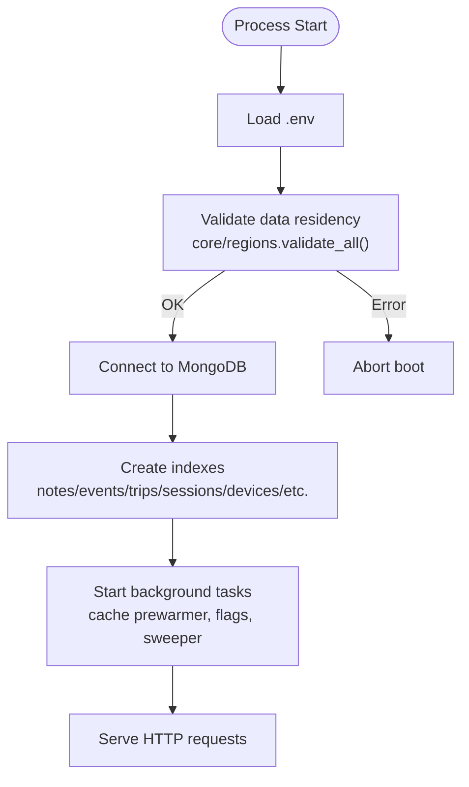
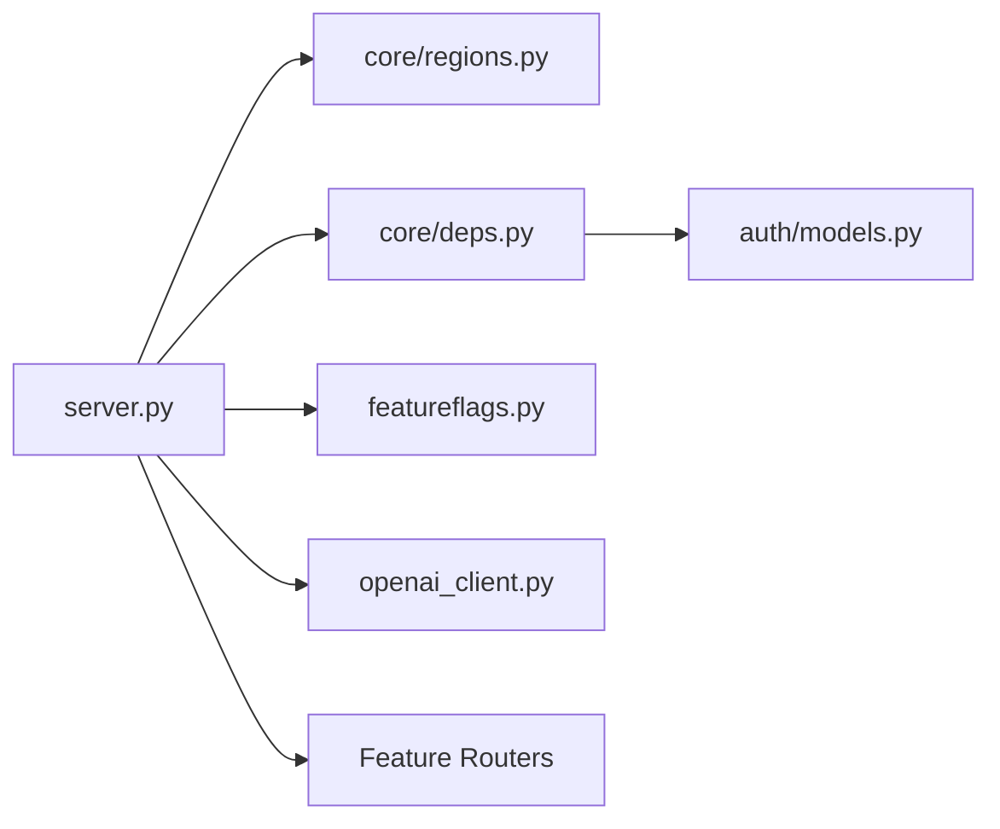

# Deployment Procedures

<cite>
**Referenced Files in This Document**
- [server.py](file://server.py)
- [Procfile](file://Procfile)
- [requirements.txt](file://requirements.txt)
- [featureflags.py](file://featureflags.py)
- [openai_client.py](file://openai_client.py)
- [core/regions.py](file://core/regions.py)
- [core/deps.py](file://core/deps.py)
- [auth/models.py](file://auth/models.py)
- [.gitignore](file://.gitignore)
</cite>

## Table of Contents
1. Introduction
2. Project Structure
3. Core Components
4. Architecture Overview
5. Detailed Component Analysis
6. Dependency Analysis
7. Performance Considerations
8. Troubleshooting Guide
9. Conclusion
10. Appendices

## Introduction
This document provides step-by-step deployment procedures for the Nueco Backend across local development, cloud platforms (Heroku, Railway, AWS), and containerized deployments with Docker. It explains the application startup sequence, database initialization, index creation, environment preparation, build processes, dependency installation, process management via Procfile, scaling considerations, monitoring setup during deployment, post-deployment verification, rollback strategies, zero-downtime deployment approaches, and common issues with solutions.

## Project Structure
The backend is a FastAPI application that:
- Loads environment variables from .env at startup
- Connects to MongoDB using an async client
- Registers feature routers under /api
- Enforces data residency by validating external service endpoints and regions at boot
- Creates required MongoDB indexes on startup
- Starts background tasks for cache prewarming, feature flag refresh, and job sweeping
- Serves static assets and health endpoints

**Diagram sources**
- [server.py:1-215](file://server.py#L1-L215)
- [server.py:338-465](file://server.py#L338-L465)
- [Procfile:1-2](file://Procfile#L1-L2)
- [core/regions.py:144-165](file://core/regions.py#L144-L165)

**Section sources**
- [server.py:1-215](file://server.py#L1-L215)
- [Procfile:1-2](file://Procfile#L1-L2)

## Core Components
- Application entrypoint and middleware: FastAPI app, CORS, anti-crawler middleware, health endpoint
- Database connection and access: AsyncIOMotorClient and shared DB handle
- Data residency enforcement: validates all external service endpoints and regions are present and Australian
- Index creation: creates and maintains indexes for notes, events, trips, push tokens, sessions, devices, user keys, feature events, transcription shadow
- Background tasks: dailybrew cache prewarmer, feature flag refresher, speechmatics job sweeper
- Process management: Procfile runs uvicorn serving the FastAPI app

Key responsibilities and where they live:
- Startup lifecycle and background tasks: [server.py:338-465](file://server.py#L338-L465)
- Data residency validation: [core/regions.py:144-165](file://core/regions.py#L144-L165)
- OpenAI client configuration: [openai_client.py:15-24](file://openai_client.py#L15-L24)
- Feature flags refresh loop: [featureflags.py:25-53](file://featureflags.py#L25-L53)
- Shared dependencies (DB, current user): [core/deps.py:15-51](file://core/deps.py#L15-L51)
- MongoDB document models: [auth/models.py:6-66](file://auth/models.py#L6-L66)

**Section sources**
- [server.py:338-465](file://server.py#L338-L465)
- [core/regions.py:144-165](file://core/regions.py#L144-L165)
- [openai_client.py:15-24](file://openai_client.py#L15-L24)
- [featureflags.py:25-53](file://featureflags.py#L25-L53)
- [core/deps.py:15-51](file://core/deps.py#L15-L51)
- [auth/models.py:6-66](file://auth/models.py#L6-L66)

## Architecture Overview
The runtime architecture centers around a single FastAPI process managed by uvicorn. On startup, it:
1. Loads environment variables
2. Validates data residency constraints
3. Establishes a MongoDB connection
4. Creates indexes
5. Starts background tasks
6. Serves API routes under /api

**Diagram sources**
- [Procfile:1-2](file://Procfile#L1-L2)
- [server.py:14-20](file://server.py#L14-L20)
- [server.py:338-465](file://server.py#L338-L465)
- [core/regions.py:144-165](file://core/regions.py#L144-L165)

## Detailed Component Analysis

### Environment Preparation
- Required environment variables include:
  - Database: MONGO_URL, DB_NAME
  - External services: OPENAI_BASE_URL, OPENAI_REGION, SPEECHMATICS_BASE_URL, SPEECHMATICS_REGION, EXPO_PUSH_SEND_URL, EXPO_PUSH_RECEIPTS_URL, EXPO_PUSH_REGION, RESEND_BASE_URL, RESEND_REGION, POSTHOG_HOST, POSTHOG_REGION, CANVA_AUTHORIZE_URL, CANVA_TOKEN_URL, CANVA_API_BASE_URL, CANVA_REGION
  - Storage region: AWS_REGION
  - Optional: ALLOWED_ORIGINS, POSTHOG_PROJECT_API_KEY, OPENAI_API_KEY or EMERGENT_LLM_KEY, PUSH_TICK_SECRET (for internal tick), APK_DOWNLOAD_PATH
- Secrets must not be committed; use platform secret managers or env files excluded by .gitignore

Environment loading and usage:
- .env loaded at startup: [server.py:14](file://server.py#L14)
- Region validation enforces presence and correctness: [core/regions.py:144-165](file://core/regions.py#L144-L165)
- OpenAI client requires key and uses validated base URL: [openai_client.py:15-24](file://openai_client.py#L15-L24)
- Git ignore excludes secrets: [.gitignore:1-4](file://.gitignore#L1-L4)

**Section sources**
- [server.py:14-18](file://server.py#L14-L18)
- [core/regions.py:144-165](file://core/regions.py#L144-L165)
- [openai_client.py:15-24](file://openai_client.py#L15-L24)
- [.gitignore:1-4](file://.gitignore#L1-L4)

### Build and Dependencies
- Python version: Use a recent stable Python supported by FastAPI and Motor
- Install dependencies: pip install -r requirements.txt
- Ensure uvicorn is available (included in requirements)

Dependency list includes FastAPI, Starlette, Motor, Pydantic, httpx, boto3, openai, etc.

**Section sources**
- [requirements.txt:1-121](file://requirements.txt#L1-L121)

### Application Startup Sequence
On process start:
1. Load .env
2. Initialize logging
3. Validate data residency (fail closed if any endpoint/region missing or non-Australian)
4. Connect to MongoDB and select DB
5. Create indexes (drops stale ones first, then creates compound/partial/TTL indexes)
6. Start background tasks:
   - Dailybrew cache prewarmer
   - Feature flag refresher (initial fetch with timeout, then periodic)
   - Speechmatics job sweeper
7. Register routers and serve requests

**Diagram sources**
- [server.py:14-20](file://server.py#L14-L20)
- [server.py:338-465](file://server.py#L338-L465)
- [core/regions.py:144-165](file://core/regions.py#L144-L165)

**Section sources**
- [server.py:338-465](file://server.py#L338-L465)

### Database Initialization and Index Creation
- The startup handler drops superseded indexes and creates optimized compound and partial indexes for notes, events, trips, push tokens, sessions, devices, user keys, feature events, and transcription shadow
- TTL index on sessions ensures automatic expiration
- Partial index on events optimizes reminder scheduling queries

Index operations occur within a try/except block that logs warnings if indexes already exist.

**Section sources**
- [server.py:344-433](file://server.py#L344-L433)

### Process Management and Scaling
- Procfile defines a single web process running uvicorn bound to 0.0.0.0:8000
- Horizontal scaling: run multiple worker processes behind a reverse proxy/load balancer (e.g., Nginx, Cloudflare, platform LB)
- Vertical scaling: increase CPU/memory per instance based on load
- Zero-downtime deployments: use rolling updates so new instances start before old ones stop; ensure idempotent index creation and graceful shutdown

**Section sources**
- [Procfile:1-2](file://Procfile#L1-L2)

### Local Development Deployment
Steps:
1. Clone repository and navigate to backend directory
2. Create virtual environment and install dependencies
3. Create .env with required variables (MONGO_URL, DB_NAME, external service endpoints and regions, API keys)
4. Run the application locally using uvicorn or your platform’s runner
5. Verify health endpoint

Verification:
- GET /api/health should return healthy status

**Section sources**
- [server.py:168-173](file://server.py#L168-L173)

### Heroku Deployment
Prerequisites:
- Heroku CLI installed and authenticated
- Heroku account with a dyno plan suitable for Python apps

Steps:
1. Create a Heroku app
2. Set environment variables in Heroku dashboard or via CLI
3. Push code to Heroku main branch
4. Review logs for successful startup and index creation
5. Verify health endpoint

Scaling:
- Scale dynos horizontally for additional capacity
- Use Heroku Redis or external services for caching if needed

Rollback:
- Revert to previous git commit and push again
- Or use Heroku releases to rollback

**Section sources**
- [Procfile:1-2](file://Procfile#L1-L2)

### Railway Deployment
The production backend runs on Railway (project `diligent-happiness`, environment `production`). Deployments use **CLI snapshot uploads, not a connected GitHub source**.

Prerequisites:
- Railway account and CLI configured (`railway login`, service linked)
- MongoDB service provisioned (or external MongoDB Atlas)
- All 18 AU data-residency env vars set — the server refuses to boot without them (`core/regions.py` validates at startup)

Steps:
1. Configure environment variables in Railway (dashboard or `railway variables`)
2. From `backend/`, run `railway up --detach` to upload and deploy the current tree
3. Poll `railway deployment list` until the deployment reaches SUCCESS
4. Verify `GET /api/health` and `GET /.well-known/assetlinks.json` on the public domain

Build configuration:
- Builder is **DOCKERFILE** using `backend/Dockerfile` (python:3.12-slim, pip install, uvicorn). The service root directory is empty because `railway up` uploads the backend contents at the snapshot root.
- `backend/.railignore` excludes `.env`, `.env.example`, `.railway/`, and config-pull temp dirs from upload snapshots.
- The railpack builder is avoided: a mise download regression caused persistent prepare failures regardless of code content.

Scaling:
- Increase instance size or add replicas through Railway UI
- Use environment variables to configure concurrency and workers

Rollback:
- Redeploy a known-good snapshot (`railway up` from the desired tree)
- Use Railway’s deployment history to roll back

**Section sources**
- [server.py:14-20](file://server.py#L14-L20)
- [core/regions.py:144-165](file://core/regions.py#L144-L165)

### AWS Deployment
Options:
- ECS/Fargate: Containerize the app and run in AWS Fargate
- Elastic Beanstalk: Deploy directly from source or container image
- EC2: Run uvicorn behind Nginx or Apache

Steps (ECS example):
1. Build Docker image
2. Push image to Amazon ECR
3. Define task definition with environment variables
4. Create service with desired count and load balancer
5. Monitor CloudWatch logs and metrics
6. Verify health endpoint

Scaling:
- Auto-scale based on CPU/memory or request count
- Use Application Load Balancer for zero-downtime deployments

Rollback:
- Update service to previous task definition revision

**Section sources**
- [Procfile:1-2](file://Procfile#L1-L2)

### Docker Deployment
Prerequisites:
- Docker installed
- Access to container registry

Steps:
1. Create a Dockerfile that installs dependencies and runs uvicorn
2. Build image
3. Tag and push to registry
4. Run container with required environment variables
5. Verify health endpoint

Example commands:
- Build: docker build -t nueco-backend:latest .
- Run: docker run -p 8000:8000 --env-file .env nueco-backend:latest

Scaling:
- Use Docker Compose for local multi-instance testing
- Use orchestration tools (Kubernetes, ECS) for production scaling

Rollback:
- Re-run container with previous image tag

**Section sources**
- [Procfile:1-2](file://Procfile#L1-L2)

### Monitoring Setup During Deployment
- Health check endpoint: GET /api/health
- Logs: Ensure structured logging is enabled and forwarded to your log aggregator
- Metrics: Integrate application metrics (requests, errors, latency) and export to monitoring stack
- Alerts: Configure alerts for startup failures, index creation warnings, and high error rates

Post-deployment verification:
- Call /api/health and confirm healthy response
- Test authentication flow and a core CRUD operation
- Verify background tasks are running (no repeated startup warnings)

**Section sources**
- [server.py:168-173](file://server.py#L168-L173)
- [server.py:23-27](file://server.py#L23-L27)

### Rollback Procedures
- Git-based rollback: revert to previous commit and redeploy
- Platform-specific rollback: use Heroku releases or Railway deployment history
- Database compatibility: ensure migrations/index changes are backward compatible; index creation is idempotent and safe to run multiple times

Zero-downtime strategy:
- Rolling updates with health checks
- Blue/green deployments with traffic switching
- Canary deployments for gradual rollout

**Section sources**
- [server.py:344-433](file://server.py#L344-L433)

## Dependency Analysis
External dependencies and their roles:
- FastAPI/Starlette: Web framework and ASGI server integration
- Motor/Pymongo: Asynchronous MongoDB driver
- Pydantic: Request/response validation
- httpx: Async HTTP client for feature flags and external APIs
- boto3: AWS SDK for S3 and other services
- OpenAI SDK: LLM integration with validated base URL
- Speechmatics SDK: Transcription integration
- JWT/crypto libraries: Authentication and security

Runtime coupling:
- server.py orchestrates imports and startup
- core/regions.py centralizes external service configuration and validation
- core/deps.py provides shared DB and user resolution
- featureflags.py and openai_client.py depend on regions for validated endpoints

**Diagram sources**
- [server.py:1-215](file://server.py#L1-L215)
- [core/regions.py:144-165](file://core/regions.py#L144-L165)
- [core/deps.py:15-51](file://core/deps.py#L15-L51)
- [featureflags.py:25-53](file://featureflags.py#L25-L53)
- [openai_client.py:15-24](file://openai_client.py#L15-L24)
- [auth/models.py:6-66](file://auth/models.py#L6-L66)

**Section sources**
- [server.py:1-215](file://server.py#L1-L215)
- [core/regions.py:144-165](file://core/regions.py#L144-L165)
- [core/deps.py:15-51](file://core/deps.py#L15-L51)
- [featureflags.py:25-53](file://featureflags.py#L25-L53)
- [openai_client.py:15-24](file://openai_client.py#L15-L24)
- [auth/models.py:6-66](file://auth/models.py#L6-L66)

## Performance Considerations
- Index coverage: Compound indexes reduce in-memory sorts and improve pagination performance
- Partial indexes: Optimize reminder scheduler queries by indexing only pending events
- TTL indexes: Automatically expire sessions to keep collections small
- Background tasks: Ensure timeouts and retries are configured to avoid blocking startup
- Concurrency: Tune uvicorn workers and threads based on workload characteristics
- External calls: Use async clients and reasonable timeouts to prevent slow downstream services from impacting responsiveness

[No sources needed since this section provides general guidance]

## Troubleshooting Guide
Common issues and solutions:
- Boot failure due to missing or invalid data residency configuration:
  - Check all endpoint and region environment variables are set and valid
  - Ensure regions are within the Australian allowlist
- MongoDB connection errors:
  - Verify MONGO_URL and DB_NAME are correct
  - Ensure network access and credentials are valid
- Index creation warnings:
  - Non-fatal; indicates indexes may already exist
- Feature flag refresh failures:
  - Initial fetch has timeout; background refresh continues
  - Check POSTHOG_HOST and POSTHOG_PROJECT_API_KEY
- OpenAI client configuration errors:
  - Ensure OPENAI_API_KEY or EMERGENT_LLM_KEY is set
  - Base URL is validated via regions module
- CORS issues:
  - Set ALLOWED_ORIGINS to include frontend origins
- Static asset 404s:
  - Ensure static files exist at expected paths or configure paths appropriately

Monitoring and diagnostics:
- Use /api/health to verify readiness
- Inspect logs for startup sequence and background task status
- Track error rates and latency metrics

**Section sources**
- [server.py:338-465](file://server.py#L338-L465)
- [core/regions.py:144-165](file://core/regions.py#L144-L165)
- [openai_client.py:15-24](file://openai_client.py#L15-L24)
- [featureflags.py:25-53](file://featureflags.py#L25-L53)
- [server.py:320-330](file://server.py#L320-L330)

## Conclusion
The Nueco Backend deploys as a single FastAPI process managed by uvicorn, with strict data residency enforcement, robust database indexing, and background tasks for analytics and maintenance. Follow the environment preparation steps, ensure all required variables are set, and use platform-native scaling and rollback mechanisms. Validate deployments with health checks and monitor logs and metrics to maintain reliability.

[No sources needed since this section summarizes without analyzing specific files]

## Appendices

### Deployment Checklist
- Environment variables configured and validated
- Dependencies installed
- Database accessible and indexes created
- Health endpoint returns healthy
- Background tasks started without errors
- CORS configured for frontend domains
- Static assets available if used
- Monitoring and logging enabled
- Scaling and rollback procedures tested

### Zero-Downtime Deployment Strategies
- Rolling updates with health checks
- Blue/green deployments with traffic switching
- Canary releases for gradual rollout
- Idempotent index creation to support concurrent deployments

[No sources needed since this section provides general guidance]