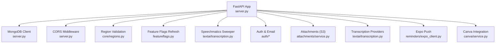
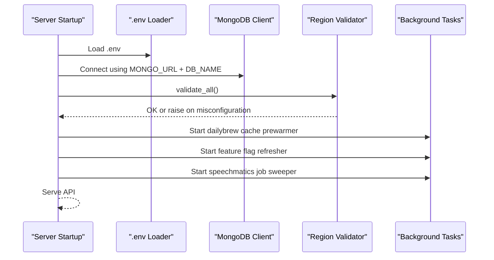
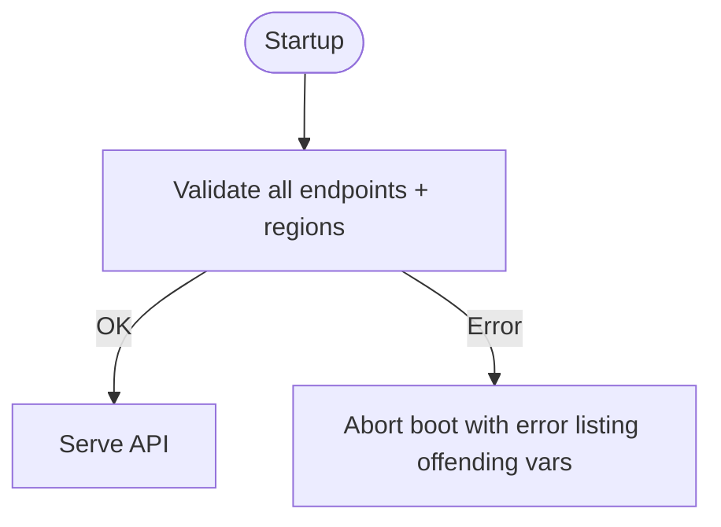

# Environment Configuration

<cite>
**Referenced Files in This Document**
- [server.py](file://server.py)
- [openai_client.py](file://openai_client.py)
- [core/regions.py](file://core/regions.py)
- [textai/transcription.py](file://textai/transcription.py)
- [attachments/service.py](file://attachments/service.py)
- [auth/email_service.py](file://auth/email_service.py)
- [reminders/expo_client.py](file://reminders/expo_client.py)
- [featureflags.py](file://featureflags.py)
- [canva/service.py](file://canva/service.py)
- [auth/service.py](file://auth/service.py)
</cite>

## Table of Contents
1. [Introduction](#introduction)
2. [Project Structure](#project-structure)
3. [Core Components](#core-components)
4. [Architecture Overview](#architecture-overview)
5. [Detailed Component Analysis](#detailed-component-analysis)
6. [Dependency Analysis](#dependency-analysis)
7. [Performance Considerations](#performance-considerations)
8. [Troubleshooting Guide](#troubleshooting-guide)
9. [Conclusion](#conclusion)
10. [Appendices](#appendices)

## Introduction
This document provides comprehensive environment configuration guidance for the Nueco Backend. It covers all required and optional environment variables, their purpose, defaults, and security considerations. It also documents external service configuration (OpenAI, Speechmatics, AWS S3, Resend email, Expo Push, PostHog analytics, Canva integration), validation and secret management best practices, secure deployment patterns, and troubleshooting steps for common issues.

## Project Structure
The backend is a FastAPI application that loads environment variables from a .env file at startup and enforces data residency by validating external service endpoints and regions before serving traffic. Key configuration points:
- Application bootstrap and CORS configuration
- MongoDB connection setup
- Staging APK download endpoint
- External service region enforcement via a central module
- Feature flags and background tasks

**Diagram sources**
- [server.py:1-465](file://server.py#L1-L465)
- [core/regions.py:1-230](file://core/regions.py#L1-L230)
- [textai/transcription.py:1-450](file://textai/transcription.py#L1-L450)
- [attachments/service.py:1-227](file://attachments/service.py#L1-L227)
- [auth/email_service.py:1-151](file://auth/email_service.py#L1-L151)
- [reminders/expo_client.py:1-50](file://reminders/expo_client.py#L1-L50)
- [featureflags.py:1-53](file://featureflags.py#L1-L53)
- [canva/service.py:1-120](file://canva/service.py#L1-L120)

**Section sources**
- [server.py:1-465](file://server.py#L1-L465)
- [core/regions.py:1-230](file://core/regions.py#L1-L230)

## Core Components
- Database connectivity: MongoDB client initialized with MONGO_URL and DB_NAME.
- Data residency enforcement: All outbound services must declare an endpoint and an Australian region; boot fails if missing or invalid.
- CORS: Configurable allowed origins; defaults to allow all when not set.
- Staging APK download: Optional route to serve an APK file from a configurable path.
- Background tasks: Daily brew cache prewarmer, feature flag refresher, Speechmatics job sweeper.

**Section sources**
- [server.py:14-18](file://server.py#L14-L18)
- [server.py:224-254](file://server.py#L224-L254)
- [server.py:320-330](file://server.py#L320-L330)
- [server.py:338-341](file://server.py#L338-L341)
- [server.py:435-459](file://server.py#L435-L459)

## Architecture Overview
At startup, the server loads environment variables, connects to MongoDB, validates all external service endpoints and regions, registers routers, and starts background tasks. The region validation module ensures no hardcoded vendor URLs are used and that every declared region is within the approved Australian list.

**Diagram sources**
- [server.py:14-18](file://server.py#L14-L18)
- [server.py:338-341](file://server.py#L338-L341)
- [server.py:435-459](file://server.py#L435-L459)
- [core/regions.py:144-165](file://core/regions.py#L144-L165)

## Detailed Component Analysis

### MongoDB Configuration
- MONGO_URL: Required. Used to create the async MongoDB client.
- DB_NAME: Required. Database name selected after connecting.

Security considerations:
- Use a connection string with least-privilege credentials.
- Ensure network access restricts database to trusted environments.

Validation:
- Missing values will cause startup failure when accessing environment variables.

**Section sources**
- [server.py:14-18](file://server.py#L14-L18)

### CORS Configuration
- ALLOWED_ORIGINS: Comma-separated list of allowed origins. If empty, defaults to allow all.

Security considerations:
- In production, explicitly specify trusted origins instead of allowing all.

**Section sources**
- [server.py:320-330](file://server.py#L320-L330)

### Staging APK Download
- APK_DOWNLOAD_PATH: Path to the staging APK file. Defaults to a path under the repository root unless overridden.

Behavior:
- Routes serve an HTML page and the binary file only if the file exists; otherwise returns 404.

Security considerations:
- Restrict access to this route behind authentication or IP allowlisting in production.

**Section sources**
- [server.py:224-254](file://server.py#L224-L254)

### OpenAI Configuration
- OPENAI_API_KEY or EMERGENT_LLM_KEY: One must be set to enable transcription via OpenAI Whisper.
- OPENAI_BASE_URL and OPENAI_REGION: Required by the region validator for data residency.

Behavior:
- The OpenAI client is created with the base URL enforced by the region module to avoid default endpoints bypassing residency checks.

Security considerations:
- Store keys in a secrets manager; never commit to code.
- Ensure base URL points to an approved region.

**Section sources**
- [openai_client.py:15-23](file://openai_client.py#L15-L23)
- [core/regions.py:58-77](file://core/regions.py#L58-L77)
- [core/regions.py:186-187](file://core/regions.py#L186-L187)

### Speechmatics Configuration
- SPEECHMATICS_API_KEY: Required when using Speechmatics provider.
- SPEECHMATICS_BASE_URL and SPEECHMATICS_REGION: Required by the region validator.

Behavior:
- Provider selection via TRANSCRIPTION_PROVIDER; fallback logic supports diarization when configured.
- Jobs are deleted immediately after transcription; a background sweeper reconciles any stale jobs.

Security considerations:
- Keep API key secret; ensure base URL is region-compliant.

**Section sources**
- [textai/transcription.py:148-152](file://textai/transcription.py#L148-L152)
- [textai/transcription.py:171-234](file://textai/transcription.py#L171-L234)
- [textai/transcription.py:294-320](file://textai/transcription.py#L294-L320)
- [textai/transcription.py:323-360](file://textai/transcription.py#L323-L360)
- [core/regions.py:58-77](file://core/regions.py#L58-L77)
- [core/regions.py:190-191](file://core/regions.py#L190-L191)

### AWS S3 Configuration (Attachments)
- S3_BUCKET: Name of the bucket for note attachments.
- AWS_REGION: Required by the region validator; used to configure the boto3 client.
- MAX_TOTAL_ATTACHMENT_BYTES: Optional per-account storage cap (default provided).

Behavior:
- Presigned URLs for direct-to-S3 uploads/downloads scoped per user.
- Quota enforcement before issuing presigned URLs.

Security considerations:
- Use IAM roles or least-privilege credentials.
- Ensure bucket policies restrict access to presigned URLs only.

**Section sources**
- [attachments/service.py:16-25](file://attachments/service.py#L16-L25)
- [attachments/service.py:77-84](file://attachments/service.py#L77-L84)
- [attachments/service.py:86-136](file://attachments/service.py#L86-L136)
- [core/regions.py:67-70](file://core/regions.py#L67-L70)
- [core/regions.py:206-208](file://core/regions.py#L206-L208)

### Email Service (Resend)
- SMTP_PASS: Resend API key used to send emails.
- SMTP_FROM: Sender email address.
- APP_BASE_URL: Required for building verification/reset links.
- RESEND_BASE_URL and RESEND_REGION: Required by the region validator.

Behavior:
- Sends verification and password reset emails via Resend API with timeouts.
- Gracefully degrades in development when API key is missing.

Security considerations:
- Protect SMTP_PASS; use secrets management.
- Ensure APP_BASE_URL matches your deployed domain.

**Section sources**
- [auth/email_service.py:14-24](file://auth/email_service.py#L14-L24)
- [auth/email_service.py:26-64](file://auth/email_service.py#L26-L64)
- [core/regions.py:66-67](file://core/regions.py#L66-L67)
- [core/regions.py:202-203](file://core/regions.py#L202-L203)

### Expo Push Notifications
- EXPO_ACCESS_TOKEN: Optional but recommended for push send security.
- EXPO_PUSH_SEND_URL, EXPO_PUSH_RECEIPTS_URL, EXPO_PUSH_REGION: Required by the region validator.

Behavior:
- Batch sends and receipt polling against region-declared endpoints.

Security considerations:
- Set EXPO_ACCESS_TOKEN to authorize push operations.

**Section sources**
- [reminders/expo_client.py:18-24](file://reminders/expo_client.py#L18-L24)
- [reminders/expo_client.py:26-49](file://reminders/expo_client.py#L26-L49)
- [core/regions.py:61-65](file://core/regions.py#L61-L65)
- [core/regions.py:194-199](file://core/regions.py#L194-L199)

### PostHog Analytics
- POSTHOG_PROJECT_API_KEY: Enables server-side feature flag resolution.
- POSTHOG_HOST and POSTHOG_REGION: Required by the region validator.

Behavior:
- Periodically fetches feature flags and caches them server-wide.

Security considerations:
- Treat API key as secret; ensure host is region-compliant.

**Section sources**
- [featureflags.py:11-14](file://featureflags.py#L11-L14)
- [featureflags.py:25-35](file://featureflags.py#L25-L35)
- [core/regions.py:70-71](file://core/regions.py#L70-L71)
- [core/regions.py:211-212](file://core/regions.py#L211-L212)

### Canva Integration
- CANVA_CLIENT_ID, CANVA_CLIENT_SECRET, CANVA_TOKEN_ENCRYPTION_KEY: Required for OAuth flow and token encryption.
- CANVA_AUTHORIZE_URL, CANVA_TOKEN_URL, CANVA_API_BASE_URL, CANVA_REGION: Required by the region validator.

Behavior:
- Uses encrypted tokens and region-declared endpoints for authorization and API calls.

Security considerations:
- Encrypt stored tokens; protect client secrets.

**Section sources**
- [canva/service.py:18-20](file://canva/service.py#L18-L20)
- [canva/service.py:35-42](file://canva/service.py#L35-L42)
- [core/regions.py:71-75](file://core/regions.py#L71-L75)
- [core/regions.py:215-224](file://core/regions.py#L215-L224)

### Authentication Secrets
- JWT_SECRET: Required for signing and verifying JWTs.

Behavior:
- Access tokens are bound to sessions; refresh tokens rotate sessions.

Security considerations:
- Use a strong, unique secret managed via secrets store.

**Section sources**
- [auth/service.py:24-28](file://auth/service.py#L24-L28)
- [auth/service.py:63-74](file://auth/service.py#L63-L74)
- [auth/service.py:469-494](file://auth/service.py#L469-L494)

### Transcription Provider Selection
- TRANSCRIPTION_PROVIDER: Selects active provider (default openai).
- TRANSCRIPTION_SHADOW: Optional shadow mode to run a secondary provider for comparison.

Behavior:
- Supports openai and speechmatics; resolves provider per request to allow config changes without code updates.

Security considerations:
- Ensure provider-specific keys and endpoints are correctly configured.

**Section sources**
- [textai/transcription.py:294-307](file://textai/transcription.py#L294-L307)
- [textai/transcription.py:372-384](file://textai/transcription.py#L372-L384)

## Dependency Analysis
External services are centrally validated for endpoint format and region compliance. Any missing or non-Australian declaration aborts startup.

**Diagram sources**
- [core/regions.py:144-165](file://core/regions.py#L144-L165)
- [server.py:338-341](file://server.py#L338-L341)

**Section sources**
- [core/regions.py:1-230](file://core/regions.py#L1-L230)
- [server.py:338-341](file://server.py#L338-L341)

## Performance Considerations
- Attachment quotas: Enforced before issuing presigned URLs to prevent abuse.
- Rate limiting: Speechmatics submit retries with backoff and jitter.
- Timeouts: Email sending and HTTP clients use explicit timeouts to avoid blocking workers.
- Indexing: Database indexes are created at startup to optimize queries.

[No sources needed since this section provides general guidance]

## Troubleshooting Guide

Common configuration issues and resolutions:
- Missing MongoDB credentials:
  - Symptom: Startup fails when accessing MONGO_URL or DB_NAME.
  - Resolution: Ensure both are set to valid values.

- CORS too permissive:
  - Symptom: Browser blocks requests due to origin mismatch.
  - Resolution: Set ALLOWED_ORIGINS to specific trusted domains in production.

- Region validation failures:
  - Symptom: Boot aborts with a list of missing or non-Australian variables.
  - Resolution: Provide all required endpoint and region variables for each service; ensure regions are within the approved list.

- OpenAI transcription errors:
  - Symptom: Transcription fails or falls back unexpectedly.
  - Resolution: Set OPENAI_API_KEY or EMERGENT_LLM_KEY; ensure OPENAI_BASE_URL and OPENAI_REGION are configured.

- Speechmatics rate limits or retention:
  - Symptom: 429 errors or audio retained longer than expected.
  - Resolution: Rely on built-in retry/backoff; ensure SPEECHMATICS_API_KEY is set so the sweeper can delete stale jobs.

- Email delivery:
  - Symptom: Verification or reset emails not sent.
  - Resolution: Set SMTP_PASS and SMTP_FROM; ensure APP_BASE_URL is correct; verify RESEND_BASE_URL and RESEND_REGION.

- Push notifications:
  - Symptom: Push messages fail or receipts not retrieved.
  - Resolution: Set EXPO_ACCESS_TOKEN; ensure EXPO_PUSH_* URLs and region are configured.

- Attachments:
  - Symptom: Uploads fail or quota exceeded.
  - Resolution: Configure S3_BUCKET and AWS_REGION; adjust MAX_TOTAL_ATTACHMENT_BYTES if needed; verify IAM permissions.

- Feature flags:
  - Symptom: Features not enabled.
  - Resolution: Set POSTHOG_PROJECT_API_KEY; ensure POSTHOG_HOST and POSTHOG_REGION are configured.

- Canva integration:
  - Symptom: OAuth or API calls fail.
  - Resolution: Set CANVA_CLIENT_ID, CANVA_CLIENT_SECRET, CANVA_TOKEN_ENCRYPTION_KEY; ensure CANVA_* URLs and region are configured.

- JWT errors:
  - Symptom: Token verification fails.
  - Resolution: Ensure JWT_SECRET is set and consistent across deployments.

**Section sources**
- [server.py:14-18](file://server.py#L14-L18)
- [server.py:320-330](file://server.py#L320-L330)
- [core/regions.py:144-165](file://core/regions.py#L144-L165)
- [openai_client.py:15-23](file://openai_client.py#L15-L23)
- [textai/transcription.py:148-152](file://textai/transcription.py#L148-L152)
- [textai/transcription.py:236-251](file://textai/transcription.py#L236-L251)
- [auth/email_service.py:14-24](file://auth/email_service.py#L14-L24)
- [reminders/expo_client.py:18-24](file://reminders/expo_client.py#L18-L24)
- [attachments/service.py:86-136](file://attachments/service.py#L86-L136)
- [featureflags.py:11-14](file://featureflags.py#L11-L14)
- [canva/service.py:18-20](file://canva/service.py#L18-L20)
- [auth/service.py:24-28](file://auth/service.py#L24-L28)

## Conclusion
The Nueco Backend uses a centralized, fail-closed approach to environment configuration and data residency. Every external service requires explicit endpoint and region declarations, ensuring compliance and security. Follow the guidance above to configure environment variables per deployment, manage secrets securely, and troubleshoot common issues effectively.

## Appendices

### Environment Variables Reference

- Database
  - MONGO_URL: Required. MongoDB connection string.
  - DB_NAME: Required. Database name.

- CORS
  - ALLOWED_ORIGINS: Optional. Comma-separated list of allowed origins. Default allows all if empty.

- APK Download
  - APK_DOWNLOAD_PATH: Optional. Path to staging APK file.

- OpenAI
  - OPENAI_API_KEY or EMERGENT_LLM_KEY: One required for OpenAI transcription.
  - OPENAI_BASE_URL: Required. Endpoint URL for OpenAI.
  - OPENAI_REGION: Required. Must be an approved Australian region.

- Speechmatics
  - SPEECHMATICS_API_KEY: Required when using Speechmatics provider.
  - SPEECHMATICS_BASE_URL: Required. Endpoint URL for Speechmatics.
  - SPEECHMATICS_REGION: Required. Must be an approved Australian region.
  - TRANSCRIPTION_PROVIDER: Optional. Active provider (default openai).
  - TRANSCRIPTION_SHADOW: Optional. Shadow provider for comparison.

- AWS S3
  - S3_BUCKET: Required for attachments.
  - AWS_REGION: Required. Must be an approved Australian region.
  - MAX_TOTAL_ATTACHMENT_BYTES: Optional. Per-account storage cap.

- Email (Resend)
  - SMTP_PASS: Required for sending emails.
  - SMTP_FROM: Required sender email.
  - APP_BASE_URL: Required for building verification/reset links.
  - RESEND_BASE_URL: Required. Endpoint URL for Resend.
  - RESEND_REGION: Required. Must be an approved Australian region.

- Expo Push
  - EXPO_ACCESS_TOKEN: Optional but recommended for push security.
  - EXPO_PUSH_SEND_URL: Required. Send endpoint URL.
  - EXPO_PUSH_RECEIPTS_URL: Required. Receipts endpoint URL.
  - EXPO_PUSH_REGION: Required. Must be an approved Australian region.

- PostHog
  - POSTHOG_PROJECT_API_KEY: Required for feature flags.
  - POSTHOG_HOST: Required. Host URL for PostHog.
  - POSTHOG_REGION: Required. Must be an approved Australian region.

- Canva
  - CANVA_CLIENT_ID: Required.
  - CANVA_CLIENT_SECRET: Required.
  - CANVA_TOKEN_ENCRYPTION_KEY: Required.
  - CANVA_AUTHORIZE_URL: Required.
  - CANVA_TOKEN_URL: Required.
  - CANVA_API_BASE_URL: Required.
  - CANVA_REGION: Required. Must be an approved Australian region.

- Authentication
  - JWT_SECRET: Required. Secret for signing JWTs.

[No sources needed since this section summarizes configuration items already analyzed]

### Example .env Setup

Development
- Set minimal variables to run locally:
  - MONGO_URL, DB_NAME
  - ALLOWED_ORIGINS (e.g., http://localhost:3000)
  - JWT_SECRET
  - APP_BASE_URL
  - SMTP_PASS, SMTP_FROM
  - OPENAI_API_KEY or EMERGENT_LLM_KEY
  - OPENAI_BASE_URL, OPENAI_REGION
  - TRANSCRIPTION_PROVIDER=openai
  - POSTHOG_PROJECT_API_KEY (optional)
  - POSTHOG_HOST, POSTHOG_REGION

Staging
- Add staging-specific settings:
  - APK_DOWNLOAD_PATH pointing to staging APK
  - Explicit ALLOWED_ORIGINS for staging domains
  - Ensure all region variables are set to approved Australian regions
  - Enable TRANSCRIPTION_SHADOW if evaluating providers

Production
- Secure all secrets via a secrets manager:
  - MONGO_URL, DB_NAME
  - JWT_SECRET
  - SMTP_PASS, SMTP_FROM
  - OPENAI_API_KEY or EMERGENT_LLM_KEY
  - SPEECHMATICS_API_KEY (if used)
  - S3_BUCKET, AWS_REGION
  - EXPO_ACCESS_TOKEN
  - POSTHOG_PROJECT_API_KEY
  - CANVA_* credentials and URLs
- Set ALLOWED_ORIGINS to exact production domains
- Verify all *_REGION variables are within the approved list

[No sources needed since this section provides general guidance]

### Security Best Practices
- Never commit secrets to version control; use environment variables or a secrets manager.
- Enforce least privilege for database and cloud service credentials.
- Pin external service base URLs to region-compliant endpoints.
- Use explicit CORS origins in production.
- Rotate secrets regularly and audit access logs.

[No sources needed since this section provides general guidance]