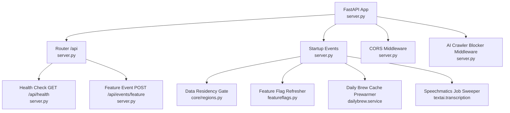
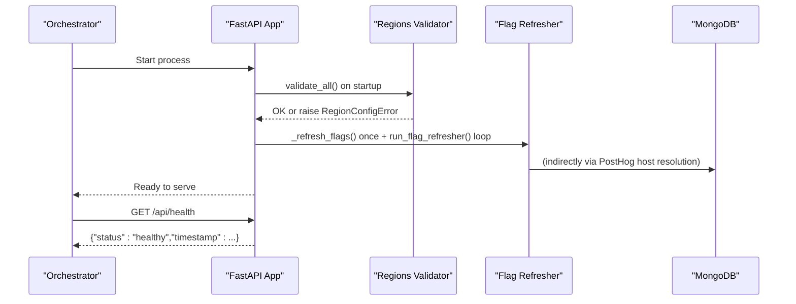
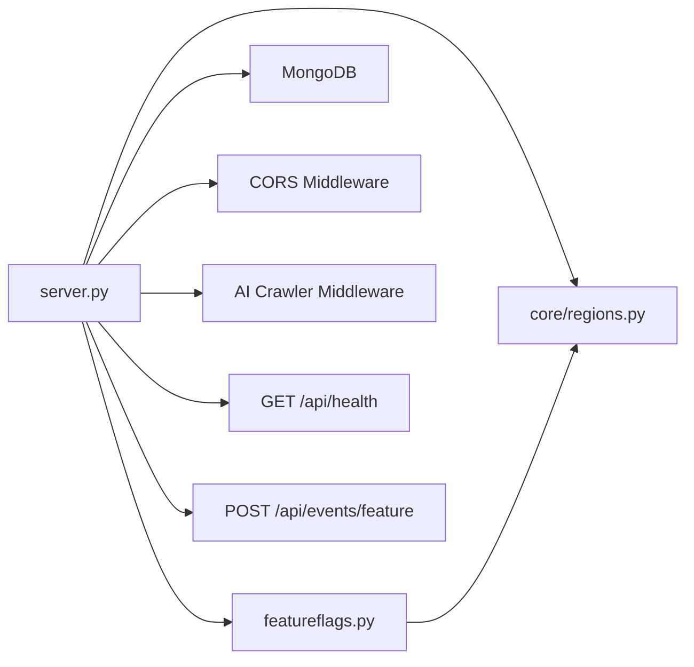

# Monitoring & Logging

<cite>
**Referenced Files in This Document**
- [server.py](file://server.py)
- [featureflags.py](file://featureflags.py)
- [core/regions.py](file://core/regions.py)
- [core/deps.py](file://core/deps.py)
- [core/repository.py](file://core/repository.py)
- [requirements.txt](file://requirements.txt)
- [tests/test_nueco_apis.py](file://tests/test_nueco_apis.py)
</cite>

## Table of Contents
1. [Introduction](#introduction)
2. [Project Structure](#project-structure)
3. [Core Components](#core-components)
4. [Architecture Overview](#architecture-overview)
5. [Detailed Component Analysis](#detailed-component-analysis)
6. [Dependency Analysis](#dependency-analysis)
7. [Performance Considerations](#performance-considerations)
8. [Troubleshooting Guide](#troubleshooting-guide)
9. [Conclusion](#conclusion)
10. [Appendices](#appendices)

## Introduction
This document explains how the Nueco Backend is monitored and logged, including:
- Built-in logging configuration using Python’s logging module
- Health check endpoints for service monitoring
- Feature flag monitoring via PostHog integration and analytics collection
- Strategies for performance metrics, request tracing, and error tracking
- Guidance to integrate external monitoring tools, log aggregation, and alerting
- Database query performance monitoring, external service call tracking, and resource utilization monitoring
- Troubleshooting workflows using logs and monitoring data

## Project Structure
The backend is a FastAPI application with modular routers and shared core utilities. Monitoring-related concerns are primarily implemented at the application entry point (startup/shutdown, middleware, health endpoint), feature flags, and region enforcement.

**Diagram sources**
- [server.py:20-27](file://server.py#L20-L27)
- [server.py:168-173](file://server.py#L168-L173)
- [server.py:310-330](file://server.py#L310-L330)
- [server.py:338-341](file://server.py#L338-L341)
- [server.py:435-459](file://server.py#L435-L459)
- [core/regions.py:144-165](file://core/regions.py#L144-L165)
- [featureflags.py:25-52](file://featureflags.py#L25-L52)

**Section sources**
- [server.py:20-27](file://server.py#L20-L27)
- [server.py:168-173](file://server.py#L168-L173)
- [server.py:310-330](file://server.py#L310-L330)
- [server.py:338-341](file://server.py#L338-L341)
- [server.py:435-459](file://server.py#L435-L459)
- [core/regions.py:144-165](file://core/regions.py#L144-L165)
- [featureflags.py:25-52](file://featureflags.py#L25-L52)

## Core Components
- Application logger: configured at startup with INFO level and a human-readable format.
- Health endpoint: returns a simple status and timestamp for liveness checks.
- Feature event ingestion: stores metadata-only usage events for first-party analytics.
- Feature flag refresh: background task that polls PostHog and caches flags server-side.
- Data residency gate: validates all external service endpoints and regions at boot.
- Startup tasks: cache prewarmer, flag refresher, job sweeper; shutdown task closes DB client.

Key responsibilities:
- Logging: central logger setup and consistent use across modules.
- Health: minimal endpoint used by orchestrators and load balancers.
- Analytics: feature events stored in MongoDB; flags resolved from PostHog.
- Compliance: enforce Australian-region declarations before serving traffic.

**Section sources**
- [server.py:23-27](file://server.py#L23-L27)
- [server.py:107-123](file://server.py#L107-L123)
- [server.py:168-173](file://server.py#L168-L173)
- [featureflags.py:25-52](file://featureflags.py#L25-L52)
- [core/regions.py:144-165](file://core/regions.py#L144-L165)
- [server.py:435-464](file://server.py#L435-L464)

## Architecture Overview
Monitoring and observability touchpoints in this codebase:
- HTTP layer: CORS and crawler-blocking middleware; no built-in request timing or structured access logs yet.
- Boot-time validation: data residency gate ensures safe external endpoints and regions.
- Background tasks: periodic refresh of feature flags and cleanup jobs.
- Analytics: feature events persisted to MongoDB; flags served from PostHog.
- Health: lightweight endpoint for orchestration probes.

**Diagram sources**
- [server.py:338-341](file://server.py#L338-L341)
- [server.py:441-450](file://server.py#L441-L450)
- [featureflags.py:25-52](file://featureflags.py#L25-L52)
- [core/regions.py:144-165](file://core/regions.py#L144-L165)
- [server.py:168-173](file://server.py#L168-L173)

## Detailed Component Analysis

### Logging Configuration
- Logger initialization: basic config sets level to INFO and a standard format including timestamp, logger name, level, and message.
- Usage: the app logger is used for startup validations and index creation outcomes.
- Structured logs: not currently enforced; consider JSON formatting for centralized log aggregation.

Recommendations:
- Add correlation IDs per request for cross-service tracing.
- Centralize structured logging with a formatter that emits JSON.
- Route logs to stdout for containerized environments and external collectors.

**Section sources**
- [server.py:23-27](file://server.py#L23-L27)
- [server.py:338-341](file://server.py#L338-L341)
- [server.py:430-432](file://server.py#L430-L432)

### Health Check Endpoint
- Endpoint: GET /api/health
- Response: includes a status string and an ISO timestamp.
- Purpose: used by orchestrators and load balancers to verify service readiness.

Validation:
- Tests assert the endpoint returns 200, status equals healthy, and timestamp is present.

**Section sources**
- [server.py:168-173](file://server.py#L168-L173)
- [tests/test_nueco_apis.py:87-96](file://tests/test_nueco_apis.py#L87-L96)

### Feature Flag Monitoring via PostHog
- Server-side resolution: a background task periodically calls PostHog’s decide endpoint using a project API key and a fixed distinct_id.
- Caching: resolved flags are cached in-process; clients receive flag values through normal user fields rather than calling PostHog directly.
- Failure behavior: errors are logged; the process retries on a schedule.

Integration points:
- Host is resolved via a residency-checked accessor to ensure only allowed regions are used.
- Initial fetch is attempted before serving traffic to avoid fail-closed defaults on first requests.

**Section sources**
- [featureflags.py:1-52](file://featureflags.py#L1-L52)
- [core/regions.py:211-212](file://core/regions.py#L211-L212)
- [server.py:441-450](file://server.py#L441-L450)

### First-Party Analytics Collection
- Endpoint: POST /api/events/feature
- Payload: event name and metadata dict, size-limited to prevent abuse.
- Storage: inserted into a dedicated MongoDB collection with user_id and timestamp.
- Purpose: track feature usage without storing sensitive content.

Operational notes:
- Enforces strict limits on event name length and serialized metadata size.
- Requires authentication via current user dependency.

**Section sources**
- [server.py:107-123](file://server.py#L107-L123)
- [core/deps.py:24-50](file://core/deps.py#L24-L50)

### Request Tracing and Metrics
Current state:
- No built-in request-level timing, metrics, or distributed tracing middleware is present in the codebase.
- The AI crawler blocker middleware adds response headers but does not measure latency.

Recommended additions:
- Add a middleware to record request duration, method, path, status code, and user context.
- Emit structured logs with correlation IDs for end-to-end tracing.
- Integrate a metrics library (e.g., Prometheus client) to expose counters and histograms.

[No sources needed since this section provides general guidance]

### Error Tracking Strategy
Current state:
- Exceptions raised by routes return appropriate HTTP status codes.
- Startup and background tasks log warnings/errors for failures (e.g., initial flag fetch failure).

Recommended enhancements:
- Centralize exception handling to capture stack traces and contextual data.
- Integrate an error reporting service to aggregate exceptions and alerts.

**Section sources**
- [server.py:441-450](file://server.py#L441-L450)
- [core/regions.py:144-165](file://core/regions.py#L144-L165)

### Database Query Performance Monitoring
Current state:
- Indexes are created at startup to optimize queries across collections (notes, events, trips, push tokens, sessions, devices, user keys, feature events).
- Shadow-mode transcription records have TTL indexes to auto-expire after seven days.

Observability recommendations:
- Enable slow query logging in MongoDB and forward logs to your log aggregator.
- Track query execution times in application logs around critical read/write paths.
- Use database profiling during development and staging to identify bottlenecks.

**Section sources**
- [server.py:345-432](file://server.py#L345-L432)

### External Service Call Tracking
Current state:
- All external endpoints and regions are declared centrally and validated at boot to ensure compliance.
- Feature flags are fetched from PostHog with timeouts and error logging.

Observability recommendations:
- Wrap external calls with timing and success/failure metrics.
- Log outbound calls with correlation IDs and include destination host and status.
- Alert on repeated failures or high latency to external services.

**Section sources**
- [core/regions.py:144-165](file://core/regions.py#L144-L165)
- [featureflags.py:25-52](file://featureflags.py#L25-L52)

### Resource Utilization Monitoring
Current state:
- No built-in resource metrics are exposed.

Recommended additions:
- Expose process-level metrics (CPU, memory, GC stats) via a metrics endpoint.
- Monitor file descriptor usage and connection pool sizes (e.g., Motor/MongoDB connections).
- Set up OS-level monitoring and alerting for CPU/memory thresholds.

[No sources needed since this section provides general guidance]

## Dependency Analysis
The following diagram shows how monitoring-related components depend on each other and on core services.

**Diagram sources**
- [server.py:20-27](file://server.py#L20-L27)
- [server.py:168-173](file://server.py#L168-L173)
- [server.py:310-330](file://server.py#L310-L330)
- [server.py:338-341](file://server.py#L338-L341)
- [featureflags.py:25-52](file://featureflags.py#L25-L52)
- [core/regions.py:144-165](file://core/regions.py#L144-L165)

**Section sources**
- [server.py:20-27](file://server.py#L20-L27)
- [server.py:168-173](file://server.py#L168-L173)
- [server.py:310-330](file://server.py#L310-L330)
- [server.py:338-341](file://server.py#L338-L341)
- [featureflags.py:25-52](file://featureflags.py#L25-L52)
- [core/regions.py:144-165](file://core/regions.py#L144-L165)

## Performance Considerations
- Ensure the health endpoint remains lightweight and fast.
- Keep feature flag refresh intervals reasonable to balance freshness and network overhead.
- Validate that background tasks do not block request processing.
- Monitor MongoDB index usage and query plans to maintain optimal performance.
- Avoid logging large payloads or sensitive data in logs.

[No sources needed since this section provides general guidance]

## Troubleshooting Guide
Common issues and how to investigate them using logs and monitoring:

- Service appears unhealthy:
  - Check GET /api/health responses from orchestrators.
  - Review startup logs for data residency validation errors.

- Feature flags not updating:
  - Inspect logs for flag refresh errors and retry cycles.
  - Verify PostHog host and API key configuration and network reachability.

- Slow or failing database operations:
  - Confirm indexes were created successfully at startup.
  - Enable slow query logs and correlate with application logs using correlation IDs.

- External service failures:
  - Look for region-check errors during boot and runtime.
  - Check outbound call logs and metrics for timeouts or errors.

- High error rates:
  - Aggregate HTTP error responses and correlate with request logs.
  - Identify patterns by endpoint, user, or payload characteristics.

**Section sources**
- [server.py:168-173](file://server.py#L168-L173)
- [server.py:338-341](file://server.py#L338-L341)
- [featureflags.py:25-52](file://featureflags.py#L25-L52)
- [server.py:345-432](file://server.py#L345-L432)
- [core/regions.py:144-165](file://core/regions.py#L144-L165)

## Conclusion
The Nueco Backend includes essential monitoring foundations:
- A simple health endpoint for orchestration probes
- Basic logging with INFO level and a readable format
- Feature flag monitoring via PostHog with server-side caching
- First-party analytics collection for feature usage
- Robust startup validation for external service endpoints and regions

To mature observability, add structured request logging, metrics collection, distributed tracing, and centralized error tracking. These enhancements will improve incident detection, diagnosis, and overall system reliability.

[No sources needed since this section summarizes without analyzing specific files]

## Appendices

### Setup for External Monitoring Tools
- Log Aggregation:
  - Configure stdout-based logging and ship logs to a collector (e.g., Fluent Bit, Filebeat).
  - Use structured JSON logs for easier parsing and querying.

- Metrics:
  - Introduce a metrics library and expose a /metrics endpoint for scraping.
  - Collect HTTP request counts, latencies, and error rates.

- Distributed Tracing:
  - Add correlation IDs to request/response logs.
  - Instrument external calls with trace context propagation.

- Alerting:
  - Define alerts for health endpoint failures, high error rates, and slow queries.
  - Alert on feature flag refresh failures and external service timeouts.

[No sources needed since this section provides general guidance]