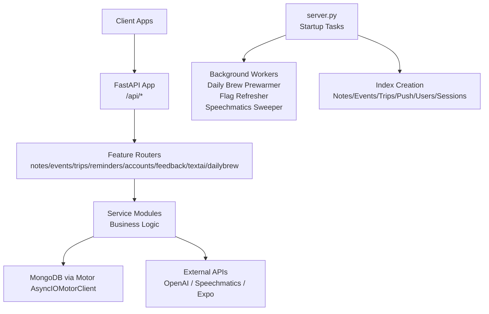
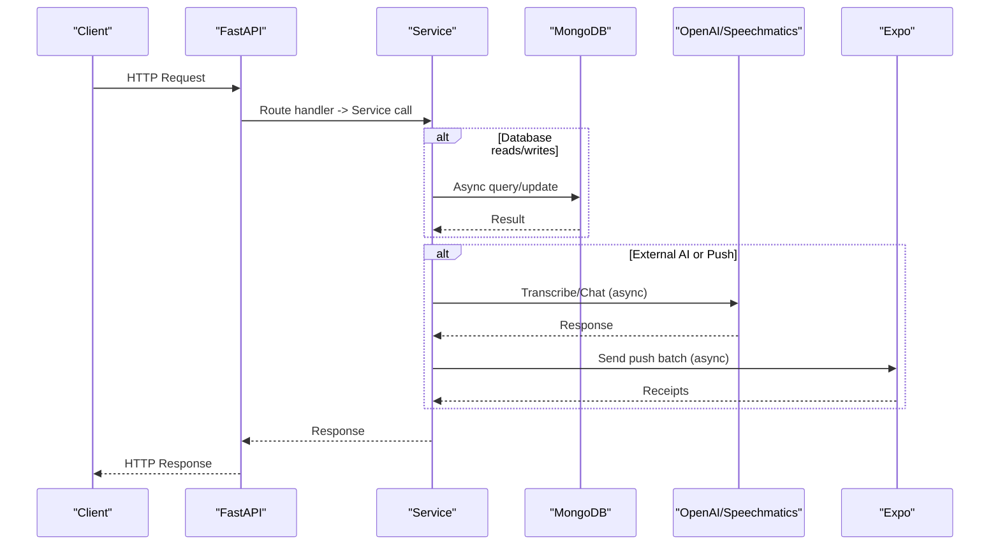
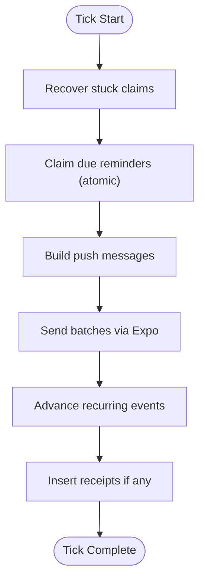
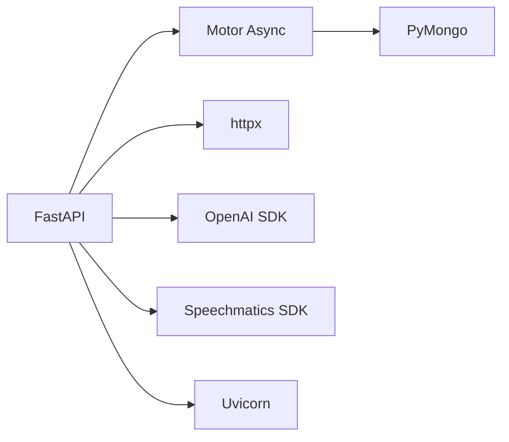

# Scaling & Performance

<cite>
**Referenced Files in This Document**
- [server.py](file://server.py)
- [core/ratelimit.py](file://core/ratelimit.py)
- [core/repository.py](file://core/repository.py)
- [openai_client.py](file://openai_client.py)
- [textai/service.py](file://textai/service.py)
- [textai/transcription.py](file://textai/transcription.py)
- [reminders/service.py](file://reminders/service.py)
- [reminders/expo_client.py](file://reminders/expo_client.py)
- [dailybrew/service.py](file://dailybrew/service.py)
- [requirements.txt](file://requirements.txt)
</cite>

## Table of Contents
1. Introduction
2. Project Structure
3. Core Components
4. Architecture Overview
5. Detailed Component Analysis
6. Dependency Analysis
7. Performance Considerations
8. Troubleshooting Guide
9. Conclusion
10. Appendices

## Introduction
This document provides comprehensive scaling and performance guidance for the Nueco Backend, focusing on horizontal scaling with FastAPI’s async capabilities, MongoDB connection pooling and indexing, rate limiting, background jobs, caching strategies, memory management, and external service integrations (OpenAI, Speechmatics, Expo push). It also includes guidance for load testing, benchmarking, bottleneck identification, and database scaling patterns such as sharding and read replicas.

## Project Structure
The backend is organized by feature modules (notes, events, trips, reminders, accounts, feedback, textai, dailybrew, etc.) with shared core utilities for dependencies, user-scoped data access, rate limiting, and region enforcement. The application server wires routers, startup tasks, indexes, and background workers.

**Diagram sources**
- [server.py:16-21](file://server.py#L16-L21)
- [server.py:338-460](file://server.py#L338-L460)
- [dailybrew/service.py:209-220](file://dailybrew/service.py#L209-L220)
- [textai/transcription.py:354-360](file://textai/transcription.py#L354-L360)

**Section sources**
- [server.py:16-21](file://server.py#L16-L21)
- [server.py:338-460](file://server.py#L338-L460)

## Core Components
- Asynchronous HTTP server using FastAPI with Motor async MongoDB client.
- User-scoped data access wrapper to enforce tenant isolation.
- In-process sliding-window rate limiter for AI endpoints.
- Background workers for Daily Brew cache prewarming, feature flag refresh, and Speechmatics job cleanup.
- Transcription providers (OpenAI Whisper and Speechmatics) with retry/backoff and shadow mode.
- Reminder delivery pipeline with atomic claim-and-send and receipt resolution.

**Section sources**
- [server.py:16-21](file://server.py#L16-L21)
- [core/repository.py:27-94](file://core/repository.py#L27-L94)
- [core/ratelimit.py:41-124](file://core/ratelimit.py#L41-L124)
- [textai/transcription.py:78-133](file://textai/transcription.py#L78-L133)
- [textai/transcription.py:171-286](file://textai/transcription.py#L171-L286)
- [reminders/service.py:37-177](file://reminders/service.py#L37-L177)

## Architecture Overview
The system uses an event-driven, non-blocking architecture:
- FastAPI handles requests asynchronously; services perform I/O-bound operations concurrently.
- MongoDB interactions are fully async via Motor.
- Background tasks run independently for periodic maintenance and cache warming.
- External API calls (OpenAI, Speechmatics, Expo) are wrapped with timeouts, retries, and backoff where applicable.

**Diagram sources**
- [textai/service.py:112-130](file://textai/service.py#L112-L130)
- [textai/transcription.py:171-286](file://textai/transcription.py#L171-L286)
- [reminders/service.py:93-118](file://reminders/service.py#L93-L118)

## Detailed Component Analysis

### Horizontal Scaling with FastAPI and MongoDB
- FastAPI runs on an ASGI server (Uvicorn) and scales horizontally by running multiple worker processes behind a reverse proxy. Each process maintains its own in-memory state (e.g., rate limiter), so global limits must be coordinated at the proxy or via a shared store when scaling beyond one instance.
- MongoDB connection is created once per process using Motor’s AsyncIOMotorClient. For high concurrency, tune the underlying PyMongo connection pool settings (maxPoolSize, minPoolSize, maxIdleTimeMS) via the connection string or client options to match expected concurrent queries per process.
- Ensure each replica has sufficient CPU/memory to handle async I/O bursts; monitor CPU utilization and context switching under load.

Recommendations:
- Use a process manager (e.g., Gunicorn with uvicorn workers) to scale horizontally.
- Configure MongoDB connection pool sizes based on measured concurrent connections per process.
- Monitor slow queries and index usage via MongoDB profiling and explain plans.

**Section sources**
- [server.py:16-18](file://server.py#L16-L18)
- [requirements.txt:57-83](file://requirements.txt#L57-L83)

### Database Indexing Strategy and Query Performance
Indexes are created at startup to optimize common queries and pagination:
- Notes: compound indexes for user_id + is_pinned + updated_at (+ id tiebreaker) and user_id + id, plus user_id + has_attachments.
- Events: user_id + start_time (+ id tiebreaker), user_id + id, id, partial index for pending reminders (reminder_status = "pending"), and trip_id + user_id.
- Trips: user_id + created_at (+ id tiebreaker), user_id + id.
- Push tokens: user_id + active, token; push_receipts: checked + created_at.
- Users: email unique sparse, id unique sparse.
- Sessions: expires_at TTL, user_id.
- Devices: user_id.
- Key escrow and telemetry: user_keys user_id unique; feature_events event+ts and user_id+ts.
- Shadow transcription collection: created_at TTL.

Impact:
- Eliminates in-memory sorts and full scans for list views and paging.
- Partial indexes reduce overhead for reminder scheduling by indexing only pending items.
- TTL indexes auto-expire sessions and shadow records.

Operational notes:
- Stale indexes are dropped before creating new ones to avoid write amplification.
- Rolling deployments keep older indices temporarily to prevent blocking during transitions.

**Section sources**
- [server.py:344-433](file://server.py#L344-L433)

### Rate Limiting Implementation and Configuration
- Sliding-window limiter implemented in-process with per-user and global quotas for AI endpoints.
- Quotas:
  - Transcription: 10 per 60 seconds per user.
  - Voice intent: 20 per 60 seconds per user.
  - Text processing: 15 per 60 seconds per user.
  - Global AI quota: 120 per 60 seconds across all users.
- Decision includes Retry-After seconds to guide client backoff.
- Known limitation: state resets on deploy; not shared across instances. For horizontal scaling, move to Redis-backed limiter.

Configuration:
- Adjust Quota values in core/ratelimit.py to match OpenAI plan limits and desired UX.
- Add middleware or router-level checks to return 429 with Retry-After header.

Scaling considerations:
- With N replicas, effective limit becomes N times configured value unless centralized.
- Consider moving to distributed rate limiting (Redis) when scaling horizontally.

**Section sources**
- [core/ratelimit.py:1-124](file://core/ratelimit.py#L1-L124)

### Memory Management, Garbage Collection, and Resource Optimization
- Audio handling:
  - OpenAI provider writes audio to temporary files and deletes them after use to avoid large in-memory buffers.
  - Speechmatics provider uses BytesIO with a name attribute for job submission and ensures job deletion even on errors.
- Background tasks:
  - Fire-and-forget tasks for shadow transcriptions maintain a task set to prevent garbage collection mid-flight.
  - Daily Brew prewarmer and feature flag refresher run indefinitely with error handling and sleep intervals.
- External clients:
  - httpx.AsyncClient used with explicit timeouts to avoid resource leaks and long-lived connections.

Optimization tips:
- Tune Python GC thresholds if profiling shows frequent collections impacting latency.
- Monitor process memory growth; ensure temp files are cleaned up promptly.
- Use connection pooling for external HTTP clients where appropriate.

**Section sources**
- [textai/transcription.py:78-133](file://textai/transcription.py#L78-L133)
- [textai/transcription.py:171-286](file://textai/transcription.py#L171-L286)
- [textai/transcription.py:428-449](file://textai/transcription.py#L428-L449)
- [dailybrew/service.py:209-220](file://dailybrew/service.py#L209-L220)
- [reminders/expo_client.py:26-49](file://reminders/expo_client.py#L26-L49)

### Caching Strategies
- In-memory outlet cache for Daily Brew news:
  - Per-outlet cache with TTL (15 minutes).
  - Concurrency guard using asyncio.Lock to prevent thundering herds.
  - Background prewarmer keeps caches warm; request path reads from cache only.
- Feature flags:
  - In-memory cache refreshed periodically; initial fetch at startup to avoid cold starts.

Scaling considerations:
- In-memory cache is single-process; for multi-replica deployments, consider Redis-backed cache to share state.
- Cache invalidation strategy should align with upstream feed update frequency.

**Section sources**
- [dailybrew/service.py:20-34](file://dailybrew/service.py#L20-L34)
- [dailybrew/service.py:168-203](file://dailybrew/service.py#L168-L203)
- [dailybrew/service.py:209-220](file://dailybrew/service.py#L209-L220)

### Background Job Processing and Asynchronous Task Handling
- Reminder tick:
  - Atomic claim of due reminders using find_one_and_update to prevent double-sends.
  - Batch sending via Expo (up to 100 messages per call).
  - Receipt resolution every 15–20 minutes to clean stale tokens.
- Daily Brew prewarmer:
  - Periodically fetches and parses RSS/Atom feeds, caches results, and serves fast responses.
- Feature flag refresher:
  - Periodically refreshes flags from remote source; fails closed until first refresh.
- Speechmatics sweeper:
  - Deletes stale jobs older than threshold to minimize provider-side retention.

**Diagram sources**
- [reminders/service.py:44-177](file://reminders/service.py#L44-L177)

**Section sources**
- [reminders/service.py:44-177](file://reminders/service.py#L44-L177)
- [dailybrew/service.py:209-220](file://dailybrew/service.py#L209-L220)
- [textai/transcription.py:354-360](file://textai/transcription.py#L354-L360)

### External Service Integrations: OpenAI, Speechmatics, Firebase/Expo
- OpenAI:
  - Async client with base URL pinned to region-checked endpoint.
  - Used for chat completions (organize, summarize, smart format) and Whisper transcription.
  - Rate limiting enforced server-side to protect shared quota.
- Speechmatics:
  - Batch transcription with retry/backoff on 429 errors.
  - Immediate job deletion to minimize retention; reconciliation sweep cleans stale jobs.
  - Optional diarization support.
- Expo push notifications:
  - Batching up to 100 messages per call; receipt polling up to 300 tickets.
  - Graceful handling of transport failures; events remain claimed for retry.

Scaling considerations:
- Respect provider rate limits and implement exponential backoff with jitter.
- Pin endpoints to region-compliant URLs to satisfy data residency requirements.
- Monitor latency and error rates; adjust timeouts and batch sizes accordingly.

**Section sources**
- [openai_client.py:15-24](file://openai_client.py#L15-L24)
- [textai/service.py:133-232](file://textai/service.py#L133-L232)
- [textai/transcription.py:171-286](file://textai/transcription.py#L171-L286)
- [reminders/expo_client.py:26-49](file://reminders/expo_client.py#L26-L49)

### Database Sharding, Read Replicas, and Connection Pool Sizing
- Sharding:
  - Shard keys should align with common query patterns (e.g., user_id for user-scoped collections).
  - Compound indexes should be considered alongside shard keys to optimize query routing.
- Read replicas:
  - Offload read-heavy workloads (list views, analytics) to replicas.
  - Ensure eventual consistency expectations are clear for features like Daily Brew cache and telemetry.
- Connection pool sizing:
  - Tune maxPoolSize and minPoolSize per process to match expected concurrency.
  - Monitor connection waits and slow queries; adjust pool size and query patterns accordingly.

Best practices:
- Use connection pooling libraries’ recommended defaults initially; measure and adjust.
- Avoid long-running transactions; prefer short, focused operations.
- Profile queries with explain() to validate index usage and avoid full scans.

[No sources needed since this section provides general guidance]

## Dependency Analysis
Key runtime dependencies:
- FastAPI and Starlette for async HTTP serving.
- Motor and PyMongo for async MongoDB access.
- httpx for asynchronous HTTP calls to external services.
- OpenAI SDK for chat and transcription.
- Speechmatics batch SDK for advanced transcription.
- Uvicorn as ASGI server.

**Diagram sources**
- [requirements.txt:22-23](file://requirements.txt#L22-L23)
- [requirements.txt:57-83](file://requirements.txt#L57-L83)
- [requirements.txt:63-64](file://requirements.txt#L63-L64)
- [requirements.txt:104-116](file://requirements.txt#L104-L116)

**Section sources**
- [requirements.txt:22-23](file://requirements.txt#L22-L23)
- [requirements.txt:57-83](file://requirements.txt#L57-L83)
- [requirements.txt:63-64](file://requirements.txt#L63-L64)
- [requirements.txt:104-116](file://requirements.txt#L104-L116)

## Performance Considerations
- Async I/O:
  - All database and external calls are async; ensure no blocking operations in hot paths.
  - Use asyncio.gather for parallelism where safe (e.g., fetching multiple outlets).
- Index coverage:
  - Verify that list views and paging are fully covered by indexes to avoid in-memory sorts.
- Backpressure:
  - Implement rate limiting and circuit breakers for external services to prevent cascading failures.
- Timeouts:
  - Set reasonable timeouts for external calls; fail fast and degrade gracefully.
- Monitoring:
  - Track p95/p99 latencies, error rates, and throughput per endpoint.
  - Use MongoDB profiling and APM tools to identify bottlenecks.

[No sources needed since this section provides general guidance]

## Troubleshooting Guide
Common issues and mitigations:
- Slow queries:
  - Check index usage with explain(); add or adjust compound indexes as needed.
- Rate-limited external calls:
  - Increase retry budgets and backoff caps; verify provider limits.
- Stuck reminders:
  - Recovery logic reclaims claims older than threshold; ensure cron ticks run reliably.
- Cache staleness:
  - Adjust Daily Brew TTL and prewarm interval; consider shared cache for multi-replica setups.
- Memory pressure:
  - Monitor process memory; ensure temp files are deleted; tune GC if necessary.

**Section sources**
- [server.py:344-433](file://server.py#L344-L433)
- [textai/transcription.py:235-251](file://textai/transcription.py#L235-L251)
- [reminders/service.py:44-67](file://reminders/service.py#L44-L67)
- [dailybrew/service.py:209-220](file://dailybrew/service.py#L209-L220)

## Conclusion
The Nueco Backend leverages FastAPI’s async model and Motor for efficient I/O-bound operations, with robust indexing and background workers to maintain performance. Rate limiting protects shared AI quotas, while caching reduces cold-start costs. For horizontal scaling, adopt distributed rate limiting, shared caches, and tuned MongoDB connection pools. Continuously monitor and profile to identify and resolve bottlenecks.

[No sources needed since this section summarizes without analyzing specific files]

## Appendices

### Load Testing and Benchmarking Guidance
- Define SLOs for latency and throughput per endpoint.
- Use realistic payloads and concurrency levels; simulate peak traffic patterns.
- Measure p50/p95/p99 latencies, error rates, and resource utilization.
- Validate index effectiveness under load; adjust as data grows.

[No sources needed since this section provides general guidance]

### Bottleneck Identification Techniques
- Enable MongoDB profiling for slow queries; analyze explain plans.
- Instrument external API calls for latency and error rates.
- Use APM tools to trace request flows and identify hotspots.
- Monitor CPU, memory, and I/O metrics; correlate with request patterns.

[No sources needed since this section provides general guidance]