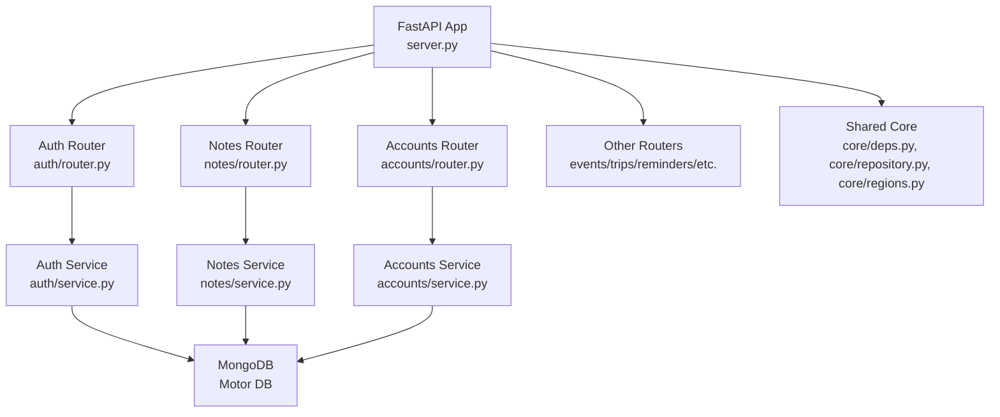
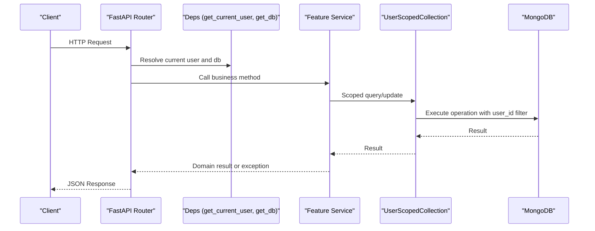
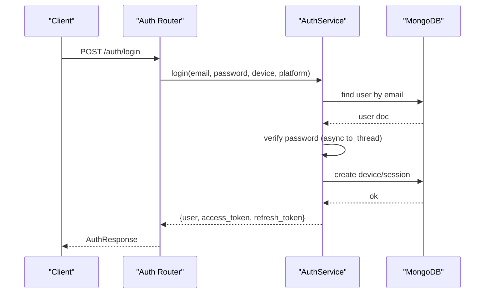
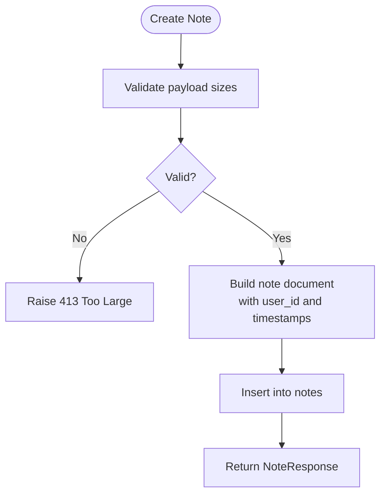
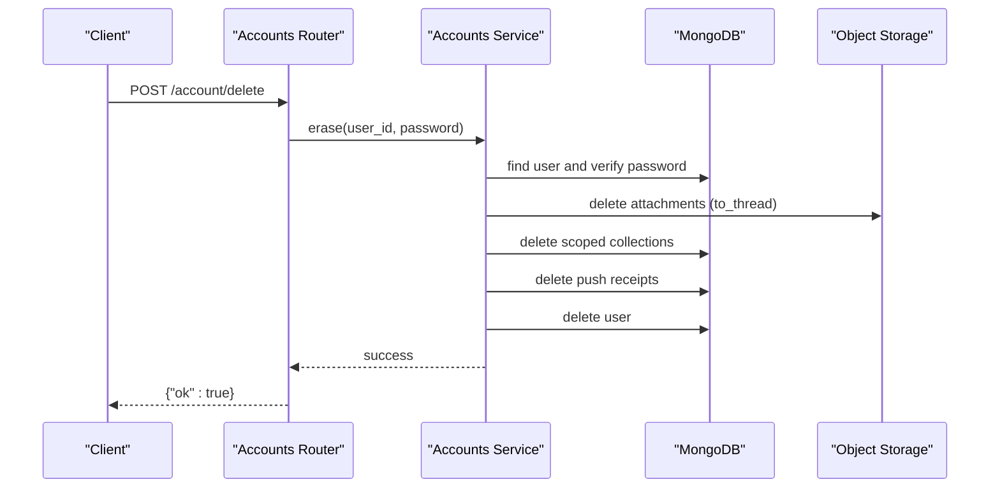
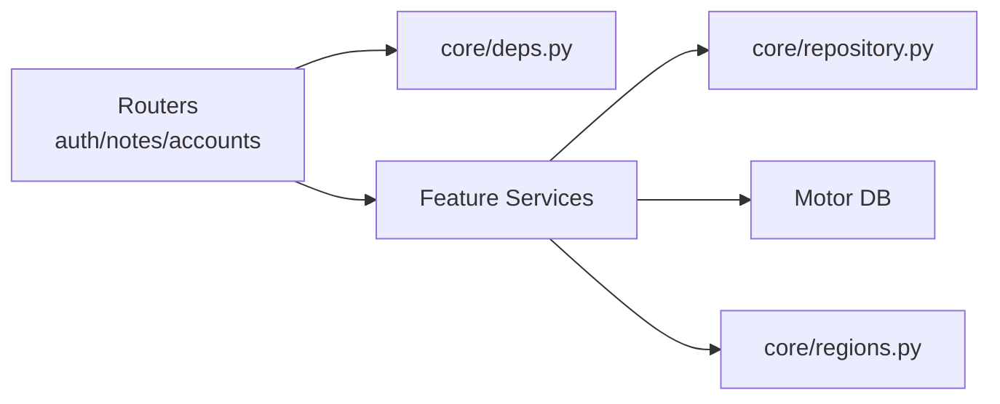

# Coding Standards & Conventions

<cite>
**Referenced Files in This Document**
- [server.py](file://server.py)
- [core/repository.py](file://core/repository.py)
- [core/deps.py](file://core/deps.py)
- [core/regions.py](file://core/regions.py)
- [auth/router.py](file://auth/router.py)
- [auth/service.py](file://auth/service.py)
- [auth/schemas.py](file://auth/schemas.py)
- [accounts/router.py](file://accounts/router.py)
- [accounts/service.py](file://accounts/service.py)
- [accounts/schemas.py](file://accounts/schemas.py)
- [notes/router.py](file://notes/router.py)
- [notes/service.py](file://notes/service.py)
- [notes/schemas.py](file://notes/schemas.py)
- [featureflags.py](file://featureflags.py)
- [requirements.txt](file://requirements.txt)
</cite>

## Table of Contents
1. [Introduction](#introduction)
2. [Project Structure](#project-structure)
3. [Core Components](#core-components)
4. [Architecture Overview](#architecture-overview)
5. [Detailed Component Analysis](#detailed-component-analysis)
6. [Dependency Analysis](#dependency-analysis)
7. [Performance Considerations](#performance-considerations)
8. [Troubleshooting Guide](#troubleshooting-guide)
9. [Conclusion](#conclusion)
10. [Appendices](#appendices)

## Introduction
This document defines the coding standards and conventions for the Nueco Backend. It covers Python style guidelines, architectural patterns (service layer, repository pattern via user-scoped collections, dependency injection), file organization by feature modules, error handling, logging, type hinting, FastAPI endpoint patterns, Pydantic models, async/await usage, database query patterns with MongoDB, index optimization, and code quality tooling.

## Project Structure
The backend is organized by feature modules under a top-level FastAPI application:
- server.py: Application bootstrap, global middleware, startup tasks, and router aggregation
- Feature folders: accounts, attachments, auth, canva, dailybrew, events, feedback, notes, reminders, textai, trips
- core/: shared infrastructure (dependencies, repository seam, region enforcement)
- scripts/, static/, tests/: utilities, static assets, and tests

**Diagram sources**
- [server.py:1-214](file://server.py#L1-L214)
- [auth/router.py:1-366](file://auth/router.py#L1-L366)
- [notes/router.py:1-100](file://notes/router.py#L1-L100)
- [accounts/router.py:1-25](file://accounts/router.py#L1-L25)
- [auth/service.py:1-506](file://auth/service.py#L1-L506)
- [notes/service.py:1-226](file://notes/service.py#L1-L226)
- [accounts/service.py:1-108](file://accounts/service.py#L1-L108)
- [core/deps.py:1-51](file://core/deps.py#L1-L51)
- [core/repository.py:1-95](file://core/repository.py#L1-L95)
- [core/regions.py:1-230](file://core/regions.py#L1-L230)

**Section sources**
- [server.py:1-214](file://server.py#L1-L214)

## Core Components
- Dependency injection: FastAPI dependencies provide authenticated user and database access consistently across routers.
- Repository seam: User-scoped collection wrapper enforces tenant isolation on all data operations.
- Region enforcement: Centralized configuration validates external endpoints and regions at boot and per call.
- Feature flags: Server-side cached flag resolution to gate features like Daily Brew.

Key responsibilities:
- server.py: app setup, CORS, middleware, startup tasks, index creation, router inclusion
- core/deps.py: get_db and get_current_user dependencies
- core/repository.py: UserScopedCollection enforcing user_id scoping
- core/regions.py: validated accessors for external service endpoints and regions
- featureflags.py: background refresh of feature flags from analytics provider

**Section sources**
- [core/deps.py:1-51](file://core/deps.py#L1-L51)
- [core/repository.py:1-95](file://core/repository.py#L1-L95)
- [core/regions.py:1-230](file://core/regions.py#L1-L230)
- [featureflags.py:1-53](file://featureflags.py#L1-L53)
- [server.py:320-465](file://server.py#L320-L465)

## Architecture Overview
The system follows a layered architecture:
- Presentation layer: FastAPI routers define HTTP endpoints, validate inputs via Pydantic, and delegate to services.
- Service layer: Business logic encapsulated in feature-specific services; framework-agnostic, raising domain exceptions.
- Data access: Motor async client interacts with MongoDB; user-scoped collection ensures tenant isolation.
- Cross-cutting: Authentication, rate limiting, region checks, logging, and background tasks.

**Diagram sources**
- [core/deps.py:15-51](file://core/deps.py#L15-L51)
- [core/repository.py:27-95](file://core/repository.py#L27-L95)
- [notes/router.py:17-40](file://notes/router.py#L17-L40)
- [notes/service.py:83-148](file://notes/service.py#L83-L148)

## Detailed Component Analysis

### Authentication and Authorization
- Endpoints are protected using a dependency that verifies bearer tokens and returns the current user document.
- Rate limiting is implemented per IP and per email for sensitive endpoints.
- JWT-based sessions bind access tokens to session IDs; logout invalidates sessions.

Patterns:
- Use Depends(get_current_user) to enforce authentication on endpoints.
- Validate request payloads with Pydantic models.
- Raise HTTPException with appropriate status codes for errors.

**Diagram sources**
- [auth/router.py:115-140](file://auth/router.py#L115-L140)
- [auth/service.py:202-273](file://auth/service.py#L202-L273)

**Section sources**
- [auth/router.py:1-366](file://auth/router.py#L1-L366)
- [auth/service.py:1-506](file://auth/service.py#L1-L506)
- [auth/schemas.py:1-80](file://auth/schemas.py#L1-L80)

### Notes Feature
- CRUD endpoints for notes with pagination and pin toggling.
- Payload validation enforces size limits for title, content, images, and objects.
- Uses user-scoped queries to ensure tenant isolation.

Patterns:
- Service raises domain exceptions; router translates to HTTP responses.
- Async list uses index-covered sorting and deterministic tiebreakers.

**Diagram sources**
- [notes/router.py:17-28](file://notes/router.py#L17-L28)
- [notes/service.py:30-65](file://notes/service.py#L30-L65)
- [notes/service.py:83-111](file://notes/service.py#L83-L111)

**Section sources**
- [notes/router.py:1-100](file://notes/router.py#L1-L100)
- [notes/service.py:1-226](file://notes/service.py#L1-L226)
- [notes/schemas.py:1-100](file://notes/schemas.py#L1-L100)

### Accounts Erasure
- GDPR-compliant account deletion erases user data across multiple collections and object storage.
- Requires password confirmation; uses CPU-bound bcrypt offloaded to threads to avoid blocking the event loop.

Patterns:
- Service enumerates scoped collections to delete user data atomically where possible.
- Best-effort cleanup for external storage; failures logged but do not resurrect data.

**Diagram sources**
- [accounts/router.py:11-24](file://accounts/router.py#L11-L24)
- [accounts/service.py:60-108](file://accounts/service.py#L60-L108)

**Section sources**
- [accounts/router.py:1-25](file://accounts/router.py#L1-L25)
- [accounts/service.py:1-108](file://accounts/service.py#L1-L108)
- [accounts/schemas.py:1-6](file://accounts/schemas.py#L1-L6)

### Data Residency and External Services
- All external endpoints and regions must be declared via environment variables and validated at startup.
- Typed accessors re-validate on each call to prevent drift.

Patterns:
- Fail-closed boot: missing or non-Australian region declarations abort startup.
- Strict URL scheme checks and normalized region values.

**Section sources**
- [core/regions.py:1-230](file://core/regions.py#L1-L230)
- [server.py:333-342](file://server.py#L333-L342)

### Feature Flags
- Background task periodically fetches feature flags from analytics provider and caches results.
- Endpoints read cached flags to avoid per-request network calls.

**Section sources**
- [featureflags.py:1-53](file://featureflags.py#L1-L53)
- [server.py:441-450](file://server.py#L441-L450)

## Dependency Analysis
- Routers depend on core dependencies for authentication and database access.
- Services depend on Motor and optional helpers (e.g., attachments).
- The repository seam centralizes user scoping to prevent cross-account data leaks.

**Diagram sources**
- [core/deps.py:1-51](file://core/deps.py#L1-L51)
- [core/repository.py:1-95](file://core/repository.py#L1-L95)
- [core/regions.py:1-230](file://core/regions.py#L1-L230)
- [auth/router.py:1-366](file://auth/router.py#L1-L366)
- [notes/router.py:1-100](file://notes/router.py#L1-L100)
- [accounts/router.py:1-25](file://accounts/router.py#L1-L25)

**Section sources**
- [core/deps.py:1-51](file://core/deps.py#L1-L51)
- [core/repository.py:1-95](file://core/repository.py#L1-L95)
- [core/regions.py:1-230](file://core/regions.py#L1-L230)

## Performance Considerations
- Index coverage: Queries use indexes to avoid in-memory sorts and large scans.
- Deterministic paging: Tiebreaker fields ensure stable ordering across pages.
- CPU-bound tasks: Offload heavy operations (bcrypt, S3 listing) to threads to keep the event loop responsive.
- Startup tasks: Create indexes and prewarm caches before serving traffic.

Index strategy highlights:
- Compound indexes match sort orders used in list queries.
- Partial indexes reduce scan sets for pending reminders.
- TTL indexes auto-expire temporary records.

**Section sources**
- [server.py:344-433](file://server.py#L344-L433)
- [notes/service.py:113-148](file://notes/service.py#L113-L148)
- [auth/service.py:50-61](file://auth/service.py#L50-L61)
- [accounts/service.py:67-79](file://accounts/service.py#L67-L79)

## Troubleshooting Guide
Common issues and resolutions:
- Missing environment variables: Region enforcement will fail at startup; check all declared endpoint and region variables.
- Token invalid/expired: Ensure sessions exist and have not expired; verify JWT secret and algorithm.
- Large payloads: Enforced caps return 413; adjust client behavior or increase caps carefully.
- Slow bcrypt/S3 operations: Ensure they run in threads to avoid blocking the event loop.
- Index-related performance: Verify indexes created at startup; stale indexes may need explicit drops.

Logging standards:
- Use module-level logger instances.
- Log informational events for state changes (e.g., account deletion, token refresh).
- Log warnings/errors for recoverable issues (e.g., email send failures, index creation issues).

Error handling patterns:
- Routers translate service exceptions to HTTPException with appropriate status codes.
- Validation errors raise HTTPException with descriptive details.
- Background tasks catch and log exceptions without crashing the process.

**Section sources**
- [core/regions.py:144-165](file://core/regions.py#L144-L165)
- [auth/service.py:469-494](file://auth/service.py#L469-L494)
- [notes/service.py:30-65](file://notes/service.py#L30-L65)
- [accounts/service.py:74-88](file://accounts/service.py#L74-L88)
- [server.py:431-433](file://server.py#L431-L433)

## Conclusion
The Nueco Backend adheres to clear coding standards and architectural patterns:
- PEP 8-aligned naming and structure with feature-based modules
- Service layer encapsulating business logic and raising domain exceptions
- Repository seam ensuring user-scoped data access
- Dependency injection for authentication and database access
- Robust error handling, logging, and type hints
- Optimized MongoDB queries with index coverage and deterministic paging
- Automated code quality tools integrated via requirements

Adopt these conventions to maintain consistency, security, and performance across the codebase.

## Appendices

### Python Style Guidelines (PEP 8)
- Modules: lowercase with underscores (e.g., core.deps)
- Classes: PascalCase (e.g., AuthService, NotesService)
- Functions/methods: snake_case (e.g., get_current_user, _verify_password)
- Variables: snake_case (e.g., user_id, page_size)
- Constants: UPPER_SNAKE_CASE (e.g., MAX_NOTE_TITLE_CHARS, AU_REGION_ALLOWLIST)
- Imports: standard library first, third-party next, local modules last
- Type hints: prefer explicit types for function signatures and return values

### Architectural Patterns
- Service Layer Pattern: Each feature has a service module containing business logic and domain exceptions.
- Repository Pattern (scoped): UserScopedCollection wraps Motor collections to enforce tenant isolation.
- Dependency Injection: FastAPI Dependencies provide consistent access to current user and database.

### File Organization Principles
- Feature-based modules: Each feature folder contains router.py, service.py, and schemas.py
- Shared infrastructure in core/: deps, repository, regions
- Static assets in static/
- Tests in tests/
- Scripts in scripts/

### Error Handling Patterns
- Routers raise HTTPException with appropriate status codes
- Services raise domain-specific exceptions
- Background tasks catch and log exceptions without failing the process
- Validation errors handled via Pydantic and converted to HTTP responses

### Logging Standards
- Module-level logger instances
- Informational logs for significant state changes
- Warning logs for recoverable issues
- Error logs for failures requiring attention

### Type Hinting Conventions
- Explicit parameter and return types for functions
- Optional types for nullable parameters
- Typed Pydantic models for request/response validation
- Type annotations for complex data structures

### FastAPI Endpoint Implementation
- Use Depends(get_current_user) for authentication
- Validate requests with Pydantic models
- Delegate to services for business logic
- Translate service exceptions to HTTP responses
- Return typed response models

### Pydantic Model Usage
- Define separate models for requests, updates, and responses
- Use Optional fields for backward compatibility
- Include validation constraints where appropriate
- Mirror frontend types for consistency

### Async/Await Patterns
- Use async functions for I/O operations
- Offload CPU-bound tasks to threads using asyncio.to_thread
- Handle background tasks with asyncio.create_task
- Avoid blocking the event loop with synchronous operations

### Database Query Patterns
- Use user-scoped queries through UserScopedCollection
- Implement index-covered queries with proper sort orders
- Use deterministic tiebreakers for pagination
- Leverage partial indexes for filtered queries
- Apply TTL indexes for temporary data

### MongoDB Operations and Index Optimization
- Create compound indexes matching query patterns
- Drop superseded indexes explicitly during migrations
- Use sparse unique indexes for optional fields
- Monitor query performance and adjust indexes accordingly

### Code Formatting and Linting
- Black for code formatting
- Flake8 for linting
- isort for import sorting
- mypy for type checking

### Automated Code Quality Checks
- Integrate linters and formatters in CI pipeline
- Run type checking on pull requests
- Enforce code style standards automatically
- Monitor code quality metrics over time

**Section sources**
- [requirements.txt:1-121](file://requirements.txt#L1-L121)
- [server.py:1-465](file://server.py#L1-L465)
- [core/repository.py:1-95](file://core/repository.py#L1-L95)
- [core/deps.py:1-51](file://core/deps.py#L1-L51)
- [core/regions.py:1-230](file://core/regions.py#L1-L230)
- [auth/router.py:1-366](file://auth/router.py#L1-L366)
- [auth/service.py:1-506](file://auth/service.py#L1-L506)
- [auth/schemas.py:1-80](file://auth/schemas.py#L1-L80)
- [accounts/router.py:1-25](file://accounts/router.py#L1-L25)
- [accounts/service.py:1-108](file://accounts/service.py#L1-L108)
- [accounts/schemas.py:1-6](file://accounts/schemas.py#L1-L6)
- [notes/router.py:1-100](file://notes/router.py#L1-L100)
- [notes/service.py:1-226](file://notes/service.py#L1-L226)
- [notes/schemas.py:1-100](file://notes/schemas.py#L1-L100)
- [featureflags.py:1-53](file://featureflags.py#L1-L53)