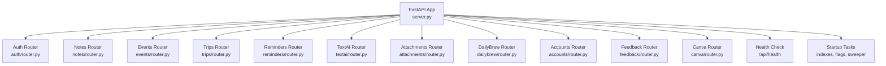
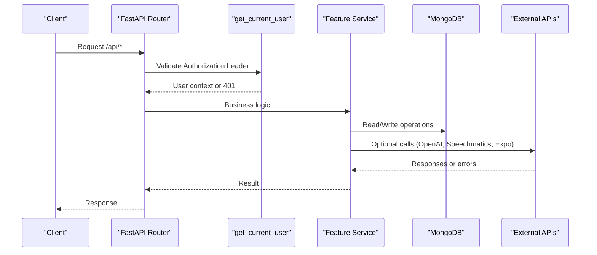
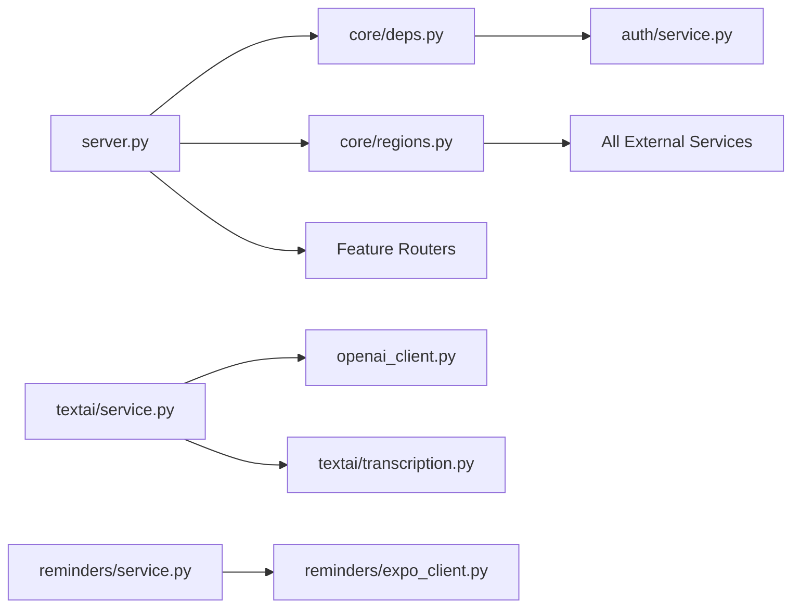

# Debugging & Troubleshooting Guide

<cite>
**Referenced Files in This Document**
- [server.py](file://server.py)
- [core/deps.py](file://core/deps.py)
- [auth/service.py](file://auth/service.py)
- [openai_client.py](file://openai_client.py)
- [textai/service.py](file://textai/service.py)
- [textai/transcription.py](file://textai/transcription.py)
- [reminders/service.py](file://reminders/service.py)
- [reminders/expo_client.py](file://reminders/expo_client.py)
- [featureflags.py](file://featureflags.py)
- [core/regions.py](file://core/regions.py)
- [core/ratelimit.py](file://core/ratelimit.py)
- [security/ssrf_guard.py](file://security/ssrf_guard.py)
</cite>

## Table of Contents
1. [Introduction](#introduction)
2. [Project Structure](#project-structure)
3. [Core Components](#core-components)
4. [Architecture Overview](#architecture-overview)
5. [Detailed Component Analysis](#detailed-component-analysis)
6. [Dependency Analysis](#dependency-analysis)
7. [Performance Considerations](#performance-considerations)
8. [Troubleshooting Guide](#troubleshooting-guide)
9. [Conclusion](#conclusion)
10. [Appendices](#appendices)

## Introduction
This guide provides comprehensive debugging and troubleshooting practices for the Nueco Backend. It covers logging strategies, structured logging patterns, log levels, and how to aggregate logs effectively. It also explains debugging techniques for common issues such as authentication failures, database connection problems, and external API errors. You will find performance profiling methods, memory leak detection approaches, and bottleneck identification strategies. The guide documents monitoring approaches using application metrics, health checks, and alerting systems. Finally, it includes component-specific troubleshooting guides for MongoDB queries, OpenAI API calls, Speechmatics transcription, and push notification delivery, along with debugging tools setup, remote debugging techniques, and production considerations.

## Project Structure
The backend is a FastAPI application with modular routers per feature (notes, events, trips, reminders, accounts, feedback, textai, attachments, canva, dailybrew). Core concerns like dependencies, rate limiting, data residency validation, and shared utilities live under core/. Background tasks include index creation, cache prewarming, feature flag refresh, and speech job reconciliation.

**Diagram sources**
- [server.py:20-214](file://server.py#L20-L214)
- [server.py:338-465](file://server.py#L338-L465)

**Section sources**
- [server.py:1-214](file://server.py#L1-L214)
- [server.py:338-465](file://server.py#L338-L465)

## Core Components
- Application bootstrap and middleware: CORS, anti-crawler middleware, startup hooks for data residency validation, index creation, background tasks, and shutdown.
- Authentication dependency: token verification and user resolution via AuthService.
- External service configuration: region-gated endpoints for OpenAI, Speechmatics, Expo, S3, PostHog, Canva, and MongoDB.
- Text processing and transcription: OpenAI chat completions and audio transcription providers (OpenAI Whisper, Speechmatics).
- Reminder pipeline: claim due reminders, send via Expo, track receipts, advance recurring events.
- Feature flags: server-side resolution from PostHog with periodic refresh.
- Rate limiting: per-user and global quotas for AI-related endpoints.

**Section sources**
- [server.py:23-27](file://server.py#L23-L27)
- [core/deps.py:15-51](file://core/deps.py#L15-L51)
- [core/regions.py:22-87](file://core/regions.py#L22-L87)
- [textai/service.py:112-232](file://textai/service.py#L112-L232)
- [textai/transcription.py:78-321](file://textai/transcription.py#L78-L321)
- [reminders/service.py:37-215](file://reminders/service.py#L37-L215)
- [featureflags.py:25-52](file://featureflags.py#L25-L52)
- [core/ratelimit.py:55-88](file://core/ratelimit.py#L55-L88)

## Architecture Overview
The system follows a layered architecture:
- HTTP layer (FastAPI routers) handles request validation, auth, and routing.
- Service layer implements business logic and orchestrates external services.
- Data layer uses Motor async client to interact with MongoDB.
- Startup hooks enforce compliance (data residency), create indexes, and start background tasks.
- Health endpoint exposes readiness; feature events are recorded for analytics.

**Diagram sources**
- [core/deps.py:24-51](file://core/deps.py#L24-L51)
- [textai/service.py:133-232](file://textai/service.py#L133-L232)
- [textai/transcription.py:182-234](file://textai/transcription.py#L182-L234)
- [reminders/service.py:159-177](file://reminders/service.py#L159-L177)

## Detailed Component Analysis

### Logging Strategy and Levels
- Global logging is configured at INFO level with timestamp, logger name, level, and message.
- Each module defines its own logger via `logging.getLogger(__name__)` for structured, traceable logs.
- Logs capture key operational signals:
  - Region validation success/failure during startup.
  - Database index creation status.
  - Transcription provider latency and results.
  - Push notification pipeline steps and errors.
  - Feature flag refresh outcomes.
  - Error paths in transcription and AI processing.

Recommendations:
- Use consistent log levels: INFO for normal operations, WARNING for recoverable issues, ERROR for failures requiring attention, CRITICAL for severe issues.
- Include contextual fields (user_id, endpoint, provider name, latency_ms) in logs where appropriate.
- Avoid logging sensitive content (e.g., transcripts, tokens); log lengths and identifiers instead.

**Section sources**
- [server.py:23-27](file://server.py#L23-L27)
- [server.py:338-341](file://server.py#L338-L341)
- [server.py:345-433](file://server.py#L345-L433)
- [textai/service.py:112-130](file://textai/service.py#L112-L130)
- [textai/transcription.py:222-234](file://textai/transcription.py#L222-L234)
- [reminders/service.py:159-177](file://reminders/service.py#L159-L177)
- [featureflags.py:38-52](file://featureflags.py#L38-L52)

### Authentication Failures
Common causes:
- Missing or malformed Authorization header.
- Invalid or expired JWT token.
- Session revoked or expired.
- User not found after token verification.

Debugging steps:
- Verify the presence and format of the Authorization header ("Bearer <token>").
- Inspect token payload and session validity in AuthService.
- Check for session deletion on logout or expiration.
- Confirm user existence by ID returned from token verification.

Error handling:
- 401 responses for missing/invalid/expired tokens and missing users.
- Token verification catches JWT exceptions and returns None, leading to 401.

**Section sources**
- [core/deps.py:24-51](file://core/deps.py#L24-L51)
- [auth/service.py:469-495](file://auth/service.py#L469-L495)

### Database Connection Problems
Symptoms:
- Startup fails when creating indexes.
- Requests fail due to unhandled DB errors.

Debugging steps:
- Ensure MONGO_URL and DB_NAME environment variables are set correctly.
- Check startup hook for index creation and any warnings/errors logged.
- Validate that collections exist and indexes are created as expected.
- Review error messages from index creation attempts.

Mitigations:
- Graceful handling of index creation failures (warnings logged).
- Proper shutdown of the Motor client.

**Section sources**
- [server.py:16-18](file://server.py#L16-L18)
- [server.py:345-433](file://server.py#L345-L433)
- [server.py:462-465](file://server.py#L462-L465)

### External API Errors (OpenAI, Speechmatics, Expo)
OpenAI:
- Missing API key raises a configuration error.
- Base URL is enforced via region gate to ensure Australian region compliance.
- Empty or malformed responses raise specific exceptions.

Speechmatics:
- Requires API key and base URL from region config.
- Retries with backoff on rate limits; deletes jobs after completion to limit retention.
- Reconciliation sweep cleans up stale jobs if inline delete fails.

Expo push notifications:
- Batch sending with per-item result handling.
- DeviceNotRegistered marks tokens inactive.
- Receipts resolved asynchronously; unknown or errored receipts handled gracefully.

Debugging steps:
- Validate environment variables for each provider.
- Inspect logs for provider-specific errors and retries.
- For Speechmatics, check reconciliation sweep logs for deleted stale jobs.
- For Expo, review push tick and receipt resolution logs.

**Section sources**
- [openai_client.py:8-24](file://openai_client.py#L8-L24)
- [textai/service.py:133-232](file://textai/service.py#L133-L232)
- [textai/transcription.py:148-163](file://textai/transcription.py#L148-L163)
- [textai/transcription.py:182-234](file://textai/transcription.py#L182-L234)
- [textai/transcription.py:323-351](file://textai/transcription.py#L323-L351)
- [reminders/service.py:93-118](file://reminders/service.py#L93-L118)
- [reminders/service.py:181-215](file://reminders/service.py#L181-L215)
- [reminders/expo_client.py:18-24](file://reminders/expo_client.py#L18-L24)

### Monitoring Approaches
- Health check endpoint returns status and timestamp for readiness probes.
- Feature usage events recorded to MongoDB for first-party analytics.
- Background tasks log outcomes (index creation, flag refresh, speech job sweep).
- Rate limiting provides 429 responses with Retry-After headers to inform clients.

Recommendations:
- Integrate an observability stack (e.g., Prometheus + Grafana) to collect custom metrics.
- Add structured metrics for request latency, error rates, queue sizes, and external API call durations.
- Set up alerts for critical failures (region validation errors, index creation failures, provider outages).

**Section sources**
- [server.py:170-173](file://server.py#L170-L173)
- [server.py:107-123](file://server.py#L107-L123)
- [server.py:338-341](file://server.py#L338-L341)
- [server.py:345-433](file://server.py#L345-L433)
- [featureflags.py:38-52](file://featureflags.py#L38-L52)
- [core/ratelimit.py:55-88](file://core/ratelimit.py#L55-L88)

### Performance Profiling Methods
- Use Python’s built-in profiling (cProfile) to identify hotspots in CPU-bound operations (e.g., bcrypt hashing moved off event loop via asyncio.to_thread).
- Measure latency around external API calls (transcription, OpenAI chat completions) and log timing.
- Profile background tasks (reminder ticks, receipt resolution) to detect bottlenecks.
- Monitor MongoDB query performance using indexes and slow query logs.

**Section sources**
- [auth/service.py:50-62](file://auth/service.py#L50-L62)
- [textai/service.py:112-130](file://textai/service.py#L112-L130)
- [textai/transcription.py:236-252](file://textai/transcription.py#L236-L252)

### Memory Leak Detection
- Avoid retaining large objects in memory (e.g., avoid storing full transcripts in logs or caches).
- Ensure temporary files are cleaned up promptly (e.g., Whisper audio temp file deletion).
- Track background task lifecycles (shadow transcription tasks kept in a set until done).
- Use memory profilers (memory_profiler, tracemalloc) to detect leaks in long-running processes.

**Section sources**
- [textai/transcription.py:95-119](file://textai/transcription.py#L95-L119)
- [textai/transcription.py:428-450](file://textai/transcription.py#L428-L450)

### Bottleneck Identification
- Identify slow external API calls (OpenAI, Speechmatics) and optimize retry/backoff strategies.
- Evaluate batch sizes for Expo push (EXPO_BATCH_SIZE) and receipt resolution (RECEIPT_BATCH_SIZE).
- Assess MongoDB query patterns and ensure proper indexing to prevent blocking sorts.
- Monitor rate limiting thresholds to balance throughput and fairness.

**Section sources**
- [reminders/service.py:24-34](file://reminders/service.py#L24-L34)
- [reminders/service.py:93-118](file://reminders/service.py#L93-L118)
- [server.py:364-402](file://server.py#L364-L402)
- [core/ratelimit.py:55-88](file://core/ratelimit.py#L55-L88)

## Dependency Analysis
Key dependencies and relationships:
- server.py depends on core modules (deps, regions) and feature routers.
- auth/service.py depends on Motor DB and email service.
- textai/service.py depends on openai_client and transcription providers.
- reminders/service.py depends on ExpoClient and events schemas.
- core/regions.py centralizes external service endpoint declarations and validates Australian region compliance.

**Diagram sources**
- [server.py:20-214](file://server.py#L20-L214)
- [core/deps.py:15-51](file://core/deps.py#L15-L51)
- [core/regions.py:22-87](file://core/regions.py#L22-L87)
- [textai/service.py:112-232](file://textai/service.py#L112-L232)
- [textai/transcription.py:78-321](file://textai/transcription.py#L78-L321)
- [reminders/service.py:37-215](file://reminders/service.py#L37-L215)
- [openai_client.py:8-24](file://openai_client.py#L8-L24)

**Section sources**
- [server.py:20-214](file://server.py#L20-L214)
- [core/deps.py:15-51](file://core/deps.py#L15-L51)
- [core/regions.py:22-87](file://core/regions.py#L22-L87)
- [textai/service.py:112-232](file://textai/service.py#L112-L232)
- [textai/transcription.py:78-321](file://textai/transcription.py#L78-L321)
- [reminders/service.py:37-215](file://reminders/service.py#L37-L215)
- [openai_client.py:8-24](file://openai_client.py#L8-L24)

## Performance Considerations
- Move CPU-bound work off the event loop (bcrypt hashing via asyncio.to_thread).
- Use efficient batching for external API calls (Expo push batches).
- Implement retries with exponential backoff and jitter for transient errors (Speechmatics).
- Ensure database indexes match query patterns to avoid in-memory sorts.
- Apply rate limiting to protect resources and manage load.

[No sources needed since this section provides general guidance]

## Troubleshooting Guide

### Authentication Failures
- Symptom: 401 Unauthorized.
- Causes: Missing/invalid Authorization header, expired/revoked token, user not found.
- Steps:
  - Verify header format and token presence.
  - Check token signature, claims, and session validity.
  - Confirm user exists by ID.
- Logs: Look for 401 responses and token verification failures.

**Section sources**
- [core/deps.py:24-51](file://core/deps.py#L24-L51)
- [auth/service.py:469-495](file://auth/service.py#L469-L495)

### Database Connection Problems
- Symptom: Startup fails or requests time out.
- Causes: Incorrect MONGO_URL/DB_NAME, network issues, missing indexes.
- Steps:
  - Validate environment variables.
  - Check index creation logs for warnings/errors.
  - Ensure Motor client is properly closed on shutdown.
- Logs: Index creation warnings, startup errors.

**Section sources**
- [server.py:16-18](file://server.py#L16-L18)
- [server.py:345-433](file://server.py#L345-L433)
- [server.py:462-465](file://server.py#L462-L465)

### External API Errors
- OpenAI:
  - Symptom: Configuration error or empty response.
  - Steps: Validate OPENAI_API_KEY and base URL; handle empty responses.
  - Logs: Configuration errors, parsing errors.
- Speechmatics:
  - Symptom: Rate limits, job retention issues.
  - Steps: Check API key and base URL; review retries and deletion logs; run reconciliation sweep.
  - Logs: Rate limit warnings, critical deletion failures, sweep results.
- Expo push:
  - Symptom: Delivery failures, stale tokens.
  - Steps: Review batch send results; mark inactive tokens; resolve receipts.
  - Logs: Push item errors, receipt resolution outcomes.

**Section sources**
- [openai_client.py:8-24](file://openai_client.py#L8-L24)
- [textai/service.py:133-232](file://textai/service.py#L133-L232)
- [textai/transcription.py:148-163](file://textai/transcription.py#L148-L163)
- [textai/transcription.py:222-234](file://textai/transcription.py#L222-L234)
- [textai/transcription.py:323-351](file://textai/transcription.py#L323-L351)
- [reminders/service.py:93-118](file://reminders/service.py#L93-L118)
- [reminders/service.py:181-215](file://reminders/service.py#L181-L215)

### MongoDB Queries
- Symptom: Slow queries, sorting overhead.
- Causes: Missing or suboptimal indexes.
- Steps:
  - Review index definitions in startup hook.
  - Ensure queries match index prefixes and sort orders.
  - Monitor query performance and adjust indexes as needed.
- Logs: Index creation success/warnings.

**Section sources**
- [server.py:364-402](file://server.py#L364-L402)

### OpenAI API Calls
- Symptom: Empty responses, parse errors.
- Causes: Misconfigured base URL, invalid prompts, model limitations.
- Steps:
  - Validate base URL via region gate.
  - Handle empty or malformed JSON responses.
  - Log prompt lengths and response sizes for diagnostics.
- Logs: Processing logs, parse errors.

**Section sources**
- [openai_client.py:8-24](file://openai_client.py#L8-L24)
- [textai/service.py:133-232](file://textai/service.py#L133-L232)

### Speechmatics Transcription
- Symptom: Rate limits, retained audio jobs.
- Causes: Provider throttling, failed job deletion.
- Steps:
  - Configure API key and base URL.
  - Use retries with backoff; monitor deletion logs.
  - Run reconciliation sweep to clean stale jobs.
- Logs: Rate limit warnings, critical deletion failures, sweep results.

**Section sources**
- [textai/transcription.py:148-163](file://textai/transcription.py#L148-L163)
- [textai/transcription.py:222-234](file://textai/transcription.py#L222-L234)
- [textai/transcription.py:323-351](file://textai/transcription.py#L323-L351)

### Push Notification Delivery
- Symptom: Failed deliveries, stale tokens.
- Causes: Invalid tokens, network errors, delayed receipts.
- Steps:
  - Review push tick logs for batch send results.
  - Mark DeviceNotRegistered tokens inactive.
  - Resolve receipts asynchronously; prune unresolved entries.
- Logs: Push item errors, receipt resolution outcomes.

**Section sources**
- [reminders/service.py:93-118](file://reminders/service.py#L93-L118)
- [reminders/service.py:181-215](file://reminders/service.py#L181-L215)

### Debugging Tools Setup
- Local development:
  - Use a virtual environment with pinned dependencies.
  - Mock MongoDB using mongomock_motor for local testing without real Atlas.
  - Set environment variables for required services.
- Remote debugging:
  - Enable Python debugger (pdb) or remote debuggers (debugpy) in staging/production with caution.
  - Capture stack traces and context in logs before enabling interactive debugging.
- Production considerations:
  - Prefer non-invasive logging and metrics over interactive debugging.
  - Use structured logs and centralized aggregation (e.g., ELK, CloudWatch).
  - Implement health checks and readiness probes for orchestration platforms.

**Section sources**
- [.claude/skills/verify/SKILL.md:6-37](file://.claude/skills/verify/SKILL.md#L6-L37)

### Common Error Patterns and Solutions
- Missing environment variables:
  - OpenAI API key not configured -> raise configuration error.
  - Region validation failure -> abort boot with detailed error listing offending variables.
- Invalid or expired tokens:
  - Return 401 with clear detail; ensure session management is correct.
- External API timeouts or rate limits:
  - Implement retries with backoff; log warnings and proceed gracefully.
- Database index mismatches:
  - Create compound indexes matching query patterns; drop superseded indexes explicitly.

**Section sources**
- [openai_client.py:8-24](file://openai_client.py#L8-L24)
- [core/regions.py:144-165](file://core/regions.py#L144-L165)
- [core/deps.py:24-51](file://core/deps.py#L24-L51)
- [textai/transcription.py:236-252](file://textai/transcription.py#L236-L252)
- [server.py:345-433](file://server.py#L345-L433)

## Conclusion
This guide outlines robust debugging and troubleshooting practices for the Nueco Backend, emphasizing structured logging, clear error handling, and proactive monitoring. By following these strategies, you can efficiently diagnose and resolve issues related to authentication, database connectivity, external API interactions, and background tasks. Continuous improvement through performance profiling, memory leak detection, and bottleneck identification ensures reliable operation in production environments.

[No sources needed since this section summarizes without analyzing specific files]

## Appendices

### Health Check Endpoint
- GET /api/health returns a healthy status and timestamp for readiness probes.

**Section sources**
- [server.py:170-173](file://server.py#L170-L173)

### Data Residency Validation
- Startup hook enforces Australian region declarations for all external services; failures abort boot with detailed error messages.

**Section sources**
- [server.py:338-341](file://server.py#L338-L341)
- [core/regions.py:144-165](file://core/regions.py#L144-L165)

### SSRF Protection
- Reusable guard prevents fetching internal/private IPs and mitigates DNS rebinding risks for user-supplied URLs.

**Section sources**
- [security/ssrf_guard.py:1-27](file://security/ssrf_guard.py#L1-L27)