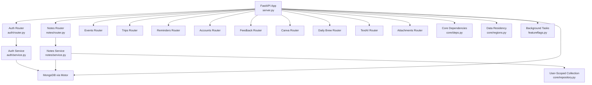
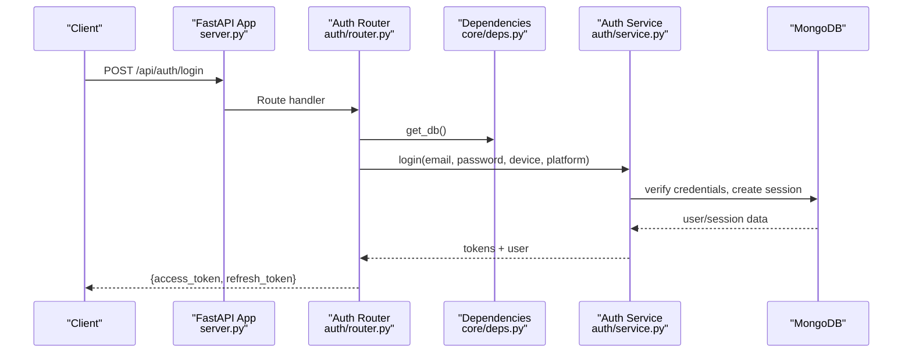
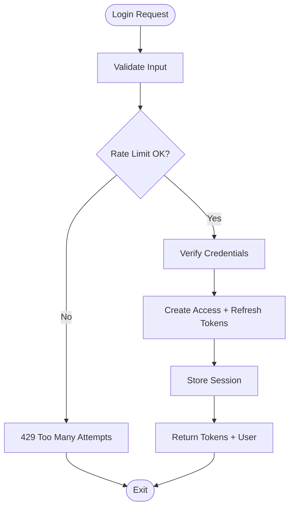
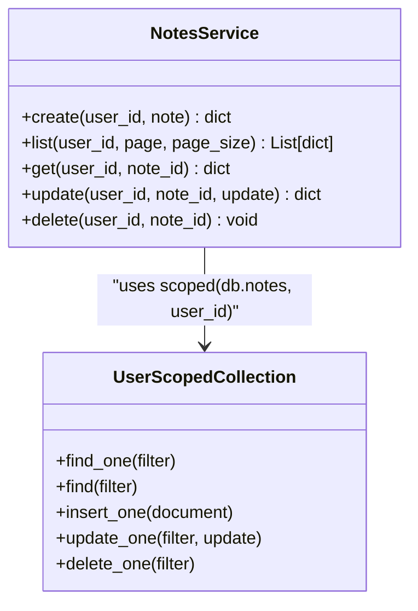
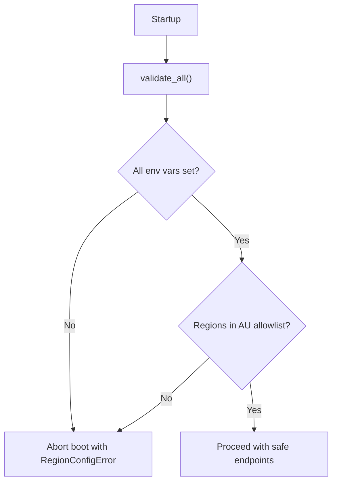
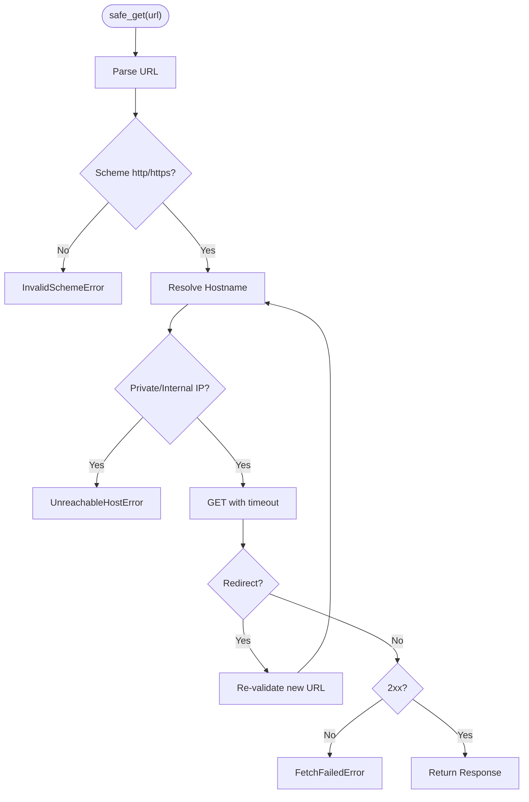
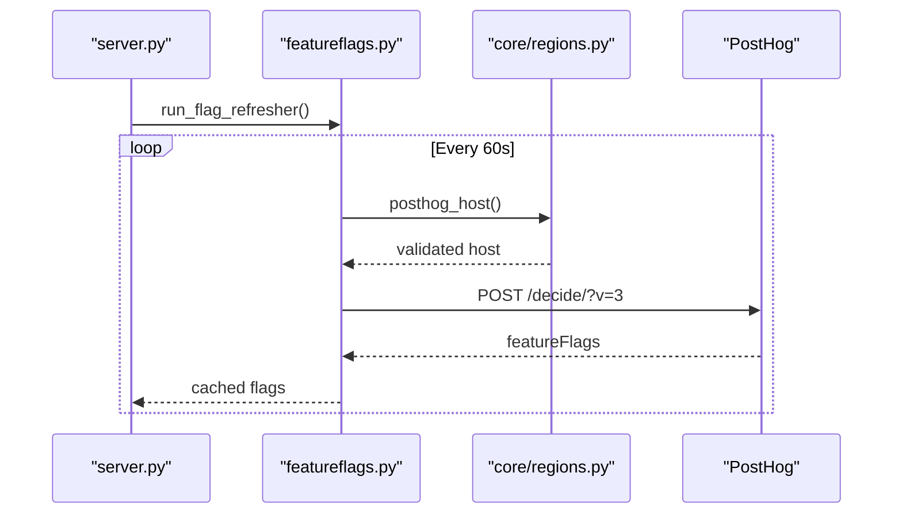
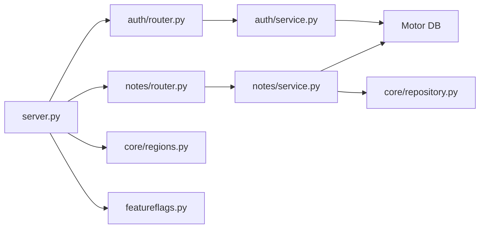

# Development Guidelines

<cite>
**Referenced Files in This Document**
- [server.py](file://server.py)
- [requirements.txt](file://requirements.txt)
- [featureflags.py](file://featureflags.py)
- [Procfile](file://Procfile)
- [core/deps.py](file://core/deps.py)
- [auth/router.py](file://auth/router.py)
- [notes/router.py](file://notes/router.py)
- [core/repository.py](file://core/repository.py)
- [security/ssrf_guard.py](file://security/ssrf_guard.py)
- [tests/test_nueco_apis.py](file://tests/test_nueco_apis.py)
- [core/regions.py](file://core/regions.py)
- [auth/service.py](file://auth/service.py)
- [notes/service.py](file://notes/service.py)
</cite>

## Table of Contents
1. Introduction
2. Project Structure
3. Core Components
4. Architecture Overview
5. Detailed Component Analysis
6. Dependency Analysis
7. Performance Considerations
8. Troubleshooting Guide
9. Conclusion
10. Appendices

## Introduction
This document provides comprehensive development guidelines for contributing to the Nueco Backend. It covers code style and naming conventions, architectural principles, development workflow, debugging and logging standards, error handling patterns, extension points, backward compatibility and API versioning, performance and security best practices, code quality standards, and collaboration practices for open-source contributors and internal teams.

The backend is a FastAPI application with modular feature routers (auth, notes, events, trips, reminders, accounts, feedback, canva, dailybrew, textai, attachments), shared core utilities (dependencies, data residency enforcement, user-scoped repository seam), and background tasks (cache prewarmer, flag refresher, job sweeper). Data persistence uses MongoDB via Motor, with indexes created at startup. Security includes SSRF protection, rate limiting on auth endpoints, CORS configuration, and region-enforced external service access.

## Project Structure
The backend follows a feature-based layout:
- server.py: Application entrypoint, global middleware, startup/shutdown hooks, index creation, router registration
- Feature modules: Each domain has router.py, service.py, schemas.py (and sometimes additional helpers)
- core/: Shared infrastructure (FastAPI dependencies, data residency validation, user-scoped collection wrapper)
- security/: Reusable security primitives (SSRF guard)
- tests/: Integration tests using an in-process harness with mongomock
- scripts/: Utility scripts for scoping checks and baselines
- static/: Legal and robots files served by the app
- Procfile: Deployment command for uvicorn

**Diagram sources**
- [server.py:175-214](file://server.py#L175-L214)
- [core/deps.py:15-51](file://core/deps.py#L15-L51)
- [core/repository.py:27-95](file://core/repository.py#L27-L95)
- [core/regions.py:144-181](file://core/regions.py#L144-L181)
- [featureflags.py:25-53](file://featureflags.py#L25-L53)

**Section sources**
- [server.py:1-465](file://server.py#L1-L465)
- [Procfile:1-2](file://Procfile#L1-L2)
- [requirements.txt:1-121](file://requirements.txt#L1-L121)

## Core Components
- FastAPI application and routing: Centralized in server.py; routers are included under /api prefix
- Authentication and authorization: JWT-based access tokens verified via core/deps.get_current_user; auth router implements signup/login/password flows with rate limiting
- Domain services: Each feature module encapsulates business logic in service.py; routers delegate to services
- Data access: Motor async client; user-scoped collection wrapper ensures tenant isolation
- External service access: Enforced through core/regions with Australian region allowlist; validated at boot
- Background tasks: Feature flag refresh, cache prewarmer, transcription job sweeper started on startup
- Security: SSRF guard for outbound requests; CORS middleware; anti-crawler headers; payload size limits

Key patterns:
- Routers depend on core dependencies for DB and current user resolution
- Services raise domain-specific exceptions; routers translate to HTTP responses
- User-scoped queries use core.repository.scoped to prevent cross-account leaks
- All external endpoints and regions are declared via environment variables and validated at startup

**Section sources**
- [server.py:20-214](file://server.py#L20-L214)
- [core/deps.py:15-51](file://core/deps.py#L15-L51)
- [auth/router.py:20-366](file://auth/router.py#L20-L366)
- [notes/router.py:1-100](file://notes/router.py#L1-L100)
- [core/repository.py:27-95](file://core/repository.py#L27-L95)
- [core/regions.py:144-181](file://core/regions.py#L144-L181)
- [featureflags.py:25-53](file://featureflags.py#L25-L53)
- [security/ssrf_guard.py:67-109](file://security/ssrf_guard.py#L67-L109)

## Architecture Overview
The system is organized around a central FastAPI app that mounts feature routers. Each router validates inputs via Pydantic schemas, delegates to a service for business logic, and returns typed responses. Data access goes through Motor with user-scoped collections to enforce tenant isolation. Startup hooks create indexes, validate data residency, and launch background tasks.

**Diagram sources**
- [server.py:175-188](file://server.py#L175-L188)
- [auth/router.py:115-140](file://auth/router.py#L115-L140)
- [core/deps.py:15-51](file://core/deps.py#L15-L51)
- [auth/service.py:35-105](file://auth/service.py#L35-L105)

**Section sources**
- [server.py:175-214](file://server.py#L175-L214)
- [auth/router.py:115-140](file://auth/router.py#L115-L140)
- [core/deps.py:15-51](file://core/deps.py#L15-L51)
- [auth/service.py:35-105](file://auth/service.py#L35-L105)

## Detailed Component Analysis

### Authentication Flow
- Rate limiting: Per-email and per-IP limits for login/signup/reset attempts
- Token lifecycle: Access tokens bound to sessions; refresh tokens stored hashed; logout invalidates session
- Current user resolution: Bearer token verified via AuthService; user document returned

**Diagram sources**
- [auth/router.py:23-84](file://auth/router.py#L23-L84)
- [auth/router.py:115-140](file://auth/router.py#L115-L140)
- [auth/service.py:63-84](file://auth/service.py#L63-L84)

**Section sources**
- [auth/router.py:23-84](file://auth/router.py#L23-L84)
- [auth/router.py:115-140](file://auth/router.py#L115-L140)
- [auth/service.py:63-84](file://auth/service.py#L63-L84)

### Notes Domain
- Payload validation: Title/content/images/objects capped to prevent oversized payloads and protect MongoDB limits
- Dual field normalization: linked_event_id (legacy) and linked_event_ids (new) kept in sync for backward compatibility
- User-scoped queries: Use core.repository.scoped to ensure tenant isolation
- Indexes: Compound indexes support efficient list pagination and sorting

**Diagram sources**
- [notes/service.py:79-200](file://notes/service.py#L79-L200)
- [core/repository.py:27-95](file://core/repository.py#L27-L95)

**Section sources**
- [notes/service.py:1-200](file://notes/service.py#L1-L200)
- [notes/router.py:1-100](file://notes/router.py#L1-L100)
- [core/repository.py:27-95](file://core/repository.py#L27-L95)

### Data Residency Enforcement
- Single source of truth for external service endpoints and regions
- Fail-closed boot: validate_all() raises if any declaration is missing, malformed, or non-Australian
- Typed accessors re-validate on every call to prevent bypass

**Diagram sources**
- [core/regions.py:144-181](file://core/regions.py#L144-L181)
- [server.py:338-342](file://server.py#L338-L342)

**Section sources**
- [core/regions.py:1-230](file://core/regions.py#L1-L230)
- [server.py:338-342](file://server.py#L338-L342)

### SSRF Protection
- Validates scheme (http/https only)
- Resolves hostname and rejects private/internal IPs
- Manually follows redirects with re-validation on each hop
- Returns final response or raises specific errors

**Diagram sources**
- [security/ssrf_guard.py:67-109](file://security/ssrf_guard.py#L67-L109)

**Section sources**
- [security/ssrf_guard.py:1-109](file://security/ssrf_guard.py#L1-L109)

### Background Tasks and Feature Flags
- Feature flags refreshed from PostHog endpoint; cached server-side
- Daily brew cache prewarmer launched on startup
- Speechmatics job sweeper runs periodically to clean provider-side audio

**Diagram sources**
- [featureflags.py:25-53](file://featureflags.py#L25-L53)
- [core/regions.py:211-212](file://core/regions.py#L211-L212)
- [server.py:441-450](file://server.py#L441-L450)

**Section sources**
- [featureflags.py:1-53](file://featureflags.py#L1-L53)
- [server.py:435-450](file://server.py#L435-L450)

## Dependency Analysis
- Coupling: Routers depend on core dependencies for DB and authentication; services depend on Motor and optional features (attachments, textai)
- Cohesion: Each feature module groups router, service, and schemas together
- External dependencies: FastAPI, Starlette, Motor, Pydantic, JWT, bcrypt, httpx, boto3, OpenAI, Google APIs, Speechmatics
- Circular imports avoided via deferred imports in core/deps.py

**Diagram sources**
- [server.py:175-214](file://server.py#L175-L214)
- [auth/router.py:1-366](file://auth/router.py#L1-L366)
- [notes/router.py:1-100](file://notes/router.py#L1-L100)
- [auth/service.py:1-200](file://auth/service.py#L1-L200)
- [notes/service.py:1-200](file://notes/service.py#L1-L200)
- [core/repository.py:1-95](file://core/repository.py#L1-L95)
- [core/regions.py:1-230](file://core/regions.py#L1-L230)
- [featureflags.py:1-53](file://featureflags.py#L1-L53)

**Section sources**
- [server.py:175-214](file://server.py#L175-L214)
- [auth/router.py:1-366](file://auth/router.py#L1-L366)
- [notes/router.py:1-100](file://notes/router.py#L1-L100)
- [auth/service.py:1-200](file://auth/service.py#L1-L200)
- [notes/service.py:1-200](file://notes/service.py#L1-L200)
- [core/repository.py:1-95](file://core/repository.py#L1-L95)
- [core/regions.py:1-230](file://core/regions.py#L1-L230)
- [featureflags.py:1-53](file://featureflags.py#L1-L53)

## Performance Considerations
- Database indexing: Compound indexes for notes and events optimize list pagination and sorting; partial indexes reduce scheduler query size
- Async I/O: Motor async client avoids blocking event loop; CPU-bound operations (bcrypt) offloaded to threads
- Payload caps: Note fields limited to prevent memory pressure and MongoDB document limit issues
- SSRF guard: Manual redirect following prevents excessive hops and ensures quick failure on invalid targets
- Background tasks: Flag refresh and cache prewarmers run asynchronously without blocking request handling

Recommendations:
- Always add indexes when introducing new sort/filter combinations
- Use user-scoped queries to avoid accidental full-collection scans
- Keep payload sizes reasonable; prefer streaming for large uploads where possible
- Monitor background task health and failures

**Section sources**
- [server.py:345-433](file://server.py#L345-L433)
- [auth/service.py:50-61](file://auth/service.py#L50-L61)
- [notes/service.py:30-51](file://notes/service.py#L30-L51)
- [security/ssrf_guard.py:67-109](file://security/ssrf_guard.py#L67-L109)

## Troubleshooting Guide
Common issues and how to address them:
- Authentication failures: Check Authorization header format and token validity; verify session not revoked
- Rate limiting: Excessive attempts trigger 429; adjust client retry behavior
- Data residency errors: Boot fails if environment variables are missing or regions not allowed; inspect logs for [region-check] messages
- SSRF errors: Outbound fetches fail if scheme invalid, hostname resolves to private IP, or network errors occur
- Test environment: Tests use in-process harness with mongomock; ensure proper setup and unique X-Forwarded-For values to avoid rate limiter collisions

Debugging techniques:
- Enable detailed logging via standard logging module
- Inspect startup logs for index creation and region validation
- Use test fixtures to simulate authenticated users and isolated DB state

**Section sources**
- [core/deps.py:24-51](file://core/deps.py#L24-L51)
- [auth/router.py:23-84](file://auth/router.py#L23-L84)
- [core/regions.py:144-181](file://core/regions.py#L144-L181)
- [security/ssrf_guard.py:33-48](file://security/ssrf_guard.py#L33-L48)
- [tests/test_nueco_apis.py:54-84](file://tests/test_nueco_apis.py#L54-L84)

## Conclusion
The Nueco Backend follows a clear, modular architecture with strong security and compliance controls. Contributions should adhere to established patterns: feature-based modules, service-layer business logic, user-scoped data access, and strict external service configuration. Maintain backward compatibility through dual-field normalization and careful API evolution. Prioritize performance via indexing and async I/O, and ensure robust error handling and logging. Follow testing practices using the in-process harness and maintain code quality with consistent style and review processes.

## Appendices

### Code Style and Naming Conventions
- Use Python conventions: snake_case for functions/variables, PascalCase for classes
- Pydantic models for request/response schemas; keep schemas close to routers
- Services raise domain exceptions; routers convert to HTTP responses
- Logging via standard logging module with module-level logger
- Environment variables for configuration; validate at startup

### Git Branching Strategy and Pull Requests
- Use feature branches named after the feature or fix
- Keep commits small and focused; include descriptive messages
- Open pull requests with clear descriptions and test coverage
- Ensure CI passes including tests and linting before merging

### Code Review Guidelines
- Verify user-scoped queries used for all data access
- Confirm external endpoints configured via environment and validated
- Check payload validation and error handling
- Ensure background tasks are resilient and logged

### Extension Points
- Add new features by creating a module with router.py, service.py, schemas.py
- Register router in server.py under /api prefix
- Use core/deps for DB and authentication
- If fetching user-influenced URLs, use security/ssrf_guard.safe_get

### Backward Compatibility and API Versioning
- Prefer additive changes; avoid breaking existing fields
- Use dual read/write normalization for evolving fields (e.g., linked_event_id -> linked_event_ids)
- Deprecate old fields gradually with migration support in services

### Security Best Practices
- Enforce data residency via core/regions
- Protect against SSRF with safe_get
- Rate-limit sensitive endpoints
- Validate and sanitize all inputs
- Use HTTPS-only schemes for external services

### Code Quality Standards
- Run linters and formatters (black, flake8, mypy)
- Write tests covering critical paths
- Document complex logic with comments and docstrings
- Keep dependencies minimal and well-vetted

### Contribution Guidelines
- Fork the repository and create a feature branch
- Implement changes following established patterns
- Add or update tests as needed
- Submit a pull request with a clear description
- Engage with reviewers and address feedback promptly