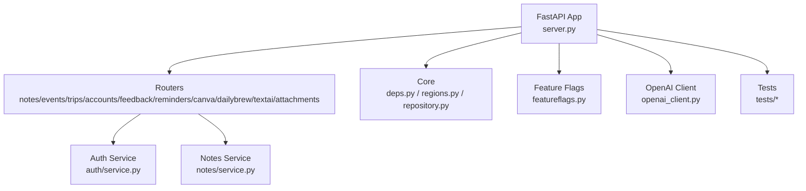
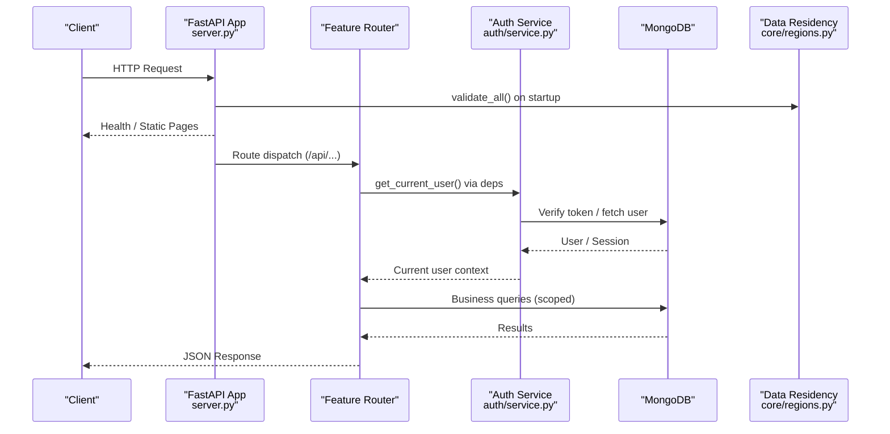
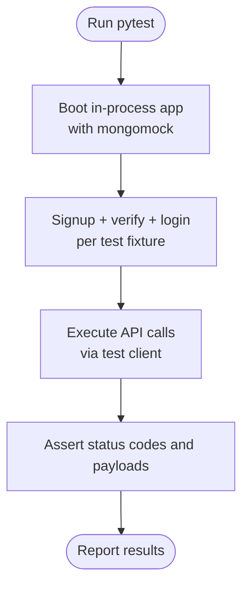
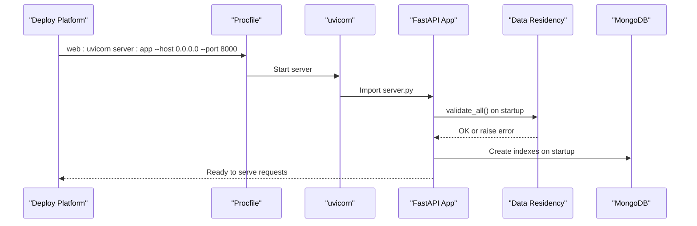
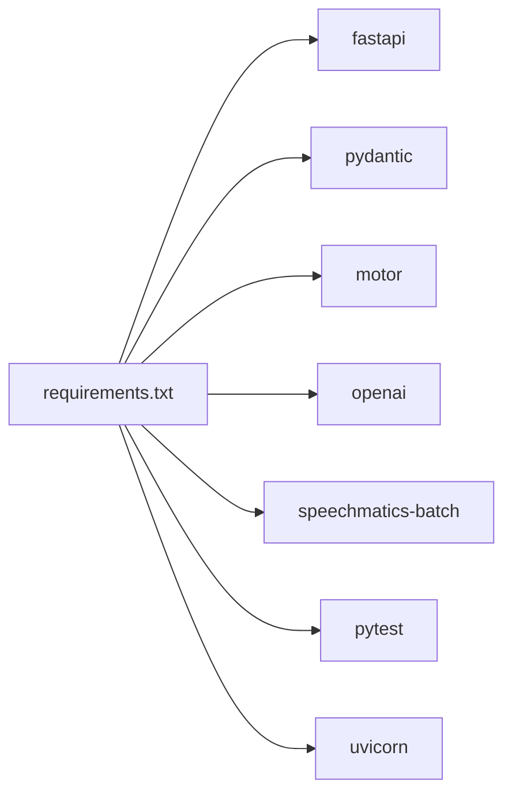
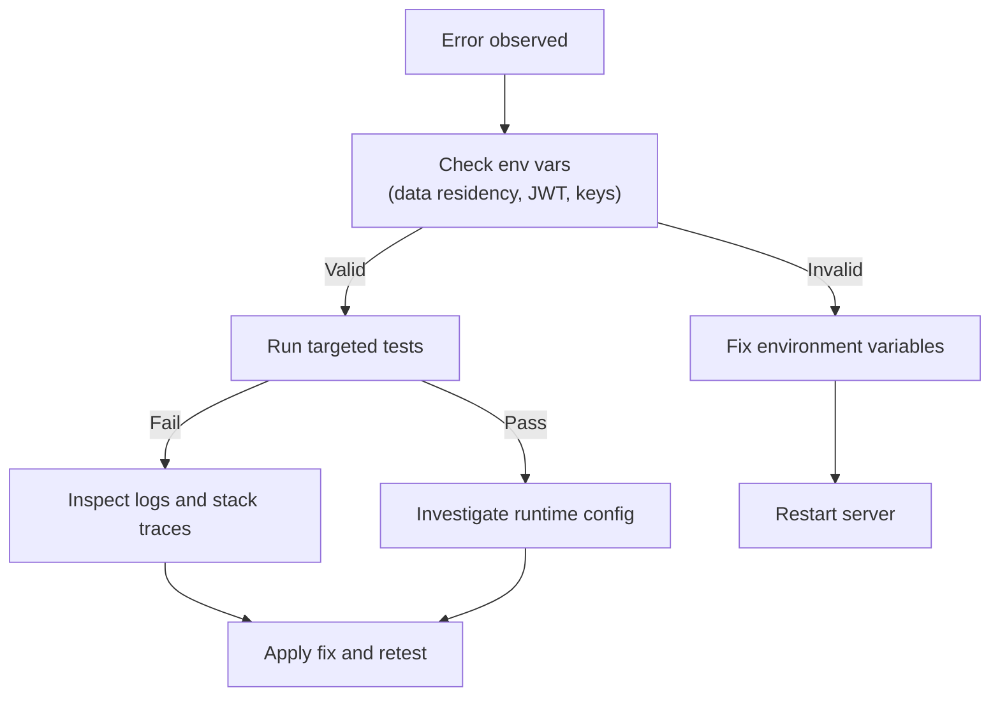

# Development Workflow & Git Practices

<cite>
**Referenced Files in This Document**
- [server.py](file://server.py)
- [requirements.txt](file://requirements.txt)
- [Procfile](file://Procfile)
- [featureflags.py](file://featureflags.py)
- [openai_client.py](file://openai_client.py)
- [core/deps.py](file://core/deps.py)
- [core/regions.py](file://core/regions.py)
- [core/repository.py](file://core/repository.py)
- [auth/service.py](file://auth/service.py)
- [notes/service.py](file://notes/service.py)
- [tests/test_nueco_apis.py](file://tests/test_nueco_apis.py)
- [tests/test_regions.py](file://tests/test_regions.py)
- [.gitignore](file://.gitignore)
</cite>

## Table of Contents
1. Introduction
2. Project Structure
3. Core Components
4. Architecture Overview
5. Detailed Component Analysis
6. Dependency Analysis
7. Performance Considerations
8. Troubleshooting Guide
9. Conclusion
10. Appendices

## Introduction
This document defines the development workflow and Git practices for contributing to the Nueco Backend. It covers branching strategy, pull request processes, local setup, environment configuration, dependency management, testing workflows, commit conventions, versioning, deployment pipelines, staging procedures, debugging, log analysis, and performance profiling. The guidance is grounded in the repository’s structure and code, ensuring that contributors can set up a reliable local environment, run tests, and ship changes safely.

## Project Structure
The backend is a FastAPI application with modular feature routers (notes, events, trips, accounts, feedback, reminders, canva, dailybrew, textai, attachments), shared core utilities (dependencies, data residency enforcement, user-scoped repository), and a test suite using pytest with an in-process harness and mongomock.

**Diagram sources**
- [server.py:1-214](file://server.py#L1-L214)
- [core/deps.py:1-51](file://core/deps.py#L1-L51)
- [core/regions.py:1-230](file://core/regions.py#L1-L230)
- [core/repository.py:1-95](file://core/repository.py#L1-L95)
- [featureflags.py:1-53](file://featureflags.py#L1-L53)
- [openai_client.py:1-24](file://openai_client.py#L1-L24)
- [auth/service.py:1-200](file://auth/service.py#L1-L200)
- [notes/service.py:1-200](file://notes/service.py#L1-L200)
- [tests/test_nueco_apis.py:1-800](file://tests/test_nueco_apis.py#L1-L800)

**Section sources**
- [server.py:1-214](file://server.py#L1-L214)
- [requirements.txt:1-121](file://requirements.txt#L1-L121)
- [Procfile:1-2](file://Procfile#L1-L2)

## Core Components
- Application entrypoint and middleware:
  - FastAPI app, CORS, health endpoints, static pages, anti-crawler middleware, startup tasks (indexes, cache prewarmer, flag refresher, job sweeper).
- Data residency enforcement:
  - Centralized validation of external service endpoints and region declarations; boot fails closed if any required variable is missing or non-Australian.
- Authentication and dependencies:
  - Shared FastAPI dependencies resolve current user via JWT verification and provide database access.
- User-scoped repository:
  - Enforces tenant isolation by wrapping Motor collections so every query includes a user_id predicate.
- Feature flags:
  - Server-side refresh of feature flags from analytics host; fail-closed until first refresh.
- OpenAI client:
  - Creates AsyncOpenAI client using base URL from data residency module.

**Section sources**
- [server.py:20-214](file://server.py#L20-L214)
- [core/regions.py:1-230](file://core/regions.py#L1-L230)
- [core/deps.py:1-51](file://core/deps.py#L1-L51)
- [core/repository.py:1-95](file://core/repository.py#L1-L95)
- [featureflags.py:1-53](file://featureflags.py#L1-L53)
- [openai_client.py:1-24](file://openai_client.py#L1-L24)

## Architecture Overview
The server wires routers into a single API router under /api and mounts additional routes at the app level. Startup events enforce data residency, create indexes, and start background tasks. All outbound services are gated through the data residency module.

**Diagram sources**
- [server.py:20-214](file://server.py#L20-L214)
- [core/deps.py:15-51](file://core/deps.py#L15-L51)
- [core/regions.py:144-165](file://core/regions.py#L144-L165)
- [auth/service.py:63-105](file://auth/service.py#L63-L105)

## Detailed Component Analysis

### Local Development Setup
- Install dependencies:
  - Use Python package manager to install requirements listed in requirements.txt.
- Environment variables:
  - Provide all declared endpoint and region variables enforced by core/regions.py. Missing or invalid values will prevent the server from starting.
  - Ensure MongoDB connection and database name are configured.
  - Configure authentication secrets (e.g., JWT secret) used by auth/service.py.
  - Optional: configure OpenAI key(s) and PostHog project key for feature flags.
- Run the server:
  - Use the Procfile command to start uvicorn on port 8000.
- Secrets handling:
  - .env files are ignored by git; use environment variables provided by your platform (e.g., Railway).

**Section sources**
- [requirements.txt:1-121](file://requirements.txt#L1-L121)
- [Procfile:1-2](file://Procfile#L1-L2)
- [core/regions.py:1-230](file://core/regions.py#L1-L230)
- [auth/service.py:24-33](file://auth/service.py#L24-L33)
- [.gitignore:1-16](file://.gitignore#L1-L16)

### Branching Strategy
- Main branch:
  - Stable integration branch representing production-ready code.
- Development branches:
  - Create feature branches from main for each change (e.g., feature/add-recurrence).
  - Use descriptive names and keep scope small per PR.
- Release branches:
  - When preparing a release, branch from main (e.g., release/vX.Y.Z), perform final QA, and merge back to main after approval.
- Hotfixes:
  - Branch from main for urgent fixes, then merge back to main and any active release branches.

### Pull Requests and Code Review
- Create a PR from your feature branch to main with:
  - Clear description of changes and rationale.
  - Link to related issues or design docs.
  - Evidence of local testing (commands and results).
- Review checklist:
  - Data residency compliance (no hardcoded endpoints outside core/regions.py).
  - Security (authentication, authorization, payload size limits).
  - Test coverage (unit/integration where applicable).
  - Performance (index usage, sorting, pagination).
- Merge requirements (enforced by the `protect-main` repository ruleset, active, no bypass by default):
  - Changes must go through a pull request — direct pushes and force-pushes to main are rejected.
  - At least one approving review; stale reviews are dismissed on new pushes.
  - Required status check **Backend checks** (`.github/workflows/backend-checks.yml`) must pass.
  - Deletion of main is blocked.

### Testing Workflows
- Unit and integration tests:
  - Tests run the FastAPI app in-process against an in-memory database via a shared harness.
  - Example suites include API tests and data residency enforcement tests.
- Running tests locally:
  - Use pytest to execute the full suite or specific files.
  - For data residency tests, run explicitly by file path.
- What tests cover:
  - Health check, Notes CRUD, Events CRUD, recurrence/timezone behavior, push tick scheduling, and data residency validation.

**Diagram sources**
- [tests/test_nueco_apis.py:54-84](file://tests/test_nueco_apis.py#L54-L84)
- [tests/test_nueco_apis.py:87-175](file://tests/test_nueco_apis.py#L87-L175)
- [tests/test_regions.py:64-137](file://tests/test_regions.py#L64-L137)

**Section sources**
- [tests/test_nueco_apis.py:1-800](file://tests/test_nueco_apis.py#L1-L800)
- [tests/test_regions.py:1-201](file://tests/test_regions.py#L1-L201)

### Commit Message Conventions
- Format:
  - Type(scope): concise summary
  - Body explaining why and what changed
  - Footer referencing issues or breaking changes
- Types:
  - feat, fix, chore, docs, refactor, perf, test, build, ci
- Examples:
  - feat(events): add recurrence support for events
  - fix(notes): allow explicit null to clear linked_event_ids
  - chore(deps): bump fastapi to latest

### Changelog Maintenance
- Maintain a changelog aligned with semantic versions.
- Group entries by categories matching commit types.
- Include migration notes for schema/index changes.

### Version Tagging
- Use semantic version tags (vX.Y.Z) on release branches after successful CI and QA.
- Tag main after merging release branches.

### Deployment Pipelines and Staging
- Build and serve:
  - The Procfile starts uvicorn on port 8000.
- Staging APK download:
  - The server serves a staging APK page and file when available; this supports same-origin downloads during staging.
- Environment gating:
  - Data residency validation runs at startup; misconfiguration aborts boot.

**Diagram sources**
- [Procfile:1-2](file://Procfile#L1-L2)
- [server.py:338-433](file://server.py#L338-L433)
- [core/regions.py:144-165](file://core/regions.py#L144-L165)

**Section sources**
- [Procfile:1-2](file://Procfile#L1-L2)
- [server.py:217-254](file://server.py#L217-L254)
- [server.py:338-433](file://server.py#L338-L433)

### Production Release Procedures
- Pre-release:
  - Run full test suite including data residency tests.
  - Validate environment variables for all declared services and regions.
- Rollout:
  - Deploy to staging, verify health and critical flows.
  - Promote to production with feature flags validated.
- Post-release:
  - Monitor logs and metrics; rollback plan ready if needed.

## Dependency Analysis
The backend depends on FastAPI, Pydantic, Motor (async MongoDB), and various third-party libraries for AI, storage, email, and analytics. Dependencies are pinned in requirements.txt.

**Diagram sources**
- [requirements.txt:1-121](file://requirements.txt#L1-L121)

**Section sources**
- [requirements.txt:1-121](file://requirements.txt#L1-L121)

## Performance Considerations
- Database indexing:
  - Startup creates compound indexes to cover list queries and paging sorts, avoiding blocking in-memory sorts.
- Sorting and pagination:
  - Notes and events lists sort by deterministic fields (including id tiebreaker) to ensure stable pagination.
- Background tasks:
  - Cache prewarmer, feature flag refresher, and job sweeper run asynchronously on startup.
- Payload limits:
  - Note payload size guards protect against oversized documents and memory pressure.

**Section sources**
- [server.py:344-433](file://server.py#L344-L433)
- [notes/service.py:30-51](file://notes/service.py#L30-L51)
- [notes/service.py:113-148](file://notes/service.py#L113-L148)

## Troubleshooting Guide
- Boot failures due to data residency:
  - If startup raises a region-check error, inspect environment variables for missing or non-Australian values.
- Authentication errors:
  - Ensure JWT secret is set and tokens are valid; verify session state if logout revokes tokens.
- Test failures:
  - Confirm environment variables for tests (e.g., PUSH_TICK_SECRET for internal tick endpoints).
  - Use the in-process harness to avoid network egress and live DB connections.
- Logs:
  - Logging is configured at INFO level; check startup logs for index creation and background task initialization.

**Section sources**
- [core/regions.py:144-165](file://core/regions.py#L144-L165)
- [auth/service.py:24-33](file://auth/service.py#L24-L33)
- [tests/test_nueco_apis.py:602-609](file://tests/test_nueco_apis.py#L602-L609)
- [server.py:23-27](file://server.py#L23-L27)

## Conclusion
By following the branching strategy, PR process, and testing guidelines outlined here, contributors can develop confidently while maintaining security, performance, and compliance. The data residency enforcement ensures all external integrations remain within approved regions, and the robust test suite validates critical flows before merging.

## Appendices

### Environment Variables Reference
- Required:
  - OPENAI_BASE_URL, OPENAI_REGION
  - SPEECHMATICS_BASE_URL, SPEECHMATICS_REGION
  - EXPO_PUSH_SEND_URL, EXPO_PUSH_RECEIPTS_URL, EXPO_PUSH_REGION
  - RESEND_BASE_URL, RESEND_REGION
  - AWS_REGION
  - POSTHOG_HOST, POSTHOG_REGION
  - CANVA_AUTHORIZE_URL, CANVA_TOKEN_URL, CANVA_API_BASE_URL, CANVA_REGION
  - MONGO_URL, MONGODB_REGION
  - JWT_SECRET
  - DB_NAME
- Optional:
  - OPENAI_API_KEY or EMERGENT_LLM_KEY
  - POSTHOG_PROJECT_API_KEY
  - ALLOWED_ORIGINS
  - PUSH_TICK_SECRET (for internal tick endpoints in tests)

**Section sources**
- [core/regions.py:58-77](file://core/regions.py#L58-L77)
- [auth/service.py:24-33](file://auth/service.py#L24-L33)
- [server.py:16-18](file://server.py#L16-L18)
- [featureflags.py:13-15](file://featureflags.py#L13-L15)
- [tests/test_nueco_apis.py:602-609](file://tests/test_nueco_apis.py#L602-L609)