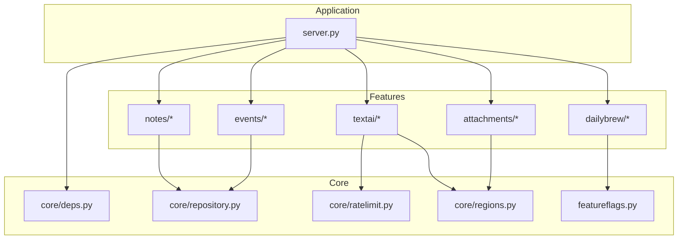
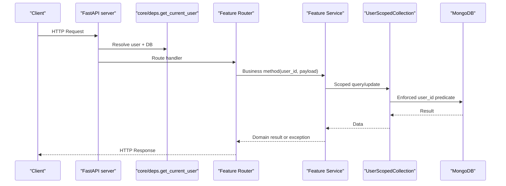
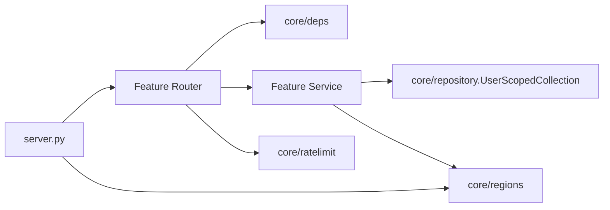

# Extension & Plugin Development

<cite>
**Referenced Files in This Document**
- [server.py](file://server.py)
- [core/deps.py](file://core/deps.py)
- [core/repository.py](file://core/repository.py)
- [core/ratelimit.py](file://core/ratelimit.py)
- [core/regions.py](file://core/regions.py)
- [featureflags.py](file://featureflags.py)
- [notes/router.py](file://notes/router.py)
- [notes/service.py](file://notes/service.py)
- [notes/schemas.py](file://notes/schemas.py)
- [events/router.py](file://events/router.py)
- [dailybrew/router.py](file://dailybrew/router.py)
- [textai/router.py](file://textai/router.py)
- [attachments/router.py](file://attachments/router.py)
</cite>

## Table of Contents
1. Introduction
2. Project Structure
3. Core Components
4. Architecture Overview
5. Detailed Component Analysis
6. Dependency Analysis
7. Performance Considerations
8. Troubleshooting Guide
9. Conclusion
10. Appendices

## Introduction
This document explains how to extend the Nueco Backend by adding new features following the established modular structure: router, service, and schema patterns. It covers plugin-style extension points, dependency injection, database scoping, rate limiting, external service integration, security considerations, API versioning strategies, deprecation policies, and performance optimization techniques. The guidance is grounded in existing modules such as notes, events, dailybrew, textai, and attachments.

## Project Structure
The backend is organized into feature directories (e.g., notes, events, dailybrew, textai, attachments), each containing a router (HTTP endpoints), a service (business logic), and schemas (Pydantic models). Shared infrastructure lives under core/, including dependency injection, user-scoped data access, rate limiting, and region configuration. The application entrypoint registers routers and initializes background tasks.

**Diagram sources**
- [server.py:175-214](file://server.py#L175-L214)
- [core/deps.py:15-50](file://core/deps.py#L15-L50)
- [core/repository.py:27-95](file://core/repository.py#L27-L95)
- [core/ratelimit.py:41-124](file://core/ratelimit.py#L41-L124)
- [core/regions.py:144-230](file://core/regions.py#L144-L230)
- [featureflags.py:25-53](file://featureflags.py#L25-L53)
- [notes/router.py:1-100](file://notes/router.py#L1-L100)
- [events/router.py:1-111](file://events/router.py#L1-L111)
- [dailybrew/router.py:1-102](file://dailybrew/router.py#L1-L102)
- [textai/router.py:1-163](file://textai/router.py#L1-L163)
- [attachments/router.py:1-82](file://attachments/router.py#L1-L82)

**Section sources**
- [server.py:175-214](file://server.py#L175-L214)

## Core Components
- Dependency injection: FastAPI dependencies provide authenticated user context and database handles without tight coupling between routers and auth internals.
- User-scoped data access: A wrapper enforces tenant isolation on every MongoDB operation, preventing cross-account data leaks.
- Rate limiting: Sliding-window limiter protects shared external quotas with per-user and global limits.
- Region enforcement: Centralized validation ensures all external services are declared and restricted to approved regions at boot and on each call.
- Feature flags: Server-side caching of feature flags for consistent behavior across clients.

**Section sources**
- [core/deps.py:15-50](file://core/deps.py#L15-L50)
- [core/repository.py:27-95](file://core/repository.py#L27-L95)
- [core/ratelimit.py:41-124](file://core/ratelimit.py#L41-L124)
- [core/regions.py:144-230](file://core/regions.py#L144-L230)
- [featureflags.py:25-53](file://featureflags.py#L25-L53)

## Architecture Overview
The server mounts an API router and includes feature routers. Each feature follows a consistent pattern:
- Router: Validates requests, resolves current user and DB via dependencies, calls service methods, maps exceptions to HTTP responses.
- Service: Implements business rules, payload validation, persistence via user-scoped collections, and interactions with external services when needed.
- Schemas: Pydantic models define request/response shapes and constraints.

**Diagram sources**
- [core/deps.py:24-50](file://core/deps.py#L24-L50)
- [core/repository.py:27-95](file://core/repository.py#L27-L95)
- [notes/router.py:17-100](file://notes/router.py#L17-L100)
- [notes/service.py:83-226](file://notes/service.py#L83-L226)

## Detailed Component Analysis

### Adding a New Feature Module (Router, Service, Schema)
Follow the established pattern seen in notes, events, and dailybrew:
- Create a directory with router.py, service.py, and schemas.py.
- In router.py, define an APIRouter with a prefix and tags. Use get_current_user and get_db dependencies. Convert exceptions from service to HTTPException.
- In service.py, implement domain logic, payload validation, and persistence using user-scoped collections. Raise domain-specific exceptions rather than HTTP exceptions.
- In schemas.py, define Pydantic models for input/output.

Example references:
- Notes module demonstrates CRUD, pagination, payload size validation, and dual-write compatibility for deprecated fields.
- Events module shows list/get/update/delete plus batch retrieval.
- DailyBrew module integrates external catalogs and user preferences.

**Section sources**
- [notes/router.py:1-100](file://notes/router.py#L1-L100)
- [notes/service.py:1-226](file://notes/service.py#L1-L226)
- [notes/schemas.py:1-100](file://notes/schemas.py#L1-L100)
- [events/router.py:1-111](file://events/router.py#L1-L111)
- [dailybrew/router.py:1-102](file://dailybrew/router.py#L1-L102)

### Implementing New API Endpoints
- Define routes in router.py with clear prefixes and tags.
- Use FastAPI Query parameters for filtering/pagination where appropriate.
- Map service exceptions to appropriate HTTP status codes (e.g., 400, 404, 413, 429).
- Keep routers thin; delegate validation and business logic to services.

References:
- Notes endpoints illustrate create/list/get/update/delete/toggle-pin with error mapping.
- Events endpoints include pagination and batch retrieval.

**Section sources**
- [notes/router.py:17-100](file://notes/router.py#L17-L100)
- [events/router.py:23-111](file://events/router.py#L23-L111)

### Integrating External Services
- Declare endpoints and regions centrally in core/regions.py. Accessors validate URLs and enforce region allowlist on every call.
- For AI/text processing endpoints, apply rate limiting before making external calls to protect shared quotas.
- For file storage, use presigned URLs and offload sync operations to threads to avoid blocking the event loop.

References:
- Regions module validates and exposes typed endpoints for OpenAI, Speechmatics, push, email, S3, analytics, Canva, and MongoDB.
- TextAI router applies per-user and global rate limits before calling external transcription/AI services.
- Attachments router uses asyncio.to_thread for boto3 calls and maps storage errors to HTTP statuses.

**Section sources**
- [core/regions.py:144-230](file://core/regions.py#L144-L230)
- [textai/router.py:28-163](file://textai/router.py#L28-L163)
- [attachments/router.py:28-82](file://attachments/router.py#L28-L82)

### Adding Database Models
- Add indexes during startup to support queries and sorting efficiently.
- Use user-scoped collections to ensure tenant isolation on reads/writes.
- Normalize legacy fields at read time if necessary to maintain backward compatibility.

References:
- Startup index creation defines compound and partial indexes for notes, events, trips, push tokens, users, sessions, devices, and telemetry.
- Notes service normalizes linked_event_ids for backward compatibility.

**Section sources**
- [server.py:345-433](file://server.py#L345-L433)
- [notes/service.py:67-77](file://notes/service.py#L67-L77)

### Using the Dependency Injection System
- Use get_current_user to authenticate and resolve the user document.
- Use get_db to obtain the AsyncIOMotorDatabase instance.
- Avoid importing heavy modules at import time to prevent circular imports; defer imports inside functions when necessary.

References:
- core/deps.py provides get_db and get_current_user with deferred imports to avoid circular dependencies.

**Section sources**
- [core/deps.py:15-50](file://core/deps.py#L15-L50)

### Registering New Dependencies
- If your feature needs additional services (e.g., external APIs), register their endpoints and regions in core/regions.py so they are validated at boot and enforced on every call.
- For background tasks or prewarmers, start them in server.py startup handlers.

References:
- Regions registry lists all external services and their environment variables.
- Server startup includes index creation, cache prewarmer, feature flag refresher, and job sweepers.

**Section sources**
- [core/regions.py:55-77](file://core/regions.py#L55-L77)
- [server.py:435-460](file://server.py#L435-L460)

### Example Patterns from Existing Modules
- Notes: Payload size validation, E2EE awareness, dual-write compatibility for deprecated fields, attachment cleanup on delete.
- Events: Pagination with safe defaults, batch endpoint to reduce N+1 queries, reminder-related indexes.
- DailyBrew: Catalog lookups, custom feed management, user preference reads.
- TextAI: Quota enforcement, provider abstraction, careful logging to avoid leaking sensitive content.
- Attachments: Presign flows, quota checks, thread-based storage calls, robust error mapping.

**Section sources**
- [notes/service.py:30-51](file://notes/service.py#L30-L51)
- [notes/service.py:83-226](file://notes/service.py#L83-L226)
- [events/router.py:37-79](file://events/router.py#L37-L79)
- [dailybrew/router.py:15-102](file://dailybrew/router.py#L15-L102)
- [textai/router.py:28-163](file://textai/router.py#L28-L163)
- [attachments/router.py:28-82](file://attachments/router.py#L28-L82)

## Dependency Analysis
The system exhibits low coupling through explicit dependencies:
- Routers depend on core/deps for authentication and DB access.
- Services depend on core/repository for user-scoped data access.
- AI endpoints depend on core/ratelimit to protect shared quotas.
- All external integrations depend on core/regions for validated endpoints and region compliance.

**Diagram sources**
- [core/deps.py:15-50](file://core/deps.py#L15-L50)
- [core/repository.py:27-95](file://core/repository.py#L27-L95)
- [core/ratelimit.py:41-124](file://core/ratelimit.py#L41-L124)
- [core/regions.py:144-230](file://core/regions.py#L144-L230)
- [server.py:175-214](file://server.py#L175-L214)

**Section sources**
- [core/deps.py:15-50](file://core/deps.py#L15-L50)
- [core/repository.py:27-95](file://core/repository.py#L27-L95)
- [core/ratelimit.py:41-124](file://core/ratelimit.py#L41-L124)
- [core/regions.py:144-230](file://core/regions.py#L144-L230)
- [server.py:175-214](file://server.py#L175-L214)

## Performance Considerations
- Indexes: Ensure queries are covered by indexes to avoid in-memory sorts and large payloads that exceed limits.
- Pagination: Use stable sort keys (including id) to guarantee deterministic paging.
- Throttling: Apply rate limits before expensive external calls to protect shared quotas and reduce load.
- Offloading CPU-bound work: Use asyncio.to_thread for synchronous libraries (e.g., bcrypt, boto3) to avoid blocking the event loop.
- Background tasks: Start prewarmers and sweepers in startup handlers to keep hot paths fast.

**Section sources**
- [server.py:345-433](file://server.py#L345-L433)
- [notes/service.py:113-148](file://notes/service.py#L113-L148)
- [core/ratelimit.py:41-124](file://core/ratelimit.py#L41-L124)
- [auth/service.py:50-62](file://auth/service.py#L50-L62)
- [attachments/router.py:34-44](file://attachments/router.py#L34-L44)

## Troubleshooting Guide
Common issues and resolutions:
- Authentication failures: Verify Authorization header format and token validity; get_current_user raises 401 for missing/invalid/expired tokens.
- Cross-account data access: Always use user-scoped collections to enforce tenant predicates; raw queries bypass this guard.
- Excessive memory usage: Enforce payload size limits in services to prevent oversized documents and memory spikes.
- External service misconfiguration: Boot fails if any required endpoint or region is missing or non-Australian; fix environment variables accordingly.
- Rate limiting: Clients should honor Retry-After headers on 429 responses to avoid hammering throttled endpoints.

**Section sources**
- [core/deps.py:24-50](file://core/deps.py#L24-L50)
- [core/repository.py:27-95](file://core/repository.py#L27-L95)
- [notes/service.py:30-51](file://notes/service.py#L30-L51)
- [core/regions.py:144-165](file://core/regions.py#L144-L165)
- [textai/router.py:28-49](file://textai/router.py#L28-L49)

## Conclusion
To extend the Nueco Backend effectively:
- Follow the router-service-schema pattern used by existing features.
- Leverage dependency injection for authentication and database access.
- Use user-scoped collections to enforce tenant isolation.
- Integrate external services via core/regions for validated, compliant endpoints.
- Protect shared resources with rate limiting and enforce payload caps.
- Maintain backward compatibility through normalization and dual-writes where necessary.
- Optimize performance with indexes, pagination, and offloading CPU-bound work.

## Appendices

### Creating a New Feature Module: Step-by-Step
- Create a new directory with router.py, service.py, and schemas.py.
- In router.py:
  - Define an APIRouter with prefix and tags.
  - Use get_current_user and get_db dependencies.
  - Call service methods and map exceptions to HTTP responses.
- In service.py:
  - Validate inputs and enforce payload limits.
  - Use user-scoped collections for persistence.
  - Raise domain-specific exceptions for errors.
- In schemas.py:
  - Define Pydantic models for requests and responses.
- Register the router in server.py under the api_router.
- Add indexes in server.py startup if needed.
- If integrating external services, declare endpoints and regions in core/regions.py.

**Section sources**
- [notes/router.py:1-100](file://notes/router.py#L1-L100)
- [notes/service.py:83-226](file://notes/service.py#L83-L226)
- [notes/schemas.py:1-100](file://notes/schemas.py#L1-L100)
- [server.py:175-214](file://server.py#L175-L214)
- [server.py:345-433](file://server.py#L345-L433)
- [core/regions.py:55-77](file://core/regions.py#L55-L77)

### Backward Compatibility, API Versioning, and Deprecation Policies
- Prefer additive changes to schemas and endpoints to avoid breaking clients.
- Support deprecated fields with dual-read/dual-write shims until old clients are phased out.
- Use feature flags to gate new functionality and enable gradual rollouts.
- Provide clear deprecation timelines and migration guides for clients.

**Section sources**
- [notes/service.py:67-77](file://notes/service.py#L67-L77)
- [featureflags.py:25-53](file://featureflags.py#L25-L53)

### Security Considerations for Extensions
- Enforce authentication via get_current_user on all protected endpoints.
- Use user-scoped collections to prevent cross-account data access.
- Validate and sanitize inputs; enforce payload size limits to mitigate abuse.
- Restrict external service endpoints and regions via core/regions to comply with data residency requirements.
- Avoid logging sensitive content; log metadata only.

**Section sources**
- [core/deps.py:24-50](file://core/deps.py#L24-L50)
- [core/repository.py:27-95](file://core/repository.py#L27-L95)
- [notes/service.py:30-51](file://notes/service.py#L30-L51)
- [core/regions.py:144-230](file://core/regions.py#L144-L230)
- [textai/router.py:91-98](file://textai/router.py#L91-L98)

### Rate Limiting Implementation
- Apply per-user and global rate limits before invoking external services.
- Return 429 with Retry-After headers to guide client backoff.
- Use sliding-window limiter to protect shared quotas.

**Section sources**
- [core/ratelimit.py:41-124](file://core/ratelimit.py#L41-L124)
- [textai/router.py:28-49](file://textai/router.py#L28-L49)