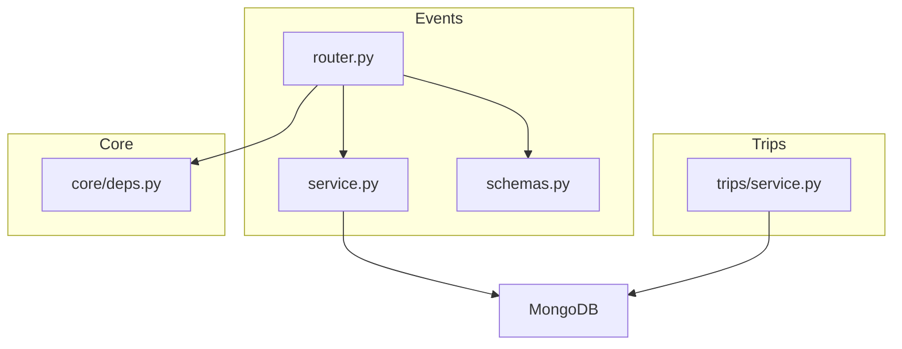
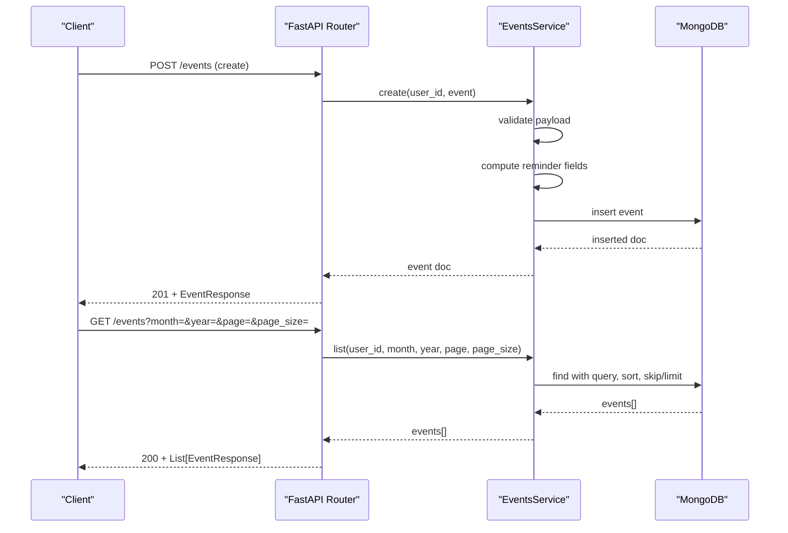
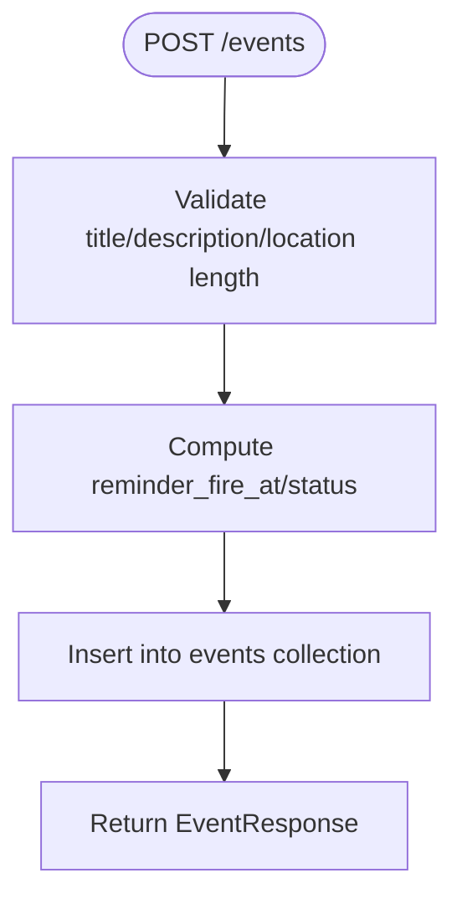
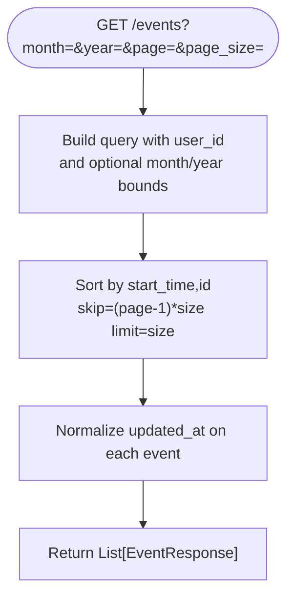
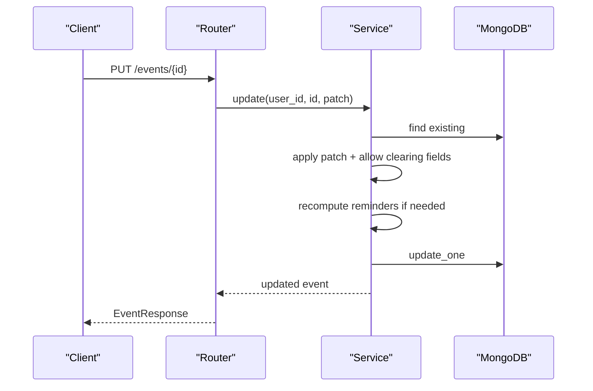
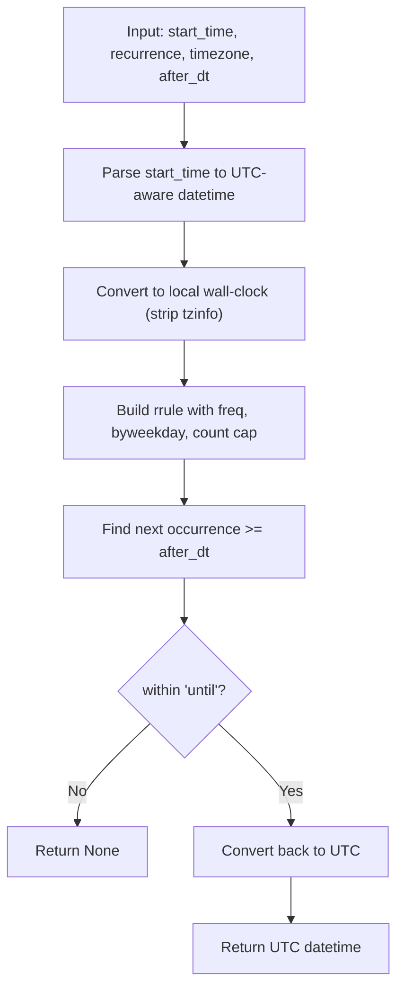
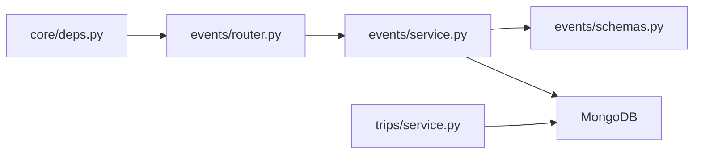

# Calendar Operations

<cite>
**Referenced Files in This Document**
- [events/router.py](file://events/router.py)
- [events/service.py](file://events/service.py)
- [events/schemas.py](file://events/schemas.py)
- [trips/service.py](file://trips/service.py)
- [core/deps.py](file://core/deps.py)
</cite>

## Table of Contents
1. [Introduction](#introduction)
2. [Project Structure](#project-structure)
3. [Core Components](#core-components)
4. [Architecture Overview](#architecture-overview)
5. [Detailed Component Analysis](#detailed-component-analysis)
6. [Dependency Analysis](#dependency-analysis)
7. [Performance Considerations](#performance-considerations)
8. [Troubleshooting Guide](#troubleshooting-guide)
9. [Conclusion](#conclusion)
10. [Appendices](#appendices)

## Introduction
This document explains the calendar operations in the Event Management system with a focus on CRUD for events, data modeling (start/end times, timezone handling, recurrence), pagination and filtering, batch operations, and relationships to trips and timeline synchronization. It also covers event sharing via attendees and Google Calendar bridge fields stored by the backend.

## Project Structure
The calendar feature is implemented under the events module with FastAPI routers, Pydantic schemas, and a framework-agnostic service layer that interacts with MongoDB via Motor. Trips are a separate module; events can be grouped into trips via a reference field. Authentication and database access are provided through shared dependencies.

**Diagram sources**
- [events/router.py:1-111](file://events/router.py#L1-L111)
- [events/service.py:1-312](file://events/service.py#L1-L312)
- [events/schemas.py:1-101](file://events/schemas.py#L1-L101)
- [trips/service.py:1-102](file://trips/service.py#L1-L102)
- [core/deps.py:1-51](file://core/deps.py#L1-L51)

**Section sources**
- [events/router.py:1-111](file://events/router.py#L1-L111)
- [events/service.py:1-312](file://events/service.py#L1-L312)
- [events/schemas.py:1-101](file://events/schemas.py#L1-L101)
- [trips/service.py:1-102](file://trips/service.py#L1-L102)
- [core/deps.py:1-51](file://core/deps.py#L1-L51)

## Core Components
- Events API endpoints: create, list (paginated, filterable by month/year), get by id, update, delete, and batch retrieval.
- EventsService: business logic including payload validation, reminder computation, recurrence math, persistence, and normalization.
- Schemas: models for creating, updating, and responding with events; includes recurrence definition and optional fields for trip linkage and Google sync.
- Trips integration: events can belong to a trip via a reference; deleting a trip clears references from events.
- Authentication and DB: user resolution and database handle injection via shared dependencies.

Key responsibilities:
- Enforce payload size limits and sanitize inputs.
- Compute reminder scheduling fields based on start time and reminder minutes.
- Support recurring events with frequency, weekday selection, and an inclusive “until” date.
- Provide deterministic pagination with stable sort order.
- Normalize read responses to ensure consistent updated_at presence.

**Section sources**
- [events/router.py:23-111](file://events/router.py#L23-L111)
- [events/service.py:163-312](file://events/service.py#L163-L312)
- [events/schemas.py:5-101](file://events/schemas.py#L5-L101)
- [trips/service.py:93-102](file://trips/service.py#L93-L102)
- [core/deps.py:24-51](file://core/deps.py#L24-L51)

## Architecture Overview
The request flow uses FastAPI routes to validate inputs, delegate to EventsService, and return structured responses. The service performs validation, computes derived fields (e.g., reminders), and persists to MongoDB. Recurrence and timezone-aware calculations are handled server-side to ensure correctness across DST transitions.

**Diagram sources**
- [events/router.py:23-53](file://events/router.py#L23-L53)
- [events/service.py:167-247](file://events/service.py#L167-L247)

**Section sources**
- [events/router.py:23-111](file://events/router.py#L23-L111)
- [events/service.py:167-247](file://events/service.py#L167-L247)

## Detailed Component Analysis

### Event Data Model
- Title, description, location: string fields with enforced maximum lengths.
- Start/end times: ISO strings; all-day mode uses date-only values without time-of-day or timezone conversion.
- All-day flag: indicates whether start/end are dates vs instants.
- Linked notes: array of note IDs associated with the event.
- Reminder configuration: minutes before start; server computes fire time and status.
- Timezone: IANA name used to anchor recurrence math to wall-clock time.
- Recurrence: frequency (daily/weekly/monthly/yearly), optional weekdays, optional inclusive until date.
- Trip linkage: opaque trip_id grouping events into a trip’s itinerary.
- Google Calendar bridge: ids and last-updated timestamp for mirrored Google events; attendees stored as read-only mirror.
- Timestamps: created_at and client-authoritative updated_at for offline-first conflict resolution.

Notes:
- Recurrence weekday numbering follows a specific convention compatible with client-side JS Date.getDay().
- Recurrence computations run in local wall-clock space and convert back to UTC for storage.

**Section sources**
- [events/schemas.py:5-41](file://events/schemas.py#L5-L41)
- [events/schemas.py:64-89](file://events/schemas.py#L64-L89)
- [events/service.py:56-123](file://events/service.py#L56-L123)
- [events/service.py:125-150](file://events/service.py#L125-L150)

### CRUD Operations

#### Create Event
- Validates payload sizes.
- Generates unique id and timestamps.
- Computes reminder scheduler fields based on start_time and reminder_minutes.
- Persists event and returns normalized response.

**Diagram sources**
- [events/router.py:23-34](file://events/router.py#L23-L34)
- [events/service.py:167-199](file://events/service.py#L167-L199)

**Section sources**
- [events/router.py:23-34](file://events/router.py#L23-L34)
- [events/service.py:167-199](file://events/service.py#L167-L199)

#### List Events (Pagination and Filtering)
- Supports optional month/year filters to scope queries to a given month range.
- Returns a bare array of events for wire compatibility; clients must paginate using page and page_size.
- Deterministic ordering by start_time then id to avoid paging gaps.

**Diagram sources**
- [events/router.py:37-53](file://events/router.py#L37-L53)
- [events/service.py:201-247](file://events/service.py#L201-L247)

**Section sources**
- [events/router.py:37-53](file://events/router.py#L37-L53)
- [events/service.py:201-247](file://events/service.py#L201-L247)

#### Get Single Event
- Retrieves by id scoped to current user.
- Raises not found if missing.

**Section sources**
- [events/router.py:56-67](file://events/router.py#L56-L67)
- [events/service.py:249-253](file://events/service.py#L249-L253)

#### Update Event
- Partial updates supported; explicit nulls allowed for certain fields to clear them.
- Recomputes reminder fields when timing or recurrence changes; resets send state only if fire time moves.
- Ensures updated_at reflects client-provided value when present.

**Diagram sources**
- [events/router.py:82-96](file://events/router.py#L82-L96)
- [events/service.py:267-306](file://events/service.py#L267-L306)

**Section sources**
- [events/router.py:82-96](file://events/router.py#L82-L96)
- [events/service.py:267-306](file://events/service.py#L267-L306)

#### Delete Event
- Deletes by id scoped to current user.
- Raises not found if missing.

**Section sources**
- [events/router.py:99-111](file://events/router.py#L99-L111)
- [events/service.py:308-312](file://events/service.py#L308-L312)

#### Batch Retrieve Events
- Fetches multiple events by id in one call to avoid N+1 queries.
- Limits batch size to prevent abuse.

**Section sources**
- [events/router.py:70-79](file://events/router.py#L70-L79)
- [events/service.py:255-265](file://events/service.py#L255-L265)

### Recurrence and Timezone Handling
- Frequency mapping: daily, weekly, monthly, yearly.
- Weekday support for weekly recurrences with explicit mapping from client weekday indices to library constants.
- Inclusive “until” date boundary applied in local wall-clock context.
- DST-safe: calculations performed in the event’s timezone; final occurrence converted to UTC.

**Diagram sources**
- [events/service.py:56-123](file://events/service.py#L56-L123)

**Section sources**
- [events/service.py:56-123](file://events/service.py#L56-L123)

### Relationship Between Events and Trips
- Events may reference a trip via trip_id.
- Deleting a trip unsets trip_id on all linked events to avoid dangling references.
- Trip timelines are computed client-side by sorting linked events by start_time; no separate ordering data exists in trips.

**Section sources**
- [events/schemas.py:25-27](file://events/schemas.py#L25-L27)
- [trips/service.py:1-7](file://trips/service.py#L1-L7)
- [trips/service.py:93-102](file://trips/service.py#L93-L102)

### Timeline Synchronization Mechanisms
- Reminder scheduling fields are derived from start_time and reminder_minutes; they include a fire time and status to coordinate background jobs.
- When start_time, reminder_minutes, or recurrence change, reminder fields are recomputed; send state is reset only if the fire time actually moves.
- Updated_at is client-authoritative when provided, ensuring offline-first merges resolve conflicts deterministically.

**Section sources**
- [events/service.py:39-53](file://events/service.py#L39-L53)
- [events/service.py:288-303](file://events/service.py#L288-L303)

### Event Sharing Capabilities
- Attendees are stored as part of the event model; these represent a mirrored read-only attendee list when syncing with external calendars.
- Google Calendar bridge fields store identifiers and last-update timestamps for conflict resolution; the backend does not directly call Google APIs.

**Section sources**
- [events/schemas.py:28-35](file://events/schemas.py#L28-L35)
- [events/schemas.py:82-88](file://events/schemas.py#L82-L88)

## Dependency Analysis
- Routes depend on shared authentication and database dependencies.
- Services encapsulate business rules and persist via Motor async driver.
- Schemas define input/output contracts and constraints.
- Trips service coordinates cleanup of event references upon trip deletion.

**Diagram sources**
- [core/deps.py:15-51](file://core/deps.py#L15-L51)
- [events/router.py:1-16](file://events/router.py#L1-L16)
- [events/service.py:1-18](file://events/service.py#L1-L18)
- [events/schemas.py:1-10](file://events/schemas.py#L1-L10)
- [trips/service.py:1-15](file://trips/service.py#L1-L15)

**Section sources**
- [core/deps.py:15-51](file://core/deps.py#L15-L51)
- [events/router.py:1-16](file://events/router.py#L1-L16)
- [events/service.py:1-18](file://events/service.py#L1-L18)
- [events/schemas.py:1-10](file://events/schemas.py#L1-L10)
- [trips/service.py:1-15](file://trips/service.py#L1-L15)

## Performance Considerations
- Pagination: default and max page sizes are capped to control response size and query cost.
- Deterministic ordering: sort by start_time then id ensures stable pagination.
- Batch retrieval: supports fetching multiple events in one call to reduce N+1 queries.
- Payload size limits: protect against oversized payloads and potential DoS.
- Recurrence generation: bounded by a maximum count to avoid unbounded iteration.

**Section sources**
- [events/service.py:134-139](file://events/service.py#L134-L139)
- [events/service.py:201-247](file://events/service.py#L201-L247)
- [events/service.py:255-265](file://events/service.py#L255-L265)
- [events/service.py:125-150](file://events/service.py#L125-L150)
- [events/service.py:65-67](file://events/service.py#L65-L67)

## Troubleshooting Guide
Common issues and resolutions:
- Not Found errors: occur when retrieving, updating, or deleting events/trips that do not exist or are not owned by the current user.
- Payload too large: title, description, or location exceed configured limits; reduce content size.
- Reminder not firing: check that start_time and reminder_minutes are set; verify that computed reminder_fire_at is in the future; confirm that recurrence changes did not move the fire time unexpectedly.
- Pagination gaps: ensure clients use deterministic ordering and proper skip/limit; rely on server-side sort by start_time and id.
- Trip deletion side effects: deleting a trip will unset trip_id on linked events; ensure clients handle events without trip_id gracefully.

**Section sources**
- [events/router.py:62-67](file://events/router.py#L62-L67)
- [events/router.py:89-96](file://events/router.py#L89-L96)
- [events/router.py:105-110](file://events/router.py#L105-L110)
- [events/service.py:142-150](file://events/service.py#L142-L150)
- [events/service.py:267-306](file://events/service.py#L267-L306)
- [trips/service.py:93-102](file://trips/service.py#L93-L102)

## Conclusion
The calendar operations provide a robust, secure, and efficient foundation for managing events with advanced features like recurrence, timezone-aware scheduling, and trip groupings. The design emphasizes deterministic pagination, performance optimization via batching, and reliable reminder scheduling. Integration points for sharing and external calendar sync are modeled as stored metadata, enabling flexible client-driven synchronization strategies.

## Appendices

### API Endpoints Summary
- POST /events: Create event
- GET /events: List events (paginated, optional month/year filter)
- GET /events/{event_id}: Get event
- PUT /events/{event_id}: Update event
- DELETE /events/{event_id}: Delete event
- POST /events/batch: Batch retrieve events by ids

**Section sources**
- [events/router.py:23-111](file://events/router.py#L23-L111)

### Example Scenarios (Conceptual)
- Creating an all-day event: set all_day true and provide date-only start/end; no timezone conversion applies.
- Creating a timed event: provide ISO-8601 instants for start/end; optionally set timezone to anchor recurrence.
- Setting a reminder: specify reminder_minutes; server computes fire time and status.
- Recurring weekly meeting: set frequency weekly, byweekday to desired days, and optional until date.
- Grouping into a trip: assign trip_id; later, client can build a timeline by sorting linked events by start_time.
- Syncing with Google Calendar: populate google_event_id/google_calendar_id/google_event_updated; attendees are mirrored read-only.

[No sources needed since this section provides conceptual examples]