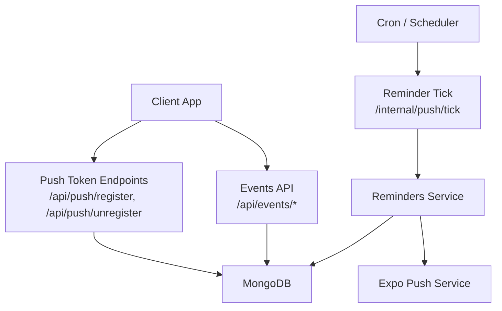
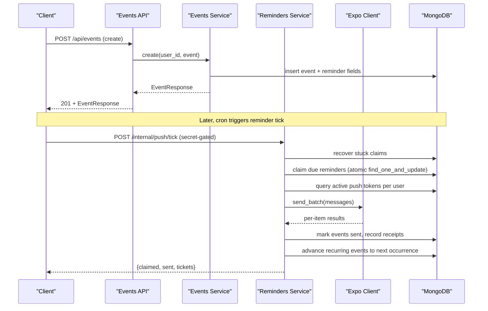
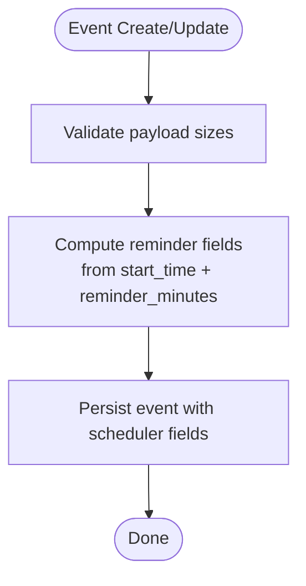
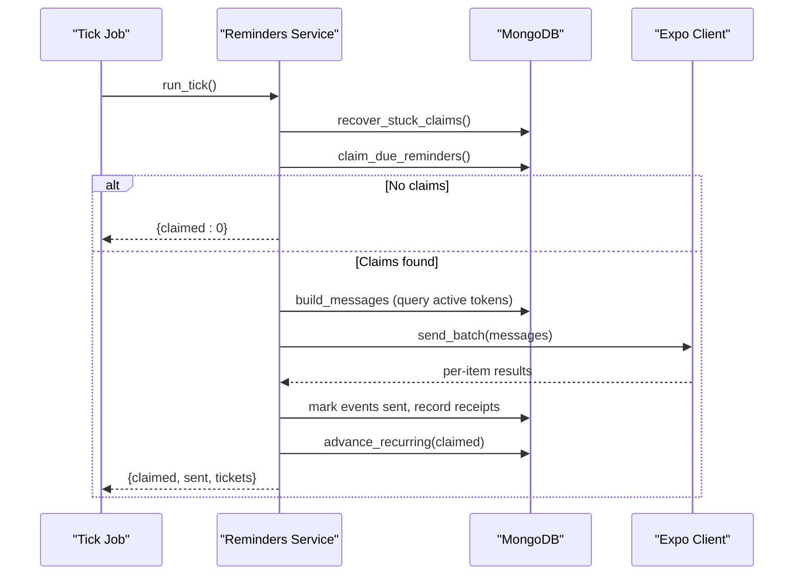
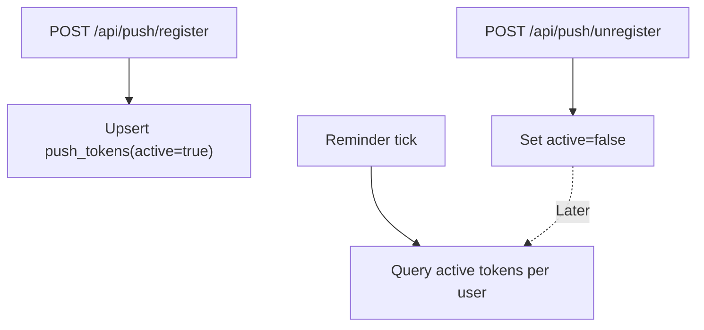
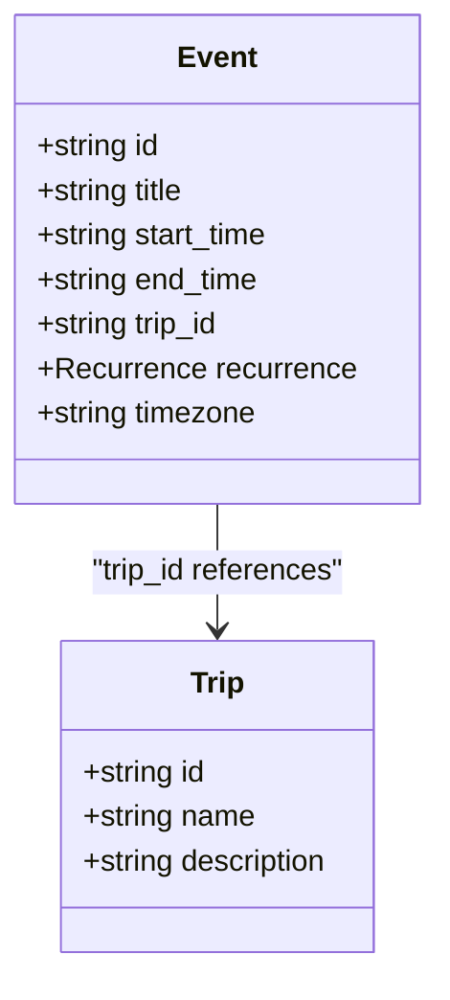
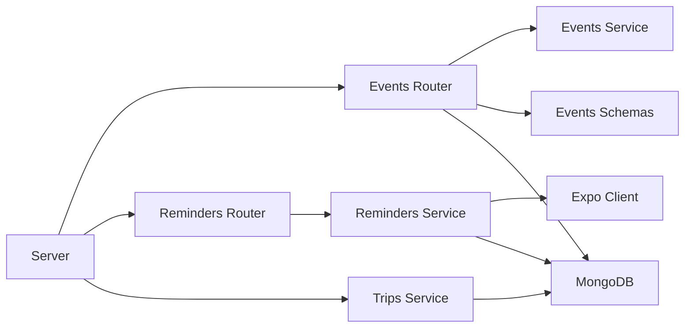

# Event Management

<cite>
**Referenced Files in This Document**
- [events/router.py](file://events/router.py)
- [events/service.py](file://events/service.py)
- [events/schemas.py](file://events/schemas.py)
- [reminders/router.py](file://reminders/router.py)
- [reminders/service.py](file://reminders/service.py)
- [reminders/expo_client.py](file://reminders/expo_client.py)
- [trips/service.py](file://trips/service.py)
- [server.py](file://server.py)
- [core/deps.py](file://core/deps.py)
</cite>

## Table of Contents
1. [Introduction](#introduction)
2. [Project Structure](#project-structure)
3. [Core Components](#core-components)
4. [Architecture Overview](#architecture-overview)
5. [Detailed Component Analysis](#detailed-component-analysis)
6. [Dependency Analysis](#dependency-analysis)
7. [Performance Considerations](#performance-considerations)
8. [Troubleshooting Guide](#troubleshooting-guide)
9. [Conclusion](#conclusion)

## Introduction
This document explains the Event Management sub-feature: calendar event CRUD, reminder scheduling, and push notification integration. It covers how events are created with start/end times, timezone handling, recurrence patterns, and how reminders are scheduled and delivered via push notifications. It also documents the relationship between events and trips, timeline synchronization, categorization fields, event status management, and common operational issues such as timezone conversions, reminder delivery failures, and performance optimization for large calendars.

## Project Structure
The Event Management feature spans several modules:
- Events API: routers, schemas, and service logic for creating, reading, updating, deleting, and listing events with pagination and batch retrieval.
- Reminders: internal tick endpoints that claim due reminders, send push notifications via Expo, track receipts, and advance recurring events to their next occurrence.
- Trips: lightweight grouping of events under a trip; events carry a trip_id reference used for timeline views computed client-side.
- Server bootstrap: database connection, index creation, and registration of push token endpoints.

**Diagram sources**
- [events/router.py:23-110](file://events/router.py#L23-L110)
- [reminders/router.py:19-28](file://reminders/router.py#L19-L28)
- [reminders/service.py:159-177](file://reminders/service.py#L159-L177)
- [server.py:134-162](file://server.py#L134-L162)

**Section sources**
- [events/router.py:1-111](file://events/router.py#L1-L111)
- [events/service.py:1-312](file://events/service.py#L1-L312)
- [events/schemas.py:1-101](file://events/schemas.py#L1-L101)
- [reminders/router.py:1-29](file://reminders/router.py#L1-L29)
- [reminders/service.py:1-215](file://reminders/service.py#L1-L215)
- [reminders/expo_client.py:1-50](file://reminders/expo_client.py#L1-L50)
- [trips/service.py:1-102](file://trips/service.py#L1-L102)
- [server.py:134-162](file://server.py#L134-L162)
- [server.py:345-407](file://server.py#L345-L407)
- [core/deps.py:15-51](file://core/deps.py#L15-L51)

## Core Components
- Events Service: validates payloads, computes reminder scheduler fields, handles recurrence math, persists events, and supports paginated list, single get, batch get, update, and delete.
- Events Schemas: defines Recurrence (frequency, optional byweekday, optional until), EventCreate/EventUpdate/EventResponse models, and request/response shapes.
- Reminders Service: claims due reminders atomically, builds push messages per active device token, sends via Expo in batches, records receipts, resolves delivery outcomes, and advances recurring events to the next occurrence.
- Expo Client: thin HTTP adapter over Expo’s send and receipt endpoints with region-aware URLs and optional access token.
- Trips Integration: events can be grouped under trips via trip_id; deletion cascades by unsetting trip_id on linked events.
- Server: registers push token endpoints and creates indexes for efficient event listing and reminder ticking.

Key responsibilities and boundaries:
- Events module owns event persistence and business rules (payload size limits, reminder field computation, recurrence).
- Reminders module owns the delivery pipeline and is decoupled from HTTP concerns except for internal tick routes.
- Trips module provides grouping semantics without storing ordering or schedule data; timelines are computed client-side from linked events.

**Section sources**
- [events/service.py:163-312](file://events/service.py#L163-L312)
- [events/schemas.py:5-89](file://events/schemas.py#L5-L89)
- [reminders/service.py:37-215](file://reminders/service.py#L37-L215)
- [reminders/expo_client.py:18-50](file://reminders/expo_client.py#L18-L50)
- [trips/service.py:47-102](file://trips/service.py#L47-L102)
- [server.py:134-162](file://server.py#L134-L162)
- [server.py:345-407](file://server.py#L345-L407)

## Architecture Overview
The system implements an atomic reminder scheduling and delivery pipeline:
- On create/update, events store reminder scheduler fields derived from start_time and reminder_minutes.
- A cron job calls the internal tick endpoint to claim due reminders, send push notifications, record receipts, and advance recurring events.
- Receipts are resolved asynchronously to handle device de-registration and errors.

**Diagram sources**
- [events/router.py:23-34](file://events/router.py#L23-L34)
- [events/service.py:167-199](file://events/service.py#L167-L199)
- [reminders/router.py:19-22](file://reminders/router.py#L19-L22)
- [reminders/service.py:44-177](file://reminders/service.py#L44-L177)
- [reminders/expo_client.py:26-37](file://reminders/expo_client.py#L26-L37)

## Detailed Component Analysis

### Events CRUD and Scheduling Fields
- Create: Validates payload sizes, assigns IDs and timestamps, stores recurrence/timezone/trip/google sync fields, and computes reminder scheduler fields (reminder_fire_at, reminder_status, reminder_claimed_at). Past-due guard ensures no future reminders fire for already-passed events.
- Read: Paginated list supports month/year filters, deterministic sort using (start_time, id), and returns normalized updated_at for offline conflict resolution. Single get and batch get support efficient retrieval.
- Update: Allows partial updates; explicitly clearing certain fields (reminder_minutes, recurrence, trip_id, google sync fields, attendees) is supported. When timing or recurrence changes, reminder scheduler fields are recomputed only if the fire time moves.
- Delete: Removes event by id scoped to user.

Timezone and recurrence:
- Timezone is stored and used to compute next occurrences in local wall-clock space, ensuring DST transitions do not alter the intended local time.
- Recurrence supports daily/weekly/monthly/yearly frequencies, optional byweekday mapping, and inclusive until date. Occurrence generation is capped to prevent unbounded series.

**Diagram sources**
- [events/service.py:142-199](file://events/service.py#L142-L199)
- [events/service.py:267-306](file://events/service.py#L267-L306)

**Section sources**
- [events/service.py:142-199](file://events/service.py#L142-L199)
- [events/service.py:201-312](file://events/service.py#L201-L312)
- [events/schemas.py:5-89](file://events/schemas.py#L5-L89)

### Reminder Scheduler and Delivery Pipeline
- Recovery: Stuck claims older than a threshold are reset to pending to avoid lost reminders after crashes.
- Claiming: Atomic per-event claim prevents double-sends across overlapping ticks.
- Message Building: For each claimed event, queries active push tokens per user; if none exist, marks reminder as sent immediately.
- Sending: Batches up to a provider limit; tracks per-item results; marks events as sent and records receipts when successful.
- Receipt Resolution: Periodically polls for delivery receipts; deactivates tokens reported as DeviceNotRegistered; prunes stale receipts.
- Recurring Advancement: After sending, recurring events are advanced to the next occurrence based on recurrence rules and timezone; if series ended, stays terminal.

**Diagram sources**
- [reminders/service.py:44-177](file://reminders/service.py#L44-L177)
- [reminders/expo_client.py:26-37](file://reminders/expo_client.py#L26-L37)

**Section sources**
- [reminders/service.py:44-177](file://reminders/service.py#L44-L177)
- [reminders/expo_client.py:18-50](file://reminders/expo_client.py#L18-L50)

### Push Notification Token Management
- Register: Upserts a device token per user with active flag and platform metadata.
- Unregister: Marks token inactive while retaining it for late receipt resolution.
- Usage in reminders: Active tokens are queried per user when building push messages; invalid tokens are deactivated via receipt resolution.

**Diagram sources**
- [server.py:134-162](file://server.py#L134-L162)
- [reminders/service.py:69-91](file://reminders/service.py#L69-L91)
- [reminders/service.py:200-212](file://reminders/service.py#L200-L212)

**Section sources**
- [server.py:134-162](file://server.py#L134-L162)
- [reminders/service.py:69-91](file://reminders/service.py#L69-L91)
- [reminders/service.py:200-212](file://reminders/service.py#L200-L212)

### Relationship Between Events and Trips
- Events carry a trip_id to group them under a trip. The backend does not enforce referential integrity at schema level; instead, deletion cascades by unsetting trip_id on all linked events before deleting the trip.
- Timeline views are computed client-side by sorting linked events by start_time; no separate ordering or schedule data lives in trips.

**Diagram sources**
- [events/schemas.py:11-89](file://events/schemas.py#L11-L89)
- [trips/service.py:93-102](file://trips/service.py#L93-L102)

**Section sources**
- [trips/service.py:93-102](file://trips/service.py#L93-L102)
- [events/schemas.py:11-89](file://events/schemas.py#L11-L89)

### Event Categorization and Metadata
- Category-like fields include:
  - trip_id: groups events into trips (itinerary).
  - linked_note_ids: associates notes with events.
  - google_event_id/google_calendar_id/google_event_updated/attendees: mirrors Google Calendar identity and read-only attendee list for sync scenarios.
  - device_calendar_event_id: links to device calendar entries.
  - enc_version: indicates encryption state for content fields.

These fields enable cross-feature integrations and client-side organization without altering core event scheduling logic.

**Section sources**
- [events/schemas.py:11-89](file://events/schemas.py#L11-L89)

### Event Status Management
- Internal reminder status lifecycle:
  - pending: eligible to be claimed by the next tick.
  - claimed: atomically reserved for delivery within a tick; may revert to pending if stuck.
  - sent: successfully processed (either sent or no active tokens); recurring events are advanced to next occurrence.
- Timestamps:
  - reminder_fire_at: computed as start_time minus reminder_minutes.
  - reminder_claimed_at: set during claim; used for stuck-claim recovery.

**Section sources**
- [events/service.py:39-53](file://events/service.py#L39-L53)
- [reminders/service.py:44-67](file://reminders/service.py#L44-L67)
- [reminders/service.py:120-158](file://reminders/service.py#L120-L158)

## Dependency Analysis
- Events router depends on EventsService and Pydantic schemas; uses FastAPI dependencies for current user and database.
- Reminders router depends on RemindersService; protected by a shared secret header.
- RemindersService depends on MongoDB collections (events, push_tokens, push_receipts) and ExpoClient.
- ExpoClient depends on region configuration for endpoint URLs and optional access token.
- TripsService interacts with events collection to cascade unset trip_id on deletion.
- Server bootstraps database connections, includes routers, and creates indexes for performance.

**Diagram sources**
- [events/router.py:1-111](file://events/router.py#L1-L111)
- [reminders/router.py:1-29](file://reminders/router.py#L1-L29)
- [reminders/service.py:1-215](file://reminders/service.py#L1-L215)
- [trips/service.py:1-102](file://trips/service.py#L1-L102)
- [server.py:175-197](file://server.py#L175-L197)

**Section sources**
- [events/router.py:1-111](file://events/router.py#L1-L111)
- [reminders/router.py:1-29](file://reminders/router.py#L1-L29)
- [reminders/service.py:1-215](file://reminders/service.py#L1-L215)
- [trips/service.py:1-102](file://trips/service.py#L1-L102)
- [server.py:175-197](file://server.py#L175-L197)

## Performance Considerations
- Pagination and indexing:
  - Events list uses deterministic sort with (start_time, id) and page_size capped to match historical behavior.
  - Indexes created for events: (user_id, start_time), compound (user_id, start_time, id), (user_id, id), id, and a partial index on reminder_status=“pending” plus reminder_fire_at to optimize tick queries.
  - Trips and push_tokens have appropriate indexes for list and lookup operations.
- Batch operations:
  - Events batch endpoint reduces N+1 queries by fetching multiple events in one call.
  - Reminder sending batches up to provider limits; receipts resolution batches ticket lookups.
- Backpressure and caps:
  - MAX_CLAIM_PER_TICK limits per-tick processing to avoid runaway loops.
  - Recurrence occurrence generation capped to a maximum count to prevent unbounded series.
  - Payload size validation protects against oversized writes.

[No sources needed since this section provides general guidance]

## Troubleshooting Guide
Common issues and resolutions:
- Timezone conversions:
  - Ensure events specify timezone for accurate recurrence and reminder firing. The system converts start times to local wall-clock for recurrence math and back to UTC for storage.
  - If reminders appear off by an hour around DST, verify the event’s timezone and that recurrence rules use local day-of-week mappings.
- Reminder delivery failures:
  - Check for stuck claims: if a tick crashed mid-send, stuck claims older than a threshold are recovered automatically.
  - Verify active push tokens: if no active tokens exist, reminders are marked sent immediately; ensure devices register tokens and remain active.
  - Review receipt resolution: DeviceNotRegistered deactivates tokens; re-register tokens on device.
- Large event calendars:
  - Use paginated list endpoints with appropriate page_size.
  - Prefer batch retrieval for multiple events to reduce N+1 queries.
  - Ensure indexes are present; server startup creates required indexes.
- Event updates:
  - When changing start_time, reminder_minutes, or recurrence, reminder scheduler fields are recomputed only if the fire time changes. Explicitly clear fields by setting null where supported.

**Section sources**
- [events/service.py:69-122](file://events/service.py#L69-L122)
- [reminders/service.py:44-67](file://reminders/service.py#L44-L67)
- [reminders/service.py:200-212](file://reminders/service.py#L200-L212)
- [server.py:345-407](file://server.py#L345-L407)

## Conclusion
The Event Management sub-feature provides robust CRUD operations for calendar events with strong support for timezone-aware recurrence and reliable reminder scheduling. The atomic claim-and-send pipeline ensures safe delivery even under concurrent ticks, while receipt resolution maintains token hygiene. Events integrate with trips for itinerary grouping and expose categorization fields for cross-feature linkage. Proper indexing and batching strategies keep performance predictable for large calendars.