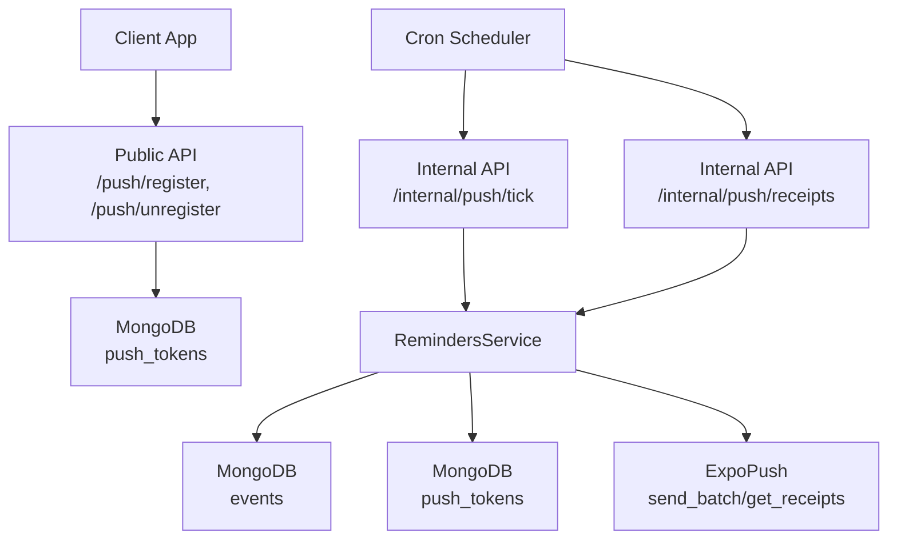
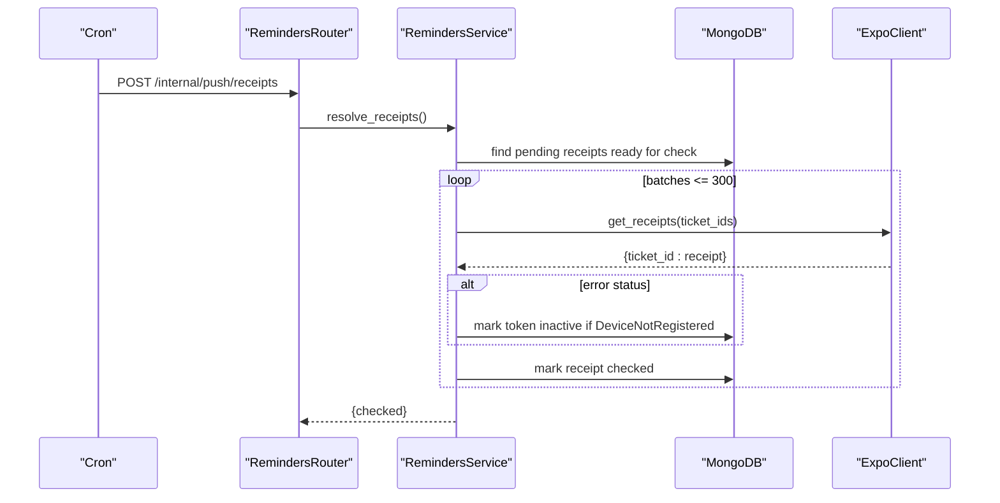
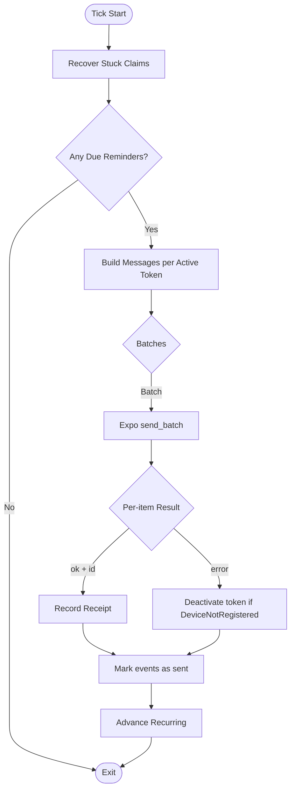
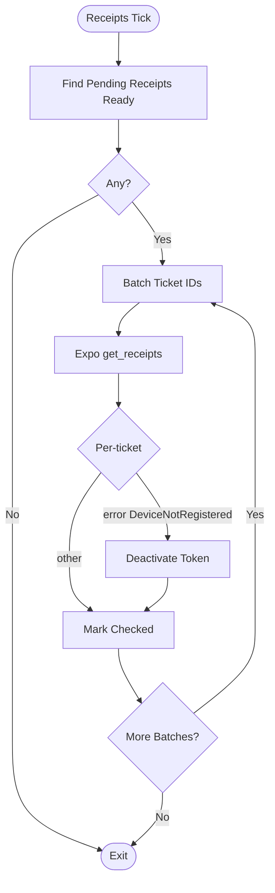
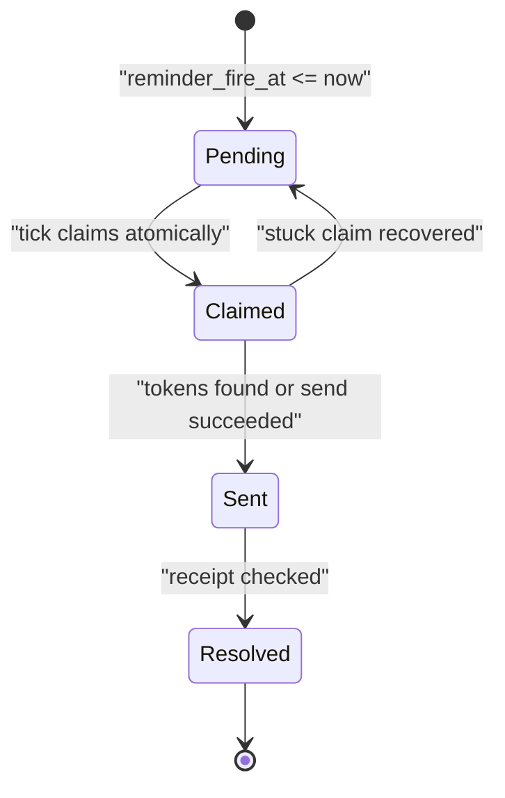
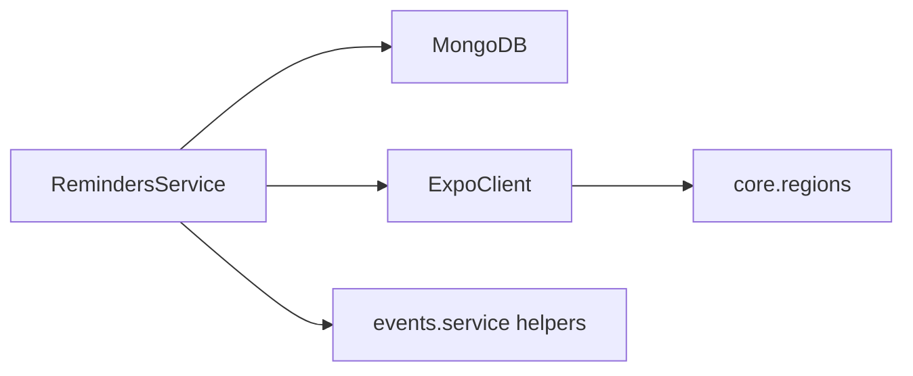

# Push Notifications

<cite>
**Referenced Files in This Document**
- [server.py](file://server.py)
- [reminders/router.py](file://reminders/router.py)
- [reminders/service.py](file://reminders/service.py)
- [reminders/expo_client.py](file://reminders/expo_client.py)
- [events/service.py](file://events/service.py)
- [core/regions.py](file://core/regions.py)
</cite>

## Table of Contents
1. [Introduction](#introduction)
2. [Project Structure](#project-structure)
3. [Core Components](#core-components)
4. [Architecture Overview](#architecture-overview)
5. [Detailed Component Analysis](#detailed-component-analysis)
6. [Dependency Analysis](#dependency-analysis)
7. [Performance Considerations](#performance-considerations)
8. [Troubleshooting Guide](#troubleshooting-guide)
9. [Conclusion](#conclusion)
10. [Appendices](#appendices)

## Introduction
This document explains the push notification system integrated with event management. It covers device token registration, delivery via Expo Push, message routing based on events and user preferences, the end-to-end lifecycle from trigger to delivery, retry and failure handling, and operational concerns such as scalability, rate limiting, and monitoring delivery success rates.

## Project Structure
The push notification system spans several modules:
- Device token registration and unregistration are exposed via public API endpoints.
- A cron-driven tick job claims due reminders, builds messages, sends them through Expo, and records receipts for later resolution.
- Event scheduling computes reminder timing and recurrence logic used by the tick job.
- External service endpoints (Expo Push send and receipts) are centrally configured and validated for region compliance.

**Diagram sources**
- [server.py:125-162](file://server.py#L125-L162)
- [reminders/router.py:19-28](file://reminders/router.py#L19-L28)
- [reminders/service.py:159-177](file://reminders/service.py#L159-L177)
- [reminders/expo_client.py:26-49](file://reminders/expo_client.py#L26-L49)
- [core/regions.py:194-199](file://core/regions.py#L194-L199)

**Section sources**
- [server.py:125-162](file://server.py#L125-L162)
- [reminders/router.py:1-29](file://reminders/router.py#L1-L29)
- [reminders/service.py:1-215](file://reminders/service.py#L1-L215)
- [reminders/expo_client.py:1-50](file://reminders/expo_client.py#L1-L50)
- [events/service.py:39-53](file://events/service.py#L39-L53)
- [core/regions.py:194-199](file://core/regions.py#L194-L199)

## Core Components
- Public push token endpoints: register and unregister device tokens per authenticated user.
- Internal tick endpoints: protected by a shared secret; one triggers the reminder pipeline, the other resolves delivery receipts.
- RemindersService: orchestrates claiming due reminders, building Expo messages, sending batches, recording receipts, advancing recurring reminders, and resolving receipts.
- ExpoClient: thin HTTP adapter over Expo’s send and receipt endpoints using region-configured URLs.
- Event scheduling helpers: compute reminder fire times and next occurrences for recurring events.

Key responsibilities:
- Token management: upsert active tokens per user; mark inactive on logout or when devices are reported unregistered.
- Delivery: batched sending to Expo with per-item result handling; track tickets for delayed receipt resolution.
- Recurrence: roll forward recurring events to their next scheduled occurrence after successful processing.
- Resilience: recover stuck claims, handle transport failures gracefully, and prune stale receipts.

**Section sources**
- [server.py:125-162](file://server.py#L125-L162)
- [reminders/router.py:12-28](file://reminders/router.py#L12-L28)
- [reminders/service.py:37-177](file://reminders/service.py#L37-L177)
- [reminders/expo_client.py:18-49](file://reminders/expo_client.py#L18-L49)
- [events/service.py:39-53](file://events/service.py#L39-L53)

## Architecture Overview
The system uses a two-phase cron-driven process:
1) Reminder dispatch: claim due reminders, build messages, send via Expo, record receipts, advance recurring events.
2) Receipt resolution: poll Expo for delivery results, deactivate invalid tokens, and mark receipts as checked.

```mermaid
sequenceDiagram
participant Cron as "Cron"
participant Router as "RemindersRouter"
participant Svc as "RemindersService"
participant Mongo as "MongoDB"
participant Expo as "ExpoClient"
Cron->>Router : POST /internal/push/tick
Router->>Svc : run_tick()
Svc->>Mongo : recover_stuck_claims()
Svc->>Mongo : claim_due_reminders()
Svc->>Mongo : find active push_tokens per user
Svc->>Svc : build_messages()
loop batches <= 100
Svc->>Expo : send_batch(messages)
Expo-->>Svc : per-item results
alt ok with id
Svc->>Mongo : insert push_receipts
else error
Svc->>Mongo : mark token inactive if DeviceNotRegistered
end
end
Svc->>Mongo : update events to sent
Svc->>Svc : advance_recurring()
Svc-->>Router : {claimed, sent, tickets}
```

**Diagram sources**
- [reminders/router.py:19-22](file://reminders/router.py#L19-L22)
- [reminders/service.py:44-177](file://reminders/service.py#L44-L177)
- [reminders/expo_client.py:26-37](file://reminders/expo_client.py#L26-L37)

**Diagram sources**
- [reminders/router.py:25-28](file://reminders/router.py#L25-L28)
- [reminders/service.py:181-214](file://reminders/service.py#L181-L214)
- [reminders/expo_client.py:39-49](file://reminders/expo_client.py#L39-L49)

## Detailed Component Analysis

### Device Token Registration and Unregistration
- Register: Upserts a device token per user, marking it active and storing platform metadata.
- Unregister: Marks a token inactive (e.g., on logout), preserving it so late receipts can still be resolved.

These operations ensure that only active tokens receive reminders and that account cleanup can deactivate tokens without losing historical receipt data.

**Section sources**
- [server.py:129-162](file://server.py#L129-L162)

### Reminder Dispatch Pipeline (run_tick)
- Recover stuck claims: Reclaims events claimed too long ago back to pending.
- Claim due reminders: Atomically selects due, pending reminders up to a cap per tick.
- Build messages: For each event, finds active tokens; constructs Expo payloads with title, body, data, sound, and channel. If no active tokens exist, marks the event as sent immediately.
- Send and track: Batches messages (up to 100 per call). Records ticket IDs for receipt tracking; deactivates tokens on DeviceNotRegistered errors.
- Advance recurring: Computes next occurrence for recurring events and schedules the next reminder time.

**Diagram sources**
- [reminders/service.py:44-177](file://reminders/service.py#L44-L177)

**Section sources**
- [reminders/service.py:44-177](file://reminders/service.py#L44-L177)

### Receipt Resolution Pipeline (resolve_receipts)
- Finds receipts older than a readiness window and not yet checked.
- Batches ticket IDs (up to 300 per call) and queries Expo for delivery status.
- On error receipts, deactivates tokens for DeviceNotRegistered; otherwise marks receipts as checked.
- Stops chasing receipts beyond a maximum age.

**Diagram sources**
- [reminders/service.py:181-214](file://reminders/service.py#L181-L214)
- [reminders/expo_client.py:39-49](file://reminders/expo_client.py#L39-L49)

**Section sources**
- [reminders/service.py:181-214](file://reminders/service.py#L181-L214)

### Message Payload Structure
Each Expo message includes:
- to: device token
- title: event title or generic fallback when encrypted
- body: human-readable “starts in …” label derived from reminder_minutes
- data: eventId and kind for client routing
- sound: default
- channelId: event-reminders

Title behavior respects encryption state to avoid showing ciphertext.

**Section sources**
- [reminders/service.py:69-91](file://reminders/service.py#L69-L91)
- [events/service.py:33-36](file://events/service.py#L33-L36)

### Notification Lifecycle from Trigger to Delivery
- Trigger: Events have reminder_minutes set; server computes reminder_fire_at and sets initial status.
- Dispatch: The tick job claims due reminders, builds messages, sends via Expo, and records receipts.
- Delivery: Expo delivers to devices; receipts are polled later to confirm success or failure.
- Completion: Receipts are marked checked; invalid tokens are deactivated; recurring events are rescheduled.

**Diagram sources**
- [reminders/service.py:44-177](file://reminders/service.py#L44-L177)
- [events/service.py:39-53](file://events/service.py#L39-L53)

**Section sources**
- [reminders/service.py:44-177](file://reminders/service.py#L44-L177)
- [events/service.py:39-53](file://events/service.py#L39-L53)

### Retry Logic and Failure Handling
- Transport failures: If Expo send_batch fails entirely, events remain claimed and will be retried by subsequent ticks after stuck-claim recovery.
- Per-item errors: DeviceNotRegistered deactivates the token; other errors are logged and do not block further processing.
- Receipts: If Expo never returns a receipt within a given window, the receipt is marked checked to stop chasing it.

**Section sources**
- [reminders/service.py:93-118](file://reminders/service.py#L93-L118)
- [reminders/service.py:181-214](file://reminders/service.py#L181-L214)

### User Preferences and Event Settings
- Reminder preference: Each event carries reminder_minutes; when set, the system schedules a reminder before the event start time.
- Recurrence: Events may recur; after processing, the next occurrence is computed and scheduled accordingly.
- Title visibility: When event content is encrypted, the server falls back to a generic reminder title to avoid leaking ciphertext.

**Section sources**
- [events/service.py:39-53](file://events/service.py#L39-L53)
- [events/service.py:69-122](file://events/service.py#L69-L122)
- [reminders/service.py:78-90](file://reminders/service.py#L78-L90)

## Dependency Analysis
- RemindersService depends on:
  - MongoDB collections: events, push_tokens, push_receipts
  - ExpoClient for network calls to Expo endpoints
  - Event scheduling helpers for recurrence math and labels
- ExpoClient depends on core.regions for validated endpoint URLs and region checks.
- Internal tick endpoints are protected by a shared secret header.

**Diagram sources**
- [reminders/service.py:37-41](file://reminders/service.py#L37-L41)
- [reminders/expo_client.py:18-24](file://reminders/expo_client.py#L18-L24)
- [core/regions.py:194-199](file://core/regions.py#L194-L199)
- [events/service.py:33-36](file://events/service.py#L33-L36)

**Section sources**
- [reminders/service.py:37-41](file://reminders/service.py#L37-L41)
- [reminders/expo_client.py:18-24](file://reminders/expo_client.py#L18-L24)
- [core/regions.py:194-199](file://core/regions.py#L194-L199)
- [events/service.py:33-36](file://events/service.py#L33-L36)

## Performance Considerations
- Atomicity and concurrency:
  - Claiming uses find_one_and_update to prevent double-sends across overlapping ticks.
  - A per-tick cap limits the number of claimed events to avoid runaway loops.
- Batching:
  - Expo send_batch supports up to 100 messages per call; receipts polling supports up to 300 ticket IDs.
  - Receipt fetching is capped per tick to avoid large scans.
- Timeouts and resilience:
  - Network calls use timeouts; exceptions are logged and treated as transient failures, leaving work for retries.
- Indexes:
  - push_tokens indexed by user_id and token to optimize lookups and deduplication.

Operational tips:
- Tune MAX_CLAIM_PER_TICK, RECEIPT_FETCH_LIMIT, and batch sizes according to expected load.
- Ensure cron frequency balances latency vs. throughput (e.g., every minute for dispatch; every 15–20 minutes for receipts).

[No sources needed since this section provides general guidance]

## Troubleshooting Guide
Common issues and resolutions:
- No reminders received:
  - Verify device tokens are registered and active for the user.
  - Check that events have reminder_minutes set and reminder_fire_at is in the past.
  - Confirm internal tick endpoints are being called successfully.
- Duplicate reminders:
  - Ensure only one tick instance runs at a time; atomic claiming prevents duplicates under normal operation.
- Device unregistered errors:
  - Tokens are automatically deactivated; prompt users to re-register tokens on app launch.
- Stuck claims:
  - Stuck claims older than a threshold are recovered back to pending; verify tick runs consistently.
- Missing receipts:
  - Receipts become available after a delay; if never returned, they are marked checked after a maximum age.

Monitoring recommendations:
- Track metrics for:
  - claimed, sent, tickets per tick
  - checked receipts per receipts tick
  - DeviceNotRegistered counts
  - Error rates from ExpoClient
- Alert on:
  - Zero claimed/sent for extended periods
  - High DeviceNotRegistered rates indicating mass uninstallation or token churn
  - Frequent transport failures from ExpoClient

**Section sources**
- [reminders/service.py:24-34](file://reminders/service.py#L24-L34)
- [reminders/service.py:93-118](file://reminders/service.py#L93-L118)
- [reminders/service.py:181-214](file://reminders/service.py#L181-L214)

## Conclusion
The push notification system integrates tightly with event management to deliver timely reminders via Expo Push. It ensures reliability through atomic claiming, robust batching, delayed receipt resolution, and automatic cleanup of invalid tokens. Operational controls like region validation, secret-gated internal endpoints, and bounded loops support safe scaling. Monitoring and alerting around key metrics enable proactive maintenance and high delivery success rates.

[No sources needed since this section summarizes without analyzing specific files]

## Appendices

### API Reference: Push Token Management
- Register device token
  - Method: POST
  - Path: /api/push/register
  - Auth: Required
  - Body: token, platform
  - Behavior: Upserts active token per user
- Unregister device token
  - Method: POST
  - Path: /api/push/unregister
  - Auth: Required
  - Body: token, platform
  - Behavior: Marks token inactive

**Section sources**
- [server.py:129-162](file://server.py#L129-L162)

### Internal Endpoints: Cron Jobs
- Reminder dispatch tick
  - Method: POST
  - Path: /internal/push/tick
  - Auth: Shared secret header required
  - Behavior: Claims due reminders, sends via Expo, records receipts, advances recurring
- Receipt resolution tick
  - Method: POST
  - Path: /internal/push/receipts
  - Auth: Shared secret header required
  - Behavior: Polls Expo for delivery receipts, deactivates invalid tokens, marks receipts checked

**Section sources**
- [reminders/router.py:12-28](file://reminders/router.py#L12-L28)

### Configuration: Expo Push Endpoints
- EXPO_PUSH_SEND_URL: Endpoint for sending push notifications
- EXPO_PUSH_RECEIPTS_URL: Endpoint for retrieving delivery receipts
- Region enforcement: Both endpoints must be declared and validated against an Australian region allowlist

**Section sources**
- [core/regions.py:58-66](file://core/regions.py#L58-L66)
- [core/regions.py:194-199](file://core/regions.py#L194-L199)