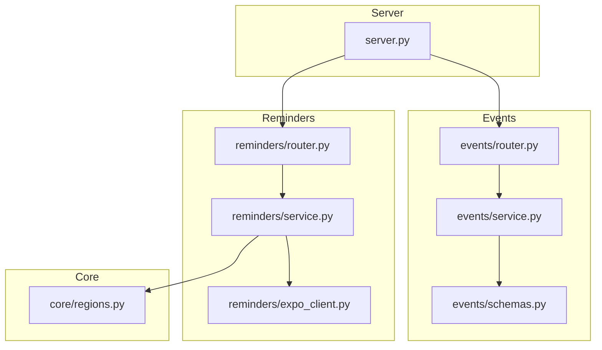
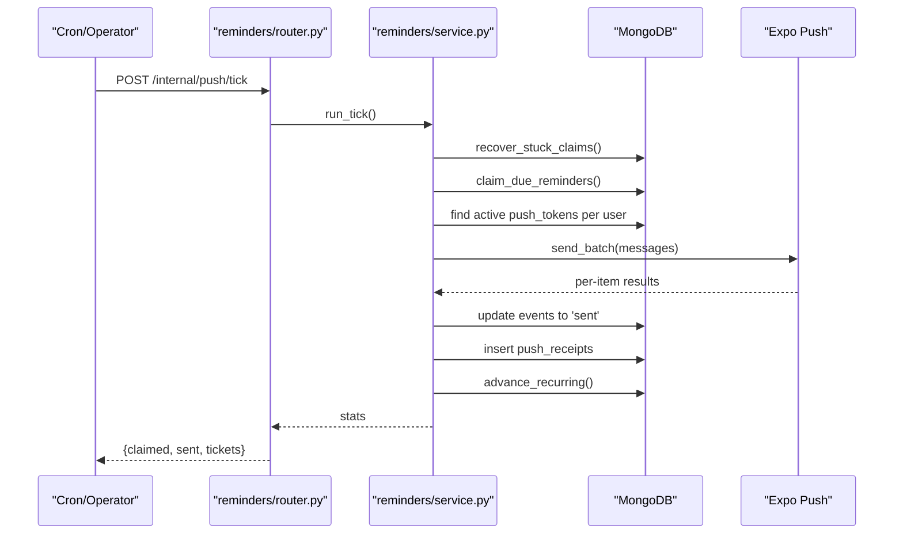
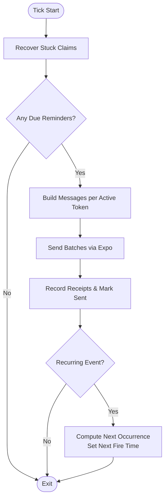
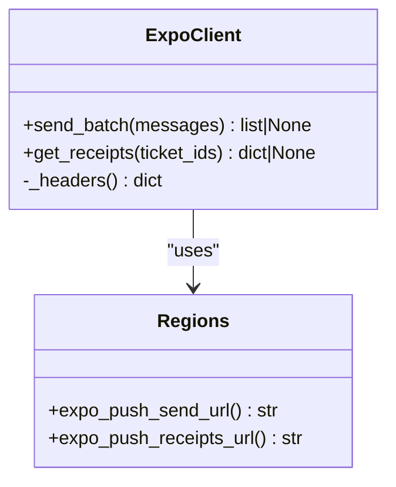
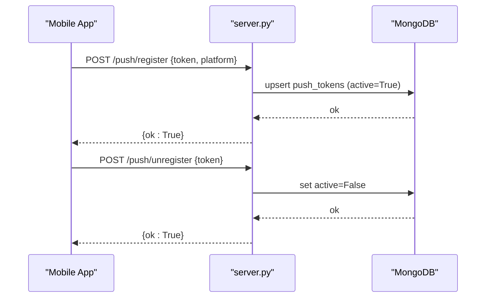
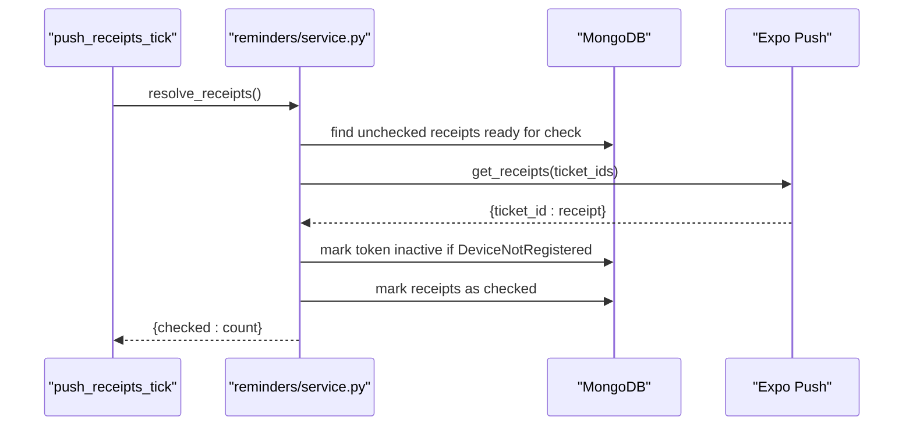
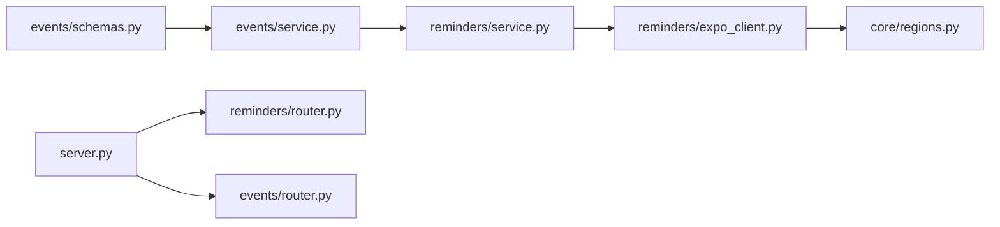

# Reminder Scheduling

<cite>
**Referenced Files in This Document**
- [server.py](file://server.py)
- [reminders/router.py](file://reminders/router.py)
- [reminders/service.py](file://reminders/service.py)
- [reminders/expo_client.py](file://reminders/expo_client.py)
- [events/router.py](file://events/router.py)
- [events/service.py](file://events/service.py)
- [events/schemas.py](file://events/schemas.py)
- [core/regions.py](file://core/regions.py)
- [accounts/service.py](file://accounts/service.py)
</cite>

## Table of Contents
1. [Introduction](#introduction)
2. [Project Structure](#project-structure)
3. [Core Components](#core-components)
4. [Architecture Overview](#architecture-overview)
5. [Detailed Component Analysis](#detailed-component-analysis)
6. [Dependency Analysis](#dependency-analysis)
7. [Performance Considerations](#performance-considerations)
8. [Troubleshooting Guide](#troubleshooting-guide)
9. [Conclusion](#conclusion)
10. [Appendices](#appendices)

## Introduction
This document explains the reminder scheduling system that turns event creation and updates into scheduled push notifications. It covers how reminders are configured when creating or updating events, how time-based triggers and relative timing work, the scheduler architecture (claim-and-send loop), job queue processing via periodic ticks, delivery pipeline through Expo push, device token management, and notification delivery tracking. It also includes examples for setting up different reminder types and guidance for handling failures, retries, timezone issues, and device registration problems.

## Project Structure
The reminder system spans several modules:
- Events module computes reminder schedule fields from user-provided settings and recurrence rules.
- Reminders module runs periodic ticks to claim due reminders, send them via Expo, track receipts, and advance recurring events.
- Server exposes endpoints to register/unregister device tokens used by the delivery pipeline.
- Core region configuration centralizes external service URLs and enforces data residency constraints.

**Diagram sources**
- [events/router.py:23-96](file://events/router.py#L23-L96)
- [events/service.py:39-53](file://events/service.py#L39-L53)
- [events/schemas.py:5-35](file://events/schemas.py#L5-L35)
- [reminders/router.py:19-28](file://reminders/router.py#L19-L28)
- [reminders/service.py:37-177](file://reminders/service.py#L37-L177)
- [reminders/expo_client.py:18-49](file://reminders/expo_client.py#L18-L49)
- [server.py:126-162](file://server.py#L126-L162)
- [core/regions.py:194-199](file://core/regions.py#L194-L199)

**Section sources**
- [events/router.py:23-96](file://events/router.py#L23-L96)
- [events/service.py:39-53](file://events/service.py#L39-L53)
- [events/schemas.py:5-35](file://events/schemas.py#L5-L35)
- [reminders/router.py:19-28](file://reminders/router.py#L19-L28)
- [reminders/service.py:37-177](file://reminders/service.py#L37-L177)
- [reminders/expo_client.py:18-49](file://reminders/expo_client.py#L18-L49)
- [server.py:126-162](file://server.py#L126-L162)
- [core/regions.py:194-199](file://core/regions.py#L194-L199)

## Core Components
- Event creation/update computes reminder scheduling fields based on start time and reminder minutes. If a reminder is configured, it calculates a fire time before the event and sets status accordingly.
- The reminder scheduler runs periodic ticks to atomically claim due reminders, build messages per active device token, send batches via Expo, record tickets for receipt resolution, and advance recurring events to their next occurrence.
- Device token management allows clients to register/unregister push tokens; tokens are marked inactive when devices are unregistered or reported as not registered by Expo.
- Delivery tracking stores Expo ticket receipts and resolves them asynchronously to mark tokens as inactive if needed.

**Section sources**
- [events/service.py:39-53](file://events/service.py#L39-L53)
- [reminders/service.py:44-177](file://reminders/service.py#L44-L177)
- [server.py:126-162](file://server.py#L126-L162)
- [reminders/expo_client.py:26-49](file://reminders/expo_client.py#L26-L49)

## Architecture Overview
The reminder system follows a cron-driven tick pattern:
- A protected internal endpoint triggers a tick that claims due reminders atomically.
- Messages are built per event and active device token.
- Batches are sent via Expo with per-item result handling.
- Tickets are recorded for later receipt resolution.
- Recurring events are advanced to their next occurrence after sending.

**Diagram sources**
- [reminders/router.py:19-28](file://reminders/router.py#L19-L28)
- [reminders/service.py:159-177](file://reminders/service.py#L159-L177)
- [reminders/expo_client.py:26-37](file://reminders/expo_client.py#L26-L37)
- [events/service.py:39-53](file://events/service.py#L39-L53)

## Detailed Component Analysis

### Event Creation and Update: Reminder Configuration
When an event is created or updated:
- If reminder_minutes is set and start_time exists, compute_reminder_fields calculates reminder_fire_at as start_time minus reminder_minutes.
- If the computed fire time is already in the past or no reminder is configured, the event is marked as 'sent' so it does not queue a future reminder.
- On update, if start_time, reminder_minutes, or recurrence change, the reminder fields are recomputed; only changes that move the fire time reset the send state to avoid re-firing already-sent reminders.

Examples of configuring reminders:
- Before event: Set reminder_minutes to a positive integer (e.g., 5, 15, 30, 60, 1440). The system schedules a reminder at start_time - reminder_minutes.
- At event time: Use a small reminder_minutes value such that the fire time aligns closely with the event start.
- Custom intervals: Any minute value supported by the client can be used; the label will reflect the number of minutes.

Timezone handling:
- start_time is parsed as UTC-aware; if missing timezone info, it defaults to UTC.
- For recurring events, next_occurrence_on_or_after uses the event’s timezone to compute wall-clock occurrences and then converts back to UTC.

**Section sources**
- [events/service.py:39-53](file://events/service.py#L39-L53)
- [events/service.py:69-123](file://events/service.py#L69-L123)
- [events/service.py:167-199](file://events/service.py#L167-L199)
- [events/service.py:267-306](file://events/service.py#L267-L306)
- [events/schemas.py:5-35](file://events/schemas.py#L5-L35)

### Reminder Scheduler: Claim, Send, Track, Advance
The scheduler performs these steps each tick:
- Recover stuck claims: Reset events claimed too long ago back to pending to handle crashes between claim and send.
- Claim due reminders: Atomically select pending events with reminder_minutes set and reminder_fire_at in the past or now, marking them as claimed.
- Build messages: For each claimed event, fetch active device tokens for the user and create one message per token. If no active tokens exist, mark the event as sent immediately.
- Send and track: Batch messages to Expo (up to 100 per call). Record successful tickets and mark events as sent. Handle per-item errors; mark tokens inactive for DeviceNotRegistered.
- Advance recurring: For recurring events, compute the next occurrence using the event’s timezone and recurrence rule, then set the next reminder_fire_at and reset status to pending.

**Diagram sources**
- [reminders/service.py:44-177](file://reminders/service.py#L44-L177)

**Section sources**
- [reminders/service.py:44-177](file://reminders/service.py#L44-L177)

### Delivery Pipeline: Expo Integration
- ExpoClient wraps HTTP calls to Expo’s send and receipts endpoints using validated URLs from core regions configuration.
- send_batch posts up to 100 messages; returns per-item results or None on transport failure (leaves events claimed for retry).
- get_receipts queries up to 300 ticket IDs; returns a map of ticket_id to receipt or None on failure.

**Diagram sources**
- [reminders/expo_client.py:18-49](file://reminders/expo_client.py#L18-L49)
- [core/regions.py:194-199](file://core/regions.py#L194-L199)

**Section sources**
- [reminders/expo_client.py:18-49](file://reminders/expo_client.py#L18-L49)
- [core/regions.py:194-199](file://core/regions.py#L194-L199)

### Device Token Management
- Clients register push tokens via a protected endpoint that upserts a token for the current user, marking it active.
- Unregister marks a token inactive without deleting it, preserving linkage to receipts for cleanup.
- Tokens are queried during message building; only active tokens receive reminders.
- When Expo reports DeviceNotRegistered (either during send or receipt resolution), the token is marked inactive automatically.

**Diagram sources**
- [server.py:126-162](file://server.py#L126-L162)

**Section sources**
- [server.py:126-162](file://server.py#L126-L162)
- [reminders/service.py:72-91](file://reminders/service.py#L72-L91)
- [reminders/service.py:104-118](file://reminders/service.py#L104-L118)
- [reminders/service.py:200-213](file://reminders/service.py#L200-L213)

### Notification Delivery Tracking
- After sending, Expo ticket IDs are stored with event_id and token.
- A separate tick periodically resolves receipts for tickets older than a readiness window and prunes stale tokens.
- If a receipt indicates error with DeviceNotRegistered, the corresponding token is marked inactive.
- If receipts never resolve within a given timeframe, they are marked checked to stop chasing them.

**Diagram sources**
- [reminders/service.py:181-214](file://reminders/service.py#L181-L214)

**Section sources**
- [reminders/service.py:181-214](file://reminders/service.py#L181-L214)

## Dependency Analysis
- Events service depends on schemas for validation and provides helper functions used by both event persistence and the reminder scheduler.
- Reminders service depends on events helpers for recurrence math and labels, and on ExpoClient for delivery.
- ExpoClient depends on core regions for validated endpoint URLs.
- Server exposes push token endpoints and includes routers for events and reminders.

**Diagram sources**
- [events/schemas.py:5-35](file://events/schemas.py#L5-L35)
- [events/service.py:39-53](file://events/service.py#L39-L53)
- [reminders/service.py:17-20](file://reminders/service.py#L17-L20)
- [reminders/expo_client.py:13-14](file://reminders/expo_client.py#L13-L14)
- [core/regions.py:194-199](file://core/regions.py#L194-L199)
- [server.py:126-162](file://server.py#L126-L162)
- [events/router.py:23-96](file://events/router.py#L23-L96)

**Section sources**
- [events/schemas.py:5-35](file://events/schemas.py#L5-L35)
- [events/service.py:39-53](file://events/service.py#L39-L53)
- [reminders/service.py:17-20](file://reminders/service.py#L17-L20)
- [reminders/expo_client.py:13-14](file://reminders/expo_client.py#L13-L14)
- [core/regions.py:194-199](file://core/regions.py#L194-L199)
- [server.py:126-162](file://server.py#L126-L162)
- [events/router.py:23-96](file://events/router.py#L23-L96)

## Performance Considerations
- Atomic claiming prevents double-sends and limits batch size per tick to avoid unbounded loops.
- Expo batching reduces network overhead; per-call limits are respected.
- Receipt resolution batches reduce repeated polling costs and include timeouts and give-up thresholds to prevent indefinite chasing.
- Indexes on push_tokens (user_id, active) and token improve lookup performance during message building and token deactivation.

[No sources needed since this section provides general guidance]

## Troubleshooting Guide
Common issues and resolutions:
- Reminder not firing:
  - Ensure reminder_minutes is set and start_time is valid.
  - Check that reminder_fire_at is in the past or present; otherwise status remains pending.
  - Verify that the tick is running and has permission (secret header) to trigger the internal endpoints.

- Timezone mismatches:
  - start_time parsing defaults to UTC if no timezone info; ensure clients send correct ISO timestamps.
  - For recurring events, confirm the event’s timezone is set so next_occurrence_on_or_after computes wall-clock times correctly.

- Device registration problems:
  - Confirm push tokens are registered and active for the user.
  - If Expo reports DeviceNotRegistered, tokens are automatically marked inactive; re-register the token on the client.

- Delivery failures and retries:
  - Transport failures return None from ExpoClient; events remain claimed and will be retried on subsequent ticks.
  - Per-item errors are logged; DeviceNotRegistered leads to token deactivation.
  - Receipts may take time to become available; the receipt tick waits until a readiness window before querying.

- Account erasure side effects:
  - When erasing accounts, push_receipts tied to user tokens are deleted to comply with privacy requirements.

**Section sources**
- [events/service.py:39-53](file://events/service.py#L39-L53)
- [events/service.py:69-123](file://events/service.py#L69-L123)
- [reminders/router.py:12-22](file://reminders/router.py#L12-L22)
- [reminders/service.py:104-118](file://reminders/service.py#L104-L118)
- [reminders/service.py:181-214](file://reminders/service.py#L181-L214)
- [accounts/service.py:90-108](file://accounts/service.py#L90-L108)

## Conclusion
The reminder scheduling system integrates event configuration with a robust, cron-driven delivery pipeline. It ensures reliable scheduling through atomic claiming, handles recurring events with timezone-aware recurrence math, and maintains device token health via automatic deactivation on delivery failures. The modular design separates concerns across events, reminders, server endpoints, and core configuration, enabling clear testing and maintenance.

[No sources needed since this section summarizes without analyzing specific files]

## Appendices

### Examples: Setting Up Different Types of Reminders
- Before event:
  - Create or update an event with reminder_minutes set to a desired lead time (e.g., 15 minutes). The system schedules a reminder at start_time - 15 minutes.
- At event time:
  - Use a small reminder_minutes value so the fire time aligns closely with the event start.
- Custom intervals:
  - Any minute value can be configured; the label reflects the number of minutes.

**Section sources**
- [events/service.py:39-53](file://events/service.py#L39-L53)
- [events/schemas.py:22-26](file://events/schemas.py#L22-L26)