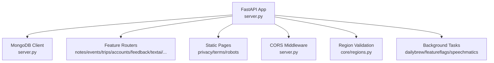
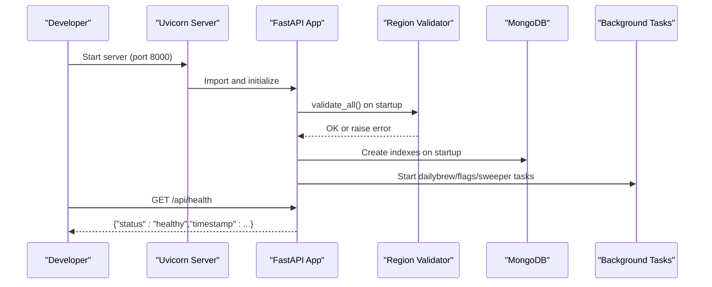
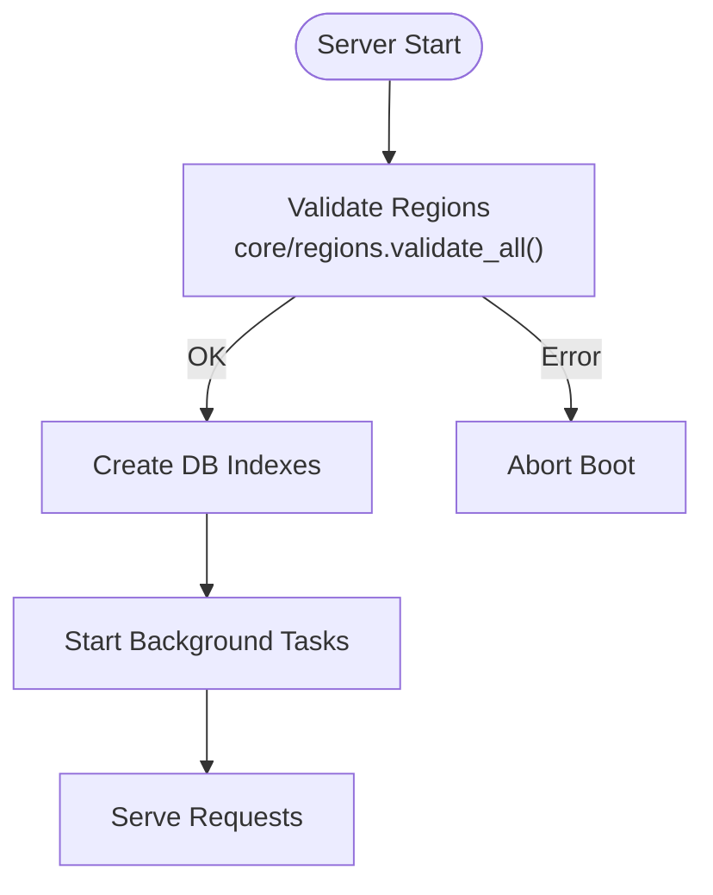
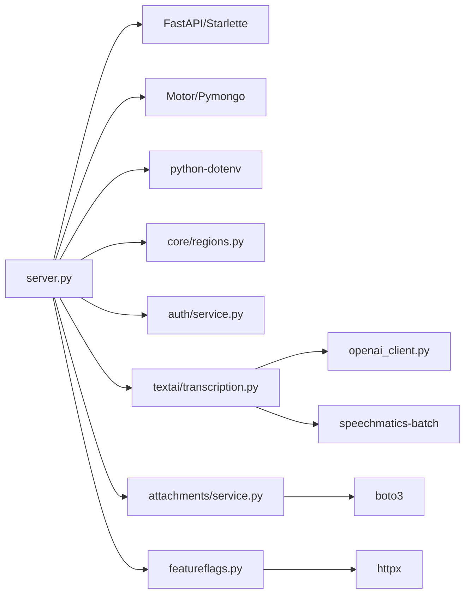

# Getting Started

<cite>
**Referenced Files in This Document**
- [server.py](file://server.py)
- [Procfile](file://Procfile)
- [requirements.txt](file://requirements.txt)
- [core/regions.py](file://core/regions.py)
- [openai_client.py](file://openai_client.py)
- [featureflags.py](file://featureflags.py)
- [attachments/service.py](file://attachments/service.py)
- [auth/service.py](file://auth/service.py)
- [textai/transcription.py](file://textai/transcription.py)
- [tests/test_nueco_apis.py](file://tests/test_nueco_apis.py)
</cite>

## Table of Contents
1. [Introduction](#introduction)
2. [Project Structure](#project-structure)
3. [Core Components](#core-components)
4. [Architecture Overview](#architecture-overview)
5. [Detailed Component Analysis](#detailed-component-analysis)
6. [Dependency Analysis](#dependency-analysis)
7. [Performance Considerations](#performance-considerations)
8. [Troubleshooting Guide](#troubleshooting-guide)
9. [Conclusion](#conclusion)
10. [Appendices](#appendices)

## Introduction
This guide helps you set up the Nueco Backend development environment from scratch, configure required environment variables for MongoDB and external services (OpenAI, Speechmatics, email, storage, analytics), run the server locally, verify it with a health check, and perform basic API testing. It also includes troubleshooting tips for common setup issues such as database connection problems, missing environment variables, and port conflicts.

## Project Structure
The backend is a FastAPI application that:
- Loads configuration from environment variables and a .env file
- Connects to MongoDB via Motor
- Mounts feature routers under /api
- Runs startup tasks like index creation, background refreshers, and region validation
- Serves static pages and an optional staging APK download route

**Diagram sources**
- [server.py:1-214](file://server.py#L1-L214)
- [core/regions.py:144-165](file://core/regions.py#L144-L165)

**Section sources**
- [server.py:1-214](file://server.py#L1-L214)
- [Procfile:1-2](file://Procfile#L1-L2)

## Core Components
- Application entrypoint and router assembly: server.py
- Region enforcement and service endpoint declarations: core/regions.py
- OpenAI client initialization: openai_client.py
- Feature flags polling: featureflags.py
- Attachment storage (S3): attachments/service.py
- Authentication and sessions: auth/service.py
- Transcription providers (OpenAI/Speechmatics): textai/transcription.py
- Tests demonstrating health check and authenticated flows: tests/test_nueco_apis.py

**Section sources**
- [server.py:16-214](file://server.py#L16-L214)
- [core/regions.py:58-77](file://core/regions.py#L58-L77)
- [openai_client.py:15-23](file://openai_client.py#L15-L23)
- [featureflags.py:11-53](file://featureflags.py#L11-L53)
- [attachments/service.py:16-84](file://attachments/service.py#L16-L84)
- [auth/service.py:24-33](file://auth/service.py#L24-L33)
- [textai/transcription.py:288-307](file://textai/transcription.py#L288-L307)
- [tests/test_nueco_apis.py:87-96](file://tests/test_nueco_apis.py#L87-L96)

## Architecture Overview
At startup, the app:
- Loads .env
- Validates all external-service endpoints and regions (must be Australian-region allowlist)
- Creates MongoDB indexes
- Starts background tasks (dailybrew cache prewarmer, feature flag refresher, speechmatics job sweeper)
- Registers CORS middleware and mounts routers under /api

**Diagram sources**
- [server.py:338-465](file://server.py#L338-L465)
- [core/regions.py:144-165](file://core/regions.py#L144-L165)

## Detailed Component Analysis

### Environment Variables and Configuration
Required and optional environment variables used by the backend:

- Database
  - MONGO_URL: MongoDB connection string (required at boot)
  - DB_NAME: Database name (required at boot)
  - MONGODB_REGION: Must be one of the allowed Australian regions

- Authentication
  - JWT_SECRET: Required for token signing; missing value raises a startup error

- External Services (endpoints and regions enforced)
  - OPENAI_BASE_URL + OPENAI_REGION
  - SPEECHMATICS_BASE_URL + SPEECHMATICS_REGION
  - EXPO_PUSH_SEND_URL + EXPO_PUSH_RECEIPTS_URL + EXPO_PUSH_REGION
  - RESEND_BASE_URL + RESEND_REGION
  - POSTHOG_HOST + POSTHOG_REGION
  - CANVA_AUTHORIZE_URL + CANVA_TOKEN_URL + CANVA_API_BASE_URL + CANVA_REGION
  - AWS_REGION (for S3)

- Optional integrations
  - OPENAI_API_KEY or EMERGENT_LLM_KEY: For transcription via OpenAI
  - SPEECHMATICS_API_KEY: For transcription via Speechmatics
  - TRANSCRIPTION_PROVIDER: Choose provider (default openai)
  - TRANSCRIPTION_SHADOW: Enable shadow mode for provider comparison
  - S3_BUCKET: Enable attachment storage
  - MAX_TOTAL_ATTACHMENT_BYTES: Per-account total attachment limit
  - SMTP_PASS, SMTP_FROM, APP_BASE_URL: Email sending and links
  - POSTHOG_PROJECT_API_KEY: Feature flags polling
  - ALLOWED_ORIGINS: Comma-separated list for CORS (defaults to wildcard if empty)
  - APK_DOWNLOAD_PATH: Optional path to serve a staging APK

Notes:
- The region validator enforces that every declared service endpoint URL scheme and region are valid and Australian-compliant. Missing or invalid values abort startup.
- Some features degrade gracefully when not configured (e.g., attachments disabled if S3_BUCKET is missing).

**Section sources**
- [server.py:14-18](file://server.py#L14-L18)
- [core/regions.py:58-77](file://core/regions.py#L58-L77)
- [core/regions.py:144-165](file://core/regions.py#L144-L165)
- [openai_client.py:15-23](file://openai_client.py#L15-L23)
- [featureflags.py:11-53](file://featureflags.py#L11-L53)
- [attachments/service.py:16-25](file://attachments/service.py#L16-L25)
- [auth/service.py:24-33](file://auth/service.py#L24-L33)
- [textai/transcription.py:148-152](file://textai/transcription.py#L148-L152)
- [textai/transcription.py:294-307](file://textai/transcription.py#L294-L307)
- [server.py:320-330](file://server.py#L320-L330)

### Running the Server Locally
- Install dependencies using requirements.txt
- Ensure a local or remote MongoDB instance is reachable and set MONGO_URL and DB_NAME
- Create a .env file with required variables (see above)
- Start the server with uvicorn on port 8000 (as defined in Procfile)

Verification steps:
- Health check: GET http://localhost:8000/api/health
  - Expected response includes status healthy and a timestamp

Basic API testing:
- Use the test suite to bootstrap an in-process client, sign up, verify email, log in, and call endpoints
- Example flow in tests shows how to obtain an access token and attach Authorization header for subsequent requests

**Section sources**
- [requirements.txt:1-121](file://requirements.txt#L1-L121)
- [Procfile:1-2](file://Procfile#L1-L2)
- [server.py:168-173](file://server.py#L168-L173)
- [tests/test_nueco_apis.py:54-96](file://tests/test_nueco_apis.py#L54-L96)

### Startup Sequence and Background Tasks
On startup, the app:
- Validates data residency (region checks)
- Creates indexes across collections (notes, events, trips, push_tokens, users, sessions, devices, user_keys, feature_events, transcription_shadow)
- Starts background tasks:
  - Dailybrew cache prewarmer
  - Feature flag refresher (PostHog)
  - Speechmatics stale job sweeper

**Diagram sources**
- [server.py:338-465](file://server.py#L338-L465)
- [core/regions.py:144-165](file://core/regions.py#L144-L165)

**Section sources**
- [server.py:338-465](file://server.py#L338-L465)

### Authentication and Sessions
- JWT_SECRET must be set; otherwise startup fails
- Login returns access_token and refresh_token; include Authorization: Bearer <access_token> for protected routes
- Session-based token revocation is supported via session deletion

**Section sources**
- [auth/service.py:24-33](file://auth/service.py#L24-L33)
- [tests/test_nueco_apis.py:66-83](file://tests/test_nueco_apis.py#L66-L83)

### Transcription Providers
- Default provider is OpenAI; can switch to Speechmatics via TRANSCRIPTION_PROVIDER
- Requires corresponding API keys and base URLs configured through region-enforced variables
- Shadow mode allows running a secondary provider in the background for comparison

**Section sources**
- [textai/transcription.py:288-307](file://textai/transcription.py#L288-L307)
- [textai/transcription.py:148-152](file://textai/transcription.py#L148-L152)
- [openai_client.py:15-23](file://openai_client.py#L15-L23)

### Attachments and Storage
- If S3_BUCKET is not set, attachment endpoints will indicate storage is unavailable
- When enabled, uses AWS_REGION from region validation and supports presigned uploads/downloads
- Enforces per-file size limits and per-account total storage quotas

**Section sources**
- [attachments/service.py:16-25](file://attachments/service.py#L16-L25)
- [attachments/service.py:77-84](file://attachments/service.py#L77-L84)
- [attachments/service.py:86-136](file://attachments/service.py#L86-L136)

## Dependency Analysis
Key runtime dependencies and their roles:
- FastAPI/Starlette/Uvicorn: Web framework and ASGI server
- Motor/Pymongo: Async MongoDB driver
- Pydantic: Data validation
- Python-dotenv: Load .env
- OpenAI SDK: Transcription via Whisper
- Speechmatics Batch SDK: Alternative transcription provider
- Boto3: S3 integration for attachments
- PyJWT: Token handling
- HTTPX: PostHog feature flags client

**Diagram sources**
- [server.py:1-214](file://server.py#L1-L214)
- [core/regions.py:1-77](file://core/regions.py#L1-L77)
- [openai_client.py:1-23](file://openai_client.py#L1-L23)
- [textai/transcription.py:288-307](file://textai/transcription.py#L288-L307)
- [attachments/service.py:1-25](file://attachments/service.py#L1-L25)
- [featureflags.py:1-53](file://featureflags.py#L1-L53)

**Section sources**
- [requirements.txt:1-121](file://requirements.txt#L1-L121)

## Performance Considerations
- Database indexes are created at startup to optimize queries for notes, events, trips, push tokens, users, sessions, devices, and telemetry collections
- Background tasks run asynchronously to avoid blocking request handling
- Attachment quotas prevent unbounded storage growth per account
- Rate limiting and lockout mechanisms protect authentication endpoints

[No sources needed since this section provides general guidance]

## Troubleshooting Guide

Common issues and resolutions:

- Missing environment variables
  - Symptoms: Startup errors indicating missing variables or region-check failures
  - Resolution: Set all required variables (MONGO_URL, DB_NAME, JWT_SECRET, and all service endpoints/regions)
  - Reference: Region validation enforces presence and correctness of all declared variables

- MongoDB connection problems
  - Symptoms: Startup failure when connecting to MongoDB or creating indexes
  - Resolution: Verify MONGO_URL and DB_NAME; ensure network access and credentials are correct
  - Reference: Database client initialization and index creation

- Port conflicts
  - Symptoms: Server fails to bind to port 8000
  - Resolution: Change port in Procfile or use a different host/port when starting uvicorn
  - Reference: Procfile defines default web command

- CORS issues
  - Symptoms: Frontend cannot reach backend due to blocked origins
  - Resolution: Set ALLOWED_ORIGINS to include your frontend origin(s)
  - Reference: CORS middleware configuration

- Email sending failures
  - Symptoms: Verification or reset emails not delivered
  - Resolution: Configure SMTP_PASS, SMTP_FROM, APP_BASE_URL; ensure Resend endpoint and region are set
  - Reference: Email service usage and region validation

- Attachment storage unavailable
  - Symptoms: Upload/download endpoints fail with storage unavailable
  - Resolution: Set S3_BUCKET and AWS_REGION; ensure AWS credentials are configured
  - Reference: Attachment service and region validation

- Transcription provider misconfiguration
  - Symptoms: Transcription endpoints fail due to missing keys or unknown provider
  - Resolution: Set OPENAI_API_KEY or SPEECHMATICS_API_KEY and corresponding base URLs/regions; set TRANSCRIPTION_PROVIDER appropriately
  - Reference: Transcription provider resolution and OpenAI client

- Feature flags not loading
  - Symptoms: Features remain disabled even after enabling in PostHog
  - Resolution: Set POSTHOG_PROJECT_API_KEY and POSTHOG_HOST with correct region; ensure network access
  - Reference: Feature flag refresher

- Health check failing
  - Symptoms: GET /api/health returns non-200
  - Resolution: Check logs for startup errors (region validation, DB connection); ensure server started successfully
  - Reference: Health endpoint definition

**Section sources**
- [core/regions.py:144-165](file://core/regions.py#L144-L165)
- [server.py:16-18](file://server.py#L16-L18)
- [server.py:345-433](file://server.py#L345-L433)
- [Procfile:1-2](file://Procfile#L1-L2)
- [server.py:320-330](file://server.py#L320-L330)
- [auth/service.py:24-33](file://auth/service.py#L24-L33)
- [attachments/service.py:77-84](file://attachments/service.py#L77-L84)
- [textai/transcription.py:294-307](file://textai/transcription.py#L294-L307)
- [featureflags.py:11-53](file://featureflags.py#L11-L53)
- [server.py:168-173](file://server.py#L168-L173)

## Conclusion
You now have the essential knowledge to install dependencies, configure environment variables for MongoDB and external services, start the server, verify it with the health check, and run basic API tests. Use the troubleshooting guide to resolve common setup issues quickly.

[No sources needed since this section summarizes without analyzing specific files]

## Appendices

### Step-by-Step Installation Checklist
- Install Python dependencies from requirements.txt
- Create a .env file with:
  - MONGO_URL, DB_NAME, JWT_SECRET
  - All required service endpoints and regions (OPENAI_BASE_URL/REGION, SPEECHMATICS_BASE_URL/REGION, etc.)
  - Optional: S3_BUCKET, SMTP_PASS, SMTP_FROM, APP_BASE_URL, POSTHOG_PROJECT_API_KEY, ALLOWED_ORIGINS
- Start the server using uvicorn on port 8000
- Verify with GET /api/health
- Run tests to exercise authenticated flows and core endpoints

**Section sources**
- [requirements.txt:1-121](file://requirements.txt#L1-L121)
- [Procfile:1-2](file://Procfile#L1-L2)
- [server.py:168-173](file://server.py#L168-L173)
- [tests/test_nueco_apis.py:54-96](file://tests/test_nueco_apis.py#L54-L96)