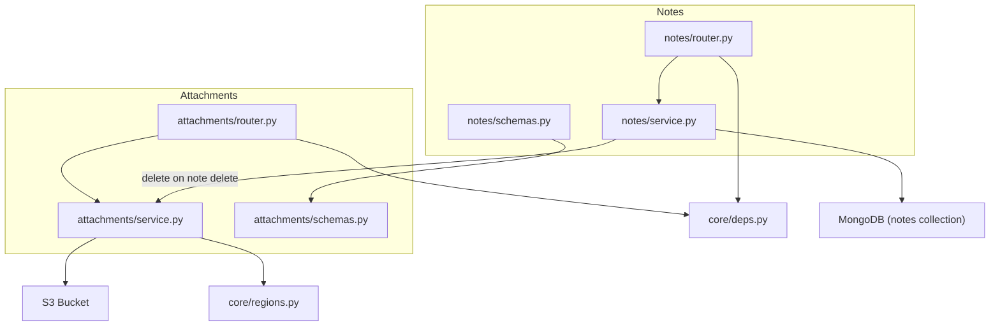
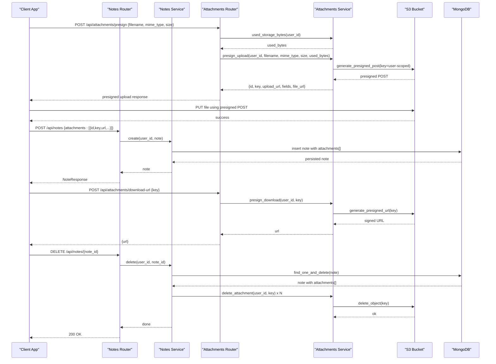
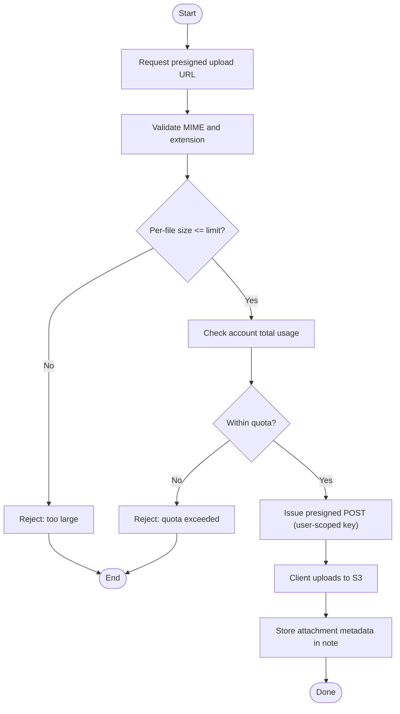
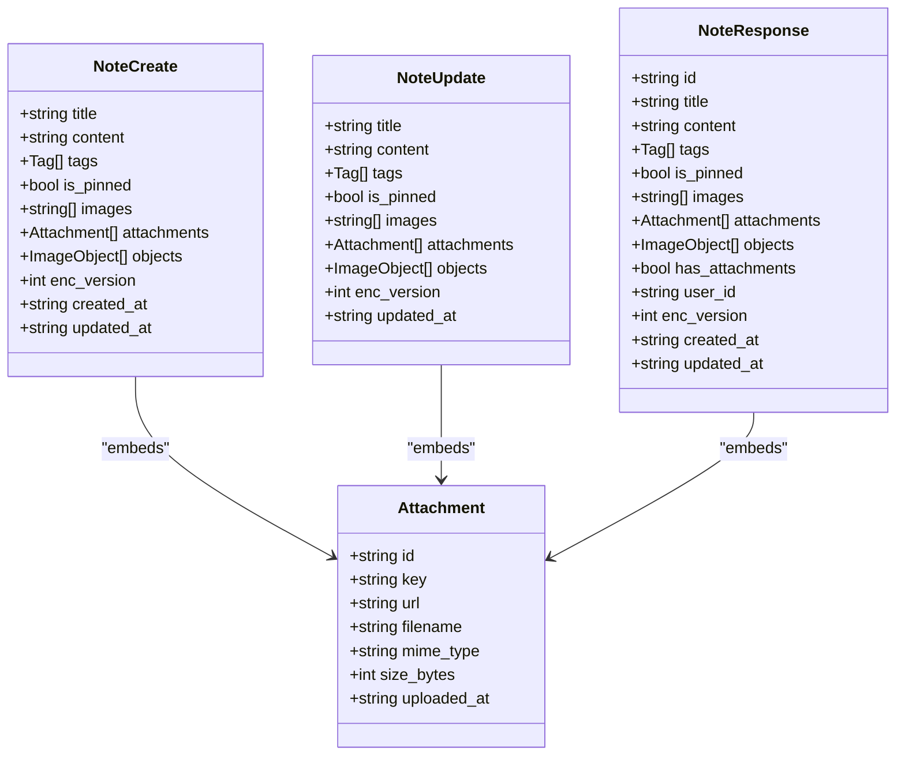
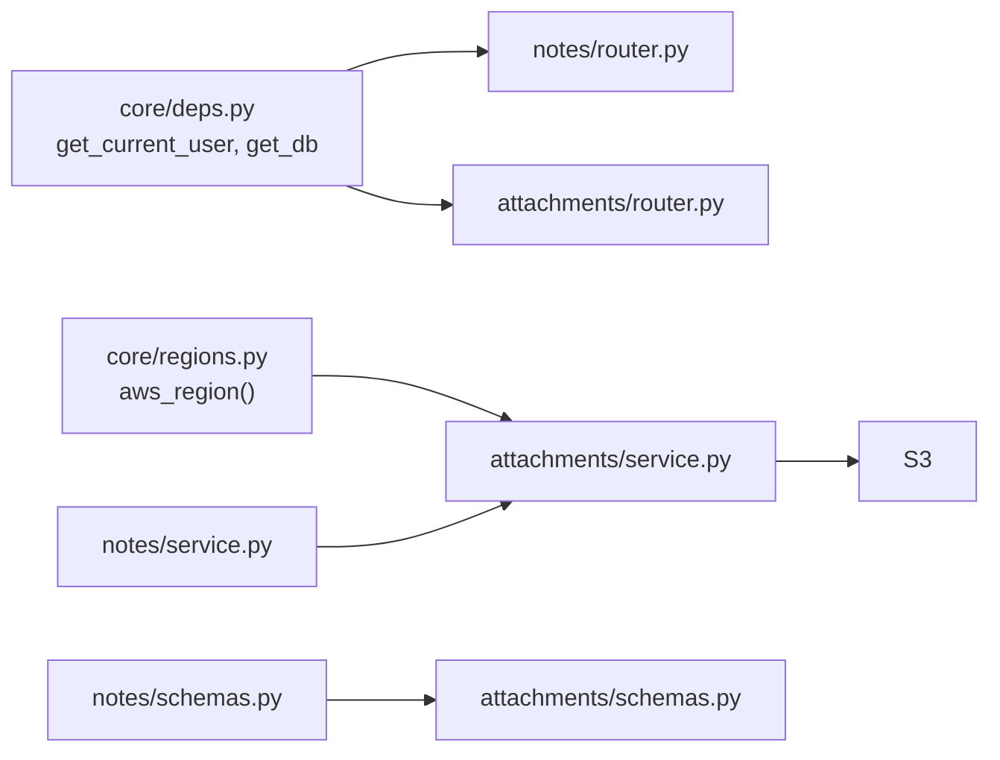

# Attachment Integration

<cite>
**Referenced Files in This Document**
- [attachments/router.py](file://attachments/router.py)
- [attachments/service.py](file://attachments/service.py)
- [attachments/schemas.py](file://attachments/schemas.py)
- [notes/router.py](file://notes/router.py)
- [notes/service.py](file://notes/service.py)
- [notes/schemas.py](file://notes/schemas.py)
- [core/deps.py](file://core/deps.py)
- [core/regions.py](file://core/regions.py)
</cite>

## Table of Contents
1. [Introduction](#introduction)
2. [Project Structure](#project-structure)
3. [Core Components](#core-components)
4. [Architecture Overview](#architecture-overview)
5. [Detailed Component Analysis](#detailed-component-analysis)
6. [Dependency Analysis](#dependency-analysis)
7. [Performance Considerations](#performance-considerations)
8. [Troubleshooting Guide](#troubleshooting-guide)
9. [Conclusion](#conclusion)
10. [Appendices](#appendices)

## Introduction
This document explains how notes and attachments integrate in the backend. It covers:
- How notes reference attached files via embedded metadata
- The attachment lifecycle from upload to deletion
- File size limits and per-account storage quotas
- The relationship model between notes and attachments, including scoping by user
- Examples for attaching files to notes, retrieving attachments with notes, and handling deletion when notes are removed
- Security considerations for uploads, access control, and storage optimization strategies

## Project Structure
The integration spans two feature modules:
- Notes module: persists note documents (including embedded attachment metadata) and coordinates cleanup on delete
- Attachments module: issues presigned URLs for direct-to-storage uploads/downloads and enforces type/size/quota rules

**Diagram sources**
- [notes/router.py:17-85](file://notes/router.py#L17-L85)
- [notes/service.py:83-211](file://notes/service.py#L83-L211)
- [attachments/router.py:28-81](file://attachments/router.py#L28-L81)
- [attachments/service.py:86-173](file://attachments/service.py#L86-L173)
- [core/deps.py:15-50](file://core/deps.py#L15-L50)
- [core/regions.py:206-208](file://core/regions.py#L206-L208)

**Section sources**
- [notes/router.py:17-85](file://notes/router.py#L17-L85)
- [attachments/router.py:28-81](file://attachments/router.py#L28-L81)
- [notes/service.py:83-211](file://notes/service.py#L83-L211)
- [attachments/service.py:86-173](file://attachments/service.py#L86-L173)

## Core Components
- Note schema embeds a list of attachments. Each attachment carries an id, key, url, filename, mime_type, size_bytes, and uploaded_at.
- Notes service persists notes with an attachments array and a denormalized has_attachments flag. On note deletion, it cleans up referenced S3 objects.
- Attachments service provides:
  - Presign upload: validates file type, size, and account quota; returns a presigned POST to upload directly to storage under a user-scoped prefix
  - Presign download: returns a time-limited GET URL scoped to the caller’s user prefix
  - Delete attachment: deletes a specific object if it belongs to the caller
  - Bulk user cleanup: best-effort deletion of all objects under a user’s prefix (for GDPR/account erasure)
  - Usage aggregation: sums size_bytes across a user’s notes to enforce total storage quota

**Section sources**
- [notes/schemas.py:33-100](file://notes/schemas.py#L33-L100)
- [attachments/schemas.py:4-23](file://attachments/schemas.py#L4-L23)
- [notes/service.py:83-111](file://notes/service.py#L83-L111)
- [attachments/service.py:86-173](file://attachments/service.py#L86-L173)

## Architecture Overview
The system uses a presigned-upload pattern:
- Client requests a presigned upload URL from the server
- Server validates type, size, and quota, then returns a presigned POST bound to a user-scoped key
- Client uploads directly to storage using the presigned URL
- Client stores the returned attachment metadata in the note document
- To view/download, client requests a presigned GET URL from the server
- When a note is deleted, the server removes referenced S3 objects

**Diagram sources**
- [attachments/router.py:28-81](file://attachments/router.py#L28-L81)
- [attachments/service.py:86-173](file://attachments/service.py#L86-L173)
- [notes/router.py:17-85](file://notes/router.py#L17-L85)
- [notes/service.py:83-211](file://notes/service.py#L83-L211)

## Detailed Component Analysis

### Relationship Model: Notes and Attachments
- A note contains an array of attachments. Each attachment includes:
  - id: unique identifier for the attachment
  - key: server-generated S3 object key under a user-scoped prefix
  - url: download URL (typically obtained via presign download)
  - filename, mime_type, size_bytes, uploaded_at: metadata
- The note also carries a boolean has_attachments flag that reflects whether the attachments array is non-empty. This flag is used to optimize usage aggregation for quota enforcement.

Scoping:
- All S3 keys are prefixed with a user-specific path, ensuring users can only access or delete their own files.
- Access checks validate that the requested key starts with the expected user-scoped prefix before issuing presigned URLs or deleting objects.

Examples:
- Attaching files to notes: After obtaining a presigned upload URL and uploading the file, include the resulting attachment metadata in the note’s attachments array when creating or updating a note.
- Retrieving attachments with notes: List or get notes to receive the embedded attachments array; use the provided url or request a fresh presigned download URL via the attachments endpoint.
- Deleting attachments when notes are removed: Deleting a note triggers cleanup of all referenced S3 objects stored under the user’s prefix.

**Section sources**
- [notes/schemas.py:33-100](file://notes/schemas.py#L33-L100)
- [attachments/schemas.py:4-13](file://attachments/schemas.py#L4-L13)
- [notes/service.py:83-111](file://notes/service.py#L83-L111)
- [notes/service.py:156-189](file://notes/service.py#L156-L189)
- [attachments/service.py:139-173](file://attachments/service.py#L139-L173)

### Attachment Lifecycle: Upload to Deletion
Upload flow:
1. Request a presigned upload URL from the attachments router
2. Server validates:
   - Storage availability
   - Per-file size limit
   - Account total storage quota
   - Allowed MIME types and file extensions
3. Server returns a presigned POST bound to a user-scoped key
4. Client uploads directly to storage
5. Client stores the attachment metadata in the note document

Download flow:
- Client requests a presigned GET URL for a specific key; server validates ownership and returns a time-limited URL

Deletion flows:
- Explicit attachment deletion: client calls the delete endpoint with the key; server verifies ownership and deletes the object
- Note deletion: server atomically removes the note and then deletes all referenced S3 objects in best-effort fashion

**Diagram sources**
- [attachments/router.py:28-55](file://attachments/router.py#L28-L55)
- [attachments/service.py:86-136](file://attachments/service.py#L86-L136)
- [notes/service.py:83-111](file://notes/service.py#L83-L111)

**Section sources**
- [attachments/router.py:28-81](file://attachments/router.py#L28-L81)
- [attachments/service.py:86-173](file://attachments/service.py#L86-L173)
- [notes/service.py:83-111](file://notes/service.py#L83-L111)

### File Size Limitations and Quotas
- Per-file limit: enforced during presign upload; files exceeding the maximum are rejected
- Per-account total limit: computed by summing size_bytes across the user’s notes; enforced before issuing presigned upload URLs
- Note payload limits: separate caps protect MongoDB document size and memory usage for base64 images and text content

Configuration:
- Per-file maximum is defined in the attachments service
- Total storage cap is environment-configurable and defaults to a multi-gigabyte ceiling
- Note payload limits are defined in the notes service

**Section sources**
- [attachments/service.py:20-25](file://attachments/service.py#L20-L25)
- [attachments/service.py:94-105](file://attachments/service.py#L94-L105)
- [attachments/service.py:199-226](file://attachments/service.py#L199-L226)
- [notes/service.py:30-50](file://notes/service.py#L30-L50)

### Data Models and Scoping
- Attachment model: id, key, url, filename, mime_type, size_bytes, uploaded_at
- Note models:
  - Create/Update: include attachments array and optional linked events/tags/images
  - Response: includes attachments, has_attachments, timestamps, encryption version
- User scoping:
  - S3 keys are generated under a user-specific prefix
  - Download/delete operations validate that the key belongs to the current user
  - Notes queries are scoped by user_id through a repository helper

**Diagram sources**
- [attachments/schemas.py:4-13](file://attachments/schemas.py#L4-L13)
- [notes/schemas.py:33-100](file://notes/schemas.py#L33-L100)

**Section sources**
- [attachments/schemas.py:4-13](file://attachments/schemas.py#L4-L13)
- [notes/schemas.py:33-100](file://notes/schemas.py#L33-L100)

### API Workflows and Examples

- Attach a file to a note:
  1. Call POST /api/attachments/presign with filename, mime_type, and size
  2. Receive presigned upload URL and fields
  3. Upload the file directly to the provided URL
  4. Create or update a note and include the attachment metadata (id, key, url, filename, mime_type, size_bytes, uploaded_at) in the attachments array

- Retrieve attachments with notes:
  - GET /api/notes or GET /api/notes/{note_id} returns notes with embedded attachments arrays
  - For each attachment, either use the provided url or call POST /api/attachments/download-url with the key to obtain a fresh presigned download URL

- Delete an attachment:
  - DELETE /api/attachments?key={key} removes the specified object if it belongs to the current user

- Handle deletion when notes are removed:
  - DELETE /api/notes/{note_id} deletes the note and triggers best-effort deletion of all referenced S3 objects

**Section sources**
- [attachments/router.py:28-81](file://attachments/router.py#L28-L81)
- [notes/router.py:17-85](file://notes/router.py#L17-L85)
- [notes/service.py:83-211](file://notes/service.py#L83-L211)

## Dependency Analysis
- Authentication and user resolution:
  - Both routers depend on a shared dependency to resolve the current user and database connection
- Region and storage configuration:
  - Attachments service uses a region validator to ensure data residency compliance when constructing the S3 client
- Notes-to-attachments coupling:
  - Notes service imports the attachments delete function to clean up storage on note deletion
  - Notes schemas import the Attachment model to embed attachment metadata in notes

**Diagram sources**
- [core/deps.py:15-50](file://core/deps.py#L15-L50)
- [core/regions.py:206-208](file://core/regions.py#L206-L208)
- [notes/service.py:15](file://notes/service.py#L15)
- [notes/schemas.py:4](file://notes/schemas.py#L4)

**Section sources**
- [core/deps.py:15-50](file://core/deps.py#L15-L50)
- [core/regions.py:206-208](file://core/regions.py#L206-L208)
- [notes/service.py:15](file://notes/service.py#L15)
- [notes/schemas.py:4](file://notes/schemas.py#L4)

## Performance Considerations
- Direct-to-storage uploads:
  - Presigned uploads bypass the application server after validation, reducing CPU and memory overhead
- Asynchronous I/O:
  - Heavy S3 calls are executed off the event loop to avoid blocking
- Efficient quota enforcement:
  - Total usage is aggregated in the database using an aggregation pipeline over notes’ attachments.size_bytes, avoiding loading full note payloads into memory
- Deterministic paging:
  - Notes listing sorts by stable fields to prevent duplicate or missing pages when notes carry large base64 images
- Best-effort cleanup:
  - Note deletion performs S3 deletions asynchronously and logs failures without failing the primary operation

[No sources needed since this section provides general guidance]

## Troubleshooting Guide
Common errors and resolutions:
- Storage not enabled:
  - If attachments are not configured, presign endpoints return a service unavailable status
- File type not allowed:
  - Only whitelisted MIME types and file extensions are accepted; verify the file type matches the allowlist
- File too large:
  - Per-file size exceeds the configured maximum; compress or split content
- Quota exceeded:
  - Account total storage would be exceeded; free space by deleting attachments or notes
- Access denied:
  - Attempted to access or delete an attachment not under the current user’s prefix; verify the key and user context
- Storage errors:
  - Transient AWS errors result in bad gateway responses; retry with backoff

Operational tips:
- Monitor logs for presign and download failures
- Ensure environment variables for storage and regions are correctly set
- Use bulk user cleanup for GDPR erasure scenarios

**Section sources**
- [attachments/router.py:45-67](file://attachments/router.py#L45-L67)
- [attachments/router.py:75-81](file://attachments/router.py#L75-L81)
- [attachments/service.py:94-109](file://attachments/service.py#L94-L109)
- [attachments/service.py:139-173](file://attachments/service.py#L139-L173)

## Conclusion
The notes and attachments integration leverages a secure, scalable presigned-upload pattern with strict user scoping, type/size/quota validation, and robust cleanup on note deletion. Notes embed lightweight attachment metadata while heavy files reside in storage. Quota enforcement is efficient and configurable, and access controls ensure users can only interact with their own files.

[No sources needed since this section summarizes without analyzing specific files]

## Appendices

### Security Considerations
- User-scoped storage keys:
  - All S3 keys are generated under a user-specific prefix; download and delete operations validate ownership
- Type and size validation:
  - MIME types and file extensions are whitelisted; per-file size limits are enforced before issuing presigned URLs
- Quota enforcement:
  - Total storage usage is calculated server-side and enforced prior to upload authorization
- Data residency:
  - Region validation ensures external services operate within approved regions

Note: Virus scanning integration is not implemented in the analyzed codebase. If required, consider adding a scanning step between presign issuance and finalizing note persistence, or scanning at ingestion time via storage hooks or a pre-processing service.

**Section sources**
- [attachments/service.py:94-109](file://attachments/service.py#L94-L109)
- [attachments/service.py:139-173](file://attachments/service.py#L139-L173)
- [attachments/service.py:199-226](file://attachments/service.py#L199-L226)
- [core/regions.py:206-208](file://core/regions.py#L206-L208)

### Storage Optimization Strategies
- Prefer presigned uploads to minimize server load
- Keep attachment metadata minimal in notes; store heavy content in storage
- Use the has_attachments flag to optimize usage aggregation
- Batch cleanup for account erasure to reduce API calls
- Compress media where possible to stay within per-file and per-account limits

[No sources needed since this section provides general guidance]