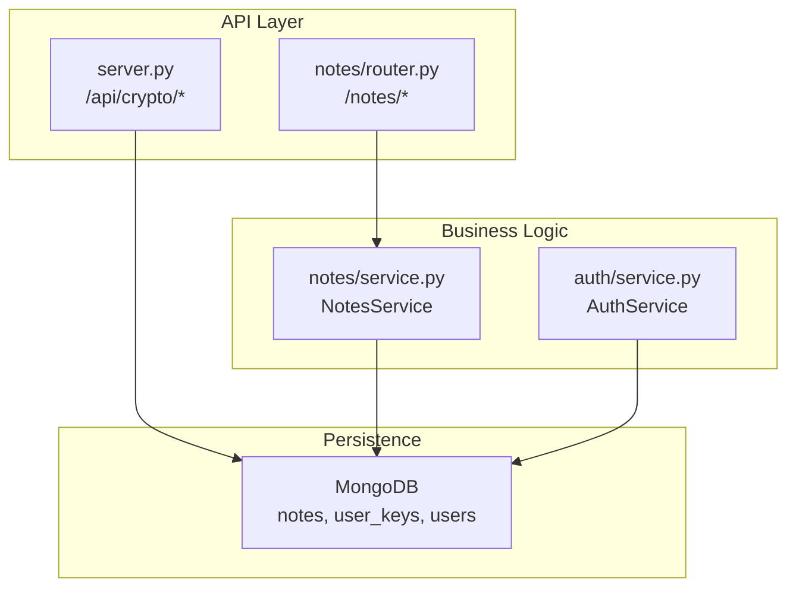
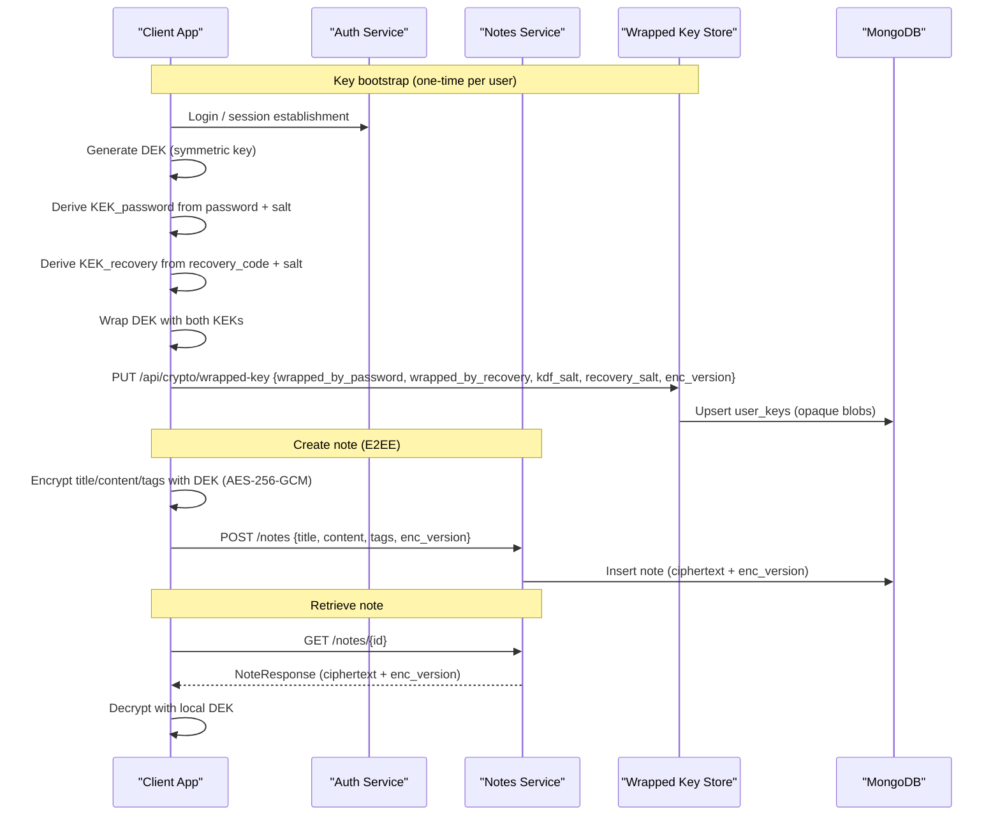
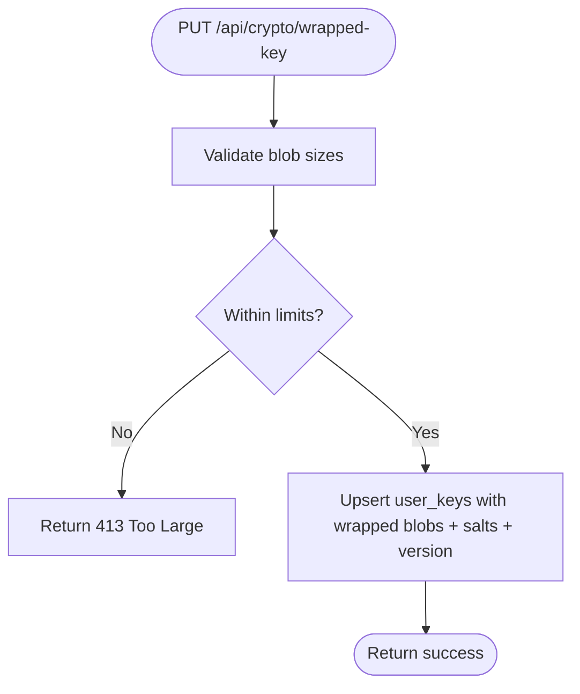
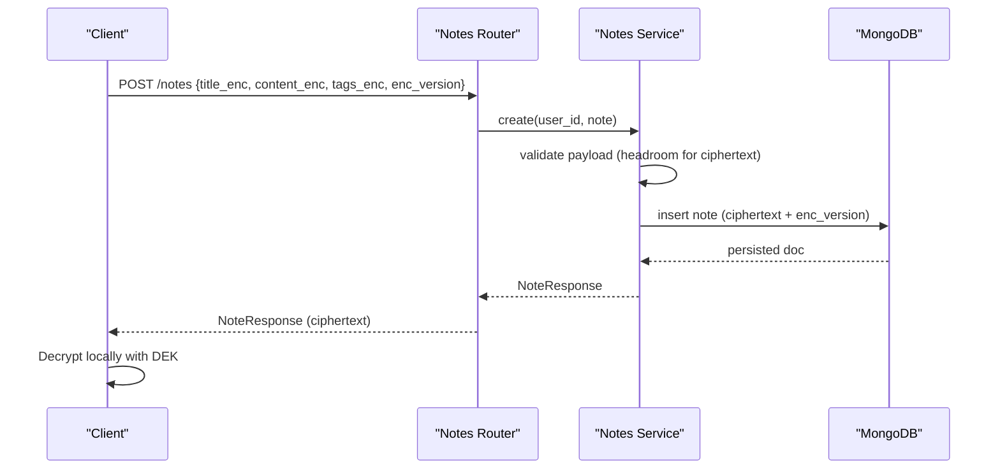
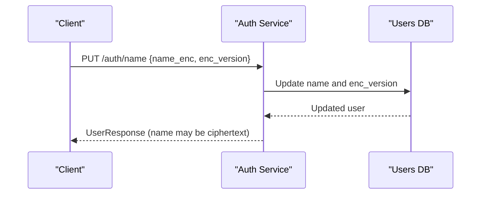
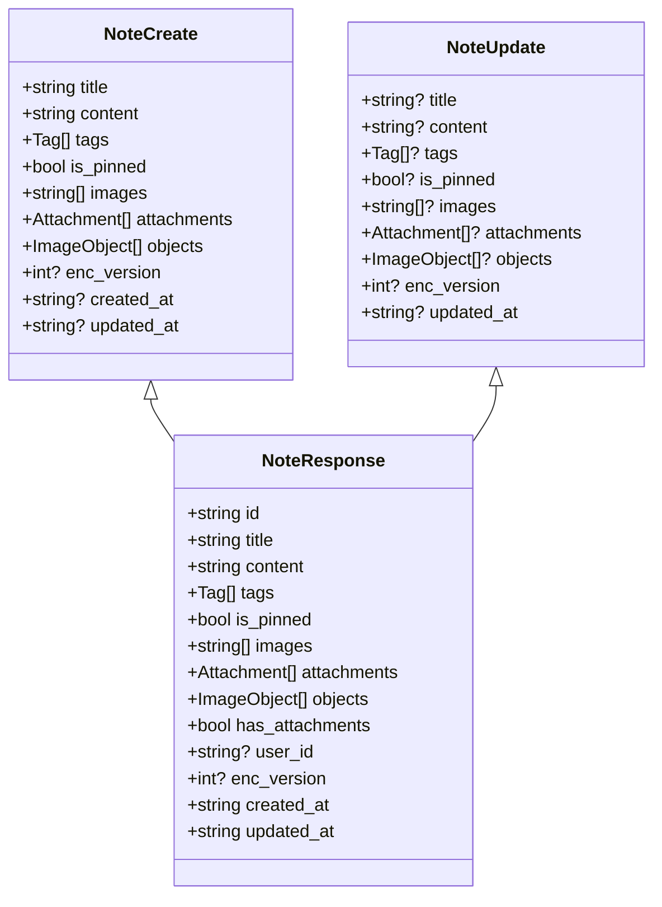
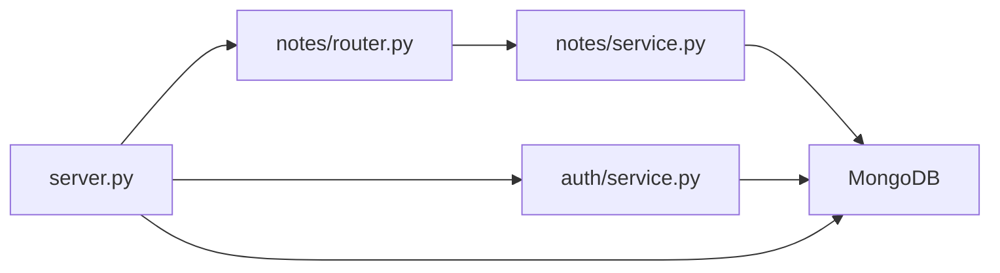

# End-to-End Encryption Implementation

<cite>
**Referenced Files in This Document**
- [server.py](file://server.py)
- [notes/router.py](file://notes/router.py)
- [notes/service.py](file://notes/service.py)
- [notes/schemas.py](file://notes/schemas.py)
- [auth/service.py](file://auth/service.py)
- [auth/schemas.py](file://auth/schemas.py)
</cite>

## Table of Contents
1. [Introduction](#introduction)
2. [Project Structure](#project-structure)
3. [Core Components](#core-components)
4. [Architecture Overview](#architecture-overview)
5. [Detailed Component Analysis](#detailed-component-analysis)
6. [Dependency Analysis](#dependency-analysis)
7. [Performance Considerations](#performance-considerations)
8. [Troubleshooting Guide](#troubleshooting-guide)
9. [Conclusion](#conclusion)
10. [Appendices](#appendices)

## Introduction
This document explains the end-to-end encryption (E2EE) design for the Notes System as implemented in the backend. The system follows a client-side encryption model: note content is encrypted on the device before being sent to the server, and only wrapped keys are stored on the backend. The server never receives plaintext note content or unwrapped encryption keys. It stores opaque, base64-encoded wrapped key blobs and minimal metadata.

Key characteristics:
- Client encrypts note fields (title, content, tags) with AES-256-GCM using a Data Encryption Key (DEK).
- The DEK is wrapped by two Key Encryption Keys (KEKs): one derived from the user’s password and another derived from a recovery code.
- The server stores only wrapped-key blobs and salts; it cannot decrypt notes or unwrap keys.
- An enc_version field indicates whether a note’s sensitive fields are ciphertext or legacy plaintext, enabling migration.
- Search and indexing remain client-side once fields are encrypted.

## Project Structure
The E2EE-related backend logic spans the main API router and domain modules:
- server.py: Defines the /api/crypto endpoints for storing and retrieving wrapped keys, plus constants and validation for wrapped blobs.
- notes/: Handles note CRUD and validates payload sizes with headroom for ciphertext growth.
- auth/: Tracks enc_version for user-level E2EE state and supports updating an encrypted name during key bootstrap.

**Diagram sources**
- [server.py:46-104](file://server.py#L46-L104)
- [notes/router.py:17-100](file://notes/router.py#L17-L100)
- [notes/service.py:79-226](file://notes/service.py#L79-L226)
- [auth/service.py:387-400](file://auth/service.py#L387-L400)

**Section sources**
- [server.py:46-104](file://server.py#L46-L104)
- [notes/router.py:17-100](file://notes/router.py#L17-L100)
- [notes/service.py:79-226](file://notes/service.py#L79-L226)
- [auth/service.py:387-400](file://auth/service.py#L387-L400)

## Core Components
- Wrapped Key Escrow:
  - PUT /api/crypto/wrapped-key: Stores wrapped DEK blobs, KDF salts, and version metadata.
  - GET /api/crypto/wrapped-key: Retrieves the user’s current wrapped key record.
- Notes Service:
  - Validates payloads with generous headroom for ciphertext size inflation.
  - Persists notes including enc_version to indicate ciphertext vs plaintext.
  - Enforces pagination and indexes optimized for large payloads.
- Auth Service:
  - Supports updating a user’s name when it is already E2EE ciphertext (enc_version set), returning a generic greeting where necessary.
  - Accepts enc_version alongside name updates during key bootstrap.

Security posture:
- The server stores only opaque wrapped-key blobs and metadata-only usage events.
- No plaintext note content or unwrapped keys ever touch the server.

**Section sources**
- [server.py:46-104](file://server.py#L46-L104)
- [notes/service.py:30-51](file://notes/service.py#L30-L51)
- [notes/service.py:83-111](file://notes/service.py#L83-L111)
- [auth/service.py:42-48](file://auth/service.py#L42-L48)
- [auth/service.py:387-400](file://auth/service.py#L387-L400)

## Architecture Overview
The E2EE flow centers around client-side encryption and server-side escrow of wrapped keys. The server acts purely as a secure vault for wrapped keys and a storage layer for ciphertext data.

**Diagram sources**
- [server.py:80-104](file://server.py#L80-L104)
- [notes/router.py:17-54](file://notes/router.py#L17-L54)
- [notes/service.py:83-111](file://notes/service.py#L83-L111)
- [auth/service.py:387-400](file://auth/service.py#L387-L400)

## Detailed Component Analysis

### Wrapped Key Escrow API
- Purpose: Securely store wrapped DEK blobs and KDF parameters without exposing plaintext keys.
- Inputs:
  - wrapped_by_password: base64-encoded DEK wrapped by password-derived KEK
  - wrapped_by_recovery: base64-encoded DEK wrapped by recovery-code-derived KEK
  - kdf_salt: base64 salt used for password KEK derivation
  - recovery_salt: base64 salt used for recovery-code KEK derivation
  - kdf: algorithm identifier (e.g., pbkdf2)
  - kdf_params: algorithm-specific parameters
  - enc_version: version tag for E2EE
- Behavior:
  - Validates blob sizes to prevent abuse.
  - Upserts a single user_keys document per user_id.
  - Returns a success message; no decryption occurs on the server.

**Diagram sources**
- [server.py:75-93](file://server.py#L75-L93)

**Section sources**
- [server.py:56-93](file://server.py#L56-L93)

### Notes Creation and Retrieval with E2EE
- Creation:
  - Client encrypts title, content, and tags with AES-256-GCM using the local DEK.
  - Sends ciphertext along with enc_version to the server.
  - Server validates payload size with headroom for ciphertext expansion and persists the note.
- Retrieval:
  - Server returns ciphertext and enc_version.
  - Client decrypts locally using the DEK.

**Diagram sources**
- [notes/router.py:17-28](file://notes/router.py#L17-L28)
- [notes/service.py:83-111](file://notes/service.py#L83-L111)

**Section sources**
- [notes/router.py:17-28](file://notes/router.py#L17-L28)
- [notes/service.py:30-51](file://notes/service.py#L30-L51)
- [notes/service.py:83-111](file://notes/service.py#L83-L111)

### Encrypted Name Update During Key Bootstrap
- When a user first has a DEK, the client can push an encrypted display name to the server along with enc_version.
- The server stores the ciphertext name and version; it does not decrypt it.
- Greeting functions fall back to a generic greeting when enc_version is present.

**Diagram sources**
- [auth/service.py:387-400](file://auth/service.py#L387-L400)
- [auth/service.py:42-48](file://auth/service.py#L42-L48)

**Section sources**
- [auth/service.py:42-48](file://auth/service.py#L42-L48)
- [auth/service.py:387-400](file://auth/service.py#L387-L400)

### Data Models and Versioning
- Notes schemas include an optional enc_version field to mark ciphertext vs plaintext.
- Response models propagate enc_version so clients can decide how to handle fields.
- Auth schemas similarly carry enc_version for user-level E2EE state.

**Diagram sources**
- [notes/schemas.py:33-92](file://notes/schemas.py#L33-L92)

**Section sources**
- [notes/schemas.py:33-92](file://notes/schemas.py#L33-L92)
- [auth/schemas.py:40-57](file://auth/schemas.py#L40-L57)

## Dependency Analysis
- server.py depends on authentication via core.deps.get_current_user and writes to MongoDB collections: user_keys, feature_events.
- notes/router.py depends on notes.service.NotesService and translates service exceptions into HTTP responses.
- notes.service depends on database scoping utilities and attachment deletion helpers.
- auth.service handles user profile updates and respects enc_version for E2EE names.

**Diagram sources**
- [server.py:176-214](file://server.py#L176-L214)
- [notes/router.py:1-10](file://notes/router.py#L1-L10)
- [notes/service.py:1-18](file://notes/service.py#L1-L18)
- [auth/service.py:1-18](file://auth/service.py#L1-L18)

**Section sources**
- [server.py:176-214](file://server.py#L176-L214)
- [notes/router.py:1-10](file://notes/router.py#L1-L10)
- [notes/service.py:1-18](file://notes/service.py#L1-L18)
- [auth/service.py:1-18](file://auth/service.py#L1-L18)

## Performance Considerations
- Payload sizing:
  - The notes service enforces strict caps with headroom to accommodate ciphertext expansion due to base64 encoding and AES-GCM overhead.
  - This prevents oversized requests while allowing legitimate encrypted payloads.
- Indexing:
  - Compound indexes on notes optimize list queries even with large image payloads, avoiding blocking in-memory sorts.
- Asynchronous operations:
  - Background tasks and async I/O minimize latency for non-blocking operations.
- Storage:
  - Wrapped key blobs are small and capped; the server avoids storing any large ciphertext beyond note fields themselves.

[No sources needed since this section provides general guidance]

## Troubleshooting Guide
Common issues and resolutions:
- Wrapped key too large:
  - The server rejects oversized wrapped blobs with a 413 response. Ensure base64-encoded wrapped keys and salts stay within limits.
- Note payload too large:
  - If title, content, images, or object counts exceed limits, the server returns 413. Reduce payload size or split content.
- Note not found:
  - GET/PUT/DELETE on notes return 404 if the note does not exist or is not scoped to the current user.
- Missing key escrow:
  - GET /api/crypto/wrapped-key returns 404 if no wrapped key record exists for the user. Initialize key escrow before creating encrypted notes.
- Encrypted name display:
  - When enc_version is set, server-side greetings fall back to a generic term because the server cannot decrypt the name.

**Section sources**
- [server.py:75-93](file://server.py#L75-L93)
- [server.py:96-104](file://server.py#L96-L104)
- [notes/router.py:17-85](file://notes/router.py#L17-L85)
- [notes/service.py:22-27](file://notes/service.py#L22-L27)
- [auth/service.py:42-48](file://auth/service.py#L42-L48)

## Conclusion
The backend implements a robust E2EE architecture for the Notes System:
- Clients perform all cryptographic operations; the server remains oblivious to plaintext and keys.
- Wrapped keys are securely escrowed with strong size guards and versioning.
- Notes persist as ciphertext with enc_version to support migration and client-side handling.
- Robust indexing and payload validation ensure performance and reliability at scale.

[No sources needed since this section summarizes without analyzing specific files]

## Appendices

### Example Workflows

#### Creating an Encrypted Note
- Client generates or retrieves DEK locally.
- Encrypts title, content, and tags with AES-256-GCM.
- Sends ciphertext and enc_version to POST /notes.
- Server validates and persists ciphertext.

**Section sources**
- [notes/router.py:17-28](file://notes/router.py#L17-L28)
- [notes/service.py:83-111](file://notes/service.py#L83-L111)

#### Retrieving and Decrypting a Note
- Client calls GET /notes/{id}.
- Server returns ciphertext and enc_version.
- Client decrypts locally using DEK.

**Section sources**
- [notes/router.py:43-54](file://notes/router.py#L43-L54)
- [notes/service.py:150-154](file://notes/service.py#L150-L154)

#### Managing Wrapped Keys
- On first login or key setup, client derives KEKs from password and recovery code, wraps DEK, and sends to PUT /api/crypto/wrapped-key.
- Later, client can retrieve wrapped keys via GET /api/crypto/wrapped-key to re-wrap or rotate as needed.

**Section sources**
- [server.py:80-104](file://server.py#L80-L104)

### Migration Strategy for Existing Unencrypted Data
- Use enc_version to distinguish legacy plaintext notes from new ciphertext notes.
- For existing notes, continue serving plaintext until clients opt-in to E2EE.
- New notes should always include enc_version and ciphertext fields.
- Search moves to client-side once fields are encrypted; server no longer performs text-based filtering on encrypted fields.

**Section sources**
- [notes/schemas.py:33-51](file://notes/schemas.py#L33-L51)
- [notes/service.py:113-116](file://notes/service.py#L113-L116)