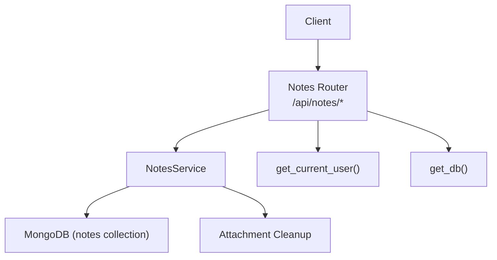
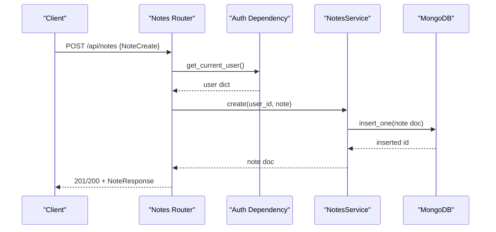
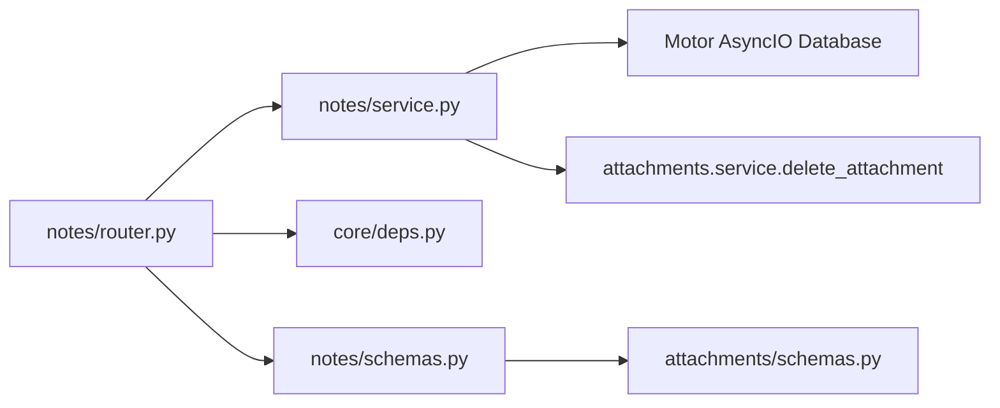

# Note CRUD Operations

<cite>
**Referenced Files in This Document**
- [router.py](file://notes/router.py)
- [service.py](file://notes/service.py)
- [schemas.py](file://notes/schemas.py)
- [deps.py](file://core/deps.py)
- [schemas.py](file://attachments/schemas.py)
</cite>

## Table of Contents
1. [Introduction](#introduction)
2. [Project Structure](#project-structure)
3. [Core Components](#core-components)
4. [Architecture Overview](#architecture-overview)
5. [Detailed Component Analysis](#detailed-component-analysis)
6. [Dependency Analysis](#dependency-analysis)
7. [Performance Considerations](#performance-considerations)
8. [Troubleshooting Guide](#troubleshooting-guide)
9. [Conclusion](#conclusion)

## Introduction
This document describes the complete Note CRUD API surface and behavior: creating notes with encrypted content support, retrieving individual notes and paginated lists, updating notes with partial updates, and deleting notes with storage cleanup. It also documents request/response schemas, validation rules, error handling for not found scenarios, and payload size limits enforced by the service layer.

## Project Structure
The Notes feature is implemented as a FastAPI router that delegates to a service layer for business logic and persistence. Schemas define input/output models, including encryption metadata and attachment structures. Authentication and database access are provided via shared dependencies.

**Diagram sources**
- [router.py:17-100](file://notes/router.py#L17-L100)
- [service.py:79-226](file://notes/service.py#L79-L226)
- [deps.py:15-50](file://core/deps.py#L15-L50)

**Section sources**
- [router.py:1-100](file://notes/router.py#L1-L100)
- [service.py:1-226](file://notes/service.py#L1-L226)
- [schemas.py:1-100](file://notes/schemas.py#L1-L100)
- [deps.py:1-51](file://core/deps.py#L1-L51)
- [schemas.py:1-24](file://attachments/schemas.py#L1-L24)

## Core Components
- NotesRouter: Exposes HTTP endpoints for Create, Read, Update, Delete, and Pin toggle. Handles authentication, pagination parameters, and maps service exceptions to HTTP status codes.
- NotesService: Implements business logic, payload validation, persistence operations, and cleanup of attachments/image objects on delete.
- Schemas: Define NoteCreate, NoteUpdate, NoteResponse, Tag, ImageObject, Attachment, and a paginated response model.
- Dependencies: get_current_user enforces bearer token authentication; get_db provides an async MongoDB client.

Key responsibilities:
- Payload validation and size limits for title, content, images, and image objects.
- E2EE support via enc_version field indicating ciphertext for title/content/tags.
- Partial updates using exclude_unset semantics.
- Deterministic paging with stable sort order.
- Atomic deletion with best-effort storage cleanup.

**Section sources**
- [router.py:17-100](file://notes/router.py#L17-L100)
- [service.py:53-65](file://notes/service.py#L53-L65)
- [service.py:83-111](file://notes/service.py#L83-L111)
- [service.py:113-148](file://notes/service.py#L113-L148)
- [service.py:150-189](file://notes/service.py#L150-L189)
- [service.py:191-226](file://notes/service.py#L191-L226)
- [schemas.py:7-100](file://notes/schemas.py#L7-L100)
- [deps.py:24-50](file://core/deps.py#L24-L50)

## Architecture Overview
The Notes API follows a layered architecture:
- HTTP Layer (FastAPI Router): Validates query parameters, injects current user and DB, routes to service methods, and translates exceptions into HTTP responses.
- Service Layer: Enforces business rules (payload sizes, conflict resolution timestamps), interacts with MongoDB, and coordinates cleanup.
- Data Layer: MongoDB notes collection with scoped queries ensuring user isolation.

**Diagram sources**
- [router.py:17-28](file://notes/router.py#L17-L28)
- [service.py:83-111](file://notes/service.py#L83-L111)
- [deps.py:24-50](file://core/deps.py#L24-L50)

## Detailed Component Analysis

### Authentication and Access Control
- All endpoints require a valid Bearer token via Authorization header. Missing or invalid tokens result in 401 responses.
- The current user’s ID is extracted from the resolved user document and used to scope all data operations to the correct tenant/user.

**Section sources**
- [deps.py:24-50](file://core/deps.py#L24-L50)
- [router.py:13-14](file://notes/router.py#L13-L14)

### Create Note: POST /api/notes
- Purpose: Create a new note with optional encrypted content and metadata.
- Request body: NoteCreate schema fields.
- Encryption: When enc_version is set, title/content/tags are treated as client-side ciphertext (AES-256-GCM). The server stores them as-is and returns enc_version to indicate encryption state.
- Validation:
  - Title length limit.
  - Content length limit.
  - Total base64 images payload size limit.
  - Maximum number of image objects.
- Response: NoteResponse with generated id, timestamps, and normalized linked_event_ids array.
- Errors:
  - 401 if not authenticated.
  - 413 if payload exceeds limits.
  - 5xx if persistence fails.

Example request shape:
- Body: { "title": "...", "content": "...", "tags": [...], "is_pinned": false, "linked_event_ids": [], "images": [], "attachments": [], "objects": [], "enc_version": 1, "created_at": "...", "updated_at": "..." }

Example response shape:
- { "id": "...", "title": "...", "content": "...", "tags": [...], "is_pinned": false, "linked_event_ids": [], "images": [], "attachments": [], "objects": [], "has_attachments": false, "user_id": "...", "enc_version": 1, "created_at": "...", "updated_at": "..." }

**Section sources**
- [router.py:17-28](file://notes/router.py#L17-L28)
- [service.py:83-111](file://notes/service.py#L83-L111)
- [service.py:53-65](file://notes/service.py#L53-L65)
- [schemas.py:33-51](file://notes/schemas.py#L33-L51)
- [schemas.py:76-92](file://notes/schemas.py#L76-L92)

### List Notes: GET /api/notes
- Purpose: Retrieve a paginated list of notes for the current user.
- Query parameters:
  - page: integer >= 1 (default 1).
  - page_size: integer between 1 and 100 (default 50).
- Behavior:
  - Returns notes sorted deterministically by pinned status, updated timestamp, and id.
  - Skips and limits results based on page and page_size.
  - Normalizes linked_event_ids to always be an array.
- Response: Array of NoteResponse items.

Example request:
- GET /api/notes?page=1&page_size=50

Example response:
- [ { NoteResponse }, ... ]

**Section sources**
- [router.py:31-40](file://notes/router.py#L31-L40)
- [service.py:113-148](file://notes/service.py#L113-L148)
- [schemas.py:76-92](file://notes/schemas.py#L76-L92)

### Get Note: GET /api/notes/{note_id}
- Purpose: Retrieve a single note by id for the current user.
- Path parameter: note_id (string).
- Behavior:
  - Scopes lookup to the current user.
  - Normalizes linked_event_ids to an array.
- Response: NoteResponse.
- Errors:
  - 404 if the note does not exist or belongs to another user.

Example request:
- GET /api/notes/{note_id}

Example response:
- { NoteResponse }

**Section sources**
- [router.py:43-54](file://notes/router.py#L43-L54)
- [service.py:150-154](file://notes/service.py#L150-L154)
- [schemas.py:76-92](file://notes/schemas.py#L76-L92)

### Update Note: PUT /api/notes/{note_id}
- Purpose: Perform a partial update of a note. Only provided fields are applied.
- Path parameter: note_id (string).
- Request body: NoteUpdate schema fields (any subset).
- Validation:
  - Same payload size limits apply to provided fields.
  - Special handling for clearing links: explicitly setting linked_event_id or linked_event_ids to null/empty unlinks events.
  - Timestamps: If updated_at is provided, it is authoritative for offline-first conflict resolution; otherwise, server time is used.
- Response: Updated NoteResponse.
- Errors:
  - 404 if the note does not exist or belongs to another user.
  - 413 if payload exceeds limits.

Example request:
- PUT /api/notes/{note_id}
- Body: { "title": "...", "content": "...", "is_pinned": true, "updated_at": "..." }

Example response:
- { NoteResponse }

**Section sources**
- [router.py:57-71](file://notes/router.py#L57-L71)
- [service.py:156-189](file://notes/service.py#L156-L189)
- [schemas.py:54-73](file://notes/schemas.py#L54-L73)

### Delete Note: DELETE /api/notes/{note_id}
- Purpose: Remove a note and associated attachments/image objects.
- Path parameter: note_id (string).
- Behavior:
  - Atomically deletes the note and retrieves embedded attachment/object keys.
  - Best-effort cleanup of storage keys; failures do not revert the DB deletion.
- Response: { "message": "Note deleted" }
- Errors:
  - 404 if the note does not exist or belongs to another user.

Example request:
- DELETE /api/notes/{note_id}

Example response:
- { "message": "Note deleted" }

**Section sources**
- [router.py:74-85](file://notes/router.py#L74-L85)
- [service.py:191-212](file://notes/service.py#L191-L212)

### Toggle Pin: POST /api/notes/{note_id}/toggle-pin
- Purpose: Flip the is_pinned flag for a note.
- Behavior: Updates is_pinned and refreshed updated_at timestamp.
- Response: Updated NoteResponse.
- Errors:
  - 404 if the note does not exist or belongs to another user.

**Section sources**
- [router.py:88-99](file://notes/router.py#L88-L99)
- [service.py:213-226](file://notes/service.py#L213-L226)

## Dependency Analysis
- Router depends on:
  - get_current_user for authentication.
  - get_db for database access.
  - NotesService for business logic.
  - Pydantic schemas for request/response validation.
- Service depends on:
  - Motor async MongoDB client via injected db.
  - Attachment deletion helper for storage cleanup.
  - Scoped query helper to enforce user scoping.

**Diagram sources**
- [router.py:1-9](file://notes/router.py#L1-L9)
- [service.py:13-17](file://notes/service.py#L13-L17)
- [deps.py:15-50](file://core/deps.py#L15-L50)
- [schemas.py:1-4](file://notes/schemas.py#L1-L4)
- [schemas.py:1-24](file://attachments/schemas.py#L1-L24)

**Section sources**
- [router.py:1-9](file://notes/router.py#L1-L9)
- [service.py:13-17](file://notes/service.py#L13-L17)
- [deps.py:15-50](file://core/deps.py#L15-L50)
- [schemas.py:1-4](file://notes/schemas.py#L1-L4)
- [schemas.py:1-24](file://attachments/schemas.py#L1-L24)

## Performance Considerations
- Pagination: Uses skip/limit with deterministic sorting to avoid unstable ordering across pages. Sorting leverages existing indexes to prevent expensive in-memory sorts.
- Payload size limits: Prevents oversized payloads that could exceed MongoDB document limits or consume excessive memory. Limits include generous headroom for encrypted payloads.
- Attachment cleanup: Deletion performs best-effort cleanup to avoid blocking or failing the primary DB operation.

[No sources needed since this section provides general guidance]

## Troubleshooting Guide
Common errors and causes:
- 401 Not authenticated: Missing or invalid Authorization header; ensure a valid Bearer token is provided.
- 404 Note not found: Note id does not exist or does not belong to the current user; verify ownership and id correctness.
- 413 Payload too large: One or more fields exceed limits:
  - Title too long.
  - Content too large.
  - Images total base64 payload too large.
  - Too many image objects.
- 5xx Persistence errors: Check database connectivity and logs.

Validation details:
- Payload size checks occur before persistence and raise explicit exceptions mapped to 413.
- Update operations validate only provided fields.
- Linked event unlinking requires explicitly setting linked_event_id or linked_event_ids to null/empty.

**Section sources**
- [router.py:24-28](file://notes/router.py#L24-L28)
- [router.py:65-70](file://notes/router.py#L65-L70)
- [service.py:53-65](file://notes/service.py#L53-L65)
- [service.py:156-189](file://notes/service.py#L156-L189)
- [deps.py:36-48](file://core/deps.py#L36-L48)

## Conclusion
The Notes API provides secure, validated, and efficient CRUD operations with strong user scoping, robust pagination, and careful handling of encrypted content and attachments. Payload size limits protect system stability, while best-effort cleanup ensures storage consistency. Use the documented schemas and query parameters to build reliable clients.

[No sources needed since this section summarizes without analyzing specific files]

## Appendices

### API Endpoints Summary
- POST /api/notes
  - Creates a note. Requires NoteCreate body. Supports enc_version for E2EE.
  - Returns NoteResponse.
  - Errors: 401, 413, 5xx.
- GET /api/notes
  - Lists notes with pagination.
  - Query params: page (>=1), page_size (1..100).
  - Returns array of NoteResponse.
- GET /api/notes/{note_id}
  - Retrieves a single note.
  - Returns NoteResponse.
  - Errors: 404.
- PUT /api/notes/{note_id}
  - Partial update with NoteUpdate body.
  - Returns updated NoteResponse.
  - Errors: 404, 413.
- DELETE /api/notes/{note_id}
  - Deletes a note and cleans up attachments/objects.
  - Returns message confirmation.
  - Errors: 404.
- POST /api/notes/{note_id}/toggle-pin
  - Toggles is_pinned flag.
  - Returns updated NoteResponse.
  - Errors: 404.

**Section sources**
- [router.py:17-99](file://notes/router.py#L17-L99)

### Schemas Reference
- NoteCreate
  - Fields: title, content, tags, is_pinned, linked_event_id (deprecated), linked_event_ids, images (base64), attachments, objects, enc_version, created_at, updated_at.
  - Validation: Length and size limits enforced by service.
- NoteUpdate
  - Fields: Optional subsets of NoteCreate fields excluding id; supports partial updates; updated_at is client-authoritative when provided.
- NoteResponse
  - Fields: id, title, content, tags, is_pinned, linked_event_id (deprecated), linked_event_ids, images, attachments, objects, has_attachments, user_id, enc_version, created_at, updated_at.
- Tag
  - Fields: name, color.
- ImageObject
  - Fields: id, type, local_uri, remote_url, key, intrinsic_width, intrinsic_height, x, y, scale, rotation, z, upload_status.
- Attachment
  - Fields: id, key, url, filename, mime_type, size_bytes, uploaded_at.

**Section sources**
- [schemas.py:7-100](file://notes/schemas.py#L7-L100)
- [schemas.py:1-24](file://attachments/schemas.py#L1-L24)

### Payload Size Limits
- Title: Max characters with headroom for encryption overhead.
- Content: Max characters with headroom for encryption overhead.
- Images: Total base64 payload size limit.
- Objects: Maximum count of image objects.

These limits are enforced during create and update operations and return 413 when exceeded.

**Section sources**
- [service.py:30-50](file://notes/service.py#L30-L50)
- [service.py:53-65](file://notes/service.py#L53-L65)