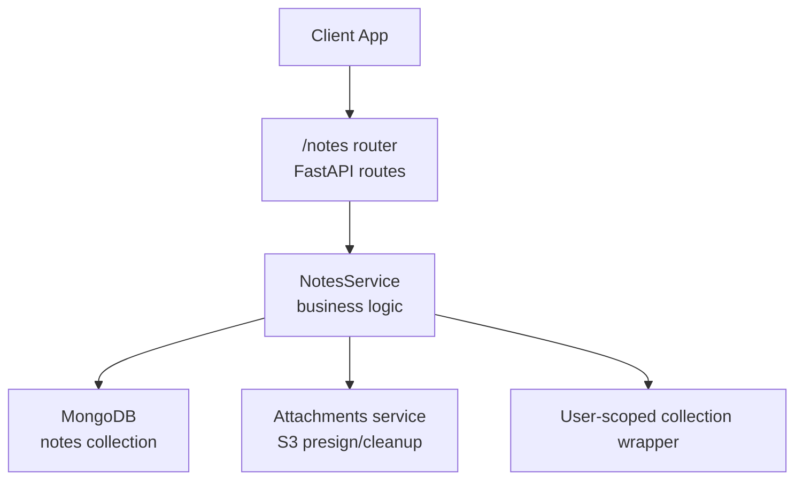
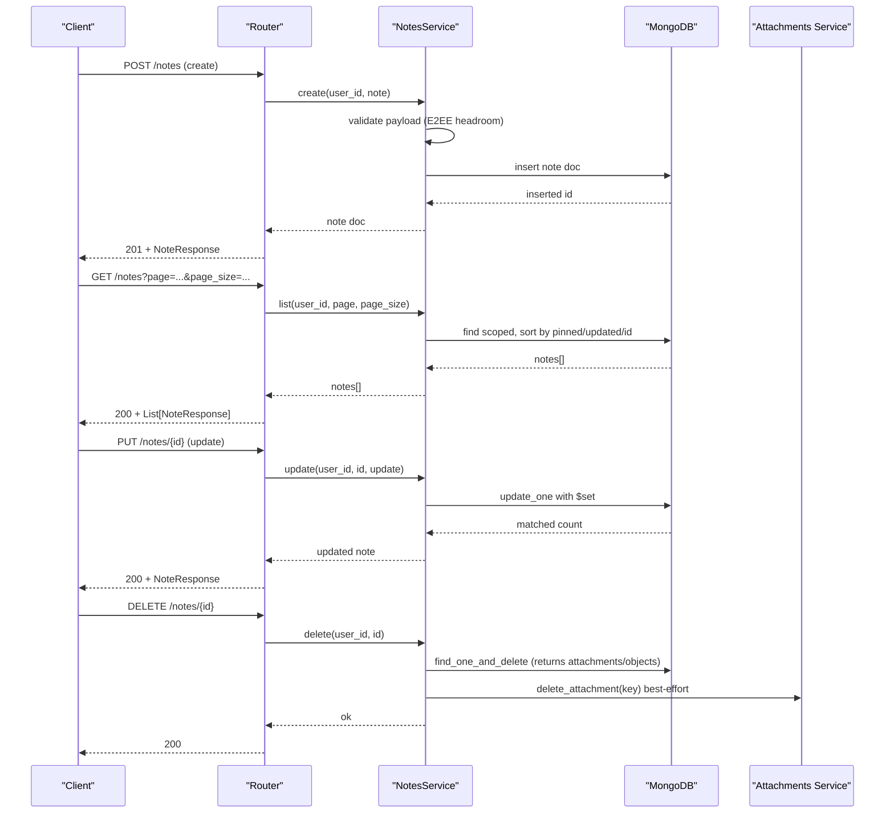
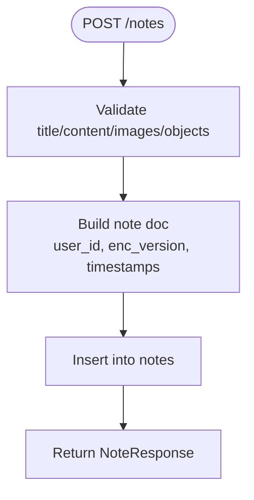
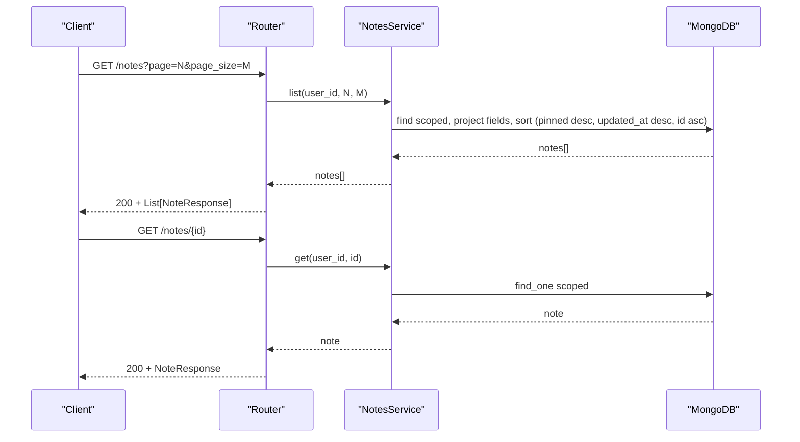
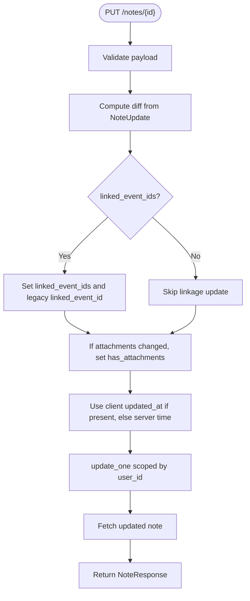
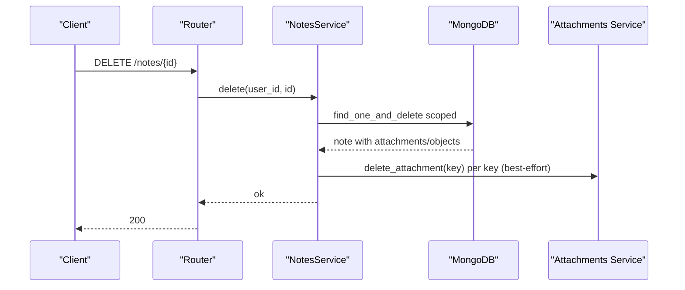
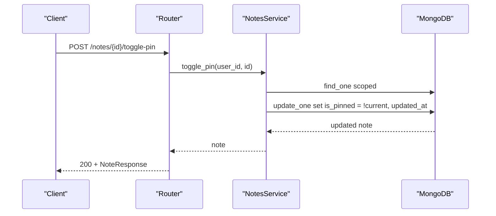
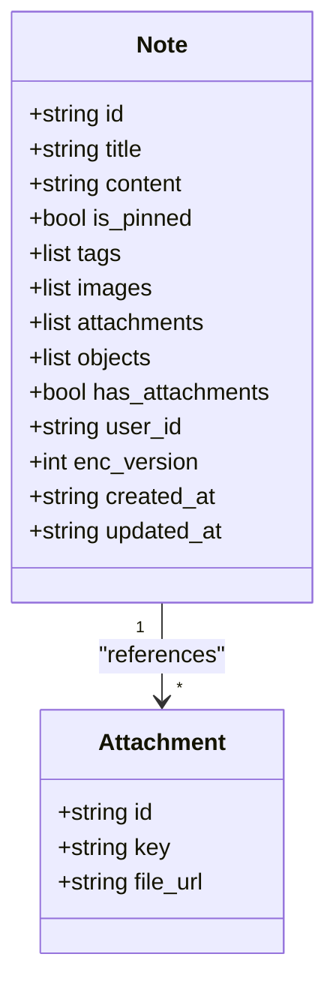
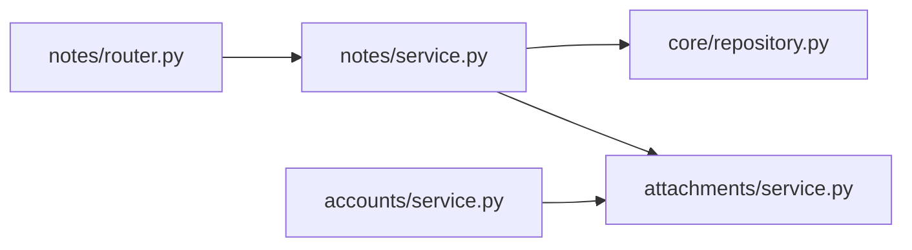

# Notes System

<cite>
**Referenced Files in This Document**
- [router.py](file://notes/router.py)
- [service.py](file://notes/service.py)
- [schemas.py](file://notes/schemas.py)
- [attachments/service.py](file://attachments/service.py)
- [core/repository.py](file://core/repository.py)
- [accounts/service.py](file://accounts/service.py)
</cite>

## Table of Contents
1. [Introduction](#introduction)
2. [Project Structure](#project-structure)
3. [Core Components](#core-components)
4. [Architecture Overview](#architecture-overview)
5. [Detailed Component Analysis](#detailed-component-analysis)
6. [Dependency Analysis](#dependency-analysis)
7. [Performance Considerations](#performance-considerations)
8. [Troubleshooting Guide](#troubleshooting-guide)
9. [Conclusion](#conclusion)
10. [Appendices](#appendices)

## Introduction
This document explains the Notes System sub-feature with a focus on end-to-end encryption (E2EE), CRUD operations, pinning, attachments, metadata handling, search behavior, and data lifecycle. The backend stores note content as client-side encrypted ciphertext when E2EE is enabled, while preserving compatibility for legacy plaintext notes during migration. It also documents how attachments are managed, how user scoping prevents cross-account access, and how account erasure cleans up all related data.

## Project Structure
The Notes feature is implemented across three primary files:
- API routes define endpoints for create, list, get, update, delete, and toggle-pin.
- Service layer implements business logic, payload validation, persistence, and cleanup coordination.
- Schemas define request/response models and include fields for E2EE versioning and attachment references.

**Diagram sources**
- [router.py:17-99](file://notes/router.py#L17-L99)
- [service.py:79-226](file://notes/service.py#L79-L226)
- [core/repository.py:27-94](file://core/repository.py#L27-L94)
- [attachments/service.py:86-173](file://attachments/service.py#L86-L173)

**Section sources**
- [router.py:1-100](file://notes/router.py#L1-L100)
- [service.py:1-226](file://notes/service.py#L1-L226)
- [schemas.py:1-100](file://notes/schemas.py#L1-L100)

## Core Components
- NotesService: Validates payloads, persists notes, handles updates, deletion with attachment cleanup, and toggling pins.
- NoteCreate/NoteUpdate/NoteResponse: Pydantic models that carry note fields, tags, images, attachments, objects, and E2EE metadata.
- User-scoped repository: Ensures every query includes user_id to prevent cross-account data leaks.
- Attachments service: Provides presigned upload/download URLs and bulk deletion for S3-backed attachments.

Key responsibilities:
- Enforce wire-level size limits accounting for E2EE ciphertext expansion.
- Normalize legacy linked_event_id to linked_event_ids for consistent responses.
- Maintain has_attachments flag and coordinate S3 cleanup on note deletion.
- Support offline-first timestamps via client-provided updated_at.

**Section sources**
- [service.py:22-50](file://notes/service.py#L22-L50)
- [service.py:53-76](file://notes/service.py#L53-L76)
- [service.py:79-111](file://notes/service.py#L79-L111)
- [service.py:113-189](file://notes/service.py#L113-L189)
- [service.py:191-226](file://notes/service.py#L191-L226)
- [schemas.py:7-100](file://notes/schemas.py#L7-L100)
- [core/repository.py:27-94](file://core/repository.py#L27-L94)
- [attachments/service.py:86-173](file://attachments/service.py#L86-L173)

## Architecture Overview
The Notes system follows a layered architecture:
- Router exposes REST endpoints and maps exceptions to HTTP status codes.
- Service encapsulates business rules, including E2EE-aware payload sizing and tenant scoping.
- Data access uses Motor async driver with a scoped wrapper to enforce user isolation.
- Attachments are stored in S3; the server issues presigned URLs and performs best-effort cleanup.

**Diagram sources**
- [router.py:17-99](file://notes/router.py#L17-L99)
- [service.py:83-226](file://notes/service.py#L83-L226)
- [attachments/service.py:139-173](file://attachments/service.py#L139-L173)

## Detailed Component Analysis

### End-to-End Encryption (E2EE) Model
- Client-side encryption: When enc_version is set, title/content/tags arrive as ciphertext (AES-256-GCM + base64). The server does not decrypt or inspect these fields.
- Wire-size allowances: Payload validators apply generous headroom to accommodate ciphertext expansion so legitimate notes are not rejected.
- Migration posture: If enc_version is absent or None, the server treats fields as plaintext for backward compatibility. Responses always include enc_version so clients can decide local decryption strategy.

Operational implications:
- Search must be performed client-side because the server cannot match against ciphertext.
- Sorting and pagination rely on non-ciphertext fields (is_pinned, updated_at, id) to remain efficient and deterministic.
- Size caps consider worst-case UTF-8 to ciphertext expansion to avoid false positives.

**Section sources**
- [schemas.py:42-51](file://notes/schemas.py#L42-L51)
- [service.py:30-50](file://notes/service.py#L30-L50)
- [service.py:113-148](file://notes/service.py#L113-L148)

### CRUD Operations

#### Create
- Validates payload sizes considering E2EE ciphertext expansion.
- Normalizes linked_event_id to linked_event_ids for consistency.
- Persists note with user_id, enc_version, and timestamps.
- Returns NoteResponse without internal MongoDB _id.

**Diagram sources**
- [router.py:17-28](file://notes/router.py#L17-L28)
- [service.py:83-111](file://notes/service.py#L83-L111)

**Section sources**
- [router.py:17-28](file://notes/router.py#L17-L28)
- [service.py:83-111](file://notes/service.py#L83-L111)
- [schemas.py:33-51](file://notes/schemas.py#L33-L51)

#### Read (List and Get)
- List supports pagination with deterministic ordering using pinned status, updated_at, and id.
- Get retrieves a single note by id scoped to user_id.
- Both normalize linked_event_id to linked_event_ids for consistent arrays.

**Diagram sources**
- [router.py:31-54](file://notes/router.py#L31-L54)
- [service.py:113-154](file://notes/service.py#L113-L154)

**Section sources**
- [router.py:31-54](file://notes/router.py#L31-L54)
- [service.py:113-154](file://notes/service.py#L113-L154)

#### Update
- Accepts partial updates; only provided fields are changed.
- Explicitly allows clearing linked_event_id/linked_event_ids to unlink events.
- Maintains has_attachments flag when attachments change.
- Uses client-provided updated_at when present to support offline-first conflict resolution.

**Diagram sources**
- [router.py:57-71](file://notes/router.py#L57-L71)
- [service.py:156-189](file://notes/service.py#L156-L189)

**Section sources**
- [router.py:57-71](file://notes/router.py#L57-L71)
- [service.py:156-189](file://notes/service.py#L156-L189)
- [schemas.py:54-73](file://notes/schemas.py#L54-L73)

#### Delete
- Atomic find-one-and-delete returns attachments and objects keys for cleanup.
- Best-effort deletion of S3 attachments; failures do not resurrect the note.
- Integrates with GDPR erasure via accounts service for full data removal.

**Diagram sources**
- [router.py:74-85](file://notes/router.py#L74-L85)
- [service.py:191-212](file://notes/service.py#L191-L212)
- [attachments/service.py:139-153](file://attachments/service.py#L139-L153)

**Section sources**
- [router.py:74-85](file://notes/router.py#L74-L85)
- [service.py:191-212](file://notes/service.py#L191-L212)
- [attachments/service.py:139-153](file://attachments/service.py#L139-L153)

### Pin/Unpin
- Toggle endpoint flips is_pinned and updates timestamp.
- Sorting ensures pinned notes appear first in lists.

**Diagram sources**
- [router.py:88-99](file://notes/router.py#L88-L99)
- [service.py:213-226](file://notes/service.py#L213-L226)

**Section sources**
- [router.py:88-99](file://notes/router.py#L88-L99)
- [service.py:213-226](file://notes/service.py#L213-L226)

### Attachment Support
- Notes may reference attachments via an array of Attachment objects.
- On create/update, has_attachments is derived from the presence of attachments.
- On delete, the server extracts keys from both attachments and image objects and deletes them from S3 best-effort.
- Presigned URLs are issued by the attachments service for uploads and downloads, scoped to user namespaces.

**Diagram sources**
- [schemas.py:7-100](file://notes/schemas.py#L7-L100)
- [attachments/service.py:86-173](file://attachments/service.py#L86-L173)

**Section sources**
- [service.py:83-111](file://notes/service.py#L83-L111)
- [service.py:156-189](file://notes/service.py#L156-L189)
- [service.py:191-212](file://notes/service.py#L191-L212)
- [attachments/service.py:86-173](file://attachments/service.py#L86-L173)

### Metadata Handling and Relationships
- Linked events: normalized to linked_event_ids array; legacy singular field maintained for backward compatibility.
- Tags: stored as structured objects with name and color.
- Images: inline base64 thumbnails; separate ImageObject model for canvas overlays with position/transform metadata.
- User relationship: every note carries user_id enforced by scoped writes and reads.

**Section sources**
- [service.py:67-76](file://notes/service.py#L67-L76)
- [service.py:83-111](file://notes/service.py#L83-L111)
- [service.py:113-154](file://notes/service.py#L113-L154)
- [schemas.py:7-31](file://notes/schemas.py#L7-L31)
- [core/repository.py:27-94](file://core/repository.py#L27-L94)

### Search Capabilities
- Server-side search over note content/title/tags is not supported when E2EE is enabled because fields are ciphertext.
- Filtering and search are performed client-side after retrieving notes.
- Efficient list retrieval relies on indexes covering (user_id, is_pinned, updated_at, id) for deterministic paging.

**Section sources**
- [service.py:113-148](file://notes/service.py#L113-L148)

### Wrapped Key Escrow and Key Management
- The backend stores enc_version alongside notes to indicate whether content is encrypted and which algorithm/version was used by the client.
- The server never holds or manages encryption keys; it trusts the client to encrypt before sending and decrypt after receiving.
- Account erasure removes notes and associated attachments, ensuring no residual data remains under the user’s namespace.

**Section sources**
- [schemas.py:42-51](file://notes/schemas.py#L42-L51)
- [service.py:30-50](file://notes/service.py#L30-L50)
- [accounts/service.py:59-88](file://accounts/service.py#L59-L88)

## Dependency Analysis
- Router depends on NotesService and schemas for request/response modeling.
- NotesService depends on:
  - Motor database for persistence.
  - core.repository.scoped for user-scoped queries.
  - attachments.service for S3 cleanup.
- Accounts service coordinates full erasure across collections and S3.

**Diagram sources**
- [router.py:1-10](file://notes/router.py#L1-L10)
- [service.py:15-17](file://notes/service.py#L15-L17)
- [core/repository.py:27-94](file://core/repository.py#L27-L94)
- [attachments/service.py:1-20](file://attachments/service.py#L1-L20)
- [accounts/service.py:10-12](file://accounts/service.py#L10-L12)

**Section sources**
- [router.py:1-10](file://notes/router.py#L1-L10)
- [service.py:15-17](file://notes/service.py#L15-L17)
- [core/repository.py:27-94](file://core/repository.py#L27-L94)
- [attachments/service.py:1-20](file://attachments/service.py#L1-L20)
- [accounts/service.py:10-12](file://accounts/service.py#L10-L12)

## Performance Considerations
- Deterministic sorting: Using (is_pinned desc, updated_at desc, id asc) avoids unstable sorts and respects MongoDB’s sort limits even with large base64 images.
- Index coverage: Sorting fields align with an index to prevent in-memory sorts over large datasets.
- Payload caps: Generous headroom accommodates ciphertext expansion without rejecting valid notes.
- Attachment usage aggregation: Aggregation pipeline computes total bytes without fetching entire notes, minimizing network overhead.

**Section sources**
- [service.py:113-148](file://notes/service.py#L113-L148)
- [service.py:30-50](file://notes/service.py#L30-L50)
- [attachments/service.py:199-227](file://attachments/service.py#L199-L227)

## Troubleshooting Guide
Common issues and resolutions:
- 413 Payload Too Large: Occurs when title, content, images, or object counts exceed limits. Ensure client-side compression or splitting for large notes.
- 404 Not Found: Indicates note not found or user mismatch due to scoping. Verify user_id scoping and note existence.
- Stale edits in sync: Use client-provided updated_at to ensure newer local edits win during conflict resolution.
- Orphaned attachments: Deleting notes triggers best-effort S3 cleanup; if cleanup fails, re-run account erasure or manual cleanup via attachments service.
- Search not returning results: With E2EE enabled, search must be client-side; server cannot filter ciphertext.

**Section sources**
- [router.py:24-28](file://notes/router.py#L24-L28)
- [router.py:49-54](file://notes/router.py#L49-L54)
- [router.py:64-71](file://notes/router.py#L64-L71)
- [router.py:74-85](file://notes/router.py#L74-L85)
- [service.py:53-65](file://notes/service.py#L53-L65)
- [service.py:156-189](file://notes/service.py#L156-L189)
- [service.py:191-212](file://notes/service.py#L191-L212)

## Conclusion
The Notes System provides secure, scalable storage for notes with optional end-to-end encryption. The server enforces strict payload limits, maintains deterministic pagination, and integrates tightly with attachments storage. Search is intentionally client-side when E2EE is enabled to preserve privacy. Robust user scoping and account erasure ensure data isolation and compliance. For optimal performance, leverage client-side filtering and keep note payloads within recommended limits.

## Appendices

### Concrete Examples from Codebase
- Encrypted note creation: See create flow validating payload and persisting enc_version.
- Retrieval with client-side decryption: See list/get flows returning enc_version and ciphertext fields for client decryption.
- Bulk operations: See list with pagination and delete with cascading attachment cleanup.

**Section sources**
- [service.py:83-111](file://notes/service.py#L83-L111)
- [service.py:113-154](file://notes/service.py#L113-L154)
- [service.py:191-212](file://notes/service.py#L191-L212)

### Migration Strategies for Existing Data
- Backward compatibility: Legacy plaintext notes remain readable; enc_version indicates encryption state.
- Normalization: linked_event_id is mapped to linked_event_ids for consistent responses without schema changes.
- Gradual rollout: Clients can opt into E2EE by setting enc_version; server continues to accept plaintext until migration completes.

**Section sources**
- [service.py:67-76](file://notes/service.py#L67-L76)
- [schemas.py:42-51](file://notes/schemas.py#L42-L51)