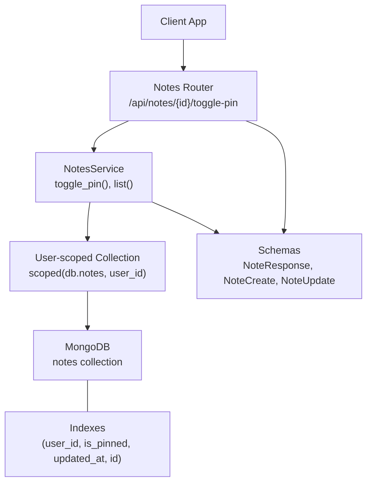
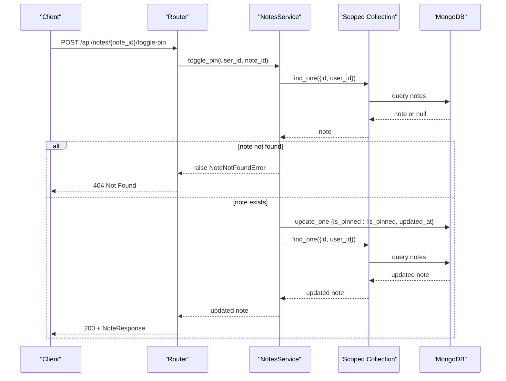
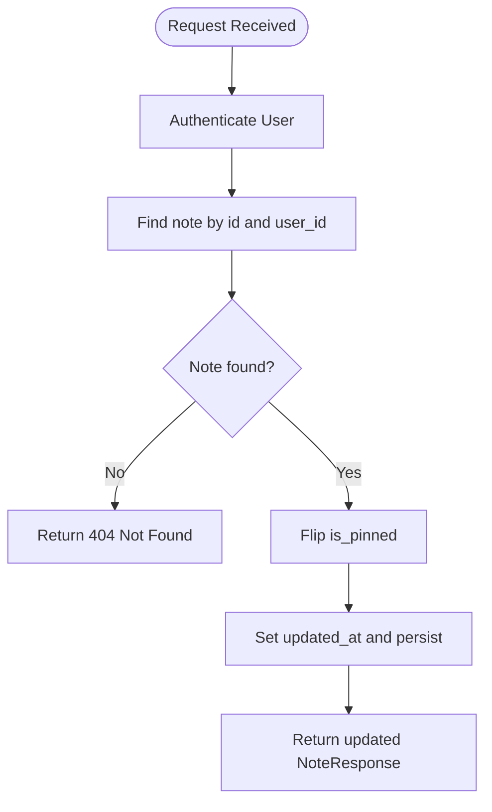
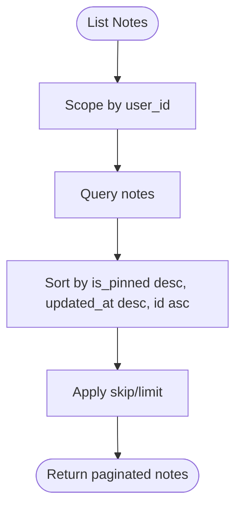
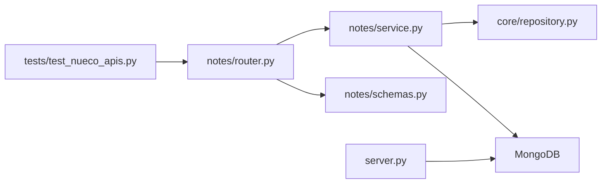

# Pin/Unpin Functionality

<cite>
**Referenced Files in This Document**
- [router.py](file://notes/router.py)
- [service.py](file://notes/service.py)
- [schemas.py](file://notes/schemas.py)
- [server.py](file://server.py)
- [repository.py](file://core/repository.py)
- [test_nueco_apis.py](file://tests/test_nueco_apis.py)
</cite>

## Table of Contents
1. [Introduction](#introduction)
2. [Project Structure](#project-structure)
3. [Core Components](#core-components)
4. [Architecture Overview](#architecture-overview)
5. [Detailed Component Analysis](#detailed-component-analysis)
6. [Dependency Analysis](#dependency-analysis)
7. [Performance Considerations](#performance-considerations)
8. [Troubleshooting Guide](#troubleshooting-guide)
9. [Conclusion](#conclusion)
10. [Appendices](#appendices)

## Introduction
This document explains the note pinning/unpinning feature that allows users to mark important notes for quick access. It covers the toggle-pin endpoint, the business logic behind pin management, how pinned notes are prioritized in listings, storage implications, API examples, and user experience considerations such as visual indicators and search/filtering behavior for pinned content.

## Project Structure
The pinning feature is implemented within the Notes module and supported by core infrastructure:
- Router exposes the toggle-pin endpoint and standard CRUD operations for notes.
- Service contains the business logic for toggling pins, listing with priority ordering, and persistence.
- Schemas define request/response models including the is_pinned field.
- Server initializes database indexes that make pinned-note sorting efficient.
- Core repository enforces user-scoped data access to ensure notes are only manipulated by their owners.

**Diagram sources**
- [router.py:88-99](file://notes/router.py#L88-L99)
- [service.py:113-148](file://notes/service.py#L113-L148)
- [service.py:213-225](file://notes/service.py#L213-L225)
- [repository.py:27-94](file://core/repository.py#L27-L94)
- [server.py:364-380](file://server.py#L364-L380)

**Section sources**
- [router.py:88-99](file://notes/router.py#L88-L99)
- [service.py:113-148](file://notes/service.py#L113-L148)
- [service.py:213-225](file://notes/service.py#L213-L225)
- [repository.py:27-94](file://core/repository.py#L27-L94)
- [server.py:364-380](file://server.py#L364-L380)

## Core Components
- Toggle-pin endpoint: POST /api/notes/{note_id}/toggle-pin returns the updated note with is_pinned flipped.
- Business logic: The service reads the current is_pinned value, flips it, updates the document, and refreshes updated_at.
- Listing priority: Notes are sorted so pinned notes appear first, then by most recently updated, with a deterministic tiebreaker on id.
- Storage: Each note stores an is_pinned boolean; indexes optimize queries and sorts for pinned-first ordering.

Key responsibilities:
- Router: Validates authentication, maps exceptions to HTTP responses, serializes responses.
- Service: Implements toggle_pin and list with index-friendly sort.
- Schemas: Define is_pinned in create/update/response shapes.
- Repository: Ensures all operations are scoped to the authenticated user.
- Server: Creates compound indexes to support efficient pinned-first pagination.

**Section sources**
- [router.py:88-99](file://notes/router.py#L88-L99)
- [service.py:213-225](file://notes/service.py#L213-L225)
- [service.py:113-148](file://notes/service.py#L113-L148)
- [schemas.py:33-52](file://notes/schemas.py#L33-L52)
- [schemas.py:54-73](file://notes/schemas.py#L54-L73)
- [schemas.py:76-92](file://notes/schemas.py#L76-L92)
- [repository.py:27-94](file://core/repository.py#L27-L94)
- [server.py:364-380](file://server.py#L364-L380)

## Architecture Overview
The toggle-pin flow is a straightforward update operation with strong user scoping and index-backed sorting for lists.

**Diagram sources**
- [router.py:88-99](file://notes/router.py#L88-L99)
- [service.py:213-225](file://notes/service.py#L213-L225)
- [repository.py:55-60](file://core/repository.py#L55-L60)

## Detailed Component Analysis

### Toggle-Pin Endpoint
- Path: POST /api/notes/{note_id}/toggle-pin
- Authentication: Requires an authenticated user via dependency injection.
- Behavior: Flips the is_pinned flag on the specified note belonging to the current user and returns the updated note.
- Error handling: Returns 404 if the note does not exist or does not belong to the user.

**Diagram sources**
- [router.py:88-99](file://notes/router.py#L88-L99)
- [service.py:213-225](file://notes/service.py#L213-L225)

**Section sources**
- [router.py:88-99](file://notes/router.py#L88-L99)
- [service.py:213-225](file://notes/service.py#L213-L225)

### Listing Priority and Sorting
- Pinned notes are prioritized at the top of the list.
- Within pinned and unpinned groups, notes are ordered by most recently updated.
- A deterministic tiebreaker (id) ensures stable pagination across pages.

**Diagram sources**
- [service.py:113-148](file://notes/service.py#L113-L148)

**Section sources**
- [service.py:113-148](file://notes/service.py#L113-L148)

### Data Model and Schemas
- is_pinned is a boolean present in create, update, and response schemas.
- When creating a note, is_pinned can be set initially; when updating, it can be changed directly or toggled via the toggle endpoint.
- Responses include is_pinned so clients can render appropriate UI states.

**Section sources**
- [schemas.py:33-52](file://notes/schemas.py#L33-L52)
- [schemas.py:54-73](file://notes/schemas.py#L54-L73)
- [schemas.py:76-92](file://notes/schemas.py#L76-L92)

### Security and Scoping
- All operations are scoped to the authenticated user using a user-scoped collection wrapper.
- This prevents cross-user access even if filters are omitted or mis-specified.

**Section sources**
- [repository.py:27-94](file://core/repository.py#L27-L94)

### Database Indexes for Performance
- Compound indexes are created to fully cover the list query and sort:
  - (user_id, is_pinned, updated_at)
  - (user_id, is_pinned, updated_at, id)
- These indexes avoid in-memory sorts and prevent failures when notes carry large payloads.

**Section sources**
- [server.py:364-380](file://server.py#L364-L380)

## Dependency Analysis
- Router depends on NotesService for business logic and on Pydantic schemas for validation/serialization.
- NotesService depends on Motor MongoDB client through a user-scoped collection wrapper.
- Server initializes indexes that align with service-level sorting requirements.
- Tests exercise the toggle-pin flow and assert correct state transitions.

**Diagram sources**
- [router.py:88-99](file://notes/router.py#L88-L99)
- [service.py:113-148](file://notes/service.py#L113-L148)
- [service.py:213-225](file://notes/service.py#L213-L225)
- [repository.py:27-94](file://core/repository.py#L27-L94)
- [server.py:364-380](file://server.py#L364-L380)
- [test_nueco_apis.py:177-202](file://tests/test_nueco_apis.py#L177-L202)

**Section sources**
- [router.py:88-99](file://notes/router.py#L88-L99)
- [service.py:113-148](file://notes/service.py#L113-L148)
- [service.py:213-225](file://notes/service.py#L213-L225)
- [repository.py:27-94](file://core/repository.py#L27-L94)
- [server.py:364-380](file://server.py#L364-L380)
- [test_nueco_apis.py:177-202](file://tests/test_nueco_apis.py#L177-L202)

## Performance Considerations
- Pinned-first sorting uses a compound index to avoid expensive in-memory sorts, especially important when notes contain base64 images.
- Deterministic tiebreaking on id ensures stable pagination and prevents missing/duplicate items during page navigation.
- The toggle operation updates only the is_pinned flag and refreshed timestamp, minimizing write payload.

[No sources needed since this section provides general guidance]

## Troubleshooting Guide
Common issues and resolutions:
- 404 Not Found when toggling:
  - Cause: Note does not exist or does not belong to the authenticated user.
  - Resolution: Verify note_id and ensure the request is made by the note’s owner.
- Unexpected ordering in listings:
  - Cause: Missing or incorrect indexes or client-side caching inconsistencies.
  - Resolution: Ensure server indexes exist and refresh client caches after pin changes.
- Large payloads causing sort failures:
  - Cause: In-memory sort triggered by missing indexes.
  - Resolution: Confirm compound indexes are created and used by the list query.

**Section sources**
- [router.py:88-99](file://notes/router.py#L88-L99)
- [service.py:113-148](file://notes/service.py#L113-L148)
- [service.py:213-225](file://notes/service.py#L213-L225)
- [server.py:364-380](file://server.py#L364-L380)

## Conclusion
The pin/unpin feature provides a simple, secure, and performant way to prioritize important notes. The toggle endpoint flips the is_pinned flag with proper user scoping, while listings use index-backed sorting to show pinned notes first. Clients should rely on the is_pinned field to render visual indicators and adjust filtering/search behavior accordingly.

[No sources needed since this section summarizes without analyzing specific files]

## Appendices

### API Examples

- Toggle a note to pinned:
  - Request: POST /api/notes/{note_id}/toggle-pin
  - Success Response: 200 OK with NoteResponse where is_pinned is true
  - Error Response: 404 Not Found if note not found or not owned by user

- Toggle a note back to unpinned:
  - Request: POST /api/notes/{note_id}/toggle-pin
  - Success Response: 200 OK with NoteResponse where is_pinned is false

- Retrieve a single note to verify pin state:
  - Request: GET /api/notes/{note_id}
  - Success Response: 200 OK with NoteResponse including is_pinned

- List notes to observe pinned-first ordering:
  - Request: GET /api/notes?page=1&page_size=50
  - Success Response: 200 OK with array of NoteResponse; pinned notes appear before unpinned ones

These flows are validated by tests that create a note, toggle its pin status, and confirm the resulting is_pinned values.

**Section sources**
- [router.py:88-99](file://notes/router.py#L88-L99)
- [test_nueco_apis.py:177-202](file://tests/test_nueco_apis.py#L177-L202)

### User Experience Considerations
- Visual indicators:
  - Use the is_pinned field to display a pin icon or highlight on pinned notes in lists and detail views.
  - Provide a clear affordance (e.g., a pin button) to toggle pinning with immediate feedback.

- Search and filtering:
  - Server-side search is client-side due to end-to-end encryption; filter pinned vs. unpinned on the client using the is_pinned field.
  - If implementing a “show only pinned” view, filter locally based on is_pinned.

- Sync and offline behavior:
  - After toggling, ensure the client updates its local cache and re-renders the list to reflect the new order.
  - If offline, queue the toggle request and reconcile upon sync.

[No sources needed since this section doesn't analyze specific files]