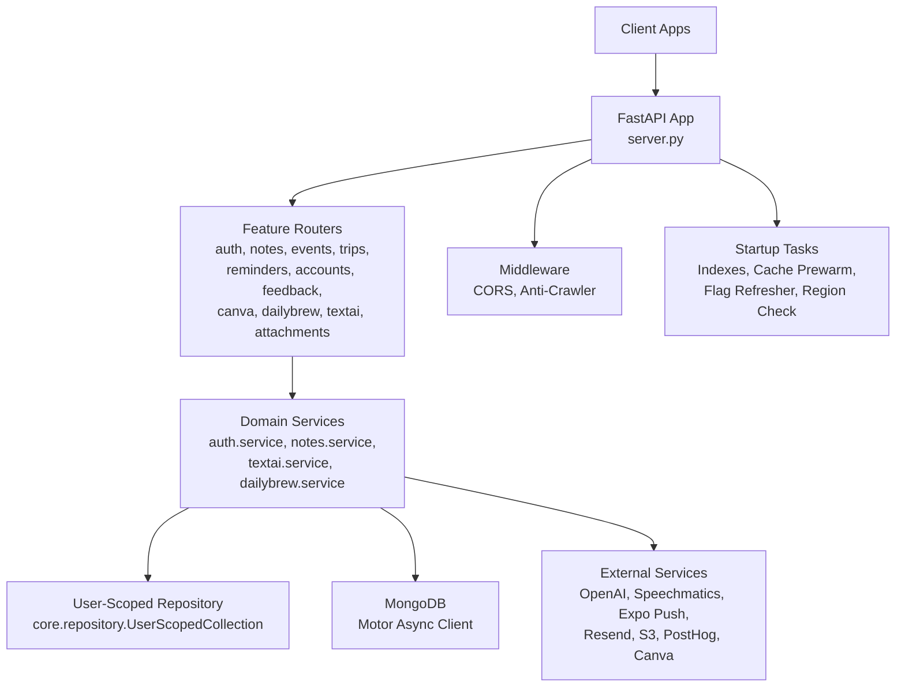
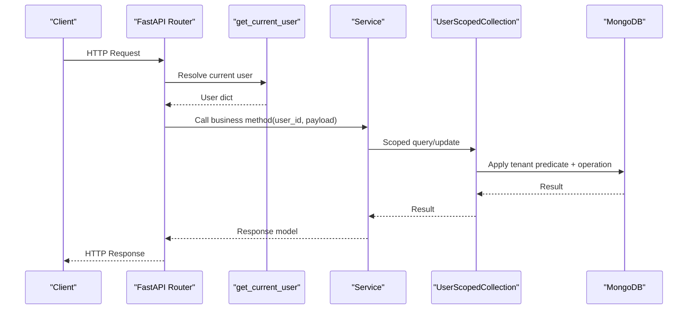
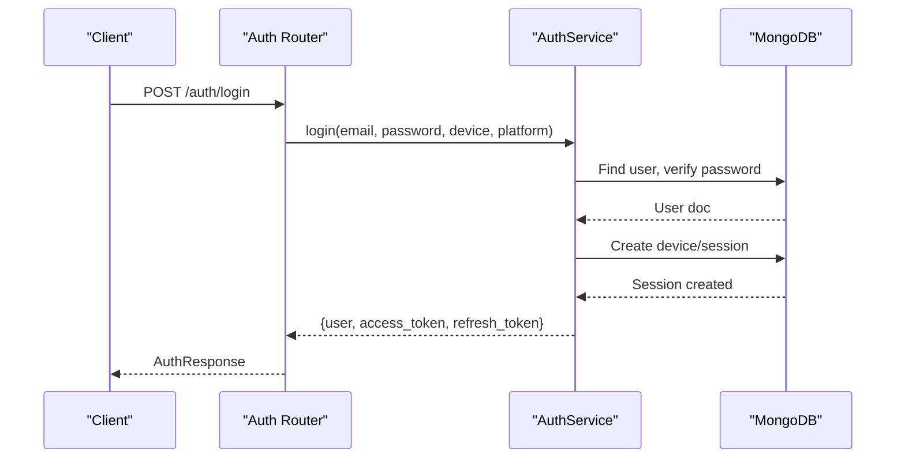
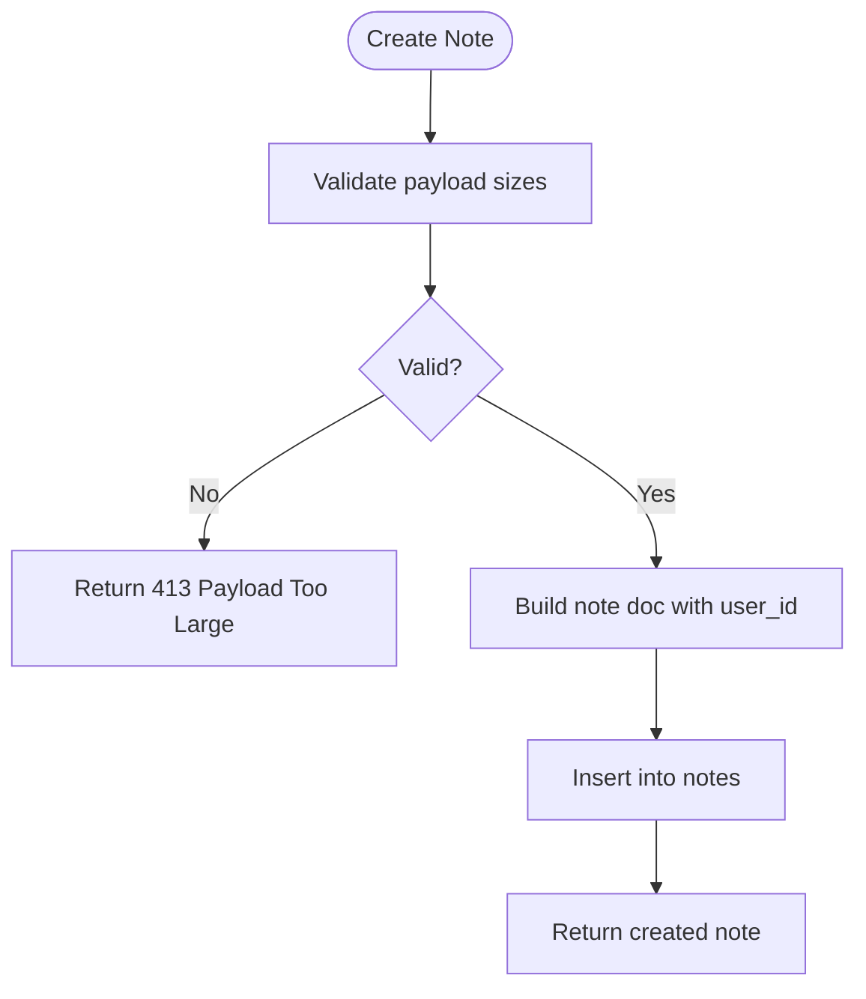
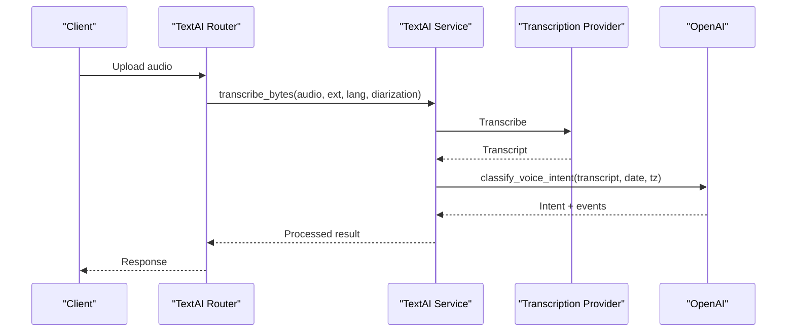
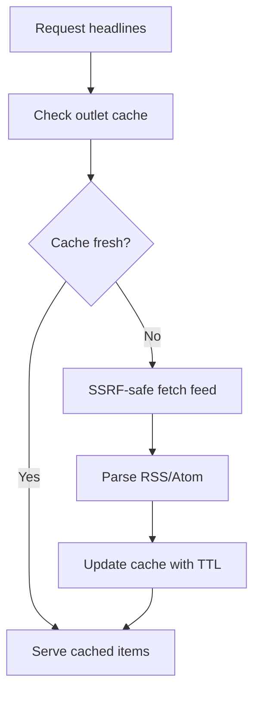
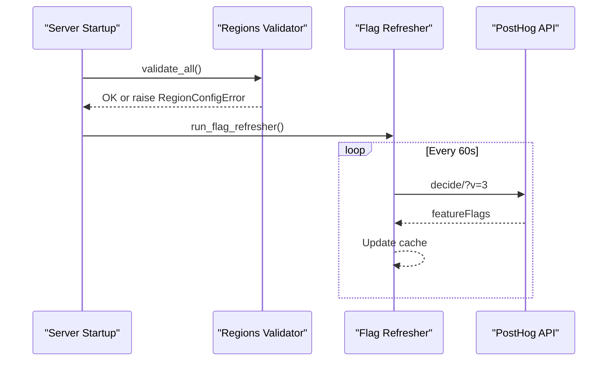
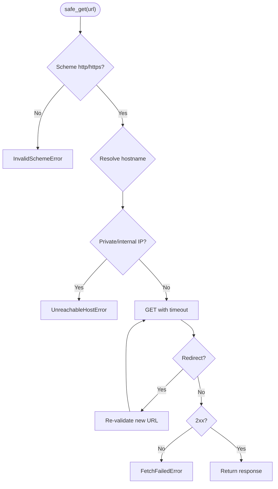
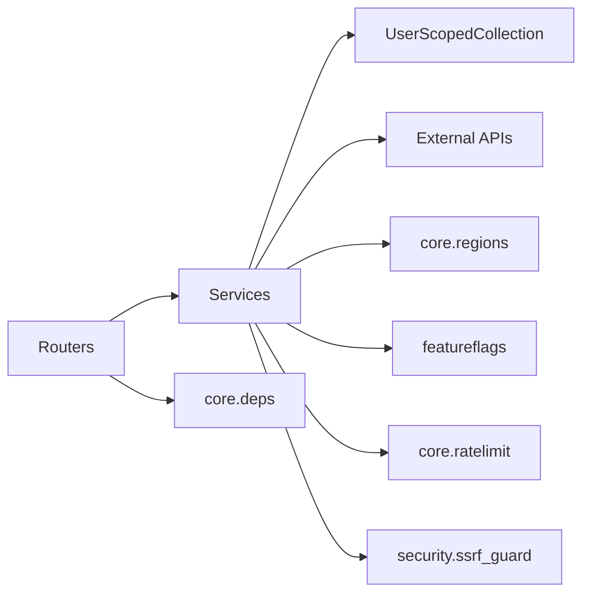

# Architecture Overview

<cite>
**Referenced Files in This Document**
- [server.py](file://server.py)
- [core/deps.py](file://core/deps.py)
- [core/repository.py](file://core/repository.py)
- [core/ratelimit.py](file://core/ratelimit.py)
- [core/regions.py](file://core/regions.py)
- [featureflags.py](file://featureflags.py)
- [security/ssrf_guard.py](file://security/ssrf_guard.py)
- [auth/router.py](file://auth/router.py)
- [auth/service.py](file://auth/service.py)
- [notes/router.py](file://notes/router.py)
- [notes/service.py](file://notes/service.py)
- [textai/service.py](file://textai/service.py)
- [dailybrew/service.py](file://dailybrew/service.py)
</cite>

## Table of Contents
1. [Introduction](#introduction)
2. [Project Structure](#project-structure)
3. [Core Components](#core-components)
4. [Architecture Overview](#architecture-overview)
5. [Detailed Component Analysis](#detailed-component-analysis)
6. [Dependency Analysis](#dependency-analysis)
7. [Performance Considerations](#performance-considerations)
8. [Troubleshooting Guide](#troubleshooting-guide)
9. [Conclusion](#conclusion)

## Introduction
This document describes the Nueco Backend architecture as a modular monolith built with FastAPI. It emphasizes clear separation between routers (HTTP endpoints), services (business logic), and repositories/data access (MongoDB collections). The system uses dependency injection for database connections and user context, enforces data residency via region checks, implements rate limiting for AI endpoints, integrates feature flags through PostHog, and applies security controls such as SSRF protection. Cross-cutting concerns include structured logging, startup tasks (indexes, cache prewarming, flag refreshers), and consistent error handling patterns.

## Project Structure
The backend is organized by domain modules (auth, notes, events, trips, reminders, accounts, feedback, canva, dailybrew, textai, attachments), each exposing an APIRouter and a service module. Shared infrastructure lives under core (dependencies, repository scoping, rate limiting, regions), plus security utilities and feature flag management at the root.

**Diagram sources**
- [server.py:1-214](file://server.py#L1-L214)
- [core/repository.py:27-95](file://core/repository.py#L27-L95)
- [core/regions.py:144-165](file://core/regions.py#L144-L165)

**Section sources**
- [server.py:1-214](file://server.py#L1-L214)

## Core Components
- Application bootstrap and routing: FastAPI app, API router, middleware, startup hooks, static pages, and inclusion of feature routers.
- Dependency injection: get_db and get_current_user provide MongoDB handles and authenticated user context to routes.
- Repository pattern: User-scoped collection wrapper ensures every query is tenant-scoped to prevent cross-account leaks.
- Rate limiting: In-process sliding window limiter protects shared AI quotas per-user and globally.
- Data residency: Centralized configuration validates external endpoints and regions are present and Australian; boot fails if not compliant.
- Feature flags: Background refresher fetches flags from PostHog and exposes server-side toggles (e.g., daily-brew-enabled).
- Security: SSRF guard validates outbound requests to public hosts only, re-validating on redirects.

**Section sources**
- [server.py:20-214](file://server.py#L20-L214)
- [core/deps.py:15-51](file://core/deps.py#L15-L51)
- [core/repository.py:27-95](file://core/repository.py#L27-L95)
- [core/ratelimit.py:41-124](file://core/ratelimit.py#L41-L124)
- [core/regions.py:144-165](file://core/regions.py#L144-L165)
- [featureflags.py:25-53](file://featureflags.py#L25-L53)
- [security/ssrf_guard.py:50-109](file://security/ssrf_guard.py#L50-L109)

## Architecture Overview
The system follows a layered modular monolith:
- Routers define HTTP endpoints and translate request/response shapes.
- Services encapsulate business rules, validation, and orchestration across data stores and external APIs.
- Repositories enforce user scoping and abstract MongoDB operations.
- Cross-cutting concerns (auth, rate limits, region checks, feature flags, SSRF protection) are applied consistently.

**Diagram sources**
- [core/deps.py:24-51](file://core/deps.py#L24-L51)
- [core/repository.py:27-95](file://core/repository.py#L27-L95)
- [notes/router.py:17-100](file://notes/router.py#L17-L100)
- [notes/service.py:83-148](file://notes/service.py#L83-L148)

## Detailed Component Analysis

### Authentication and Authorization
- Access tokens are JWTs bound to sessions; logout invalidates sessions and revokes tokens.
- Password hashing runs off the event loop to avoid blocking.
- Email verification and password reset flows use time-bound tokens and idempotent verification links.
- Rate limiting on auth endpoints prevents brute-force and abuse.

**Diagram sources**
- [auth/router.py:115-140](file://auth/router.py#L115-L140)
- [auth/service.py:202-273](file://auth/service.py#L202-L273)

**Section sources**
- [auth/router.py:22-84](file://auth/router.py#L22-L84)
- [auth/service.py:35-105](file://auth/service.py#L35-L105)
- [auth/service.py:202-273](file://auth/service.py#L202-L273)
- [auth/service.py:469-494](file://auth/service.py#L469-L494)

### Notes Domain
- Routers handle CRUD and pagination; services validate payloads and persist notes.
- User scoping is enforced via scoped collections to prevent cross-account access.
- Indexes ensure efficient sorting and paging without in-memory sorts.

**Diagram sources**
- [notes/service.py:53-65](file://notes/service.py#L53-L65)
- [notes/service.py:83-111](file://notes/service.py#L83-L111)
- [notes/router.py:17-28](file://notes/router.py#L17-L28)

**Section sources**
- [notes/router.py:17-100](file://notes/router.py#L17-L100)
- [notes/service.py:79-148](file://notes/service.py#L79-L148)
- [server.py:344-423](file://server.py#L344-L423)

### Text AI and Transcription
- Transcription selects provider based on diarization settings; shadow transcription runs asynchronously for comparison.
- Text processing actions (organize, summarize, smart_format) call OpenAI with structured prompts and JSON responses.
- Voice intent classification extracts calendar events or trip itineraries from transcripts.

**Diagram sources**
- [textai/service.py:112-130](file://textai/service.py#L112-L130)
- [textai/service.py:259-315](file://textai/service.py#L259-L315)

**Section sources**
- [textai/service.py:112-130](file://textai/service.py#L112-L130)
- [textai/service.py:133-232](file://textai/service.py#L133-L232)
- [textai/service.py:259-315](file://textai/service.py#L259-L315)

### Daily Brew News
- Fetches RSS/Atom feeds with SSRF-safe GET, parses items, caches per outlet, and serves curated headlines.
- Background prewarmer keeps feed caches warm to reduce latency.

**Diagram sources**
- [dailybrew/service.py:134-158](file://dailybrew/service.py#L134-L158)
- [dailybrew/service.py:168-203](file://dailybrew/service.py#L168-L203)
- [dailybrew/service.py:209-221](file://dailybrew/service.py#L209-L221)

**Section sources**
- [dailybrew/service.py:168-203](file://dailybrew/service.py#L168-L203)
- [dailybrew/service.py:209-221](file://dailybrew/service.py#L209-L221)
- [dailybrew/service.py:227-284](file://dailybrew/service.py#L227-L284)

### Data Residency and Feature Flags
- On startup, all external-service endpoints and regions are validated against an Australian allowlist; boot aborts if non-compliant.
- Feature flags are refreshed from PostHog in background and exposed to clients via user profile responses.

**Diagram sources**
- [server.py:338-342](file://server.py#L338-L342)
- [core/regions.py:144-165](file://core/regions.py#L144-L165)
- [featureflags.py:25-53](file://featureflags.py#L25-L53)

**Section sources**
- [core/regions.py:144-165](file://core/regions.py#L144-L165)
- [featureflags.py:25-53](file://featureflags.py#L25-L53)

### Security Controls
- SSRF guard validates schemes, resolves hostnames, rejects private/internal IPs, and re-validates on redirects.
- Anti-crawler middleware blocks known AI crawler user agents and sets robots headers.

**Diagram sources**
- [security/ssrf_guard.py:50-109](file://security/ssrf_guard.py#L50-L109)

**Section sources**
- [security/ssrf_guard.py:50-109](file://security/ssrf_guard.py#L50-L109)
- [server.py:310-317](file://server.py#L310-L317)

## Dependency Analysis
- Routers depend on services and shared dependencies (get_current_user, get_db).
- Services depend on repositories (scoped collections) and external clients (OpenAI, providers).
- Core modules are framework-agnostic where possible to maintain clean boundaries.
- Startup tasks coordinate indexes, cache prewarming, and feature flag refreshers.

**Diagram sources**
- [core/deps.py:15-51](file://core/deps.py#L15-L51)
- [core/repository.py:27-95](file://core/repository.py#L27-L95)
- [core/regions.py:184-230](file://core/regions.py#L184-L230)
- [featureflags.py:25-53](file://featureflags.py#L25-L53)
- [core/ratelimit.py:96-124](file://core/ratelimit.py#L96-L124)
- [security/ssrf_guard.py:50-109](file://security/ssrf_guard.py#L50-L109)

**Section sources**
- [core/deps.py:15-51](file://core/deps.py#L15-L51)
- [core/repository.py:27-95](file://core/repository.py#L27-L95)
- [core/regions.py:184-230](file://core/regions.py#L184-L230)
- [featureflags.py:25-53](file://featureflags.py#L25-L53)
- [core/ratelimit.py:96-124](file://core/ratelimit.py#L96-L124)
- [security/ssrf_guard.py:50-109](file://security/ssrf_guard.py#L50-L109)

## Performance Considerations
- Database indexes are created at startup to support efficient queries and sorting, avoiding in-memory sorts that could fail with large payloads.
- In-process rate limiting protects shared AI quotas; consider Redis-backed state for horizontal scaling.
- Daily Brew caches feed results per outlet with TTL to minimize network calls and parsing overhead.
- Background tasks (cache prewarm, flag refreshers, speech job sweeper) keep hot paths fast.

[No sources needed since this section provides general guidance]

## Troubleshooting Guide
- Authentication failures: Verify Bearer token presence and validity; check session existence and expiration.
- Data residency errors: Boot will fail with region-check errors if any endpoint or region variable is missing or non-Australian; inspect environment variables.
- SSRF errors: Outbound fetches must target public hosts; ensure URLs resolve to public IPs and follow allowed schemes.
- Rate limiting: Excessive AI usage triggers 429 responses; adjust client retry behavior using Retry-After hints.
- Logging: Structured logs capture key events (transcription latency, cache misses, flag refresh failures); search logs for warnings/errors during startup or request handling.

**Section sources**
- [core/deps.py:24-51](file://core/deps.py#L24-L51)
- [core/regions.py:144-165](file://core/regions.py#L144-L165)
- [security/ssrf_guard.py:50-109](file://security/ssrf_guard.py#L50-L109)
- [core/ratelimit.py:41-124](file://core/ratelimit.py#L41-L124)
- [server.py:338-342](file://server.py#L338-L342)

## Conclusion
Nueco Backend implements a robust modular monolith with clear separation of concerns: routers expose HTTP endpoints, services encapsulate business logic, and repositories enforce user scoping for safe data access. Dependency injection centralizes database and user context resolution. Cross-cutting concerns—data residency enforcement, rate limiting, SSRF protection, feature flags, and startup tasks—are integrated consistently. This design supports secure, scalable, and maintainable evolution of features while protecting shared resources and ensuring compliance.