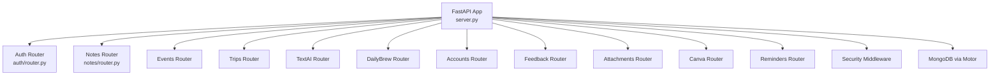
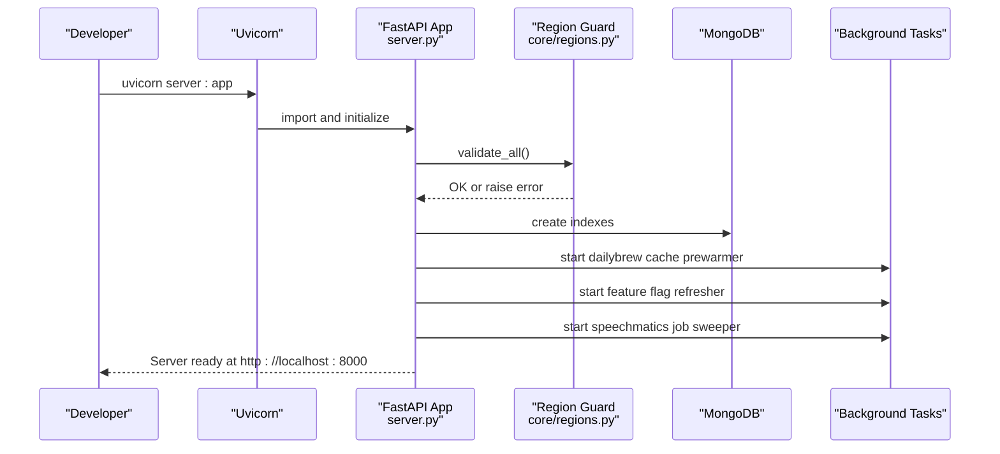
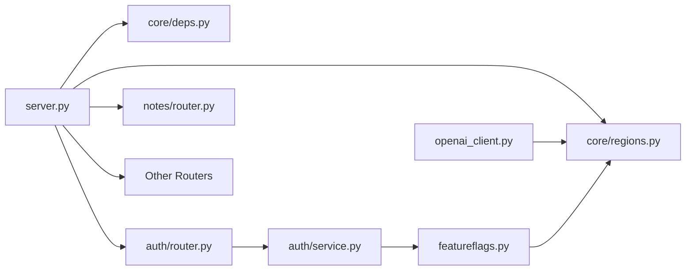

# Getting Started

<cite>
**Referenced Files in This Document**
- [server.py](file://server.py)
- [requirements.txt](file://requirements.txt)
- [Procfile](file://Procfile)
- [core/regions.py](file://core/regions.py)
- [auth/service.py](file://auth/service.py)
- [openai_client.py](file://openai_client.py)
- [featureflags.py](file://featureflags.py)
- [auth/router.py](file://auth/router.py)
- [notes/router.py](file://notes/router.py)
</cite>

## Table of Contents
1. Introduction
2. Project Structure
3. Core Components
4. Architecture Overview
5. Detailed Component Analysis
6. Dependency Analysis
7. Performance Considerations
8. Troubleshooting Guide
9. Conclusion
10. Appendices

## Introduction
This guide helps new developers set up the Nueco Backend development environment quickly and confidently. You will:
- Prepare a Python environment and install dependencies
- Configure essential environment variables for local development
- Start the FastAPI server and access interactive API documentation
- Make your first authenticated request to a protected endpoint
- Troubleshoot common setup issues

The backend is built with FastAPI, uses MongoDB via Motor, and organizes features into modular domains such as auth, notes, events, trips, textai, dailybrew, accounts, feedback, attachments, canva, reminders, and security.

## Project Structure
At a high level:
- server.py is the application entry point that loads configuration, registers routers, sets up middleware, and starts background tasks
- Each feature lives in its own folder (for example, auth/, notes/, events/, trips/, textai/, dailybrew/, accounts/, feedback/, attachments/, canva/, reminders/)
- core/ contains shared utilities like dependency injection and region enforcement
- static/ serves policy pages and robots.txt
- tests/ contains basic test files
- Procfile defines how to run the app with Uvicorn

**Diagram sources**
- [server.py:175-214](file://server.py#L175-L214)
- [auth/router.py:20-20](file://auth/router.py#L20-L20)
- [notes/router.py:10-10](file://notes/router.py#L10-L10)

**Section sources**
- [server.py:1-214](file://server.py#L1-L214)
- [Procfile:1-2](file://Procfile#L1-L2)

## Core Components
- Application bootstrap and routing: server.py initializes FastAPI, loads .env, connects to MongoDB, includes all feature routers, configures CORS, enforces data residency, creates indexes, and starts background tasks
- Authentication: auth/router.py exposes signup/login endpoints; auth/service.py handles JWT tokens, sessions, and user operations
- Shared dependencies: core/deps.py provides get_current_user and get_db helpers used across routers
- Region enforcement: core/regions.py validates external service endpoints and regions at startup and on every call
- AI services: openai_client.py constructs an OpenAI client using configured base URL and key
- Feature flags: featureflags.py refreshes feature flags from PostHog and exposes toggles

**Section sources**
- [server.py:1-214](file://server.py#L1-L214)
- [auth/router.py:93-140](file://auth/router.py#L93-L140)
- [auth/service.py:24-33](file://auth/service.py#L24-L33)
- [core/regions.py:144-165](file://core/regions.py#L144-L165)
- [openai_client.py:15-23](file://openai_client.py#L15-L23)
- [featureflags.py:25-52](file://featureflags.py#L25-L52)

## Architecture Overview
The server bootstraps once per process:
- Loads environment variables from .env
- Validates data residency requirements before serving any traffic
- Connects to MongoDB and creates indexes
- Includes all feature routers under /api
- Starts background tasks (dailybrew cache prewarmer, feature flag refresher, speechmatics job sweeper)
- Serves static pages (privacy, terms, robots.txt) and staging APK download routes

**Diagram sources**
- [server.py:13-20](file://server.py#L13-L20)
- [server.py:338-341](file://server.py#L338-L341)
- [server.py:345-432](file://server.py#L345-L432)
- [server.py:435-459](file://server.py#L435-L459)
- [core/regions.py:144-165](file://core/regions.py#L144-L165)

## Detailed Component Analysis

### Environment Setup and Installation
- Use a recent Python version compatible with the project’s dependencies
- Create a virtual environment and activate it
- Install dependencies from requirements.txt
- Ensure you have a running MongoDB instance accessible via a connection string

Key references:
- Dependencies are listed in requirements.txt
- The app runs with Uvicorn as defined in Procfile
- server.py loads .env and requires MongoDB connection details

**Section sources**
- [requirements.txt:1-121](file://requirements.txt#L1-L121)
- [Procfile:1-2](file://Procfile#L1-L2)
- [server.py:13-18](file://server.py#L13-L18)

### Essential Environment Variables
Configure these variables in a .env file in the backend directory. The server loads this file at startup.

Required for startup:
- MONGO_URL: MongoDB connection string
- DB_NAME: Database name
- JWT_SECRET: Secret used to sign JWT access tokens

Required for data residency validation (all must be present and Australian-region compliant):
- OPENAI_BASE_URL and OPENAI_REGION
- SPEECHMATICS_BASE_URL and SPEECHMATICS_REGION
- EXPO_PUSH_SEND_URL, EXPO_PUSH_RECEIPTS_URL, and EXPO_PUSH_REGION
- RESEND_BASE_URL and RESEND_REGION
- AWS_REGION
- POSTHOG_HOST and POSTHOG_REGION
- CANVA_AUTHORIZE_URL, CANVA_TOKEN_URL, CANVA_API_BASE_URL, and CANVA_REGION
- MONGODB_REGION

Optional but commonly needed:
- OPENAI_API_KEY or EMERGENT_LLM_KEY: Required if using AI features
- POSTHOG_PROJECT_API_KEY: Required to fetch feature flags
- ALLOWED_ORIGINS: Comma-separated list of allowed CORS origins (default allows all when empty)

Important behaviors:
- On startup, server.py calls a region validator that checks all declared endpoints and regions; missing or non-Australian values abort boot
- Some modules read additional env vars at runtime (for example, OpenAI client reads keys and base URL)

References:
- server.py loads .env and reads MONGO_URL and DB_NAME
- core/regions.py enforces presence and correctness of all service endpoints and regions
- auth/service.py requires JWT_SECRET
- openai_client.py requires an OpenAI API key and uses a validated base URL
- featureflags.py uses POSTHOG_PROJECT_API_KEY and POSTHOG_HOST

**Section sources**
- [server.py:13-18](file://server.py#L13-L18)
- [server.py:320-330](file://server.py#L320-L330)
- [core/regions.py:58-77](file://core/regions.py#L58-L77)
- [core/regions.py:144-165](file://core/regions.py#L144-L165)
- [auth/service.py:24-28](file://auth/service.py#L24-L28)
- [openai_client.py:15-23](file://openai_client.py#L15-L23)
- [featureflags.py:11-14](file://featureflags.py#L11-L14)

### Quick Start: Run the Server Locally
Steps:
1. Create and activate a Python virtual environment
2. Install dependencies from requirements.txt
3. Create a .env file with the required variables listed above
4. Start the server with Uvicorn:
   - Option A: uvicorn server:app --host 0.0.0.0 --port 8000
   - Option B: use the Procfile command (web: uvicorn server:app --host 0.0.0.0 --port 8000)
5. Open http://localhost:8000/docs to view the interactive API documentation

Notes:
- The server automatically creates database indexes on startup
- Background tasks will start (dailybrew cache prewarmer, feature flag refresher, speechmatics job sweeper)

**Section sources**
- [Procfile:1-2](file://Procfile#L1-L2)
- [server.py:345-432](file://server.py#L345-L432)
- [server.py:435-459](file://server.py#L435-L459)

### First Authenticated Request
Use the interactive docs at /docs to try authentication and protected endpoints:

1. Sign up or log in:
   - POST /api/auth/signup to create a user
   - POST /api/auth/login to receive access_token and refresh_token
2. Access a protected endpoint:
   - For example, GET /api/notes with Authorization: Bearer <access_token>

References:
- Auth endpoints are defined in auth/router.py
- Protected endpoints use get_current_user dependency (for example, notes/router.py)

**Section sources**
- [auth/router.py:93-140](file://auth/router.py#L93-L140)
- [notes/router.py:17-40](file://notes/router.py#L17-L40)
- [core/deps.py:24-50](file://core/deps.py#L24-L50)

## Dependency Analysis
- server.py depends on:
  - core/regions.py for data residency validation
  - core/deps.py for shared dependencies
  - Feature routers (auth, notes, events, trips, textai, dailybrew, accounts, feedback, attachments, canva, reminders)
  - Background tasks (dailybrew, featureflags, textai transcription sweeper)
- auth/service.py depends on:
  - JWT library and bcrypt for token signing and password hashing
  - Email service functions (send verification/reset emails)
  - Feature flags module for user responses
- openai_client.py depends on:
  - core/regions.py for base URL resolution
  - Environment variables for API keys
- featureflags.py depends on:
  - core/regions.py for PostHog host
  - HTTP client to fetch flags periodically

**Diagram sources**
- [server.py:175-214](file://server.py#L175-L214)
- [auth/router.py:9-16](file://auth/router.py#L9-L16)
- [auth/service.py:15-18](file://auth/service.py#L15-L18)
- [openai_client.py:1-6](file://openai_client.py#L1-L6)
- [featureflags.py:1-8](file://featureflags.py#L1-L8)

**Section sources**
- [server.py:175-214](file://server.py#L175-L214)
- [auth/service.py:15-18](file://auth/service.py#L15-L18)
- [openai_client.py:1-23](file://openai_client.py#L1-L23)
- [featureflags.py:1-52](file://featureflags.py#L1-L52)

## Performance Considerations
- Database indexes are created at startup to optimize queries for notes, events, trips, push tokens, users, sessions, and other collections
- Background tasks run asynchronously to avoid blocking request handling
- Password hashing is offloaded to threads to prevent blocking the event loop during CPU-bound work
- CORS is configurable; restrict origins in production for security

**Section sources**
- [server.py:345-432](file://server.py#L345-L432)
- [server.py:435-459](file://server.py#L435-L459)
- [auth/service.py:50-61](file://auth/service.py#L50-L61)
- [server.py:320-330](file://server.py#L320-L330)

## Troubleshooting Guide
Common issues and resolutions:

- Missing MongoDB connection or database name:
  - Ensure MONGO_URL and DB_NAME are set in .env
  - Verify the MongoDB instance is reachable from your environment
  - Reference: [server.py:13-18](file://server.py#L13-L18)

- Data residency validation failure at startup:
  - All required endpoint and region variables must be set and valid
  - Non-Australian regions or malformed URLs will abort boot
  - Check each service’s endpoint and region variables
  - Reference: [core/regions.py:144-165](file://core/regions.py#L144-L165)

- JWT authentication errors:
  - JWT_SECRET must be set; otherwise, the auth service raises a configuration error
  - Requests to protected endpoints require Authorization: Bearer <token>
  - Reference: [auth/service.py:24-28](file://auth/service.py#L24-L28), [core/deps.py:24-50](file://core/deps.py#L24-L50)

- OpenAI/AI features not working:
  - Set OPENAI_API_KEY or EMERGENT_LLM_KEY
  - Ensure OPENAI_BASE_URL is configured and points to an Australian-region endpoint
  - Reference: [openai_client.py:15-23](file://openai_client.py#L15-L23)

- Feature flags not loading:
  - Set POSTHOG_PROJECT_API_KEY and POSTHOG_HOST
  - The server attempts to refresh flags on startup and periodically
  - Reference: [featureflags.py:11-14](file://featureflags.py#L11-L14), [featureflags.py:25-52](file://featureflags.py#L25-L52)

- CORS errors from frontend:
  - Configure ALLOWED_ORIGINS to include your frontend origin(s)
  - Reference: [server.py:320-330](file://server.py#L320-L330)

- Interactive docs not available:
  - Ensure the server started successfully and is listening on port 8000
  - Reference: [Procfile:1-2](file://Procfile#L1-L2)

**Section sources**
- [server.py:13-18](file://server.py#L13-L18)
- [core/regions.py:144-165](file://core/regions.py#L144-L165)
- [auth/service.py:24-28](file://auth/service.py#L24-L28)
- [openai_client.py:15-23](file://openai_client.py#L15-L23)
- [featureflags.py:11-14](file://featureflags.py#L11-L14)
- [featureflags.py:25-52](file://featureflags.py#L25-L52)
- [server.py:320-330](file://server.py#L320-L330)
- [Procfile:1-2](file://Procfile#L1-L2)

## Conclusion
You now have the essentials to set up, configure, and run the Nueco Backend locally. Use /docs to explore endpoints, authenticate via /api/auth endpoints, and call protected APIs with a bearer token. Keep environment variables aligned with the data residency requirements, and consult the troubleshooting section if you encounter startup or runtime issues.

## Appendices

### Minimal .env Template
Create a .env file in the backend directory with the following variables (fill in real values for your environment):

- MONGO_URL
- DB_NAME
- JWT_SECRET
- OPENAI_BASE_URL
- OPENAI_REGION
- SPEECHMATICS_BASE_URL
- SPEECHMATICS_REGION
- EXPO_PUSH_SEND_URL
- EXPO_PUSH_RECEIPTS_URL
- EXPO_PUSH_REGION
- RESEND_BASE_URL
- RESEND_REGION
- AWS_REGION
- POSTHOG_HOST
- POSTHOG_REGION
- CANVA_AUTHORIZE_URL
- CANVA_TOKEN_URL
- CANVA_API_BASE_URL
- CANVA_REGION
- OPENAI_API_KEY or EMERGENT_LLM_KEY
- POSTHOG_PROJECT_API_KEY
- ALLOWED_ORIGINS (optional)

References:
- server.py loads .env and reads MONGO_URL and DB_NAME
- core/regions.py enforces presence and correctness of all service endpoints and regions
- auth/service.py requires JWT_SECRET
- openai_client.py requires an OpenAI API key and uses a validated base URL
- featureflags.py uses POSTHOG_PROJECT_API_KEY and POSTHOG_HOST

**Section sources**
- [server.py:13-18](file://server.py#L13-L18)
- [core/regions.py:58-77](file://core/regions.py#L58-L77)
- [auth/service.py:24-28](file://auth/service.py#L24-L28)
- [openai_client.py:15-23](file://openai_client.py#L15-L23)
- [featureflags.py:11-14](file://featureflags.py#L11-L14)