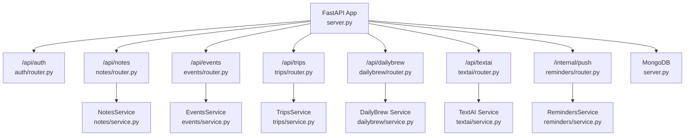
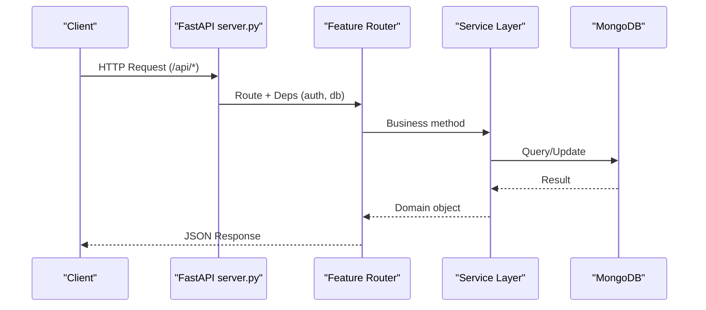
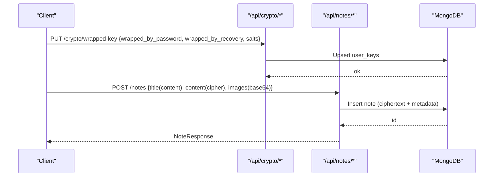
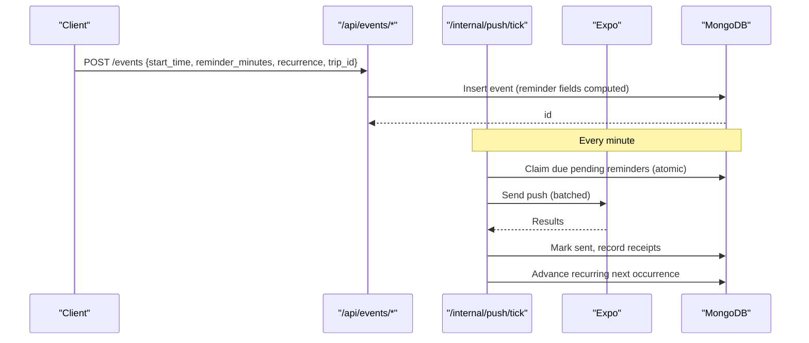
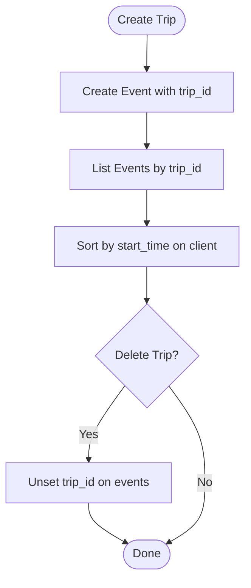
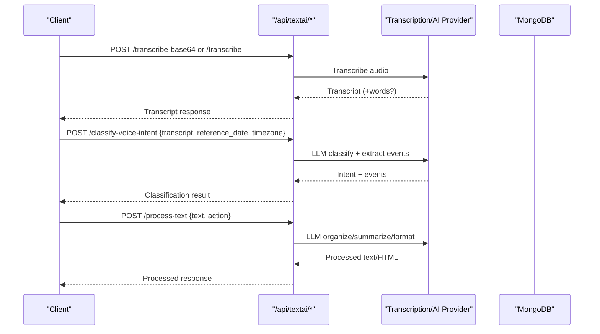
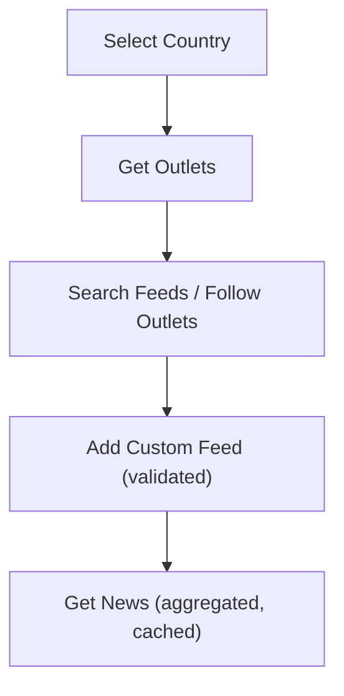
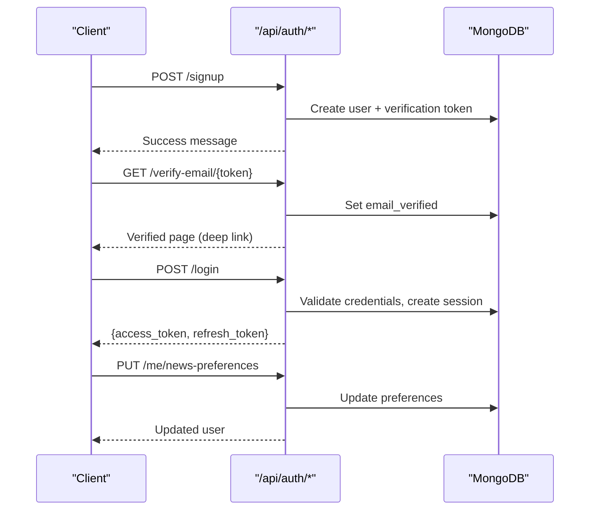
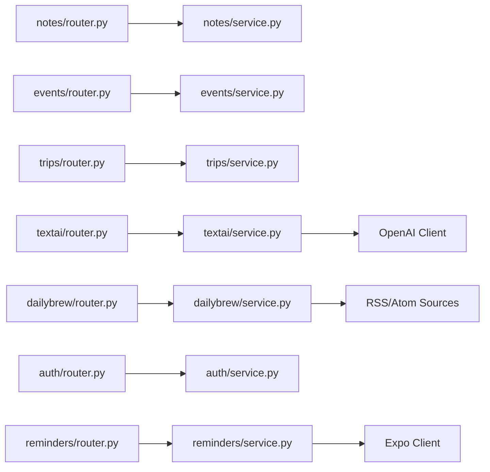

# Key Features

<cite>
**Referenced Files in This Document**
- [server.py](file://server.py)
- [notes/router.py](file://notes/router.py)
- [notes/service.py](file://notes/service.py)
- [events/router.py](file://events/router.py)
- [events/service.py](file://events/service.py)
- [trips/router.py](file://trips/router.py)
- [trips/service.py](file://trips/service.py)
- [textai/router.py](file://textai/router.py)
- [textai/service.py](file://textai/service.py)
- [dailybrew/router.py](file://dailybrew/router.py)
- [dailybrew/service.py](file://dailybrew/service.py)
- [auth/router.py](file://auth/router.py)
- [auth/service.py](file://auth/service.py)
- [reminders/router.py](file://reminders/router.py)
- [reminders/service.py](file://reminders/service.py)
</cite>

## Table of Contents
1. Introduction
2. Project Structure
3. Core Components
4. Architecture Overview
5. Detailed Component Analysis
6. Dependency Analysis
7. Performance Considerations
8. Troubleshooting Guide
9. Conclusion

## Introduction
This document explains the key features of the Nueco Backend platform with a focus on security, productivity, and personalization:
- End-to-end encrypted notes with server-side wrapped key escrow
- Event management with calendar support, reminders, and push notifications
- Trip planning with timeline synchronization and event linking
- AI-powered text processing including audio transcription, summarization, and analysis
- Personalized news aggregation with country-specific content and custom feeds
- Account management with JWT-based authentication, email verification, and profile management

Each section includes practical workflow examples and integration points to help you understand how clients interact with the backend.

## Project Structure
The backend is organized by feature modules under FastAPI routers that delegate business logic to service layers. The application server wires routers, sets up database connections, indexes, background tasks, and shared middleware.

**Diagram sources**
- [server.py:175-214](file://server.py#L175-L214)
- [notes/router.py:10-100](file://notes/router.py#L10-L100)
- [events/router.py:16-111](file://events/router.py#L16-L111)
- [trips/router.py:16-96](file://trips/router.py#L16-L96)
- [dailybrew/router.py:12-102](file://dailybrew/router.py#L12-L102)
- [textai/router.py:51-163](file://textai/router.py#L51-L163)
- [reminders/router.py:9-29](file://reminders/router.py#L9-L29)

**Section sources**
- [server.py:1-214](file://server.py#L1-L214)

## Core Components
- Notes: Create, list, update, delete, pin; payload validation; linked events; attachments cleanup.
- Events: CRUD, recurrence, reminder scheduling fields, batch retrieval, trip linkage.
- Trips: Grouping events into trips; cascade unlink on delete.
- TextAI: Audio transcription (base64 or upload), text organize/summarize/smart format, voice intent classification.
- Daily Brew: Country outlets, search, custom feeds, personalized headlines.
- Auth: Signup/login, email verification, password reset/change, refresh/logout, profile updates, sync status.
- Reminders: Cron-driven tick to claim due reminders, send via Expo, track receipts, advance recurring.

**Section sources**
- [notes/service.py:79-226](file://notes/service.py#L79-L226)
- [events/service.py:163-312](file://events/service.py#L163-L312)
- [trips/service.py:47-102](file://trips/service.py#L47-L102)
- [textai/service.py:112-315](file://textai/service.py#L112-L315)
- [dailybrew/service.py:227-356](file://dailybrew/service.py#L227-L356)
- [auth/service.py:107-506](file://auth/service.py#L107-L506)
- [reminders/service.py:37-215](file://reminders/service.py#L37-L215)

## Architecture Overview
The API surface is centralized in server.py, which mounts routers per domain. Each router validates requests and delegates to a service layer for business logic and persistence. Background tasks initialize indexes, prewarm caches, and run periodic jobs.

**Diagram sources**
- [server.py:175-214](file://server.py#L175-L214)
- [notes/router.py:17-100](file://notes/router.py#L17-L100)
- [events/router.py:23-111](file://events/router.py#L23-L111)
- [trips/router.py:23-96](file://trips/router.py#L23-L96)
- [dailybrew/router.py:15-102](file://dailybrew/router.py#L15-L102)
- [textai/router.py:75-163](file://textai/router.py#L75-L163)
- [reminders/router.py:19-29](file://reminders/router.py#L19-L29)

## Detailed Component Analysis

### End-to-End Encrypted Notes with Wrapped Key Escrow
- Client encrypts note content and metadata before sending to the server.
- Server stores only ciphertext and metadata (e.g., enc_version).
- Wrapped Data Encryption Keys (DEK) are stored server-side as opaque blobs derived from user password/recovery codes. The server never sees plaintext keys or note content.
- Feature usage events are recorded with size-capped metadata.

Key endpoints and behaviors:
- Store/get wrapped keys: PUT/GET /api/crypto/wrapped-key
- Record feature events: POST /api/events/feature
- Notes CRUD: /api/notes/*

Practical workflow example:
1. Client generates DEK and wraps it with two KEKs (password-derived and recovery-code-derived).
2. Client calls PUT /api/crypto/wrapped-key to store wrapped blobs and salts.
3. Client creates/updates notes with encrypted title/content/images; server validates payload sizes and persists metadata.
4. Client retrieves notes; server returns ciphertext and metadata; client decrypts locally.

**Diagram sources**
- [server.py:80-123](file://server.py#L80-L123)
- [notes/router.py:17-100](file://notes/router.py#L17-L100)
- [notes/service.py:83-111](file://notes/service.py#L83-L111)

**Section sources**
- [server.py:46-123](file://server.py#L46-L123)
- [notes/router.py:17-100](file://notes/router.py#L17-L100)
- [notes/service.py:30-111](file://notes/service.py#L30-L111)

### Event Management with Calendar, Recurrence, and Reminders
- Events support titles, descriptions, locations, time ranges, all-day flags, recurrence rules, timezone handling, and trip linkage.
- Reminder scheduling computes fire times and statuses; cron tick claims due reminders, sends push notifications, tracks receipts, and advances recurring events.

Key endpoints and behaviors:
- Events CRUD: /api/events/*
- Batch retrieval: POST /api/events/batch
- Push notification tick: POST /internal/push/tick (secret-gated)
- Receipt resolution: POST /internal/push/receipts (secret-gated)

Practical workflow example:
1. Client creates an event with optional reminder_minutes and recurrence.
2. Server computes reminder_fire_at and reminder_status; stores event with trip_id if provided.
3. Cron triggers /internal/push/tick; service claims due reminders atomically, builds messages, sends via Expo, marks sent, and advances recurring events.
4. Receipts are polled later to mark tokens inactive when devices are unregistered.

**Diagram sources**
- [events/router.py:23-111](file://events/router.py#L23-L111)
- [events/service.py:39-123](file://events/service.py#L39-L123)
- [reminders/router.py:19-29](file://reminders/router.py#L19-L29)
- [reminders/service.py:52-177](file://reminders/service.py#L52-L177)

**Section sources**
- [events/router.py:23-111](file://events/router.py#L23-L111)
- [events/service.py:163-312](file://events/service.py#L163-L312)
- [reminders/router.py:19-29](file://reminders/router.py#L19-L29)
- [reminders/service.py:37-215](file://reminders/service.py#L37-L215)

### Trip Planning with Timeline Synchronization and Event Linking
- Trips group multiple events; each event can reference a trip_id.
- Deleting a trip cascades by unlinking events (setting trip_id to null).
- The client composes the trip timeline by sorting linked events by start_time.

Key endpoints and behaviors:
- Trips CRUD: /api/trips/*
- Events link to trips via trip_id field.

Practical workflow example:
1. Client creates a trip; server stores trip metadata.
2. Client creates events with trip_id; server indexes trip_id for efficient lookups.
3. Client lists events filtered by trip_id to build a timeline view.
4. If trip is deleted, server unlinks all associated events.

**Diagram sources**
- [trips/router.py:23-96](file://trips/router.py#L23-L96)
- [trips/service.py:51-102](file://trips/service.py#L51-L102)
- [events/service.py:167-199](file://events/service.py#L167-L199)

**Section sources**
- [trips/router.py:23-96](file://trips/router.py#L23-L96)
- [trips/service.py:47-102](file://trips/service.py#L47-L102)
- [events/service.py:167-199](file://events/service.py#L167-L199)

### AI-Powered Text Processing and Audio Transcription
- Audio transcription supports base64 or file upload; providers may include word-level timestamps for tap-to-seek.
- Text processing supports organize, summarize, and smart_format (auto-classify and restructure into HTML).
- Voice intent classification detects dictation vs. single/multiple events vs. itinerary and extracts structured events.

Key endpoints and behaviors:
- Transcribe base64: POST /api/transcribe-base64
- Transcribe file: POST /api/transcribe
- Process text: POST /api/process-text
- Classify voice intent: POST /api/classify-voice-intent
- Quotas enforced with 429 and Retry-After headers.

Practical workflow example:
1. Client uploads audio or base64 to transcribe; server enforces quotas, calls provider, returns transcript with optional words.
2. For scheduling intents, client calls classify-voice-intent with transcript and context; receives structured events or itinerary suggestion.
3. For text operations, client sends text and action; server returns processed text or HTML.

**Diagram sources**
- [textai/router.py:75-163](file://textai/router.py#L75-L163)
- [textai/service.py:112-315](file://textai/service.py#L112-L315)

**Section sources**
- [textai/router.py:75-163](file://textai/router.py#L75-L163)
- [textai/service.py:112-315](file://textai/service.py#L112-L315)

### Personalized News Aggregation (Daily Brew)
- Country-specific outlet catalog and topic-focused pool.
- Custom RSS/Atom feed support validated live before saving.
- Headlines aggregated from followed outlets with caching and fair distribution.

Key endpoints and behaviors:
- Get country outlets: GET /api/dailybrew/news-sources?country=...
- Search feeds: GET /api/dailybrew/search-feeds?q=...
- Resolve outlets by ids: GET /api/dailybrew/outlets?ids=...
- Add custom feed: POST /api/dailybrew/custom-feed
- Get personalized news: GET /api/dailybrew/news

Practical workflow example:
1. Client selects a country; server returns available outlets.
2. Client searches for topics; follows selected outlets or adds a custom feed URL.
3. Client fetches news; server aggregates top items from followed outlets with caching and balanced distribution.

**Diagram sources**
- [dailybrew/router.py:15-102](file://dailybrew/router.py#L15-L102)
- [dailybrew/service.py:134-356](file://dailybrew/service.py#L134-L356)

**Section sources**
- [dailybrew/router.py:15-102](file://dailybrew/router.py#L15-L102)
- [dailybrew/service.py:227-356](file://dailybrew/service.py#L227-L356)

### Account Management with JWT Authentication and Profile
- Secure signup/login with rate limiting, email verification, password reset/change, token refresh/logout.
- Profile updates include name (supports E2EE Stage 5) and news preferences.
- Sync status endpoint provides lightweight client sync state.

Key endpoints and behaviors:
- Auth: /api/auth/signup, /login, /verify-email/{token}, /forgot-password, /reset-password, /resend-verification, /delete-unverified, /change-password, /refresh, /logout
- Profile: /api/auth/me (GET/PUT), /api/auth/me/news-preferences
- Sync: /api/auth/sync-status

Practical workflow example:
1. User signs up; verification email sent; user verifies via web page deep-linking into app.
2. User logs in; receives access and refresh tokens; subsequent requests use access token.
3. User updates name or news preferences; server persists changes.
4. Client periodically checks sync status to reconcile local state.

**Diagram sources**
- [auth/router.py:93-366](file://auth/router.py#L93-L366)
- [auth/service.py:107-506](file://auth/service.py#L107-L506)

**Section sources**
- [auth/router.py:93-366](file://auth/router.py#L93-L366)
- [auth/service.py:107-506](file://auth/service.py#L107-L506)

## Dependency Analysis
- Routers depend on services for business logic and schemas for request/response models.
- Services depend on MongoDB via Motor async client and external providers (OpenAI, Expo, RSS/Atom sources).
- Shared dependencies include core utilities (rate limits, region checks, repository scoping) and security guards (SSRF protection).

**Diagram sources**
- [notes/router.py:1-100](file://notes/router.py#L1-L100)
- [events/router.py:1-111](file://events/router.py#L1-L111)
- [trips/router.py:1-96](file://trips/router.py#L1-L96)
- [textai/router.py:1-163](file://textai/router.py#L1-L163)
- [dailybrew/router.py:1-102](file://dailybrew/router.py#L1-L102)
- [auth/router.py:1-366](file://auth/router.py#L1-L366)
- [reminders/router.py:1-29](file://reminders/router.py#L1-L29)

**Section sources**
- [server.py:175-214](file://server.py#L175-L214)

## Performance Considerations
- Database indexes are created at startup to optimize queries across notes, events, trips, push tokens, sessions, and feature events.
- Pagination uses deterministic sort with tiebreakers to avoid missing rows during skip/limit.
- Payload size validation prevents oversized documents and protects memory/Mongo limits.
- Daily Brew uses in-memory cache with TTL and background prewarmer to reduce cold fetch latency.
- AI quotas enforce rate limiting with 429 responses and Retry-After headers to protect downstream providers.
- Reminder tick caps claims per cycle and batches Expo calls to respect provider limits.

[No sources needed since this section provides general guidance]

## Troubleshooting Guide
Common issues and resolutions:
- Too many requests on AI endpoints: Check quota and retry after the indicated seconds.
- Verification link failures: Ensure token not expired; resend verification if needed.
- Push reminders not received: Verify device tokens active; check receipt resolution; ensure cron tick secret is configured.
- Notes not appearing: Confirm pagination parameters and index coverage; verify user scoping.
- News not loading: Validate custom feed URLs; check SSRF guard errors; confirm outlet IDs exist.

**Section sources**
- [textai/router.py:28-49](file://textai/router.py#L28-L49)
- [auth/router.py:142-220](file://auth/router.py#L142-L220)
- [reminders/router.py:12-29](file://reminders/router.py#L12-L29)
- [dailybrew/service.py:134-158](file://dailybrew/service.py#L134-L158)

## Conclusion
The Nueco Backend delivers a secure, scalable, and feature-rich platform:
- Strong privacy with end-to-end encryption and minimal server-side secrets exposure
- Robust event and reminder systems with reliable delivery and recurrence handling
- Flexible trip planning with clear event linkage and timeline construction
- Powerful AI capabilities for transcription, organization, summarization, and intent classification
- Personalized news with curated and custom feeds
- Secure account management with JWT, verification, and profile controls

These components integrate through well-defined routers and services, backed by optimized database indexing and background tasks for reliability and performance.