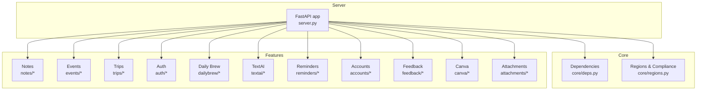
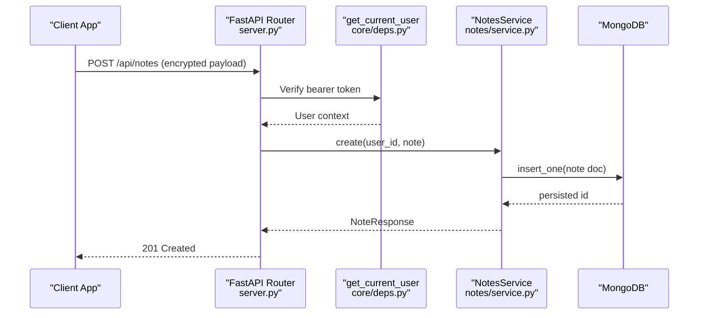
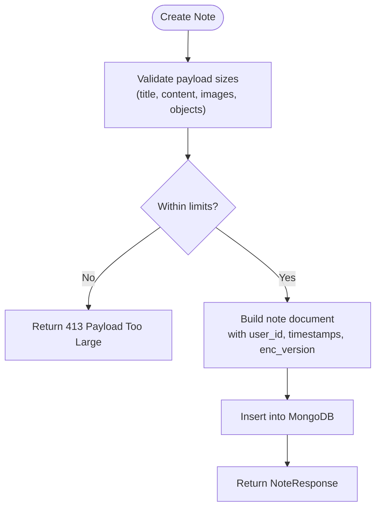
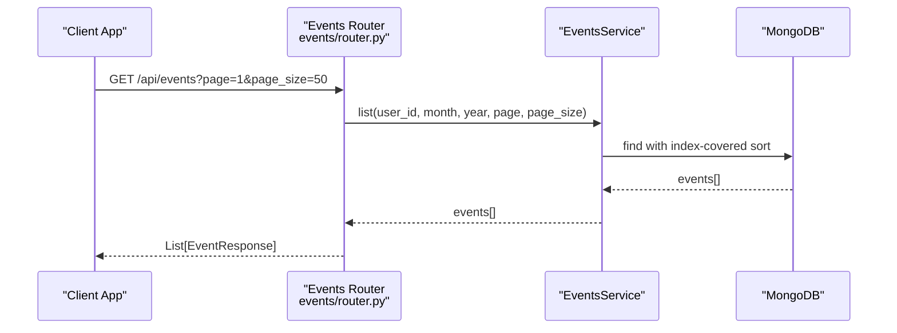
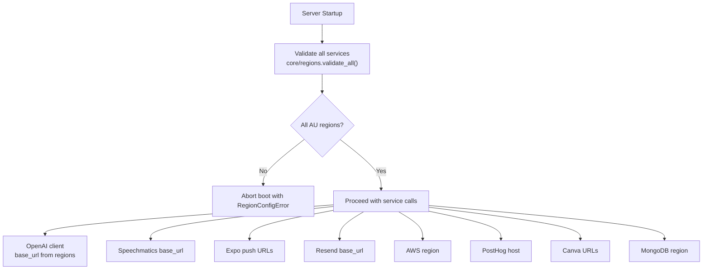
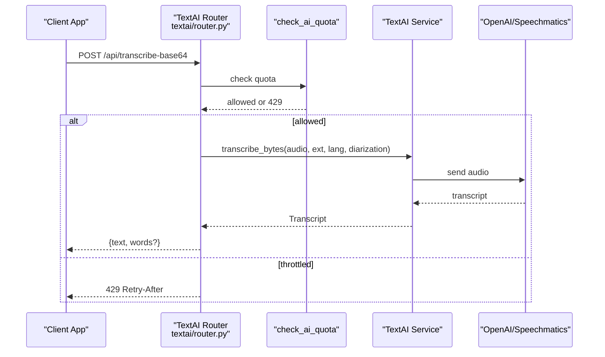
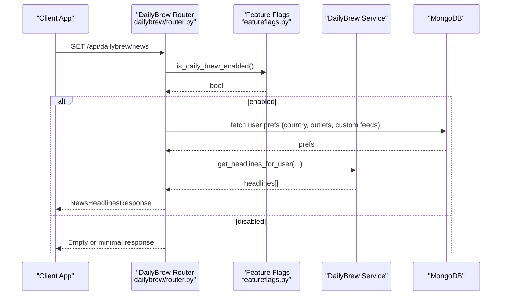
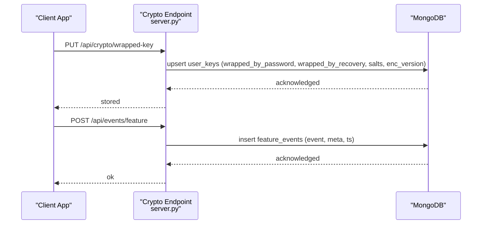
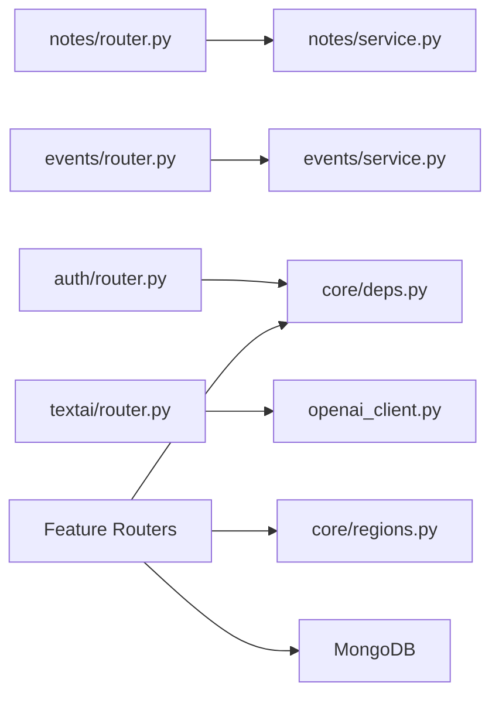

# Project Overview

<cite>
**Referenced Files in This Document**
- [server.py](file://server.py)
- [requirements.txt](file://requirements.txt)
- [featureflags.py](file://featureflags.py)
- [openai_client.py](file://openai_client.py)
- [core/deps.py](file://core/deps.py)
- [core/regions.py](file://core/regions.py)
- [notes/router.py](file://notes/router.py)
- [notes/service.py](file://notes/service.py)
- [events/router.py](file://events/router.py)
- [auth/router.py](file://auth/router.py)
- [dailybrew/router.py](file://dailybrew/router.py)
- [textai/router.py](file://textai/router.py)
</cite>

## Table of Contents
1. [Introduction](#introduction)
2. [Project Structure](#project-structure)
3. [Core Components](#core-components)
4. [Architecture Overview](#architecture-overview)
5. [Detailed Component Analysis](#detailed-component-analysis)
6. [Dependency Analysis](#dependency-analysis)
7. [Performance Considerations](#performance-considerations)
8. [Troubleshooting Guide](#troubleshooting-guide)
9. [Conclusion](#conclusion)

## Introduction
Nueco Backend is a FastAPI-based REST API that powers an end-to-end encrypted (E2EE) note-taking and event management platform with additional capabilities for trip planning, AI-powered text processing, and personalized news delivery. The service stores only opaque wrapped keys and metadata-only feature events; it never receives plaintext notes or unwrapped encryption keys. It enforces data residency compliance by validating all external-service endpoints and region declarations at startup and rejecting any non-Australian-region configuration.

Key principles:
- Modular monolith design: each feature lives in its own directory with router, schemas, and service layers.
- Service layer pattern: routers handle HTTP concerns while services encapsulate business logic and persistence.
- Feature-based organization: features like notes, events, trips, dailybrew, textai, reminders, accounts, feedback, canva, and attachments are isolated modules.
- E2EE model: clients encrypt content before sending to the server; the server stores ciphertext and metadata only.
- Data residency compliance: all outbound integrations must be declared as Australian-region endpoints; boot fails if not configured correctly.

Conceptual overview for beginners:
- End-to-end encryption means your notes are encrypted on your device using a key derived from your password or recovery code. Only you hold the unwrapped key. The server stores “wrapped keys” (encrypted blobs) and never sees your note content.
- Feature events are small, metadata-only usage signals sent to the server for analytics without containing note content.

Technical overview for experienced developers:
- Async-first architecture using FastAPI and Motor async MongoDB client.
- Centralized dependency injection for current user resolution and database access.
- Strict region validation via a single configuration module that gates all external service calls.
- Quota-aware AI endpoints with rate limiting and provider abstraction through a residency-checked base URL.

Practical example: creating a note with encryption
- Client derives a Data Encryption Key (DEK), encrypts the note locally, and sends ciphertext to the notes endpoint.
- Client also uploads wrapped-key blobs (wrapped by password-derived and recovery-code-derived keys) to the crypto escrow endpoint.
- Server persists the encrypted note and metadata only; it cannot read the content.

**Section sources**
- [server.py:46-123](file://server.py#L46-L123)
- [core/regions.py:1-19](file://core/regions.py#L1-L19)
- [notes/service.py:30-51](file://notes/service.py#L30-L51)

## Project Structure
The backend follows a feature-based layout under a modular monolith:
- Core infrastructure: server entrypoint, dependencies, regions enforcement, repository helpers, and rate limiting.
- Features: notes, events, trips, reminders, accounts, feedback, canva, dailybrew, textai, attachments, auth.
- Shared utilities: OpenAI client wrapper, feature flags, static assets, scripts.



**Diagram sources**
- [server.py:175-214](file://server.py#L175-L214)

**Section sources**
- [server.py:1-214](file://server.py#L1-L214)

## Core Components
- FastAPI application and routing: central router mounts feature routers under /api.
- Authentication and authorization: Bearer token verification via AuthService; get_current_user dependency resolves authenticated users.
- Data residency enforcement: startup hook validates all external-service endpoints and regions against an Australian allowlist.
- Database integration: Motor async client connects to MongoDB; indexes created at startup for performance.
- Feature flags: background refresh of remote flags used by features like Daily Brew.
- AI integration: residency-checked OpenAI client and quota-aware endpoints for transcription and text processing.

**Section sources**
- [server.py:16-214](file://server.py#L16-L214)
- [core/deps.py:15-51](file://core/deps.py#L15-L51)
- [core/regions.py:144-165](file://core/regions.py#L144-L165)
- [featureflags.py:25-53](file://featureflags.py#L25-L53)
- [openai_client.py:15-24](file://openai_client.py#L15-L24)

## Architecture Overview
The system is organized around a central FastAPI application that delegates feature-specific routes to modular routers. Each router depends on shared dependencies for authentication and database access, while business logic resides in feature services. External integrations are gated by a centralized region validator to ensure data residency compliance.



**Diagram sources**
- [notes/router.py:17-28](file://notes/router.py#L17-L28)
- [notes/service.py:83-111](file://notes/service.py#L83-L111)
- [core/deps.py:24-51](file://core/deps.py#L24-L51)

## Detailed Component Analysis

### Authentication and Authorization
- Bearer token verification occurs via get_current_user, which uses AuthService to validate tokens and fetch user documents.
- Rate limiting protects signup, login, and password reset endpoints to mitigate abuse.
- Sessions and devices are managed in MongoDB with appropriate indexes and TTL policies.

```mermaid
sequenceDiagram
participant Client as "Client App"
participant AuthRouter as "Auth Router<br/>auth/router.py"
participant Deps as "get_current_user<br/>core/deps.py"
participant Service as "AuthService"
participant DB as "MongoDB"
Client->>AuthRouter : POST /api/auth/login
AuthRouter->>Service : login(email, password, device, platform)
Service->>DB : verify credentials, create session
DB-->>Service : user + tokens
Service-->>AuthRouter : {access_token, refresh_token}
AuthRouter-->>Client : AuthResponse
Note : Subsequent requests include Authorization : Bearer <token>
Client->>Deps : Depends(get_current_user)
Deps->>Service : verify_access_token(token)
Service-->>Deps : user_id
Deps-->>Client : user context
```

**Diagram sources**
- [auth/router.py:115-140](file://auth/router.py#L115-L140)
- [core/deps.py:24-51](file://core/deps.py#L24-L51)

**Section sources**
- [auth/router.py:22-84](file://auth/router.py#L22-L84)
- [auth/router.py:115-140](file://auth/router.py#L115-L140)
- [core/deps.py:24-51](file://core/deps.py#L24-L51)

### Notes Feature
- Routers expose CRUD endpoints for notes with pagination and pin toggling.
- Services enforce payload size limits considering ciphertext expansion and store only encrypted content and metadata.
- Dual-write compatibility maintains legacy linked_event_id alongside new linked_event_ids for backward compatibility.



**Diagram sources**
- [notes/service.py:30-51](file://notes/service.py#L30-L51)
- [notes/service.py:83-111](file://notes/service.py#L83-L111)

**Section sources**
- [notes/router.py:17-100](file://notes/router.py#L17-L100)
- [notes/service.py:83-111](file://notes/service.py#L83-L111)
- [notes/service.py:113-148](file://notes/service.py#L113-L148)

### Events Feature
- Routers provide paginated listing, batch retrieval, and full CRUD operations.
- Services enforce payload caps and manage reminder scheduling via partial indexes for pending events.



**Diagram sources**
- [events/router.py:37-53](file://events/router.py#L37-L53)

**Section sources**
- [events/router.py:23-111](file://events/router.py#L23-L111)

### Data Residency and External Integrations
- All outbound services must declare endpoints and regions via environment variables; boot fails if any are missing or non-Australian.
- Accessors re-validate regions on every call to prevent bypassing the gate.
- OpenAI client uses a residency-checked base URL to ensure LLM calls stay within allowed regions.



**Diagram sources**
- [core/regions.py:144-165](file://core/regions.py#L144-L165)
- [openai_client.py:15-24](file://openai_client.py#L15-L24)

**Section sources**
- [core/regions.py:1-19](file://core/regions.py#L1-L19)
- [core/regions.py:144-165](file://core/regions.py#L144-L165)
- [openai_client.py:15-24](file://openai_client.py#L15-L24)

### AI-Powered Text Processing and Transcription
- Quota-aware endpoints enforce per-user and global limits before invoking providers.
- Transcription supports both file upload and base64 payloads; transcripts are returned with optional word-level timestamps when available.
- Text processing supports organize, summarize, and voice-intent classification actions.



**Diagram sources**
- [textai/router.py:28-49](file://textai/router.py#L28-L49)
- [textai/router.py:75-103](file://textai/router.py#L75-L103)

**Section sources**
- [textai/router.py:28-49](file://textai/router.py#L28-L49)
- [textai/router.py:75-103](file://textai/router.py#L75-L103)
- [textai/router.py:136-163](file://textai/router.py#L136-L163)

### Personalized News Delivery (Daily Brew)
- Provides curated news sources, search suggestions, custom feed creation, and headline aggregation based on user preferences.
- Feature flag gating ensures Daily Brew availability is resolved server-side and fail-closed until refreshed.



**Diagram sources**
- [dailybrew/router.py:91-102](file://dailybrew/router.py#L91-L102)
- [featureflags.py:25-53](file://featureflags.py#L25-L53)

**Section sources**
- [dailybrew/router.py:15-102](file://dailybrew/router.py#L15-L102)
- [featureflags.py:25-53](file://featureflags.py#L25-L53)

### E2EE Key Escrow and Feature Events
- Wrapped keys are stored as opaque blobs; server never sees unwrapped keys or note content.
- Feature events record metadata-only usage signals with strict size limits to prevent accidental content leakage.



**Diagram sources**
- [server.py:80-123](file://server.py#L80-L123)

**Section sources**
- [server.py:46-123](file://server.py#L46-L123)

## Dependency Analysis
- Routers depend on core dependencies for authentication and database access, decoupling features from auth implementation details.
- Services encapsulate business logic and raise framework-agnostic exceptions; routers translate them to HTTP responses.
- Regions module centralizes external service configuration and compliance checks, preventing direct env reads in feature code.
- OpenAI client abstracts provider configuration with residency-checked base URL.



**Diagram sources**
- [notes/router.py:1-10](file://notes/router.py#L1-L10)
- [events/router.py:1-15](file://events/router.py#L1-L15)
- [auth/router.py:1-20](file://auth/router.py#L1-L20)
- [textai/router.py:1-24](file://textai/router.py#L1-L24)
- [core/deps.py:15-51](file://core/deps.py#L15-L51)
- [core/regions.py:184-230](file://core/regions.py#L184-L230)
- [openai_client.py:15-24](file://openai_client.py#L15-L24)

**Section sources**
- [core/deps.py:15-51](file://core/deps.py#L15-L51)
- [core/regions.py:184-230](file://core/regions.py#L184-L230)
- [openai_client.py:15-24](file://openai_client.py#L15-L24)

## Performance Considerations
- Indexes are created at startup to cover common queries and sorts, avoiding blocking in-memory sorts on large datasets.
- Pagination parameters are enforced to limit response sizes and reduce memory pressure.
- Quotas protect AI endpoints from overload and guide clients to back off gracefully.
- Partial indexes optimize reminder scheduling by focusing on pending events.

[No sources needed since this section provides general guidance]

## Troubleshooting Guide
Common issues and where to look:
- Authentication failures: verify bearer token format and session validity; check get_current_user flow.
- Data residency errors: boot failures indicate missing or non-Australian region declarations; inspect region validation logs.
- AI quota exceeded: 429 responses include Retry-After headers; adjust client retry behavior.
- Note payload too large: 413 responses indicate oversized ciphertext; review client-side encryption and size limits.

**Section sources**
- [core/deps.py:24-51](file://core/deps.py#L24-L51)
- [core/regions.py:144-165](file://core/regions.py#L144-L165)
- [textai/router.py:28-49](file://textai/router.py#L28-L49)
- [notes/service.py:30-51](file://notes/service.py#L30-L51)

## Conclusion
Nueco Backend implements a secure, modular monolith built on FastAPI with clear separation of concerns across routers, services, and shared infrastructure. Its E2EE model ensures the server never sees plaintext notes, while data residency compliance guarantees all external integrations remain within approved regions. The architecture supports scalable async patterns, robust indexing, and quota-aware AI services, enabling reliable note-taking, event management, trip planning, AI-powered text processing, and personalized news delivery.

[No sources needed since this section summarizes without analyzing specific files]