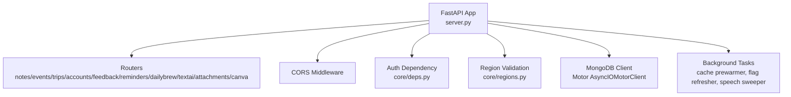
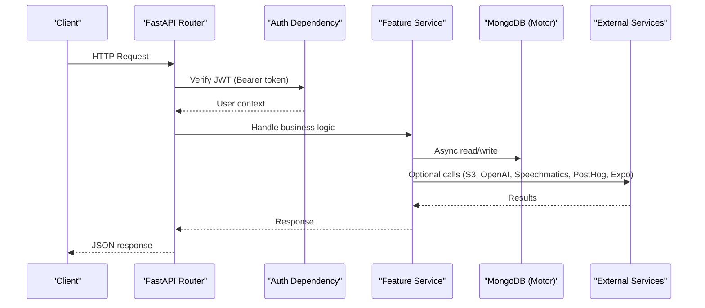
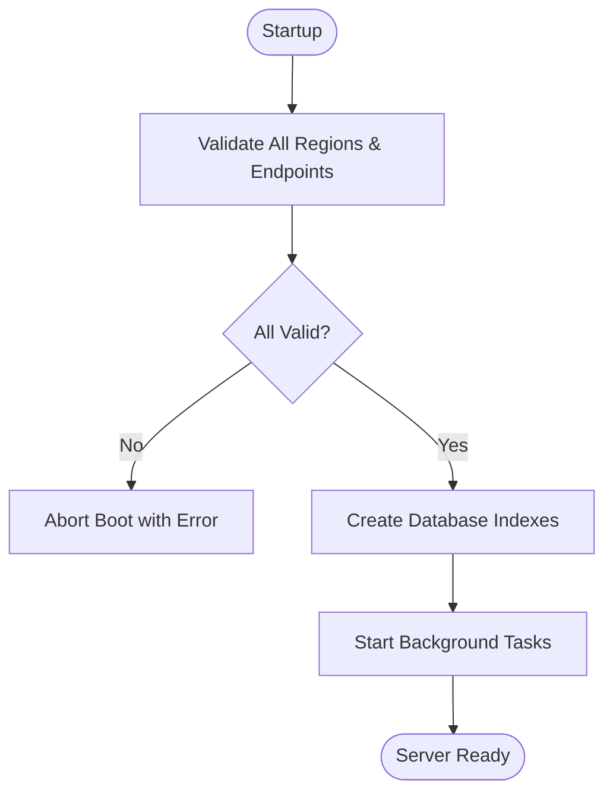
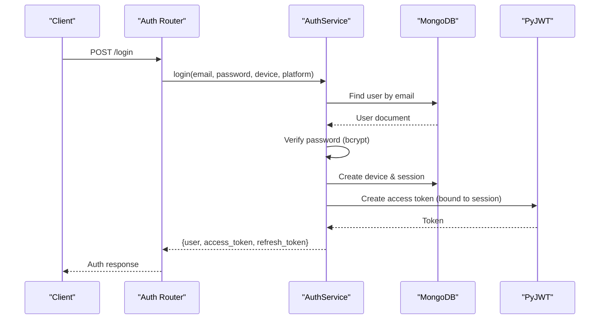
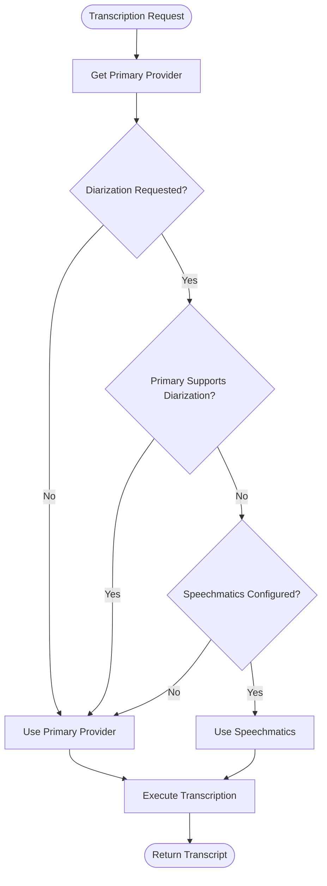
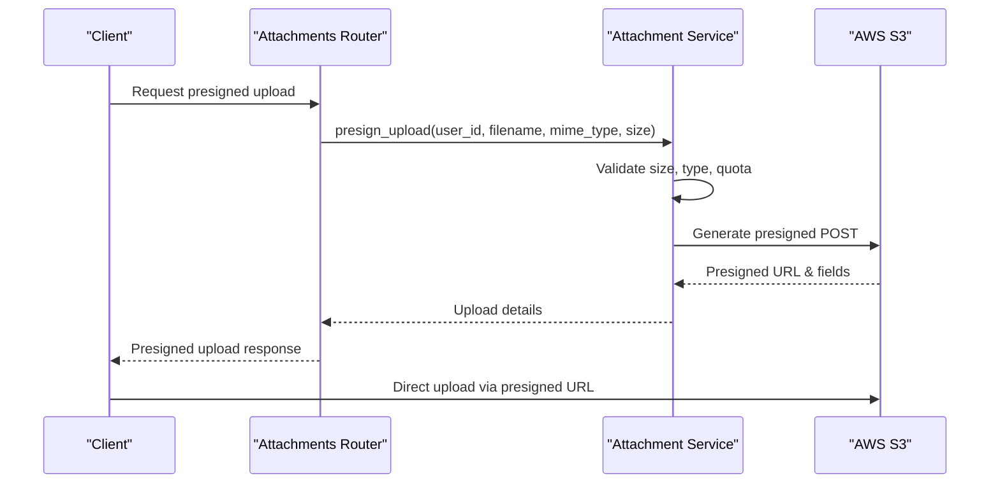
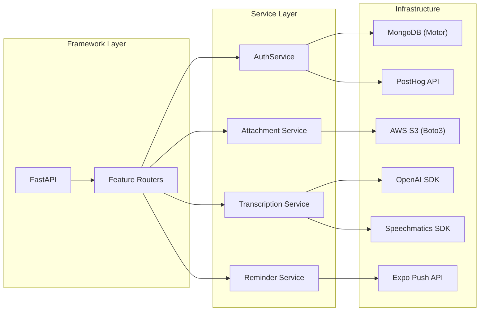

# Technology Stack

<cite>
**Referenced Files in This Document**
- [requirements.txt](file://requirements.txt)
- [server.py](file://server.py)
- [core/deps.py](file://core/deps.py)
- [core/regions.py](file://core/regions.py)
- [openai_client.py](file://openai_client.py)
- [featureflags.py](file://featureflags.py)
- [auth/service.py](file://auth/service.py)
- [textai/transcription.py](file://textai/transcription.py)
- [attachments/service.py](file://attachments/service.py)
- [reminders/expo_client.py](file://reminders/expo_client.py)
- [dailybrew/service.py](file://dailybrew/service.py)
</cite>

## Table of Contents
1. [Introduction](#introduction)
2. [Project Structure](#project-structure)
3. [Core Components](#core-components)
4. [Architecture Overview](#architecture-overview)
5. [Detailed Component Analysis](#detailed-component-analysis)
6. [Dependency Analysis](#dependency-analysis)
7. [Performance Considerations](#performance-considerations)
8. [Troubleshooting Guide](#troubleshooting-guide)
9. [Conclusion](#conclusion)

## Introduction
This document describes the Nueco Backend technology stack with a focus on core dependencies, their roles, version compatibility, rationale for choices, and alternatives considered. It also explains the async/await programming model used throughout the codebase and how it enables efficient concurrent request handling.

Key technologies covered:
- FastAPI 0.110.1 as the web framework
- Motor 3.3.1 for async MongoDB operations
- PyJWT for authentication token handling
- OpenAI integration for AI-powered text processing (including transcription via Whisper)
- Speechmatics for audio transcription with diarization support
- Boto3 for AWS S3 storage (presigned uploads/downloads and bulk deletion)
- PostHog for feature flags and analytics
- Expo push notifications for reminders (used instead of Firebase in this codebase)

## Project Structure
The backend is organized by feature modules (notes, events, trips, accounts, feedback, etc.) with shared infrastructure in core/. The application entrypoint wires routers, sets up middleware, initializes database indexes, and starts background tasks such as cache prewarming, feature flag refresh, and speech job cleanup.

**Diagram sources**
- [server.py:1-214](file://server.py#L1-L214)
- [core/deps.py:15-51](file://core/deps.py#L15-L51)
- [core/regions.py:144-165](file://core/regions.py#L144-L165)

**Section sources**
- [server.py:1-214](file://server.py#L1-L214)

## Core Components
- Web Framework: FastAPI 0.110.1 with Uvicorn server for ASGI concurrency.
- Database: MongoDB accessed asynchronously via Motor 3.3.1; indexes are created at startup to optimize queries.
- Authentication: JWT-based access tokens bound to sessions; refresh tokens stored hashed in sessions.
- AI Text Processing: OpenAI client configured via environment variables and region-checked base URL; supports Whisper transcription with hallucination filtering.
- Audio Transcription: Pluggable providers (OpenAI Whisper and Speechmatics) with retry/backoff, diarization support, and job cleanup.
- Storage: AWS S3 via Boto3 for presigned uploads/downloads and GDPR-compliant bulk deletion.
- Feature Flags & Analytics: PostHog decide API polled server-side; results cached and served to clients.
- Push Notifications: Expo push service used for reminder delivery with receipt resolution.

**Section sources**
- [requirements.txt:22-22](file://requirements.txt#L22-L22)
- [requirements.txt:57-57](file://requirements.txt#L57-L57)
- [requirements.txt:82-82](file://requirements.txt#L82-L82)
- [requirements.txt:63-63](file://requirements.txt#L63-L63)
- [requirements.txt:104-104](file://requirements.txt#L104-L104)
- [requirements.txt:11-11](file://requirements.txt#L11-L11)
- [featureflags.py:25-53](file://featureflags.py#L25-L53)
- [reminders/expo_client.py:18-50](file://reminders/expo_client.py#L18-L50)

## Architecture Overview
The system uses an event-driven, asynchronous architecture centered around FastAPI. Requests flow through routers into services that interact with MongoDB via Motor, external APIs via httpx or vendor SDKs, and object storage via Boto3. Background tasks run concurrently using asyncio tasks for cache warming, feature flag refresh, and provider job reconciliation.

**Diagram sources**
- [core/deps.py:24-51](file://core/deps.py#L24-L51)
- [server.py:175-214](file://server.py#L175-L214)
- [auth/service.py:469-495](file://auth/service.py#L469-L495)

## Detailed Component Analysis

### FastAPI 0.110.1
- Role: Web framework providing routing, dependency injection, request validation, and ASGI server integration.
- Usage: Central app setup, router inclusion, CORS middleware, startup/shutdown events, health endpoints, static file serving.
- Benefits: High performance, automatic OpenAPI docs, type-safe request/response models via Pydantic.

**Section sources**
- [server.py:1-214](file://server.py#L1-L214)
- [requirements.txt:22-22](file://requirements.txt#L22-L22)

### Motor 3.3.1 (Async MongoDB)
- Role: Asynchronous MongoDB driver enabling non-blocking database operations within the event loop.
- Usage: Database client initialization, index creation at startup, query execution across features (notes, events, users, sessions, devices).
- Benefits: Efficient concurrency, avoids blocking the event loop during I/O-bound DB operations.

**Section sources**
- [server.py:4-18](file://server.py#L4-L18)
- [server.py:344-433](file://server.py#L344-L433)
- [core/deps.py:15-21](file://core/deps.py#L15-L21)
- [requirements.txt:57-57](file://requirements.txt#L57-L57)

### PyJWT (Authentication)
- Role: JWT encoding/decoding for access tokens; session binding ensures revocation on logout.
- Usage: Access token creation with expiration and session ID; verification checks signature, expiry, and session existence.
- Security: Tokens bound to sessions; refresh tokens stored hashed; account lockout after failed attempts.

**Section sources**
- [auth/service.py:24-33](file://auth/service.py#L24-L33)
- [auth/service.py:63-83](file://auth/service.py#L63-L83)
- [auth/service.py:469-495](file://auth/service.py#L469-L495)
- [requirements.txt:82-82](file://requirements.txt#L82-L82)

### OpenAI Integration (AI Text Processing)
- Role: Provides AI capabilities including Whisper transcription and other LLM features via AsyncOpenAI.
- Configuration: Base URL pinned via region-checked accessor to ensure data residency compliance.
- Features: Whisper transcription with verbose JSON to filter silent hallucinations; configurable language hints.

**Section sources**
- [openai_client.py:1-24](file://openai_client.py#L1-L24)
- [textai/transcription.py:78-133](file://textai/transcription.py#L78-L133)
- [core/regions.py:186-187](file://core/regions.py#L186-L187)
- [requirements.txt:63-63](file://requirements.txt#L63-L63)

### Speechmatics (Audio Transcription)
- Role: Alternative transcription provider supporting diarization and word-level timestamps.
- Usage: Batch API with immediate job deletion to minimize provider-side retention; retry/backoff for rate limits; reconciliation sweep for stale jobs.
- Benefits: Higher accuracy for multi-speaker conversations; structured output for tap-to-seek functionality.

**Section sources**
- [textai/transcription.py:148-286](file://textai/transcription.py#L148-L286)
- [textai/transcription.py:323-361](file://textai/transcription.py#L323-L361)
- [requirements.txt:104-104](file://requirements.txt#L104-L104)

### Boto3 (AWS S3 Storage)
- Role: Object storage for attachments with presigned URLs for direct upload/download and bulk deletion for GDPR compliance.
- Usage: Presigned POST generation with size/type validation; per-user namespace isolation; quota enforcement based on aggregated note metadata.
- Benefits: Scalable storage, cost control via quotas, secure direct client uploads bypassing server bandwidth.

**Section sources**
- [attachments/service.py:77-137](file://attachments/service.py#L77-L137)
- [attachments/service.py:139-174](file://attachments/service.py#L139-L174)
- [attachments/service.py:176-227](file://attachments/service.py#L176-L227)
- [requirements.txt:11-11](file://requirements.txt#L11-L11)

### PostHog (Feature Flags & Analytics)
- Role: Server-side feature flag resolution and analytics endpoint polling.
- Usage: Periodic refresh of feature flags from PostHog decide API; cache results for all users; fail-closed defaults until first successful fetch.
- Benefits: Centralized feature management; reliable server-side resolution unaffected by client network issues.

**Section sources**
- [featureflags.py:25-53](file://featureflags.py#L25-L53)
- [core/regions.py:211-212](file://core/regions.py#L211-L212)
- [requirements.txt:106-106](file://requirements.txt#L106-L106)

### Expo Push Notifications (Reminders)
- Role: Push notification delivery for event reminders via Expo’s HTTP endpoints.
- Usage: Batch sending (up to 100 messages), receipt polling (up to 300 tickets), device token management, and stuck claim recovery.
- Note: Firebase is not used in this codebase; Expo serves the push notification role.

**Section sources**
- [reminders/expo_client.py:18-50](file://reminders/expo_client.py#L18-L50)
- [reminders/service.py:37-178](file://reminders/service.py#L37-L178)
- [server.py:129-162](file://server.py#L129-L162)

## Architecture Overview
The system enforces data residency by validating all external service endpoints and regions against an Australian allowlist at startup. This ensures compliance with privacy regulations and prevents accidental data egress.

**Diagram sources**
- [core/regions.py:144-165](file://core/regions.py#L144-L165)
- [server.py:338-342](file://server.py#L338-L342)
- [server.py:344-433](file://server.py#L344-L433)

## Detailed Component Analysis

### Authentication Flow

**Diagram sources**
- [auth/service.py:202-273](file://auth/service.py#L202-L273)
- [auth/service.py:469-495](file://auth/service.py#L469-L495)

### Transcription Provider Selection

**Diagram sources**
- [textai/transcription.py:294-321](file://textai/transcription.py#L294-L321)

### Attachment Upload Flow

**Diagram sources**
- [attachments/service.py:86-137](file://attachments/service.py#L86-L137)

## Dependency Analysis
The codebase maintains clear separation between framework-specific components (FastAPI routers) and framework-agnostic services. Dependencies are managed through environment variables and centralized configuration in core/regions.py.

**Diagram sources**
- [server.py:175-214](file://server.py#L175-L214)
- [auth/service.py:35-41](file://auth/service.py#L35-L41)
- [attachments/service.py:77-84](file://attachments/service.py#L77-L84)
- [textai/transcription.py:288-307](file://textai/transcription.py#L288-L307)
- [reminders/service.py:37-41](file://reminders/service.py#L37-L41)

**Section sources**
- [requirements.txt:1-121](file://requirements.txt#L1-L121)

## Performance Considerations
- **Async/Await Model**: All I/O operations (database, HTTP requests, file operations) use async patterns to maximize concurrency and minimize latency under load.
- **Database Indexing**: Strategic indexes reduce query times for high-frequency operations like notes listing, events scheduling, and push token lookups.
- **Batch Operations**: Expo push notifications and S3 deletions use batching to reduce API calls and improve throughput.
- **Caching**: In-memory caching for Daily Brew news feeds reduces external API calls and improves response times.
- **Resource Management**: Temporary files are cleaned up promptly, and background tasks handle cleanup of provider-side resources.

## Troubleshooting Guide
Common issues and their resolutions:
- **Missing Environment Variables**: Region validation failures indicate missing or invalid endpoint/region declarations.
- **Authentication Failures**: Invalid or expired JWT tokens result in 401 responses; check session validity and token expiration.
- **Storage Issues**: S3 connectivity problems or quota exceeded errors require checking AWS credentials and storage limits.
- **Transcription Errors**: Provider-specific errors may indicate missing API keys or network issues; check provider configuration and retry logic.
- **Push Notification Failures**: Expo API errors or device registration issues require checking token validity and network connectivity.

**Section sources**
- [core/regions.py:144-165](file://core/regions.py#L144-L165)
- [auth/service.py:469-495](file://auth/service.py#L469-L495)
- [attachments/service.py:125-127](file://attachments/service.py#L125-L127)
- [textai/transcription.py:148-163](file://textai/transcription.py#L148-L163)
- [reminders/expo_client.py:31-37](file://reminders/expo_client.py#L31-L37)

## Conclusion
The Nueco Backend employs a modern, scalable technology stack built around FastAPI and async Python. Key design principles include:
- Data residency compliance through strict endpoint and region validation
- Asynchronous programming model for optimal performance and concurrency
- Modular architecture with clear separation of concerns
- Comprehensive error handling and resource management
- Flexible provider abstraction for AI and transcription services

The combination of these technologies creates a robust, maintainable platform capable of handling real-time collaboration, AI-powered features, and scalable storage requirements while maintaining security and compliance standards.