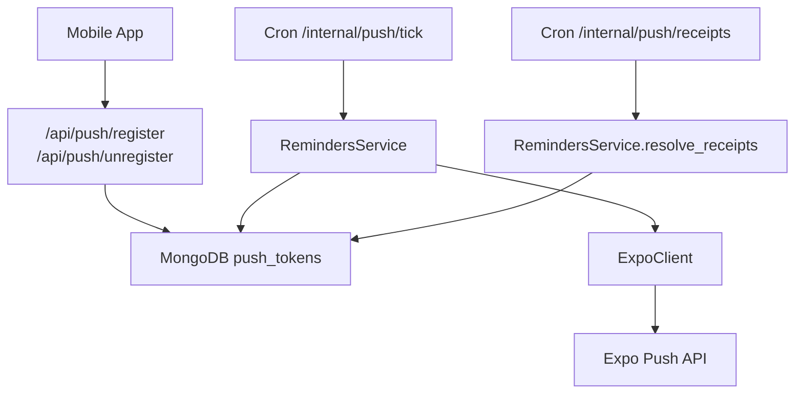
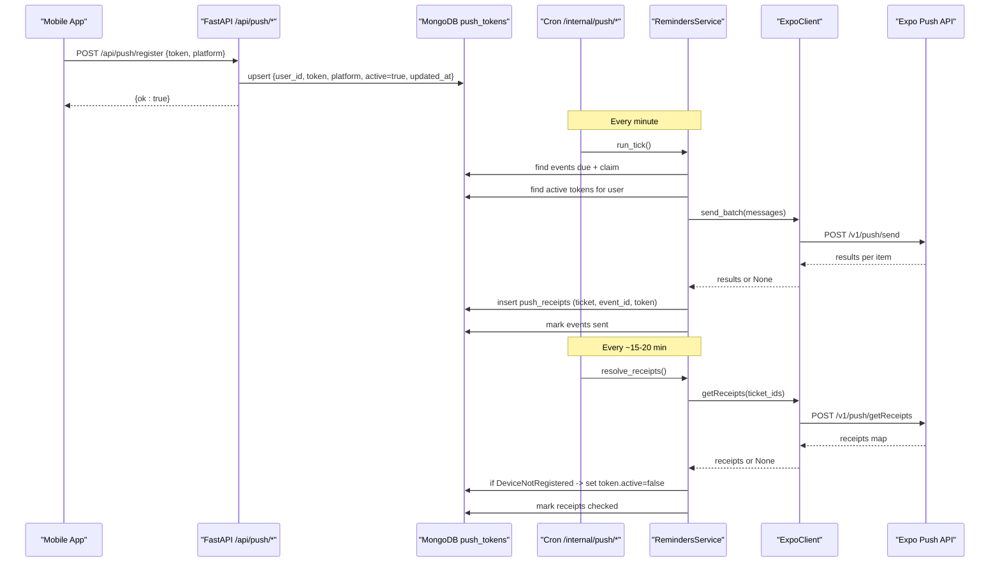
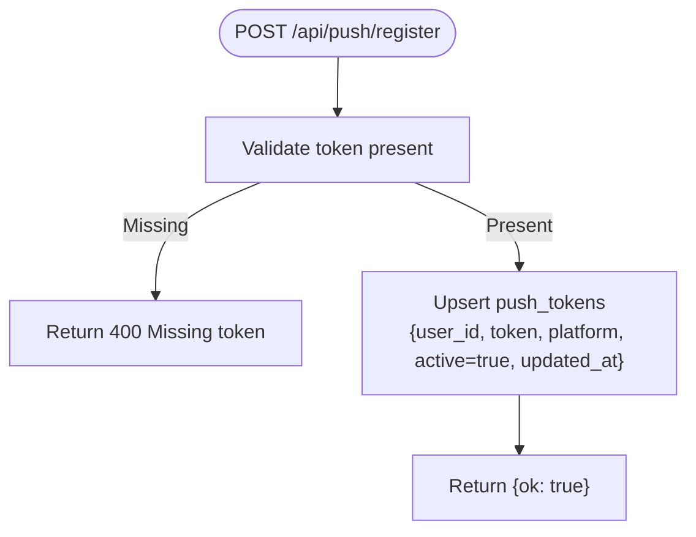
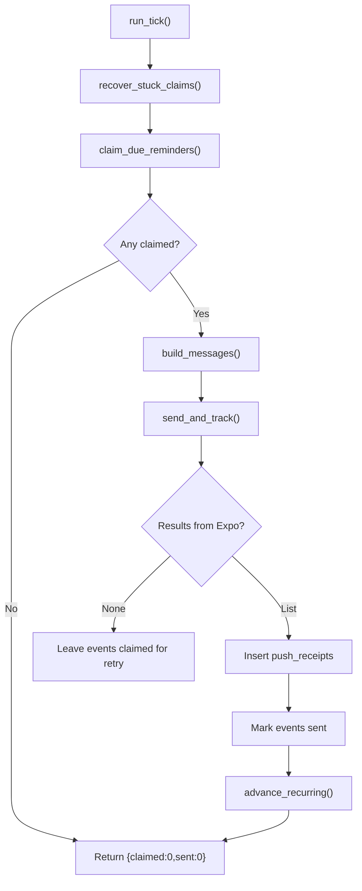
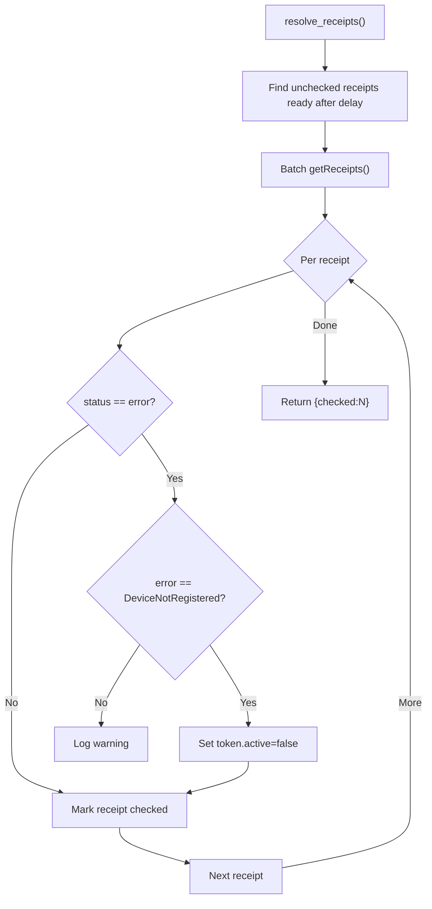
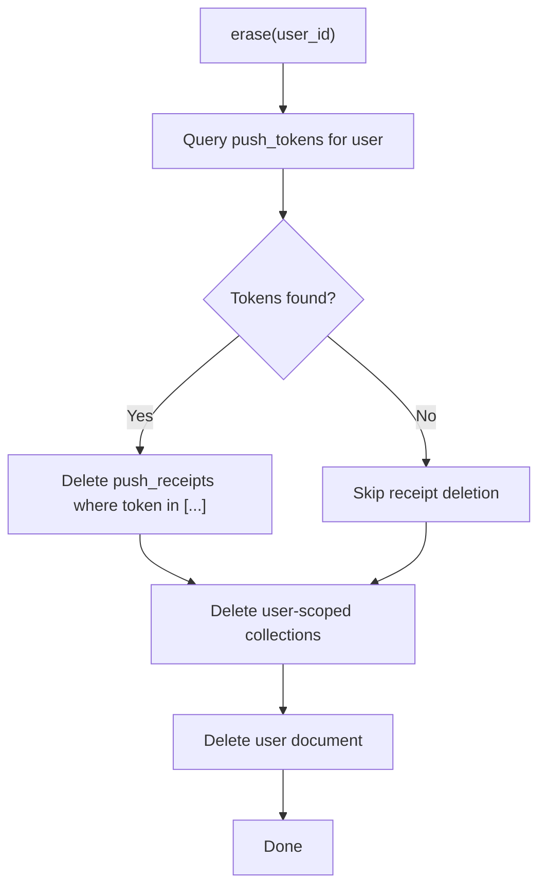
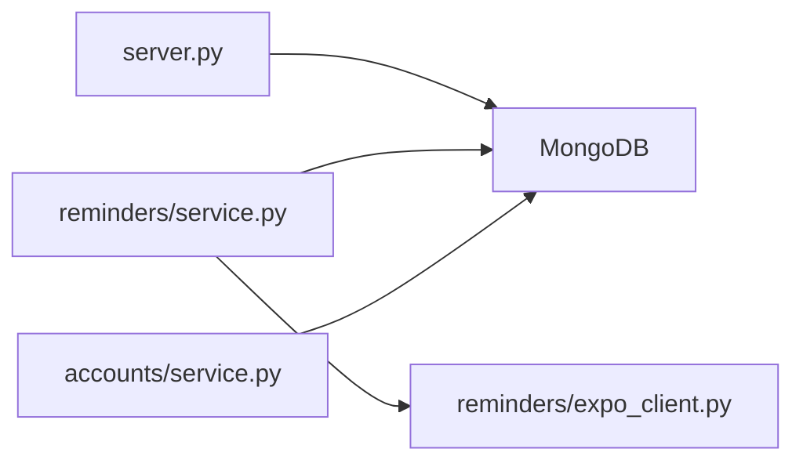

# Device Token Management

<cite>
**Referenced Files in This Document**
- [server.py](file://server.py)
- [reminders/service.py](file://reminders/service.py)
- [reminders/expo_client.py](file://reminders/expo_client.py)
- [accounts/service.py](file://accounts/service.py)
</cite>

## Table of Contents
1. [Introduction](#introduction)
2. [Project Structure](#project-structure)
3. [Core Components](#core-components)
4. [Architecture Overview](#architecture-overview)
5. [Detailed Component Analysis](#detailed-component-analysis)
6. [Dependency Analysis](#dependency-analysis)
7. [Performance Considerations](#performance-considerations)
8. [Troubleshooting Guide](#troubleshooting-guide)
9. [Conclusion](#conclusion)

## Introduction
This document explains how mobile devices register push tokens with the backend, how tokens are validated and stored in MongoDB, and how token updates are handled when devices change or apps are reinstalled. It covers the full token lifecycle from registration to expiration, including automatic cleanup of invalid tokens and handling of token revocation. It also provides examples of token registration endpoints, batch operations for reminders, and troubleshooting guidance for common issues such as expired or invalid tokens.

## Project Structure
The device token system spans a few focused areas:
- Public API endpoints for registering and unregistering push tokens live in the main server file.
- The reminder delivery pipeline reads active tokens, sends notifications via Expo, records receipts, and resolves them to clean up invalid tokens.
- Account erasure ensures personal data is removed, including push receipts tied to tokens.

**Diagram sources**
- [server.py:129-162](file://server.py#L129-L162)
- [reminders/router.py:19-28](file://reminders/router.py#L19-L28)
- [reminders/service.py:69-118](file://reminders/service.py#L69-L118)
- [reminders/service.py:181-214](file://reminders/service.py#L181-L214)
- [reminders/expo_client.py:18-49](file://reminders/expo_client.py#L18-L49)

**Section sources**
- [server.py:129-162](file://server.py#L129-L162)
- [reminders/service.py:69-118](file://reminders/service.py#L69-L118)
- [reminders/service.py:181-214](file://reminders/service.py#L181-L214)
- [reminders/expo_client.py:18-49](file://reminders/expo_client.py#L18-L49)

## Core Components
- Push token registration and unregistration endpoints:
  - Register: Upserts a device token per user, marking it active and recording platform and update time.
  - Unregister: Marks a token inactive (e.g., on logout), preserving history for receipt resolution.
- Reminder delivery pipeline:
  - Claims due reminders atomically.
  - Builds messages using each active token for the event owner.
  - Sends batches to Expo and tracks tickets.
  - Resolves receipts periodically to mark tokens inactive when Expo reports DeviceNotRegistered.
- Account erasure:
  - Wipes all user-scoped collections, including push tokens.
  - Cleans up push receipts by token before deleting tokens, ensuring no orphaned personal data remains.

**Section sources**
- [server.py:129-162](file://server.py#L129-L162)
- [reminders/service.py:52-118](file://reminders/service.py#L52-L118)
- [reminders/service.py:181-214](file://reminders/service.py#L181-L214)
- [accounts/service.py:60-108](file://accounts/service.py#L60-L108)

## Architecture Overview
The system separates concerns between client-facing token management and background processing for delivery and cleanup.

**Diagram sources**
- [server.py:129-162](file://server.py#L129-L162)
- [reminders/service.py:52-118](file://reminders/service.py#L52-L118)
- [reminders/service.py:181-214](file://reminders/service.py#L181-L214)
- [reminders/expo_client.py:26-49](file://reminders/expo_client.py#L26-L49)

## Detailed Component Analysis

### Token Registration and Unregistration
- Registration endpoint:
  - Validates presence of token.
  - Upserts a document in push_tokens keyed by user_id and token, setting active to true and updating timestamp.
  - Supports platform metadata (default android).
- Unregistration endpoint:
  - Marks token inactive without deletion to preserve receipt resolution history.

**Diagram sources**
- [server.py:129-151](file://server.py#L129-L151)

**Section sources**
- [server.py:129-151](file://server.py#L129-L151)
- [server.py:154-162](file://server.py#L154-L162)

### Reminder Delivery Pipeline (Batch Operations)
- Claim due reminders atomically to avoid duplicate sends.
- Build messages per event and active token; if no active tokens exist, mark event as sent immediately.
- Send batches to Expo (up to 100 per call); record receipts for later resolution.
- On transport failure, leave events claimed so stuck-claim recovery retries later.

**Diagram sources**
- [reminders/service.py:44-177](file://reminders/service.py#L44-L177)

**Section sources**
- [reminders/service.py:44-177](file://reminders/service.py#L44-L177)

### Token Cleanup via Receipt Resolution
- Periodic job fetches pending receipts that are ready after a delay.
- Queries Expo for receipt status; if DeviceNotRegistered is reported, marks the corresponding token inactive.
- Marks receipts as checked; stops chasing unresolved receipts older than a threshold.

**Diagram sources**
- [reminders/service.py:181-214](file://reminders/service.py#L181-L214)

**Section sources**
- [reminders/service.py:181-214](file://reminders/service.py#L181-L214)

### Account Erasure and Data Minimization
- When an account is deleted, all user-scoped collections are wiped, including push_tokens.
- Before deleting tokens, push receipts are cleaned up by querying tokens associated with the user and deleting matching receipts.

**Diagram sources**
- [accounts/service.py:60-108](file://accounts/service.py#L60-L108)

**Section sources**
- [accounts/service.py:60-108](file://accounts/service.py#L60-L108)

### Expo Integration
- Thin HTTP client wraps Expo’s send and receipts endpoints.
- Uses region-based URLs and optional access token header for security.
- Returns per-item results or None on transport errors; callers handle retries and stuck claims.

**Section sources**
- [reminders/expo_client.py:18-49](file://reminders/expo_client.py#L18-L49)

## Dependency Analysis
- server.py exposes public endpoints for token management and defines indexes for efficient queries.
- reminders/service.py depends on MongoDB for events, push_tokens, and push_receipts, and on ExpoClient for network calls.
- accounts/service.py depends on MongoDB for GDPR-compliant data removal across user-scoped collections.

**Diagram sources**
- [server.py:404-407](file://server.py#L404-L407)
- [reminders/service.py:14-20](file://reminders/service.py#L14-L20)
- [reminders/expo_client.py:18-49](file://reminders/expo_client.py#L18-L49)
- [accounts/service.py:9-11](file://accounts/service.py#L9-L11)

**Section sources**
- [server.py:404-407](file://server.py#L404-L407)
- [reminders/service.py:14-20](file://reminders/service.py#L14-L20)
- [accounts/service.py:9-11](file://accounts/service.py#L9-L11)

## Performance Considerations
- Atomic claiming prevents duplicate sends and race conditions during overlapping ticks.
- Batch sizes:
  - Expo send: up to 100 messages per call.
  - Receipts query: up to 300 ticket IDs per call.
  - Receipts fetch limit: 1000 per tick to bound memory and latency.
- Indexes:
  - push_tokens: composite index on (user_id, active) optimizes building messages per event.
  - push_tokens: index on token supports quick lookups during cleanup.
  - push_receipts: index on (checked, created_at) speeds up finding pending receipts.
- Stuck claim recovery:
  - Events claimed longer than a threshold are reset to pending to allow retries.

[No sources needed since this section provides general guidance]

## Troubleshooting Guide
Common token-related issues and resolutions:

- Expired or invalid tokens (DeviceNotRegistered):
  - Symptom: No push received; logs show DeviceNotRegistered.
  - Behavior: Backend marks token inactive automatically during send or receipt resolution.
  - Action: Re-register the token from the mobile app to restore delivery.

- Transport failures to Expo:
  - Symptom: Batch send returns None; events remain claimed.
  - Behavior: Stuck-claim recovery resets events to pending for retry.
  - Action: Ensure cron jobs are running; check Expo credentials and rate limits.

- Late or missing receipts:
  - Symptom: Some receipts never resolved.
  - Behavior: After a threshold, unreceived receipts are marked checked and stopped being chased.
  - Action: Verify receipt cron runs regularly; inspect logs for errors.

- Token not receiving reminders:
  - Check that the token is active and associated with the correct user.
  - Confirm build_messages finds active tokens for the event owner.
  - Validate indexes exist for efficient queries.

- GDPR compliance and data cleanup:
  - Deleting an account removes push_tokens and related push_receipts.
  - If receipts persist unexpectedly, verify the account erasure routine ran successfully.

**Section sources**
- [reminders/service.py:104-113](file://reminders/service.py#L104-L113)
- [reminders/service.py:200-214](file://reminders/service.py#L200-L214)
- [accounts/service.py:90-108](file://accounts/service.py#L90-L108)

## Conclusion
The backend implements a robust device token lifecycle:
- Clients register and unregister tokens via authenticated endpoints.
- Active tokens are used to deliver reminders in batches through Expo.
- Background jobs continuously clean up invalid tokens based on Expo feedback.
- Account erasure ensures complete removal of personal data, including tokens and receipts.

This design balances reliability, performance, and privacy while providing clear mechanisms for handling token changes, reinstallations, and revocations.