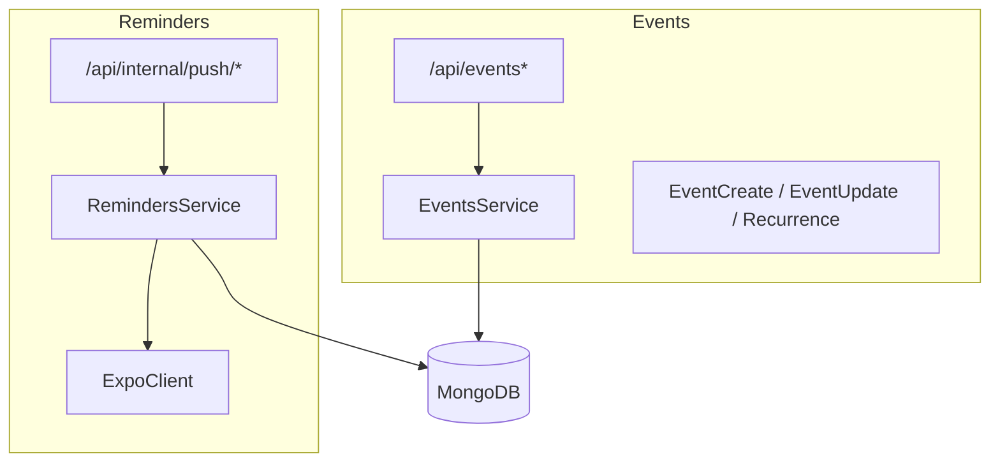
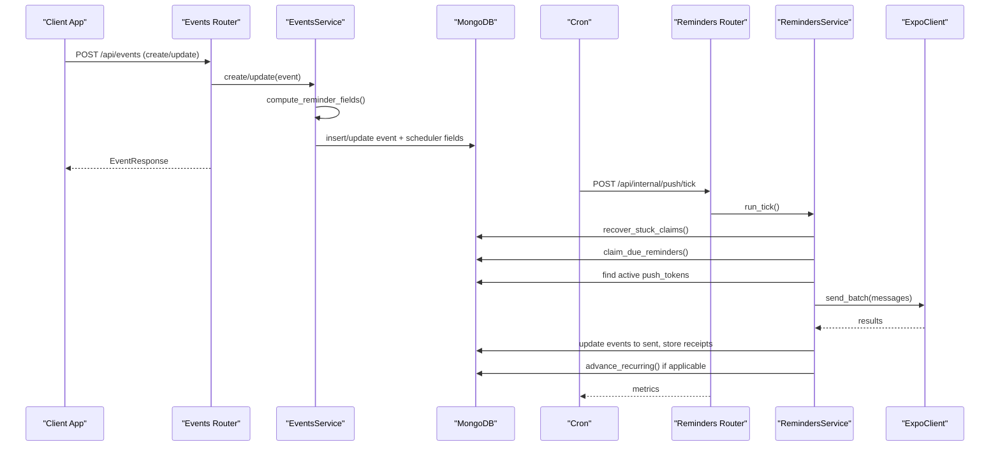
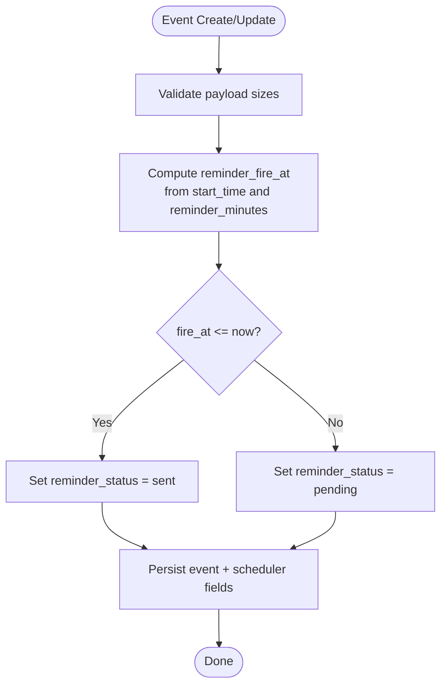
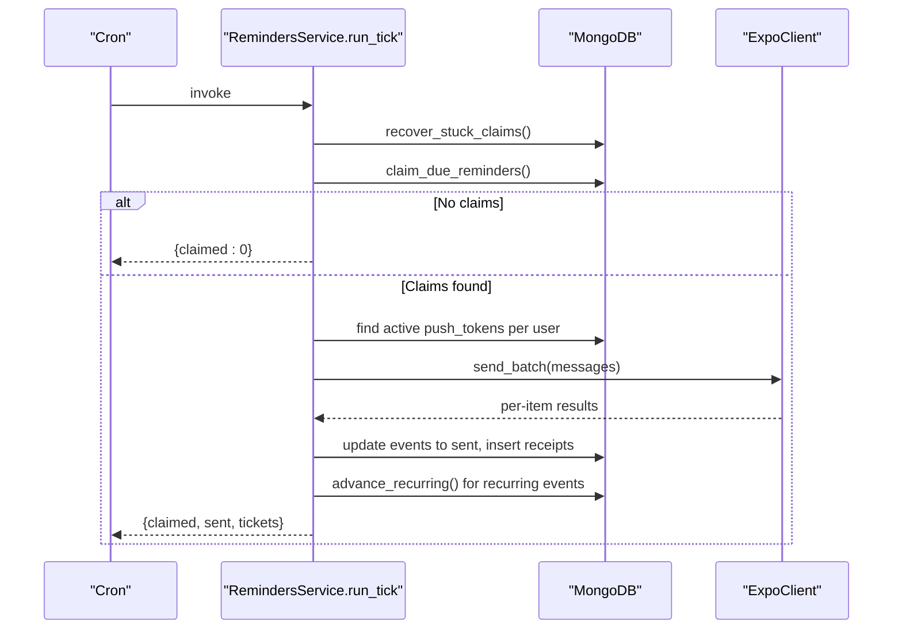
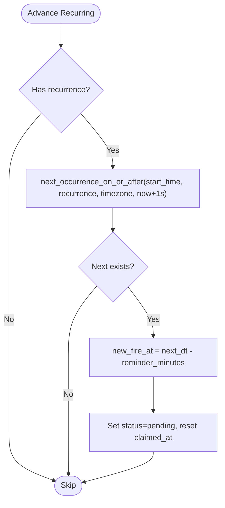
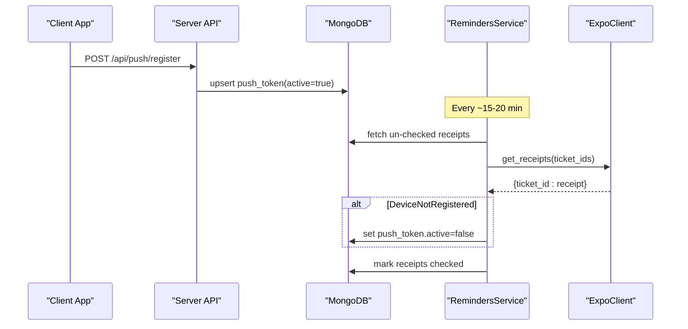
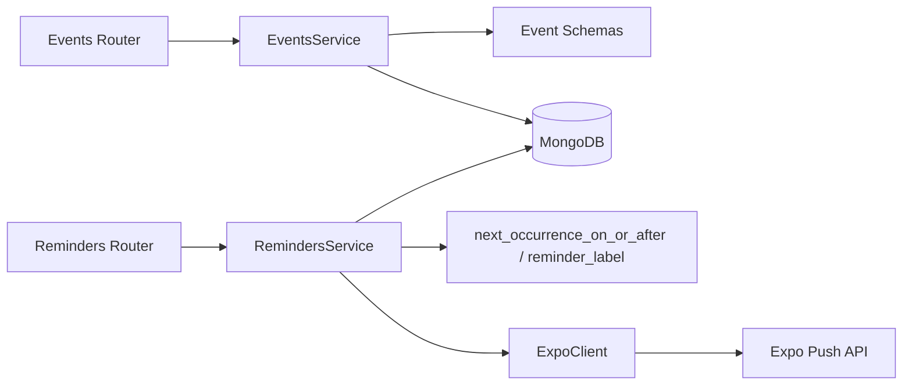

# Event System Integration

<cite>
**Referenced Files in This Document**
- [events/service.py](file://events/service.py)
- [events/router.py](file://events/router.py)
- [events/schemas.py](file://events/schemas.py)
- [reminders/service.py](file://reminders/service.py)
- [reminders/router.py](file://reminders/router.py)
- [reminders/expo_client.py](file://reminders/expo_client.py)
- [server.py](file://server.py)
</cite>

## Table of Contents
1. [Introduction](#introduction)
2. [Project Structure](#project-structure)
3. [Core Components](#core-components)
4. [Architecture Overview](#architecture-overview)
5. [Detailed Component Analysis](#detailed-component-analysis)
6. [Dependency Analysis](#dependency-analysis)
7. [Performance Considerations](#performance-considerations)
8. [Troubleshooting Guide](#troubleshooting-guide)
9. [Conclusion](#conclusion)
10. [Appendices](#appendices)

## Introduction
This document explains how the events module integrates with the reminders system to automatically trigger reminder notifications. It covers:
- How event creation and updates compute reminder scheduling fields
- The data flow from events to push notification delivery
- Event-to-reminder mapping logic, including recurrence handling
- Subscription patterns via a cron-driven tick job
- Edge cases such as event modifications, cancellations, and recurring series termination

The integration is designed to be robust against concurrent ticks, network failures, and device token churn, while keeping reminder delivery accurate across timezones and DST transitions.

## Project Structure
The integration spans two main modules:
- Events: defines schemas, persistence, and reminder field computation
- Reminders: implements the push notification pipeline (claim, send, receipt resolution, recurrence roll-forward)

**Diagram sources**
- [events/router.py:23-111](file://events/router.py#L23-L111)
- [events/service.py:163-312](file://events/service.py#L163-L312)
- [events/schemas.py:5-101](file://events/schemas.py#L5-L101)
- [reminders/router.py:19-29](file://reminders/router.py#L19-L29)
- [reminders/service.py:37-215](file://reminders/service.py#L37-L215)
- [reminders/expo_client.py:18-50](file://reminders/expo_client.py#L18-L50)

**Section sources**
- [events/router.py:23-111](file://events/router.py#L23-L111)
- [events/service.py:163-312](file://events/service.py#L163-L312)
- [events/schemas.py:5-101](file://events/schemas.py#L5-L101)
- [reminders/router.py:19-29](file://reminders/router.py#L19-L29)
- [reminders/service.py:37-215](file://reminders/service.py#L37-L215)
- [reminders/expo_client.py:18-50](file://reminders/expo_client.py#L18-L50)
- [server.py:181-197](file://server.py#L181-L197)

## Core Components
- EventsService: validates payloads, persists events, computes reminder scheduler fields, supports recurrence math for next occurrences
- RemindersService: atomic claim of due reminders, build messages per active device tokens, batch send via Expo, track receipts, advance recurring events
- ExpoClient: thin HTTP adapter over Expo’s send and getReceipts endpoints
- Routers: expose public event CRUD and internal cron endpoints protected by a shared secret

Key behaviors:
- Reminder scheduling fields are computed at create/update time based on start_time and reminder_minutes
- A cron job triggers the reminders tick every minute to deliver due reminders
- Receipts are polled periodically to mark devices inactive when Expo reports DeviceNotRegistered

**Section sources**
- [events/service.py:39-53](file://events/service.py#L39-L53)
- [events/service.py:167-199](file://events/service.py#L167-L199)
- [events/service.py:267-306](file://events/service.py#L267-L306)
- [reminders/service.py:44-177](file://reminders/service.py#L44-L177)
- [reminders/expo_client.py:26-50](file://reminders/expo_client.py#L26-L50)
- [reminders/router.py:19-29](file://reminders/router.py#L19-L29)

## Architecture Overview
The reminder lifecycle consists of:
1. Client creates or updates an event with reminder_minutes and optional recurrence
2. Server computes reminder_fire_at and sets initial status
3. Cron calls /api/internal/push/tick to claim due reminders atomically
4. For each claimed event, server builds push messages for all active device tokens
5. Messages are sent via Expo; successful sends record receipts; events marked sent
6. Periodic receipt polling resolves delivery outcomes and deactivates stale tokens
7. For recurring events, the next occurrence is scheduled after sending

**Diagram sources**
- [events/router.py:23-96](file://events/router.py#L23-L96)
- [events/service.py:167-199](file://events/service.py#L167-L199)
- [events/service.py:267-306](file://events/service.py#L267-L306)
- [reminders/router.py:19-29](file://reminders/router.py#L19-L29)
- [reminders/service.py:44-177](file://reminders/service.py#L44-L177)
- [reminders/expo_client.py:26-50](file://reminders/expo_client.py#L26-L50)

## Detailed Component Analysis

### Event Creation and Reminder Field Computation
When an event is created or updated, the service:
- Validates payload sizes
- Computes reminder_fire_at = start_time - reminder_minutes
- Sets reminder_status to pending unless fire_at is already in the past (then set to sent)
- Persists event with scheduler fields

If timing or recurrence changes, the service recomputes scheduler fields only when necessary and resets state appropriately.

**Diagram sources**
- [events/service.py:167-199](file://events/service.py#L167-L199)
- [events/service.py:39-53](file://events/service.py#L39-L53)
- [events/service.py:267-306](file://events/service.py#L267-L306)

**Section sources**
- [events/service.py:39-53](file://events/service.py#L39-L53)
- [events/service.py:167-199](file://events/service.py#L167-L199)
- [events/service.py:267-306](file://events/service.py#L267-L306)

### Reminder Delivery Pipeline (Tick Job)
The tick job runs once per minute:
- Recovers stuck claims older than a threshold
- Atomically claims due reminders using find_one_and_update to prevent double-sends
- Builds push messages per active device token per event
- Sends batches via Expo and records receipts
- Marks events sent and advances recurring events to their next occurrence

**Diagram sources**
- [reminders/service.py:44-177](file://reminders/service.py#L44-L177)
- [reminders/expo_client.py:26-50](file://reminders/expo_client.py#L26-L50)

**Section sources**
- [reminders/service.py:44-177](file://reminders/service.py#L44-L177)

### Recurrence Handling and Next Occurrence Calculation
For recurring events:
- Frequency maps to dateutil rrule constants
- Weekly events support byweekday with explicit JS-to-dateutil mapping
- Timezone-aware calculation ensures wall-clock consistency across DST
- Until date is inclusive; beyond until, series ends and stays terminal sent
- After firing, the next occurrence is scheduled with a new reminder_fire_at

**Diagram sources**
- [events/service.py:69-122](file://events/service.py#L69-L122)
- [reminders/service.py:120-158](file://reminders/service.py#L120-L158)

**Section sources**
- [events/service.py:69-122](file://events/service.py#L69-L122)
- [reminders/service.py:120-158](file://reminders/service.py#L120-L158)

### Push Token Management and Receipt Resolution
- Clients register/unregister push tokens via API endpoints
- During send, server looks up active tokens per user
- If no active tokens exist, the reminder is immediately marked sent
- Expo errors like DeviceNotRegistered deactivate tokens
- A separate receipts tick polls Expo for delivery outcomes and prunes stale tokens

**Diagram sources**
- [server.py:134-162](file://server.py#L134-L162)
- [reminders/service.py:181-215](file://reminders/service.py#L181-L215)

**Section sources**
- [server.py:134-162](file://server.py#L134-L162)
- [reminders/service.py:181-215](file://reminders/service.py#L181-L215)

### Event-to-Reminder Mapping Rules
- reminder_minutes determines how many minutes before start_time to remind
- If reminder_minutes is absent or start_time invalid, reminder is considered sent immediately
- All-day events use date-only semantics; reminder scheduling still uses start_time
- Location and type do not affect reminder scheduling directly; they are stored with the event but do not change reminder behavior
- E2EE ciphertext titles fall back to a generic title in push notifications

**Section sources**
- [events/service.py:39-53](file://events/service.py#L39-L53)
- [events/schemas.py:11-41](file://events/schemas.py#L11-L41)
- [reminders/service.py:69-91](file://reminders/service.py#L69-L91)

### Custom Reminder Rules
- Users can set reminder_minutes per event to customize lead time
- Recurrence rules allow repeating events with frequency, optional weekdays, and an optional until date
- Timezone anchoring ensures consistent local-time behavior across DST transitions

Examples of configurations that generate reminders:
- Single event with reminder_minutes=15
- Daily meeting with reminder_minutes=30 and until date
- Weekly standup on specific weekdays with reminder_minutes=60

**Section sources**
- [events/schemas.py:5-41](file://events/schemas.py#L5-L41)
- [events/service.py:69-122](file://events/service.py#L69-L122)

### Handling Edge Cases
- Event modification: updating start_time, reminder_minutes, or recurrence recomputes scheduler fields; if fire_at changes, status resets accordingly
- Event cancellation/deletion: deleting an event removes it from the schedule; no further reminders will fire
- Stuck claims: claims older than a threshold are recovered to pending to avoid lost reminders
- No active tokens: reminder is marked sent without sending; avoids orphaned pending reminders
- Network failures: whole-batch failures leave events claimed; recovery retries later
- Series ended: when until date passes, recurring events stay terminal sent

**Section sources**
- [events/service.py:267-306](file://events/service.py#L267-L306)
- [events/service.py:308-312](file://events/service.py#L308-L312)
- [reminders/service.py:44-67](file://reminders/service.py#L44-L67)
- [reminders/service.py:69-91](file://reminders/service.py#L69-L91)
- [reminders/service.py:93-118](file://reminders/service.py#L93-L118)
- [reminders/service.py:120-158](file://reminders/service.py#L120-L158)

## Dependency Analysis
The integration has clear boundaries:
- Events module owns event schema, validation, persistence, and reminder field computation
- Reminders module owns delivery pipeline and depends on events’ recurrence helpers
- ExpoClient abstracts external push provider
- Server wires routers and database connections

**Diagram sources**
- [events/router.py:23-111](file://events/router.py#L23-L111)
- [events/service.py:163-312](file://events/service.py#L163-L312)
- [events/schemas.py:5-101](file://events/schemas.py#L5-L101)
- [reminders/router.py:19-29](file://reminders/router.py#L19-L29)
- [reminders/service.py:37-215](file://reminders/service.py#L37-L215)
- [reminders/expo_client.py:18-50](file://reminders/expo_client.py#L18-L50)

**Section sources**
- [events/router.py:23-111](file://events/router.py#L23-L111)
- [events/service.py:163-312](file://events/service.py#L163-L312)
- [reminders/router.py:19-29](file://reminders/router.py#L19-L29)
- [reminders/service.py:37-215](file://reminders/service.py#L37-L215)
- [reminders/expo_client.py:18-50](file://reminders/expo_client.py#L18-L50)

## Performance Considerations
- Atomic claim loop capped per tick to prevent runaway processing under large backlogs
- Partial index on reminder_status and reminder_fire_at optimizes tick queries
- Batch sending to Expo respects provider limits; receipts polled in batches
- Database indexes ensure efficient listing, paging, and reminder lookups
- E2EE ciphertext titles avoid exposing garbled content in push notifications

[No sources needed since this section provides general guidance]

## Troubleshooting Guide
Common issues and resolutions:
- Reminder not firing:
  - Check reminder_minutes and start_time validity
  - Verify reminder_status is pending and reminder_fire_at is in the past
  - Ensure push tokens are registered and active
- Double-sends or missed reminders:
  - Confirm atomic claim behavior; overlapping ticks cannot double-claim
  - Check stuck claim recovery window
- Expo delivery failures:
  - Inspect receipts for DeviceNotRegistered; tokens are deactivated automatically
  - Network failures leave events claimed; retry on next tick
- Recurring events not advancing:
  - Validate recurrence configuration and timezone
  - Ensure next_occurrence_on_or_after returns a valid future date

**Section sources**
- [reminders/service.py:44-67](file://reminders/service.py#L44-L67)
- [reminders/service.py:93-118](file://reminders/service.py#L93-L118)
- [reminders/service.py:120-158](file://reminders/service.py#L120-L158)
- [reminders/service.py:181-215](file://reminders/service.py#L181-L215)

## Conclusion
The events and reminders integration provides a reliable, scalable reminder system:
- Events compute precise reminder schedules based on user-defined properties
- The reminders pipeline delivers notifications atomically and resiliently
- Recurrence handling ensures correct next-occurrence scheduling across timezones
- Robust error handling and receipt resolution maintain correctness under failures

[No sources needed since this section summarizes without analyzing specific files]

## Appendices

### API Endpoints Summary
- Events:
  - POST /api/events: create event with reminder_minutes and optional recurrence
  - GET /api/events: list paginated events
  - GET /api/events/{id}: get single event
  - PUT /api/events/{id}: update event (recomputes scheduler fields as needed)
  - DELETE /api/events/{id}: delete event
- Push:
  - POST /api/push/register: register device token
  - POST /api/push/unregister: unregister device token
- Internal (cron):
  - POST /api/internal/push/tick: claim and send due reminders
  - POST /api/internal/push/receipts: resolve delivery receipts

**Section sources**
- [events/router.py:23-111](file://events/router.py#L23-L111)
- [server.py:134-162](file://server.py#L134-L162)
- [reminders/router.py:19-29](file://reminders/router.py#L19-L29)