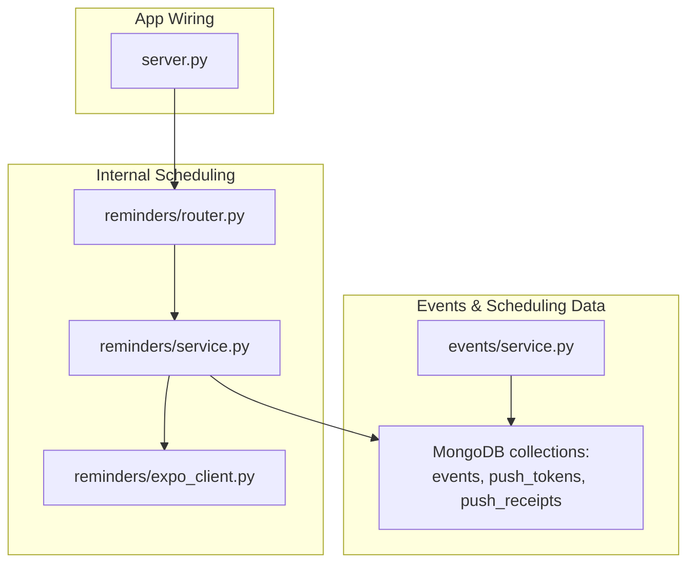
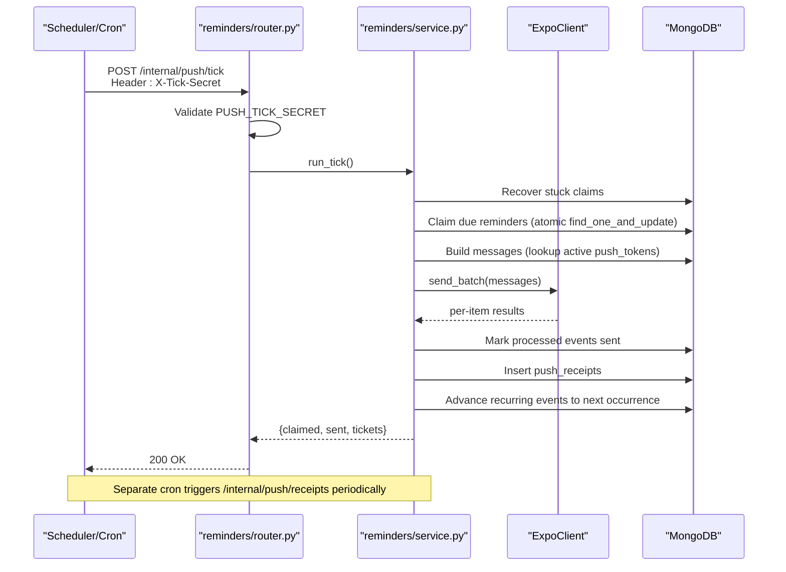
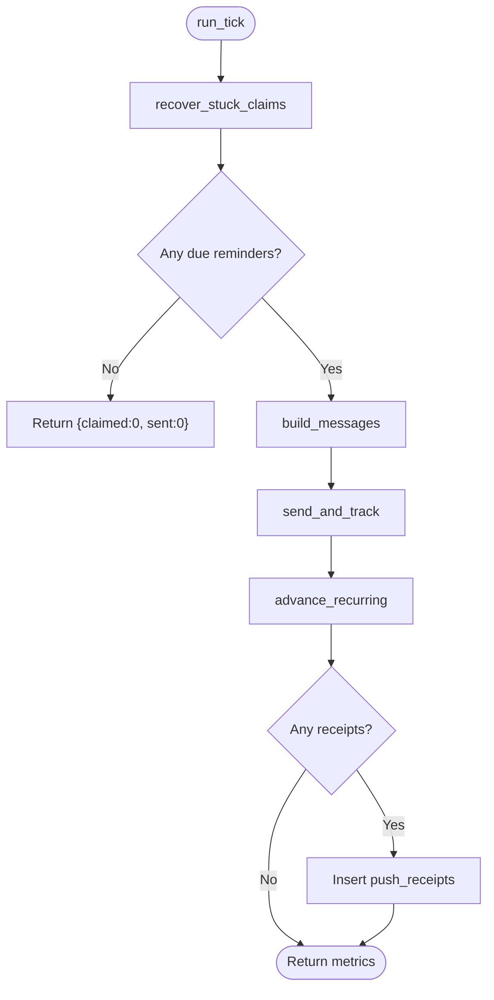
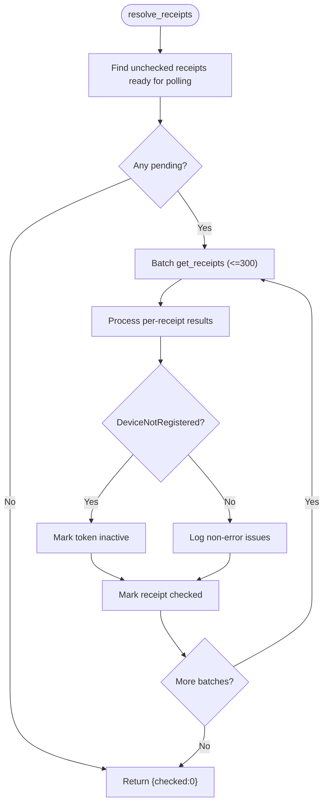
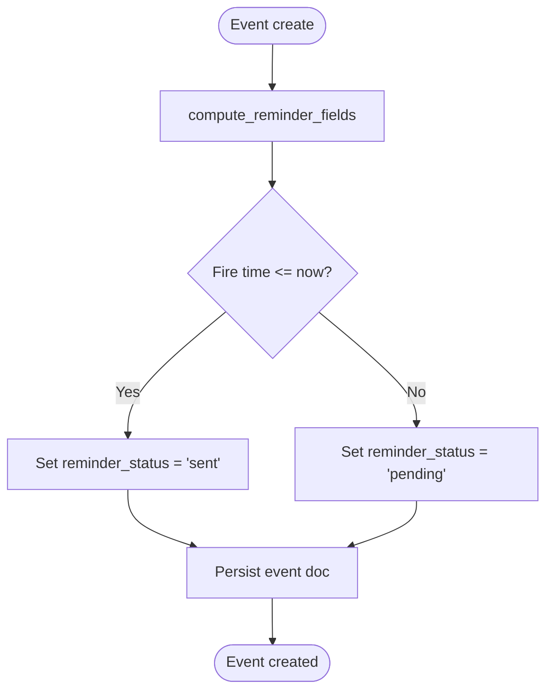
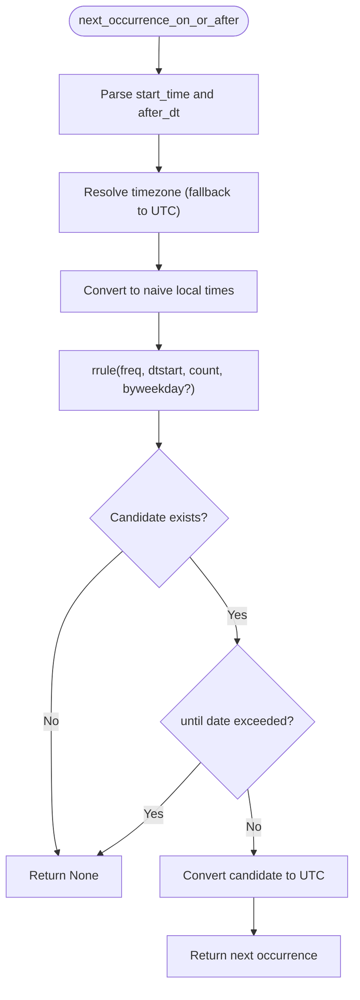
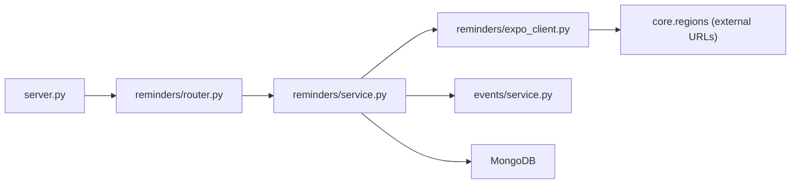

# Notification Scheduling

<cite>
**Referenced Files in This Document**
- [server.py](file://server.py)
- [reminders/router.py](file://reminders/router.py)
- [reminders/service.py](file://reminders/service.py)
- [reminders/expo_client.py](file://reminders/expo_client.py)
- [events/service.py](file://events/service.py)
- [accounts/service.py](file://accounts/service.py)
- [tests/test_nueco_apis.py](file://tests/test_nueco_apis.py)
</cite>

## Table of Contents
1. [Introduction](#introduction)
2. [Project Structure](#project-structure)
3. [Core Components](#core-components)
4. [Architecture Overview](#architecture-overview)
5. [Detailed Component Analysis](#detailed-component-analysis)
6. [Dependency Analysis](#dependency-analysis)
7. [Performance Considerations](#performance-considerations)
8. [Troubleshooting Guide](#troubleshooting-guide)
9. [Conclusion](#conclusion)
10. [Appendices](#appendices)

## Introduction
This document explains the notification scheduling system that delivers push reminders for events. It covers how scheduled notifications are stored, how a tick-based scheduler processes them, and how they are delivered at specified times. It also documents the internal API endpoints that drive the scheduling engine, their security model, examples for creating and configuring scheduled notifications, timezone handling, monitoring queues, and scaling considerations.

## Project Structure
The notification scheduling system spans several modules:
- Internal scheduling endpoints live under reminders/router.py and expose /internal/push/tick and /internal/push/receipts.
- The scheduling logic is implemented in reminders/service.py (RemindersService).
- Push delivery integrates with Expo via reminders/expo_client.py.
- Event creation and reminder field computation live in events/service.py.
- Database indexes and app startup wiring are in server.py.
- Account deletion includes cleanup of push receipts in accounts/service.py.
- Tests demonstrate usage and edge cases in tests/test_nueco_apis.py.

**Diagram sources**
- [server.py:175-197](file://server.py#L175-L197)
- [reminders/router.py:9-28](file://reminders/router.py#L9-L28)
- [reminders/service.py:37-215](file://reminders/service.py#L37-L215)
- [reminders/expo_client.py:18-50](file://reminders/expo_client.py#L18-L50)
- [events/service.py:163-199](file://events/service.py#L163-L199)

**Section sources**
- [server.py:175-197](file://server.py#L175-L197)
- [reminders/router.py:9-28](file://reminders/router.py#L9-L28)
- [reminders/service.py:37-215](file://reminders/service.py#L37-L215)
- [reminders/expo_client.py:18-50](file://reminders/expo_client.py#L18-L50)
- [events/service.py:163-199](file://events/service.py#L163-L199)

## Core Components
- RemindersService: Orchestrates claiming due reminders, building messages, sending via Expo, tracking receipts, and advancing recurring reminders.
- ExpoClient: Thin HTTP adapter to Expo’s send and receipt endpoints.
- Events service helpers: Compute reminder fields on event creation and calculate next recurrence occurrences with timezone awareness.
- Internal router: Exposes protected endpoints for tick processing and receipt resolution.

Key responsibilities:
- Atomic claim of due reminders to prevent double-sends.
- Batched delivery to Expo with per-item result handling.
- Stuck-claim recovery to re-enqueue items if a prior tick crashed mid-processing.
- Receipt resolution to mark tokens inactive when devices are unregistered.
- Recurrence roll-forward to schedule future occurrences after firing.

**Section sources**
- [reminders/service.py:37-215](file://reminders/service.py#L37-L215)
- [reminders/expo_client.py:18-50](file://reminders/expo_client.py#L18-L50)
- [events/service.py:39-53](file://events/service.py#L39-L53)
- [events/service.py:69-122](file://events/service.py#L69-L122)

## Architecture Overview
The scheduling pipeline runs as two cron-driven flows exposed by internal endpoints:

- Tick flow (/internal/push/tick): Claims due reminders, sends push notifications, records receipts, and advances recurring events.
- Receipt flow (/internal/push/receipts): Polls Expo for delivery results and prunes stale tokens.

Security: Both endpoints require a shared secret header X-Tick-Secret matching the environment variable PUSH_TICK_SECRET.

**Diagram sources**
- [reminders/router.py:12-28](file://reminders/router.py#L12-L28)
- [reminders/service.py:44-177](file://reminders/service.py#L44-L177)
- [reminders/expo_client.py:26-49](file://reminders/expo_client.py#L26-L49)

**Section sources**
- [reminders/router.py:12-28](file://reminders/router.py#L12-L28)
- [reminders/service.py:44-177](file://reminders/service.py#L44-L177)

## Detailed Component Analysis

### Internal API Endpoints
- POST /internal/push/tick
  - Purpose: Trigger one tick cycle to process due reminders.
  - Security: Requires header X-Tick-Secret equal to environment variable PUSH_TICK_SECRET; otherwise returns 403 Forbidden.
  - Behavior: Delegates to RemindersService.run_tick().
- POST /internal/push/receipts
  - Purpose: Resolve pending Expo delivery receipts and clean up stale tokens.
  - Security: Same secret requirement as tick.
  - Behavior: Delegates to RemindersService.resolve_receipts().

These endpoints are mounted under prefix /internal/push and included into the FastAPI app during startup.

**Section sources**
- [reminders/router.py:9-28](file://reminders/router.py#L9-L28)
- [server.py:190-197](file://server.py#L190-L197)

### RemindersService: Tick Pipeline
- recover_stuck_claims(now): Resets events stuck in claimed state beyond a threshold back to pending.
- claim_due_reminders(now_iso): Atomically claims due, pending reminders using find_one_and_update to avoid races.
- build_messages(claimed): For each claimed event, finds active push tokens and constructs Expo messages; if no tokens exist, marks the event sent immediately.
- send_and_track(messages, now_iso): Batches messages to Expo (up to 100 per call), tracks successful ticket IDs, handles DeviceNotRegistered by deactivating tokens, and marks processed events as sent.
- advance_recurring(claimed, now): For recurring events, computes the next occurrence using events.service.next_occurrence_on_or_after and schedules it by setting reminder_status to pending and updating reminder_fire_at.
- run_tick(): Orchestrates the above steps and returns metrics.

**Diagram sources**
- [reminders/service.py:44-177](file://reminders/service.py#L44-L177)

**Section sources**
- [reminders/service.py:44-177](file://reminders/service.py#L44-L177)

### RemindersService: Receipt Resolution Pipeline
- resolve_receipts(): Finds unchecked receipts older than a readiness window, batches requests to Expo (up to 300 per call), processes results, marks receipts checked, and deactivates tokens for DeviceNotRegistered errors.

**Diagram sources**
- [reminders/service.py:181-214](file://reminders/service.py#L181-L214)
- [reminders/expo_client.py:39-49](file://reminders/expo_client.py#L39-L49)

**Section sources**
- [reminders/service.py:181-214](file://reminders/service.py#L181-L214)
- [reminders/expo_client.py:39-49](file://reminders/expo_client.py#L39-L49)

### Event Creation and Reminder Scheduling
- compute_reminder_fields(start_time_iso, reminder_minutes): Computes reminder_fire_at as start_time minus reminder_minutes. If fire time is in the past or no reminder is configured, sets status to sent to avoid late scheduling.
- EventsService.create(...): Persists events including reminder fields computed from client-provided reminder_minutes and start_time. Also stores recurrence and timezone for later scheduling.

**Diagram sources**
- [events/service.py:39-53](file://events/service.py#L39-L53)
- [events/service.py:167-199](file://events/service.py#L167-L199)

**Section sources**
- [events/service.py:39-53](file://events/service.py#L39-L53)
- [events/service.py:167-199](file://events/service.py#L167-L199)

### Recurrence and Timezone Handling
- next_occurrence_on_or_after(start_time_iso, recurrence, timezone_name, after_dt): Computes the next occurrence in the event’s local timezone using dateutil rrule, then converts back to UTC. Supports daily/weekly/monthly/yearly frequencies and optional until dates. Handles weekday mapping between JS and Python conventions.

**Diagram sources**
- [events/service.py:69-122](file://events/service.py#L69-L122)

**Section sources**
- [events/service.py:69-122](file://events/service.py#L69-L122)

### Security Requirements
- Both /internal/push/tick and /internal/push/receipts enforce a shared secret check:
  - Environment variable: PUSH_TICK_SECRET
  - Request header: X-Tick-Secret must match exactly
  - Failure returns 403 Forbidden

This protects internal scheduling endpoints from unauthorized access.

**Section sources**
- [reminders/router.py:12-16](file://reminders/router.py#L12-L16)

### Examples

#### Creating a Scheduled Notification
- Create an event with reminder_minutes set to your desired lead time (e.g., 5, 15, 30, 60 minutes, or 1 day).
- The system computes reminder_fire_at based on start_time minus reminder_minutes.
- If the computed fire time is in the past, the event is marked sent immediately to avoid scheduling late reminders.

References:
- [events/service.py:39-53](file://events/service.py#L39-L53)
- [events/service.py:167-199](file://events/service.py#L167-L199)

#### Configuring Delivery Times
- Use reminder_minutes to control when the reminder fires relative to the event start time.
- Ensure start_time is accurate and timezone-aware; the system uses UTC internally but respects event timezone for recurrence calculations.

References:
- [events/service.py:39-53](file://events/service.py#L39-L53)

#### Handling Timezone Considerations
- Store timezone on events for recurrence math.
- next_occurrence_on_or_after computes occurrences in the event’s local timezone and returns UTC instants for scheduling.
- Non-recognized timezones fall back to UTC defensively.

References:
- [events/service.py:69-122](file://events/service.py#L69-L122)

#### Monitoring Scheduled Notification Queues
- Check MongoDB collections:
  - events: Filter by reminder_status to see pending vs sent counts.
  - push_tokens: Active tokens per user determine delivery targets.
  - push_receipts: Unchecked receipts indicate pending Expo delivery results.
- Metrics returned by /internal/push/tick include claimed, sent, and tickets counts.
- Receipt resolution endpoint returns checked counts.

References:
- [reminders/service.py:159-177](file://reminders/service.py#L159-L177)
- [reminders/service.py:181-214](file://reminders/service.py#L181-L214)
- [server.py:382-407](file://server.py#L382-L407)

### Scaling Considerations and Performance Optimization
- Atomic claiming: Uses find_one_and_update to prevent double-sends across overlapping ticks.
- Batch sizes:
  - MAX_CLAIM_PER_TICK caps per-tick work to 500 events.
  - EXPO_BATCH_SIZE limits Expo sends to 100 per call.
  - RECEIPTS_BATCH_SIZE limits receipt polling to 300 per call.
- Partial index: A partial index on events filters only pending reminders, keeping tick queries fast even with large historical datasets.
- Stuck-claim recovery: Reclaims events stuck in claimed state after crashes to ensure reliability.
- Token pruning: DeviceNotRegistered errors deactivate tokens to reduce wasted delivery attempts.
- Receipt give-up: Unresolved receipts older than a threshold are marked checked to prevent indefinite backlog.

Recommendations:
- Keep reminder_minutes reasonable to avoid massive spikes.
- Monitor claimed/sent/tickets metrics from tick responses.
- Ensure database indexes remain healthy and aligned with query patterns.
- Scale horizontally by running multiple instances behind a load balancer; atomic claims prevent duplication.

**Section sources**
- [reminders/service.py:24-34](file://reminders/service.py#L24-L34)
- [reminders/service.py:52-67](file://reminders/service.py#L52-L67)
- [reminders/service.py:93-118](file://reminders/service.py#L93-L118)
- [reminders/service.py:181-214](file://reminders/service.py#L181-L214)
- [server.py:382-407](file://server.py#L382-L407)

## Dependency Analysis

- server.py includes the reminders router and creates DB connections.
- reminders/router.py depends on RemindersService and enforces secret auth.
- reminders/service.py depends on events.service for recurrence and labels, and on ExpoClient for network calls.
- reminders/expo_client.py depends on core.regions for region-specific Expo endpoints.

**Diagram sources**
- [server.py:175-197](file://server.py#L175-L197)
- [reminders/router.py:9-28](file://reminders/router.py#L9-L28)
- [reminders/service.py:17-20](file://reminders/service.py#L17-L20)
- [reminders/expo_client.py:13-14](file://reminders/expo_client.py#L13-L14)

**Section sources**
- [server.py:175-197](file://server.py#L175-L197)
- [reminders/router.py:9-28](file://reminders/router.py#L9-L28)
- [reminders/service.py:17-20](file://reminders/service.py#L17-L20)
- [reminders/expo_client.py:13-14](file://reminders/expo_client.py#L13-L14)

## Performance Considerations
- Use partial indexes to keep tick queries efficient against large event histories.
- Cap batch sizes to respect provider limits and avoid timeouts.
- Avoid long-running ticks by limiting MAX_CLAIM_PER_TICK; handle backlogs across multiple ticks.
- Prune inactive tokens to reduce message fan-out.
- Monitor receipt resolution throughput and adjust batch sizes if needed.

[No sources needed since this section provides general guidance]

## Troubleshooting Guide
Common issues and resolutions:
- Missing or incorrect X-Tick-Secret: Ensure PUSH_TICK_SECRET is set and requests include the correct header.
- No reminders fired: Verify events have reminder_minutes set and reminder_fire_at in the past; check reminder_status is pending before ticking.
- Double-sends prevented: Atomic claiming ensures only one tick processes a given event; verify indexes and DB connectivity.
- Stuck claims: recover_stuck_claims resets claims older than a threshold; ensure STUCK_CLAIM_MINUTES aligns with expected tick cadence.
- Device not registered: Tokens are deactivated automatically; prompt users to re-register push tokens.
- Receipts not resolving: Check Expo availability and region configuration; receipts older than thresholds are marked checked to stop chasing.

**Section sources**
- [reminders/router.py:12-16](file://reminders/router.py#L12-L16)
- [reminders/service.py:44-50](file://reminders/service.py#L44-L50)
- [reminders/service.py:104-118](file://reminders/service.py#L104-L118)
- [reminders/service.py:181-214](file://reminders/service.py#L181-L214)

## Conclusion
The notification scheduling system uses a robust tick-based approach to deliver timely push reminders for events. It combines atomic claiming, batched delivery, receipt resolution, and recurrence roll-forward to ensure reliable and scalable operation. Security is enforced via a shared secret, and performance is optimized through indexing and bounded batch processing. Proper configuration of reminder_minutes, recurrence rules, and timezones enables precise scheduling across diverse user contexts.

[No sources needed since this section summarizes without analyzing specific files]

## Appendices

### Appendix A: Endpoint Reference
- POST /internal/push/tick
  - Auth: X-Tick-Secret must equal PUSH_TICK_SECRET
  - Response: {claimed, sent, tickets}
- POST /internal/push/receipts
  - Auth: X-Tick-Secret must equal PUSH_TICK_SECRET
  - Response: {checked}

**Section sources**
- [reminders/router.py:19-28](file://reminders/router.py#L19-L28)
- [reminders/service.py:159-177](file://reminders/service.py#L159-L177)
- [reminders/service.py:181-214](file://reminders/service.py#L181-L214)

### Appendix B: Data Model Notes
- events collection fields relevant to scheduling:
  - reminder_minutes, reminder_fire_at, reminder_status, reminder_claimed_at
  - recurrence, timezone for recurrence calculation
- push_tokens collection:
  - user_id, token, active flag used to target delivery
- push_receipts collection:
  - ticket_id, event_id, token, created_at, checked for delivery tracking

**Section sources**
- [events/service.py:167-199](file://events/service.py#L167-L199)
- [reminders/service.py:69-118](file://reminders/service.py#L69-L118)
- [reminders/service.py:181-214](file://reminders/service.py#L181-L214)
- [accounts/service.py:36-45](file://accounts/service.py#L36-L45)

### Appendix C: Test Coverage Highlights
- Tests validate tick behavior for recurring and non-recurring events, overlap safety, and receipt handling.
- They demonstrate seeding events directly into the DB to simulate due-in-the-past scenarios and assert post-tick states.

**Section sources**
- [tests/test_nueco_apis.py:654-816](file://tests/test_nueco_apis.py#L654-L816)
- [tests/test_nueco_apis.py:350-393](file://tests/test_nueco_apis.py#L350-L393)