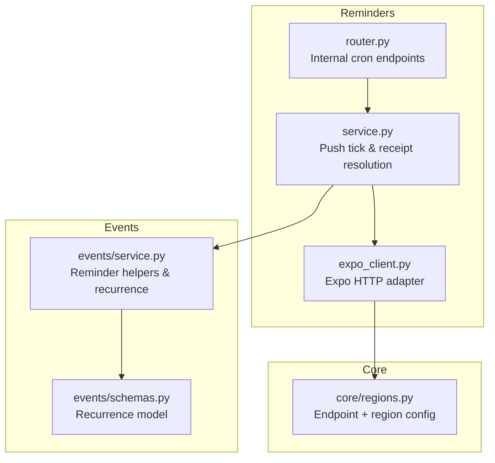
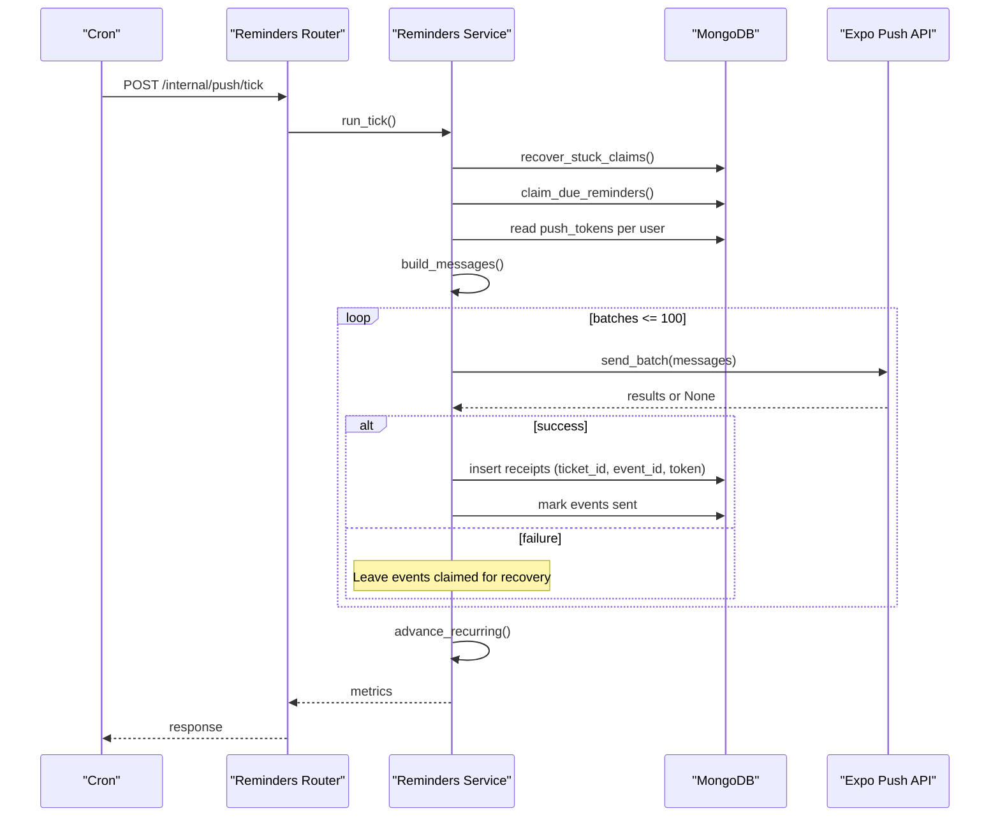
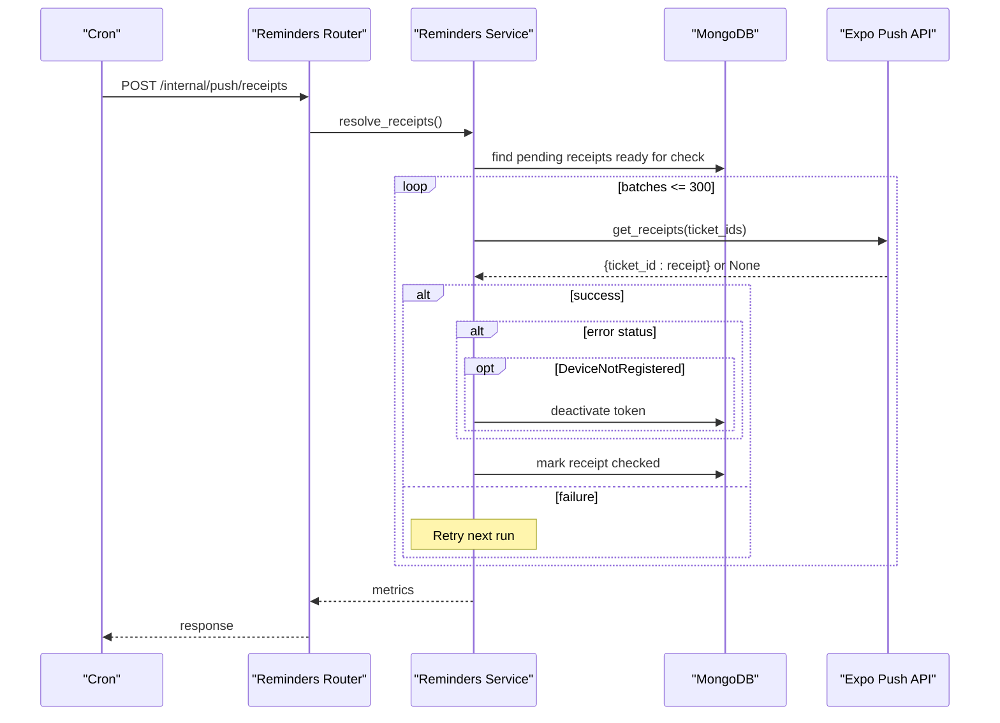
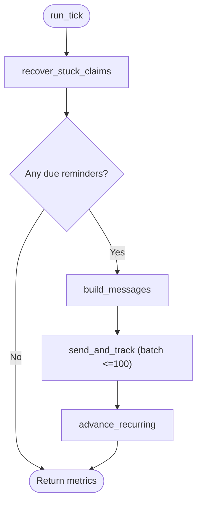
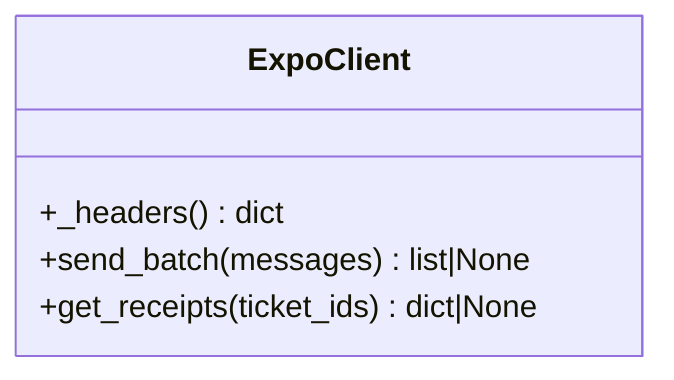
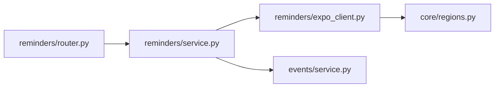

# Push Notification Delivery

<cite>
**Referenced Files in This Document**
- [expo_client.py](file://reminders/expo_client.py)
- [service.py](file://reminders/service.py)
- [router.py](file://reminders/router.py)
- [regions.py](file://core/regions.py)
- [service.py](file://events/service.py)
- [schemas.py](file://events/schemas.py)
</cite>

## Table of Contents
1. [Introduction](#introduction)
2. [Project Structure](#project-structure)
3. [Core Components](#core-components)
4. [Architecture Overview](#architecture-overview)
5. [Detailed Component Analysis](#detailed-component-analysis)
6. [Dependency Analysis](#dependency-analysis)
7. [Performance Considerations](#performance-considerations)
8. [Troubleshooting Guide](#troubleshooting-guide)
9. [Conclusion](#conclusion)

## Introduction
This document explains the push notification delivery system built on the Expo Push API for reminder notifications. It covers the end-to-end pipeline from event triggers to device delivery, including message construction, batch sending, receipt resolution, retry and recovery strategies, and operational safeguards such as region validation and rate-limiting via batching. It also documents platform-specific fields used in notifications and provides guidance for scheduling and high-volume delivery optimization.

## Project Structure
The push notification feature is implemented under reminders with a thin HTTP router exposing internal cron endpoints, a service orchestrating the delivery pipeline, and an Expo client adapter that encapsulates network calls to Expo’s send and receipts endpoints. Region configuration centralizes endpoint URLs and enforces Australian data residency. Event-related helpers compute reminder timing and recurrence.

**Diagram sources**
- [router.py:1-29](file://reminders/router.py#L1-L29)
- [service.py:1-215](file://reminders/service.py#L1-L215)
- [expo_client.py:1-50](file://reminders/expo_client.py#L1-L50)
- [regions.py:1-230](file://core/regions.py#L1-L230)
- [service.py:1-312](file://events/service.py#L1-L312)
- [schemas.py:1-101](file://events/schemas.py#L1-L101)

**Section sources**
- [router.py:1-29](file://reminders/router.py#L1-L29)
- [service.py:1-215](file://reminders/service.py#L1-L215)
- [expo_client.py:1-50](file://reminders/expo_client.py#L1-L50)
- [regions.py:1-230](file://core/regions.py#L1-L230)
- [service.py:1-312](file://events/service.py#L1-L312)
- [schemas.py:1-101](file://events/schemas.py#L1-L101)

## Core Components
- Reminders Router: Exposes protected internal endpoints to trigger push ticks and receipt resolution.
- Reminders Service: Implements the push pipeline (claim due reminders, build messages, send via Expo, track receipts, advance recurring events).
- Expo Client: Thin async HTTP wrapper over Expo’s send and receipts endpoints with optional bearer token and region-resolved URLs.
- Events Helpers: Provide reminder label formatting and recurrence calculation used when building messages and advancing recurring events.
- Region Config: Centralizes Expo endpoint URLs and enforces Australian region declarations at runtime.

Key responsibilities:
- Atomic claiming of due reminders to prevent duplicate sends.
- Batched sending to Expo (up to 100 per call).
- Storing ticket IDs for later receipt resolution.
- Handling DeviceNotRegistered by deactivating tokens.
- Recovering stuck claims if a prior tick crashed mid-process.
- Advancing recurring events to their next occurrence after sending.

**Section sources**
- [router.py:12-29](file://reminders/router.py#L12-L29)
- [service.py:37-177](file://reminders/service.py#L37-L177)
- [expo_client.py:18-49](file://reminders/expo_client.py#L18-L49)
- [service.py:28-35](file://events/service.py#L28-L35)
- [regions.py:194-199](file://core/regions.py#L194-L199)

## Architecture Overview
The system runs two cron-driven flows:
- Push Tick: Claims due reminders, builds Expo payloads, sends them in batches, records tickets, and advances recurring events.
- Receipts Resolution: Periodically queries Expo for delivery receipts, marks them checked, and deactivates tokens reported as unregistered.

**Diagram sources**
- [router.py:19-28](file://reminders/router.py#L19-L28)
- [service.py:44-177](file://reminders/service.py#L44-L177)
- [expo_client.py:26-37](file://reminders/expo_client.py#L26-L37)

**Diagram sources**
- [router.py:25-28](file://reminders/router.py#L25-L28)
- [service.py:181-214](file://reminders/service.py#L181-L214)
- [expo_client.py:39-49](file://reminders/expo_client.py#L39-L49)

## Detailed Component Analysis

### Reminders Service: Push Pipeline
- Recovery: Reclaims events stuck in “claimed” beyond a threshold back to “pending”.
- Claiming: Atomically claims due, pending reminders up to a cap per tick.
- Message Building: For each claimed event, reads active push tokens and constructs Expo payloads with title, body, sound, channel, and data payload. If no active tokens exist, marks the event as sent immediately.
- Sending and Tracking: Batches messages to Expo (max 100 per call), records successful ticket IDs, and marks processed events as sent. Handles DeviceNotRegistered by deactivating the token.
- Recurring Advance: Computes next occurrence using event recurrence rules and resets the event to pending with a new fire time.

**Diagram sources**
- [service.py:44-177](file://reminders/service.py#L44-L177)

**Section sources**
- [service.py:44-177](file://reminders/service.py#L44-L177)

### Expo Client: HTTP Adapter
- Headers: Sets content type and optional Authorization header from environment.
- send_batch: Posts up to 100 messages to Expo send URL; returns per-item results or None on transport errors.
- get_receipts: Posts up to 300 ticket IDs to Expo receipts URL; returns map of ticket_id to receipt or None on error.
- Timeouts: Uses a bounded timeout for requests.

**Diagram sources**
- [expo_client.py:18-49](file://reminders/expo_client.py#L18-L49)

**Section sources**
- [expo_client.py:18-49](file://reminders/expo_client.py#L18-L49)

### Router: Internal Cron Endpoints
- Authentication: Requires a shared secret via a custom header to protect internal endpoints.
- Endpoints:
  - POST /internal/push/tick: Triggers the push tick pipeline.
  - POST /internal/push/receipts: Triggers receipt resolution.

**Section sources**
- [router.py:12-29](file://reminders/router.py#L12-L29)

### Events Helpers: Reminder Labels and Recurrence
- reminder_label: Formats human-friendly labels for reminder intervals.
- next_occurrence_on_or_after: Calculates the next occurrence based on recurrence rules, handling timezone-aware transitions and caps on generated occurrences.

**Section sources**
- [service.py:28-35](file://events/service.py#L28-L35)
- [service.py:68-122](file://events/service.py#L68-L122)

### Region Configuration: Endpoint Safety
- Centralized accessors for Expo send and receipts URLs.
- Enforces HTTPS schemes and Australian region allowlist on every call.
- Startup validation ensures all required variables are present and valid.

**Section sources**
- [regions.py:194-199](file://core/regions.py#L194-L199)
- [regions.py:144-165](file://core/regions.py#L144-L165)

## Dependency Analysis
- Reminders Service depends on:
  - MongoDB for events, push_tokens, and push_receipts collections.
  - Expo Client for outbound HTTP calls to Expo.
  - Events helpers for reminder labeling and recurrence math.
- Expo Client depends on core regions for validated endpoint URLs.
- Router depends on FastAPI and the Reminders Service.

**Diagram sources**
- [router.py:1-29](file://reminders/router.py#L1-L29)
- [service.py:1-215](file://reminders/service.py#L1-L215)
- [expo_client.py:1-50](file://reminders/expo_client.py#L1-L50)
- [regions.py:1-230](file://core/regions.py#L1-L230)
- [service.py:1-312](file://events/service.py#L1-L312)

**Section sources**
- [router.py:1-29](file://reminders/router.py#L1-L29)
- [service.py:1-215](file://reminders/service.py#L1-L215)
- [expo_client.py:1-50](file://reminders/expo_client.py#L1-L50)
- [regions.py:1-230](file://core/regions.py#L1-L230)
- [service.py:1-312](file://events/service.py#L1-L312)

## Performance Considerations
- Batching:
  - Expo send: Up to 100 messages per request.
  - Receipts: Up to 300 ticket IDs per request.
- Throughput controls:
  - Maximum number of events claimed per tick to avoid unbounded processing.
  - Caps on receipt fetches per run.
- Network resilience:
  - Bounded timeouts on HTTP calls.
  - Whole-batch failures leave events claimed for recovery rather than marking partial failures.
- Database operations:
  - Atomic claim-and-update pattern prevents duplicate sends.
  - Bulk updates for marking events sent.
- Token hygiene:
  - Immediate deactivation of tokens flagged as DeviceNotRegistered during send or receipt resolution.

[No sources needed since this section provides general guidance]

## Troubleshooting Guide
Common issues and resolutions:
- Stuck claims:
  - Symptoms: Events remain in “claimed” state across multiple ticks.
  - Mechanism: A prior tick may have crashed between claim and send; recovery reverts them to “pending”.
  - Action: Ensure tick runs regularly; verify database connectivity and indexes.
- Transport failures to Expo:
  - Symptoms: Entire batch fails; events stay “claimed”.
  - Mechanism: Errors return None; events are retried on subsequent ticks via recovery.
  - Action: Check EXPO_PUSH_SEND_URL and EXPO_PUSH_REGION; monitor logs for network errors.
- Device not registered:
  - Symptoms: Notifications fail for specific tokens.
  - Mechanism: Tokens are deactivated on both immediate send errors and delayed receipt errors.
  - Action: Encourage users to re-register push tokens in the app.
- Receipts not resolving:
  - Symptoms: Ticket IDs remain unchecked.
  - Mechanism: Receipts become available after a delay; older unresolved receipts are eventually marked checked to stop chasing.
  - Action: Ensure receipts tick runs periodically; verify EXPO_PUSH_RECEIPTS_URL and region.

Operational tips:
- Protect internal endpoints with a strong PUSH_TICK_SECRET and validate X-Tick-Secret header.
- Monitor metrics returned by tick endpoints to track claimed, sent, and ticket counts.
- Validate region configuration at startup to prevent accidental traffic to non-Australian endpoints.

**Section sources**
- [service.py:44-50](file://reminders/service.py#L44-L50)
- [service.py:93-118](file://reminders/service.py#L93-L118)
- [service.py:181-214](file://reminders/service.py#L181-L214)
- [router.py:12-16](file://reminders/router.py#L12-L16)
- [regions.py:144-165](file://core/regions.py#L144-L165)

## Conclusion
The push notification delivery system implements a robust, batched, and resilient pipeline for reminder notifications using Expo Push. It ensures atomicity, handles transient failures gracefully, cleans up stale tokens, and supports recurring events with accurate scheduling. Region enforcement guarantees compliance with data residency requirements. By following the operational guidelines and monitoring key metrics, teams can maintain reliable delivery at scale while optimizing throughput through batching and careful resource management.