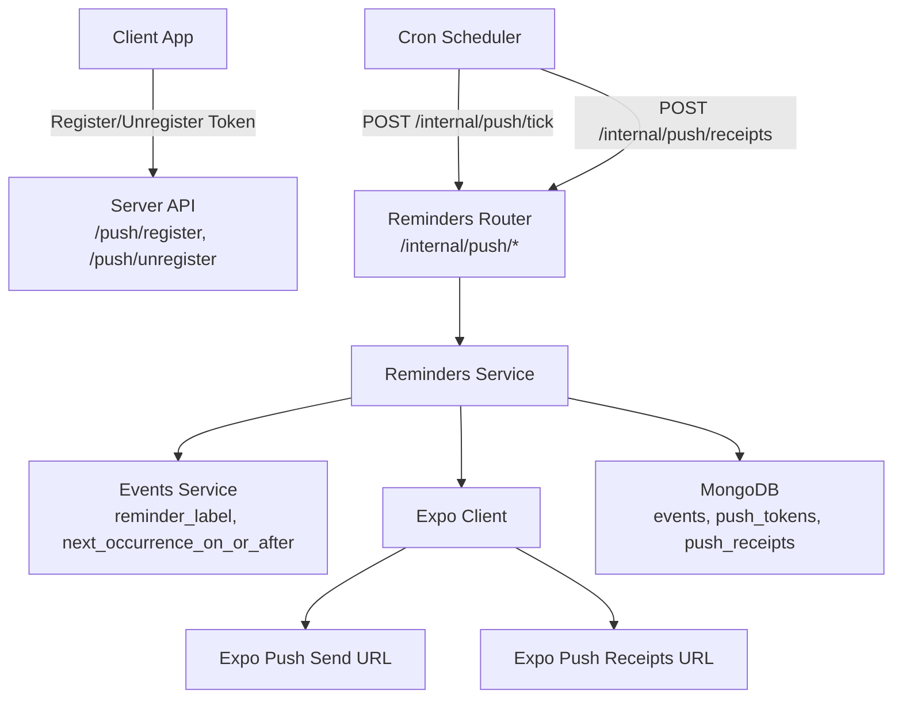
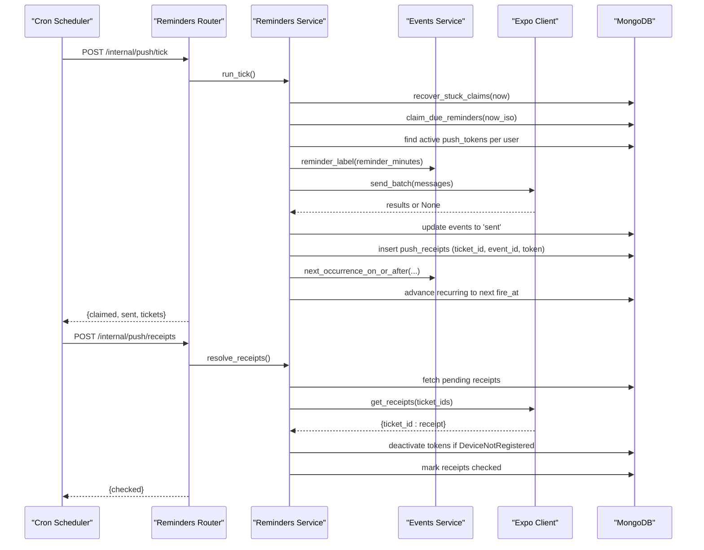
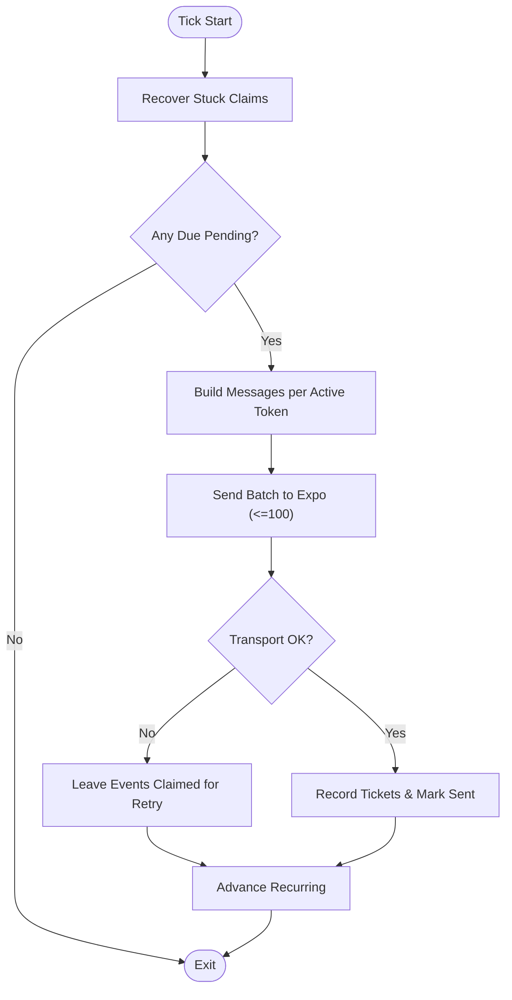
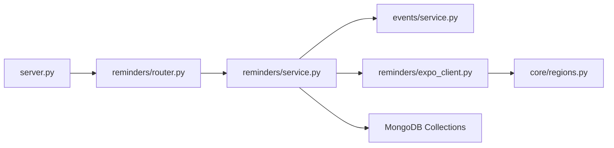

# Reminders & Notifications

<cite>
**Referenced Files in This Document**
- [server.py](file://server.py)
- [reminders/router.py](file://reminders/router.py)
- [reminders/service.py](file://reminders/service.py)
- [reminders/expo_client.py](file://reminders/expo_client.py)
- [events/service.py](file://events/service.py)
- [events/schemas.py](file://events/schemas.py)
- [core/regions.py](file://core/regions.py)
</cite>

## Table of Contents
1. [Introduction](#introduction)
2. [Project Structure](#project-structure)
3. [Core Components](#core-components)
4. [Architecture Overview](#architecture-overview)
5. [Detailed Component Analysis](#detailed-component-analysis)
6. [Dependency Analysis](#dependency-analysis)
7. [Performance Considerations](#performance-considerations)
8. [Troubleshooting Guide](#troubleshooting-guide)
9. [Conclusion](#conclusion)
10. [Appendices](#appendices)

## Introduction
This document explains the Reminders & Notifications sub-feature: how event reminders are scheduled, delivered as push notifications via Expo, and tracked to completion. It covers device token management, notification scheduling, the end-to-end delivery pipeline (including retry logic and failure handling), integration with the events system for automatic reminder triggering, batch processing, and delivery analytics. It also documents notification formatting, platform-specific considerations, user preference management, and operational concerns such as token expiration, delivery failures, and scaling for large user bases.

## Project Structure
The reminders feature is implemented across a small set of focused modules:
- Public API endpoints for registering/unregistering push tokens live in the main server file.
- Internal cron-style endpoints drive the reminder delivery tick and receipt resolution.
- The service layer orchestrates claiming due reminders, building messages, sending via Expo, tracking receipts, and advancing recurring reminders.
- A thin HTTP client adapts to Expo’s push endpoints, sourced from centralized region configuration.
- Events service provides recurrence math and reminder scheduling fields used by the reminder pipeline.

**Diagram sources**
- [server.py:126-162](file://server.py#L126-L162)
- [reminders/router.py:1-29](file://reminders/router.py#L1-L29)
- [reminders/service.py:37-177](file://reminders/service.py#L37-L177)
- [reminders/expo_client.py:18-49](file://reminders/expo_client.py#L18-L49)
- [events/service.py:33-53](file://events/service.py#L33-L53)
- [events/service.py:69-122](file://events/service.py#L69-L122)
- [core/regions.py:194-199](file://core/regions.py#L194-L199)

**Section sources**
- [server.py:126-162](file://server.py#L126-L162)
- [reminders/router.py:1-29](file://reminders/router.py#L1-L29)
- [reminders/service.py:37-177](file://reminders/service.py#L37-L177)
- [reminders/expo_client.py:18-49](file://reminders/expo_client.py#L18-L49)
- [events/service.py:33-53](file://events/service.py#L33-L53)
- [events/service.py:69-122](file://events/service.py#L69-L122)
- [core/regions.py:194-199](file://core/regions.py#L194-L199)

## Core Components
- Device token registration and unregistration: public endpoints that upsert or deactivate tokens per user.
- Reminder tick: internal endpoint that claims due reminders, builds push messages, sends them via Expo, records tickets, and advances recurring reminders.
- Receipt resolution: internal endpoint that polls Expo for delivery receipts, deactivates invalid tokens, and marks receipts as checked.
- Expo client: thin adapter over Expo’s send and getReceipts endpoints, using region-configured URLs and optional access token.
- Events integration: uses reminder scheduling fields computed at create/update time and recurrence helpers to schedule future occurrences.

Key responsibilities:
- Atomic claim-and-send to avoid duplicate deliveries.
- Batching to respect Expo limits and reduce network overhead.
- Robust error handling: transport failures leave events claimed for retry; per-item errors handled individually.
- Stuck claim recovery: reclaims events if a prior tick crashed mid-process.
- Recurring reminder roll-forward: computes next occurrence and reschedules.

**Section sources**
- [server.py:126-162](file://server.py#L126-L162)
- [reminders/router.py:12-28](file://reminders/router.py#L12-L28)
- [reminders/service.py:44-177](file://reminders/service.py#L44-L177)
- [reminders/expo_client.py:18-49](file://reminders/expo_client.py#L18-L49)
- [events/service.py:33-53](file://events/service.py#L33-L53)
- [events/service.py:69-122](file://events/service.py#L69-L122)
- [core/regions.py:194-199](file://core/regions.py#L194-L199)

## Architecture Overview
The reminder delivery pipeline runs on a cron-driven tick:
1. Recover stuck claims older than a threshold.
2. Atomically claim pending reminders whose fire time is now or earlier.
3. Build one push message per active device token for each claimed event.
4. Batch-send messages to Expo (up to 100 per call).
5. Record ticket IDs for later receipt polling; mark events sent when processed.
6. Advance recurring events to their next occurrence.
7. A separate receipts tick polls Expo for delivery status, deactivating tokens reported as unregistered.

**Diagram sources**
- [reminders/router.py:19-28](file://reminders/router.py#L19-L28)
- [reminders/service.py:44-177](file://reminders/service.py#L44-L177)
- [reminders/service.py:181-214](file://reminders/service.py#L181-L214)
- [reminders/expo_client.py:26-49](file://reminders/expo_client.py#L26-L49)
- [events/service.py:33-53](file://events/service.py#L33-L53)
- [events/service.py:69-122](file://events/service.py#L69-L122)

## Detailed Component Analysis

### Device Token Management
- Registration: Clients call a public endpoint to upsert a device token associated with the current user, including platform metadata. Tokens are deduplicated by user_id + token and marked active.
- Unregistration: Clients can mark a token inactive (e.g., on logout). Tokens are not deleted so late receipts can still be resolved against them.
- Active token selection: During reminder delivery, only active tokens are considered. If no active tokens exist, the reminder is immediately marked sent (nothing to deliver).

Operational notes:
- Indexes on push_tokens ensure efficient lookups by user and token.
- Tokens are deactivated automatically when Expo reports DeviceNotRegistered during send or receipt resolution.

**Section sources**
- [server.py:126-162](file://server.py#L126-L162)
- [reminders/service.py:72-77](file://reminders/service.py#L72-L77)
- [reminders/service.py:110-113](file://reminders/service.py#L110-L113)
- [reminders/service.py:206-210](file://reminders/service.py#L206-L210)
- [server.py:404-405](file://server.py#L404-L405)

### Notification Scheduling and Event Integration
- Reminder fields are computed at event creation/update: reminder_fire_at is derived from start_time minus reminder_minutes; status is set to pending or sent based on whether the fire time is in the past.
- The reminder tick claims due reminders atomically to prevent duplicates.
- For recurring events, after sending, the next occurrence is computed using recurrence rules and timezone-aware math, then rescheduled with updated fire times.

Platform/formatting details:
- Each push message includes a title and body constructed using reminder labels and event context.
- When encryption is enabled, titles fall back to a generic label to avoid showing ciphertext.
- Android channel ID and sound are included to support platform behavior.

**Section sources**
- [events/service.py:33-53](file://events/service.py#L33-L53)
- [events/service.py:69-122](file://events/service.py#L69-L122)
- [reminders/service.py:69-91](file://reminders/service.py#L69-L91)
- [reminders/service.py:120-158](file://reminders/service.py#L120-L158)

### Delivery Pipeline and Retry Logic
- Claim-and-send loop:
  - Claims due reminders in bounded batches to avoid runaway ticks.
  - Builds messages per active token; if none, marks event sent immediately.
  - Sends messages in batches of up to 100 to Expo.
  - Records ticket IDs for receipt polling; marks events sent when processed.
  - On transport failure (batch-level exception), events remain claimed for retry by stuck-claim recovery.
- Per-item error handling:
  - If Expo returns DeviceNotRegistered, the corresponding token is deactivated.
  - Other item errors are logged without failing the entire batch.
- Stuck claim recovery:
  - Any claims older than a threshold are reset to pending to allow retries.
- Receipt resolution:
  - Polls Expo for receipts after a delay window; prunes stale tickets after a timeout.
  - Deactivates tokens flagged as DeviceNotRegistered in receipts.

**Diagram sources**
- [reminders/service.py:44-177](file://reminders/service.py#L44-L177)
- [reminders/expo_client.py:26-37](file://reminders/expo_client.py#L26-L37)

**Section sources**
- [reminders/service.py:44-177](file://reminders/service.py#L44-L177)
- [reminders/expo_client.py:26-49](file://reminders/expo_client.py#L26-L49)

### Receipt Resolution and Failure Handling
- Fetches pending receipts that are ready for polling (after a minimum delay).
- Batches requests to Expo (up to 300 ticket IDs per call).
- Marks receipts as checked; deactivates tokens on DeviceNotRegistered.
- Stops chasing receipts older than a configured timeout.

**Section sources**
- [reminders/service.py:181-214](file://reminders/service.py#L181-L214)
- [reminders/expo_client.py:39-49](file://reminders/expo_client.py#L39-L49)

### Expo Client and Region Configuration
- Uses region-configured endpoints for send and receipts, validated at startup to enforce data residency.
- Optional EXPO_ACCESS_TOKEN header for secure access.
- Timeouts and error handling ensure robustness; failures return None to signal caller to retry later.

**Section sources**
- [reminders/expo_client.py:18-49](file://reminders/expo_client.py#L18-L49)
- [core/regions.py:194-199](file://core/regions.py#L194-L199)
- [core/regions.py:144-165](file://core/regions.py#L144-L165)

## Dependency Analysis
- Reminders router depends on RemindersService and database dependency injection.
- RemindersService depends on:
  - MongoDB collections: events, push_tokens, push_receipts.
  - Events service utilities for reminder labeling and recurrence calculation.
  - ExpoClient for outbound HTTP calls to Expo.
- ExpoClient depends on core.regions for validated endpoint URLs.
- Server exposes public endpoints for token lifecycle and includes routers for reminders.

**Diagram sources**
- [server.py:126-162](file://server.py#L126-L162)
- [reminders/router.py:1-29](file://reminders/router.py#L1-L29)
- [reminders/service.py:37-177](file://reminders/service.py#L37-L177)
- [reminders/expo_client.py:18-49](file://reminders/expo_client.py#L18-L49)
- [events/service.py:33-53](file://events/service.py#L33-L53)
- [core/regions.py:194-199](file://core/regions.py#L194-L199)

**Section sources**
- [server.py:126-162](file://server.py#L126-L162)
- [reminders/router.py:1-29](file://reminders/router.py#L1-L29)
- [reminders/service.py:37-177](file://reminders/service.py#L37-L177)
- [reminders/expo_client.py:18-49](file://reminders/expo_client.py#L18-L49)
- [events/service.py:33-53](file://events/service.py#L33-L53)
- [core/regions.py:194-199](file://core/regions.py#L194-L199)

## Performance Considerations
- Bounded claiming: Limits per-tick claims to avoid long-running ticks under heavy backlogs.
- Batching: Respects Expo limits (100 send items, 300 receipts) to minimize network overhead.
- Efficient token lookup: Queries active tokens per user with a capped list size.
- Minimal writes: Updates events in bulk where possible; avoids unnecessary re-computation of reminder fields unless timing changes.
- Receipt polling delays: Avoids premature polling; stops chasing old tickets to reduce load.

[No sources needed since this section provides general guidance]

## Troubleshooting Guide
Common issues and resolutions:
- Token expiration or device uninstall:
  - Symptoms: DeviceNotRegistered errors during send or receipt resolution.
  - Resolution: Tokens are automatically deactivated; prompt users to re-register tokens on app launch.
- Transport failures (rate limits, 5xx):
  - Symptoms: Entire batch fails; events remain claimed.
  - Resolution: Stuck claim recovery resets claims to pending; subsequent ticks retry automatically.
- Missing or misconfigured Expo endpoints:
  - Symptoms: Boot-time validation errors indicating missing or non-Australian regions.
  - Resolution: Ensure EXPO_PUSH_SEND_URL, EXPO_PUSH_RECEIPTS_URL, and EXPO_PUSH_REGION are set correctly.
- Duplicate reminders:
  - Symptoms: Multiple reminders for the same event.
  - Resolution: Verify atomic claim logic; ensure overlapping ticks do not double-claim due to race conditions.
- Excessive backlog:
  - Symptoms: Tick takes too long or misses intervals.
  - Resolution: Increase tick frequency or scale horizontally; tune MAX_CLAIM_PER_TICK and batch sizes.

**Section sources**
- [reminders/service.py:44-50](file://reminders/service.py#L44-L50)
- [reminders/service.py:93-118](file://reminders/service.py#L93-L118)
- [reminders/service.py:181-214](file://reminders/service.py#L181-L214)
- [core/regions.py:144-165](file://core/regions.py#L144-L165)

## Conclusion
The Reminders & Notifications subsystem provides a resilient, scalable pipeline for delivering event reminders via Expo push notifications. It integrates tightly with the events system to schedule reminders, supports recurring events with timezone-aware recurrence, and ensures reliable delivery through batching, receipt polling, and robust retry mechanisms. Device token management enables user preference control, while automated cleanup handles stale tokens. Operational safeguards like region validation and bounded processing make the system suitable for production use at scale.

[No sources needed since this section summarizes without analyzing specific files]

## Appendices

### Example Workflows

#### Register a Push Token
- Endpoint: POST /api/push/register
- Purpose: Associate a device token with the authenticated user and mark it active.
- Notes: Deduplicated by user_id + token; includes platform metadata.

**Section sources**
- [server.py:126-151](file://server.py#L126-L151)

#### Unregister a Push Token
- Endpoint: POST /api/push/unregister
- Purpose: Mark a token inactive (e.g., on logout).
- Notes: Tokens are retained to allow late receipt resolution.

**Section sources**
- [server.py:154-162](file://server.py#L154-L162)

#### Trigger Reminder Delivery (Internal)
- Endpoint: POST /internal/push/tick
- Purpose: Run the reminder delivery pipeline (cron-gated).
- Behavior: Claims due reminders, sends via Expo, records receipts, advances recurring events.

**Section sources**
- [reminders/router.py:19-22](file://reminders/router.py#L19-L22)
- [reminders/service.py:159-177](file://reminders/service.py#L159-L177)

#### Resolve Delivery Receipts (Internal)
- Endpoint: POST /internal/push/receipts
- Purpose: Poll Expo for delivery status and clean up invalid tokens.
- Behavior: Batches receipt queries, deactivates DeviceNotRegistered tokens, marks receipts checked.

**Section sources**
- [reminders/router.py:25-28](file://reminders/router.py#L25-L28)
- [reminders/service.py:181-214](file://reminders/service.py#L181-L214)

### Notification Formatting and Platform Considerations
- Title and body: Constructed using reminder labels and event context; fallback title used when content is encrypted.
- Sound and channel: Includes default sound and an Android channel ID to support platform behaviors.
- Data payload: Carries eventId and kind for client-side handling.

**Section sources**
- [reminders/service.py:72-91](file://reminders/service.py#L72-L91)
- [events/service.py:33-36](file://events/service.py#L33-L36)

### User Preference Management
- Token lifecycle: Users can register/unregister tokens to control delivery targets.
- Reminder preferences: Set via event creation/update (reminder_minutes); computed fields determine scheduling.
- Encryption awareness: Encrypted titles fall back to generic labels to avoid displaying ciphertext.

**Section sources**
- [server.py:126-162](file://server.py#L126-L162)
- [events/service.py:39-53](file://events/service.py#L39-L53)
- [reminders/service.py:78-81](file://reminders/service.py#L78-L81)

### Scaling Notification Delivery
- Bounded claiming and batching limit resource usage per tick.
- Separate receipts tick reduces contention and spreads work over time.
- Indexes on push_tokens optimize token lookups.
- Region validation ensures consistent external service routing.

**Section sources**
- [reminders/service.py:24-34](file://reminders/service.py#L24-L34)
- [reminders/service.py:93-118](file://reminders/service.py#L93-L118)
- [server.py:404-405](file://server.py#L404-L405)
- [core/regions.py:144-165](file://core/regions.py#L144-L165)