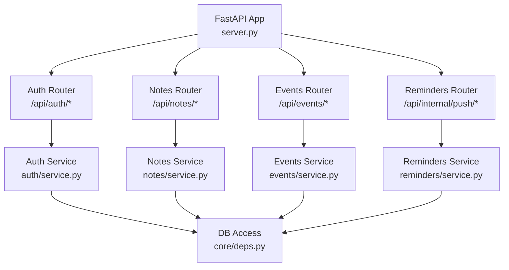
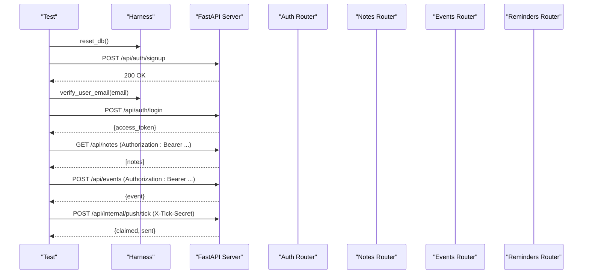
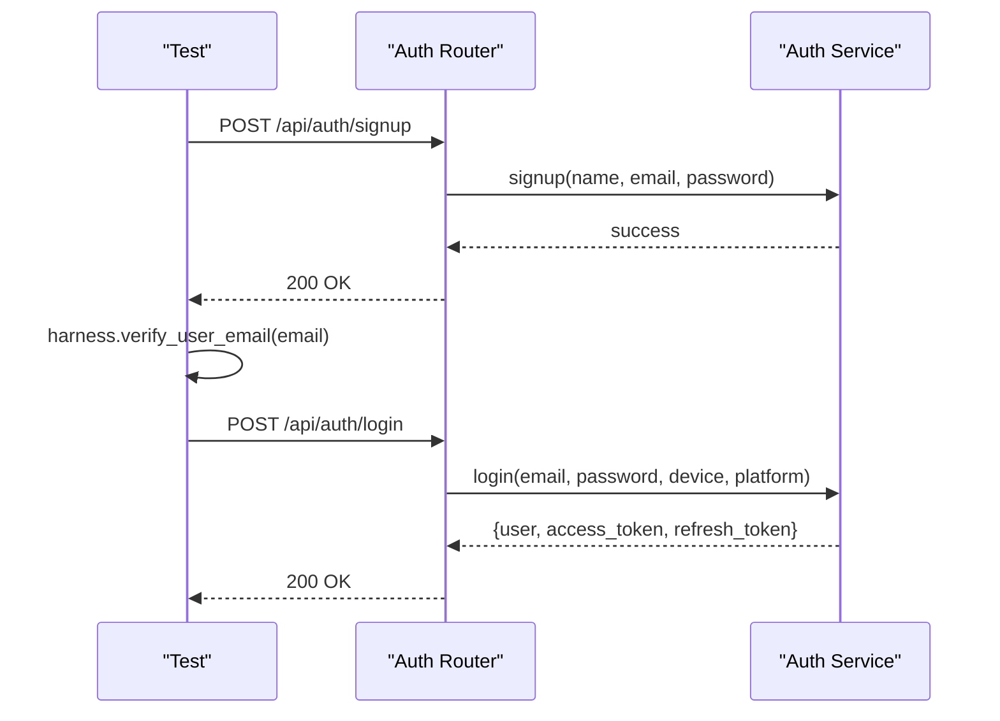
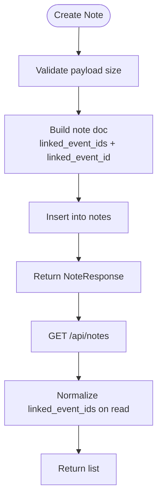
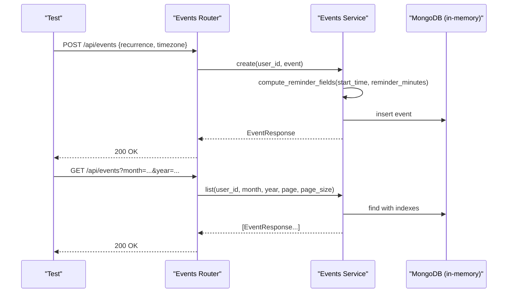
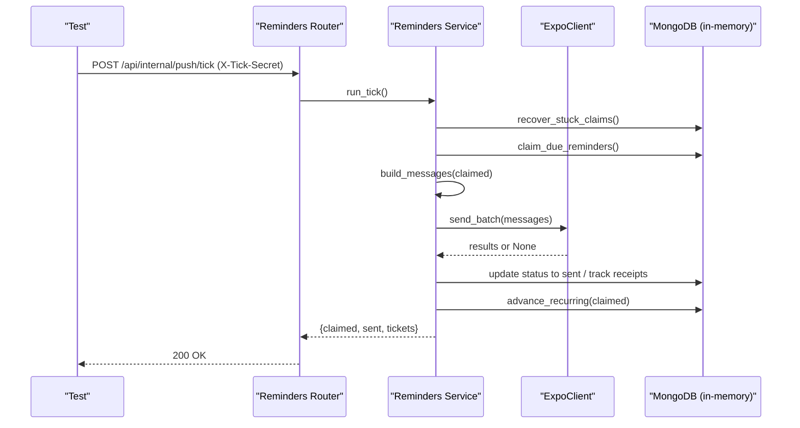
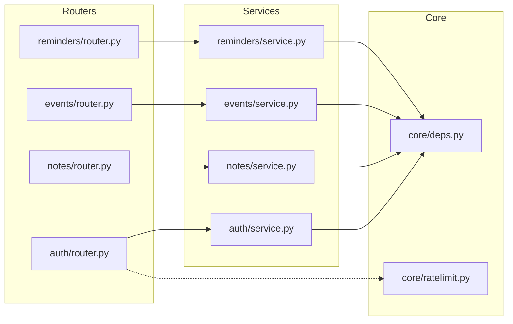

# Integration Testing

<cite>
**Referenced Files in This Document**
- [server.py](file://server.py)
- [auth/router.py](file://auth/router.py)
- [auth/service.py](file://auth/service.py)
- [core/deps.py](file://core/deps.py)
- [notes/router.py](file://notes/router.py)
- [notes/service.py](file://notes/service.py)
- [events/router.py](file://events/router.py)
- [events/service.py](file://events/service.py)
- [reminders/router.py](file://reminders/router.py)
- [reminders/service.py](file://reminders/service.py)
- [reminders/expo_client.py](file://reminders/expo_client.py)
- [tests/test_nueco_apis.py](file://tests/test_nueco_apis.py)
- [tests/test_regions.py](file://tests/test_regions.py)
</cite>

## Table of Contents
1. Introduction
2. Project Structure
3. Core Components
4. Architecture Overview
5. Detailed Component Analysis
6. Dependency Analysis
7. Performance Considerations
8. Troubleshooting Guide
9. Conclusion

## Introduction
This document explains how to run and extend integration tests for the Nueco Backend API. Tests execute the real FastAPI application in-process against an in-memory database via a shared test harness, so no live server or external MongoDB is required. The suite covers complete user workflows (registration, email verification, login), authenticated CRUD for notes and events, note-event linking, recurrence calculations, and push notification scheduling. It also shows how to simulate external services, handle rate limiting, manage test data lifecycle, and exercise asynchronous operations, database transactions, and concurrent request handling.

## Project Structure
The backend exposes a single FastAPI app that mounts feature routers under /api. Tests import a shared harness to boot the app with an in-memory database and issue HTTP requests through an async client. Authentication is enforced by a dependency that validates bearer tokens and resolves the current user from sessions stored in the database.

**Diagram sources**
- [server.py:170-214](file://server.py#L170-L214)
- [auth/router.py:93-140](file://auth/router.py#L93-L140)
- [notes/router.py:17-100](file://notes/router.py#L17-L100)
- [events/router.py:23-111](file://events/router.py#L23-L111)
- [reminders/router.py:19-28](file://reminders/router.py#L19-L28)
- [core/deps.py:15-51](file://core/deps.py#L15-L51)

**Section sources**
- [server.py:1-214](file://server.py#L1-L214)
- [tests/test_nueco_apis.py:1-84](file://tests/test_nueco_apis.py#L1-L84)

## Core Components
- Test harness usage: Tests bootstrap the app in-process, reset the database per test, create a unique X-Forwarded-For header to avoid cross-test signup rate limiting, sign up and verify a fresh user, log in, and attach the access token to subsequent requests.
- Authentication: get_current_user validates the Authorization header, verifies the JWT, and returns the user document. Endpoints depend on this to enforce authorization.
- Notes: Create, list, get, update, delete, and toggle pin. Supports dual read/write normalization between linked_event_id and linked_event_ids.
- Events: Create, list (with month/year filters), get, update, delete. Includes reminder fields and recurrence/timezone support.
- Reminders: Internal tick endpoint protected by a secret header; advances recurring reminders and sends push notifications via an injectable Expo client.

**Section sources**
- [tests/test_nueco_apis.py:54-84](file://tests/test_nueco_apis.py#L54-L84)
- [core/deps.py:24-51](file://core/deps.py#L24-L51)
- [notes/router.py:17-100](file://notes/router.py#L17-L100)
- [notes/service.py:67-111](file://notes/service.py#L67-L111)
- [events/router.py:23-111](file://events/router.py#L23-L111)
- [events/service.py:39-123](file://events/service.py#L39-L123)
- [reminders/router.py:12-28](file://reminders/router.py#L12-L28)

## Architecture Overview
Integration tests drive the full stack: HTTP requests traverse FastAPI routers into services, which persist to the in-memory database and call external adapters when needed. The test harness isolates state per test and provides helpers to verify emails and boot the server module for direct function-level assertions.

**Diagram sources**
- [tests/test_nueco_apis.py:54-84](file://tests/test_nueco_apis.py#L54-L84)
- [auth/router.py:93-140](file://auth/router.py#L93-L140)
- [notes/router.py:17-100](file://notes/router.py#L17-L100)
- [events/router.py:23-111](file://events/router.py#L23-L111)
- [reminders/router.py:19-28](file://reminders/router.py#L19-L28)

## Detailed Component Analysis

### Test Harness Setup and Data Lifecycle
- Per-test isolation: The fixture resets the database, generates a unique forwarded-for IP, creates a client, signs up, verifies, logs in, and attaches the access token.
- Email verification: The harness provides a helper to mark a user verified without sending real mail.
- Module-scoped server access: For direct unit-style checks of pure functions (e.g., next_occurrence_on_or_after), the harness boots the server module once per module scope.

How to use:
- Write tests using the api_client fixture to exercise endpoints end-to-end.
- Use the server_module fixture to call service functions directly when you need deterministic control over DB state or time-sensitive logic.

**Section sources**
- [tests/test_nueco_apis.py:54-84](file://tests/test_nueco_apis.py#L54-L84)
- [tests/test_nueco_apis.py:480-483](file://tests/test_nueco_apis.py#L480-L483)

### User Workflows: Registration, Verification, Login
- Signup: POST /api/auth/signup with name, email, password, confirm_password. Rate-limited per IP.
- Verification: Use harness.verify_user_email to mark the account verified without network calls.
- Login: POST /api/auth/login with email, password, device_name, platform. Returns access_token used for Authorization headers.

**Diagram sources**
- [auth/router.py:93-140](file://auth/router.py#L93-L140)
- [auth/service.py:107-149](file://auth/service.py#L107-L149)

**Section sources**
- [auth/router.py:93-140](file://auth/router.py#L93-L140)
- [auth/service.py:107-149](file://auth/service.py#L107-L149)
- [tests/test_nueco_apis.py:54-84](file://tests/test_nueco_apis.py#L54-L84)

### Authenticated Notes CRUD and Linking
- Create, Get, Update, Delete notes with proper Authorization headers.
- Toggle pin and verify pinned ordering.
- Dual field normalization: linked_event_id and linked_event_ids are kept in sync on create/update/list/get.

**Diagram sources**
- [notes/router.py:17-100](file://notes/router.py#L17-L100)
- [notes/service.py:67-111](file://notes/service.py#L67-L111)
- [notes/service.py:113-148](file://notes/service.py#L113-L148)

**Section sources**
- [notes/router.py:17-100](file://notes/router.py#L17-L100)
- [notes/service.py:67-111](file://notes/service.py#L67-L111)
- [tests/test_nueco_apis.py:98-300](file://tests/test_nueco_apis.py#L98-L300)

### Events CRUD, Filtering, Recurrence, Timezones
- Create events with optional recurrence and timezone; reminder fields are computed automatically.
- Filter events by month/year; pagination parameters supported.
- Update supports explicit nulls for fields like reminder_minutes and recurrence to clear them.
- Recurrence math: next_occurrence_on_or_after computes future occurrences respecting weekdays, until dates, and DST transitions.

**Diagram sources**
- [events/router.py:23-111](file://events/router.py#L23-L111)
- [events/service.py:39-123](file://events/service.py#L39-L123)
- [events/service.py:163-200](file://events/service.py#L163-L200)

**Section sources**
- [events/router.py:23-111](file://events/router.py#L23-L111)
- [events/service.py:39-123](file://events/service.py#L39-L123)
- [tests/test_nueco_apis.py:302-472](file://tests/test_nueco_apis.py#L302-L472)

### Push Notification Scheduling and Tick Processing
- Internal tick endpoint requires X-Tick-Secret header; otherwise forbidden.
- Tick flow: recover stuck claims, atomically claim due reminders, build messages, send via Expo, record receipts, advance recurring events to next occurrence.
- Concurrency safety: atomic claim prevents double-sending; overlapping ticks cannot double-advance because advancement operates only on the claimed set.

**Diagram sources**
- [reminders/router.py:12-28](file://reminders/router.py#L12-L28)
- [reminders/service.py:44-177](file://reminders/service.py#L44-L177)
- [reminders/expo_client.py:26-49](file://reminders/expo_client.py#L26-L49)

**Section sources**
- [reminders/router.py:12-28](file://reminders/router.py#L12-L28)
- [reminders/service.py:44-177](file://reminders/service.py#L44-L177)
- [tests/test_nueco_apis.py:602-800](file://tests/test_nueco_apis.py#L602-L800)

### Simulating External Services
- Expo push: Replace the default ExpoClient with a fake implementation that returns controlled results for send_batch and get_receipts. Inject it into RemindersService to test delivery paths without network calls.
- Email verification: Use harness.verify_user_email to bypass sending real emails during tests.
- Region validation: Ensure environment variables are declared and validated at startup; tests assert that missing or invalid values fail closed.

**Section sources**
- [reminders/expo_client.py:1-50](file://reminders/expo_client.py#L1-L50)
- [reminders/service.py:37-41](file://reminders/service.py#L37-L41)
- [tests/test_nueco_apis.py:602-610](file://tests/test_nueco_apis.py#L602-L610)
- [tests/test_regions.py:64-154](file://tests/test_regions.py#L64-L154)

### Handling Rate Limiting in Tests
- Auth rate limiter: Signups and logins are limited per IP and per email. Tests generate a unique X-Forwarded-For per test to avoid tripping limits across tests.
- AI endpoints: Sliding-window limiter protects shared quotas; tests can reset internal state via the limiter’s reset hook if needed.

**Section sources**
- [auth/router.py:22-84](file://auth/router.py#L22-L84)
- [tests/test_nueco_apis.py:54-84](file://tests/test_nueco_apis.py#L54-L84)
- [core/ratelimit.py:41-124](file://core/ratelimit.py#L41-L124)

### Testing Asynchronous Operations, Transactions, and Concurrency
- Async endpoints: All routes are async; tests use async fixtures and async clients.
- Database transactions: Atomic operations like find_one_and_update ensure safe claiming of reminders; tests assert idempotency and race conditions.
- Concurrent requests: Use asyncio.gather to fire multiple tick requests concurrently and assert that only one claim/advance occurs per due event.

**Section sources**
- [reminders/service.py:52-67](file://reminders/service.py#L52-L67)
- [tests/test_nueco_apis.py:758-800](file://tests/test_nueco_apis.py#L758-L800)

## Dependency Analysis
- Routers depend on services for business logic and core/deps for authentication and database access.
- Services depend on Motor for async DB operations and may depend on external clients (e.g., Expo).
- Tests depend on the harness to bootstrap the app and provide a consistent environment.

**Diagram sources**
- [auth/router.py:93-140](file://auth/router.py#L93-L140)
- [notes/router.py:17-100](file://notes/router.py#L17-L100)
- [events/router.py:23-111](file://events/router.py#L23-L111)
- [reminders/router.py:19-28](file://reminders/router.py#L19-L28)
- [auth/service.py:35-149](file://auth/service.py#L35-L149)
- [notes/service.py:79-111](file://notes/service.py#L79-L111)
- [events/service.py:163-200](file://events/service.py#L163-L200)
- [reminders/service.py:37-177](file://reminders/service.py#L37-L177)
- [core/deps.py:15-51](file://core/deps.py#L15-L51)
- [core/ratelimit.py:41-124](file://core/ratelimit.py#L41-L124)

**Section sources**
- [server.py:170-214](file://server.py#L170-L214)
- [core/deps.py:15-51](file://core/deps.py#L15-L51)

## Performance Considerations
- Indexes: The server creates compound indexes for notes and events to cover list queries and sorting, including tiebreakers to ensure stable paging. Tests should rely on these indexes for realistic performance behavior.
- Pagination: Events and notes endpoints support page and page_size; tests should validate boundary behavior and stability across pages.
- Payload caps: Notes and events enforce maximum sizes to prevent oversized documents; tests should include negative cases near caps.

**Section sources**
- [server.py:344-433](file://server.py#L344-L433)
- [notes/service.py:30-65](file://notes/service.py#L30-L65)
- [events/service.py:125-139](file://events/service.py#L125-L139)

## Troubleshooting Guide
- 401 Unauthorized: Ensure Authorization header uses Bearer token obtained from login. Verify token validity and session not revoked.
- 403 Forbidden: Internal tick endpoint requires correct X-Tick-Secret header; set PUSH_TICK_SECRET and pass matching header in tests.
- 429 Too Many Requests: Auth endpoints enforce per-IP and per-email limits; vary X-Forwarded-For per test to avoid cross-test collisions.
- 404 Not Found: Ensure resources exist before reading/updating; verify IDs returned by create calls.
- Email verification failures: Use harness.verify_user_email to mark accounts verified without sending real emails.

**Section sources**
- [core/deps.py:24-51](file://core/deps.py#L24-L51)
- [reminders/router.py:12-28](file://reminders/router.py#L12-L28)
- [auth/router.py:22-84](file://auth/router.py#L22-L84)
- [tests/test_nueco_apis.py:54-84](file://tests/test_nueco_apis.py#L54-L84)

## Conclusion
The integration test suite exercises the real FastAPI app in-process with an in-memory database, covering end-to-end user flows, resource CRUD, complex recurrence logic, and push notification scheduling. By leveraging the harness, injecting fakes for external services, and carefully managing rate limits and concurrency, you can reliably validate both functional correctness and robustness of the backend.