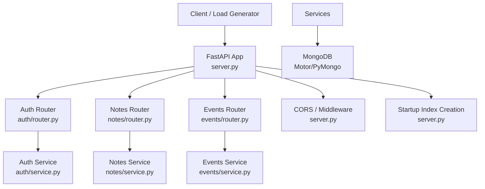
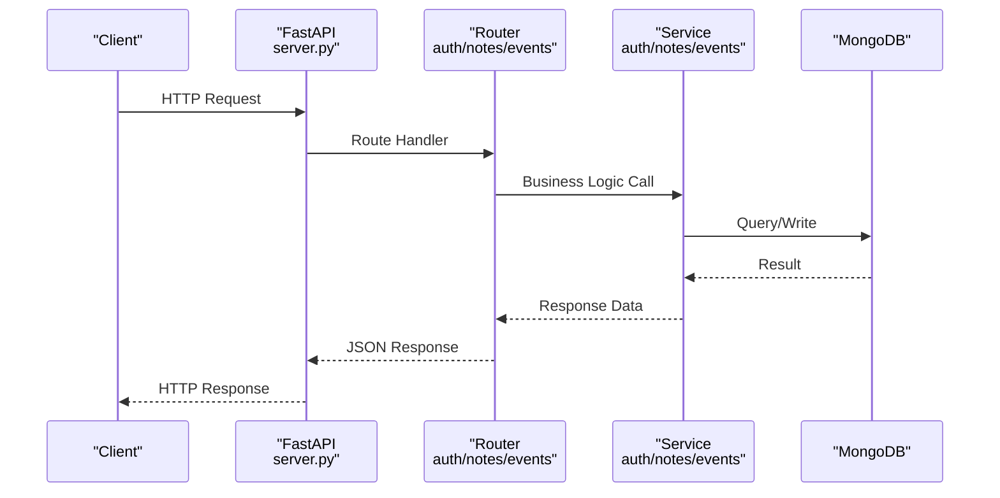
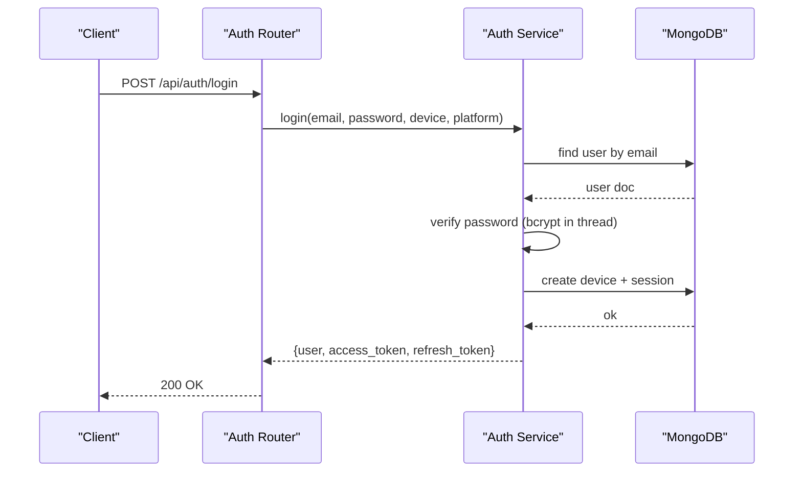
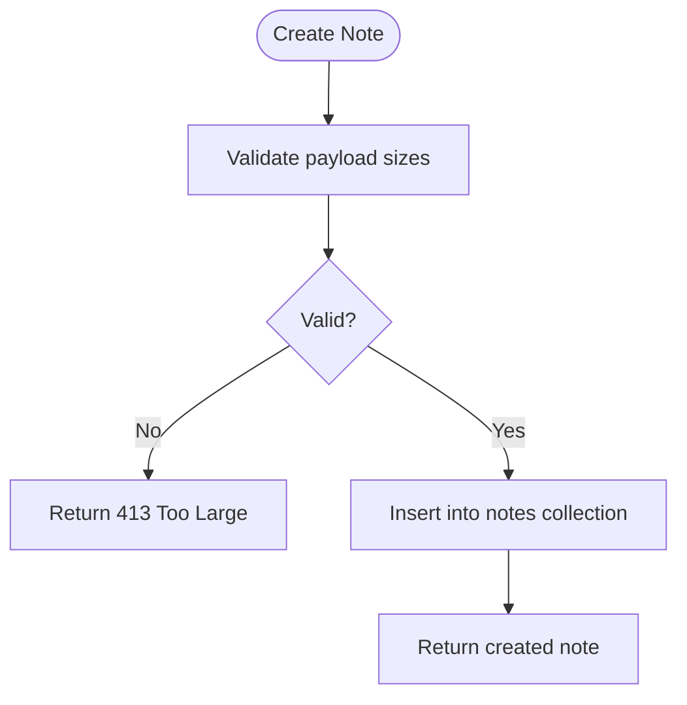
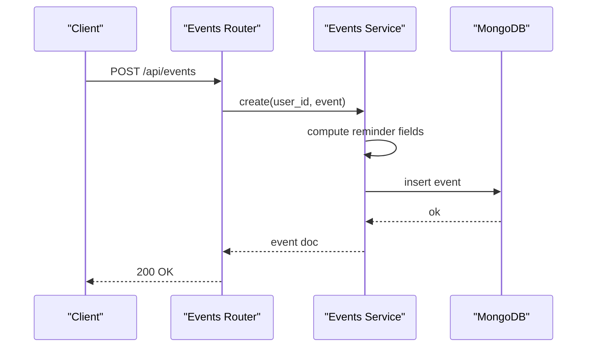
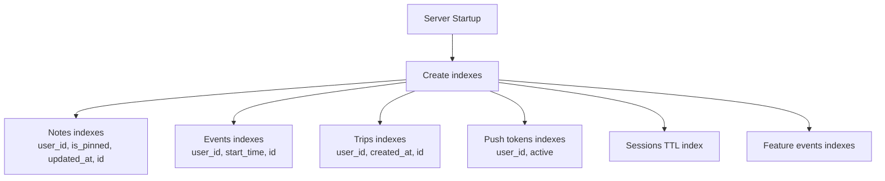
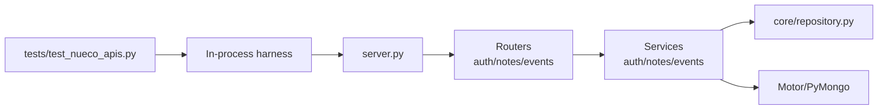

# Performance Testing

<cite>
**Referenced Files in This Document**
- [server.py](file://server.py)
- [auth/router.py](file://auth/router.py)
- [auth/service.py](file://auth/service.py)
- [notes/router.py](file://notes/router.py)
- [notes/service.py](file://notes/service.py)
- [events/router.py](file://events/router.py)
- [events/service.py](file://events/service.py)
- [core/deps.py](file://core/deps.py)
- [core/repository.py](file://core/repository.py)
- [tests/test_nueco_apis.py](file://tests/test_nueco_apis.py)
- [requirements.txt](file://requirements.txt)
</cite>

## Table of Contents
1. [Introduction](#introduction)
2. [Project Structure](#project-structure)
3. [Core Components](#core-components)
4. [Architecture Overview](#architecture-overview)
5. [Detailed Component Analysis](#detailed-component-analysis)
6. [Dependency Analysis](#dependency-analysis)
7. [Performance Considerations](#performance-considerations)
8. [Troubleshooting Guide](#troubleshooting-guide)
9. [Conclusion](#conclusion)
10. [Appendices](#appendices)

## Introduction
This document defines performance testing strategies for the Nueco Backend, focusing on:
- Load testing API endpoints (authentication, notes, events)
- Database query optimization and index coverage validation
- Memory usage profiling and payload size limits
- Concurrent user scenarios and response time measurement
- Identifying bottlenecks in MongoDB queries and external API calls
- Stress testing examples for authentication, bulk note creation, and event scheduling
- Monitoring tools and metrics collection during tests
- Scalability considerations, connection pooling efficiency, and resource cleanup in long-running suites

The backend is a FastAPI application with asynchronous I/O, Motor/PyMongo for MongoDB, JWT-based auth, and several feature routers (auth, notes, events, reminders, accounts, feedback, etc.). The server initializes database indexes at startup and includes rate limiting for auth endpoints.

## Project Structure
Key areas relevant to performance testing:
- Server bootstrap and middleware: health checks, CORS, index creation, background tasks
- Authentication router and service: login/signup, token refresh, rate limiting, bcrypt hashing offloaded to threads
- Notes and Events routers/services: CRUD operations, pagination, payload validation, indexing strategy
- Core dependencies: DB access and current-user resolution
- Tests: in-process harness using mongomock; useful patterns for isolated, repeatable test runs

**Diagram sources**
- [server.py:16-21](file://server.py#L16-L21)
- [server.py:338-433](file://server.py#L338-L433)
- [auth/router.py:20-140](file://auth/router.py#L20-L140)
- [notes/router.py:17-100](file://notes/router.py#L17-L100)
- [events/router.py:23-111](file://events/router.py#L23-L111)

**Section sources**
- [server.py:16-21](file://server.py#L16-L21)
- [server.py:338-433](file://server.py#L338-L433)
- [auth/router.py:20-140](file://auth/router.py#L20-L140)
- [notes/router.py:17-100](file://notes/router.py#L17-L100)
- [events/router.py:23-111](file://events/router.py#L23-L111)

## Core Components
- FastAPI app with an API router under /api, including health check and feature telemetry endpoints
- Authentication with JWT, session-bound tokens, and per-endpoint rate limiting
- Notes and Events services with strict payload size validation and paginated list endpoints
- Startup index creation for optimal query performance across collections
- Background tasks for cache prewarming, feature flag refresh, and job sweeping

**Section sources**
- [server.py:16-21](file://server.py#L16-L21)
- [server.py:107-123](file://server.py#L107-L123)
- [server.py:338-433](file://server.py#L338-L433)
- [auth/router.py:20-140](file://auth/router.py#L20-L140)
- [notes/service.py:30-51](file://notes/service.py#L30-L51)
- [events/service.py:125-139](file://events/service.py#L125-L139)

## Architecture Overview
The request flow involves:
- HTTP request enters FastAPI
- Optional middleware (CORS, anti-crawler)
- Route handler validates input and calls service layer
- Service performs business logic, payload validation, and persistence via Motor
- Responses are returned asynchronously

**Diagram sources**
- [server.py:16-21](file://server.py#L16-L21)
- [auth/router.py:115-140](file://auth/router.py#L115-L140)
- [notes/router.py:17-100](file://notes/router.py#L17-L100)
- [events/router.py:23-111](file://events/router.py#L23-L111)
- [auth/service.py:202-273](file://auth/service.py#L202-L273)
- [notes/service.py:83-148](file://notes/service.py#L83-L148)
- [events/service.py:167-247](file://events/service.py#L167-L247)

## Detailed Component Analysis

### Authentication Endpoints
- Login and signup enforce rate limits per IP and email to mitigate brute force and abuse
- Password hashing uses bcrypt with CPU-bound work offloaded to threads to avoid blocking the event loop
- Token refresh and logout manage sessions and invalidate tokens appropriately
- Current user dependency verifies bearer tokens and resolves user documents

**Diagram sources**
- [auth/router.py:115-140](file://auth/router.py#L115-L140)
- [auth/service.py:202-273](file://auth/service.py#L202-L273)
- [auth/service.py:50-61](file://auth/service.py#L50-L61)

**Section sources**
- [auth/router.py:20-140](file://auth/router.py#L20-L140)
- [auth/service.py:50-61](file://auth/service.py#L50-L61)
- [auth/service.py:202-273](file://auth/service.py#L202-L273)
- [core/deps.py:24-50](file://core/deps.py#L24-L50)

### Notes Endpoints
- Create, update, delete, toggle pin, and list notes
- Payload size validation prevents oversized requests that could exceed MongoDB’s document limit or consume excessive memory
- List endpoint uses explicit field projection and index-covered sorting for efficient pagination

**Diagram sources**
- [notes/router.py:17-28](file://notes/router.py#L17-L28)
- [notes/service.py:30-51](file://notes/service.py#L30-L51)
- [notes/service.py:83-111](file://notes/service.py#L83-L111)

**Section sources**
- [notes/router.py:17-100](file://notes/router.py#L17-L100)
- [notes/service.py:30-51](file://notes/service.py#L30-L51)
- [notes/service.py:83-148](file://notes/service.py#L83-L148)

### Events Endpoints
- Create, update, delete, list, and batch get events
- Reminder fields computed at write time; partial indexes optimize reminder scheduler queries
- Batch endpoint reduces N+1 queries when fetching multiple events

**Diagram sources**
- [events/router.py:23-34](file://events/router.py#L23-L34)
- [events/service.py:167-199](file://events/service.py#L167-L199)
- [events/service.py:39-53](file://events/service.py#L39-L53)

**Section sources**
- [events/router.py:23-111](file://events/router.py#L23-L111)
- [events/service.py:125-199](file://events/service.py#L125-L199)
- [events/service.py:201-247](file://events/service.py#L201-L247)

### Database Indexing Strategy
- Startup creates compound indexes to cover common queries and sorts, preventing in-memory sorts and ensuring deterministic paging
- Partial indexes optimize reminder scheduler queries by targeting only pending events
- TTL indexes automatically expire sessions

**Diagram sources**
- [server.py:344-433](file://server.py#L344-L433)

**Section sources**
- [server.py:344-433](file://server.py#L344-L433)

## Dependency Analysis
- FastAPI app depends on routers for each feature domain
- Routers depend on services for business logic
- Services depend on Motor/PyMongo for MongoDB operations
- Core dependencies provide DB access and current-user resolution
- Tests use an in-process harness with mongomock for isolation

**Diagram sources**
- [server.py:175-214](file://server.py#L175-L214)
- [core/repository.py:27-94](file://core/repository.py#L27-L94)
- [tests/test_nueco_apis.py:33-84](file://tests/test_nueco_apis.py#L33-L84)

**Section sources**
- [server.py:175-214](file://server.py#L175-L214)
- [core/repository.py:27-94](file://core/repository.py#L27-L94)
- [tests/test_nueco_apis.py:33-84](file://tests/test_nueco_apis.py#L33-L84)

## Performance Considerations

### Load Testing Strategies for API Endpoints
- Use a load generator (e.g., Locust, k6, or custom async clients) to simulate concurrent users
- Target endpoints:
  - Authentication: POST /api/auth/login, POST /api/auth/signup, POST /api/auth/refresh
  - Notes: POST /api/notes, GET /api/notes?page=...&page_size=..., PUT /api/notes/{id}, DELETE /api/notes/{id}
  - Events: POST /api/events, GET /api/events?month=&year=&page=...&page_size=..., POST /api/events/batch
- Measure p50/p95/p99 latency, error rates, and throughput under increasing concurrency
- Include warm-up phase to stabilize caches and connections

### Database Query Optimization Testing
- Validate index coverage for list endpoints:
  - Notes: sort by (is_pinned desc, updated_at desc, id asc) covered by compound index
  - Events: sort by (start_time asc, id asc) covered by compound index
- Use MongoDB explain plans to confirm index usage and absence of in-memory sorts
- Test pagination with large page sizes to ensure no blocking sorts occur
- Verify partial index effectiveness for reminder scheduler queries

### Memory Usage Profiling
- Monitor process memory growth during long-running tests
- Watch for memory spikes from large payloads (notes images base64, event descriptions)
- Enforce payload size caps to prevent exceeding MongoDB’s 16MB document limit
- Profile CPU-bound operations like bcrypt hashing; ensure they run off the event loop

### External API Calls
- Identify external dependencies (email, AI transcription, push notifications)
- Simulate slow or failing external APIs to measure impact on response times
- Use timeouts and retries where appropriate; monitor error rates and degradation

### Concurrent User Scenarios
- Simulate realistic user flows: login -> create notes -> schedule events -> list resources
- Vary concurrency levels to identify saturation points
- Ensure rate limiting does not cause false positives under load

### Measuring Response Times Under Load
- Track end-to-end latency per endpoint
- Break down latency into:
  - Network RTT
  - FastAPI processing time
  - Service logic time
  - Database query time
- Use APM tools or structured logging to capture timing metrics

### Identifying Bottlenecks
- MongoDB:
  - Check for full scans or in-memory sorts
  - Validate index selectivity and cardinality
  - Monitor query execution time and document scan counts
- CPU:
  - bcrypt hashing can block the event loop if not offloaded; verify threading usage
- I/O:
  - External API latency and failures
  - Disk I/O for file serving (APK, static files)

### Stress Testing Examples
- Authentication stress:
  - High volume login attempts with varied IPs and emails
  - Token refresh storms
- Bulk note creation:
  - Create many notes with varying payload sizes
  - Validate index coverage and pagination performance
- Event scheduling:
  - Create recurring events with different frequencies
  - Validate reminder computation and partial index usage

### Monitoring Tools and Metrics Collection
- Application logs with timestamps and request IDs
- Structured metrics for:
  - Request latency histograms
  - Error rates by endpoint
  - Database query durations
  - External API call durations
- Health check endpoint for liveness probes

### Scalability Considerations
- Horizontal scaling:
  - Stateless FastAPI workers behind a reverse proxy
  - Shared MongoDB cluster with proper sharding if needed
- Connection pooling:
  - Motor connection pool sizing tuned to worker count and concurrency
  - Avoid connection exhaustion under load
- Resource cleanup:
  - Close DB client on shutdown
  - Ensure background tasks complete gracefully

### Connection Pooling Efficiency
- Tune Motor client settings for concurrent requests
- Monitor connection usage and errors
- Validate that pool size matches expected concurrency

### Resource Cleanup in Long-Running Test Suites
- Reset database state between tests to avoid data leakage
- Close HTTP clients after each test
- Ensure background tasks do not interfere with subsequent tests

**Section sources**
- [server.py:344-433](file://server.py#L344-L433)
- [auth/service.py:50-61](file://auth/service.py#L50-L61)
- [notes/service.py:30-51](file://notes/service.py#L30-L51)
- [events/service.py:125-199](file://events/service.py#L125-L199)
- [server.py:462-465](file://server.py#L462-L465)

## Troubleshooting Guide
Common issues and how to diagnose them:
- Slow list endpoints:
  - Check index coverage and sort order
  - Use MongoDB explain to validate plan
- High CPU usage:
  - Verify bcrypt hashing is offloaded to threads
  - Profile CPU-bound operations
- Memory leaks:
  - Monitor process memory over time
  - Check for large payloads or unclosed resources
- Rate limiting errors:
  - Adjust thresholds for load tests
  - Ensure unique IPs per test instance
- External API failures:
  - Mock or stub external services in tests
  - Add timeouts and retries

**Section sources**
- [auth/router.py:20-84](file://auth/router.py#L20-L84)
- [auth/service.py:50-61](file://auth/service.py#L50-L61)
- [server.py:344-433](file://server.py#L344-L433)

## Conclusion
The Nueco Backend provides a solid foundation for performance testing with clear separation of concerns, robust indexing, and payload validation. By applying the strategies outlined here—load testing, query optimization, memory profiling, and monitoring—you can identify and address bottlenecks effectively. Focus on index coverage, offloading CPU-bound work, and managing external dependencies to maintain high performance under load.

## Appendices

### Example Test Scenarios
- Authentication:
  - Simulate 100 concurrent users performing login and token refresh
  - Measure latency and error rates
- Notes:
  - Create 1000 notes with varying payload sizes
  - Validate list endpoint performance with pagination
- Events:
  - Create recurring events with daily/weekly/monthly frequencies
  - Test batch retrieval and reminder computation

**Section sources**
- [tests/test_nueco_apis.py:33-84](file://tests/test_nueco_apis.py#L33-L84)
- [notes/router.py:17-100](file://notes/router.py#L17-L100)
- [events/router.py:23-111](file://events/router.py#L23-L111)