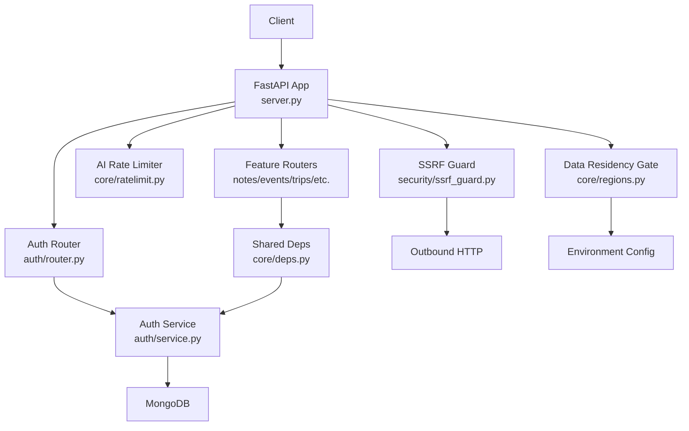
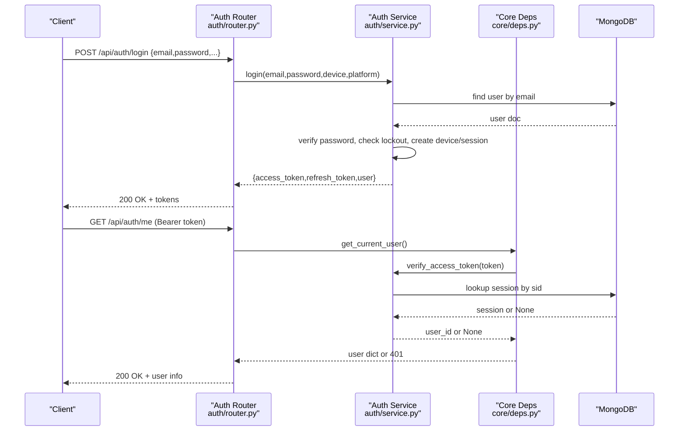
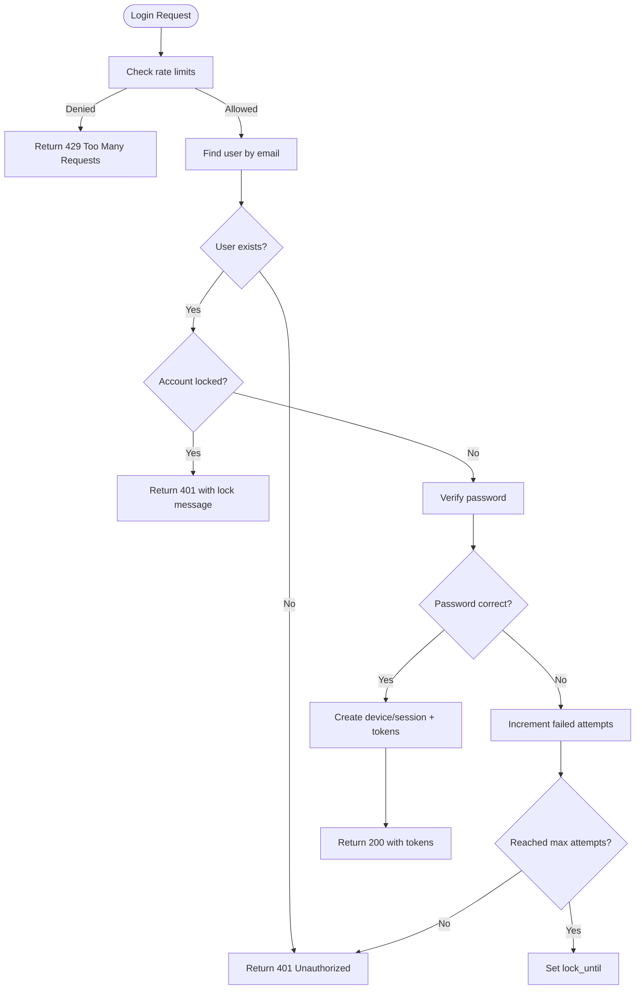
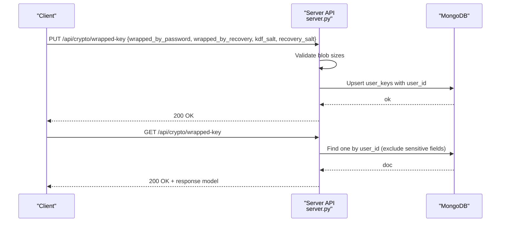
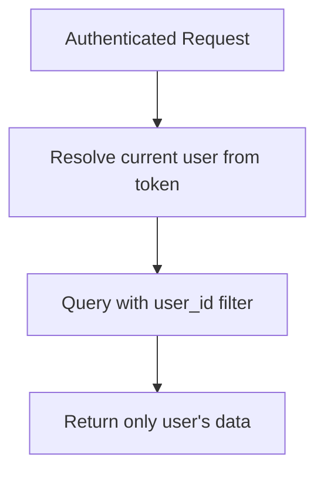
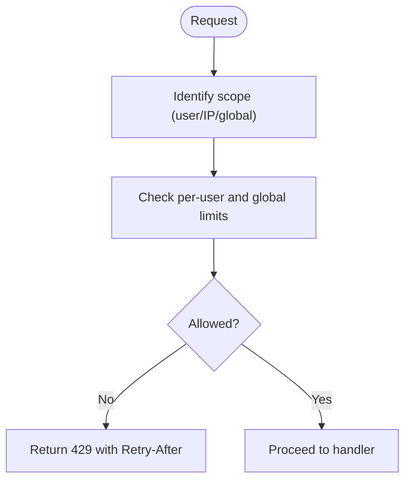
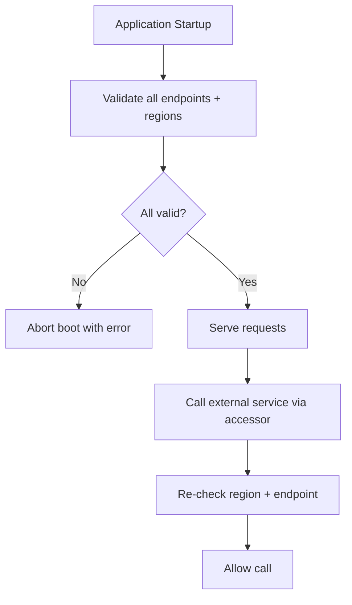
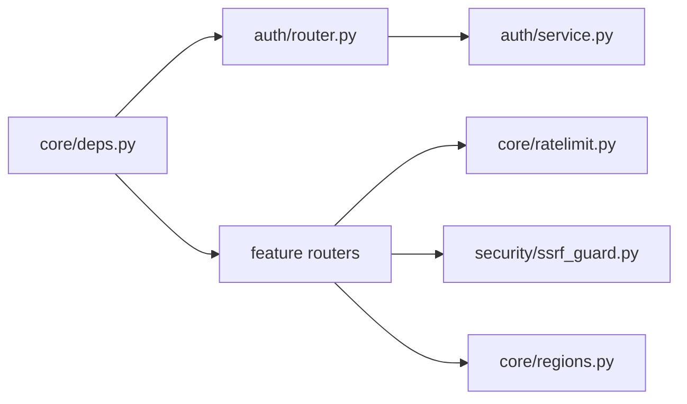

# Security Testing

<cite>
**Referenced Files in This Document**
- [server.py](file://server.py)
- [auth/router.py](file://auth/router.py)
- [auth/service.py](file://auth/service.py)
- [core/deps.py](file://core/deps.py)
- [core/ratelimit.py](file://core/ratelimit.py)
- [security/ssrf_guard.py](file://security/ssrf_guard.py)
- [core/regions.py](file://core/regions.py)
- [tests/test_nueco_apis.py](file://tests/test_nueco_apis.py)
</cite>

## Table of Contents
1. [Introduction](#introduction)
2. [Project Structure](#project-structure)
3. [Core Components](#core-components)
4. [Architecture Overview](#architecture-overview)
5. [Detailed Component Analysis](#detailed-component-analysis)
6. [Dependency Analysis](#dependency-analysis)
7. [Performance Considerations](#performance-considerations)
8. [Troubleshooting Guide](#troubleshooting-guide)
9. [Conclusion](#conclusion)
10. [Appendices](#appendices)

## Introduction
This document provides security testing guidance for the Nueco Backend, focusing on authentication and authorization (JWT validation, session binding, rate limiting), end-to-end encryption workflows, data isolation, input validation, rate limiting, CORS configuration, protection against common vulnerabilities (SSRF, injection risks), external service integration safeguards, and compliance checks for data residency. It also outlines how to integrate security scanning tools, conduct penetration tests, and validate privacy-related controls.

## Project Structure
The backend is a FastAPI application with modular routers per feature area. Authentication and authorization are centralized under auth/, shared dependencies under core/, and security utilities under security/. The server wires up middleware, routes, startup tasks, and indexes.

**Diagram sources**
- [server.py:20-214](file://server.py#L20-L214)
- [auth/router.py:20-366](file://auth/router.py#L20-L366)
- [auth/service.py:35-506](file://auth/service.py#L35-L506)
- [core/deps.py:15-51](file://core/deps.py#L15-L51)
- [core/ratelimit.py:41-124](file://core/ratelimit.py#L41-L124)
- [security/ssrf_guard.py:67-109](file://security/ssrf_guard.py#L67-L109)
- [core/regions.py:144-181](file://core/regions.py#L144-L181)

**Section sources**
- [server.py:20-214](file://server.py#L20-L214)

## Core Components
- Authentication and Authorization: JWT access tokens bound to sessions; refresh token lifecycle; login lockout; email verification flows.
- Rate Limiting: Per-route in-process limits for auth endpoints; sliding-window limiter for AI endpoints with per-user and global quotas.
- SSRF Protection: Safe outbound fetching with scheme checks, DNS resolution, private IP blocking, and redirect revalidation.
- Data Residency: Startup enforcement that all external-service endpoints and regions are declared and Australian-compliant.
- CORS: Configurable allowed origins and headers via environment.
- Input Validation: Pydantic models enforce types and constraints; size caps on sensitive blobs; explicit error handling.

**Section sources**
- [auth/service.py:63-84](file://auth/service.py#L63-L84)
- [auth/service.py:202-273](file://auth/service.py#L202-L273)
- [auth/service.py:424-460](file://auth/service.py#L424-L460)
- [auth/service.py:469-494](file://auth/service.py#L469-L494)
- [auth/router.py:23-84](file://auth/router.py#L23-L84)
- [core/ratelimit.py:41-124](file://core/ratelimit.py#L41-L124)
- [security/ssrf_guard.py:67-109](file://security/ssrf_guard.py#L67-L109)
- [core/regions.py:144-181](file://core/regions.py#L144-L181)
- [server.py:320-330](file://server.py#L320-L330)

## Architecture Overview
Authentication flow uses bearer tokens validated by a shared dependency that verifies JWT signature, type, session binding, and session validity. Protected routes depend on this dependency to resolve the current user.

**Diagram sources**
- [auth/router.py:115-140](file://auth/router.py#L115-L140)
- [auth/router.py:323-326](file://auth/router.py#L323-L326)
- [auth/service.py:202-273](file://auth/service.py#L202-L273)
- [auth/service.py:469-494](file://auth/service.py#L469-L494)
- [core/deps.py:24-51](file://core/deps.py#L24-L51)

## Detailed Component Analysis

### Authentication and Authorization Testing
- JWT Validation:
  - Verify access tokens require correct algorithm, type claim, and expiration.
  - Validate session binding: tokens include a session id; logout invalidates the session and revokes tokens early.
  - Test refresh token flow: ensure only valid, non-expired sessions can be refreshed and new access tokens are issued.
- Login Hardening:
  - Account lockout after repeated failures; verify lock duration and reset on success.
  - Email verification required before login; test unverified account behavior.
- Password Handling:
  - Confirm passwords are hashed using bcrypt with appropriate cost.
  - Enforce minimum length and confirmation match at request boundaries.
- Session Management:
  - Refresh tokens stored as hashes; ensure logout deletes sessions and prevents reuse.
  - Verify TTL-based session expiry and cleanup.

**Diagram sources**
- [auth/router.py:115-140](file://auth/router.py#L115-L140)
- [auth/service.py:202-273](file://auth/service.py#L202-L273)

**Section sources**
- [auth/service.py:50-84](file://auth/service.py#L50-L84)
- [auth/service.py:202-273](file://auth/service.py#L202-L273)
- [auth/service.py:424-460](file://auth/service.py#L424-L460)
- [auth/service.py:469-494](file://auth/service.py#L469-L494)
- [core/deps.py:24-51](file://core/deps.py#L24-L51)

### End-to-End Encryption Workflow Testing
- Key Escrow:
  - Verify endpoints accept only opaque wrapped-key blobs and metadata; enforce size limits to prevent abuse.
  - Ensure only authenticated users can store/retrieve their own keys.
- Server Privacy:
  - Confirm server never receives plaintext notes or unwrapped keys; it stores only encrypted payloads and salts.
- Update Name with Encrypted Payload:
  - When client pushes an encrypted name, confirm enc_version is recorded and server cannot read plaintext.

**Diagram sources**
- [server.py:75-104](file://server.py#L75-L104)

**Section sources**
- [server.py:46-104](file://server.py#L46-L104)

### Data Isolation Between Users
- User-scoped queries:
  - All feature endpoints should filter by user_id when reading/writing data.
  - Tests should assert that one user cannot access another’s resources.
- Indexes:
  - Ensure indexes exist for efficient user-scoped queries (e.g., notes, events, trips).

[No diagram sources needed since this diagram shows conceptual workflow]

**Section sources**
- [server.py:344-423](file://server.py#L344-L423)
- [tests/test_nueco_apis.py:54-84](file://tests/test_nueco_apis.py#L54-L84)

### Input Sanitization and Validation
- Pydantic Models:
  - Use typed request/response models to enforce structure and types.
  - Validate emails, strings, lists, booleans, and defaults.
- Size Limits:
  - Enforce maximum sizes for sensitive payloads (e.g., wrapped key blobs, event metadata).
- Error Responses:
  - Return appropriate status codes (e.g., 400 for validation errors, 413 for too large).

**Section sources**
- [auth/schemas.py:1-80](file://auth/schemas.py#L1-L80)
- [server.py:75-115](file://server.py#L75-L115)

### Rate Limiting Testing
- Auth Endpoints:
  - Per-email and per-IP limits for login, signup, and password resets.
  - Verify 429 responses when limits exceeded.
- AI Endpoints:
  - Sliding window limiter enforces per-user quotas and a global cap to protect shared provider quota.
  - Verify Retry-After semantics and endpoint-specific scoping.

**Diagram sources**
- [core/ratelimit.py:41-124](file://core/ratelimit.py#L41-L124)
- [auth/router.py:23-84](file://auth/router.py#L23-L84)

**Section sources**
- [auth/router.py:23-84](file://auth/router.py#L23-L84)
- [core/ratelimit.py:41-124](file://core/ratelimit.py#L41-L124)

### CORS Configuration Testing
- Allowed Origins:
  - Configure exact origins in production; avoid wildcard unless explicitly intended.
- Headers and Methods:
  - Ensure only necessary methods and headers are allowed.
- Credentials:
  - If credentials are allowed, restrict origins accordingly.

**Section sources**
- [server.py:320-330](file://server.py#L320-L330)

### Protection Against Common Vulnerabilities
- SSRF:
  - Validate schemes (http/https), reject private/internal IPs, and revalidate on every redirect hop.
  - Test with internal URLs, DNS rebinding scenarios, and redirects to private addresses.
- Injection Risks:
  - Use parameterized queries via the ORM and strict schemas to mitigate SQL injection.
  - Avoid rendering user input directly into HTML without escaping; sanitize any dynamic content.
- XSS:
  - Do not embed unsanitized user input in HTML responses; use templating frameworks safely.

**Section sources**
- [security/ssrf_guard.py:67-109](file://security/ssrf_guard.py#L67-L109)

### External Service Integration Security
- Data Residency Enforcement:
  - On startup, validate that all external-service endpoints and region declarations are present and Australian-compliant; abort if not.
  - Re-validate on each call to ensure no bypass.
- Endpoint Safety:
  - Only registered services with declared endpoints and regions can be accessed through typed accessors.

**Diagram sources**
- [core/regions.py:144-181](file://core/regions.py#L144-L181)
- [server.py:333-341](file://server.py#L333-L341)

**Section sources**
- [core/regions.py:144-181](file://core/regions.py#L144-L181)
- [server.py:333-341](file://server.py#L333-L341)

### Penetration Testing Approaches
- Authentication Bypass:
  - Attempt to access protected endpoints without tokens, with expired tokens, and with tokens bound to revoked sessions.
- Token Manipulation:
  - Try altering JWT claims, swapping session ids, and replaying refresh tokens.
- Rate Limit Evasion:
  - Test across multiple IPs and accounts to ensure limits hold.
- SSRF:
  - Probe internal endpoints, loopback addresses, and DNS rebinding vectors.
- Injection:
  - Inject payloads into text fields and observe query construction and output rendering.
- CORS:
  - Send cross-origin requests with various origins and headers to validate restrictions.

[No sources needed since this section provides general guidance]

### Compliance Testing for Data Privacy
- Data Residency:
  - Verify that all external-service calls target approved regions and endpoints; fail closed if misconfigured.
- Minimal Data Storage:
  - Confirm server stores only necessary metadata and encrypted payloads; avoid storing plaintext secrets.
- Auditability:
  - Ensure logs do not capture sensitive data (passwords, tokens, keys).

**Section sources**
- [core/regions.py:144-181](file://core/regions.py#L144-L181)
- [server.py:46-104](file://server.py#L46-L104)

## Dependency Analysis
- Authentication depends on shared dependency resolver to extract and validate bearer tokens.
- Feature routers rely on the same dependency for user resolution and database access.
- AI endpoints depend on the sliding-window limiter to protect shared provider quotas.
- SSRF guard is used wherever user-influenced URLs are fetched.
- Data residency module centralizes external service configuration and validation.

**Diagram sources**
- [core/deps.py:15-51](file://core/deps.py#L15-L51)
- [auth/router.py:20-366](file://auth/router.py#L20-L366)
- [auth/service.py:35-506](file://auth/service.py#L35-L506)
- [core/ratelimit.py:41-124](file://core/ratelimit.py#L41-L124)
- [security/ssrf_guard.py:67-109](file://security/ssrf_guard.py#L67-L109)
- [core/regions.py:144-181](file://core/regions.py#L144-L181)

**Section sources**
- [core/deps.py:15-51](file://core/deps.py#L15-L51)
- [auth/router.py:20-366](file://auth/router.py#L20-L366)
- [auth/service.py:35-506](file://auth/service.py#L35-L506)
- [core/ratelimit.py:41-124](file://core/ratelimit.py#L41-L124)
- [security/ssrf_guard.py:67-109](file://security/ssrf_guard.py#L67-L109)
- [core/regions.py:144-181](file://core/regions.py#L144-L181)

## Performance Considerations
- JWT Verification:
  - Session-bound tokens reduce risk but add DB lookups; ensure indexes on session identifiers and TTL fields.
- Rate Limiting:
  - In-process limiters are fast but not shared across replicas; consider Redis for horizontal scaling.
- SSRF Checks:
  - DNS resolution and redirect revalidation incur latency; cache results judiciously where safe.
- Data Residency:
  - Startup validation ensures correctness; keep registry minimal to reduce overhead.

[No sources needed since this section provides general guidance]

## Troubleshooting Guide
- Authentication Failures:
  - Missing or malformed Authorization header returns 401.
  - Invalid/expired tokens or revoked sessions return 401.
- Rate Limiting:
  - 429 responses indicate exceeding limits; adjust client retry logic based on Retry-After.
- SSRF Errors:
  - Invalid scheme, unreachable host, or redirect issues raise specific errors; inspect URL and network path.
- Data Residency:
  - Boot failure indicates missing or non-Australian region declarations; fix environment variables.

**Section sources**
- [core/deps.py:24-51](file://core/deps.py#L24-L51)
- [auth/router.py:23-84](file://auth/router.py#L23-L84)
- [security/ssrf_guard.py:67-109](file://security/ssrf_guard.py#L67-L109)
- [core/regions.py:144-181](file://core/regions.py#L144-L181)

## Conclusion
The Nueco Backend implements robust security controls including JWT-based authentication with session binding, comprehensive rate limiting, SSRF protection, and strict data residency enforcement. Testing should cover authentication flows, encryption workflows, data isolation, input validation, rate limiting, CORS, vulnerability protections, and external service integrations. Integrating automated security scans and structured penetration tests will further strengthen assurance.

[No sources needed since this section summarizes without analyzing specific files]

## Appendices

### Security Scanning Tools Integration
- Static Application Security Testing (SAST):
  - Integrate linters and SAST tools into CI to detect insecure patterns early.
- Dynamic Application Security Testing (DAST):
  - Run DAST against staging environments to identify runtime issues like misconfigurations.
- Dependency Scanning:
  - Regularly scan dependencies for known vulnerabilities and update promptly.

[No sources needed since this section provides general guidance]

### Example Test Scenarios
- Authentication:
  - Verify login with correct/incorrect credentials, email verification states, and lockout behavior.
  - Test token refresh and logout invalidation.
- Authorization:
  - Access protected endpoints without tokens, with expired tokens, and with tokens bound to revoked sessions.
- Data Isolation:
  - Create two users and assert cross-user access is denied.
- Input Validation:
  - Submit oversized payloads and malformed inputs; verify appropriate error responses.
- Rate Limiting:
  - Exceed per-email/per-IP limits and verify 429 responses.
- SSRF:
  - Attempt to fetch internal URLs and follow redirects to private addresses; expect rejection.
- CORS:
  - Send cross-origin requests with disallowed origins and headers; expect rejection.
- Data Residency:
  - Misconfigure region variables and verify boot failure.

**Section sources**
- [tests/test_nueco_apis.py:54-84](file://tests/test_nueco_apis.py#L54-L84)
- [auth/router.py:23-84](file://auth/router.py#L23-L84)
- [security/ssrf_guard.py:67-109](file://security/ssrf_guard.py#L67-L109)
- [core/regions.py:144-181](file://core/regions.py#L144-L181)