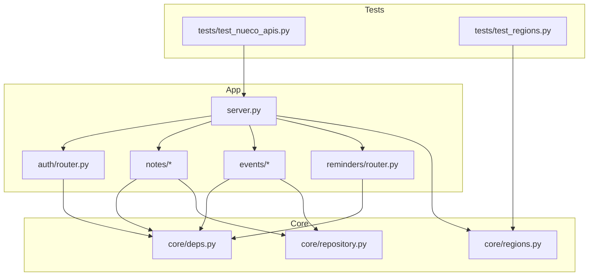
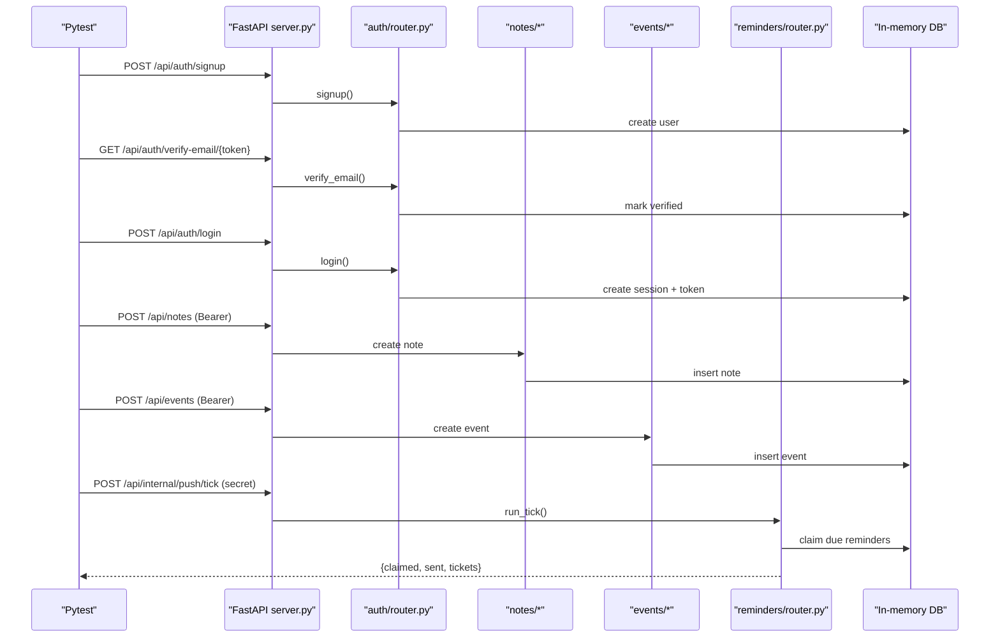
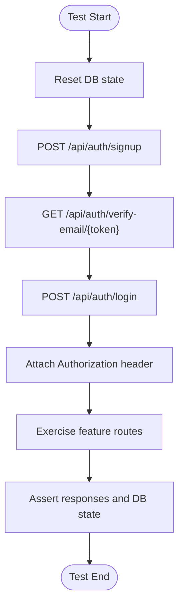
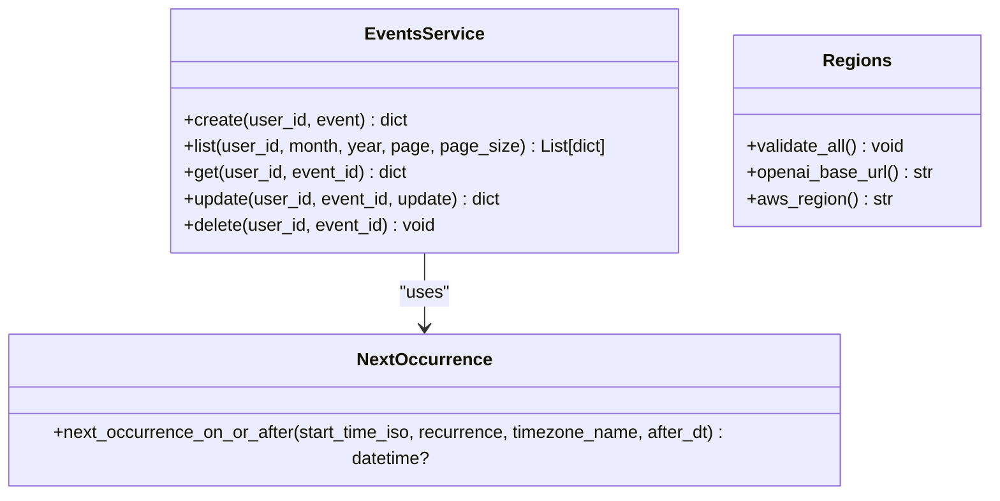
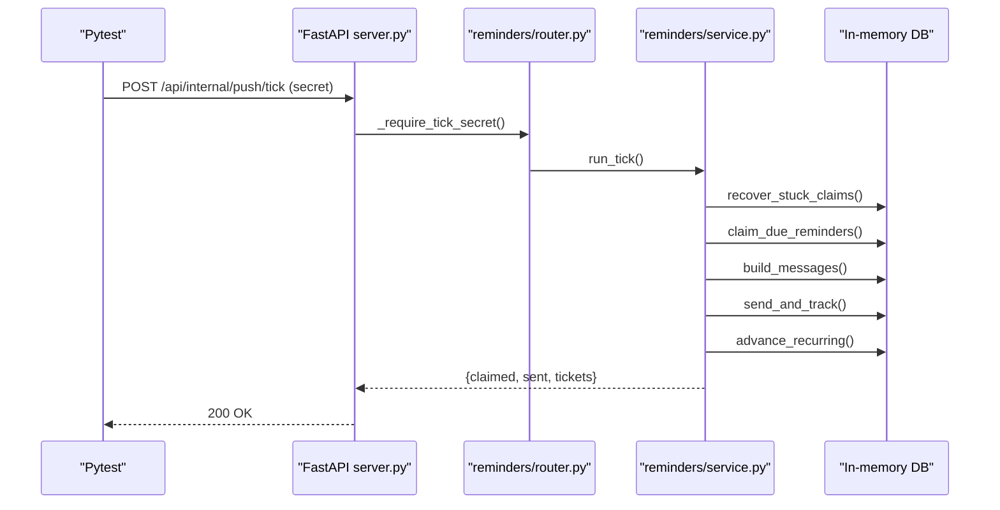
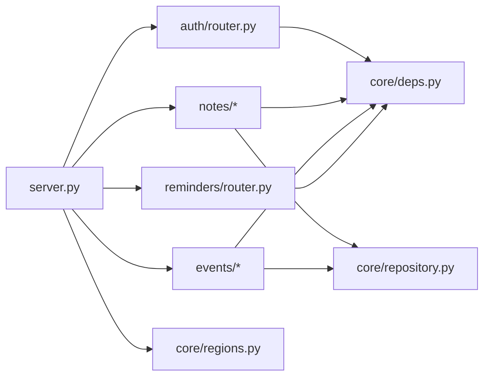

# Testing Strategy

<cite>
**Referenced Files in This Document**
- [server.py](file://server.py)
- [core/deps.py](file://core/deps.py)
- [core/repository.py](file://core/repository.py)
- [core/regions.py](file://core/regions.py)
- [auth/router.py](file://auth/router.py)
- [auth/service.py](file://auth/service.py)
- [notes/service.py](file://notes/service.py)
- [events/service.py](file://events/service.py)
- [reminders/service.py](file://reminders/service.py)
- [reminders/router.py](file://reminders/router.py)
- [tests/test_nueco_apis.py](file://tests/test_nueco_apis.py)
- [tests/test_regions.py](file://tests/test_regions.py)
- [requirements.txt](file://requirements.txt)
</cite>

## Table of Contents
1. Introduction
2. Project Structure
3. Core Components
4. Architecture Overview
5. Detailed Component Analysis
6. Dependency Analysis
7. Performance Considerations
8. Troubleshooting Guide
9. Conclusion
10. Appendices

## Introduction
This document defines the testing strategy for the Nueco Backend, covering unit tests, integration tests, and end-to-end (E2E) tests. It explains how to set up the test framework, mock external dependencies (MongoDB and third-party APIs), manage test data, and validate authenticated endpoints, encryption workflows, and asynchronous operations. It also covers performance and load testing approaches, security testing procedures, continuous integration setup, automated pipelines, reporting, and guidance for maintainable tests and debugging failures.

## Project Structure
The backend is a FastAPI application with modular routers and services. Tests currently live under tests/ and exercise both pure functions and full HTTP routes against an in-process app backed by an in-memory database. Key areas:
- server.py: Application bootstrap, routers, startup tasks, indexes, and middleware
- core/: Shared infrastructure (dependencies, user-scoped repository, region enforcement)
- auth/, notes/, events/, reminders/: Feature modules with routers and services
- tests/: Pytest-based tests exercising API routes and domain logic

**Diagram sources**
- [server.py:170-214](file://server.py#L170-L214)
- [core/deps.py:15-51](file://core/deps.py#L15-L51)
- [core/repository.py:27-95](file://core/repository.py#L27-L95)
- [core/regions.py:144-165](file://core/regions.py#L144-L165)
- [auth/router.py:93-140](file://auth/router.py#L93-L140)
- [reminders/router.py:19-28](file://reminders/router.py#L19-L28)

**Section sources**
- [server.py:1-465](file://server.py#L1-L465)
- [core/deps.py:1-51](file://core/deps.py#L1-L51)
- [core/repository.py:1-95](file://core/repository.py#L1-L95)
- [core/regions.py:1-230](file://core/regions.py#L1-L230)
- [auth/router.py:1-366](file://auth/router.py#L1-L366)
- [reminders/router.py:1-29](file://reminders/router.py#L1-L29)

## Core Components
- Authentication and authorization: JWT-based access tokens validated via core dependency; rate limiting on auth endpoints; session-bound tokens for revocation support.
- Data scoping: User-scoped collection wrapper ensures every query includes tenant predicate to prevent cross-account leaks.
- Region enforcement: Centralized validation of external service endpoints and regions at boot; fail-closed if misconfigured.
- Reminder pipeline: Atomic claim-and-send loop with receipt resolution and recurrence advancement.

Testing implications:
- Authenticated endpoints require valid Bearer tokens; tests must sign up, verify email, and log in per fixture.
- External services are isolated via environment configuration and mocked where possible (e.g., Expo client injection).
- MongoDB interactions are exercised against an in-memory store during tests to avoid real DB usage.

**Section sources**
- [core/deps.py:24-51](file://core/deps.py#L24-L51)
- [core/repository.py:27-95](file://core/repository.py#L27-L95)
- [core/regions.py:144-165](file://core/regions.py#L144-L165)
- [auth/router.py:22-84](file://auth/router.py#L22-L84)
- [reminders/service.py:52-177](file://reminders/service.py#L52-L177)

## Architecture Overview
The test suite uses an in-process FastAPI app with an in-memory database to run E2E-style tests without network egress or live services. Unit tests target pure functions like recurrence computation and region validation. Integration tests cover CRUD flows and scheduler behavior through HTTP routes.

**Diagram sources**
- [tests/test_nueco_apis.py:54-84](file://tests/test_nueco_apis.py#L54-L84)
- [auth/router.py:93-140](file://auth/router.py#L93-L140)
- [notes/service.py:83-111](file://notes/service.py#L83-L111)
- [events/service.py:167-199](file://events/service.py#L167-L199)
- [reminders/router.py:19-28](file://reminders/router.py#L19-L28)
- [reminders/service.py:159-177](file://reminders/service.py#L159-L177)

## Detailed Component Analysis

### End-to-End Testing Strategy
- In-process app execution: Tests start the FastAPI app in-process and issue HTTP requests against it, avoiding network calls and live databases.
- Isolation: Each test gets a fresh database state and a unique user with a distinct X-Forwarded-For header to bypass per-IP rate limits.
- Authentication flow: Fixture signs up a user, verifies email, logs in, and attaches the Bearer token to subsequent requests.
- Coverage: Health check, Notes CRUD, Events CRUD/filtering, linked_event_ids normalization, recurrence/timezone fields, and push tick scheduling.

**Diagram sources**
- [tests/test_nueco_apis.py:54-84](file://tests/test_nueco_apis.py#L54-L84)
- [auth/router.py:93-140](file://auth/router.py#L93-L140)

**Section sources**
- [tests/test_nueco_apis.py:1-800](file://tests/test_nueco_apis.py#L1-L800)

### Unit Testing Strategy
- Pure function tests: Recurrence calculation and timezone handling are tested directly against the service module without HTTP.
- Region validation: Environment-driven configuration is validated with fixtures that assert missing/malformed values raise errors and valid configs pass.

**Diagram sources**
- [events/service.py:69-122](file://events/service.py#L69-L122)
- [events/service.py:163-312](file://events/service.py#L163-L312)
- [core/regions.py:144-165](file://core/regions.py#L144-L165)

**Section sources**
- [tests/test_nueco_apis.py:474-589](file://tests/test_nueco_apis.py#L474-L589)
- [tests/test_regions.py:1-201](file://tests/test_regions.py#L1-L201)
- [events/service.py:69-122](file://events/service.py#L69-L122)
- [core/regions.py:144-165](file://core/regions.py#L144-L165)

### Integration Testing Strategy
- CRUD verification: Create resources via POST, then retrieve via GET to confirm persistence and field normalization.
- Filtering and pagination: Validate list endpoints return expected subsets and ordering.
- Scheduler integration: Seed events into the in-memory DB and invoke internal tick endpoint to assert atomic claim, send, and recurrence advancement.

**Diagram sources**
- [reminders/router.py:12-28](file://reminders/router.py#L12-L28)
- [reminders/service.py:44-177](file://reminders/service.py#L44-L177)

**Section sources**
- [tests/test_nueco_apis.py:602-800](file://tests/test_nueco_apis.py#L602-L800)
- [reminders/service.py:44-177](file://reminders/service.py#L44-L177)

### Mocking Strategies for External Dependencies
- MongoDB: Use an in-memory database via the test harness to avoid real connections; all queries go through Motor but operate in memory.
- Third-party APIs: Inject a fake ExpoClient into the reminder service to simulate push delivery and receipts without network calls.
- Region enforcement: Provide environment variables pointing to non-production hosts (example.invalid) to satisfy validation without real network access.

Guidelines:
- Prefer dependency injection over global patching when possible (e.g., passing db and expo_client).
- Keep mocks deterministic and minimal; assert only what matters for correctness.
- For region checks, use .invalid domains to ensure no real DNS lookups occur.

**Section sources**
- [reminders/service.py:37-41](file://reminders/service.py#L37-L41)
- [tests/test_regions.py:24-43](file://tests/test_regions.py#L24-L43)
- [core/regions.py:144-165](file://core/regions.py#L144-L165)

### Test Data Management
- Per-test isolation: Fixture resets DB state and creates a unique user per test to avoid cross-test interference.
- Unique identifiers: Generate random emails and device names to prevent collisions and rate-limit triggers.
- Seeding for scheduler tests: Insert event documents directly into the in-memory DB to control reminder timing and status for precise assertions.

Best practices:
- Keep test data small and focused on the scenario under test.
- Use explicit fixtures for common setups (user, headers, secrets).
- Avoid shared mutable state across tests.

**Section sources**
- [tests/test_nueco_apis.py:54-84](file://tests/test_nueco_apis.py#L54-L84)
- [tests/test_nueco_apis.py:612-646](file://tests/test_nueco_apis.py#L612-L646)

### Testing Authenticated Endpoints
- Fixture pattern: Sign up, verify email, log in, and attach Bearer token to the client for subsequent requests.
- Rate limiting: Use distinct X-Forwarded-For per test to avoid hitting IP-based limits during test runs.
- Token lifecycle: Ensure refresh and logout flows are covered by dedicated tests if needed.

Example patterns:
- Health check: Unauthenticated route returns healthy status.
- Protected routes: Require Authorization header; invalid or missing tokens yield 401.

**Section sources**
- [tests/test_nueco_apis.py:54-95](file://tests/test_nueco_apis.py#L54-L95)
- [auth/router.py:93-140](file://auth/router.py#L93-L140)
- [core/deps.py:24-51](file://core/deps.py#L24-L51)

### Testing Encryption Workflows (E2EE)
- Wrapped key escrow: Store opaque wrapped-key blobs via authenticated endpoints; verify retrieval and size limits.
- Metadata-only telemetry: Record feature events with capped metadata to ensure no plaintext content is stored server-side.
- Push title fallback: When notes are encrypted, reminders use generic titles; tests can assert this behavior indirectly via event creation with enc_version.

Recommendations:
- Add tests that assert size caps and error codes for oversized payloads.
- Validate that encrypted fields do not leak plaintext in responses or logs.

**Section sources**
- [server.py:46-123](file://server.py#L46-L123)
- [events/service.py:167-199](file://events/service.py#L167-L199)
- [reminders/service.py:78-91](file://reminders/service.py#L78-L91)

### Testing Asynchronous Operations
- Async services: Note and event services perform async DB operations; tests should await responses and verify final states.
- Scheduler concurrency: Overlapping tick invocations are tested to ensure atomic claims prevent double-sends and double-advances.

Approach:
- Use asyncio.gather to simulate concurrent ticks and assert idempotency and correctness.
- Validate internal DB fields (reminder_status, reminder_fire_at) via direct queries in tests.

**Section sources**
- [tests/test_nueco_apis.py:758-800](file://tests/test_nueco_apis.py#L758-L800)
- [reminders/service.py:52-67](file://reminders/service.py#L52-L67)

### Performance Testing Approaches
- Database indexing: Startup creates compound indexes to cover list and sort queries; tests can validate index presence and query plans if needed.
- Payload sizing: Services enforce ciphertext headroom and object counts; add boundary tests to ensure 413 responses for oversized inputs.
- Throughput: Simulate high request rates using parallel clients to measure latency and resource usage; monitor CPU and memory spikes from bcrypt hashing.

Recommendations:
- Profile slow paths (bcrypt hashing, large image uploads).
- Use load testing tools (e.g., Locust) to generate realistic traffic patterns and capture p95/p99 latencies.

**Section sources**
- [server.py:344-433](file://server.py#L344-L433)
- [notes/service.py:30-50](file://notes/service.py#L30-L50)
- [auth/service.py:50-61](file://auth/service.py#L50-L61)

### Load Testing Scenarios
- Auth burst: Rapid signups/logins to validate rate limiter behavior and response times.
- CRUD stress: Bulk create/update/delete notes and events to assess DB performance and index effectiveness.
- Reminder tick load: Trigger multiple ticks concurrently to ensure atomicity and throughput under contention.

Metrics to track:
- Request latency percentiles
- Error rates (4xx/5xx)
- DB query durations and index hit ratios
- Memory/CPU utilization

**Section sources**
- [auth/router.py:22-84](file://auth/router.py#L22-L84)
- [reminders/service.py:52-67](file://reminders/service.py#L52-L67)

### Security Testing Procedures
- Region enforcement: Boot-time validation fails closed if any endpoint or region is missing/malformed/non-Australian; tests assert error messages and accessors re-validate.
- Source guard: Static scan prevents hardcoded external endpoints outside allowed locations; CI enforces this via grep-like checks.
- Input validation: Enforce payload size caps and schema constraints; assert appropriate HTTP status codes.

Actions:
- Add tests for malformed URLs, insecure schemes, and blank values.
- Include fuzzing for sensitive fields to detect parsing issues.

**Section sources**
- [core/regions.py:144-165](file://core/regions.py#L144-L165)
- [tests/test_regions.py:69-154](file://tests/test_regions.py#L69-L154)
- [tests/test_regions.py:180-201](file://tests/test_regions.py#L180-L201)

### Continuous Integration Setup
- Test runner: pytest collects tests and executes them in a clean environment.
- Environment: Set required env vars (MONGO_URL, JWT_SECRET, etc.) and region variables pointing to example.invalid hosts.
- Linting/formatting: flake8/black/isort configured via requirements; include pre-commit hooks for consistency.
- Reporting: Use pytest’s built-in XML reporter or integrate with CI artifacts for results.

Pipeline steps:
- Install dependencies
- Run unit tests (region checks, pure functions)
- Run integration/E2E tests (in-process app)
- Upload reports and artifacts

**Section sources**
- [requirements.txt:85-85](file://requirements.txt#L85-L85)
- [tests/test_regions.py:1-20](file://tests/test_regions.py#L1-L20)

### Automated Testing Pipelines
- Local development: Run pytest directly; use fixtures to isolate tests.
- CI: Execute tests on each PR; fail builds on assertion errors or linting violations.
- Artifacts: Persist test logs and coverage reports for review.

Tips:
- Cache dependencies to speed up CI runs.
- Parallelize test suites by splitting modules or classes.

**Section sources**
- [requirements.txt:1-121](file://requirements.txt#L1-L121)

### Addressing Testing Challenges
- E2EE testing: Validate that server stores only opaque blobs and metadata; ensure responses do not leak plaintext.
- External service simulation: Inject fake clients (Expo) and use in-memory DB to avoid network calls.
- Concurrent operations: Use asyncio.gather to simulate overlapping ticks and assert atomicity guarantees.

Guidance:
- Keep mocks minimal and deterministic.
- Focus on critical invariants (atomic claims, region enforcement, payload caps).

**Section sources**
- [reminders/service.py:37-41](file://reminders/service.py#L37-L41)
- [tests/test_nueco_apis.py:758-800](file://tests/test_nueco_apis.py#L758-L800)
- [server.py:46-123](file://server.py#L46-L123)

### Guidelines for Writing Maintainable Tests
- Isolation: Each test should be independent and self-contained; reset state before and after.
- Readability: Name tests descriptively; group related cases in classes.
- Assertions: Assert both status codes and response bodies; verify DB state when necessary.
- Fixtures: Reuse common setup (user, headers, secrets) via fixtures.
- Documentation: Comment complex scenarios and edge cases.

Debugging tips:
- Print or log request/response payloads for failing tests.
- Use smaller datasets to reproduce issues quickly.
- Check rate limiters and environment variables first.

**Section sources**
- [tests/test_nueco_apis.py:54-84](file://tests/test_nueco_apis.py#L54-L84)
- [tests/test_regions.py:49-61](file://tests/test_regions.py#L49-L61)

## Dependency Analysis
Key dependencies between components and their test implications:
- server.py depends on routers and core modules; tests interact via HTTP to exercise these relationships.
- core/deps provides DB and current user resolution; tests rely on fixtures to supply tokens and DB state.
- core/repository enforces user scoping; tests should verify tenant isolation.
- core/regions validates configuration; tests assert failure modes and valid configurations.

**Diagram sources**
- [server.py:170-214](file://server.py#L170-L214)
- [core/deps.py:15-51](file://core/deps.py#L15-L51)
- [core/repository.py:27-95](file://core/repository.py#L27-L95)
- [core/regions.py:144-165](file://core/regions.py#L144-L165)

**Section sources**
- [server.py:170-214](file://server.py#L170-L214)
- [core/deps.py:15-51](file://core/deps.py#L15-L51)
- [core/repository.py:27-95](file://core/repository.py#L27-L95)
- [core/regions.py:144-165](file://core/regions.py#L144-L165)

## Performance Considerations
- Indexes: Startup creates compound indexes to optimize list/sort queries; ensure tests validate index coverage for critical paths.
- Payload caps: Enforced in services to prevent oversized documents; add boundary tests to ensure correct 413 responses.
- CPU-bound work: bcrypt hashing runs off the event loop; consider profiling under load to identify bottlenecks.

Recommendations:
- Use profiling tools to identify slow endpoints.
- Monitor DB query performance and adjust indexes as needed.

**Section sources**
- [server.py:344-433](file://server.py#L344-L433)
- [notes/service.py:30-50](file://notes/service.py#L30-L50)
- [auth/service.py:50-61](file://auth/service.py#L50-L61)

## Troubleshooting Guide
Common issues and resolutions:
- Missing environment variables: Region validation fails at boot; ensure all required vars are set in tests.
- Rate limiting: Distinct X-Forwarded-For per test avoids IP-based throttling.
- Token expiration: Refresh tokens have limited lifetimes; tests should handle refresh flows if needed.
- Assertion failures: Inspect request/response payloads and DB state; reduce dataset size for easier debugging.

Steps:
- Verify env vars and region configuration.
- Check logs for errors during startup or request processing.
- Use smaller fixtures and targeted assertions to isolate issues.

**Section sources**
- [core/regions.py:144-165](file://core/regions.py#L144-L165)
- [tests/test_nueco_apis.py:54-84](file://tests/test_nueco_apis.py#L54-L84)
- [auth/service.py:424-451](file://auth/service.py#L424-L451)

## Conclusion
The Nueco Backend employs a robust testing strategy combining unit, integration, and E2E tests. The approach emphasizes isolation, mocking of external dependencies, and rigorous validation of security and performance characteristics. By following the guidelines and leveraging existing fixtures and patterns, teams can maintain high confidence in code quality and reliability while scaling the test suite.

## Appendices

### Test Framework Setup
- Dependencies: pytest, httpx (for async HTTP), mongomock (via harness), and other libraries listed in requirements.txt.
- Running tests: Execute pytest from the backend directory; ensure environment variables are set appropriately.

**Section sources**
- [requirements.txt:85-85](file://requirements.txt#L85-L85)
- [tests/test_regions.py:1-20](file://tests/test_regions.py#L1-L20)