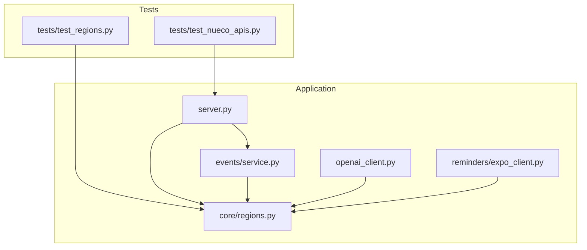
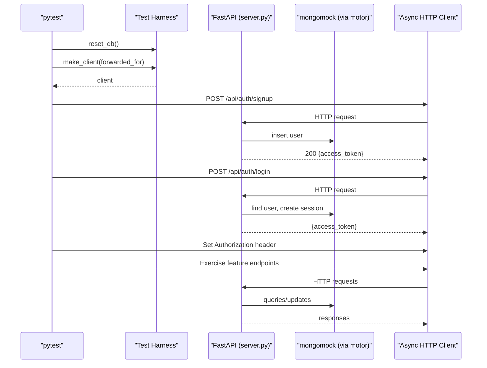
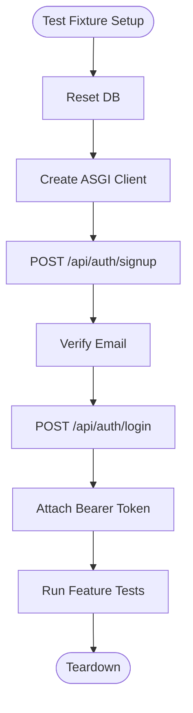
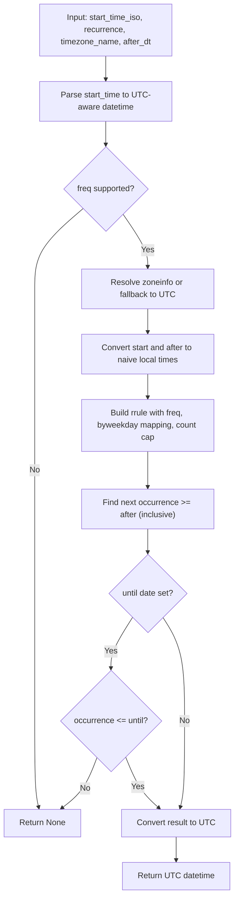
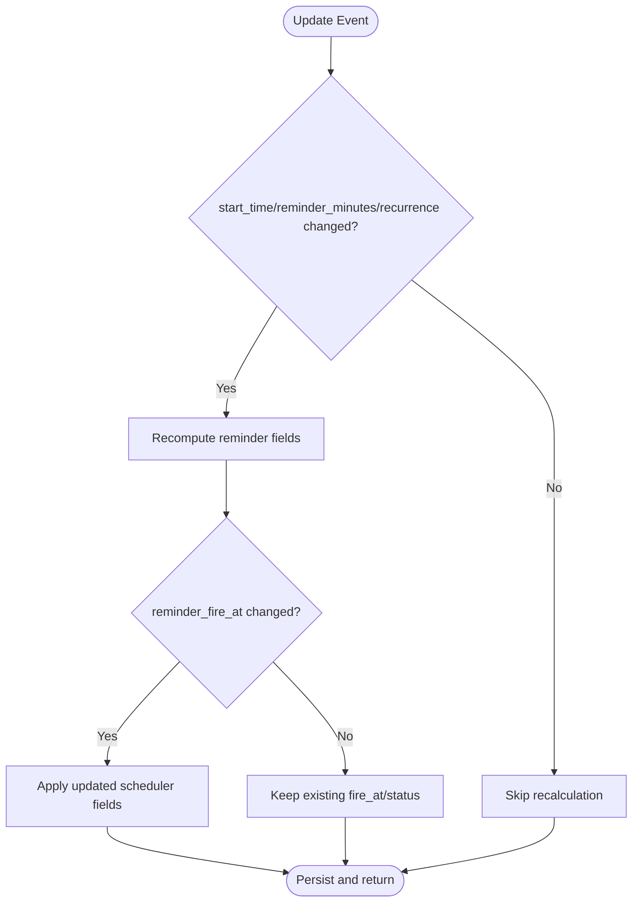
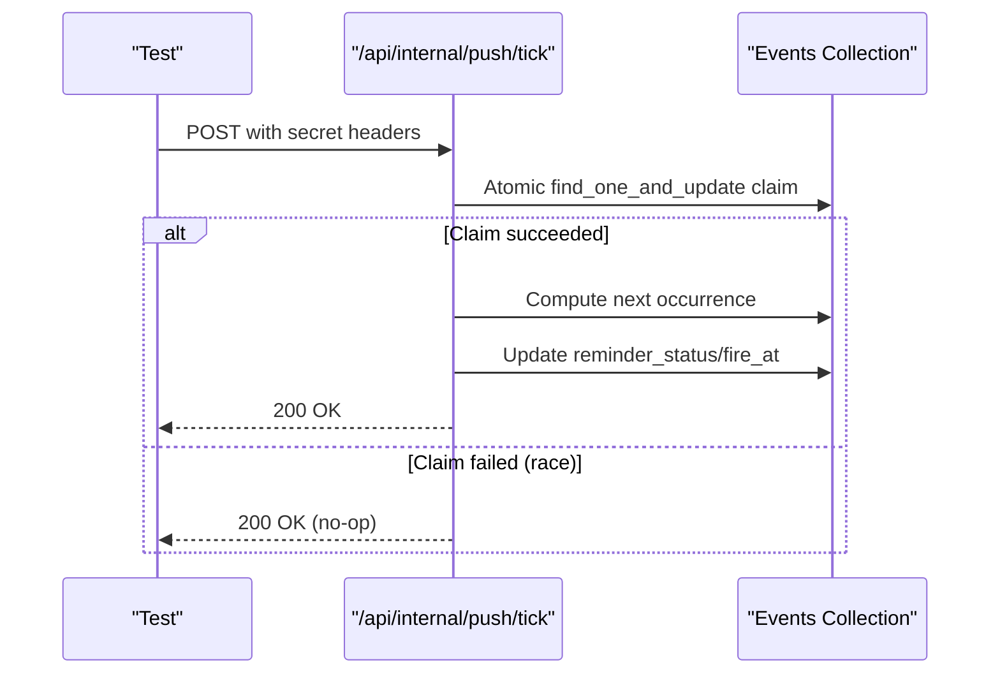
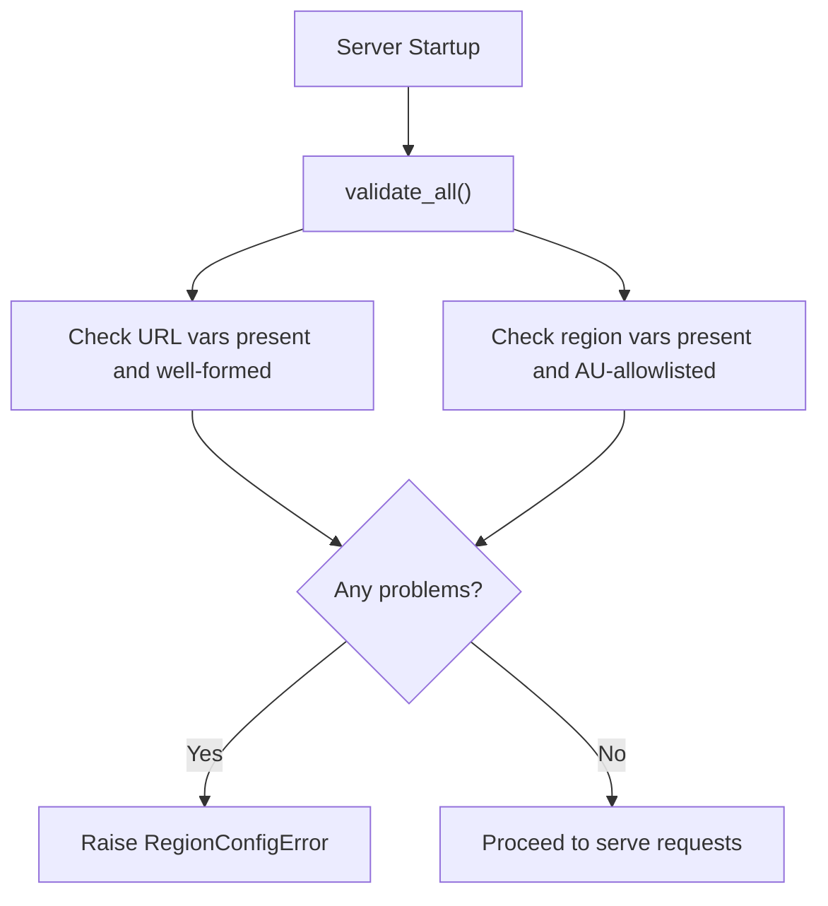
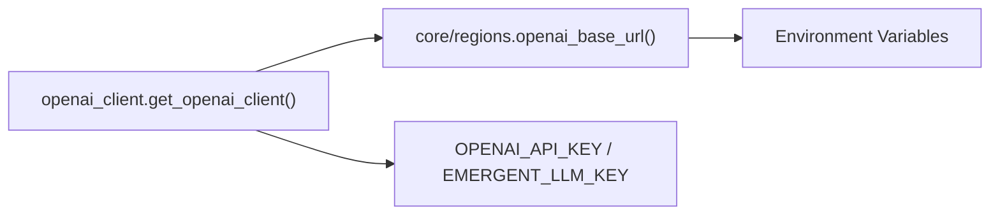
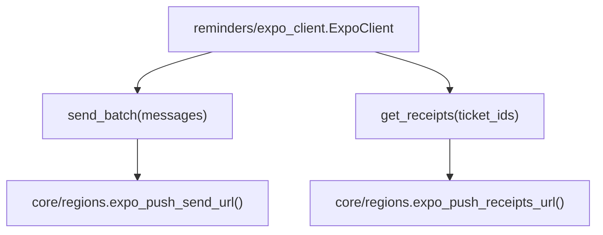

# Unit Testing

<cite>
**Referenced Files in This Document**
- [server.py](file://server.py)
- [events/service.py](file://events/service.py)
- [core/regions.py](file://core/regions.py)
- [tests/test_nueco_apis.py](file://tests/test_nueco_apis.py)
- [tests/test_regions.py](file://tests/test_regions.py)
- [openai_client.py](file://openai_client.py)
- [reminders/expo_client.py](file://reminders/expo_client.py)
</cite>

## Table of Contents
1. Introduction
2. Project Structure
3. Core Components
4. Architecture Overview
5. Detailed Component Analysis
6. Dependency Analysis
7. Performance Considerations
8. Troubleshooting Guide
9. Conclusion

## Introduction
This document explains how the Nueco Backend is unit tested with pytest, focusing on:
- In-process FastAPI testing using an ASGI client against a mongomock-backed database
- Test isolation strategies for MongoDB operations and authentication flows
- Writing effective tests for business logic such as recurrence calculations, timezone handling, and data validation
- Mocking external dependencies like OpenAI and Speechmatics APIs
- Handling E2EE workflows, concurrent operations, and edge cases in event scheduling

The test suite runs the real FastAPI application in-process, avoiding network egress and live databases by patching the database layer to use mongomock via a shared harness. Authentication is bootstrapped per test so endpoints can be exercised end-to-end without hitting external services.

## Project Structure
The backend organizes domain features into modules (notes, events, reminders, accounts, feedback, etc.) and wires them into a single FastAPI app. Tests live under tests/ and exercise both HTTP routes and pure functions.

**Diagram sources**
- [server.py:1-214](file://server.py#L1-L214)
- [core/regions.py:1-230](file://core/regions.py#L1-L230)
- [events/service.py:1-312](file://events/service.py#L1-L312)
- [openai_client.py:1-24](file://openai_client.py#L1-L24)
- [reminders/expo_client.py:1-50](file://reminders/expo_client.py#L1-L50)

**Section sources**
- [server.py:1-214](file://server.py#L1-L214)
- [tests/test_nueco_apis.py:1-800](file://tests/test_nueco_apis.py#L1-L800)
- [tests/test_regions.py:1-201](file://tests/test_regions.py#L1-L201)

## Core Components
- FastAPI application assembly and routers are defined in server.py. It includes routers for auth, notes, events, trips, reminders, accounts, feedback, text AI, attachments, dailybrew, and more. Startup handlers enforce data residency, create indexes, and start background tasks.
- Business logic for events (validation, reminder computation, recurrence math, persistence) lives in events/service.py. It exposes pure helpers like compute_reminder_fields and next_occurrence_on_or_after that are directly unit-tested.
- Data residency configuration is centralized in core/regions.py. It validates environment-declared endpoints and regions at startup and re-validates on each accessor call.
- External clients (OpenAI, Expo push) depend on core.regions for endpoint resolution, enabling safe mocking or replacement in tests.

Key testing patterns observed:
- In-process FastAPI + mongomock via a shared harness used by tests
- Per-test isolated user creation and login through the API
- Direct function-level tests for recurrence/timezone logic
- Environment-driven configuration validation tests

**Section sources**
- [server.py:168-214](file://server.py#L168-L214)
- [events/service.py:39-123](file://events/service.py#L39-L123)
- [core/regions.py:144-165](file://core/regions.py#L144-L165)
- [tests/test_nueco_apis.py:54-84](file://tests/test_nueco_apis.py#L54-L84)
- [tests/test_nueco_apis.py:486-589](file://tests/test_nueco_apis.py#L486-L589)
- [tests/test_regions.py:64-154](file://tests/test_regions.py#L64-L154)

## Architecture Overview
The test architecture boots the FastAPI app in-process, patches the database to use mongomock, and uses an async HTTP client to exercise routes. Pure functions are imported from the same module instance to assert correctness without HTTP overhead.

**Diagram sources**
- [tests/test_nueco_apis.py:54-84](file://tests/test_nueco_apis.py#L54-L84)
- [server.py:168-214](file://server.py#L168-L214)

## Detailed Component Analysis

### In-Process FastAPI Testing with ASGI Client
- The test fixture creates a fresh isolated database, signs up a new user, verifies email, logs in, and attaches the access token to subsequent requests. Each test gets a unique forwarded-for IP to avoid rate limiting.
- Health checks, Notes CRUD, Events CRUD, linked_event_ids normalization, and recurrence/timezone fields are validated via HTTP calls.

**Diagram sources**
- [tests/test_nueco_apis.py:54-84](file://tests/test_nueco_apis.py#L54-L84)

**Section sources**
- [tests/test_nueco_apis.py:54-84](file://tests/test_nueco_apis.py#L54-L84)
- [tests/test_nueco_apis.py:87-175](file://tests/test_nueco_apis.py#L87-L175)
- [tests/test_nueco_apis.py:302-393](file://tests/test_nueco_apis.py#L302-L393)

### Recurrence Calculations and Timezone Handling
- Pure function next_occurrence_on_or_after computes the next occurrence given a start time, recurrence rule, timezone, and after datetime. It operates in local wall-clock time to preserve DST behavior and converts results back to UTC.
- Tests cover weekly rules with specific weekdays, inclusive until boundaries, DST transitions, fallback to UTC when timezone is missing/invalid, monthly recurrence semantics, and unknown frequencies returning None.

**Diagram sources**
- [events/service.py:69-123](file://events/service.py#L69-L123)

**Section sources**
- [events/service.py:69-123](file://events/service.py#L69-L123)
- [tests/test_nueco_apis.py:486-589](file://tests/test_nueco_apis.py#L486-L589)

### Reminder Scheduler Fields and Update Behavior
- compute_reminder_fields derives reminder_fire_at and status based on start_time and reminder_minutes, marking past-due events as sent.
- Updates allow explicit clearing of certain fields (e.g., reminder_minutes, recurrence) via null values; unrelated field updates do not clear reminders.

**Diagram sources**
- [events/service.py:39-54](file://events/service.py#L39-L54)
- [events/service.py:267-306](file://events/service.py#L267-L306)

**Section sources**
- [events/service.py:39-54](file://events/service.py#L39-L54)
- [events/service.py:267-306](file://events/service.py#L267-L306)
- [tests/test_nueco_apis.py:406-472](file://tests/test_nueco_apis.py#L406-L472)

### Push Tick Concurrency and Recurrence Advance
- The internal tick endpoint advances recurring events to their next pending occurrence atomically. Tests seed events directly into the DB to simulate due-in-the-past scenarios and verify concurrency safety using asyncio.gather to race multiple ticks.

**Diagram sources**
- [tests/test_nueco_apis.py:654-800](file://tests/test_nueco_apis.py#L654-L800)

**Section sources**
- [tests/test_nueco_apis.py:602-800](file://tests/test_nueco_apis.py#L602-L800)

### Data Residency and Configuration Validation
- core/regions.py enforces that all external-service endpoints and regions are declared via environment variables and validated against an Australian-region allowlist at startup and on each accessor call.
- Tests validate missing vars, malformed URLs, non-Australian regions, blank values, and ensure no forbidden literals exist in source code outside allowed locations.

**Diagram sources**
- [core/regions.py:144-165](file://core/regions.py#L144-L165)
- [server.py:333-341](file://server.py#L333-L341)

**Section sources**
- [core/regions.py:144-165](file://core/regions.py#L144-L165)
- [tests/test_regions.py:64-154](file://tests/test_regions.py#L64-L154)
- [tests/test_regions.py:180-201](file://tests/test_regions.py#L180-L201)

### External Dependencies: OpenAI and Speechmatics
- OpenAI client construction reads the API key and base URL from environment, pinning the base URL via core.regions to ensure it passes the AU-region gate.
- Speechmatics integration is accessed via a batch client configured similarly; tests should mock these clients or provide fake endpoints via environment to avoid network calls.

**Diagram sources**
- [openai_client.py:15-24](file://openai_client.py#L15-L24)
- [core/regions.py:186-188](file://core/regions.py#L186-L188)

**Section sources**
- [openai_client.py:1-24](file://openai_client.py#L1-L24)
- [core/regions.py:186-188](file://core/regions.py#L186-L188)

### Push Notifications: Expo Client
- The Expo client posts messages and retrieves receipts using endpoints resolved from core.regions. In tests, replace or mock this client to exercise reminder pipeline logic without network calls.

**Diagram sources**
- [reminders/expo_client.py:18-50](file://reminders/expo_client.py#L18-L50)
- [core/regions.py:194-199](file://core/regions.py#L194-L199)

**Section sources**
- [reminders/expo_client.py:1-50](file://reminders/expo_client.py#L1-L50)
- [core/regions.py:194-199](file://core/regions.py#L194-L199)

## Dependency Analysis
- server.py imports and registers routers for all domains and sets up startup/shutdown lifecycle hooks.
- events/service.py depends on core/regions indirectly via other modules but primarily relies on standard libraries and dateutil for recurrence logic.
- openai_client.py and reminders/expo_client.py depend on core/regions for endpoint resolution, ensuring consistent data residency enforcement.
- Tests import server components via the harness to reuse the same module instances patched with mongomock.

```mermaid
graph TB
Server["server.py"] --> AuthRouter["auth router"]
Server --> NotesRouter["notes router"]
Server --> EventsRouter["events router"]
Server --> RemindersRouter["reminders router"]
Server --> AccountsRouter["accounts router"]
Server --> FeedbackRouter["feedback router"]
Server --> TextAIRouter["textai router"]
Server --> AttachmentsRouter["attachments router"]
Server --> DailyBrewRouter["dailybrew router"]
Server --> CanvaRouter["canva router"]
Server --> Regions["core/regions.validate_all()"]
EventsService["events/service.py"] --> Regions
OpenAIClient["openai_client.py"] --> Regions
ExpoClient["reminders/expo_client.py"] --> Regions
```

**Diagram sources**
- [server.py:175-214](file://server.py#L175-L214)
- [core/regions.py:144-165](file://core/regions.py#L144-L165)
- [events/service.py:1-312](file://events/service.py#L1-L312)
- [openai_client.py:1-24](file://openai_client.py#L1-L24)
- [reminders/expo_client.py:1-50](file://reminders/expo_client.py#L1-L50)

**Section sources**
- [server.py:175-214](file://server.py#L175-L214)
- [core/regions.py:144-165](file://core/regions.py#L144-L165)

## Performance Considerations
- Use direct function calls for pure logic tests (e.g., next_occurrence_on_or_after) to avoid HTTP overhead and improve determinism.
- Seed data directly into the mongomock DB for complex scenarios (e.g., due-in-the-past reminders) to bypass API-side guards that would otherwise alter state.
- Leverage partial indexes and projections in service methods to keep queries efficient; tests should mirror these constraints to ensure coverage.

[No sources needed since this section provides general guidance]

## Troubleshooting Guide
Common issues and resolutions:
- Missing or invalid environment variables for external services cause startup failures; ensure all required variables are set and conform to the AU-region allowlist.
- Rate limiting during signup/login: use unique forwarded-for IPs per test to avoid throttling.
- Concurrency races in tick processing: rely on atomic find_one_and_update claims; tests should assert idempotency and no double-advancement.
- Explicit null handling: ensure PUT payloads include explicit nulls for fields that must be cleared; tests should verify both setter and getter paths.

**Section sources**
- [core/regions.py:144-165](file://core/regions.py#L144-L165)
- [tests/test_nueco_apis.py:54-84](file://tests/test_nueco_apis.py#L54-L84)
- [tests/test_nueco_apis.py:758-800](file://tests/test_nueco_apis.py#L758-L800)
- [events/service.py:267-306](file://events/service.py#L267-L306)

## Conclusion
The Nueco Backend’s testing strategy combines in-process FastAPI execution with mongomock for isolation, robust authentication fixtures, and targeted unit tests for critical business logic. Data residency is enforced centrally and verified through comprehensive configuration tests. External dependencies are abstracted behind region-checked endpoints, enabling reliable mocking. The suite covers concurrency, recurrence, timezone handling, and update semantics, providing confidence across both HTTP routes and pure functions.

[No sources needed since this section summarizes without analyzing specific files]