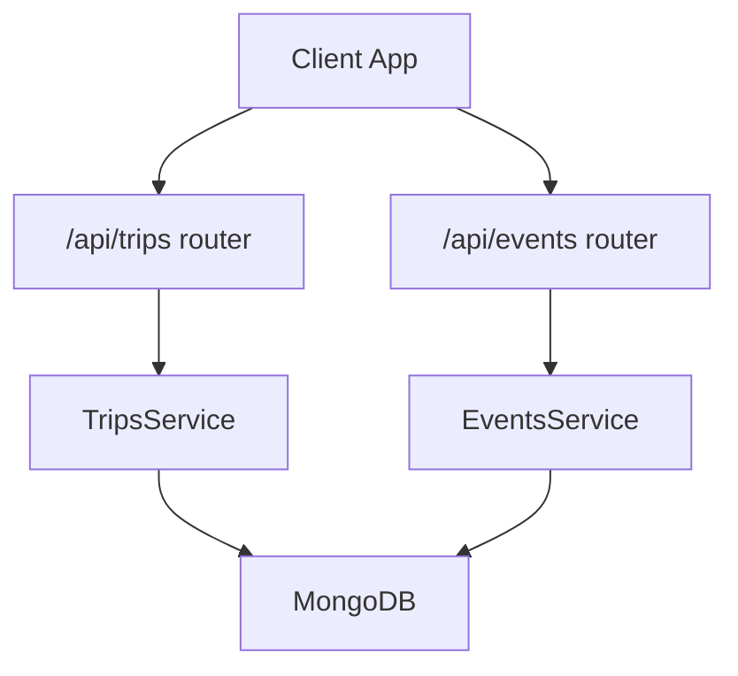
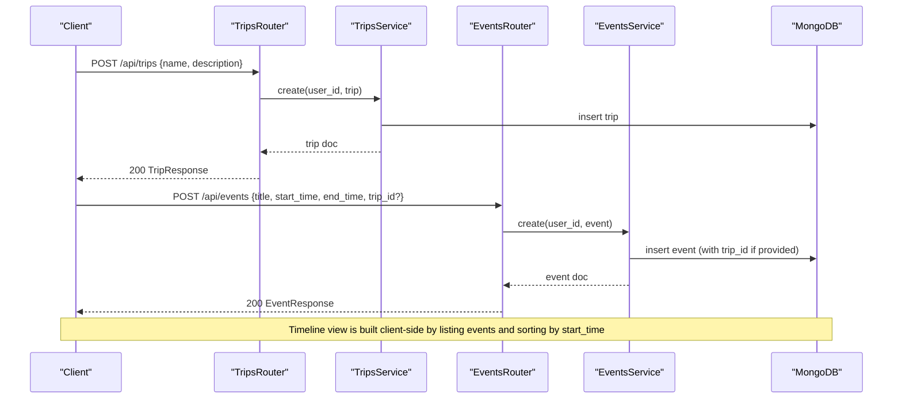
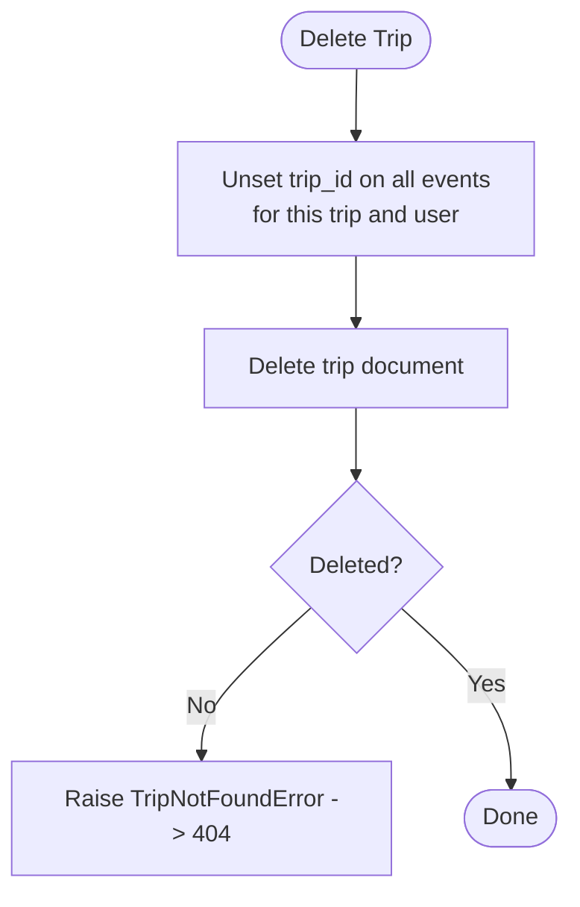
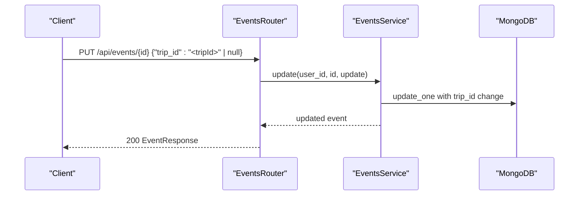
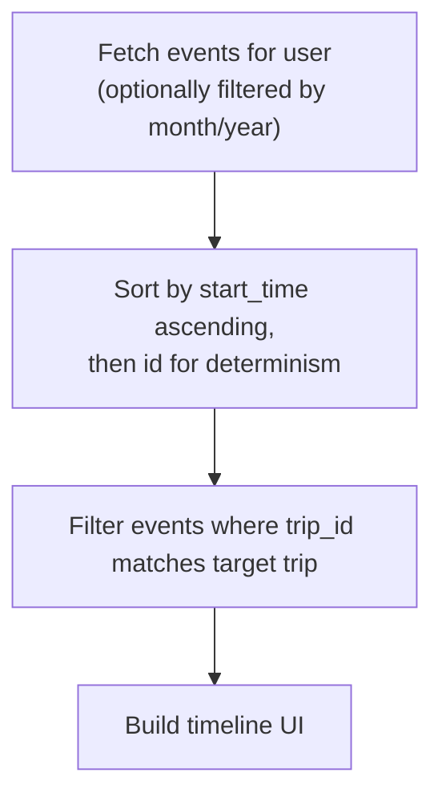
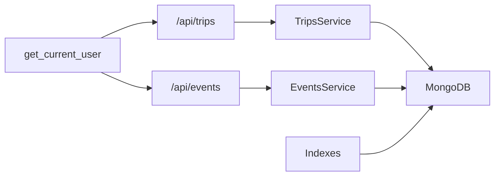

# Trip Planning

<cite>
**Referenced Files in This Document**
- [router.py](file://trips/router.py)
- [service.py](file://trips/service.py)
- [schemas.py](file://trips/schemas.py)
- [events_router.py](file://events/router.py)
- [events_service.py](file://events/service.py)
- [events_schemas.py](file://events/schemas.py)
- [server.py](file://server.py)
- [deps.py](file://core/deps.py)
- [test_nueco_apis.py](file://tests/test_nueco_apis.py)
</cite>

## Table of Contents
1. [Introduction](#introduction)
2. [Project Structure](#project-structure)
3. [Core Components](#core-components)
4. [Architecture Overview](#architecture-overview)
5. [Detailed Component Analysis](#detailed-component-analysis)
6. [Dependency Analysis](#dependency-analysis)
7. [Performance Considerations](#performance-considerations)
8. [Troubleshooting Guide](#troubleshooting-guide)
9. [Conclusion](#conclusion)
10. [Appendices](#appendices)

## Introduction
This document explains the Trip Planning sub-feature: how trips are created and managed, how events are linked to trips, and how timelines are generated from those linked events. It covers trip CRUD operations, event linking via a trip identifier, timeline view generation (client-side sorting by time), date range handling, status management, and integration with the broader event system. It also addresses common issues such as timeline conflicts, event duplication, performance for complex itineraries, and data integrity when deleting trips.

## Project Structure
The Trip Planning feature spans two modules:
- Trips: defines trip entities and their lifecycle.
- Events: provides the event model that can be grouped under a trip via an opaque reference field.

**Diagram sources**
- [router.py:23-95](file://trips/router.py#L23-L95)
- [events_router.py:23-111](file://events/router.py#L23-L111)
- [service.py:47-102](file://trips/service.py#L47-L102)
- [events_service.py:163-312](file://events/service.py#L163-L312)

**Section sources**
- [router.py:1-96](file://trips/router.py#L1-L96)
- [events_router.py:1-111](file://events/router.py#L1-L111)
- [service.py:1-102](file://trips/service.py#L1-L102)
- [events_service.py:1-312](file://events/service.py#L1-L312)

## Core Components
- TripsService: Creates, lists, retrieves, updates, and deletes trips. Validates payload sizes and enforces user scoping. On delete, it cascades by unsetting trip references on all associated events before removing the trip.
- EventsService: Manages events, including storing and updating an optional trip_id to group events into a trip. Supports batch retrieval and reminder scheduling fields.
- Schemas: Define request/response models for trips and events, including trip_id linkage and encryption versioning.
- Routers: Expose REST endpoints for trips and events, translating service exceptions to HTTP responses.
- Server configuration: Defines indexes to support efficient trip timeline lookups and trip deletion cascades.

Key responsibilities:
- Trips: pure metadata grouping; no ordering or scheduling logic lives here.
- Events: store temporal data and optional trip membership; timeline computation is client-side based on start_time.

**Section sources**
- [service.py:17-102](file://trips/service.py#L17-L102)
- [events_service.py:163-312](file://events/service.py#L163-L312)
- [schemas.py:5-26](file://trips/schemas.py#L5-L26)
- [events_schemas.py:11-88](file://events/schemas.py#L11-L88)
- [router.py:23-95](file://trips/router.py#L23-L95)
- [events_router.py:23-111](file://events/router.py#L23-L111)
- [server.py:390-402](file://server.py#L390-L402)

## Architecture Overview
Trip planning uses a simple but robust design:
- A trip is a lightweight container identified by id, owned by a user.
- An event may optionally belong to a trip via trip_id.
- The server does not compute or enforce a trip timeline; clients build timelines by fetching events and sorting by start_time.
- Deleting a trip cleans up orphaned references by unsetting trip_id on its events.

**Diagram sources**
- [router.py:23-34](file://trips/router.py#L23-L34)
- [events_router.py:23-34](file://events/router.py#L23-L34)
- [service.py:51-63](file://trips/service.py#L51-L63)
- [events_service.py:167-199](file://events/service.py#L167-L199)

## Detailed Component Analysis

### Trip CRUD Operations
- Create trip: validates name/description length limits, assigns id and timestamps, persists under user scope.
- List trips: paginated, deterministic sort by created_at desc then id asc to avoid page drift.
- Get trip: returns trip if owned by current user; otherwise 404.
- Update trip: partial update with validation; returns updated trip.
- Delete trip: cascades by unsetting trip_id on all events belonging to the trip before deleting the trip document.

**Diagram sources**
- [service.py:93-102](file://trips/service.py#L93-L102)

**Section sources**
- [router.py:23-95](file://trips/router.py#L23-L95)
- [service.py:51-102](file://trips/service.py#L51-L102)
- [schemas.py:5-26](file://trips/schemas.py#L5-L26)

### Event Linking Within Trips
- Events carry an optional trip_id field that groups them under a trip.
- Creating an event supports setting trip_id at creation time.
- Updating an event allows adding or removing trip membership by setting trip_id to a value or null.
- Deleting a trip automatically clears trip_id on all its events to prevent dangling references.

**Diagram sources**
- [events_router.py:82-96](file://events/router.py#L82-L96)
- [events_service.py:267-306](file://events/service.py#L267-L306)

**Section sources**
- [events_schemas.py:11-88](file://events/schemas.py#L11-L88)
- [events_service.py:167-306](file://events/service.py#L167-L306)
- [service.py:93-102](file://trips/service.py#L93-L102)

### Timeline View Generation
- The trip’s timeline is computed client-side by retrieving events and sorting by start_time.
- The server intentionally does not maintain separate ordering or scheduling data for trips.
- For month/year filtering, list events by month and year; clients then filter to show only events within the selected trip’s date range.

**Diagram sources**
- [events_service.py:201-247](file://events/service.py#L201-L247)

**Section sources**
- [events_service.py:201-247](file://events/service.py#L201-L247)

### Date Range Handling
- Events store start_time and end_time as ISO strings; all_day indicates date-only semantics without time conversion.
- Month/year queries use string ranges to efficiently slice events.
- Clients should intersect event ranges with trip date ranges to render the correct itinerary window.

**Section sources**
- [events_schemas.py:11-41](file://events/schemas.py#L11-L41)
- [events_service.py:201-217](file://events/service.py#L201-L217)

### Status Management
- Trips do not have explicit status fields in the schema; they are either present or deleted.
- Event reminders include scheduler fields derived from start_time and reminder_minutes, with statuses like pending or sent. These are independent of trip membership.

**Section sources**
- [events_service.py:39-53](file://events/service.py#L39-L53)
- [events_service.py:167-199](file://events/service.py#L167-L199)

### Integration With Broader Event System
- Events are first-class entities; trips act as logical groupings via trip_id.
- Indexes support efficient lookup of events by trip_id and user_id, enabling fast timeline queries.
- Authentication and database access are shared via core dependencies.

**Section sources**
- [server.py:390-402](file://server.py#L390-L402)
- [deps.py:15-51](file://core/deps.py#L15-L51)

## Dependency Analysis
- Trips depend on MongoDB and rely on user scoping through get_current_user.
- Events depend on MongoDB and provide trip_id linkage; they also compute reminder scheduler fields.
- Server initializes indexes for both trips and events to optimize list and timeline operations.

**Diagram sources**
- [deps.py:24-51](file://core/deps.py#L24-L51)
- [router.py:23-95](file://trips/router.py#L23-L95)
- [events_router.py:23-111](file://events/router.py#L23-L111)
- [server.py:390-402](file://server.py#L390-L402)

**Section sources**
- [deps.py:15-51](file://core/deps.py#L15-L51)
- [server.py:390-402](file://server.py#L390-L402)

## Performance Considerations
- Pagination: Both trips and events endpoints paginate with deterministic sorts to avoid missing or duplicating rows across pages.
- Indexes:
  - Events: index on (trip_id, user_id) supports fast timeline lookups and cascade unset on trip delete.
  - Trips: indexes on (user_id, created_at, id) support efficient list pagination.
- Batch retrieval: Events support a batch endpoint to reduce N+1 queries when loading multiple events.
- Payload size limits: Enforced to protect storage and network overhead; violations return 413.

Recommendations:
- Always fetch events with appropriate month/year filters when building trip timelines to minimize payload size.
- Use the events batch endpoint when you need many specific events by id.
- Avoid large trip names or descriptions beyond configured limits to prevent 413 errors.

**Section sources**
- [events_service.py:201-247](file://events/service.py#L201-L247)
- [events_service.py:255-265](file://events/service.py#L255-L265)
- [service.py:33-36](file://trips/service.py#L33-L36)
- [service.py:39-44](file://trips/service.py#L39-L44)
- [events_service.py:125-139](file://events/service.py#L125-L139)
- [server.py:390-402](file://server.py#L390-L402)

## Troubleshooting Guide
Common issues and resolutions:
- Timeline conflicts:
  - Cause: Multiple events with identical start_time.
  - Resolution: Sorting uses start_time then id for deterministic order; ensure unique ids per event.
- Event duplication:
  - Cause: Client retries or race conditions creating duplicate events.
  - Resolution: Implement idempotency on the client side using stable ids; deduplicate on the client when merging.
- Dangling trip references:
  - Cause: Deleting a trip without cleaning up events.
  - Resolution: The server cascades unset trip_id on delete; verify your client does not assume trip_id remains after trip deletion.
- Payload too large:
  - Cause: Name/description exceeding limits.
  - Resolution: Trim content or split into smaller units; handle 413 responses gracefully.
- Reminder misfires:
  - Cause: Past-due events or timezone issues.
  - Resolution: Ensure start_time is valid and timezone-aware; the server marks past-due reminders as already sent.

Operational checks:
- Verify indexes exist for (trip_id, user_id) and trip list pagination.
- Confirm authentication headers are correctly set to resolve user context.

**Section sources**
- [events_service.py:201-247](file://events/service.py#L201-L247)
- [service.py:93-102](file://trips/service.py#L93-L102)
- [service.py:39-44](file://trips/service.py#L39-L44)
- [events_service.py:39-53](file://events/service.py#L39-L53)
- [server.py:390-402](file://server.py#L390-L402)

## Conclusion
Trip Planning is implemented as a lightweight grouping mechanism over events. Trips provide identity and ownership, while events carry temporal data and optional membership via trip_id. Timelines are constructed client-side by sorting events by start_time, which keeps the server simple and flexible. Data integrity is maintained through cascading cleanup on trip deletion and robust indexing for performance. Proper use of pagination, payload limits, and batch retrieval ensures scalability for complex itineraries.

## Appendices

### API Endpoints Summary
- Trips
  - POST /api/trips: Create trip
  - GET /api/trips: List trips (paginated)
  - GET /api/trips/{trip_id}: Get trip
  - PUT /api/trips/{trip_id}: Update trip
  - DELETE /api/trips/{trip_id}: Delete trip
- Events
  - POST /api/events: Create event (supports trip_id)
  - GET /api/events: List events (paginated, optional month/year)
  - GET /api/events/{event_id}: Get event
  - PUT /api/events/{event_id}: Update event (supports setting/clearing trip_id)
  - DELETE /api/events/{event_id}: Delete event
  - POST /api/events/batch: Batch get events by ids

**Section sources**
- [router.py:23-95](file://trips/router.py#L23-L95)
- [events_router.py:23-111](file://events/router.py#L23-L111)

### Example Workflows
- Create a trip and link an event:
  - Create trip via POST /api/trips.
  - Create event via POST /api/events with trip_id set to the new trip’s id.
  - Build timeline by listing events and filtering by trip_id, then sorting by start_time.
- Remove an event from a trip:
  - Update event via PUT /api/events/{event_id} with trip_id set to null.
- Delete a trip:
  - Delete via DELETE /api/trips/{trip_id}; server will unset trip_id on all associated events.

Validation and error behavior:
- Oversized payloads return 413.
- Missing trips or events return 404.
- Authentication failures return 401.

**Section sources**
- [test_nueco_apis.py:1087-1185](file://tests/test_nueco_apis.py#L1087-L1185)
- [router.py:23-95](file://trips/router.py#L23-L95)
- [events_router.py:23-111](file://events/router.py#L23-L111)