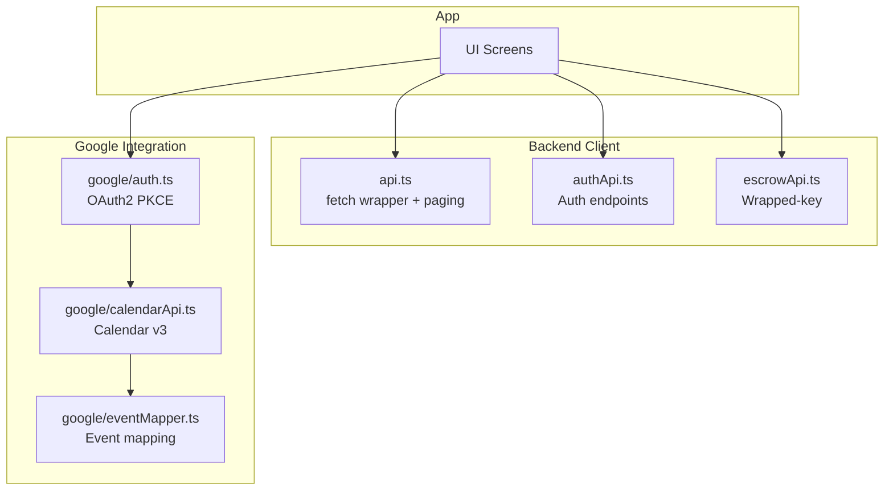
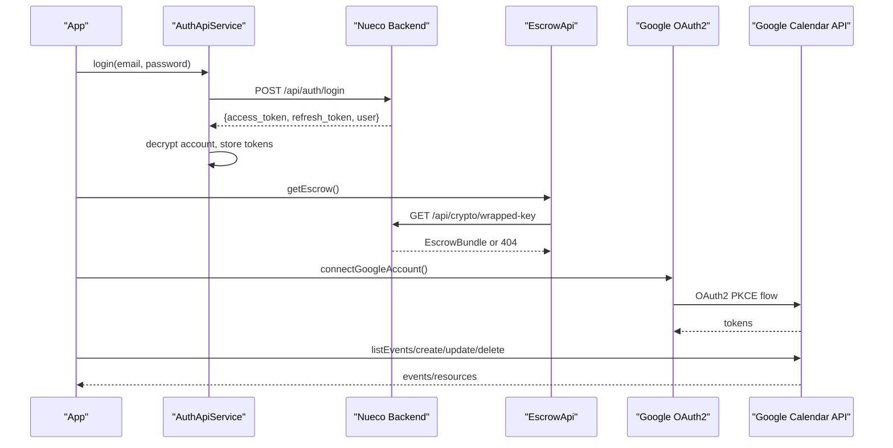
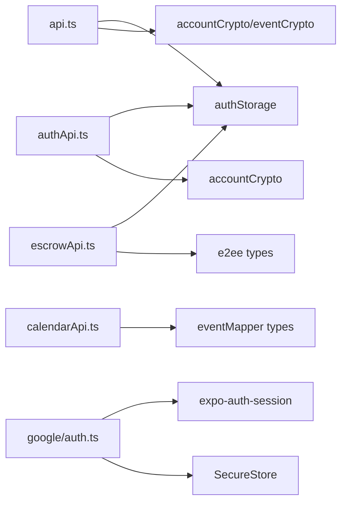

# API Reference

<cite>
**Referenced Files in This Document**
- [authApi.ts](file://src/auth/api/authApi.ts)
- [auth.types.ts](file://src/auth/types/auth.types.ts)
- [api.ts](file://src/api.ts)
- [backendBaseUrl.ts](file://src/backendBaseUrl.ts)
- [escrowApi.ts](file://src/crypto/escrowApi.ts)
- [e2ee.ts](file://src/crypto/e2ee.ts)
- [calendarApi.ts](file://src/google/calendarApi.ts)
- [auth.ts](file://src/google/auth.ts)
- [eventMapper.ts](file://src/google/eventMapper.ts)
</cite>

## Table of Contents
1. [Introduction](#introduction)
2. [Project Structure](#project-structure)
3. [Core Components](#core-components)
4. [Architecture Overview](#architecture-overview)
5. [Detailed Component Analysis](#detailed-component-analysis)
6. [Dependency Analysis](#dependency-analysis)
7. [Performance Considerations](#performance-considerations)
8. [Troubleshooting Guide](#troubleshooting-guide)
9. [Conclusion](#conclusion)

## Introduction
This document provides a comprehensive API reference for the application’s internal and external APIs:
- Internal REST API client to the backend (authentication, notes, events, trips, attachments, transcription, text processing, voice intent classification, Canva integration, daily news).
- Authentication endpoints for login, registration, password management, session handling, and user profile updates.
- Escrow API for secure key backup and recovery (wrapped DEK storage/retrieval).
- Google Calendar API integration using OAuth2 PKCE, event CRUD, and synchronization helpers.

It includes request/response schemas, authentication headers, error handling patterns, rate limiting and retry strategies, connection management, and troubleshooting guidance.

## Project Structure
The API surface is split across several modules:
- Backend REST client with unified fetch wrapper, token refresh, timeouts, and paging utilities.
- Auth module exposing login/signup/password flows and session management.
- Escrow module for E2EE key bundle operations.
- Google Calendar module for OAuth2 flows and direct calls to Google Calendar v3.
- Event mapping between Nueco models and Google Calendar resources.

**Diagram sources**
- [api.ts:15-121](file://src/api.ts#L15-L121)
- [authApi.ts:8-259](file://src/auth/api/authApi.ts#L8-L259)
- [escrowApi.ts:1-39](file://src/crypto/escrowApi.ts#L1-L39)
- [auth.ts:1-242](file://src/google/auth.ts#L1-L242)
- [calendarApi.ts:1-147](file://src/google/calendarApi.ts#L1-L147)
- [eventMapper.ts:1-290](file://src/google/eventMapper.ts#L1-L290)

**Section sources**
- [api.ts:15-121](file://src/api.ts#L15-L121)
- [backendBaseUrl.ts:1-14](file://src/backendBaseUrl.ts#L1-L14)

## Core Components
- Unified backend client with automatic token refresh on 401, request timeout, and single-flight refresh coalescing.
- Auth service providing signup, login, logout, refresh, profile update, password reset/change, verification resend, and sync status.
- Escrow service for retrieving and storing wrapped key bundles.
- Google Calendar client for listing calendars, creating/updating/deleting/listing events, with pagination and error classification.
- Google OAuth2 helper for PKCE flow, token storage, silent refresh, and disconnect/revoke.

Key responsibilities:
- Authentication and session lifecycle.
- Secure key escrow for E2EE.
- Data operations (notes, events, trips, attachments, transcription, text processing, voice intent, Canva, daily news).
- External calendar synchronization via Google APIs.

**Section sources**
- [api.ts:15-121](file://src/api.ts#L15-L121)
- [authApi.ts:8-259](file://src/auth/api/authApi.ts#L8-L259)
- [escrowApi.ts:1-39](file://src/crypto/escrowApi.ts#L1-L39)
- [calendarApi.ts:1-147](file://src/google/calendarApi.ts#L1-L147)
- [auth.ts:1-242](file://src/google/auth.ts#L1-L242)

## Architecture Overview
The app communicates with two primary backends:
- Nueco backend via a unified REST client that handles auth, retries, timeouts, and paging.
- Google Calendar API directly from the device using an OAuth2 access token obtained through PKCE.

**Diagram sources**
- [authApi.ts:69-151](file://src/auth/api/authApi.ts#L69-L151)
- [escrowApi.ts:21-38](file://src/crypto/escrowApi.ts#L21-L38)
- [auth.ts:106-178](file://src/google/auth.ts#L106-L178)
- [calendarApi.ts:85-146](file://src/google/calendarApi.ts#L85-L146)

## Detailed Component Analysis

### Backend REST Client (api.ts)
- Base URL composition from environment or default origin.
- Unified fetch wrapper with:
  - Authorization header injection from stored access token.
  - Single-flight token refresh on 401 with one concurrent refresh attempt.
  - 30-second request timeout to prevent hung syncs.
  - Error propagation with status and response text.
- Paging utility for consistent page-based data retrieval.
- Feature-specific APIs:
  - Notes: CRUD, pin toggle, paged getAll.
  - Events: CRUD, batch get, cached monthly events with short TTL.
  - Trips: CRUD, paged getAll.
  - Account: delete account endpoint.
  - Push notifications: register/unregister.
  - Feedback: submit feedback.
  - Attachments: presign, remove, download URL; upload with progress using XMLHttpRequest to S3 via presigned POST.
  - Transcription: base64 audio upload and transcription result.
  - Text processing: organize/summarize/smart_format.
  - Voice intent: classify transcript into structured events or dictation.
  - Canva: connect/status/disconnect/designs/export/status.
  - Daily Brew: headlines, news sources, search feeds, outlets by IDs, custom feed add, update preferences.

Authentication headers:
- Bearer token included when available.

Error handling:
- Non-ok responses throw errors including status and body snippet.
- 401 triggers token refresh once; if successful, original request is retried; otherwise throws session expired.

Rate limiting and retries:
- No explicit rate limiting in this layer; relies on server-side limits.
- Retry only for transient 401 via refresh; other errors are surfaced to callers.

Connection management:
- AbortController-based timeout per request to avoid indefinite hangs.

Usage examples (conceptual):
- Create an event: call eventsApi.create with payload; cache cleared on mutation.
- Upload attachment: presign then upload via FormData to presigned URL; progress reported via callbacks.

**Section sources**
- [api.ts:15-121](file://src/api.ts#L15-L121)
- [api.ts:140-220](file://src/api.ts#L140-L220)
- [api.ts:222-269](file://src/api.ts#L222-L269)
- [api.ts:271-359](file://src/api.ts#L271-L359)
- [api.ts:361-423](file://src/api.ts#L361-L423)
- [api.ts:427-458](file://src/api.ts#L427-L458)
- [api.ts:460-486](file://src/api.ts#L460-L486)
- [api.ts:507-522](file://src/api.ts#L507-L522)
- [api.ts:527-558](file://src/api.ts#L527-L558)
- [backendBaseUrl.ts:1-14](file://src/backendBaseUrl.ts#L1-L14)

### Authentication API (authApi.ts)
Endpoints:
- POST /api/auth/signup
  - Request: name, email, password, confirm_password
  - Response: message, success
  - Errors: non-ok returns detail message
- POST /api/auth/login
  - Request: email, password, device_name, platform
  - Response: user, access_token, refresh_token, token_type
  - Behavior: decrypts user object before storing tokens
- POST /api/auth/logout
  - Request: refresh_token (optional)
  - Behavior: clears local tokens after attempt
- POST /api/auth/refresh
  - Request: refresh_token
  - Response: new access_token, optional refresh_token, decrypted user
  - Behavior: clears tokens on 401/403; leaves tokens on network errors
- GET /api/auth/me
  - Headers: Authorization Bearer
  - Response: decrypted user
- PUT /api/auth/me
  - Headers: Authorization Bearer
  - Request: name, enc_version (optional)
  - Response: decrypted user
- POST /api/auth/forgot-password
  - Request: email
  - Response: message, success
- POST /api/auth/reset-password
  - Request: token, new_password, confirm_password
  - Response: message, success
  - Errors: non-ok returns detail message
- POST /api/auth/change-password
  - Headers: Authorization Bearer
  - Request: current_password, new_password, confirm_password
  - Response: message, success
  - Errors: attaches HTTP status to thrown error for UI differentiation
- POST /api/auth/resend-verification
  - Request: email
  - Response: message, success
- GET /api/auth/sync-status
  - Headers: Authorization Bearer
  - Response: notes_count, synced, user_name

Authentication headers:
- Content-Type: application/json
- Authorization: Bearer <access_token> where required

Error handling:
- parseJsonResponse centralizes JSON parsing and logs context, status, content-type, and preview.
- Network errors mapped to user-friendly messages.
- Token refresh failures clear tokens only on explicit 401/403.

Retry logic:
- Refresh token used centrally in api.ts; authApi.refreshToken can be used standalone but typically not needed due to centralized refresh.

Example flows:
- Login: send credentials, receive tokens, decrypt user, persist tokens, return user.
- Change password: send current/new/confirm; handle 401 to show specific message.

**Section sources**
- [authApi.ts:8-31](file://src/auth/api/authApi.ts#L8-L31)
- [authApi.ts:33-53](file://src/auth/api/authApi.ts#L33-L53)
- [authApi.ts:55-105](file://src/auth/api/authApi.ts#L55-L105)
- [authApi.ts:107-151](file://src/auth/api/authApi.ts#L107-L151)
- [authApi.ts:153-185](file://src/auth/api/authApi.ts#L153-L185)
- [authApi.ts:187-233](file://src/auth/api/authApi.ts#L187-L233)
- [authApi.ts:235-255](file://src/auth/api/authApi.ts#L235-L255)
- [auth.types.ts:1-66](file://src/auth/types/auth.types.ts#L1-L66)

### Escrow API (crypto/escrowApi.ts)
Endpoints:
- GET /api/crypto/wrapped-key
  - Headers: Authorization Bearer (if available)
  - Response: EscrowBundle or 404 (returns null here)
  - Errors: non-ok throws with status
- PUT /api/crypto/wrapped-key
  - Headers: Authorization Bearer (if available)
  - Request: EscrowBundle
  - Response: void
  - Errors: non-ok throws with status

Data model:
- EscrowBundle includes wrapped keys by password and recovery code, salts, KDF type and parameters, and encryption version.

Security posture:
- Server stores opaque wrapped keys; never sees DEK or plaintext.

Usage example (conceptual):
- On first login or key bootstrap, retrieve existing bundle; if none, create and store new bundle.

**Section sources**
- [escrowApi.ts:1-39](file://src/crypto/escrowApi.ts#L1-L39)
- [e2ee.ts:43-51](file://src/crypto/e2ee.ts#L43-L51)

### Google Calendar API Integration (google/calendarApi.ts)
Base URL: https://www.googleapis.com/calendar/v3

Endpoints:
- GET /users/me/calendarList
  - Query: maxResults=100, pageToken (pagination)
  - Response: items[], nextPageToken?
  - Filters: owner/writer access roles only
- GET /calendars/{id}/events
  - Query: timeMin, timeMax, maxResults=250, showDeleted=true, singleEvents=false, pageToken
  - Response: items[], nextPageToken?
  - Returns master events (no instance expansion), including cancelled
- POST /calendars/{id}/events
  - Body: GoogleEventResource
  - Response: created event resource
- PUT /calendars/{id}/events/{eventId}
  - Body: GoogleEventResource
  - Response: updated event resource
- DELETE /calendars/{id}/events/{eventId}
  - Response: void

Authentication:
- Authorization: Bearer <access_token>

Error handling:
- Network errors throw GoogleApiError with retryable flag true.
- Non-ok responses parse error.message; 429 and 5xx marked retryable; 401 indicates revoked/expired beyond refresh; 403/404 indicate permission issues.

Pagination:
- Automatic page iteration until no nextPageToken.

Usage example (conceptual):
- List calendars, filter writable ones, then list events within a time window, map to Nueco model, and synchronize.

**Section sources**
- [calendarApi.ts:1-52](file://src/google/calendarApi.ts#L1-L52)
- [calendarApi.ts:54-78](file://src/google/calendarApi.ts#L54-L78)
- [calendarApi.ts:80-110](file://src/google/calendarApi.ts#L80-L110)
- [calendarApi.ts:112-146](file://src/google/calendarApi.ts#L112-L146)

### Google OAuth2 Flow (google/auth.ts)
Flow:
- Uses PKCE authorization-code flow via expo-auth-session.
- Redirect URI uses native scheme with package name and path /oauth2redirect.
- Scopes include calendar.events, calendar.readonly, openid, email.
- Exchanges authorization code for access and refresh tokens; stores in SecureStore.
- Silent refresh near expiry to keep sync running without prompting.
- Disconnect optionally revokes grant and clears local tokens.

Key behaviors:
- Requires Google client ID configured at build time; availability check provided.
- Rejects missing refresh token on Android to avoid one-hour-only connections.
- Extracts email from idToken for display purposes.

Usage example (conceptual):
- Connect account opens browser consent; on success, tokens stored; subsequent sync uses getValidAccessToken to ensure valid token.

**Section sources**
- [auth.ts:1-21](file://src/google/auth.ts#L1-L21)
- [auth.ts:27-44](file://src/google/auth.ts#L27-L44)
- [auth.ts:58-86](file://src/google/auth.ts#L58-L86)
- [auth.ts:101-178](file://src/google/auth.ts#L101-L178)
- [auth.ts:180-242](file://src/google/auth.ts#L180-L242)

### Event Mapping (google/eventMapper.ts)
Purpose:
- Maps between Nueco CalendarEvent and Google Calendar API v3 event resources.
- Handles recurrence translation, reminders, attendees, all-day vs timed events, timezone considerations.

Key functions:
- recurrenceToRRule: builds RRULE string from Nueco recurrence.
- nuecoEventToGoogle: creates Google event resource for create/update.
- rruleToRecurrence: parses RRULE into Nueco recurrence with unsupported features flagged.
- googleEventToNueco: maps Google event to Nueco fields, including degraded notes for unsupported features.

Usage example (conceptual):
- When syncing from Google to Nueco, map each event; if recurrence cannot be represented, degrade to single occurrence with note appended to description.

**Section sources**
- [eventMapper.ts:1-10](file://src/google/eventMapper.ts#L1-L10)
- [eventMapper.ts:24-74](file://src/google/eventMapper.ts#L24-L74)
- [eventMapper.ts:80-147](file://src/google/eventMapper.ts#L80-L147)
- [eventMapper.ts:149-241](file://src/google/eventMapper.ts#L149-L241)
- [eventMapper.ts:243-290](file://src/google/eventMapper.ts#L243-L290)

## Dependency Analysis
- api.ts depends on authStorage for tokens and decryptors for E2EE payloads.
- authApi.ts depends on authStorage and accountCrypto for decryption and token persistence.
- escrowApi.ts depends on authStorage and e2ee types for EscrowBundle.
- google/calendarApi.ts depends on eventMapper types for GoogleEventResource.
- google/auth.ts depends on expo-auth-session and SecureStore for OAuth2 and token storage.

**Diagram sources**
- [api.ts:1-14](file://src/api.ts#L1-L14)
- [authApi.ts:1-7](file://src/auth/api/authApi.ts#L1-L7)
- [escrowApi.ts:1-11](file://src/crypto/escrowApi.ts#L1-L11)
- [calendarApi.ts:1-7](file://src/google/calendarApi.ts#L1-L7)
- [auth.ts:22-25](file://src/google/auth.ts#L22-L25)

**Section sources**
- [api.ts:1-14](file://src/api.ts#L1-L14)
- [authApi.ts:1-7](file://src/auth/api/authApi.ts#L1-L7)
- [escrowApi.ts:1-11](file://src/crypto/escrowApi.ts#L1-L11)
- [calendarApi.ts:1-7](file://src/google/calendarApi.ts#L1-L7)
- [auth.ts:22-25](file://src/google/auth.ts#L22-L25)

## Performance Considerations
- Request timeout: 30 seconds prevents hung requests from blocking sync queues.
- Single-flight token refresh avoids redundant refreshes under concurrent loads.
- Paged pulls use reasonable page sizes to balance memory usage and network overhead.
- Monthly events cache reduces repeated decrypt work for common reads.
- Attachment uploads stream encrypted chunks to avoid OOM on large files.
- Google Calendar pagination minimizes payload size and supports large datasets.

[No sources needed since this section provides general guidance]

## Troubleshooting Guide
Common errors and remedies:
- Session expired (401):
  - Centralized refresh attempts once; if refresh fails, prompts re-login.
  - Ensure refresh token exists and is valid; clear and reconnect if revoked.
- Network errors:
  - Check connectivity; retry after brief delay; verify DNS/proxy settings.
- Google Calendar 429/5xx:
  - Marked retryable; implement exponential backoff at caller level if needed.
- Google Calendar 401/403:
  - Reconnect Google account; revoke and re-authorize if necessary.
- Escrow 404:
  - Indicates no escrow bundle exists; create and store new bundle during key bootstrap.
- Attachment upload failure:
  - Verify presigned policy fields and file size match ciphertext size; ensure temporary encrypted file is deleted after upload.

Debugging techniques:
- Inspect response status and content-type in parseJsonResponse logs.
- Use console logs around token refresh and network calls to trace failures.
- Validate Google scopes and client configuration; ensure offline access requested for refresh token.

**Section sources**
- [authApi.ts:8-31](file://src/auth/api/authApi.ts#L8-L31)
- [api.ts:104-121](file://src/api.ts#L104-L121)
- [calendarApi.ts:20-52](file://src/google/calendarApi.ts#L20-L52)
- [escrowApi.ts:21-38](file://src/crypto/escrowApi.ts#L21-L38)
- [auth.ts:180-242](file://src/google/auth.ts#L180-L242)

## Conclusion
The application integrates a robust backend REST client with secure authentication, E2EE escrow, and direct Google Calendar synchronization. The design emphasizes reliability through timeouts, single-flight refresh, careful error handling, and conservative sync rules. Developers should leverage the provided APIs for consistent behavior, handle errors gracefully, and follow OAuth2 best practices for Google integrations.

[No sources needed since this section summarizes without analyzing specific files]