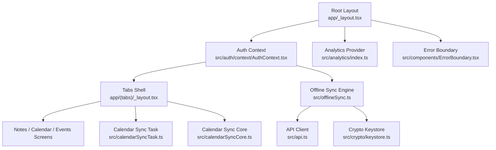
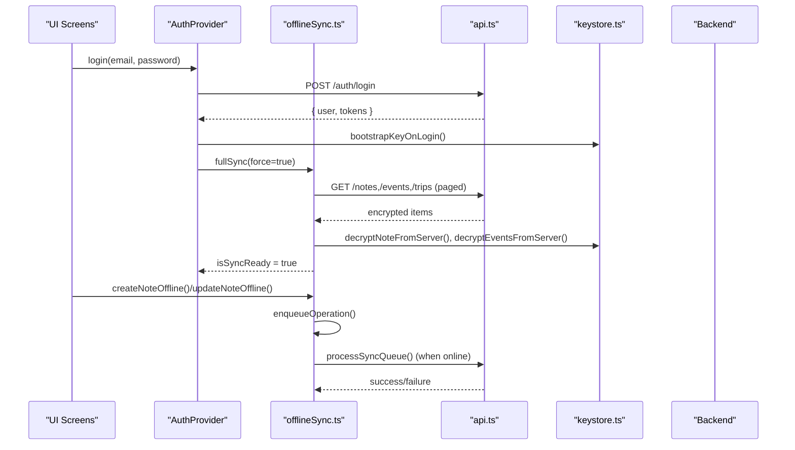
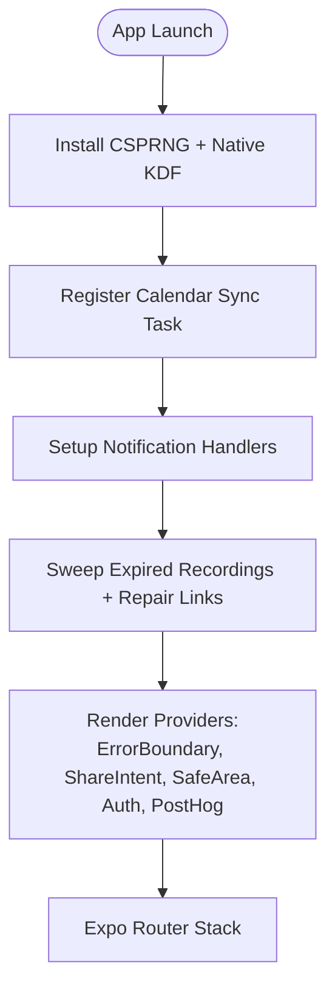
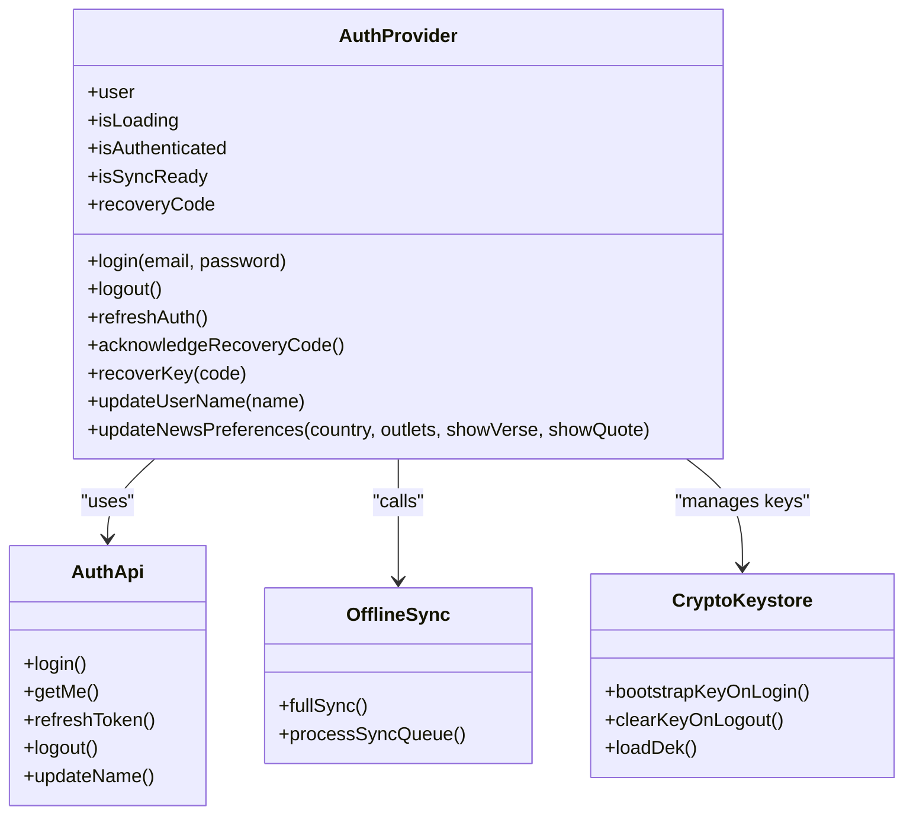
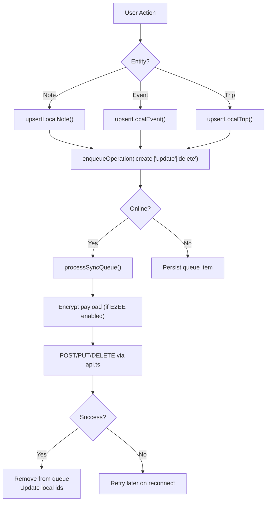
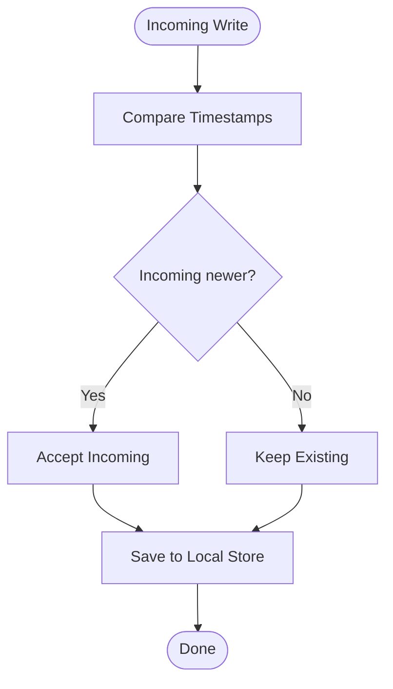
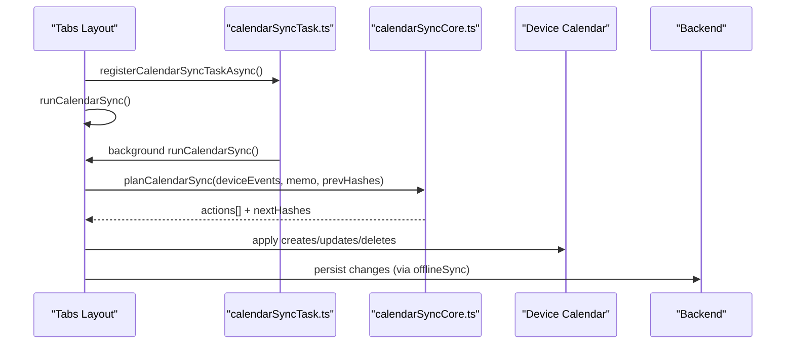
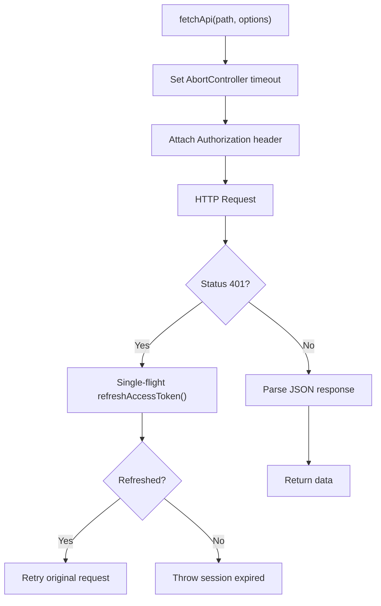
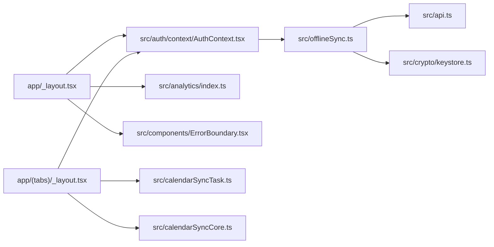

# Architecture & Design

<cite>
**Referenced Files in This Document**
- [app/_layout.tsx](file://app/_layout.tsx)
- [app/(tabs)/_layout.tsx](file://app/(tabs)/_layout.tsx)
- [src/auth/context/AuthContext.tsx](file://src/auth/context/AuthContext.tsx)
- [src/offlineSync.ts](file://src/offlineSync.ts)
- [src/calendarSyncCore.ts](file://src/calendarSyncCore.ts)
- [src/calendarSyncTask.ts](file://src/calendarSyncTask.ts)
- [src/api.ts](file://src/api.ts)
- [src/analytics/index.ts](file://src/analytics/index.ts)
- [src/components/ErrorBoundary.tsx](file://src/components/ErrorBoundary.tsx)
- [src/crypto/keystore.ts](file://src/crypto/keystore.ts)
</cite>

## Table of Contents
1. [Introduction](#introduction)
2. [Project Structure](#project-structure)
3. [Core Components](#core-components)
4. [Architecture Overview](#architecture-overview)
5. [Detailed Component Analysis](#detailed-component-analysis)
6. [Dependency Analysis](#dependency-analysis)
7. [Performance Considerations](#performance-considerations)
8. [Troubleshooting Guide](#troubleshooting-guide)
9. [Conclusion](#conclusion)

## Introduction
This document describes the Nueco frontend architecture with a focus on:
- Offline-first data persistence and background synchronization
- Modular feature organization (notes, events, trips, calendar sync, voice, analytics)
- Platform abstraction layers for native capabilities and web fallbacks
- Authentication context provider pattern and state management
- Data flow patterns including local-first storage, conflict resolution, and background sync
- Cross-cutting concerns: error boundaries, analytics integration, and performance strategies

The application is built on React Native with Expo Router, using a root layout that wires providers (auth, analytics, error boundary), a tabbed navigation shell, and feature modules under src/.

## Project Structure
High-level structure:
- app/: Expo Router screens and root layout
  - _layout.tsx: Root providers, route definitions, notification setup, startup tasks
  - (tabs)/_layout.tsx: Tab shell, first-run flows, background task registration, recurring refreshes
- src/: Feature modules and shared infrastructure
  - auth/: Authentication context, API, storage, types, login workflow
  - offlineSync.ts: Local-first storage, sync queue, conflict resolution, full sync orchestration
  - calendarSync*.ts: Calendar device sync decision logic and background task registration
  - api.ts: HTTP client with token refresh, paging, caching, and domain APIs
  - analytics/: PostHog provider and tracking helpers
  - components/: Shared UI primitives including ErrorBoundary
  - crypto/: E2EE key management and encryption utilities
  - Other features: audio, editor, google, pdf, share, voice, etc.

**Diagram sources**
- [app/_layout.tsx:1-102](file://app/_layout.tsx#L1-L102)
- [app/(tabs)/_layout.tsx:1-214](file://app/(tabs)/_layout.tsx#L1-L214)
- [src/auth/context/AuthContext.tsx:1-259](file://src/auth/context/AuthContext.tsx#L1-L259)
- [src/offlineSync.ts:1-800](file://src/offlineSync.ts#L1-L800)
- [src/calendarSyncTask.ts:1-52](file://src/calendarSyncTask.ts#L1-L52)
- [src/calendarSyncCore.ts:1-149](file://src/calendarSyncCore.ts#L1-L149)
- [src/api.ts:1-559](file://src/api.ts#L1-L559)
- [src/crypto/keystore.ts:1-53](file://src/crypto/keystore.ts#L1-L53)
- [src/analytics/index.ts:1-27](file://src/analytics/index.ts#L1-L27)
- [src/components/ErrorBoundary.tsx:1-162](file://src/components/ErrorBoundary.tsx#L1-L162)

**Section sources**
- [app/_layout.tsx:1-102](file://app/_layout.tsx#L1-L102)
- [app/(tabs)/_layout.tsx:1-214](file://app/(tabs)/_layout.tsx#L1-L214)

## Core Components
- Root layout and providers: Wraps the app with ErrorBoundary, ShareIntentProvider, SafeArea, AuthProvider, and PostHogProvider; sets up notifications and startup repairs.
- Authentication context: Manages user session, login/logout flows, E2EE key bootstrap/recovery, calendar permission prompts, and sync readiness signaling.
- Offline sync engine: Provides local-first CRUD for notes/events/trips, a durable sync queue, file-backed JSON stores, conflict resolution by timestamp, and full sync reconciliation.
- Calendar sync: Pure decision logic to plan create/update/delete actions between device calendar and Nueco events, plus background task registration for periodic runs.
- API client: Centralized fetch with timeout, single-flight token refresh, 401 handling, paged pulls, and domain-specific APIs (notes, events, trips, daily brew, transcribe, text processing, voice intent, Canva).
- Analytics: PostHog provider and tracking helpers for user identification and event tracking.
- Crypto keystore: Secure storage of the Data Encryption Key (DEK) in OS keystore with in-process memoization.

**Section sources**
- [app/_layout.tsx:1-102](file://app/_layout.tsx#L1-L102)
- [src/auth/context/AuthContext.tsx:1-259](file://src/auth/context/AuthContext.tsx#L1-L259)
- [src/offlineSync.ts:1-800](file://src/offlineSync.ts#L1-L800)
- [src/calendarSyncCore.ts:1-149](file://src/calendarSyncCore.ts#L1-L149)
- [src/calendarSyncTask.ts:1-52](file://src/calendarSyncTask.ts#L1-L52)
- [src/api.ts:1-559](file://src/api.ts#L1-L559)
- [src/analytics/index.ts:1-27](file://src/analytics/index.ts#L1-L27)
- [src/crypto/keystore.ts:1-53](file://src/crypto/keystore.ts#L1-L53)

## Architecture Overview
Nueco follows an offline-first pattern:
- All writes go to local storage first (file-backed JSON collections with in-memory caches) and are enqueued for server sync.
- Background connectivity listeners trigger queued operations when online.
- Full sync reconciles server state with local state using timestamps and merge rules.
- Calendar device sync uses pure decision logic to plan changes and is executed via foreground and background triggers.

**Diagram sources**
- [src/auth/context/AuthContext.tsx:147-177](file://src/auth/context/AuthContext.tsx#L147-L177)
- [src/offlineSync.ts:449-469](file://src/offlineSync.ts#L449-L469)
- [src/offlineSync.ts:798-800](file://src/offlineSync.ts#L798-L800)
- [src/api.ts:140-154](file://src/api.ts#L140-L154)
- [src/crypto/keystore.ts:30-42](file://src/crypto/keystore.ts#L30-L42)

## Detailed Component Analysis

### Root Layout and Providers
- Installs secure random values and native KDF before any crypto usage.
- Registers calendar sync background task at module scope so it can run during headless launches.
- Sets up notifications, share intent handling, and startup repairs (expired recordings cleanup, stale recording link repair).
- Wraps routes in ErrorBoundary, ShareIntentProvider, SafeArea, AuthProvider, and PostHogProvider.

**Diagram sources**
- [app/_layout.tsx:1-102](file://app/_layout.tsx#L1-L102)

**Section sources**
- [app/_layout.tsx:1-102](file://app/_layout.tsx#L1-L102)

### Authentication Context Provider
- Maintains user state, loading flags, and sync readiness.
- On mount, restores cached user or refetches from server if tokens exist.
- Login triggers E2EE key bootstrap, full sync, and calendar permission prompt.
- Logout flushes pending sync, clears E2EE keys, resets calendar sync state, and clears user.

**Diagram sources**
- [src/auth/context/AuthContext.tsx:52-73](file://src/auth/context/AuthContext.tsx#L52-L73)
- [src/auth/context/AuthContext.tsx:147-177](file://src/auth/context/AuthContext.tsx#L147-L177)
- [src/auth/context/AuthContext.tsx:206-228](file://src/auth/context/AuthContext.tsx#L206-L228)
- [src/crypto/keystore.ts:30-42](file://src/crypto/keystore.ts#L30-L42)

**Section sources**
- [src/auth/context/AuthContext.tsx:1-259](file://src/auth/context/AuthContext.tsx#L1-L259)

### Offline-First Storage and Sync Queue
- File-backed JSON store for large collections (notes, events, trips, sync queue) avoids AsyncStorage CursorWindow limits.
- In-memory caches return shallow copies to prevent mutation leaks; caches invalidated on writes.
- Mutex serializes note collection mutations to avoid race conditions across editor autosave, sync queue id swaps, and full sync reconciliation.
- Note ID alias map persists temp-to-server id mappings to repair links after restarts.

**Diagram sources**
- [src/offlineSync.ts:112-135](file://src/offlineSync.ts#L112-L135)
- [src/offlineSync.ts:217-244](file://src/offlineSync.ts#L217-L244)
- [src/offlineSync.ts:376-415](file://src/offlineSync.ts#L376-L415)
- [src/offlineSync.ts:449-469](file://src/offlineSync.ts#L449-L469)
- [src/offlineSync.ts:599-637](file://src/offlineSync.ts#L599-L637)
- [src/offlineSync.ts:708-727](file://src/offlineSync.ts#L708-L727)

**Section sources**
- [src/offlineSync.ts:1-800](file://src/offlineSync.ts#L1-L800)

### Conflict Resolution Strategy
- Notes: Keep newer version based on updated_at; mutex ensures consistent read-modify-write cycles.
- Events: Use recordTimestamp to compare versions; same “unless existing is newer” rule to handle same-millisecond writes deterministically.
- Trips: Simple overwrite by id.
- Full sync: Merge server responses into local state using these rules; ensure local-only fields (e.g., reminder IDs) are preserved where applicable.

**Diagram sources**
- [src/offlineSync.ts:419-433](file://src/offlineSync.ts#L419-L433)
- [src/offlineSync.ts:541-557](file://src/offlineSync.ts#L541-L557)

**Section sources**
- [src/offlineSync.ts:419-433](file://src/offlineSync.ts#L419-L433)
- [src/offlineSync.ts:541-557](file://src/offlineSync.ts#L541-L557)

### Calendar Device Sync
- Pure decision logic computes create/update/delete actions by comparing device calendar events with stored hashes and memo mappings.
- Safety checks prevent deletions unless calendar selection is unchanged and there is at least one device event present.
- Foreground and background triggers ensure reliability; background task registered at module scope.

**Diagram sources**
- [app/(tabs)/_layout.tsx:95-109](file://app/(tabs)/_layout.tsx#L95-L109)
- [src/calendarSyncTask.ts:1-52](file://src/calendarSyncTask.ts#L1-L52)
- [src/calendarSyncCore.ts:87-149](file://src/calendarSyncCore.ts#L87-L149)

**Section sources**
- [src/calendarSyncCore.ts:1-149](file://src/calendarSyncCore.ts#L1-L149)
- [src/calendarSyncTask.ts:1-52](file://src/calendarSyncTask.ts#L1-L52)
- [app/(tabs)/_layout.tsx:95-109](file://app/(tabs)/_layout.tsx#L95-L109)

### API Client and Token Management
- Single-flight token refresh prevents concurrent refresh races due to backend rotation policy.
- Fetch wrapper adds timeouts to avoid hung requests that could stall sync queues.
- Paged pulls reduce memory pressure and keep payloads manageable; per-domain page sizes defined.
- Domain APIs encapsulate endpoints for notes, events, trips, attachments, transcription, text processing, voice intent, Canva, and daily brew.

**Diagram sources**
- [src/api.ts:23-72](file://src/api.ts#L23-L72)
- [src/api.ts:74-121](file://src/api.ts#L74-L121)
- [src/api.ts:123-138](file://src/api.ts#L123-L138)

**Section sources**
- [src/api.ts:1-559](file://src/api.ts#L1-L559)

### Analytics Integration
- PostHogProvider wraps the app with userId from authenticated user.
- Tracking helpers expose functions for common events (note created/edited/deleted/searched/shared, voice recording lifecycle, onboarding steps).
- Consent-aware initialization and reset support privacy controls.

**Section sources**
- [app/_layout.tsx:27-84](file://app/_layout.tsx#L27-L84)
- [src/analytics/index.ts:1-27](file://src/analytics/index.ts#L1-L27)

### Error Boundaries
- Global ErrorBoundary catches render errors, shows a friendly message, and provides a retry action.
- Debug info exposed in development mode to aid troubleshooting.

**Section sources**
- [src/components/ErrorBoundary.tsx:1-162](file://src/components/ErrorBoundary.tsx#L1-L162)

## Dependency Analysis
- Root layout depends on AuthProvider, PostHogProvider, ErrorBoundary, ShareIntentProvider, and notification setup.
- Tabs layout depends on Auth, notifications, calendar sync, and Google connect availability.
- AuthContext orchestrates login workflow, E2EE key bootstrap, full sync, and calendar permissions.
- OfflineSync depends on API client, crypto modules, and storage utilities.
- Calendar sync core is decoupled from I/O, enabling unit testing of sync rules.
- API client centralizes authentication, pagination, and domain endpoints.

**Diagram sources**
- [app/_layout.tsx:1-102](file://app/_layout.tsx#L1-L102)
- [app/(tabs)/_layout.tsx:1-214](file://app/(tabs)/_layout.tsx#L1-L214)
- [src/auth/context/AuthContext.tsx:1-259](file://src/auth/context/AuthContext.tsx#L1-L259)
- [src/offlineSync.ts:1-800](file://src/offlineSync.ts#L1-L800)
- [src/calendarSyncTask.ts:1-52](file://src/calendarSyncTask.ts#L1-L52)
- [src/calendarSyncCore.ts:1-149](file://src/calendarSyncCore.ts#L1-L149)
- [src/api.ts:1-559](file://src/api.ts#L1-L559)
- [src/crypto/keystore.ts:1-53](file://src/crypto/keystore.ts#L1-L53)
- [src/analytics/index.ts:1-27](file://src/analytics/index.ts#L1-L27)
- [src/components/ErrorBoundary.tsx:1-162](file://src/components/ErrorBoundary.tsx#L1-L162)

**Section sources**
- [app/_layout.tsx:1-102](file://app/_layout.tsx#L1-L102)
- [app/(tabs)/_layout.tsx:1-214](file://app/(tabs)/_layout.tsx#L1-L214)
- [src/auth/context/AuthContext.tsx:1-259](file://src/auth/context/AuthContext.tsx#L1-L259)
- [src/offlineSync.ts:1-800](file://src/offlineSync.ts#L1-L800)
- [src/calendarSyncCore.ts:1-149](file://src/calendarSyncCore.ts#L1-L149)
- [src/calendarSyncTask.ts:1-52](file://src/calendarSyncTask.ts#L1-L52)
- [src/api.ts:1-559](file://src/api.ts#L1-L559)
- [src/crypto/keystore.ts:1-53](file://src/crypto/keystore.ts#L1-L53)
- [src/analytics/index.ts:1-27](file://src/analytics/index.ts#L1-L27)
- [src/components/ErrorBoundary.tsx:1-162](file://src/components/ErrorBoundary.tsx#L1-L162)

## Performance Considerations
- File-backed JSON stores avoid AsyncStorage CursorWindow size limits for large collections.
- In-memory caches with shallow copies reduce repeated parsing overhead while preventing mutation leaks.
- Mutex serializes note collection mutations to eliminate race conditions during concurrent saves and sync.
- Full sync throttling reduces redundant network calls and decryption work on frequent focus events.
- API client timeouts prevent hung requests from stalling the sync queue indefinitely.
- Single-flight token refresh avoids concurrent refresh races and session invalidation.
- Lazy tabs and freezeOnBlur minimize unnecessary re-renders and background work.
- WebView pre-warm on Android reduces cold-start latency for the editor.

[No sources needed since this section provides general guidance]

## Troubleshooting Guide
- Authentication issues:
  - Check token refresh behavior and session expiration handling in the API client.
  - Verify AuthContext logout sequence flushes pending sync and clears E2EE keys.
- Offline sync stalls:
  - Ensure processSyncQueue is not blocked by a hung request; verify fetch timeouts.
  - Confirm NetInfo listener triggers and queue persistence.
- Calendar sync inconsistencies:
  - Validate device calendar selection hash stability and safety checks for deletions.
  - Review background task registration and foreground runCalendarSync calls.
- Analytics consent:
  - Ensure PostHogProvider is mounted and user identification occurs post-login.
- Error recovery:
  - Use ErrorBoundary to catch and recover from render errors; inspect debug info in development.

**Section sources**
- [src/api.ts:23-72](file://src/api.ts#L23-L72)
- [src/api.ts:74-121](file://src/api.ts#L74-L121)
- [src/auth/context/AuthContext.tsx:206-228](file://src/auth/context/AuthContext.tsx#L206-L228)
- [src/calendarSyncCore.ts:87-149](file://src/calendarSyncCore.ts#L87-L149)
- [src/calendarSyncTask.ts:1-52](file://src/calendarSyncTask.ts#L1-L52)
- [src/components/ErrorBoundary.tsx:1-162](file://src/components/ErrorBoundary.tsx#L1-L162)

## Conclusion
Nueco’s frontend implements a robust offline-first architecture with clear separation of concerns:
- Local-first storage with durable queues and conflict resolution ensures resilience and consistency.
- Modular features (auth, sync, calendar, analytics, crypto) are well-defined and testable.
- Platform abstractions enable native capabilities with safe web fallbacks.
- Cross-cutting concerns like error boundaries, analytics, and performance optimizations are integrated thoughtfully.

This design supports reliable user experiences across connectivity states and scales with feature growth through modular organization and clear service boundaries.