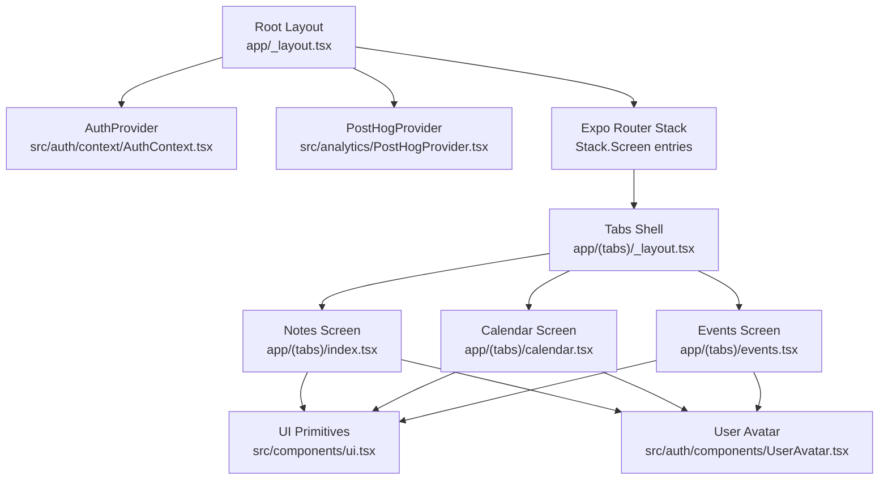
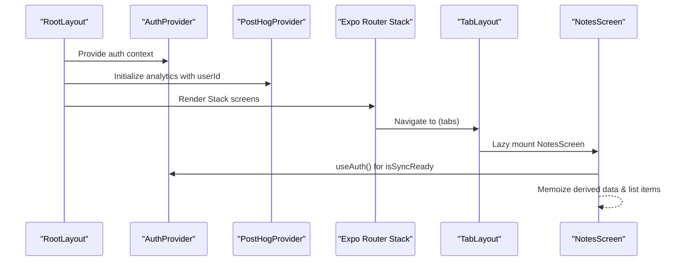
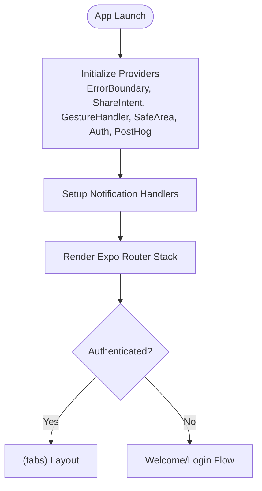
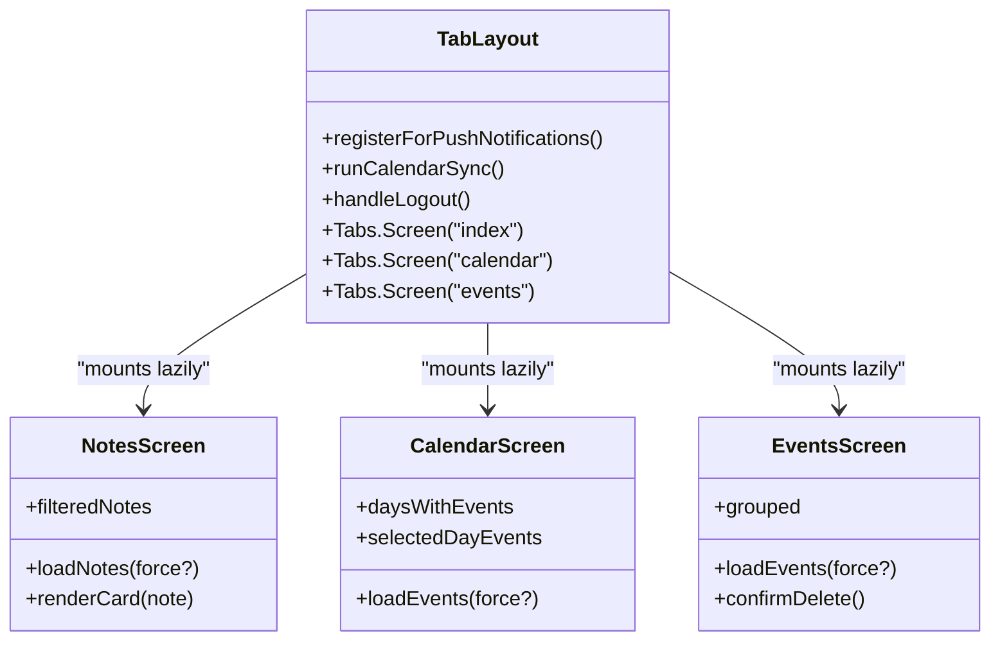
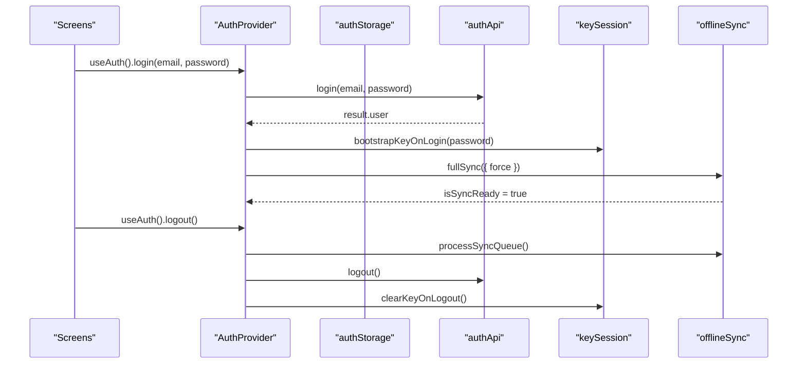
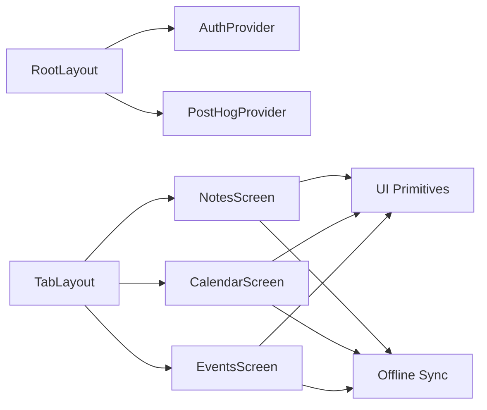

# Component Architecture

<cite>
**Referenced Files in This Document**
- [app/_layout.tsx](file://app/_layout.tsx)
- [app/(tabs)/_layout.tsx](file://app/(tabs)/_layout.tsx)
- [app/index.tsx](file://app/index.tsx)
- [src/auth/context/AuthContext.tsx](file://src/auth/context/AuthContext.tsx)
- [src/analytics/PostHogProvider.tsx](file://src/analytics/PostHogProvider.tsx)
- [app/(tabs)/index.tsx](file://app/(tabs)/index.tsx)
- [app/(tabs)/calendar.tsx](file://app/(tabs)/calendar.tsx)
- [app/(tabs)/events.tsx](file://app/(tabs)/events.tsx)
- [src/components/ui.tsx](file://src/components/ui.tsx)
- [src/auth/components/UserAvatar.tsx](file://src/auth/components/UserAvatar.tsx)
</cite>

## Table of Contents
1. Introduction
2. Project Structure
3. Core Components
4. Architecture Overview
5. Detailed Component Analysis
6. Dependency Analysis
7. Performance Considerations
8. Troubleshooting Guide
9. Conclusion

## Introduction
This document explains the React component architecture of the application, focusing on:
- The root layout and provider hierarchy
- Tab navigation and screen organization using Expo Router’s file-based routing
- Provider pattern implementation for global state (AuthContext and PostHogProvider)
- Screen composition patterns, prop interfaces, and event handling
- Separation between presentation components and business logic layers
- Performance strategies including lazy loading, memoization, and list windowing

## Project Structure
The app uses Expo Router with a clear separation between shell providers and feature screens:
- Root layout sets up providers, error boundaries, and global navigation stack
- Tabs group primary features (Notes, Calendar, Events) with lazy mounting and freeze-on-blur
- Feature screens compose reusable UI primitives and consume global context via hooks

**Diagram sources**
- [app/_layout.tsx:87-101](file://app/_layout.tsx#L87-L101)
- [app/(tabs)/_layout.tsx:130-182](file://app/(tabs)/_layout.tsx#L130-L182)
- [src/auth/context/AuthContext.tsx:77-250](file://src/auth/context/AuthContext.tsx#L77-L250)
- [src/analytics/PostHogProvider.tsx:20-60](file://src/analytics/PostHogProvider.tsx#L20-L60)

**Section sources**
- [app/_layout.tsx:1-101](file://app/_layout.tsx#L1-L101)
- [app/(tabs)/_layout.tsx:1-214](file://app/(tabs)/_layout.tsx#L1-L214)

## Core Components
- RootLayout: Wraps the app with ErrorBoundary, ShareIntentProvider, GestureHandlerRootView, SafeAreaProvider, AuthProvider, and then renders PostHogProvider plus the Expo Router Stack. It also initializes notifications and background tasks.
- AppWithAnalytics: Inner component that configures analytics user identity based on auth state and sets up notification handlers.
- TabLayout: Defines the three-tab structure (Notes, Calendar, Events), enables lazy loading and freeze-on-blur, registers push notifications, runs calendar sync, and handles first-run flows.
- NotesScreen: Implements offline-first notes list with search, pinning, delete confirmation, feedback toast, and linked-event display. Uses heavy memoization and list windowing for performance.
- CalendarScreen: Month view with local-first events, signature-gated updates to avoid unnecessary re-renders, and day selection with event listing.
- EventsScreen: Grouped upcoming/all events with filtering, grouped by date, pull-to-refresh, and animated FAB. Also uses signature-gated updates and list windowing.
- UI Primitives: Shared Button, Card, SegmentedControl, Badge used across screens for consistent look and behavior.
- UserAvatar: Reusable avatar with menu actions (settings, calendar sync, daily brew settings, change password, logout). Consumes AuthContext.

**Section sources**
- [app/_layout.tsx:27-101](file://app/_layout.tsx#L27-L101)
- [app/(tabs)/_layout.tsx:48-182](file://app/(tabs)/_layout.tsx#L48-L182)
- [app/(tabs)/index.tsx:191-769](file://app/(tabs)/index.tsx#L191-L769)
- [app/(tabs)/calendar.tsx:49-282](file://app/(tabs)/calendar.tsx#L49-L282)
- [app/(tabs)/events.tsx:130-473](file://app/(tabs)/events.tsx#L130-L473)
- [src/components/ui.tsx:15-206](file://src/components/ui.tsx#L15-L206)
- [src/auth/components/UserAvatar.tsx:25-143](file://src/auth/components/UserAvatar.tsx#L25-L143)

## Architecture Overview
The application follows a layered approach:
- Presentation layer: Screens and UI primitives render the interface and handle user interactions.
- State and services layer: Providers manage global state (auth, analytics), while hooks and modules encapsulate business logic (offline sync, crypto, calendar sync).
- Routing layer: Expo Router defines routes and navigational flow; tabs group major features.

**Diagram sources**
- [app/_layout.tsx:87-101](file://app/_layout.tsx#L87-L101)
- [app/(tabs)/_layout.tsx:130-182](file://app/(tabs)/_layout.tsx#L130-L182)
- [src/auth/context/AuthContext.tsx:77-250](file://src/auth/context/AuthContext.tsx#L77-L250)
- [src/analytics/PostHogProvider.tsx:20-60](file://src/analytics/PostHogProvider.tsx#L20-L60)

## Detailed Component Analysis

### Root Layout and Providers
- RootLayout composes providers in a strict order: ErrorBoundary -> ShareIntentProvider -> GestureHandlerRootView -> SafeAreaProvider -> AuthProvider -> AppWithAnalytics.
- AppWithAnalytics wraps content with PostHogProvider, passing the current user id for identification. It also sets up notification handlers and performs startup maintenance tasks like sweeping expired recordings and repairing stale links.
- The Expo Router Stack declares all top-level screens, including modals and slide transitions.

**Diagram sources**
- [app/_layout.tsx:27-101](file://app/_layout.tsx#L27-L101)

**Section sources**
- [app/_layout.tsx:27-101](file://app/_layout.tsx#L27-L101)

### Tab Navigation and Screen Organization
- TabLayout configures Tabs with lazy mounting and freezeOnBlur to reduce background rendering costs.
- First-run flows check analytics consent, Google Calendar connection, and voice onboarding based on account age and local flags.
- Push notifications are registered once authenticated; calendar sync and recurring reminders are refreshed on mount.
- Each tab screen is a full-featured module:
  - Notes: Offline-first list with search, pinning, delete modal, feedback prompts, and linked events.
  - Calendar: Month grid with event markers and selected-day listing.
  - Events: Grouped upcoming/all events with filtering and animated FAB.

**Diagram sources**
- [app/(tabs)/_layout.tsx:48-182](file://app/(tabs)/_layout.tsx#L48-L182)
- [app/(tabs)/index.tsx:191-769](file://app/(tabs)/index.tsx#L191-L769)
- [app/(tabs)/calendar.tsx:49-282](file://app/(tabs)/calendar.tsx#L49-L282)
- [app/(tabs)/events.tsx:130-473](file://app/(tabs)/events.tsx#L130-L473)

**Section sources**
- [app/(tabs)/_layout.tsx:48-182](file://app/(tabs)/_layout.tsx#L48-L182)
- [app/(tabs)/index.tsx:191-769](file://app/(tabs)/index.tsx#L191-L769)
- [app/(tabs)/calendar.tsx:49-282](file://app/(tabs)/calendar.tsx#L49-L282)
- [app/(tabs)/events.tsx:130-473](file://app/(tabs)/events.tsx#L130-L473)

### Provider Pattern Implementation
- AuthContext provides user state, authentication lifecycle methods, sync readiness, recovery code management, and user preference updates. It orchestrates login workflow, token refresh, E2EE key bootstrap, and cleanup on logout.
- PostHogProvider initializes analytics and identifies users when userId changes or resets on logout.

**Diagram sources**
- [src/auth/context/AuthContext.tsx:147-228](file://src/auth/context/AuthContext.tsx#L147-L228)

**Section sources**
- [src/auth/context/AuthContext.tsx:52-250](file://src/auth/context/AuthContext.tsx#L52-L250)
- [src/analytics/PostHogProvider.tsx:20-60](file://src/analytics/PostHogProvider.tsx#L20-L60)

### Screen Composition Patterns and Prop Interfaces
- NotesScreen composes:
  - UI primitives: Button, Card, SegmentedControl, Badge from src/components/ui.tsx
  - UserAvatar for header actions
  - FeedbackToast and FeedbackCommentModal for user feedback flows
  - ListSkeleton for loading states
- CalendarScreen and EventsScreen similarly compose shared UI elements and consume offline sync hooks.

Example prop interfaces:
- Button props include label, icon, onPress, variant, layout, tone, active, disabled, loading, style, testID.
- SegmentedControl props include options array, value, onChange, style.
- Badge props include label and tone.

Event handling examples:
- NotesScreen: toggle pin, delete note, open editor, show feedback toast, submit feedback comment.
- CalendarScreen: navigate to event detail, create new event with selected date.
- EventsScreen: filter upcoming/all, delete event with device calendar cleanup, expand/collapse FAB on scroll.

**Section sources**
- [src/components/ui.tsx:15-206](file://src/components/ui.tsx#L15-L206)
- [app/(tabs)/index.tsx:448-482](file://app/(tabs)/index.tsx#L448-L482)
- [app/(tabs)/calendar.tsx:266-279](file://app/(tabs)/calendar.tsx#L266-L279)
- [app/(tabs)/events.tsx:193-222](file://app/(tabs)/events.tsx#L193-L222)

### Relationship Between Presentation and Business Logic
- Presentation components (screens and UI primitives) focus on rendering and user interaction.
- Business logic resides in:
  - AuthContext for authentication and sync orchestration
  - Offline sync modules for local-first data operations
  - Event and recurrence utilities for formatting and grouping
  - Crypto modules for encryption/decryption workflows
- Screens call into these modules via hooks and functions, keeping UI decoupled from complex logic.

**Section sources**
- [app/(tabs)/index.tsx:255-320](file://app/(tabs)/index.tsx#L255-L320)
- [app/(tabs)/calendar.tsx:78-90](file://app/(tabs)/calendar.tsx#L78-L90)
- [app/(tabs)/events.tsx:162-175](file://app/(tabs)/events.tsx#L162-L175)
- [src/auth/context/AuthContext.tsx:147-228](file://src/auth/context/AuthContext.tsx#L147-L228)

## Dependency Analysis
- Root dependencies:
  - RootLayout depends on AuthProvider and PostHogProvider to provide global state and analytics.
  - TabLayout depends on notifications, calendar sync, and device calendar sync modules.
- Screen dependencies:
  - NotesScreen depends on offline sync, crypto decryption, share social source parsing, text content utilities, and feedback utilities.
  - CalendarScreen and EventsScreen depend on offline sync, event feed utilities, recurrence helpers, and date formatting.
- UI primitives are consumed by all screens to ensure consistency.

**Diagram sources**
- [app/_layout.tsx:87-101](file://app/_layout.tsx#L87-L101)
- [app/(tabs)/_layout.tsx:130-182](file://app/(tabs)/_layout.tsx#L130-L182)
- [app/(tabs)/index.tsx:191-769](file://app/(tabs)/index.tsx#L191-L769)
- [app/(tabs)/calendar.tsx:49-282](file://app/(tabs)/calendar.tsx#L49-L282)
- [app/(tabs)/events.tsx:130-473](file://app/(tabs)/events.tsx#L130-L473)

**Section sources**
- [app/_layout.tsx:87-101](file://app/_layout.tsx#L87-L101)
- [app/(tabs)/_layout.tsx:130-182](file://app/(tabs)/_layout.tsx#L130-L182)

## Performance Considerations
- Lazy Loading:
  - Tabs use lazy mounting and freezeOnBlur to avoid building heavy screens until needed and to stop background re-renders.
  - WebView pre-warm on Android reduces cold-start latency for the editor.
- Memoization:
  - NotesScreen uses useMemo for filtered lists, pinned/other splits, and expensive derived text (cardTextFor) with a bounded cache keyed by note metadata.
  - CalendarScreen uses useMemo for daysWithEvents and selectedDayEvents to minimize recalculations.
  - EventsScreen uses useMemo for grouped events and filters to avoid recomputation during scroll animations.
- List Windowing:
  - FlatList configurations set initialNumToRender, maxToRenderPerBatch, updateCellsBatchingPeriod, and windowSize to limit the number of rendered items and improve scrolling performance.
- Signature-Gated Updates:
  - CalendarScreen and EventsScreen compute signatures over event lists to prevent unnecessary state updates when data hasn’t changed.
- Polling Optimization:
  - Polling intervals run only when screens are focused and not loading/refreshing to conserve resources.

[No sources needed since this section provides general guidance]

## Troubleshooting Guide
- Authentication issues:
  - If user state clears unexpectedly, verify token refresh logic and storage persistence in AuthContext.
  - Check network errors during getMe and refreshToken calls.
- Sync readiness:
  - Ensure fullSync completes before relying on synced data; screens wait for isSyncReady where appropriate.
- Calendar sync:
  - Verify permissions are requested after login and that device calendar writes succeed; failures should be logged and retried.
- Analytics:
  - Confirm PostHog initialization and user identification updates when userId changes or on logout.

**Section sources**
- [src/auth/context/AuthContext.tsx:86-145](file://src/auth/context/AuthContext.tsx#L86-L145)
- [src/auth/context/AuthContext.tsx:147-228](file://src/auth/context/AuthContext.tsx#L147-L228)
- [src/analytics/PostHogProvider.tsx:24-53](file://src/analytics/PostHogProvider.tsx#L24-L53)

## Conclusion
The application’s component architecture emphasizes a clean separation between presentation and business logic, robust provider-driven global state, and performance-conscious design through lazy loading, memoization, and list windowing. Expo Router’s file-based routing organizes screens logically, while reusable UI primitives ensure consistency. The provider pattern centralizes critical concerns like authentication and analytics, enabling screens to remain focused on user interactions and data presentation.