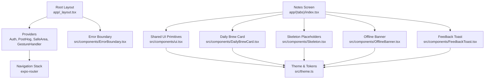
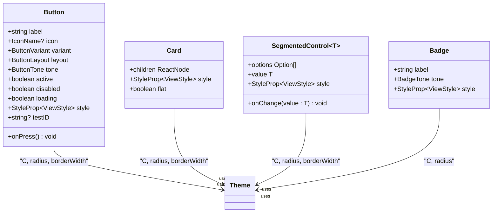
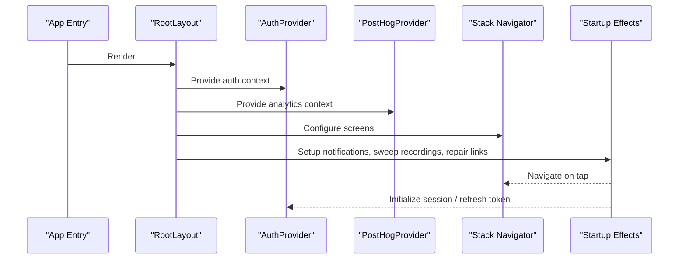
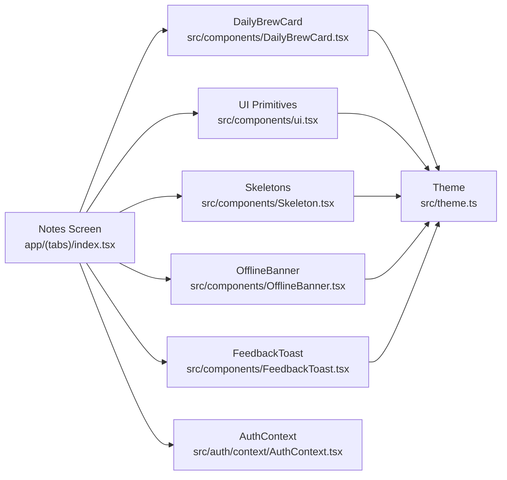

# Component Patterns

<cite>
**Referenced Files in This Document**
- [app/_layout.tsx](file://app/_layout.tsx)
- [src/theme.ts](file://src/theme.ts)
- [src/components/ui.tsx](file://src/components/ui.tsx)
- [src/components/index.ts](file://src/components/index.ts)
- [src/components/ErrorBoundary.tsx](file://src/components/ErrorBoundary.tsx)
- [src/components/Skeleton.tsx](file://src/components/Skeleton.tsx)
- [src/components/OfflineBanner.tsx](file://src/components/OfflineBanner.tsx)
- [src/components/FeedbackToast.tsx](file://src/components/FeedbackToast.tsx)
- [src/components/DailyBrewCard.tsx](file://src/components/DailyBrewCard.tsx)
- [src/auth/context/AuthContext.tsx](file://src/auth/context/AuthContext.tsx)
- [src/auth/hooks/useChangePassword.ts](file://src/auth/hooks/useChangePassword.ts)
- [app/(tabs)/index.tsx](file://app/(tabs)/index.tsx)
</cite>

## Table of Contents
1. [Introduction](#introduction)
2. [Project Structure](#project-structure)
3. [Core Components](#core-components)
4. [Architecture Overview](#architecture-overview)
5. [Detailed Component Analysis](#detailed-component-analysis)
6. [Dependency Analysis](#dependency-analysis)
7. [Performance Considerations](#performance-considerations)
8. [Troubleshooting Guide](#troubleshooting-guide)
9. [Conclusion](#conclusion)

## Introduction
This document explains the component design patterns and architectural principles used across the application, focusing on:
- Separation between presentation components and business logic
- Prop interface design patterns and composition strategies
- Event handling strategies and lifecycle management
- Reusable UI primitives from the shared component library
- Custom hooks usage, memoization, and performance optimization techniques
- Accessibility considerations, responsive design patterns, and cross-platform compatibility approaches

The goal is to make these patterns accessible to both technical and non-technical readers while providing concrete references to source files for deeper exploration.

## Project Structure
At a high level:
- The root layout wires up global providers (auth, analytics, sharing, safe area), navigation, and app-wide side effects like notifications and cleanup tasks.
- A shared UI primitive layer provides consistent visual building blocks (buttons, cards, badges, segmented controls).
- Feature-specific screens compose these primitives with domain logic via custom hooks and contexts.
- A centralized theme defines colors, typography, spacing, and radii to ensure consistency.

**Diagram sources**
- [app/_layout.tsx:1-102](file://app/_layout.tsx#L1-L102)
- [src/theme.ts:1-81](file://src/theme.ts#L1-L81)
- [src/components/ui.tsx:1-295](file://src/components/ui.tsx#L1-L295)
- [app/(tabs)/index.tsx:1-800](file://app/(tabs)/index.tsx#L1-L800)

**Section sources**
- [app/_layout.tsx:1-102](file://app/_layout.tsx#L1-L102)
- [src/theme.ts:1-81](file://src/theme.ts#L1-L81)

## Core Components
The shared UI primitives are defined in a single module and exported through an index for easy consumption by screens and feature components.

Key primitives:
- Button: Multiple variants (cta, outline, box, toolbar) with consistent styling, loading states, disabled states, and tone options.
- Card: Bordered rounded container with optional flat mode for nested contexts.
- SegmentedControl: Typed selection control with label/value pairs and selected state styling.
- Badge: Small pill labels with tone-based color schemes.

Design principles:
- Centralized styling via theme tokens (colors, radius, border widths).
- Props-driven behavior (variants, tones, layouts) rather than ad-hoc inline styles.
- Consistent accessibility attributes (testIDs) for automated testing.

**Diagram sources**
- [src/components/ui.tsx:15-206](file://src/components/ui.tsx#L15-L206)
- [src/theme.ts:1-81](file://src/theme.ts#L1-L81)

**Section sources**
- [src/components/ui.tsx:1-295](file://src/components/ui.tsx#L1-L295)
- [src/components/index.ts:1-7](file://src/components/index.ts#L1-L7)
- [src/theme.ts:1-81](file://src/theme.ts#L1-L81)

## Architecture Overview
The root layout composes providers that establish global concerns:
- Authentication context for user state and actions
- Analytics provider for tracking
- Share intent provider for OS-level sharing
- Safe area and gesture handler for platform-safe rendering
- Navigation stack for routing

It also initializes background tasks and notification handlers at startup.

**Diagram sources**
- [app/_layout.tsx:1-102](file://app/_layout.tsx#L1-L102)

**Section sources**
- [app/_layout.tsx:1-102](file://app/_layout.tsx#L1-L102)

## Detailed Component Analysis

### Shared UI Primitives (Button, Card, SegmentedControl, Badge)
- Prop interfaces are strongly typed with discriminated unions for variants and tones.
- Visual behavior is driven by props; internal state is minimal and deterministic.
- Loading and disabled states are handled consistently across variants.
- Styles are derived from the central theme to avoid duplication and drift.

Best practices demonstrated:
- Use of testIDs for automation-friendly testing.
- Composition over configuration: small props enable many visual outcomes without deep nesting.
- Avoiding inline style proliferation by using StyleSheet and theme tokens.

**Section sources**
- [src/components/ui.tsx:15-206](file://src/components/ui.tsx#L15-L206)
- [src/theme.ts:1-81](file://src/theme.ts#L1-L81)

### Error Boundary
- Class-based error boundary captures render-time errors and presents a friendly fallback.
- Provides a reset mechanism to recover from errors without full app restart.
- In development, exposes debug info for easier troubleshooting.

Usage pattern:
- Wrap the entire app tree to catch unexpected crashes and maintain resilience.

**Section sources**
- [src/components/ErrorBoundary.tsx:1-162](file://src/components/ErrorBoundary.tsx#L1-L162)
- [app/_layout.tsx:87-102](file://app/_layout.tsx#L87-L102)

### Skeleton Placeholders
- Lightweight placeholders that preserve layout during loading to reduce perceived latency.
- Respects OS “reduce motion” settings for accessibility.
- Composable building blocks for list skeletons and row skeletons.

Accessibility:
- Decorative elements hidden from screen readers to avoid noise.
- Container announces progress role and label for meaningful feedback.

**Section sources**
- [src/components/Skeleton.tsx:1-150](file://src/components/Skeleton.tsx#L1-L150)

### Offline Banner
- Shows a transient banner when coming back online or syncing completes.
- Uses animated transitions for smooth UX.
- Communicates status clearly without overwhelming the user.

Event handling:
- Detects network state changes and sync completion to show/hide appropriately.

**Section sources**
- [src/components/OfflineBanner.tsx:1-79](file://src/components/OfflineBanner.tsx#L1-L79)

### Feedback Toast
- Bottom-anchored interactive toast with auto-dismiss and manual dismissal.
- Animations for entrance and exit; supports retry flows where persistence is desired.

Event handling:
- Emits callbacks for thumbs up/down and dismiss actions.
- Integrates with analytics and feedback submission flows.

**Section sources**
- [src/components/FeedbackToast.tsx:1-111](file://src/components/FeedbackToast.tsx#L1-L111)

### Daily Brew Card
- Self-contained card aggregating weather, events, news, verse, and quote.
- Feature-flag gated; renders null when disabled to skip fetch logic.
- Stale-while-revalidate caching strategy for fast initial display and background refresh.
- Animated entrance and dismissal with layout animations for smooth transitions.

Data flow:
- Parallel fetching of events, weather, and news with robust error handling per stream.
- Local cache read/write with bounded updates to prevent corruption.

Accessibility:
- Skeleton placeholders hide decorative content from assistive tech.
- Clear messaging for unavailable features (e.g., weather denied).

**Section sources**
- [src/components/DailyBrewCard.tsx:1-431](file://src/components/DailyBrewCard.tsx#L1-L431)

### Notes Screen (Feature Composition)
- Composes shared primitives and feature components to build the main notes experience.
- Implements search with debouncing and memoized filtering to optimize performance.
- Uses FlatList with windowing to limit rendered items and improve responsiveness.
- Manages local state for modals, feedback prompts, and animations.

Performance techniques:
- Memoized derived text for note cards to avoid expensive HTML parsing on every render.
- Debounced search input to reduce re-renders and analytics calls.
- Efficient event map updates to avoid unnecessary re-renders.

Accessibility:
- TestIDs for key interactions (search input, clear button, create note, pin toggle, delete).
- Meaningful empty states and error messages.

**Section sources**
- [app/(tabs)/index.tsx:1-800](file://app/(tabs)/index.tsx#L1-L800)

### Authentication Context and Hooks
- Centralizes user state, login/logout flows, and post-login workflows including E2EE key bootstrap and calendar permissions.
- Provides methods to update user profile and preferences, ensuring immediate UI updates.
- Custom hook useChangePassword encapsulates password change logic and E2EE key rewrap.

Lifecycle management:
- Initializes session on mount, refreshes tokens in background, and handles recovery flows.
- Ensures sync readiness before enabling certain features.

**Section sources**
- [src/auth/context/AuthContext.tsx:1-259](file://src/auth/context/AuthContext.tsx#L1-L259)
- [src/auth/hooks/useChangePassword.ts:1-44](file://src/auth/hooks/useChangePassword.ts#L1-L44)

## Dependency Analysis
The application follows a layered dependency model:
- Screens depend on shared UI primitives and feature components.
- Feature components depend on theme tokens and domain utilities.
- Global providers wrap the app to supply cross-cutting concerns.

**Diagram sources**
- [app/(tabs)/index.tsx:1-800](file://app/(tabs)/index.tsx#L1-L800)
- [src/components/DailyBrewCard.tsx:1-431](file://src/components/DailyBrewCard.tsx#L1-L431)
- [src/components/ui.tsx:1-295](file://src/components/ui.tsx#L1-L295)
- [src/components/Skeleton.tsx:1-150](file://src/components/Skeleton.tsx#L1-L150)
- [src/components/OfflineBanner.tsx:1-79](file://src/components/OfflineBanner.tsx#L1-L79)
- [src/components/FeedbackToast.tsx:1-111](file://src/components/FeedbackToast.tsx#L1-L111)
- [src/theme.ts:1-81](file://src/theme.ts#L1-L81)
- [src/auth/context/AuthContext.tsx:1-259](file://src/auth/context/AuthContext.tsx#L1-L259)

**Section sources**
- [app/(tabs)/index.tsx:1-800](file://app/(tabs)/index.tsx#L1-L800)
- [src/components/DailyBrewCard.tsx:1-431](file://src/components/DailyBrewCard.tsx#L1-L431)
- [src/components/ui.tsx:1-295](file://src/components/ui.tsx#L1-L295)
- [src/components/Skeleton.tsx:1-150](file://src/components/Skeleton.tsx#L1-L150)
- [src/components/OfflineBanner.tsx:1-79](file://src/components/OfflineBanner.tsx#L1-L79)
- [src/components/FeedbackToast.tsx:1-111](file://src/components/FeedbackToast.tsx#L1-L111)
- [src/theme.ts:1-81](file://src/theme.ts#L1-L81)
- [src/auth/context/AuthContext.tsx:1-259](file://src/auth/context/AuthContext.tsx#L1-L259)

## Performance Considerations
- Memoization: Derived text for note cards is cached to avoid expensive HTML parsing on every render. Search filtering uses useMemo to minimize recomputation.
- Windowing: FlatList configured with initialNumToRender, maxToRenderPerBatch, and windowSize to limit rendering cost for large lists.
- Debouncing: Search input is debounced to reduce re-renders and analytics calls.
- Caching: Daily Brew card uses stale-while-revalidate caching to present data instantly and refresh in the background.
- Animation efficiency: Native driver animations and careful animation triggers to avoid jank.
- Conditional rendering: Feature flags and dismissed states prevent unnecessary work and rendering.

[No sources needed since this section provides general guidance]

## Troubleshooting Guide
Common issues and strategies:
- Errors: ErrorBoundary catches render-time exceptions and offers a reset path; in development, debug info is exposed.
- Network state: OfflineBanner communicates sync status and helps users understand connectivity changes.
- Session issues: AuthContext handles token refresh, logout, and recovery flows; failures are logged and handled gracefully.
- Performance bottlenecks: Use memoization and windowing to reduce re-renders; monitor FlatList performance with large datasets.

**Section sources**
- [src/components/ErrorBoundary.tsx:1-162](file://src/components/ErrorBoundary.tsx#L1-L162)
- [src/components/OfflineBanner.tsx:1-79](file://src/components/OfflineBanner.tsx#L1-L79)
- [src/auth/context/AuthContext.tsx:1-259](file://src/auth/context/AuthContext.tsx#L1-L259)

## Conclusion
The application employs a clear separation between presentation and business logic, with reusable UI primitives and a centralized theme ensuring consistency. Custom hooks and contexts manage complex state and side effects, while performance optimizations like memoization, windowing, and caching keep the app responsive. Accessibility and cross-platform considerations are integrated throughout, from skeleton placeholders respecting reduced motion to platform-specific behaviors in authentication and calendar permissions. These patterns provide a scalable foundation for future feature development and maintenance.

[No sources needed since this section summarizes without analyzing specific files]