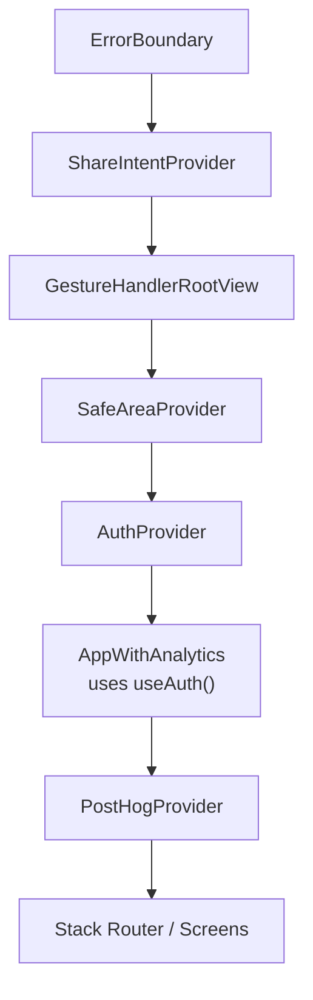
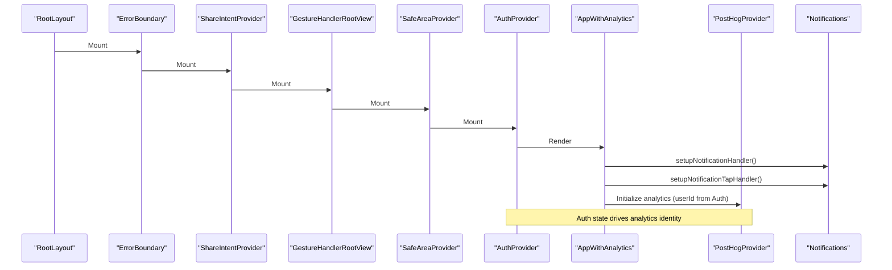
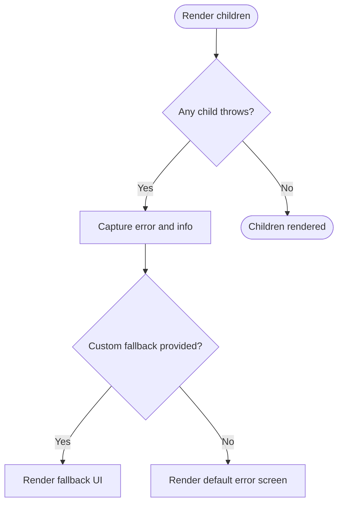
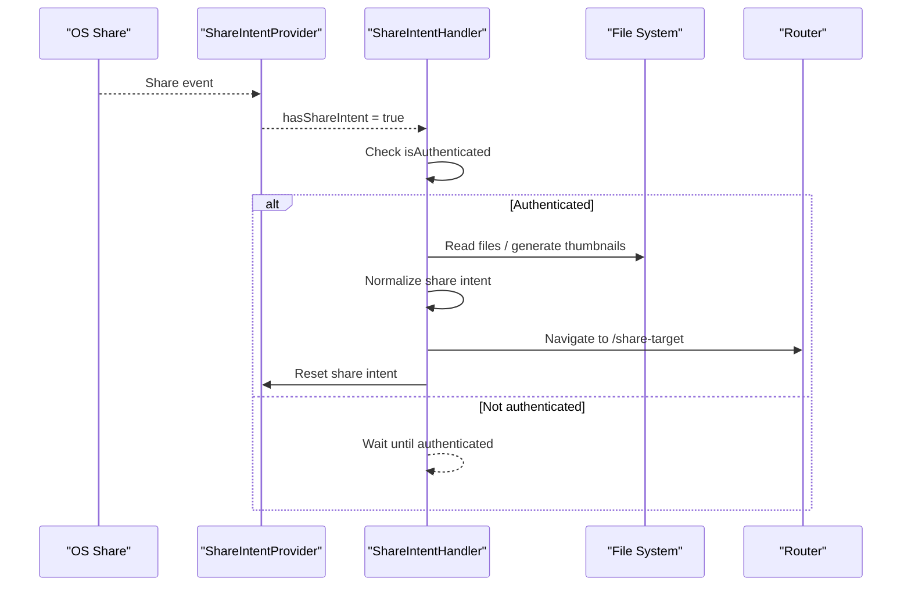
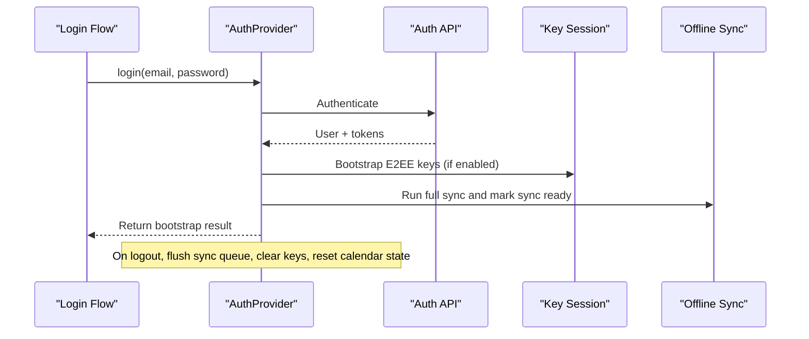
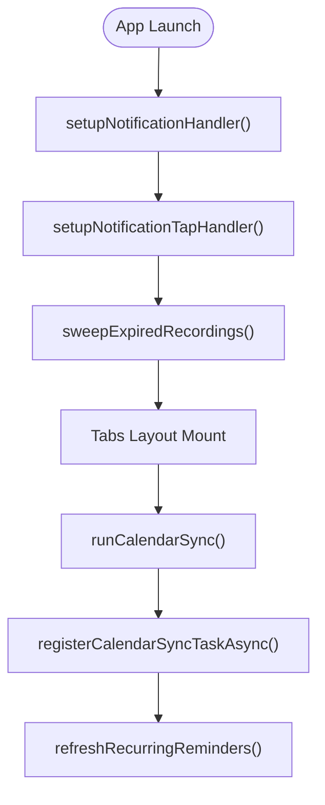
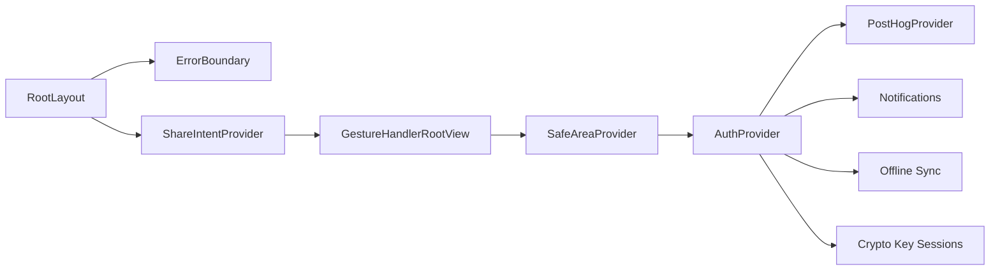

# Provider Hierarchy

<cite>
**Referenced Files in This Document**
- [app/_layout.tsx](file://app/_layout.tsx)
- [src/components/ErrorBoundary.tsx](file://src/components/ErrorBoundary.tsx)
- [src/components/ShareIntentHandler.tsx](file://src/components/ShareIntentHandler.tsx)
- [src/analytics/PostHogProvider.tsx](file://src/analytics/PostHogProvider.tsx)
- [src/analytics/posthog.ts](file://src/analytics/posthog.ts)
- [src/auth/context/AuthContext.tsx](file://src/auth/context/AuthContext.tsx)
- [src/calendarSyncTask.ts](file://src/calendarSyncTask.ts)
- [src/notifications.ts](file://src/notifications.ts)
</cite>

## Table of Contents
1. [Introduction](#introduction)
2. [Project Structure](#project-structure)
3. [Core Components](#core-components)
4. [Architecture Overview](#architecture-overview)
5. [Detailed Component Analysis](#detailed-component-analysis)
6. [Dependency Analysis](#dependency-analysis)
7. [Performance Considerations](#performance-considerations)
8. [Troubleshooting Guide](#troubleshooting-guide)
9. [Conclusion](#conclusion)

## Introduction
This document explains the provider hierarchy and initialization sequence at the application root, focusing on how ShareIntentProvider, ErrorBoundary, GestureHandlerRootView, SafeAreaProvider, AuthProvider, and PostHogProvider are composed and initialized. It details each provider’s responsibilities, dependencies, lifecycle interactions, background task integration, system integrations, error propagation, cleanup procedures, and performance implications of nesting providers.

## Project Structure
The root layout composes providers to establish global context, UI primitives, security boundaries, analytics, authentication, and OS integrations. The order is deliberate:
- ErrorBoundary wraps everything to catch rendering errors.
- ShareIntentProvider enables handling of OS share intents.
- GestureHandlerRootView provides gesture handling for the app tree.
- SafeAreaProvider ensures safe area insets across devices.
- AuthProvider manages user session, sync readiness, and E2EE key lifecycle.
- PostHogProvider initializes analytics and identifies users when available.



**Diagram sources**
- [app/_layout.tsx:87-101](file://app/_layout.tsx#L87-L101)

**Section sources**
- [app/_layout.tsx:1-102](file://app/_layout.tsx#L1-L102)

## Core Components
- ErrorBoundary: Catches render-time errors and presents a recoverable UI; logs error details in development.
- ShareIntentProvider: Bridges OS share events into the app via expo-share-intent; configured with debug mode, reset-on-background behavior, and URL scheme.
- GestureHandlerRootView: Root container for react-native-gesture-handler to enable gestures throughout the app.
- SafeAreaProvider: Provides safe area metrics to avoid notches and system UI overlaps.
- AuthProvider: Manages authentication state, token refresh, login/logout workflows, E2EE key bootstrap/cleanup, calendar permissions, and sync readiness.
- PostHogProvider: Initializes analytics, respects GDPR consent, identifies or resets users based on auth state changes.

**Section sources**
- [src/components/ErrorBoundary.tsx:18-88](file://src/components/ErrorBoundary.tsx#L18-L88)
- [app/_layout.tsx:87-101](file://app/_layout.tsx#L87-L101)
- [src/analytics/PostHogProvider.tsx:20-60](file://src/analytics/PostHogProvider.tsx#L20-L60)
- [src/auth/context/AuthContext.tsx:77-249](file://src/auth/context/AuthContext.tsx#L77-L249)

## Architecture Overview
The root layout wires up providers and side effects that integrate with OS features (notifications, background tasks) and app lifecycle.



**Diagram sources**
- [app/_layout.tsx:27-85](file://app/_layout.tsx#L27-L85)
- [src/notifications.ts:46-57](file://src/notifications.ts#L46-L57)
- [src/analytics/PostHogProvider.tsx:20-60](file://src/analytics/PostHogProvider.tsx#L20-L60)

**Section sources**
- [app/_layout.tsx:27-85](file://app/_layout.tsx#L27-L85)
- [src/notifications.ts:46-57](file://src/notifications.ts#L46-L57)

## Detailed Component Analysis

### ErrorBoundary
- Responsibility: Wrap the entire app to catch unhandled render errors and present a friendly fallback with a “Try again” action. In development, shows detailed stack traces.
- Error propagation: Captures errors via React error boundaries; logs them to console for debugging.
- Cleanup: None required; purely presentational and defensive.
- Performance: Minimal overhead; only renders fallback when an error occurs.



**Diagram sources**
- [src/components/ErrorBoundary.tsx:18-88](file://src/components/ErrorBoundary.tsx#L18-L88)

**Section sources**
- [src/components/ErrorBoundary.tsx:18-88](file://src/components/ErrorBoundary.tsx#L18-L88)

### ShareIntentProvider and ShareIntentHandler
- Responsibility: Handle OS share intents (text, URLs, files, metadata) and route them into the editor workflow.
- Dependencies: Requires router context and authentication to proceed; uses file system and video thumbnail utilities to process shared content.
- Initialization: Mounted under root layout; handler component listens for new share intents and normalizes payloads into a draft for the editor.
- Lifecycle: Handles cold-start, background, and foreground shares; resets intent after processing to avoid duplicate handling.
- Error handling: Logs raw intent data for diagnostics; shows user feedback if normalization fails or yields empty drafts.



**Diagram sources**
- [src/components/ShareIntentHandler.tsx:25-87](file://src/components/ShareIntentHandler.tsx#L25-L87)
- [app/_layout.tsx:87-101](file://app/_layout.tsx#L87-L101)

**Section sources**
- [src/components/ShareIntentHandler.tsx:1-88](file://src/components/ShareIntentHandler.tsx#L1-L88)
- [app/_layout.tsx:87-101](file://app/_layout.tsx#L87-L101)

### GestureHandlerRootView and SafeAreaProvider
- Responsibility: Provide gesture handling and safe area insets globally.
- Dependencies: None beyond React Native environment.
- Initialization: Wrapped around the app tree to ensure consistent behavior across screens.
- Performance: Lightweight containers; essential for smooth interactions and correct layout on various devices.

**Section sources**
- [app/_layout.tsx:87-101](file://app/_layout.tsx#L87-L101)

### AuthProvider
- Responsibility: Manage user session, token refresh, login/logout, E2EE key bootstrap/cleanup, calendar permissions, and sync readiness.
- Dependencies: Uses auth API, storage, offline sync, crypto key sessions, and daily brew preferences.
- Initialization: On mount, checks stored user and attempts background token refresh; if tokens exist without cached user, fetches current user profile.
- Lifecycle:
  - Login triggers full workflow including E2EE key bootstrap, migrations, calendar permission prompts, and sync readiness updates.
  - Logout flushes pending sync queue, clears keys, resets calendar sync state, and clears recovery code.
- Error handling: Gracefully handles network failures and token issues; does not clear user state unless tokens are invalidated by server.



**Diagram sources**
- [src/auth/context/AuthContext.tsx:147-177](file://src/auth/context/AuthContext.tsx#L147-L177)
- [src/auth/context/AuthContext.tsx:206-228](file://src/auth/context/AuthContext.tsx#L206-L228)

**Section sources**
- [src/auth/context/AuthContext.tsx:77-249](file://src/auth/context/AuthContext.tsx#L77-L249)

### PostHogProvider
- Responsibility: Initialize analytics, register super properties, identify/reset users based on auth state, and respect GDPR consent.
- Dependencies: posthog module functions for init, identify, reset, and consent management.
- Initialization: Runs once per app lifetime; initializes PostHog instance if API key is configured and respects opt-out status.
- Lifecycle: When userId changes, identifies the user; when user logs out, resets analytics identity.
- Error handling: Silently returns null if initialization fails; no-op calls guard against missing instance.

```mermaid
sequenceDiagram
participant AP as "AuthProvider"
participant PH as "PostHogProvider"
participant PHM as "PostHog Module"
AP-->>PH : userId changes
PH->>PHM : initPostHog(userId) (first time)
PH->>PHM : identifyUser(userId) (on login)
PH->>PHM : resetUser() (on logout)
Note over PH : Respects analytics consent; no-op if disabled
```

**Diagram sources**
- [src/analytics/PostHogProvider.tsx:20-60](file://src/analytics/PostHogProvider.tsx#L20-L60)
- [src/analytics/posthog.ts:40-78](file://src/analytics/posthog.ts#L40-L78)

**Section sources**
- [src/analytics/PostHogProvider.tsx:1-65](file://src/analytics/PostHogProvider.tsx#L1-L65)
- [src/analytics/posthog.ts:1-121](file://src/analytics/posthog.ts#L1-L121)

### Notifications and Background Tasks Integration
- Foreground notifications: Setup notification handler and tap-to-open event routing in AppWithAnalytics.
- Background tasks: Calendar sync task registered at module scope so OS can invoke it during headless launches; best-effort periodic sync.
- Lifecycle:
  - On app start, setup notification handlers and perform retention sweeps.
  - On tabs layout mount, run calendar sync, register background task, and refresh recurring reminders/device calendar entries.



**Diagram sources**
- [app/_layout.tsx:27-48](file://app/_layout.tsx#L27-L48)
- [src/calendarSyncTask.ts:26-51](file://src/calendarSyncTask.ts#L26-L51)
- [src/notifications.ts:46-57](file://src/notifications.ts#L46-L57)

**Section sources**
- [app/_layout.tsx:27-48](file://app/_layout.tsx#L27-L48)
- [src/calendarSyncTask.ts:1-52](file://src/calendarSyncTask.ts#L1-L52)
- [src/notifications.ts:1-267](file://src/notifications.ts#L1-L267)

## Dependency Analysis
- Root layout depends on:
  - ErrorBoundary for crash resilience.
  - ShareIntentProvider for OS share handling.
  - GestureHandlerRootView and SafeAreaProvider for UI primitives.
  - AuthProvider for user session and sync readiness.
  - PostHogProvider for analytics identity and tracking.
- AuthProvider depends on:
  - Auth API and storage for session management.
  - Crypto key sessions for E2EE bootstrap/cleanup.
  - Offline sync for data synchronization.
  - Calendar permissions for device integration.
- PostHogProvider depends on:
  - Analytics module for initialization and user identification.
  - Consent management to respect user preferences.



**Diagram sources**
- [app/_layout.tsx:87-101](file://app/_layout.tsx#L87-L101)
- [src/auth/context/AuthContext.tsx:77-249](file://src/auth/context/AuthContext.tsx#L77-L249)
- [src/analytics/PostHogProvider.tsx:20-60](file://src/analytics/PostHogProvider.tsx#L20-L60)

**Section sources**
- [app/_layout.tsx:87-101](file://app/_layout.tsx#L87-L101)
- [src/auth/context/AuthContext.tsx:77-249](file://src/auth/context/AuthContext.tsx#L77-L249)
- [src/analytics/PostHogProvider.tsx:20-60](file://src/analytics/PostHogProvider.tsx#L20-L60)

## Performance Considerations
- Provider nesting depth: Each provider adds a small overhead; keep nesting minimal and purposeful.
- Async initialization: AuthProvider performs background token refresh and E2EE key bootstrap; these should not block UI rendering.
- Analytics initialization: PostHogProvider initializes once and guards against re-initialization; user identification updates are lightweight.
- Share intent processing: File reading and thumbnail generation are asynchronous and fire-and-forget where possible to avoid blocking startup.
- Background tasks: Calendar sync runs periodically but is best-effort; rely on foreground sync for reliability.

[No sources needed since this section provides general guidance]

## Troubleshooting Guide
- Render errors: ErrorBoundary catches and displays a user-friendly message; check console logs for detailed stack traces in development.
- Share intent issues: ShareIntentHandler logs raw intent data; verify source app payload and file access permissions.
- Authentication failures: AuthProvider logs background token refresh failures; ensure network connectivity and valid tokens.
- Analytics not tracking: PostHogProvider respects GDPR consent; verify consent status and API key configuration.
- Notification taps: Ensure notification handlers are set up and router navigation works; check last notification response handling.

**Section sources**
- [src/components/ErrorBoundary.tsx:32-36](file://src/components/ErrorBoundary.tsx#L32-L36)
- [src/components/ShareIntentHandler.tsx:40-45](file://src/components/ShareIntentHandler.tsx#L40-L45)
- [src/auth/context/AuthContext.tsx:115-118](file://src/auth/context/AuthContext.tsx#L115-L118)
- [src/analytics/posthog.ts:40-78](file://src/analytics/posthog.ts#L40-L78)
- [src/notifications.ts:252-264](file://src/notifications.ts#L252-L264)

## Conclusion
The provider hierarchy establishes a robust foundation for the application, combining error resilience, OS integrations, authentication, and analytics. The initialization sequence ensures critical services are ready before user interaction, while background tasks and notifications provide seamless system integration. Proper composition and careful attention to performance and error handling create a reliable user experience across diverse environments.

[No sources needed since this section summarizes without analyzing specific files]