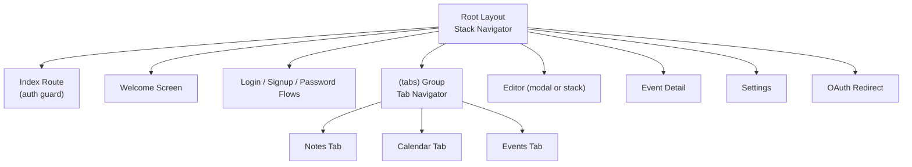
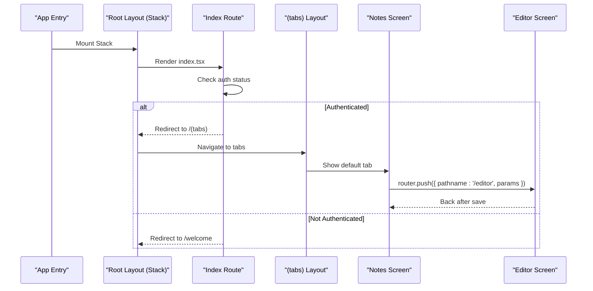
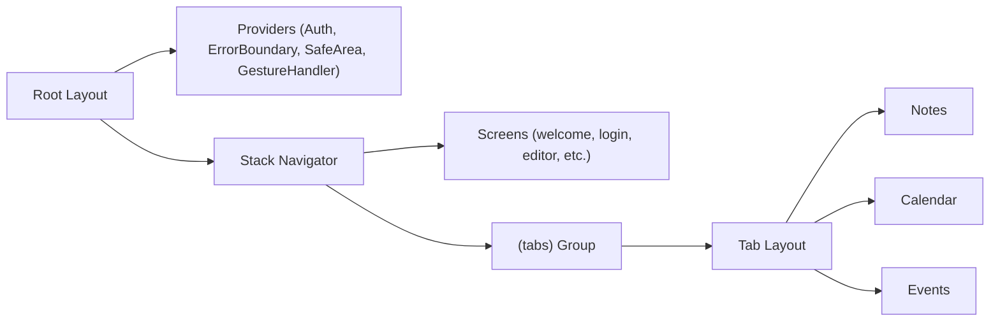

# Routing System

<cite>
**Referenced Files in This Document**
- [app/_layout.tsx](file://app/_layout.tsx)
- [app/(tabs)/_layout.tsx](file://app/(tabs)/_layout.tsx)
- [app/index.tsx](file://app/index.tsx)
- [app/welcome.tsx](file://app/welcome.tsx)
- [app/login.tsx](file://app/login.tsx)
- [app/editor.tsx](file://app/editor.tsx)
- [app/event.tsx](file://app/event.tsx)
- [app/settings.tsx](file://app/settings.tsx)
- [app/oauth2redirect.tsx](file://app/oauth2redirect.tsx)
</cite>

## Table of Contents
1. Introduction
2. Project Structure
3. Core Components
4. Architecture Overview
5. Detailed Component Analysis
6. Dependency Analysis
7. Performance Considerations
8. Troubleshooting Guide
9. Conclusion

## Introduction
This document explains the routing system implemented with Expo Router’s file-based routing. It covers the root layout and Stack navigation, tab-based navigation under (tabs), screen configurations and animations, route parameters, programmatic navigation patterns, modal presentations, deep linking support, and performance strategies such as lazy loading and preloading.

## Project Structure
The app uses Expo Router’s convention-based routes:
- Root layout defines a global Stack navigator that wraps all screens and configures per-screen options like header visibility and animations.
- A dedicated (tabs) group provides a bottom tab navigator for primary flows (Notes, Calendar, Events).
- Top-level screens handle authentication flow, editor, event detail, settings, and OAuth redirect handling.

**Diagram sources**
- [app/_layout.tsx:50-82](file://app/_layout.tsx#L50-L82)
- [app/(tabs)/_layout.tsx:130-172](file://app/(tabs)/_layout.tsx#L130-L172)
- [app/index.tsx:19-24](file://app/index.tsx#L19-L24)

**Section sources**
- [app/_layout.tsx:50-82](file://app/_layout.tsx#L50-L82)
- [app/(tabs)/_layout.tsx:130-172](file://app/(tabs)/_layout.tsx#L130-L172)
- [app/index.tsx:19-24](file://app/index.tsx#L19-L24)

## Core Components
- Root Stack: Declares all top-level routes and their presentation styles (stack vs modal), plus animation options.
- Tabs Group: Defines three tabs (Notes, Calendar, Events) with lazy mounting and freeze-on-blur to optimize performance.
- Auth Guard at Root Index: Shows a spinner while auth state resolves, then redirects to either the main tabs or the welcome screen.
- Deep Link Handler: A minimal route that catches OAuth redirects and returns to the app root.

Key behaviors:
- Modal presentations are used for focused tasks (editor, event-editor, sketch, daily-verse, share-target).
- Slide/fade animations are configured per screen to guide transitions.
- The tabs navigator is intentionally lazy and freezes offscreen tabs to reduce background work.

**Section sources**
- [app/_layout.tsx:50-82](file://app/_layout.tsx#L50-L82)
- [app/(tabs)/_layout.tsx:130-172](file://app/(tabs)/_layout.tsx#L130-L172)
- [app/index.tsx:19-24](file://app/index.tsx#L19-L24)
- [app/oauth2redirect.tsx:1-12](file://app/oauth2redirect.tsx#L1-L12)

## Architecture Overview
The routing architecture centers on a root Stack that orchestrates high-level flows and a nested Tabs group for core features. Screens use programmatic navigation via expo-router’s router API and read route parameters through useLocalSearchParams.

**Diagram sources**
- [app/index.tsx:19-24](file://app/index.tsx#L19-L24)
- [app/(tabs)/_layout.tsx:130-172](file://app/(tabs)/_layout.tsx#L130-L172)
- [app/editor.tsx:592-597](file://app/editor.tsx#L592-L597)

## Detailed Component Analysis

### Root Stack Navigation and Animations
- The root Stack declares all top-level routes and sets header visibility and gestures where needed.
- Animations include fade for onboarding-like screens and slide_from_right for form-style screens.
- Several screens are presented modally to isolate user tasks (e.g., editor, event-editor, sketch, daily-verse, share-target).

Practical implications:
- Use stack navigation for linear flows (login/signup/password reset).
- Use modal presentations for focused editing or sharing experiences.
- Disable gestures on certain screens to prevent accidental back navigation during critical flows.

**Section sources**
- [app/_layout.tsx:50-82](file://app/_layout.tsx#L50-L82)

### Tab-Based Navigation in (tabs)
- Three tabs: Notes, Calendar, Events.
- Lazy mounting ensures heavy screens mount only when first visited.
- Freeze-on-blur prevents unnecessary re-renders when tabs are offscreen.
- Custom tab bar styling integrates safe area insets for Android gesture navigation compatibility.

Performance notes:
- Lazy + freezeOnBlur significantly reduces cold start cost and background work.
- An Android-only WebView pre-warm is mounted offscreen to avoid cold-start delays when opening the rich-text editor later.

**Section sources**
- [app/(tabs)/_layout.tsx:130-172](file://app/(tabs)/_layout.tsx#L130-L172)
- [app/(tabs)/_layout.tsx:173-180](file://app/(tabs)/_layout.tsx#L173-L180)

### Authentication Flow and Redirects
- The root index screen shows a loading indicator while determining authentication state.
- If authenticated, it redirects to the tabs; otherwise, it redirects to the welcome screen.
- Login flow handles different bootstrap states by navigating to recovery or code screens before entering the tabs.

Navigation patterns:
- Uses router.replace to avoid stacking login screens behind the main flow.
- Uses router.back for in-app back actions.

**Section sources**
- [app/index.tsx:19-24](file://app/index.tsx#L19-L24)
- [app/login.tsx:48-73](file://app/login.tsx#L48-L73)

### Programmatic Navigation Patterns
Common patterns observed across screens:
- Pushing to editor with parameters:
  - Notes list navigates to editor with noteId parameter.
  - Event detail navigates to event-editor with eventId and focus hints.
- Using replace for one-time flows (e.g., signup, analytics consent, Google connect intro).
- Using back for returning from detail/edit screens.

Examples:
- Notes to editor: router.push({ pathname: '/editor', params: { noteId } }).
- Event detail to editor: router.push(`/event-editor?eventId=${eventId}&from=detail&focus=${focus}`).
- Welcome to login/signup: router.push('/signup' or '/login').

**Section sources**
- [app/(tabs)/index.tsx:507-508](file://app/(tabs)/index.tsx#L507-L508)
- [app/(tabs)/index.tsx:707-708](file://app/(tabs)/index.tsx#L707-L708)
- [app/event.tsx:100-102](file://app/event.tsx#L100-L102)
- [app/welcome.tsx:56-57](file://app/welcome.tsx#L56-L57)
- [app/login.tsx:55-61](file://app/login.tsx#L55-L61)

### Route Parameters and Data Passing
- Route parameters are read using useLocalSearchParams.
- Examples:
  - Editor reads noteId, shared, onboarding to determine mode and content source.
  - Event detail reads eventId to load and display the selected event.

Best practices:
- Keep parameters minimal and typed via generics for safety.
- Validate presence of required parameters before rendering.

**Section sources**
- [app/editor.tsx:592-597](file://app/editor.tsx#L592-L597)
- [app/event.tsx:77-80](file://app/event.tsx#L77-L80)

### Modal Presentations
Modal screens are declared in the root Stack with presentation: 'modal'. These include:
- share-target
- event-editor
- trips/trip-editor
- sketch
- daily-verse

Use cases:
- Isolate complex editing or sharing flows without disrupting the underlying stack.
- Provide clear entry/exit semantics with native modal transitions.

**Section sources**
- [app/_layout.tsx:67-72](file://app/_layout.tsx#L67-L72)

### Deep Linking Support
- OAuth2 redirect route matches platform-specific schemes and paths, then redirects back to the app root so expo-auth-session can resolve pending flows.
- This prevents users from landing on an “Unmatched Route” screen when returning from external browsers.

Implementation highlights:
- Minimal route that renders a Redirect to "/" to hand control back to the app.

**Section sources**
- [app/oauth2redirect.tsx:1-12](file://app/oauth2redirect.tsx#L1-L12)

### Route Guards and First-Run Flows
- Root index acts as a gate based on authentication state.
- Tabs layout performs first-run checks:
  - Analytics consent screen if not decided.
  - Google Calendar connect intro if available and not connected.
  - Voice onboarding for new accounts based on account age and local flags.

These guards ensure compliance and guided onboarding without hardcoding logic into each screen.

**Section sources**
- [app/index.tsx:19-24](file://app/index.tsx#L19-L24)
- [app/(tabs)/_layout.tsx:56-93](file://app/(tabs)/_layout.tsx#L56-L93)

## Dependency Analysis
Routing dependencies and interactions:
- Root Stack depends on providers (auth, analytics, error boundary, safe area, gesture handler) to function correctly.
- Tabs depend on auth context for user info and on notification/calendar sync services that run on mount.
- Screens navigate using router APIs and consume local search params for data binding.

**Diagram sources**
- [app/_layout.tsx:87-101](file://app/_layout.tsx#L87-L101)
- [app/(tabs)/_layout.tsx:130-172](file://app/(tabs)/_layout.tsx#L130-L172)

**Section sources**
- [app/_layout.tsx:87-101](file://app/_layout.tsx#L87-L101)
- [app/(tabs)/_layout.tsx:130-172](file://app/(tabs)/_layout.tsx#L130-L172)

## Performance Considerations
- Lazy Loading: Tabs are set to lazy to defer mounting until first visit, reducing initial bundle and render costs.
- Freeze on Blur: Offscreen tabs freeze to avoid unnecessary re-renders triggered by shared store updates.
- WebView Pre-warming: On Android, a hidden WebView is mounted briefly to warm the engine before opening the rich-text editor, avoiding cold-start delays.
- List Optimization: Notes screen uses FlatList windowing and memoized text derivation to minimize expensive computations during scrolling and search.

Recommendations:
- Keep heavy components out of the initial render path.
- Prefer lazy groups for feature modules.
- Use freezeOnBlur for multi-tab apps to reduce background work.
- Pre-warm expensive subsystems (like WebViews) when appropriate.

**Section sources**
- [app/(tabs)/_layout.tsx:130-172](file://app/(tabs)/_layout.tsx#L130-L172)
- [app/(tabs)/_layout.tsx:173-180](file://app/(tabs)/_layout.tsx#L173-L180)
- [app/(tabs)/index.tsx:650-668](file://app/(tabs)/index.tsx#L650-L668)

## Troubleshooting Guide
Common issues and resolutions:
- Unmatched Route on OAuth return: Ensure a matching route exists for the redirect scheme/path; the provided route redirects back to the app root to allow expo-auth-session to complete.
- Stuck on login after success: Verify that the login flow uses router.replace to avoid stacking and that it navigates to the correct destination based on bootstrap status.
- Tabs not loading: Confirm lazy and freezeOnBlur are set appropriately; check that the tabs group is registered in the root Stack.
- Modal not closing: Ensure modal screens are declared with presentation: 'modal' in the root Stack and that back navigation is handled explicitly.

**Section sources**
- [app/oauth2redirect.tsx:1-12](file://app/oauth2redirect.tsx#L1-L12)
- [app/login.tsx:55-61](file://app/login.tsx#L55-L61)
- [app/_layout.tsx:50-82](file://app/_layout.tsx#L50-L82)

## Conclusion
The routing system leverages Expo Router’s file-based conventions to create a clean separation between high-level flows (root Stack) and core features (tabs). It uses modal presentations for focused tasks, implements robust first-run guards, supports deep linking for OAuth, and applies performance optimizations like lazy loading and freeze-on-blur. Programmatic navigation and typed route parameters provide predictable data flow across screens.