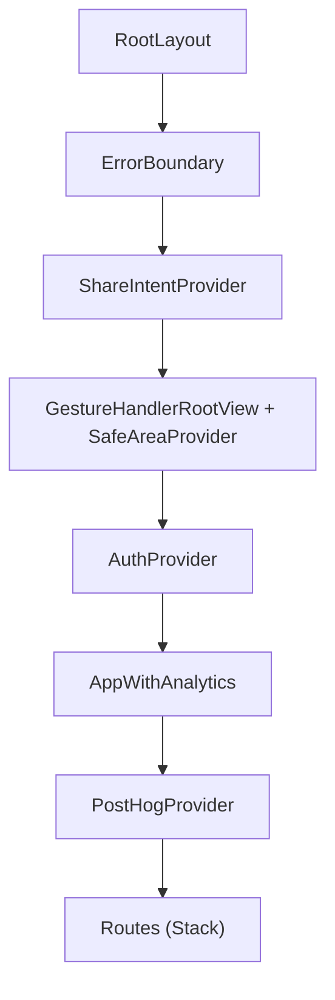
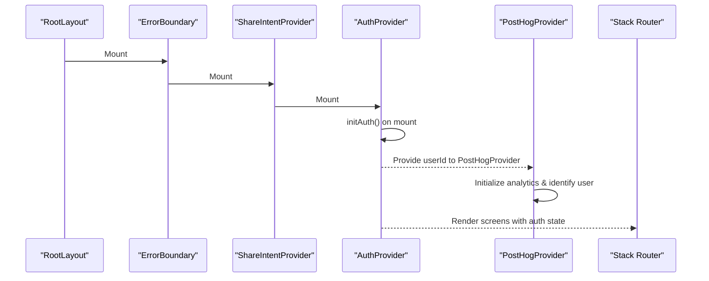
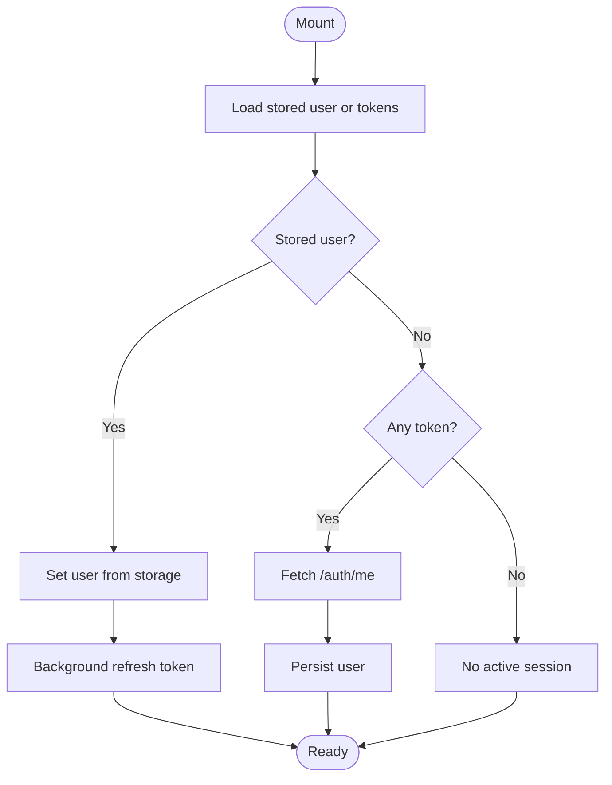
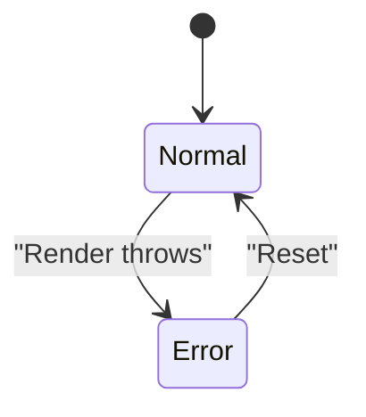
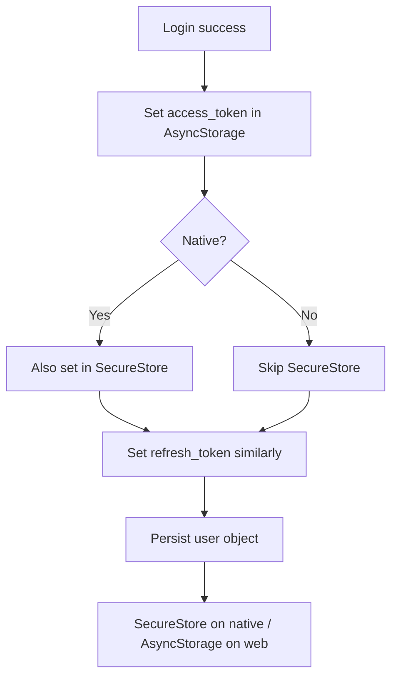
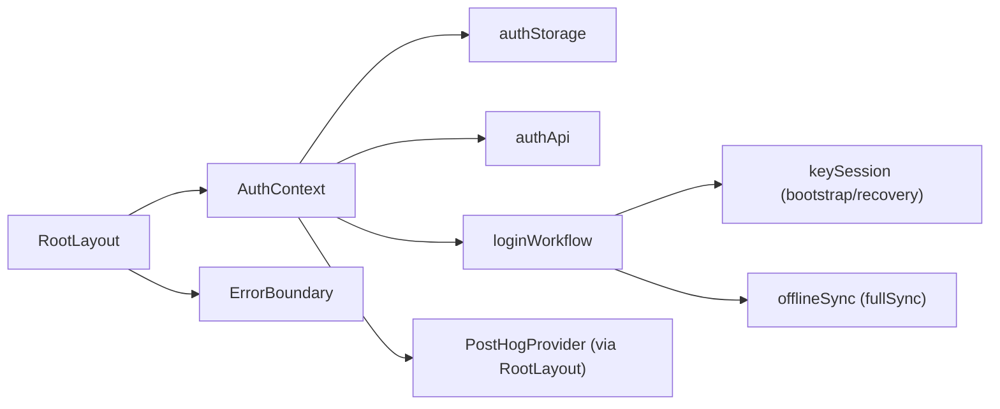

# State Management

<cite>
**Referenced Files in This Document**
- [RootLayout](file://app/_layout.tsx)
- [AuthContext](file://src/auth/context/AuthContext.tsx)
- [ErrorBoundary](file://src/components/ErrorBoundary.tsx)
- [authStorage](file://src/auth/storage/authStorage.ts)
- [authApi](file://src/auth/api/authApi.ts)
- [loginWorkflow](file://src/auth/loginWorkflow.ts)
- [PostHogProvider](file://src/analytics/PostHogProvider.tsx)
- [auth.types](file://src/auth/types/auth.types.ts)
</cite>

## Table of Contents
1. [Introduction](#introduction)
2. [Project Structure](#project-structure)
3. [Core Components](#core-components)
4. [Architecture Overview](#architecture-overview)
5. [Detailed Component Analysis](#detailed-component-analysis)
6. [Dependency Analysis](#dependency-analysis)
7. [Performance Considerations](#performance-considerations)
8. [Troubleshooting Guide](#troubleshooting-guide)
9. [Conclusion](#conclusion)

## Introduction
This document explains the state management architecture centered on React Context providers and global state patterns. It focuses on:
- The AuthContext implementation for authentication state, session management, and permission handling
- Provider hierarchy from RootLayout through AuthProvider to feature-specific contexts
- Error boundary implementation for graceful error handling and recovery
- Context consumption patterns, state persistence strategies, and performance optimizations such as context splitting and selective re-renders

## Project Structure
The application root composes multiple providers to establish a robust environment:
- ErrorBoundary wraps the entire app to catch rendering errors
- ShareIntentProvider handles OS share intents
- SafeAreaProvider and GestureHandlerRootView provide platform layout and gesture support
- AuthProvider provides authentication state and actions
- PostHogProvider initializes analytics and tracks user identity changes

**Diagram sources**
- [RootLayout:87-101](file://app/_layout.tsx#L87-L101)
- [PostHogProvider:20-59](file://src/analytics/PostHogProvider.tsx#L20-L59)

**Section sources**
- [RootLayout:87-101](file://app/_layout.tsx#L87-L101)
- [PostHogProvider:20-59](file://src/analytics/PostHogProvider.tsx#L20-L59)

## Core Components
- AuthContext: Central provider for user session, loading states, sync readiness, and auth actions (login, logout, refresh, name/preferences updates, recovery flows).
- authStorage: Secure, cross-platform persistence for tokens and user data using SecureStore on native and AsyncStorage on web.
- authApi: HTTP client for authentication endpoints with token injection, decryption of account fields, and error normalization.
- loginWorkflow: Framework-free orchestration of post-login tasks (E2EE key bootstrap, full sync, migrations, name push-back) with injected dependencies for testability.
- PostHogProvider: Analytics initialization and user identification lifecycle tied to auth state.
- ErrorBoundary: Global error catching UI with reset capability and debug info in development.

**Section sources**
- [AuthContext:52-258](file://src/auth/context/AuthContext.tsx#L52-L258)
- [authStorage:1-150](file://src/auth/storage/authStorage.ts#L1-L150)
- [authApi:8-259](file://src/auth/api/authApi.ts#L8-L259)
- [loginWorkflow:18-141](file://src/auth/loginWorkflow.ts#L18-L141)
- [PostHogProvider:20-59](file://src/analytics/PostHogProvider.tsx#L20-L59)
- [ErrorBoundary:18-89](file://src/components/ErrorBoundary.tsx#L18-L89)

## Architecture Overview
The provider hierarchy establishes a clear separation of concerns:
- RootLayout sets up infrastructure providers and mounts AuthProvider
- AuthProvider manages authentication state and orchestrates post-login workflows
- Feature-specific contexts (e.g., PostHogProvider) are nested inside AuthProvider where they depend on user identity
- ErrorBoundary ensures resilience across the tree

**Diagram sources**
- [RootLayout:87-101](file://app/_layout.tsx#L87-L101)
- [AuthContext:107-145](file://src/auth/context/AuthContext.tsx#L107-L145)
- [PostHogProvider:20-59](file://src/analytics/PostHogProvider.tsx#L20-L59)

## Detailed Component Analysis

### AuthContext: Authentication State, Session, and Permissions
Responsibilities:
- Maintain user, isLoading, isSyncReady, and recoveryCode state
- Persist and restore sessions via authStorage
- Refresh tokens in background and handle 401/403 by clearing tokens when necessary
- Orchestrate login flow including E2EE key bootstrap, full sync, migrations, and calendar permission prompts
- Manage recovery code lifecycle and key recovery
- Update user profile and preferences while keeping caches consistent

Key behaviors:
- On mount, load stored user or recover from tokens; attempt background token refresh
- Login triggers runLoginWorkflow which:
  - Requests calendar permissions (non-blocking)
  - Bootstraps E2EE keys if enabled
  - Runs full sync and migrations in background
  - Pushes back plaintext account name when appropriate
- Logout flushes pending sync queue, clears E2EE keys, resets calendar sync state, and clears local state

**Diagram sources**
- [AuthContext:107-145](file://src/auth/context/AuthContext.tsx#L107-L145)
- [authApi:122-164](file://src/auth/api/authApi.ts#L122-L164)

**Section sources**
- [AuthContext:52-258](file://src/auth/context/AuthContext.tsx#L52-L258)
- [loginWorkflow:49-141](file://src/auth/loginWorkflow.ts#L49-L141)

### Provider Hierarchy and Context Consumption
- RootLayout composes ErrorBoundary, ShareIntentProvider, SafeAreaProvider, GestureHandlerRootView, and AuthProvider
- AppWithAnalytics consumes useAuth to pass userId to PostHogProvider
- PostHogProvider initializes analytics once and identifies users when userId changes

Consumption pattern example:
- Components call useAuth to read user, isAuthenticated, isLoading, isSyncReady, and invoke login/logout/refresh/updateUserName/updateNewsPreferences
- Feature contexts like PostHogProvider subscribe to userId changes to manage analytics identity

**Section sources**
- [RootLayout:27-84](file://app/_layout.tsx#L27-L84)
- [PostHogProvider:20-59](file://src/analytics/PostHogProvider.tsx#L20-L59)

### Error Boundary: Graceful Handling and Recovery
- Catches render-time errors and displays a friendly fallback UI
- Provides a “Try again” action to reset state and continue
- In development, shows detailed error and component stack for debugging

**Diagram sources**
- [ErrorBoundary:18-89](file://src/components/ErrorBoundary.tsx#L18-L89)

**Section sources**
- [ErrorBoundary:18-89](file://src/components/ErrorBoundary.tsx#L18-L89)

### State Persistence Strategy
- Tokens and user data are persisted using a dual-store strategy:
  - Access and refresh tokens: AsyncStorage on all platforms; additionally SecureStore on native for enhanced security
  - User object: SecureStore on native; AsyncStorage on web
- Clearing all auth data removes both stores consistently
- Modal dismissal and first-note-saved flags are also persisted for UX gating

**Diagram sources**
- [authStorage:16-103](file://src/auth/storage/authStorage.ts#L16-L103)

**Section sources**
- [authStorage:1-150](file://src/auth/storage/authStorage.ts#L1-L150)

### Performance Optimization Techniques
- Context splitting: Separate contexts for different concerns (AuthContext for auth state; PostHogProvider for analytics) to limit re-renders to consumers that need specific slices
- Selective re-renders:
  - Use useCallback for stable function references in AuthContext value to avoid unnecessary child re-renders
  - Memoize derived values in consuming components (e.g., useMemo for computed properties)
  - Keep large objects out of frequently changing context values; prefer IDs and selectors
- Background work:
  - Token refresh and post-login tasks run without blocking UI
  - Sync readiness flag allows lazy loading of heavy features until data is ready
- Storage efficiency:
  - Prefer SecureStore for sensitive data on native to reduce risk and improve perceived security posture

[No sources needed since this section provides general guidance based on analyzed files]

## Dependency Analysis
High-level dependencies among core modules:

**Diagram sources**
- [AuthContext:1-16](file://src/auth/context/AuthContext.tsx#L1-L16)
- [loginWorkflow:13-33](file://src/auth/loginWorkflow.ts#L13-L33)
- [RootLayout:87-101](file://app/_layout.tsx#L87-L101)

**Section sources**
- [AuthContext:1-16](file://src/auth/context/AuthContext.tsx#L1-L16)
- [loginWorkflow:13-33](file://src/auth/loginWorkflow.ts#L13-L33)
- [RootLayout:87-101](file://app/_layout.tsx#L87-L101)

## Performance Considerations
- Avoid passing large objects directly in context values; instead, expose IDs and fetch details locally where needed
- Split contexts by domain (auth vs analytics) to minimize re-render scope
- Use refs for ephemeral values not needing re-renders (e.g., pending password during recovery)
- Debounce or throttle frequent state updates in high-frequency scenarios (e.g., editor input)
- Ensure network calls are idempotent and cached appropriately to prevent redundant requests

[No sources needed since this section provides general guidance]

## Troubleshooting Guide
Common issues and resolutions:
- Token invalidation:
  - If refresh fails with 401/403, tokens are cleared; user must log in again
  - Network errors do not clear tokens to allow retries when online
- Session restoration:
  - If stored user is missing but tokens exist, the app refetches user to avoid orphaned local data
- E2EE key bootstrap failures:
  - Non-blocking; will retry on next login; notes remain unencrypted until keys are available
- Calendar permissions:
  - Requested early after login; safe to call repeatedly; no-op if already granted/denied
- Error boundary:
  - Use the “Try again” button to reset and continue; in development, inspect debug info

**Section sources**
- [authApi:122-151](file://src/auth/api/authApi.ts#L122-L151)
- [AuthContext:107-145](file://src/auth/context/AuthContext.tsx#L107-L145)
- [loginWorkflow:60-76](file://src/auth/loginWorkflow.ts#L60-L76)
- [ErrorBoundary:18-89](file://src/components/ErrorBoundary.tsx#L18-L89)

## Conclusion
The state management architecture leverages React Context providers to encapsulate authentication, analytics, and infrastructure concerns. AuthContext centralizes session management, integrates secure storage, and orchestrates complex post-login workflows while maintaining responsiveness. The provider hierarchy ensures clean separation, and the ErrorBoundary provides resilience. By applying context splitting, selective re-renders, and background processing, the app achieves both reliability and performance.