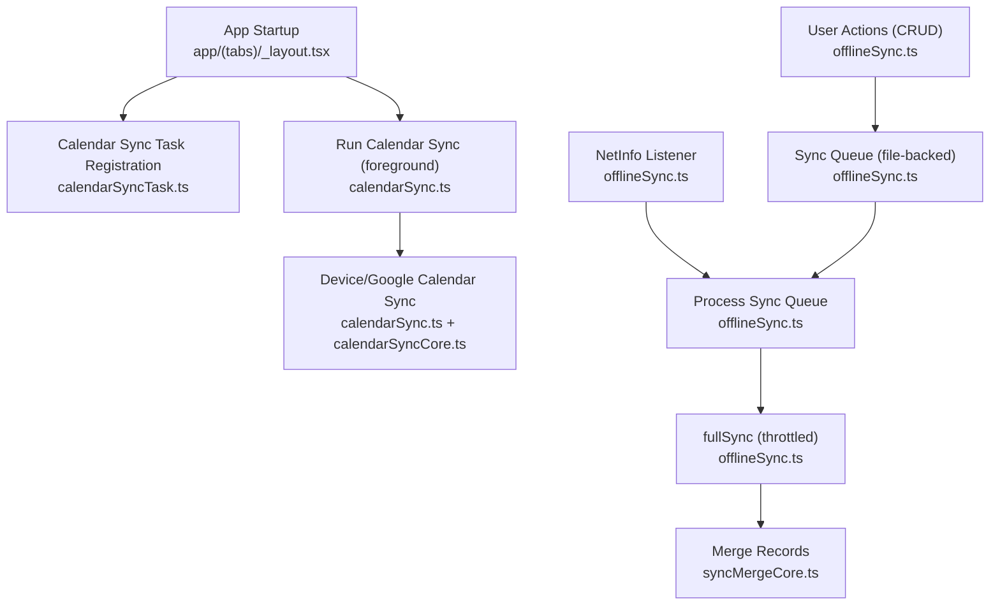
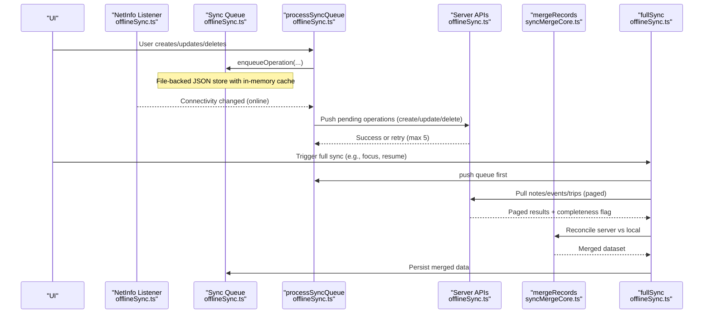
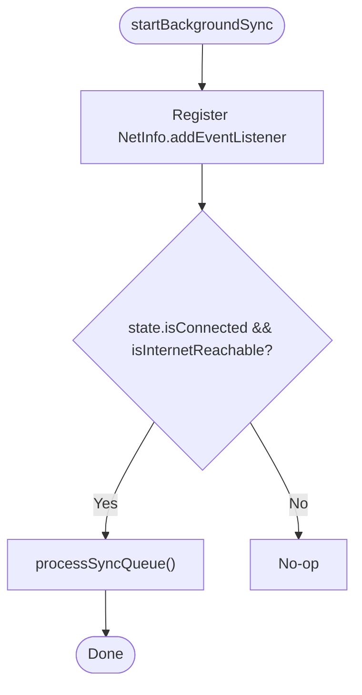
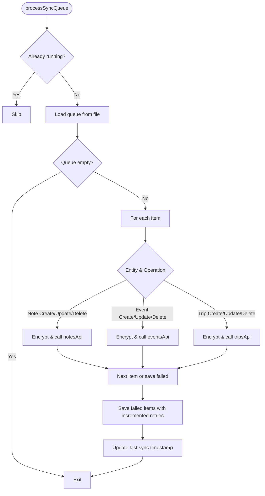
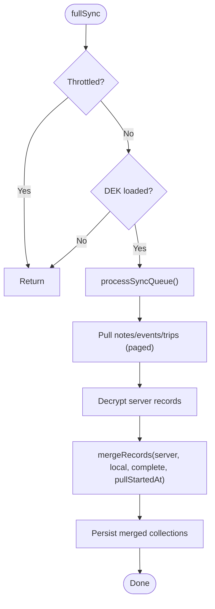
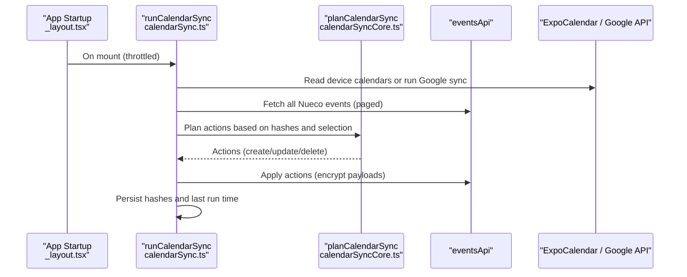
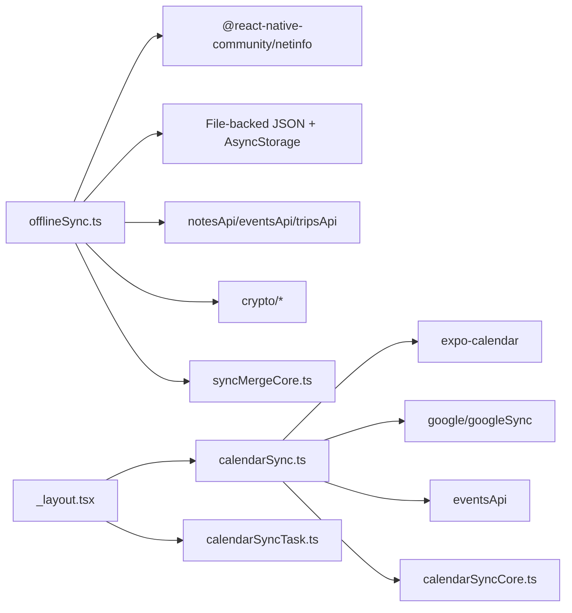

# Background Synchronization

<cite>
**Referenced Files in This Document**
- [offlineSync.ts](file://src/offlineSync.ts)
- [syncMergeCore.ts](file://src/syncMergeCore.ts)
- [calendarSync.ts](file://src/calendarSync.ts)
- [calendarSyncCore.ts](file://src/calendarSyncCore.ts)
- [calendarSyncTask.ts](file://src/calendarSyncTask.ts)
- [_layout.tsx](file://app/(tabs)/_layout.tsx)
</cite>

## Table of Contents
1. [Introduction](#introduction)
2. [Project Structure](#project-structure)
3. [Core Components](#core-components)
4. [Architecture Overview](#architecture-overview)
5. [Detailed Component Analysis](#detailed-component-analysis)
6. [Dependency Analysis](#dependency-analysis)
7. [Performance Considerations](#performance-considerations)
8. [Troubleshooting Guide](#troubleshooting-guide)
9. [Conclusion](#conclusion)

## Introduction
This document explains the background synchronization system that keeps local data consistent with the server when network connectivity changes. It covers:
- NetInfo-based network state monitoring and automatic sync triggers
- Throttling to avoid excessive sync attempts
- The fullSync process that reconciles local data with server state
- Sync lifecycle: initial sync, incremental updates via a queue, and error recovery
- Configuration options for sync behavior, performance optimizations, and debugging techniques

## Project Structure
The background sync spans several modules:
- offlineSync.ts: Core sync engine, queue, storage, NetInfo listener, and fullSync
- syncMergeCore.ts: Reconciliation rules between local and server data
- calendarSync.ts and calendarSyncCore.ts: Device/Google calendar sync integration
- calendarSyncTask.ts: OS-level background task registration
- app/(tabs)/_layout.tsx: App startup hooks that trigger background tasks and calendar sync

**Diagram sources**
- [offlineSync.ts:785-1071](file://src/offlineSync.ts#L785-L1071)
- [syncMergeCore.ts:1-140](file://src/syncMergeCore.ts#L1-L140)
- [calendarSync.ts:1-199](file://src/calendarSync.ts#L1-L199)
- [calendarSyncCore.ts:1-149](file://src/calendarSyncCore.ts#L1-L149)
- [calendarSyncTask.ts:1-52](file://src/calendarSyncTask.ts#L1-L52)
- [_layout.tsx:95-109](file://app/(tabs)/_layout.tsx#L95-L109)

**Section sources**
- [offlineSync.ts:785-1071](file://src/offlineSync.ts#L785-L1071)
- [calendarSync.ts:1-199](file://src/calendarSync.ts#L1-L199)
- [calendarSyncCore.ts:1-149](file://src/calendarSyncCore.ts#L1-L149)
- [calendarSyncTask.ts:1-52](file://src/calendarSyncTask.ts#L1-L52)
- [_layout.tsx:95-109](file://app/(tabs)/_layout.tsx#L95-L109)

## Core Components
- Offline sync engine: manages local persistence, sync queue, and reconciliation with the server
- NetInfo listener: detects connectivity changes and triggers background sync
- Full sync: pulls all collections from the server and merges them with local state using robust conflict resolution
- Calendar sync: optional device/Google calendar import/export with throttling and safety checks
- Merge core: pure logic for conflict resolution and safe deletion decisions

Key responsibilities:
- Local-first writes with immediate UI responsiveness
- Persistent queue for retries on network errors
- Throttled full sync to reduce network and CPU usage
- Safe deletion only when server pull is complete and not racing mid-pull edits

**Section sources**
- [offlineSync.ts:112-193](file://src/offlineSync.ts#L112-L193)
- [offlineSync.ts:365-415](file://src/offlineSync.ts#L365-L415)
- [offlineSync.ts:785-836](file://src/offlineSync.ts#L785-L836)
- [offlineSync.ts:930-1037](file://src/offlineSync.ts#L930-L1037)
- [offlineSync.ts:1039-1070](file://src/offlineSync.ts#L1039-L1070)
- [syncMergeCore.ts:16-140](file://src/syncMergeCore.ts#L16-L140)
- [calendarSync.ts:31-46](file://src/calendarSync.ts#L31-L46)
- [calendarSyncCore.ts:66-149](file://src/calendarSyncCore.ts#L66-L149)

## Architecture Overview
The system combines event-driven network monitoring with scheduled and user-triggered syncs:

**Diagram sources**
- [offlineSync.ts:785-1071](file://src/offlineSync.ts#L785-L1071)
- [syncMergeCore.ts:16-140](file://src/syncMergeCore.ts#L16-L140)

## Detailed Component Analysis

### NetInfo Integration and Background Sync Trigger
- startBackgroundSync registers a NetInfo event listener that runs processSyncQueue whenever the device becomes connected and internet reachable
- stopBackgroundSync unsubscribes to prevent leaks
- isOnline uses NetInfo.fetch to determine current connectivity; null reachability is treated as uncertain rather than offline

**Diagram sources**
- [offlineSync.ts:1039-1070](file://src/offlineSync.ts#L1039-L1070)

**Section sources**
- [offlineSync.ts:1039-1070](file://src/offlineSync.ts#L1039-L1070)

### Sync Queue and Incremental Updates
- All create/update/delete operations write locally first, then enqueue an operation with entity type, operation, payload, timestamp, and retry count
- enqueueOperation deduplicates and merges conflicting operations (e.g., delete a never-synced create)
- processSyncQueue executes queued items sequentially, encrypting payloads before sending, updating local IDs after successful server create, and tracking failures with retries up to 5
- Failed items remain in the queue and are retried on subsequent runs

**Diagram sources**
- [offlineSync.ts:785-928](file://src/offlineSync.ts#L785-L928)

**Section sources**
- [offlineSync.ts:365-415](file://src/offlineSync.ts#L365-L415)
- [offlineSync.ts:785-928](file://src/offlineSync.ts#L785-L928)

### Full Sync Process and Conflict Resolution
- fullSync is throttled to at most once every 20 seconds unless forced, preventing redundant pulls during rapid UI transitions
- Before pulling, it ensures encryption keys are available to avoid merging ciphertext into plaintext stores
- It pushes the queue first, then pulls notes, events, and trips concurrently using Promise.allSettled so one failure does not block others
- Each collection is decrypted and merged with local data using mergeRecords, which implements newest-write-wins and safe deletion semantics
- Local-only fields (e.g., device notification handles) are preserved across pulls via adoptLocalFields

**Diagram sources**
- [offlineSync.ts:785-1037](file://src/offlineSync.ts#L785-L1037)
- [syncMergeCore.ts:16-140](file://src/syncMergeCore.ts#L16-L140)

**Section sources**
- [offlineSync.ts:785-836](file://src/offlineSync.ts#L785-L836)
- [offlineSync.ts:930-1037](file://src/offlineSync.ts#L930-L1037)
- [syncMergeCore.ts:16-140](file://src/syncMergeCore.ts#L16-L140)

### Calendar Sync Integration
- runCalendarSync orchestrates importing device calendar events into Nueco, with support for Google Calendar bridge
- It throttles runs to every 15 minutes and uses a storage-based lock to avoid concurrent runs across foreground/background contexts
- It reads device calendars (or delegates to Google sync), fetches all Nueco events, plans actions (create/update/delete), and applies them safely
- Deletions are conservative: they require unchanged calendar selection and non-empty fetch to avoid accidental deletions during transient failures

**Diagram sources**
- [calendarSync.ts:1-199](file://src/calendarSync.ts#L1-L199)
- [calendarSyncCore.ts:1-149](file://src/calendarSyncCore.ts#L1-L149)
- [_layout.tsx:95-109](file://app/(tabs)/_layout.tsx#L95-L109)

**Section sources**
- [calendarSync.ts:31-46](file://src/calendarSync.ts#L31-L46)
- [calendarSync.ts:97-199](file://src/calendarSync.ts#L97-L199)
- [calendarSyncCore.ts:66-149](file://src/calendarSyncCore.ts#L66-L149)
- [_layout.tsx:95-109](file://app/(tabs)/_layout.tsx#L95-L109)

### Background Task Registration
- calendarSyncTask defines a background task that calls runCalendarSync, enabling best-effort periodic sync even when the app is not open
- The minimum interval is set to 15 minutes; actual intervals can vary due to OS scheduling constraints
- Registration is idempotent and guarded per platform

**Section sources**
- [calendarSyncTask.ts:1-52](file://src/calendarSyncTask.ts#L1-L52)

## Dependency Analysis
- offlineSync depends on:
  - NetInfo for connectivity events and status checks
  - Storage layer (file-backed JSON with AsyncStorage fallback) for durability
  - API clients for notes, events, trips
  - Crypto utilities for encrypt/decrypt boundaries
  - syncMergeCore for conflict resolution
- calendarSync depends on:
  - expo-calendar or Google API for source events
  - eventsApi for fetching and applying changes
  - calendarSyncCore for deterministic planning
- App layout wires up background task registration and foreground calendar sync

**Diagram sources**
- [offlineSync.ts:12-26](file://src/offlineSync.ts#L12-L26)
- [offlineSync.ts:785-1071](file://src/offlineSync.ts#L785-L1071)
- [calendarSync.ts:17-24](file://src/calendarSync.ts#L17-L24)
- [calendarSyncCore.ts:1-149](file://src/calendarSyncCore.ts#L1-L149)
- [_layout.tsx:95-109](file://app/(tabs)/_layout.tsx#L95-L109)

**Section sources**
- [offlineSync.ts:12-26](file://src/offlineSync.ts#L12-L26)
- [calendarSync.ts:17-24](file://src/calendarSync.ts#L17-L24)
- [_layout.tsx:95-109](file://app/(tabs)/_layout.tsx#L95-L109)

## Performance Considerations
- Full sync throttling: Prevents repeated heavy pulls within 20 seconds unless explicitly forced
- Concurrent pulls: Notes, events, and trips are pulled in parallel to reduce total sync time
- In-memory caching: Large collections are cached in memory to avoid repeated disk reads and parses
- File-backed storage: Avoids AsyncStorage row-size limits for large datasets
- Calendar sync throttling: Limits device calendar imports to every 15 minutes with a storage-based lock
- Encryption boundary: Encrypt only at push time; decrypt only when pulling from server
- Safe deletion: Only deletes when server pull is complete and not racing mid-pull edits

[No sources needed since this section provides general guidance]

## Troubleshooting Guide
Common issues and how to investigate:
- Sync not starting on reconnect:
  - Verify startBackgroundSync was called and NetInfo listener is active
  - Check console logs for “Back online” messages
  - Confirm isOnline returns true when expected
- Excessive sync attempts:
  - Ensure fullSync is not being called too frequently; use force only when necessary
  - Inspect FULL_SYNC_THROTTLE_MS usage
- Data loss risk during pull:
  - Confirm serverPullComplete is true before treating absence as deletion
  - Review mergeRecords and absenceMeansDeleted behavior
- Calendar sync not updating:
  - Check throttle window and storage lock
  - Validate calendar permissions and selected calendars
  - Review planCalendarSync actions and hash persistence
- Errors in queue processing:
  - Inspect retry counts and dropped items after max retries
  - Check API responses and encryption steps

**Section sources**
- [offlineSync.ts:785-836](file://src/offlineSync.ts#L785-L836)
- [offlineSync.ts:930-1037](file://src/offlineSync.ts#L930-L1037)
- [syncMergeCore.ts:123-140](file://src/syncMergeCore.ts#L123-L140)
- [calendarSync.ts:97-199](file://src/calendarSync.ts#L97-L199)

## Conclusion
The background synchronization system provides resilient, efficient, and safe data consistency between local storage and the server. It leverages NetInfo for reactive sync triggers, a durable queue for reliable retries, and a robust merge strategy to resolve conflicts without losing user edits. Optional calendar sync integrates device and Google calendars with careful safeguards against accidental deletions. Throttling, concurrency, and file-backed storage ensure good performance under real-world conditions.

[No sources needed since this section summarizes without analyzing specific files]