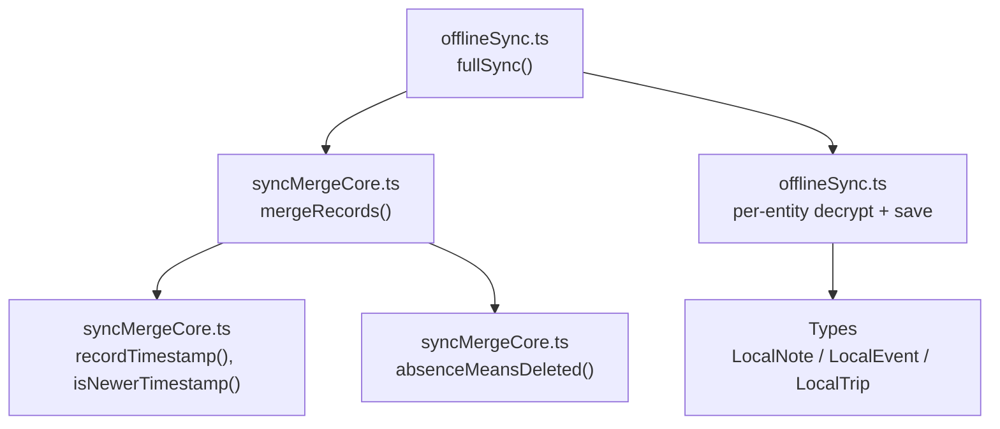
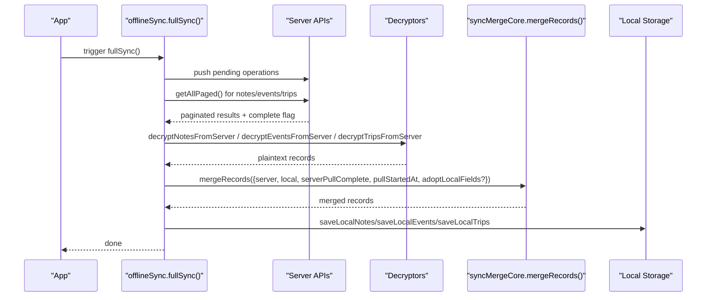
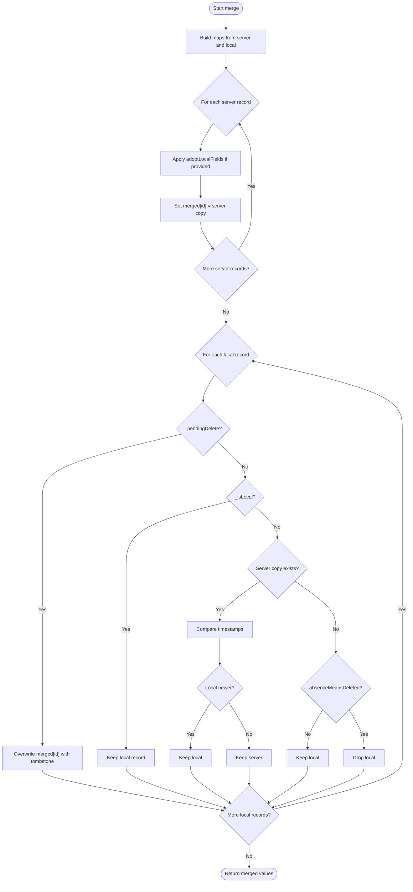
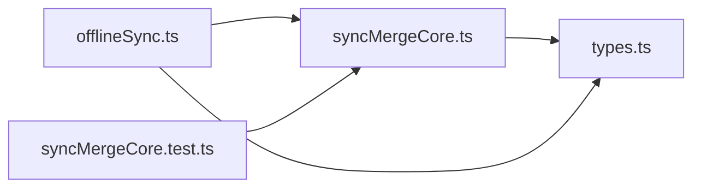

# Conflict Resolution Algorithms

<cite>
**Referenced Files in This Document**
- [syncMergeCore.ts](file://src/syncMergeCore.ts)
- [syncMergeCore.test.ts](file://src/syncMergeCore.test.ts)
- [offlineSync.ts](file://src/offlineSync.ts)
- [types.ts](file://src/types.ts)
</cite>

## Table of Contents
1. [Introduction](#introduction)
2. [Project Structure](#project-structure)
3. [Core Components](#core-components)
4. [Architecture Overview](#architecture-overview)
5. [Detailed Component Analysis](#detailed-component-analysis)
6. [Dependency Analysis](#dependency-analysis)
7. [Performance Considerations](#performance-considerations)
8. [Troubleshooting Guide](#troubleshooting-guide)
9. [Conclusion](#conclusion)
10. [Appendices](#appendices)

## Introduction
This document explains the conflict resolution algorithms used for data synchronization across devices and sessions. It focuses on how concurrent edits are detected and resolved using timestamps, how field-level merging is handled, and how different data types (notes, events, trips) participate in the merge process. It also provides guidance for extending conflict resolution to new data types and addresses common scenarios such as simultaneous edits, deletions versus updates, and nested object conflicts.

## Project Structure
The conflict resolution logic is implemented as a small, testable core module that is reused by the offline sync layer during full synchronization. The key files are:
- Core reconciliation algorithm and utilities: src/syncMergeCore.ts
- Unit tests covering edge cases and realistic merges: src/syncMergeCore.test.ts
- Offline sync orchestration and per-entity merge calls: src/offlineSync.ts
- Shared type definitions for notes, events, and trips: src/types.ts

**Diagram sources**
- [offlineSync.ts:930-1037](file://src/offlineSync.ts#L930-L1037)
- [syncMergeCore.ts:27-139](file://src/syncMergeCore.ts#L27-L139)

**Section sources**
- [syncMergeCore.ts:1-140](file://src/syncMergeCore.ts#L1-L140)
- [offlineSync.ts:930-1037](file://src/offlineSync.ts#L930-L1037)

## Core Components
- MergeableRecord: Minimal record shape used by the reconciler, including id, created_at, optional updated_at, and flags for local-only and pending-delete states.
- recordTimestamp: Extracts the effective timestamp for comparison, preferring updated_at and falling back to created_at for legacy records.
- isNewerTimestamp: Strict comparison that treats unparseable timestamps defensively so they cannot win a comparison.
- absenceMeansDeleted: Determines whether a missing server record should be treated as deleted locally; only when the pull is complete and the local record was not edited after the pull started.
- mergeRecords: The main reconciliation function implementing newest-write-wins with explicit precedence rules for deletes, local-only records, and concurrent edits.

Key behaviors:
- Timestamp-based conflict detection uses updated_at when present; otherwise falls back to created_at.
- Field-level merging strategy: server records overwrite local ones except for device-only fields preserved via adoptLocalFields.
- Deletion handling: local pending-delete tombstones override server copies until the server confirms deletion.

**Section sources**
- [syncMergeCore.ts:16-64](file://src/syncMergeCore.ts#L16-L64)
- [syncMergeCore.ts:66-139](file://src/syncMergeCore.ts#L66-L139)

## Architecture Overview
The full sync flow orchestrates pushing local changes, pulling from the server, decrypting payloads, and merging into the local store. Each entity type (notes, events, trips) is merged independently to avoid cross-type failures.

**Diagram sources**
- [offlineSync.ts:930-1037](file://src/offlineSync.ts#L930-L1037)
- [syncMergeCore.ts:66-139](file://src/syncMergeCore.ts#L66-L139)

## Detailed Component Analysis

### mergeRecords: Newest-Wins Reconciliation
- Precedence order:
  1. Pending delete wins over any server copy until the server confirms deletion.
  2. Local-only records always survive because the server has never seen them.
  3. When both sides have the record, the newer timestamp wins.
  4. If only the local side has it, it survives unless the pull is trustworthy enough to treat absence as deletion.
- Device-only fields: adoptLocalFields allows preserving fields like notification handles that do not round-trip through the server.

**Diagram sources**
- [syncMergeCore.ts:66-139](file://src/syncMergeCore.ts#L66-L139)

**Section sources**
- [syncMergeCore.ts:66-139](file://src/syncMergeCore.ts#L66-L139)
- [syncMergeCore.test.ts:71-253](file://src/syncMergeCore.test.ts#L71-L253)

### Timestamp-Based Conflict Detection
- Effective timestamp selection prefers updated_at; falls back to created_at for legacy records without updated_at.
- Comparison is strict: unreadable timestamps lose rather than throw, preventing malformed data from winning conflicts.
- During full sync, a snapshot timestamp (pullStartedAt) is captured before pulls begin. Records edited after this point are protected from being dropped due to absence in an incomplete or partially read page.

Practical implications:
- Simultaneous edits: the version with the later timestamp wins.
- Legacy records: compare on created_at when updated_at is absent.
- Mid-pull edits: safe from accidental deletion even if absent from the current page.

**Section sources**
- [syncMergeCore.ts:27-46](file://src/syncMergeCore.ts#L27-L46)
- [syncMergeCore.ts:123-139](file://src/syncMergeCore.ts#L123-L139)
- [offlineSync.ts:957-977](file://src/offlineSync.ts#L957-L977)

### Field-Level Merging Strategies
- Default behavior: server records replace local records for synced fields.
- Device-only fields: use adoptLocalFields to preserve fields that must not be overwritten by server responses (e.g., local_notification_id for events).
- Notes: no special adoptLocalFields hook is used in full sync; server replaces local content.
- Events: adoptLocalFields preserves local_notification_id to avoid orphaning scheduled OS notifications.
- Trips: default replacement applies; no device-only fields are carried over in full sync.

Examples:
- Event reminder handle preservation: ensures scheduled reminders remain cancellable after a server refresh.
- New server records: adoptLocalFields can safely set null for device-only fields when there is no previous local copy.

**Section sources**
- [syncMergeCore.ts:48-64](file://src/syncMergeCore.ts#L48-L64)
- [offlineSync.ts:990-1004](file://src/offlineSync.ts#L990-L1004)

### Resolution Policies by Data Type
- Notes:
  - Full sync decrypts server notes and merges using newest-write-wins.
  - No device-only field carryover in full sync; server content replaces local.
- Events:
  - Full sync decrypts server events and merges with adoptLocalFields to preserve local_notification_id.
  - Pending deletes are respected until the server confirms removal.
- Trips:
  - Full sync decrypts server trips and merges using standard newest-write-wins.

These policies ensure consistent behavior while accommodating entity-specific needs.

**Section sources**
- [offlineSync.ts:964-1027](file://src/offlineSync.ts#L964-L1027)

### Common Conflict Scenarios and Edge Cases
- Simultaneous edits:
  - Resolved by comparing effective timestamps; newer wins.
  - If timestamps are equal, server wins ties.
- Deletions vs updates:
  - A local pending-delete tombstone overrides server copies until the server stops returning the record.
  - Once the server confirms deletion (record absent in a complete pull), the tombstone is cleared.
- Nested object conflicts:
  - The reconciler operates at the record level; nested objects are replaced wholesale by server data unless adoptLocalFields is used to preserve specific fields.
  - For complex nested structures requiring field-level merging, extend adoptLocalFields to selectively merge nested properties.
- Incomplete pulls:
  - Absence does not mean deletion unless the pull reached the end of the collection and the record was not edited after the pull began.
- Legacy records without updated_at:
  - Fall back to created_at for comparisons, ensuring older records still resolve correctly.

**Section sources**
- [syncMergeCore.test.ts:71-253](file://src/syncMergeCore.test.ts#L71-L253)
- [syncMergeCore.ts:66-139](file://src/syncMergeCore.ts#L66-L139)

### Extending Conflict Resolution for New Data Types
To add a new entity type:
- Define a local type compatible with MergeableRecord (id, created_at, updated_at?, _isLocal?, _pendingDelete?).
- Implement decryptors and paged fetchers similar to existing entities.
- Call mergeRecords in full sync with appropriate parameters:
  - server: decrypted records
  - local: current local store
  - serverPullComplete: from paged result
  - pullStartedAt: captured before pulls
  - adoptLocalFields?: if the entity has device-only fields to preserve
- Persist merged results to the local store.

Best practices:
- Use adoptLocalFields sparingly and explicitly for device-only fields.
- Ensure updated_at is consistently maintained for accurate conflict detection.
- Test edge cases: incomplete pulls, mid-pull edits, pending deletes, and legacy records.

**Section sources**
- [syncMergeCore.ts:48-64](file://src/syncMergeCore.ts#L48-L64)
- [offlineSync.ts:964-1027](file://src/offlineSync.ts#L964-L1027)

## Dependency Analysis
The reconciliation core is decoupled from network and storage concerns, enabling unit testing and reuse. The offline sync layer depends on the core for conflict resolution and adds encryption/decryption and persistence around it.

**Diagram sources**
- [offlineSync.ts:930-1037](file://src/offlineSync.ts#L930-L1037)
- [syncMergeCore.ts:1-140](file://src/syncMergeCore.ts#L1-L140)
- [types.ts:35-102](file://src/types.ts#L35-L102)
- [syncMergeCore.test.ts:1-253](file://src/syncMergeCore.test.ts#L1-L253)

**Section sources**
- [syncMergeCore.ts:1-140](file://src/syncMergeCore.ts#L1-L140)
- [offlineSync.ts:930-1037](file://src/offlineSync.ts#L930-L1037)
- [types.ts:35-102](file://src/types.ts#L35-L102)
- [syncMergeCore.test.ts:1-253](file://src/syncMergeCore.test.ts#L1-L253)

## Performance Considerations
- Paged pulls: full sync reads all pages and uses the complete flag to avoid false deletions. This prevents accidental loss of records beyond the first page.
- In-memory caches: local stores cache arrays to reduce repeated file reads; caches are invalidated on writes and account deletion.
- Concurrency: full sync processes notes, events, and trips concurrently with Promise.allSettled to avoid blocking one entity type on another’s failure.
- Timestamp parsing: defensive parsing avoids expensive exceptions and ensures stable comparisons.

[No sources needed since this section provides general guidance]

## Troubleshooting Guide
Common issues and resolutions:
- Missing records after sync:
  - Check serverPullComplete; incomplete pulls intentionally keep local records to avoid data loss.
  - Verify pullStartedAt captures the time before pulls; mid-pull edits are protected.
- Orphaned notifications:
  - Ensure adoptLocalFields preserves device-only fields like local_notification_id for events.
- Unexpected reversion of edits:
  - Confirm updated_at is set and monotonically increasing; compare effective timestamps correctly.
- Legacy records:
  - Expect fallback to created_at for older records without updated_at.

Diagnostic steps:
- Inspect merged outputs in full sync logs for counts and warnings about incomplete pulls.
- Validate timestamps and flags (_isLocal, _pendingDelete) on local records before and after merge.

**Section sources**
- [offlineSync.ts:964-1027](file://src/offlineSync.ts#L964-L1027)
- [syncMergeCore.ts:66-139](file://src/syncMergeCore.ts#L66-L139)

## Conclusion
The conflict resolution system uses a robust, timestamp-based newest-write-wins strategy with careful handling of deletions, incomplete pulls, and device-only fields. By isolating the core logic and providing clear extension points, it supports reliable synchronization across notes, events, and trips, and can be extended to new data types with minimal effort.

[No sources needed since this section summarizes without analyzing specific files]

## Appendices

### Data Models Used in Conflict Resolution
- MergeableRecord: id, created_at, updated_at?, _isLocal?, _pendingDelete?
- LocalNote: includes title, content, tags, images, attachments, objects, timestamps, and flags
- LocalEvent: includes event details, recurrence, timezone, trip linkage, Google Calendar bridge fields, and local_notification_id
- LocalTrip: includes name, description, user_id, timestamps, and flags

**Section sources**
- [syncMergeCore.ts:16-25](file://src/syncMergeCore.ts#L16-L25)
- [offlineSync.ts:43-110](file://src/offlineSync.ts#L43-L110)
- [types.ts:35-102](file://src/types.ts#L35-L102)