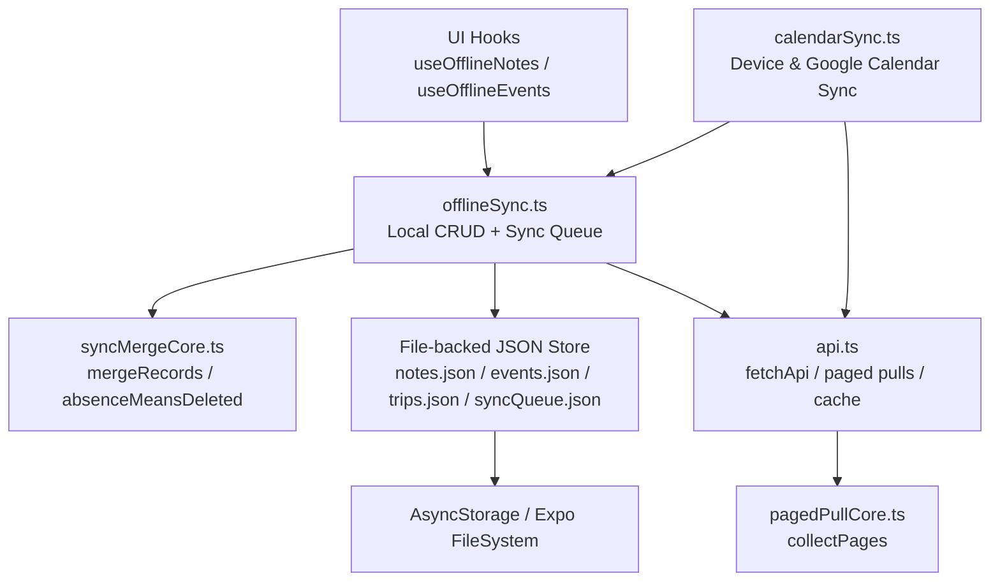
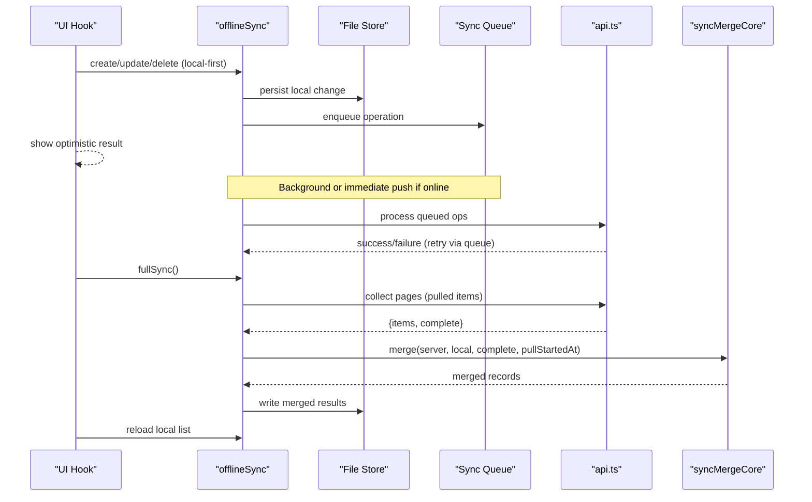
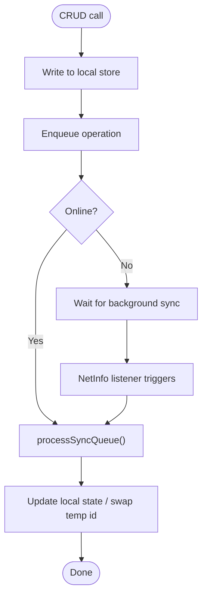
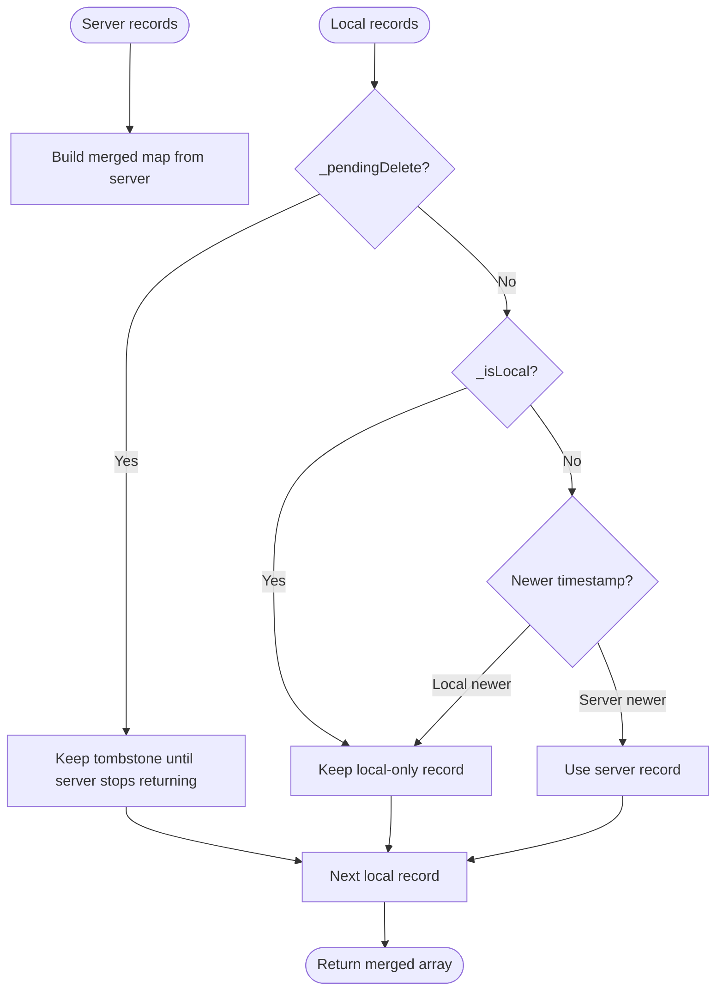
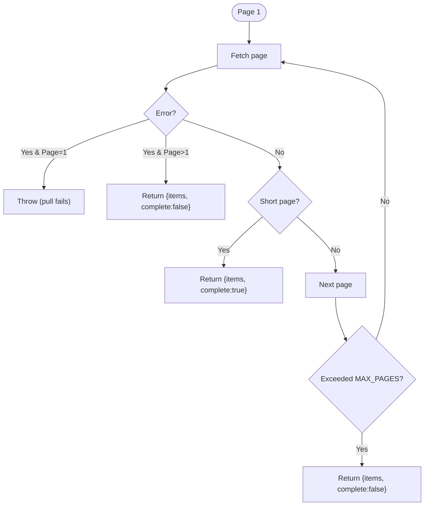
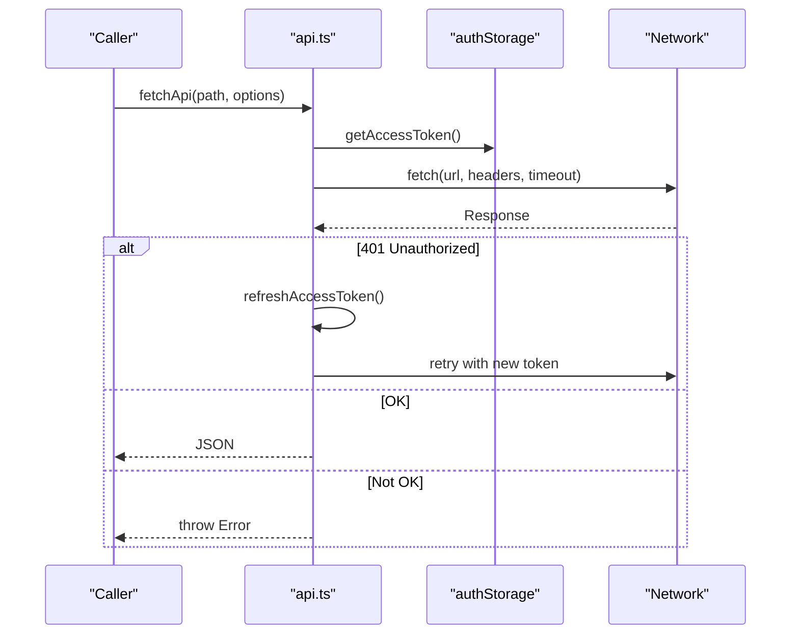
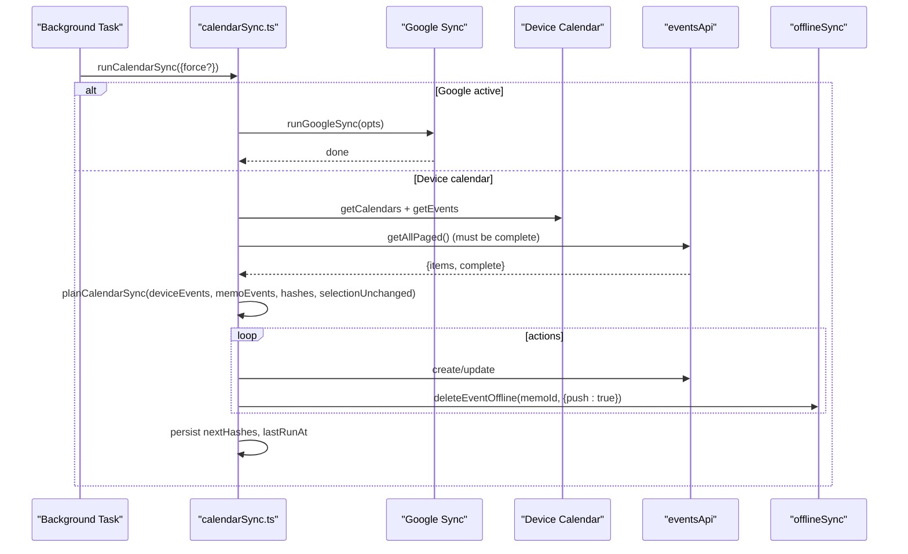
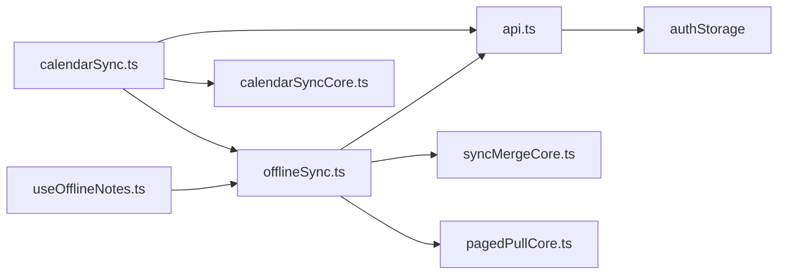

# Data Flow Patterns

<cite>
**Referenced Files in This Document**
- [offlineSync.ts](file://src/offlineSync.ts)
- [syncMergeCore.ts](file://src/syncMergeCore.ts)
- [calendarSync.ts](file://src/calendarSync.ts)
- [calendarSyncCore.ts](file://src/calendarSyncCore.ts)
- [pagedPullCore.ts](file://src/pagedPullCore.ts)
- [api.ts](file://src/api.ts)
- [useOfflineNotes.ts](file://src/useOfflineNotes.ts)
- [calendarSyncTask.ts](file://src/calendarSyncTask.ts)
- [types.ts](file://src/types.ts)
- [ErrorBoundary.tsx](file://src/components/ErrorBoundary.tsx)
- [OfflineBanner.tsx](file://src/components/OfflineBanner.tsx)
</cite>

## Table of Contents
1. [Introduction](#introduction)
2. [Project Structure](#project-structure)
3. [Core Components](#core-components)
4. [Architecture Overview](#architecture-overview)
5. [Detailed Component Analysis](#detailed-component-analysis)
6. [Dependency Analysis](#dependency-analysis)
7. [Performance Considerations](#performance-considerations)
8. [Troubleshooting Guide](#troubleshooting-guide)
9. [Conclusion](#conclusion)

## Introduction
This document explains the offline-first data architecture and data flow patterns in the Nueco application. It covers local storage strategies, background synchronization, conflict resolution, persistence layers from UI to native storage, sync merge core functionality, caching strategies, real-time update mechanisms, error handling, retry logic, and network resilience.

## Project Structure
The data layer is centered around an offline-first model:
- UI hooks read/write local state immediately and enqueue operations for later sync.
- A file-backed JSON store persists large collections (notes, events, trips, sync queue).
- A sync engine processes queued operations against the server and reconciles pulls with local state using a strict merge algorithm.
- Calendar integration provides device calendar and Google Calendar sync paths.
- API client handles authentication, token refresh, timeouts, and paged collection pulls.

**Diagram sources**
- [offlineSync.ts:112-193](file://src/offlineSync.ts#L112-L193)
- [syncMergeCore.ts:76-120](file://src/syncMergeCore.ts#L76-L120)
- [pagedPullCore.ts:45-69](file://src/pagedPullCore.ts#L45-L69)
- [api.ts:84-138](file://src/api.ts#L84-L138)
- [calendarSync.ts:102-199](file://src/calendarSync.ts#L102-L199)

**Section sources**
- [offlineSync.ts:112-193](file://src/offlineSync.ts#L112-L193)
- [api.ts:84-138](file://src/api.ts#L84-L138)
- [calendarSync.ts:102-199](file://src/calendarSync.ts#L102-L199)

## Core Components
- Offline sync manager: local CRUD, sync queue, background sync, conflict resolution by timestamp.
- Sync merge core: deterministic reconciliation rules for server vs. local records.
- Paged pull core: robust pagination with completeness flag to inform deletion semantics.
- API client: authenticated fetches, token refresh, timeouts, monthly event cache.
- Calendar sync: device calendar import/export and Google Calendar bridge.
- UI hooks: offline-aware React hooks that drive immediate local updates and background sync.

**Section sources**
- [offlineSync.ts:30-120](file://src/offlineSync.ts#L30-L120)
- [syncMergeCore.ts:16-64](file://src/syncMergeCore.ts#L16-L64)
- [pagedPullCore.ts:10-33](file://src/pagedPullCore.ts#L10-L33)
- [api.ts:15-138](file://src/api.ts#L15-L138)
- [calendarSync.ts:17-46](file://src/calendarSync.ts#L17-L46)
- [useOfflineNotes.ts:40-142](file://src/useOfflineNotes.ts#L40-L142)

## Architecture Overview
The system follows an offline-first pattern:
- Writes are applied locally first and enqueued for network sync.
- Reads come from local storage with optional background full syncs.
- Server pulls are merged into local state using last-write-wins based on timestamps.
- Deletions are conservative: only when a complete pull is known and the record was not edited after the pull started.

**Diagram sources**
- [useOfflineNotes.ts:93-116](file://src/useOfflineNotes.ts#L93-L116)
- [offlineSync.ts:798-800](file://src/offlineSync.ts#L798-L800)
- [pagedPullCore.ts:45-69](file://src/pagedPullCore.ts#L45-L69)
- [syncMergeCore.ts:76-120](file://src/syncMergeCore.ts#L76-L120)
- [api.ts:132-138](file://src/api.ts#L132-L138)

## Detailed Component Analysis

### Offline Sync Manager (offlineSync.ts)
Responsibilities:
- Local storage via file-backed JSON with in-memory caches for notes, events, trips, and sync queue.
- Offline-first CRUD for notes, events, and trips with temporary IDs and server ID swaps.
- Sync queue with deduplication and payload merging; background processing on connectivity changes.
- Full sync throttling and reconciliation using mergeRecords.
- Special handling for device-only fields (e.g., local notification id) during merges.

Key behaviors:
- File-backed store avoids AsyncStorage CursorWindow limits for large payloads.
- Mutex serializes note writes to prevent race conditions across editor autosaves, queue processing, and full sync.
- Alias map persists note temp-to-server id mappings to repair recording links post-restart.
- Events carry updated_at for precise conflict resolution; absence means delete only when pull is complete and record predates pull start.

**Diagram sources**
- [offlineSync.ts:419-537](file://src/offlineSync.ts#L419-L537)
- [offlineSync.ts:599-700](file://src/offlineSync.ts#L599-L700)
- [offlineSync.ts:708-783](file://src/offlineSync.ts#L708-L783)

**Section sources**
- [offlineSync.ts:112-193](file://src/offlineSync.ts#L112-L193)
- [offlineSync.ts:207-281](file://src/offlineSync.ts#L207-L281)
- [offlineSync.ts:329-386](file://src/offlineSync.ts#L329-L386)
- [offlineSync.ts:419-537](file://src/offlineSync.ts#L419-L537)
- [offlineSync.ts:599-700](file://src/offlineSync.ts#L599-L700)
- [offlineSync.ts:708-783](file://src/offlineSync.ts#L708-L783)
- [offlineSync.ts:785-800](file://src/offlineSync.ts#L785-L800)

### Sync Merge Core (syncMergeCore.ts)
Reconciliation rules:
- Pending deletes win over server live records.
- Local-only records always survive.
- When both sides have a record, newer timestamp wins.
- Absence means delete only if the pull reached the end and the record was not written after the pull started.

Timestamp comparison:
- Uses updated_at if present, falls back to created_at for legacy records.
- Strict parsing prevents unparseable timestamps from winning.

**Diagram sources**
- [syncMergeCore.ts:76-120](file://src/syncMergeCore.ts#L76-L120)
- [syncMergeCore.ts:123-139](file://src/syncMergeCore.ts#L123-L139)

**Section sources**
- [syncMergeCore.ts:16-64](file://src/syncMergeCore.ts#L16-L64)
- [syncMergeCore.ts:76-120](file://src/syncMergeCore.ts#L76-L120)
- [syncMergeCore.ts:123-139](file://src/syncMergeCore.ts#L123-L139)

### Paged Pull Core (pagedPullCore.ts)
Collects paginated responses until a short page indicates the end, or up to a hard ceiling. Failure behavior:
- First-page failure throws (no partial trust), preventing empty-collection misinterpretation.
- Later-page failure returns collected items marked incomplete, so merge treats absence as inconclusive.

**Diagram sources**
- [pagedPullCore.ts:45-69](file://src/pagedPullCore.ts#L45-L69)

**Section sources**
- [pagedPullCore.ts:10-33](file://src/pagedPullCore.ts#L10-L33)
- [pagedPullCore.ts:45-69](file://src/pagedPullCore.ts#L45-L69)

### API Client (api.ts)
Features:
- Auth header injection and single-flight token refresh to avoid concurrent refresh races.
- 30-second fetch timeout to prevent hung requests from blocking sync indefinitely.
- Paged collection pulls with per-endpoint page sizes.
- In-memory cache for month events to reduce decrypt and network overhead.
- Attachment upload via presigned POST with streaming encryption and progress reporting.

Resilience:
- On 401, attempts one token refresh and retries once; otherwise throws session expired.
- Non-ok responses throw with status and text.

**Diagram sources**
- [api.ts:15-72](file://src/api.ts#L15-L72)
- [api.ts:84-121](file://src/api.ts#L84-L121)
- [api.ts:132-138](file://src/api.ts#L132-L138)

**Section sources**
- [api.ts:15-72](file://src/api.ts#L15-L72)
- [api.ts:84-121](file://src/api.ts#L84-L121)
- [api.ts:156-208](file://src/api.ts#L156-L208)
- [api.ts:271-359](file://src/api.ts#L271-L359)

### Calendar Sync (calendarSync.ts and calendarSyncCore.ts)
Capabilities:
- Opt-in background and foreground sync of device calendar events into Nueco.
- If Google account is connected, delegates to Google sync path to avoid double-importing.
- Throttled runs with storage-based lock to prevent overlapping executions across headless contexts.
- Conservative deletion: only when calendar selection unchanged and at least one device event returned.

Decision logic:
- Hash device events by title, location, notes, all-day flag, and date boundaries.
- Plan creates/updates/deletes based on hash changes and existing Nueco mappings.
- Updates intentionally exclude reminder_minutes and linked_note_ids to preserve user customizations.

**Diagram sources**
- [calendarSync.ts:102-199](file://src/calendarSync.ts#L102-L199)
- [calendarSyncCore.ts:87-148](file://src/calendarSyncCore.ts#L87-L148)

**Section sources**
- [calendarSync.ts:17-46](file://src/calendarSync.ts#L17-L46)
- [calendarSync.ts:102-199](file://src/calendarSync.ts#L102-L199)
- [calendarSyncCore.ts:8-50](file://src/calendarSyncCore.ts#L8-L50)
- [calendarSyncCore.ts:87-148](file://src/calendarSyncCore.ts#L87-L148)

### UI Integration (useOfflineNotes.ts)
Behavior:
- Loads local notes immediately, then performs full sync in background when online.
- Starts background sync listener and resyncs on app foreground transitions.
- Provides offline-aware CRUD that defers network pushes to avoid blocking UI interactions.
- Filters out pending-delete records instantly for responsive UX.

Real-time updates:
- List re-render uses lightweight signatures to avoid unnecessary recalculations.
- Layout animations triggered only when visible set/order/pinned changes.

**Section sources**
- [useOfflineNotes.ts:40-142](file://src/useOfflineNotes.ts#L40-L142)
- [useOfflineNotes.ts:144-214](file://src/useOfflineNotes.ts#L144-L214)
- [useOfflineNotes.ts:218-278](file://src/useOfflineNotes.ts#L218-L278)

### Background Sync Task (calendarSyncTask.ts)
Registers OS-level background tasks for calendar sync on iOS and Android with minimum intervals. Safe to call on every launch; guarded to avoid duplicate registration.

**Section sources**
- [calendarSyncTask.ts:1-52](file://src/calendarSyncTask.ts#L1-L52)

## Dependency Analysis
High-level dependencies:
- UI hooks depend on offlineSync for local CRUD and sync orchestration.
- offlineSync depends on api for network calls and syncMergeCore for reconciliation.
- calendarSync depends on calendarSyncCore for decision logic and offlineSync for deletions.
- api depends on authStorage and crypto modules for secure communication.

**Diagram sources**
- [useOfflineNotes.ts:18-36](file://src/useOfflineNotes.ts#L18-L36)
- [offlineSync.ts:12-26](file://src/offlineSync.ts#L12-L26)
- [calendarSync.ts:17-24](file://src/calendarSync.ts#L17-L24)
- [api.ts:1-13](file://src/api.ts#L1-L13)

**Section sources**
- [useOfflineNotes.ts:18-36](file://src/useOfflineNotes.ts#L18-L36)
- [offlineSync.ts:12-26](file://src/offlineSync.ts#L12-L26)
- [calendarSync.ts:17-24](file://src/calendarSync.ts#L17-L24)
- [api.ts:1-13](file://src/api.ts#L1-L13)

## Performance Considerations
- File-backed JSON store avoids AsyncStorage row-size limits for large collections.
- In-memory caches for notes, events, trips, and sync queue reduce repeated I/O.
- Monthly events cache reduces decrypt and network overhead for frequent reads.
- Full sync throttling prevents excessive network and decryption work on focus transitions.
- Paged pulls limit maximum pages per request to guard against infinite loops.
- Mutating local arrays is serialized for notes to avoid race conditions during autosave and background sync.

[No sources needed since this section provides general guidance]

## Troubleshooting Guide
Common issues and patterns:
- Hung network requests: API client enforces a 30-second timeout to prevent indefinite hangs that could block sync queues.
- Token refresh conflicts: Single-flight refresh avoids concurrent refresh token invalidation.
- Missing records after sync: Ensure paged pulls are complete; incomplete pulls do not treat absence as deletion.
- Deleted items reappear: Pending deletes are preserved until server confirms removal; ensure server-side delete completes.
- Calendar sync skips: Verify calendar selection unchanged and at least one device event returned before destructive actions.

Error handling components:
- ErrorBoundary catches UI errors and offers a reset action, ensuring app stability.
- OfflineBanner shows transient “Uploading your notes” or “Up to date” feedback when coming back online.

**Section sources**
- [api.ts:74-121](file://src/api.ts#L74-L121)
- [pagedPullCore.ts:45-69](file://src/pagedPullCore.ts#L45-L69)
- [calendarSyncCore.ts:133-148](file://src/calendarSyncCore.ts#L133-L148)
- [ErrorBoundary.tsx:18-89](file://src/components/ErrorBoundary.tsx#L18-L89)
- [OfflineBanner.tsx:18-62](file://src/components/OfflineBanner.tsx#L18-L62)

## Conclusion
Nueco implements a robust offline-first architecture with clear separation between local persistence, sync orchestration, and reconciliation. The design prioritizes responsiveness, data safety, and resilience:
- Immediate local writes with durable queues ensure no data loss.
- Deterministic merge rules prevent accidental deletions and resolve conflicts reliably.
- Network resilience includes timeouts, token refresh, and careful pagination semantics.
- Calendar sync integrates device and Google calendars conservatively, preserving user customizations.

This architecture supports scalable data flows while maintaining a smooth user experience even under poor connectivity.

[No sources needed since this section summarizes without analyzing specific files]