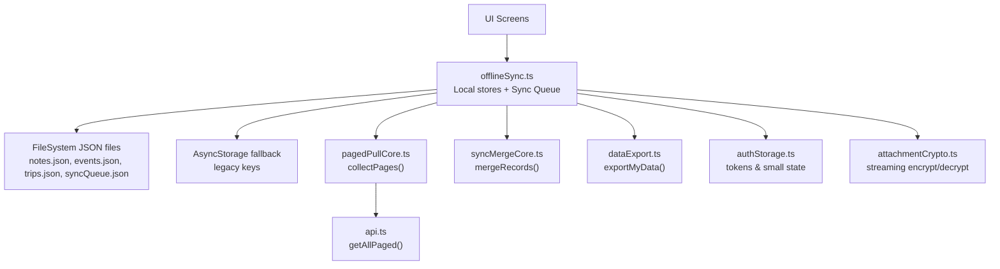
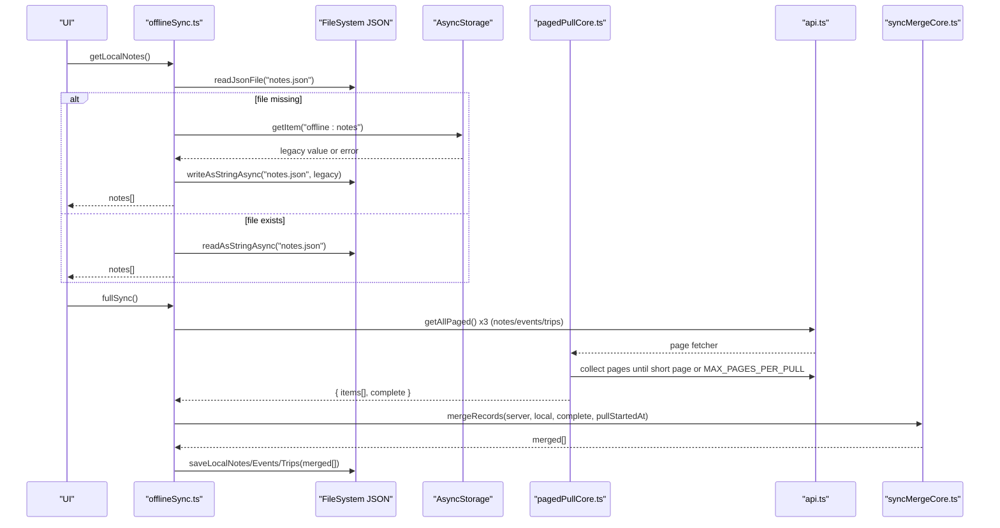
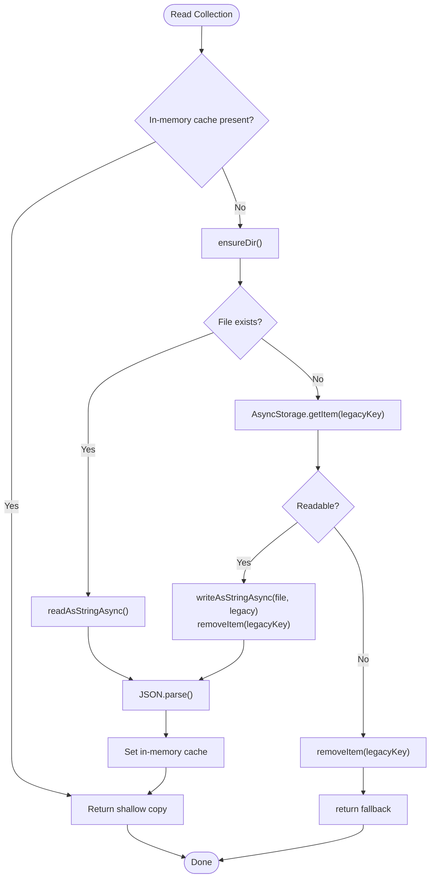
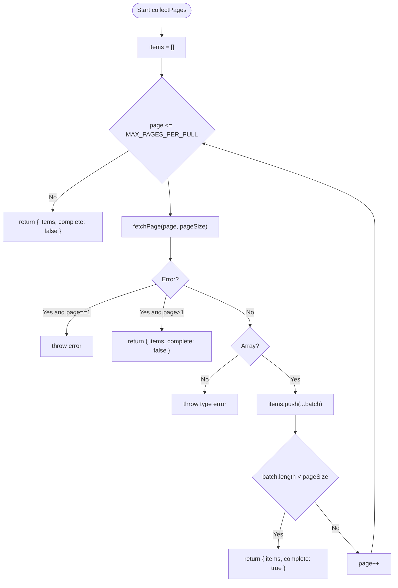
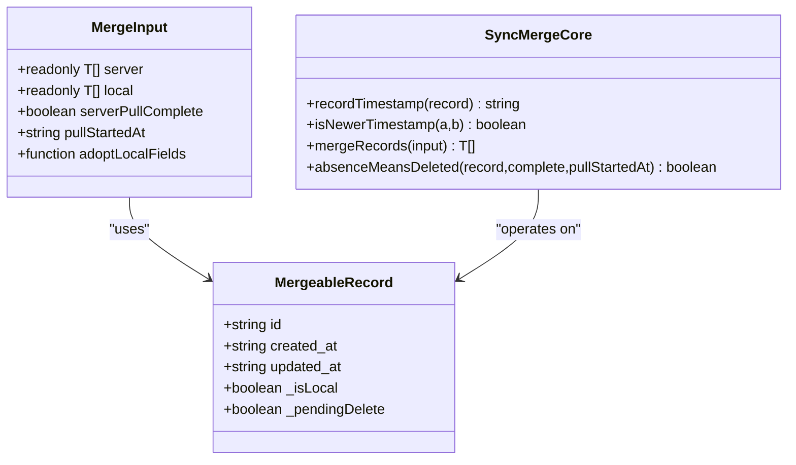
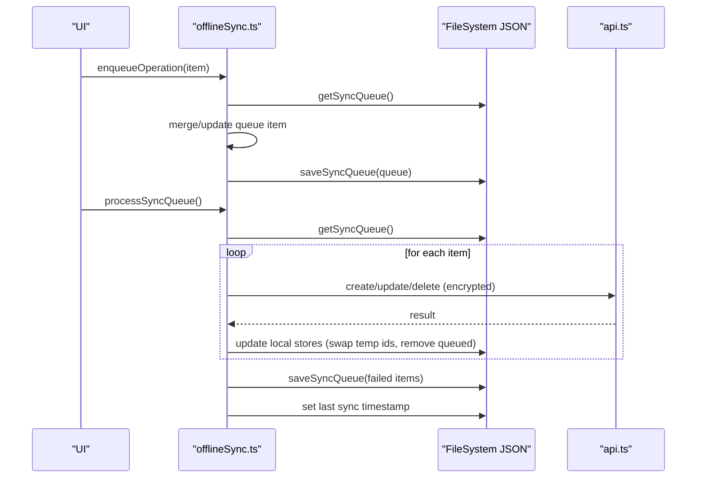
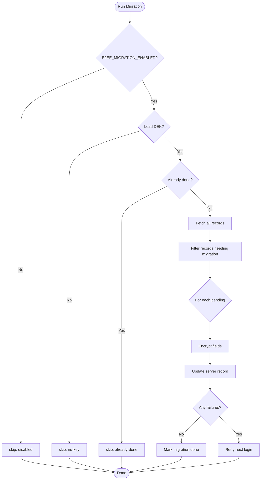
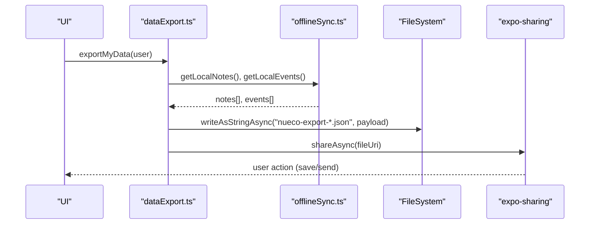
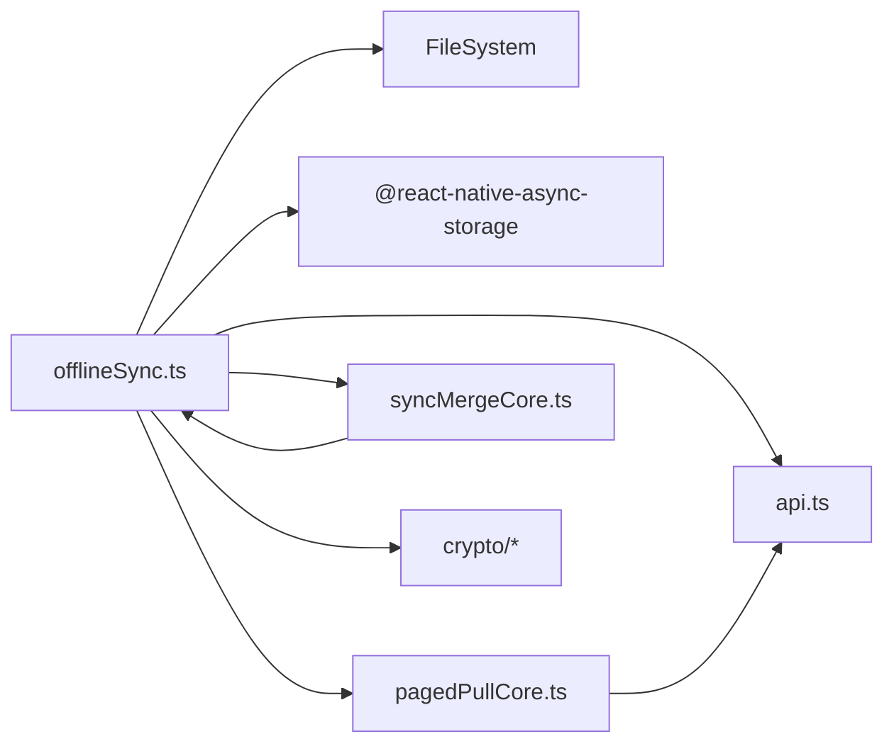

# Data Persistence Layers

<cite>
**Referenced Files in This Document**
- [offlineSync.ts](file://src/offlineSync.ts)
- [pagedPullCore.ts](file://src/pagedPullCore.ts)
- [syncMergeCore.ts](file://src/syncMergeCore.ts)
- [dataExport.ts](file://src/dataExport.ts)
- [authStorage.ts](file://src/auth/storage/authStorage.ts)
- [noteMigration.ts](file://src/crypto/noteMigration.ts)
- [eventMigration.ts](file://src/crypto/eventMigration.ts)
- [attachmentCrypto.ts](file://src/crypto/attachmentCrypto.ts)
- [api.ts](file://src/api.ts)
</cite>

## Table of Contents
1. [Introduction](#introduction)
2. [Project Structure](#project-structure)
3. [Core Components](#core-components)
4. [Architecture Overview](#architecture-overview)
5. [Detailed Component Analysis](#detailed-component-analysis)
6. [Dependency Analysis](#dependency-analysis)
7. [Performance Considerations](#performance-considerations)
8. [Troubleshooting Guide](#troubleshooting-guide)
9. [Conclusion](#conclusion)
10. [Appendices](#appendices)

## Introduction
This document explains the multi-layered data persistence architecture used by the application to store, sync, and protect user data across devices. It covers:
- Separation between in-memory caches, file-based JSON storage, and AsyncStorage fallbacks
- Efficient handling of large datasets via readJsonFile and writeJsonFile
- Paged pull mechanism for large collections and how completeness is tracked
- Caching strategies to optimize performance
- Data migration patterns, backup/export procedures, and storage optimization techniques for different data types and sizes

## Project Structure
The persistence layer spans several modules:
- offlineSync.ts: Central orchestrator for local storage, sync queue, full sync, background sync, and caching
- pagedPullCore.ts: Generic paging collector that assembles whole collections from paginated responses
- syncMergeCore.ts: Reconciliation rules when merging server and local data
- dataExport.ts: GDPR-compliant export of user data to a readable JSON file
- authStorage.ts: Secure storage for authentication tokens and small user state
- noteMigration.ts / eventMigration.ts: One-time migrations to encrypt legacy plaintext records
- attachmentCrypto.ts: Streaming encryption/decryption for large binary attachments
- api.ts: Network layer including attachment upload with progress

**Diagram sources**
- [offlineSync.ts:122-193](file://src/offlineSync.ts#L122-L193)
- [pagedPullCore.ts:21-69](file://src/pagedPullCore.ts#L21-L69)
- [syncMergeCore.ts:16-139](file://src/syncMergeCore.ts#L16-L139)
- [dataExport.ts:16-61](file://src/dataExport.ts#L16-L61)
- [authStorage.ts:15-103](file://src/auth/storage/authStorage.ts#L15-L103)
- [attachmentCrypto.ts:67-119](file://src/crypto/attachmentCrypto.ts#L67-L119)
- [api.ts:271-298](file://src/api.ts#L271-L298)

**Section sources**
- [offlineSync.ts:122-193](file://src/offlineSync.ts#L122-L193)
- [pagedPullCore.ts:21-69](file://src/pagedPullCore.ts#L21-L69)
- [syncMergeCore.ts:16-139](file://src/syncMergeCore.ts#L16-L139)
- [dataExport.ts:16-61](file://src/dataExport.ts#L16-L61)
- [authStorage.ts:15-103](file://src/auth/storage/authStorage.ts#L15-L103)
- [attachmentCrypto.ts:67-119](file://src/crypto/attachmentCrypto.ts#L67-L119)
- [api.ts:271-298](file://src/api.ts#L271-L298)

## Core Components
- In-memory caches: Notes, events, trips, and sync queue are mirrored in memory to avoid repeated JSON.parse of large files during focus-triggered renders and merges. Cache is invalidated on writes and account deletion.
- File-backed JSON store: Large collections (notes, events, trips, sync queue) are persisted to plain JSON files under a dedicated directory to bypass AsyncStorage’s SQLite CursorWindow row-size limits.
- AsyncStorage fallback: On first read, if a file does not exist, the system attempts to migrate from legacy AsyncStorage keys; if unreadable due to size constraints, it drops the key and starts fresh.
- Paged pull: The client pulls entire collections page-by-page and tracks whether the pull reached the end of the collection. This prevents silent deletion of records beyond the first page.
- Merge engine: Reconciles server and local records using newest-write-wins semantics and careful absence rules based on pull completeness and timestamps.
- Sync queue: Persistent queue of pending create/update/delete operations with retries and idempotent merging.
- Backup/export: Exports decrypted notes and events into a human-readable JSON file via the OS share sheet.
- Security and streaming: Attachments are streamed and encrypted in chunks before upload; decryption streams back to temporary files.

**Section sources**
- [offlineSync.ts:207-244](file://src/offlineSync.ts#L207-L244)
- [offlineSync.ts:122-193](file://src/offlineSync.ts#L122-L193)
- [pagedPullCore.ts:21-69](file://src/pagedPullCore.ts#L21-L69)
- [syncMergeCore.ts:66-139](file://src/syncMergeCore.ts#L66-L139)
- [offlineSync.ts:365-415](file://src/offlineSync.ts#L365-L415)
- [dataExport.ts:16-61](file://src/dataExport.ts#L16-L61)
- [attachmentCrypto.ts:67-119](file://src/crypto/attachmentCrypto.ts#L67-L119)

## Architecture Overview
The persistence architecture separates concerns across layers:
- UI triggers reads/writes through offlineSync APIs
- offlineSync manages in-memory caches and persists to JSON files
- Full sync uses pagedPullCore to fetch complete collections and merge with local data
- Sync queue ensures durability of changes with retry logic
- Export utilities provide portable backups

**Diagram sources**
- [offlineSync.ts:161-193](file://src/offlineSync.ts#L161-L193)
- [offlineSync.ts:329-363](file://src/offlineSync.ts#L329-L363)
- [pagedPullCore.ts:45-69](file://src/pagedPullCore.ts#L45-L69)
- [syncMergeCore.ts:66-121](file://src/syncMergeCore.ts#L66-L121)
- [offlineSync.ts:932-1037](file://src/offlineSync.ts#L932-L1037)

## Detailed Component Analysis

### In-Memory Caches and File-Based Storage
- Caches:
  - _notesCache, _eventsCache, _tripsCache, _queueCache hold shallow copies to prevent mutation leaks and reduce JSON parsing overhead
  - Invalidated on every write and on clearLocalData to avoid cross-account leakage
- File-backed JSON store:
  - Directory created lazily and reused
  - readJsonFile migrates from AsyncStorage if file missing; handles unreadable legacy values gracefully
  - writeJsonFile serializes and writes atomically per call
- AsyncStorage fallback:
  - Used only for migration path; primary reads/writes go to files
  - Keys include offline:notes, offline:events, offline:trips, offline:syncQueue

**Diagram sources**
- [offlineSync.ts:137-193](file://src/offlineSync.ts#L137-L193)
- [offlineSync.ts:207-244](file://src/offlineSync.ts#L207-L244)
- [offlineSync.ts:329-386](file://src/offlineSync.ts#L329-L386)

**Section sources**
- [offlineSync.ts:122-193](file://src/offlineSync.ts#L122-L193)
- [offlineSync.ts:207-244](file://src/offlineSync.ts#L207-L244)
- [offlineSync.ts:329-386](file://src/offlineSync.ts#L329-L386)

### Paged Pull Mechanism
- collectPages iterates pages starting at 1, accumulating items
- A short page signals the end of the collection; exact-full pages require an additional request to confirm completion
- Hard ceiling MAX_PAGES_PER_PULL prevents runaway servers from causing infinite loops; exceeding this marks the pull incomplete
- Asymmetric failure handling:
  - First-page failure throws so callers skip merging empty results
  - Later-page failures return partial items and mark incomplete to preserve existing data

**Diagram sources**
- [pagedPullCore.ts:45-69](file://src/pagedPullCore.ts#L45-L69)

**Section sources**
- [pagedPullCore.ts:21-69](file://src/pagedPullCore.ts#L21-L69)

### Merge Engine and Absence Semantics
- mergeRecords implements newest-write-wins with explicit precedence:
  - Pending deletes never reappear
  - Local-only records always survive
  - When both sides have a record, newer timestamp wins
  - Local-only records absent from server are kept unless absence means deletion
- absenceMeansDeleted requires:
  - Pull completed (reached end of collection)
  - Record was not written after the pull started (mid-pull edits can reorder and be missed)

**Diagram sources**
- [syncMergeCore.ts:16-139](file://src/syncMergeCore.ts#L16-L139)

**Section sources**
- [syncMergeCore.ts:16-139](file://src/syncMergeCore.ts#L16-L139)

### Sync Queue and Background Sync
- enqueueOperation merges duplicate operations and maintains retry counts up to a limit
- processSyncQueue runs sequentially, processes each entity type, and persists failed items with incremented retries
- startBackgroundSync listens to network connectivity and triggers queue processing when online
- last sync timestamp stored in AsyncStorage for diagnostics

**Diagram sources**
- [offlineSync.ts:365-415](file://src/offlineSync.ts#L365-L415)
- [offlineSync.ts:798-836](file://src/offlineSync.ts#L798-L836)
- [offlineSync.ts:838-928](file://src/offlineSync.ts#L838-L928)
- [offlineSync.ts:1043-1054](file://src/offlineSync.ts#L1043-L1054)

**Section sources**
- [offlineSync.ts:365-415](file://src/offlineSync.ts#L365-L415)
- [offlineSync.ts:798-836](file://src/offlineSync.ts#L798-L836)
- [offlineSync.ts:838-928](file://src/offlineSync.ts#L838-L928)
- [offlineSync.ts:1043-1054](file://src/offlineSync.ts#L1043-L1054)

### Data Migration Patterns
- Note migration:
  - Idempotent, run-once per user, gated by feature flag
  - Loads DEK, enumerates server notes needing encryption, re-PUTs minimal payloads
  - Marks migration done only if no failures occurred
- Event migration:
  - Similar pattern for events, encrypting title/description/location fields
  - Retries on next login if any failures occur

**Diagram sources**
- [noteMigration.ts:27-86](file://src/crypto/noteMigration.ts#L27-L86)
- [eventMigration.ts:66-89](file://src/crypto/eventMigration.ts#L66-L89)

**Section sources**
- [noteMigration.ts:27-86](file://src/crypto/noteMigration.ts#L27-L86)
- [eventMigration.ts:66-89](file://src/crypto/eventMigration.ts#L66-L89)

### Backup and Restore Procedures
- Export:
  - Reads decrypted notes and events from local cache
  - Builds a structured JSON payload with profile, notes, and events
  - Writes to a unique file in the app’s document directory and shares via OS share sheet
- Restore:
  - Not implemented in the codebase; restore would require importing exported JSON and reconciling with local state using merge rules

**Diagram sources**
- [dataExport.ts:16-61](file://src/dataExport.ts#L16-L61)
- [offlineSync.ts:329-363](file://src/offlineSync.ts#L329-L363)

**Section sources**
- [dataExport.ts:16-61](file://src/dataExport.ts#L16-L61)

### Storage Optimization Techniques
- Large datasets:
  - Avoid AsyncStorage for large collections due to SQLite CursorWindow limits; use JSON files instead
  - In-memory caches reduce repeated JSON.parse overhead
- Binary attachments:
  - Stream encryption/decryption in fixed-size chunks to avoid OOM
  - Use temporary files in cache directory; caller uploads and cleans up
- Small sensitive data:
  - Use SecureStore on native platforms and AsyncStorage on web for tokens and small user state
- Conflict resolution:
  - Newest-write-wins with robust timestamp comparison and fallbacks for legacy records

**Section sources**
- [offlineSync.ts:122-193](file://src/offlineSync.ts#L122-L193)
- [offlineSync.ts:207-244](file://src/offlineSync.ts#L207-L244)
- [attachmentCrypto.ts:67-119](file://src/crypto/attachmentCrypto.ts#L67-L119)
- [authStorage.ts:15-103](file://src/auth/storage/authStorage.ts#L15-L103)
- [syncMergeCore.ts:27-46](file://src/syncMergeCore.ts#L27-L46)

## Dependency Analysis
- offlineSync depends on:
  - FileSystem for JSON files
  - AsyncStorage for legacy migration and small metadata
  - pagedPullCore for collecting paginated collections
  - syncMergeCore for reconciliation
  - crypto modules for encryption/decryption
  - api for network calls
- pagedPullCore is framework-free and testable in isolation
- syncMergeCore is pure logic without runtime dependencies

**Diagram sources**
- [offlineSync.ts:12-26](file://src/offlineSync.ts#L12-L26)
- [pagedPullCore.ts:1-8](file://src/pagedPullCore.ts#L1-L8)
- [syncMergeCore.ts:1-14](file://src/syncMergeCore.ts#L1-L14)

**Section sources**
- [offlineSync.ts:12-26](file://src/offlineSync.ts#L12-L26)
- [pagedPullCore.ts:1-8](file://src/pagedPullCore.ts#L1-L8)
- [syncMergeCore.ts:1-14](file://src/syncMergeCore.ts#L1-L14)

## Performance Considerations
- Avoid blocking the JS thread:
  - In-memory caches minimize synchronous JSON.parse of large files
  - Streaming encryption/decryption for attachments prevents OOM
- Reduce network requests:
  - Paged pull stops early on short pages and caps at MAX_PAGES_PER_PULL
  - Full sync throttling avoids redundant pulls within a short window
- Optimize writes:
  - EnqueueOperation merges duplicates to reduce queue size
  - Atomic per-call writes to JSON files ensure consistency

[No sources needed since this section provides general guidance]

## Troubleshooting Guide
- AsyncStorage CursorWindow errors:
  - Symptoms: reads return empty lists despite successful writes
  - Resolution: rely on file-backed JSON store; migration path handles unreadable legacy values
- Incomplete pulls:
  - Symptoms: warnings about incomplete pulls; local records preserved
  - Resolution: investigate server pagination behavior; ensure collectPages receives correct page size
- Stale recording links:
  - Symptoms: voice recordings disappear after note ID swap
  - Resolution: repairStaleRecordingLinks replays persisted aliases and content-matching
- Sync queue stuck:
  - Symptoms: items remain queued with retries
  - Resolution: check network connectivity; inspect processSyncQueue logs; verify server responses

**Section sources**
- [offlineSync.ts:161-193](file://src/offlineSync.ts#L161-L193)
- [offlineSync.ts:298-327](file://src/offlineSync.ts#L298-L327)
- [offlineSync.ts:798-836](file://src/offlineSync.ts#L798-L836)
- [pagedPullCore.ts:45-69](file://src/pagedPullCore.ts#L45-L69)

## Conclusion
The persistence architecture balances reliability, performance, and security:
- File-backed JSON storage solves AsyncStorage limitations for large datasets
- In-memory caches optimize frequent reads without sacrificing correctness
- Paged pull and merge engine ensure accurate synchronization even with large collections
- Robust sync queue guarantees durability of changes
- Streaming encryption protects sensitive data while maintaining performance
- Export functionality supports data portability and user control

[No sources needed since this section summarizes without analyzing specific files]

## Appendices

### Key Functions and Responsibilities
- readJsonFile(uri, fallback, legacyKey): Migrates from AsyncStorage if needed; returns parsed data or fallback
- writeJsonFile(uri, data): Serializes and writes JSON to file
- collectPages(fetchPage, pageSize): Assembles whole collection from paginated responses
- mergeRecords(input): Reconciles server and local data with newest-write-wins
- exportMyData(user): Creates and shares a JSON export of user data
- encryptFileToTemp(srcUri, dek): Streams and encrypts attachments to temporary files
- decryptFileToTemp(srcUri, dek, filename): Streams and decrypts attachments from temporary files

**Section sources**
- [offlineSync.ts:161-193](file://src/offlineSync.ts#L161-L193)
- [pagedPullCore.ts:45-69](file://src/pagedPullCore.ts#L45-L69)
- [syncMergeCore.ts:66-121](file://src/syncMergeCore.ts#L66-L121)
- [dataExport.ts:16-61](file://src/dataExport.ts#L16-L61)
- [attachmentCrypto.ts:67-119](file://src/crypto/attachmentCrypto.ts#L67-L119)