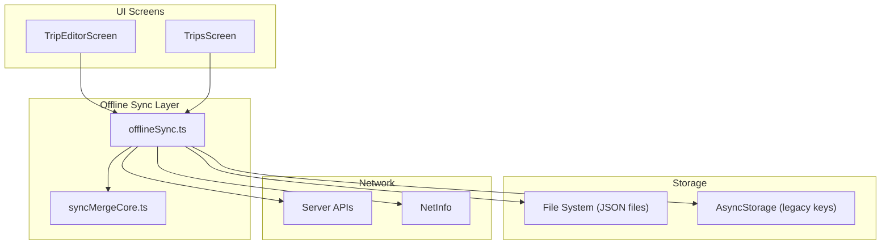
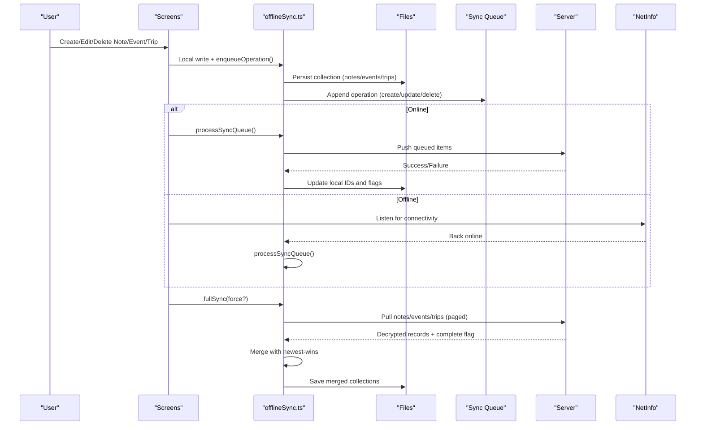
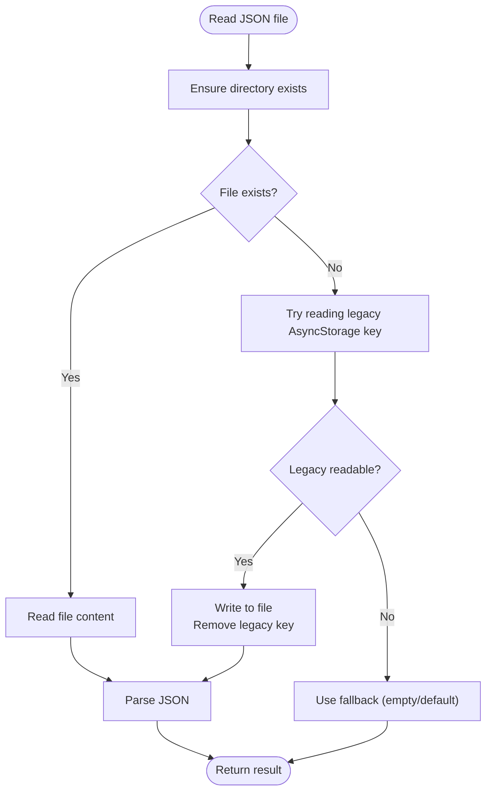
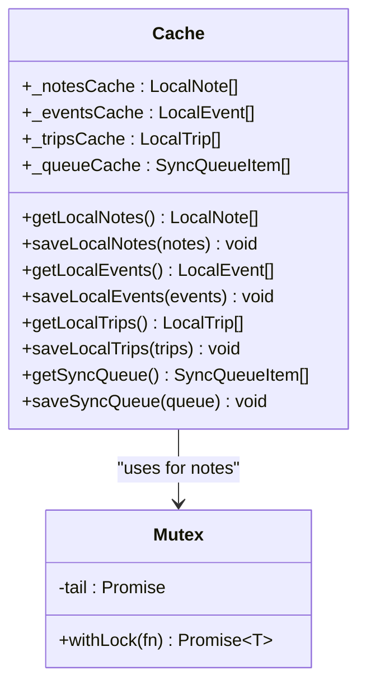
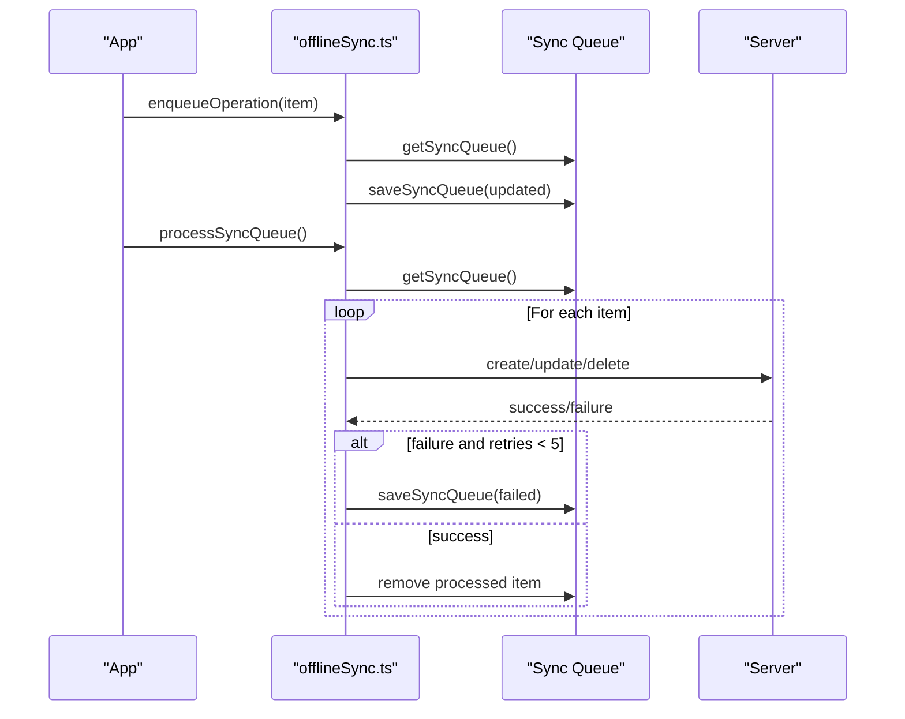
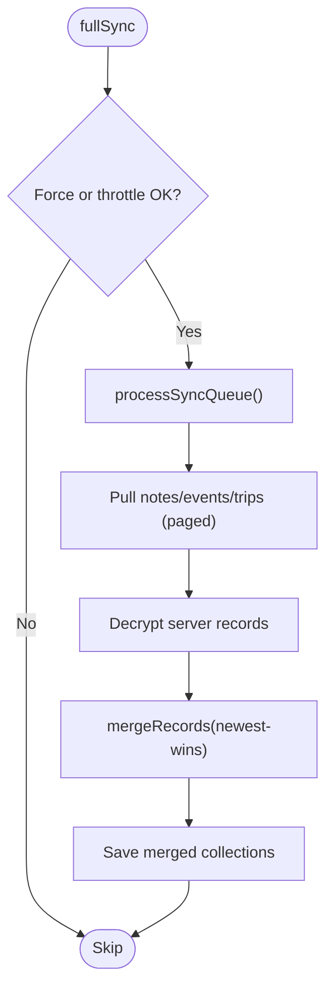
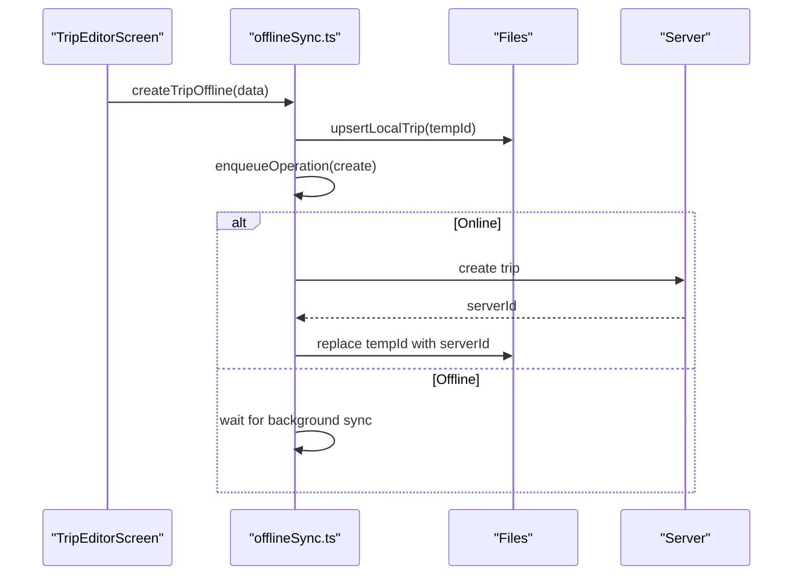
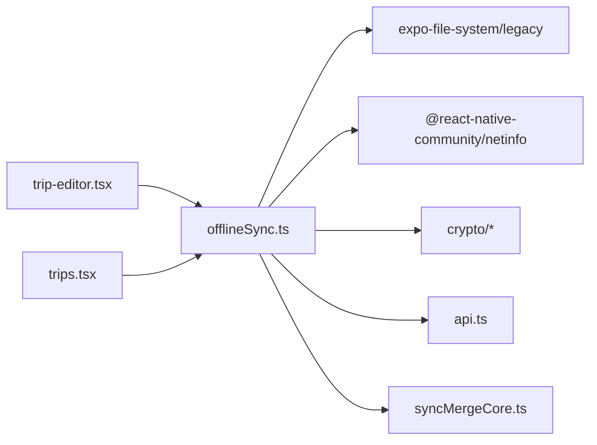

# Offline-First Architecture

<cite>
**Referenced Files in This Document**
- [offlineSync.ts](file://src/offlineSync.ts)
- [syncMergeCore.ts](file://src/syncMergeCore.ts)
- [OfflineBanner.tsx](file://src/components/OfflineBanner.tsx)
- [trip-editor.tsx](file://app/trip-editor.tsx)
- [trips.tsx](file://app/trips.tsx)
</cite>

## Table of Contents
1. [Introduction](#introduction)
2. [Project Structure](#project-structure)
3. [Core Components](#core-components)
4. [Architecture Overview](#architecture-overview)
5. [Detailed Component Analysis](#detailed-component-analysis)
6. [Dependency Analysis](#dependency-analysis)
7. [Performance Considerations](#performance-considerations)
8. [Troubleshooting Guide](#troubleshooting-guide)
9. [Conclusion](#conclusion)

## Introduction
This document explains Nueco’s offline-first architecture: how the app remains fully functional without internet, persists data locally, and synchronizes when connectivity returns. It covers the file-backed JSON store that replaces AsyncStorage on Android, the in-memory caching system with mutex protection to avoid race conditions, and the background synchronization engine that reconciles local changes with the server for notes, events, and trips.

## Project Structure
The offline-first behavior is centered around a single sync manager module that provides:
- Local storage APIs for notes, events, and trips
- A persistent sync queue for pending operations
- Background network monitoring and full reconciliation
- UI feedback when coming back online

**Diagram sources**
- [offlineSync.ts:122-193](file://src/offlineSync.ts#L122-L193)
- [offlineSync.ts:329-386](file://src/offlineSync.ts#L329-L386)
- [offlineSync.ts:798-836](file://src/offlineSync.ts#L798-L836)
- [offlineSync.ts:930-1037](file://src/offlineSync.ts#L930-L1037)
- [syncMergeCore.ts:66-121](file://src/syncMergeCore.ts#L66-L121)

**Section sources**
- [offlineSync.ts:122-193](file://src/offlineSync.ts#L122-L193)
- [offlineSync.ts:329-386](file://src/offlineSync.ts#L329-L386)
- [offlineSync.ts:798-836](file://src/offlineSync.ts#L798-L836)
- [offlineSync.ts:930-1037](file://src/offlineSync.ts#L930-L1037)
- [syncMergeCore.ts:66-121](file://src/syncMergeCore.ts#L66-L121)

## Core Components
- File-backed JSON store: Persists notes, events, trips, and sync queue as JSON files under a dedicated directory, with migration from legacy AsyncStorage keys.
- In-memory caches: Shallow-copied arrays for notes, events, trips, and sync queue to reduce repeated disk reads and prevent mutation of live cache.
- Mutex protection: A Promise-based lock serializes read-modify-write cycles against notes to prevent race conditions across editor autosaves, background sync, and full sync.
- Sync queue: Persistent queue of create/update/delete operations with retry logic and idempotent merging.
- Full sync engine: Throttled reconciliation that pushes pending operations first, then pulls all collections concurrently, decrypts, merges using newest-wins rules, and persists results.
- Background sync: Listens to NetInfo and triggers queued operation processing when connectivity is restored.
- UI banner: Shows a transient “Uploading your notes” / “Up to date” banner when reconnecting.

**Section sources**
- [offlineSync.ts:122-193](file://src/offlineSync.ts#L122-L193)
- [offlineSync.ts:207-244](file://src/offlineSync.ts#L207-L244)
- [offlineSync.ts:365-415](file://src/offlineSync.ts#L365-L415)
- [offlineSync.ts:798-836](file://src/offlineSync.ts#L798-L836)
- [offlineSync.ts:930-1037](file://src/offlineSync.ts#L930-L1037)
- [offlineSync.ts:1043-1070](file://src/offlineSync.ts#L1043-L1070)
- [OfflineBanner.tsx:18-62](file://src/components/OfflineBanner.tsx#L18-L62)

## Architecture Overview
Nueco writes changes immediately to local files and enqueues them for later upload. When online, it processes the queue and periodically performs a full sync to reconcile with the server. The merge strategy ensures no data loss even if the server pull is incomplete or edits happen during the pull.

**Diagram sources**
- [offlineSync.ts:449-502](file://src/offlineSync.ts#L449-L502)
- [offlineSync.ts:599-671](file://src/offlineSync.ts#L599-L671)
- [offlineSync.ts:708-757](file://src/offlineSync.ts#L708-L757)
- [offlineSync.ts:798-836](file://src/offlineSync.ts#L798-L836)
- [offlineSync.ts:930-1037](file://src/offlineSync.ts#L930-L1037)
- [offlineSync.ts:1043-1070](file://src/offlineSync.ts#L1043-L1070)

## Detailed Component Analysis

### File-backed JSON Store and Migration
- Stores notes, events, trips, and sync queue as JSON files in a dedicated directory.
- On first read, if a file does not exist, attempts to migrate data from legacy AsyncStorage keys; if unreadable (e.g., due to SQLite row limits), clears the legacy key and starts fresh.
- Provides clearLocalData to wipe files and reset caches on account deletion.

**Diagram sources**
- [offlineSync.ts:161-193](file://src/offlineSync.ts#L161-L193)

**Section sources**
- [offlineSync.ts:122-193](file://src/offlineSync.ts#L122-L193)

### In-Memory Caching and Mutex Protection
- Maintains in-memory arrays for notes, events, trips, and sync queue to avoid repeated disk I/O and parsing.
- Returns shallow copies to callers so they can mutate safely without corrupting the cache.
- Serializes note mutations via a Promise-based mutex to prevent interleaving between editor autosaves, background sync, and full sync.

**Diagram sources**
- [offlineSync.ts:207-244](file://src/offlineSync.ts#L207-L244)
- [offlineSync.ts:329-386](file://src/offlineSync.ts#L329-L386)

**Section sources**
- [offlineSync.ts:207-244](file://src/offlineSync.ts#L207-L244)
- [offlineSync.ts:329-386](file://src/offlineSync.ts#L329-L386)

### Sync Queue and Background Synchronization
- Each create/update/delete is enqueued with entity type, payload, and timestamp. Duplicate creates are merged into a single pending operation.
- processSyncQueue runs once at a time, processes each item, retries up to five times on failure, and updates last sync timestamp.
- startBackgroundSync registers a NetInfo listener to trigger processing when connectivity is restored.

**Diagram sources**
- [offlineSync.ts:388-415](file://src/offlineSync.ts#L388-L415)
- [offlineSync.ts:798-836](file://src/offlineSync.ts#L798-L836)
- [offlineSync.ts:1043-1070](file://src/offlineSync.ts#L1043-L1070)

**Section sources**
- [offlineSync.ts:388-415](file://src/offlineSync.ts#L388-L415)
- [offlineSync.ts:798-836](file://src/offlineSync.ts#L798-L836)
- [offlineSync.ts:1043-1070](file://src/offlineSync.ts#L1043-L1070)

### Full Sync and Conflict Resolution
- Throttles full sync to avoid excessive network calls and decryption work.
- Pushes pending operations first, then pulls notes, events, and trips concurrently.
- Decrypts server payloads and merges with local data using newest-wins semantics, preserving device-only fields where needed.
- Handles incomplete pulls by never deleting records it did not reach.

**Diagram sources**
- [offlineSync.ts:930-1037](file://src/offlineSync.ts#L930-L1037)
- [syncMergeCore.ts:66-121](file://src/syncMergeCore.ts#L66-L121)

**Section sources**
- [offlineSync.ts:930-1037](file://src/offlineSync.ts#L930-L1037)
- [syncMergeCore.ts:66-121](file://src/syncMergeCore.ts#L66-L121)

### Notes, Events, and Trips: Local Storage and Sync Examples
- Notes:
  - Create/update/delete use local-first writes, enqueue operations, and optional immediate push if online.
  - After successful server create, local temp IDs are replaced with server IDs, and aliases are persisted to repair recording links.
- Events:
  - Similar flow to notes; createEventOffline performs an immediate push to return the real server ID for linking notes.
- Trips:
  - CRUD operations follow the same pattern; no special immediate-push path since nothing needs the server ID synchronously.

**Diagram sources**
- [trip-editor.tsx:68-87](file://app/trip-editor.tsx#L68-L87)
- [offlineSync.ts:708-727](file://src/offlineSync.ts#L708-L727)
- [offlineSync.ts:907-928](file://src/offlineSync.ts#L907-L928)

**Section sources**
- [offlineSync.ts:449-502](file://src/offlineSync.ts#L449-L502)
- [offlineSync.ts:599-671](file://src/offlineSync.ts#L599-L671)
- [offlineSync.ts:708-757](file://src/offlineSync.ts#L708-L757)
- [trip-editor.tsx:68-87](file://app/trip-editor.tsx#L68-L87)

### UI Feedback on Connectivity Changes
- OfflineBanner shows a transient banner when the app comes back online, indicating upload status and disappearing once sync completes.

**Section sources**
- [OfflineBanner.tsx:18-62](file://src/components/OfflineBanner.tsx#L18-L62)

## Dependency Analysis
- offlineSync.ts depends on:
  - expo-file-system/legacy for file persistence
  - @react-native-community/netinfo for connectivity detection
  - crypto modules for encrypting/decrypting payloads
  - api module for server endpoints
  - syncMergeCore for conflict resolution
- UI screens depend on offlineSync for local CRUD and sync triggers.

**Diagram sources**
- [offlineSync.ts:12-26](file://src/offlineSync.ts#L12-L26)
- [trip-editor.tsx:9-12](file://app/trip-editor.tsx#L9-L12)
- [trips.tsx:6-7](file://app/trips.tsx#L6-L7)

**Section sources**
- [offlineSync.ts:12-26](file://src/offlineSync.ts#L12-L26)
- [trip-editor.tsx:9-12](file://app/trip-editor.tsx#L9-L12)
- [trips.tsx:6-7](file://app/trips.tsx#L6-L7)

## Performance Considerations
- File-backed store avoids AsyncStorage CursorWindow size limits on Android, preventing silent failures when large collections (e.g., notes with embedded images) exceed row-size caps.
- In-memory caches reduce repeated JSON.parse/stringify costs during focus-triggered syncs and UI renders.
- Mutex serialization prevents race conditions and lost updates during concurrent writes to notes.
- Full sync throttling minimizes redundant network requests and decryption overhead.
- Concurrent pulls for notes, events, and trips improve sync throughput while isolating failures per collection.

[No sources needed since this section provides general guidance]

## Troubleshooting Guide
- Large notes causing reads to fail:
  - Symptom: Empty lists despite successful writes.
  - Cause: AsyncStorage SQLite row limit exceeded.
  - Resolution: Use file-backed JSON store; migration occurs automatically on first read.
- Missing recordings linked to notes after restart:
  - Symptom: Voice players disappear when reopening notes.
  - Cause: Temp note IDs changed to server IDs mid-session; aliases not persisted.
  - Resolution: Alias map persisted and repaired at startup; ensure repairStaleRecordingLinks runs.
- Incomplete pulls deleting data:
  - Symptom: Records vanish after sync.
  - Cause: Treating absence as deletion without knowing the pull was complete.
  - Resolution: Merge logic only deletes when serverPullComplete is true and record is older than pull start.
- Frequent sync spam:
  - Symptom: Excessive network calls on tab focus/back navigation.
  - Cause: Multiple fullSync triggers without throttling.
  - Resolution: FULL_SYNC_THROTTLE_MS prevents rapid re-syncs; force option bypasses throttle for explicit refreshes.

**Section sources**
- [offlineSync.ts:161-193](file://src/offlineSync.ts#L161-L193)
- [offlineSync.ts:272-327](file://src/offlineSync.ts#L272-L327)
- [syncMergeCore.ts:66-121](file://src/syncMergeCore.ts#L66-L121)
- [offlineSync.ts:790-796](file://src/offlineSync.ts#L790-L796)

## Conclusion
Nueco’s offline-first architecture ensures reliable functionality without internet by persisting all user data locally, queuing changes for later upload, and performing robust reconciliation when connectivity returns. The file-backed JSON store solves critical Android limitations, the mutex protects against race conditions, and the merge strategy guarantees data integrity even with incomplete pulls or concurrent edits. Together, these mechanisms provide a seamless, resilient experience for notes, events, and trips across online and offline states.