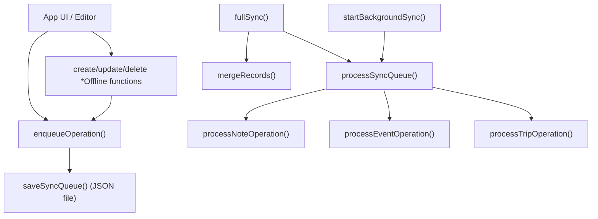
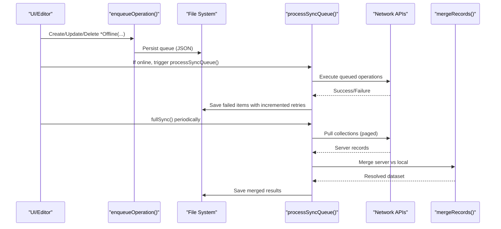
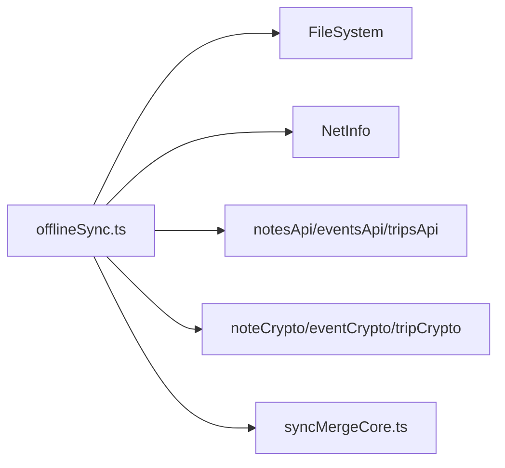

# Sync Queue Management

<cite>
**Referenced Files in This Document**
- [offlineSync.ts](file://src/offlineSync.ts)
- [syncMergeCore.ts](file://src/syncMergeCore.ts)
- [types.ts](file://src/types.ts)
</cite>

## Table of Contents
1. [Introduction](#introduction)
2. [Project Structure](#project-structure)
3. [Core Components](#core-components)
4. [Architecture Overview](#architecture-overview)
5. [Detailed Component Analysis](#detailed-component-analysis)
6. [Dependency Analysis](#dependency-analysis)
7. [Performance Considerations](#performance-considerations)
8. [Troubleshooting Guide](#troubleshooting-guide)
9. [Conclusion](#conclusion)

## Introduction
This document explains the sync queue management system that persists and processes pending create, update, and delete operations for notes, events, and trips. It covers the data model used to represent queued work, how operations are merged to avoid redundant or conflicting work, how retries are handled, and how the queue survives app restarts. It also documents the processing flow, error handling strategies, and performance considerations for large queues and memory usage.

## Project Structure
The sync queue is implemented in a single module that centralizes:
- Local persistence of notes, events, trips, and the sync queue
- Enqueueing and merging of operations
- Background network-aware sync execution
- Conflict resolution during full server pulls

**Diagram sources**
- [offlineSync.ts:365-415](file://src/offlineSync.ts#L365-L415)
- [offlineSync.ts:798-836](file://src/offlineSync.ts#L798-L836)
- [offlineSync.ts:838-928](file://src/offlineSync.ts#L838-L928)
- [offlineSync.ts:930-1037](file://src/offlineSync.ts#L930-L1037)
- [offlineSync.ts:1043-1054](file://src/offlineSync.ts#L1043-L1054)
- [syncMergeCore.ts:76-121](file://src/syncMergeCore.ts#L76-L121)

**Section sources**
- [offlineSync.ts:1-26](file://src/offlineSync.ts#L1-L26)
- [offlineSync.ts:112-135](file://src/offlineSync.ts#L112-L135)
- [offlineSync.ts:365-415](file://src/offlineSync.ts#L365-L415)
- [offlineSync.ts:798-836](file://src/offlineSync.ts#L798-L836)
- [offlineSync.ts:930-1037](file://src/offlineSync.ts#L930-L1037)
- [offlineSync.ts:1043-1054](file://src/offlineSync.ts#L1043-L1054)
- [syncMergeCore.ts:1-140](file://src/syncMergeCore.ts#L1-L140)

## Core Components
- SyncQueueItem: The persistent unit of work representing a pending operation on an entity.
- enqueueOperation(): Adds or merges an operation into the queue with conflict-aware logic.
- processSyncQueue(): Executes queued operations against the server with retry limits.
- Entity-specific processors: Note, event, and trip operation handlers.
- Full sync and merge: Pulls from server and reconciles with local state using newest-write-wins rules.
- Background sync: Triggers queue processing when connectivity is restored.

Key types and structures:
- SyncQueueItem fields include id, serverId, entity, operation, payload, timestamp, and retries.
- LocalNote, LocalEvent, LocalTrip define local representations with flags like _isLocal and _pendingDelete.

**Section sources**
- [offlineSync.ts:30-41](file://src/offlineSync.ts#L30-L41)
- [offlineSync.ts:43-110](file://src/offlineSync.ts#L43-L110)
- [offlineSync.ts:376-415](file://src/offlineSync.ts#L376-L415)
- [offlineSync.ts:798-836](file://src/offlineSync.ts#L798-L836)
- [offlineSync.ts:838-928](file://src/offlineSync.ts#L838-L928)
- [offlineSync.ts:930-1037](file://src/offlineSync.ts#L930-L1037)
- [offlineSync.ts:1043-1054](file://src/offlineSync.ts#L1043-L1054)

## Architecture Overview
The system follows an offline-first pattern:
- All writes happen locally first and are enqueued for later synchronization.
- The queue persists to a JSON file so it survives app restarts.
- When online, background listeners trigger processing of the queue.
- Conflicts between local edits and server changes are resolved by comparing timestamps.

**Diagram sources**
- [offlineSync.ts:388-415](file://src/offlineSync.ts#L388-L415)
- [offlineSync.ts:798-836](file://src/offlineSync.ts#L798-L836)
- [offlineSync.ts:838-928](file://src/offlineSync.ts#L838-L928)
- [offlineSync.ts:930-1037](file://src/offlineSync.ts#L930-L1037)
- [syncMergeCore.ts:76-121](file://src/syncMergeCore.ts#L76-L121)

## Detailed Component Analysis

### SyncQueueItem structure
- id: Local temporary ID for creates; server ID after successful creation.
- serverId: Optional field set after first successful create.
- entity: One of note, event, trip.
- operation: One of create, update, delete.
- payload: Data to send to the server.
- timestamp: ISO timestamp when queued.
- retries: Number of failed attempts; capped at five before dropping.

This structure is persisted per operation and merged on subsequent enqueues to avoid duplicate work.

**Section sources**
- [offlineSync.ts:30-41](file://src/offlineSync.ts#L30-L41)
- [offlineSync.ts:376-415](file://src/offlineSync.ts#L376-L415)

### Operation merging logic
When enqueueing an operation:
- If there is already a pending item with the same id and entity:
  - For a delete of an unsynced create, remove the pending create entirely.
  - Otherwise, merge by updating payload and timestamp while preserving earlier operation semantics unless the new operation is a delete.
- If no existing item, push a new entry with retries initialized to zero.

This ensures:
- Rapid successive updates collapse into one effective operation.
- Deletes of never-synced creates are no-ops on the server side and thus removed from the queue.
- Latest payload wins without generating redundant network calls.

**Section sources**
- [offlineSync.ts:388-415](file://src/offlineSync.ts#L388-L415)

### Retry mechanisms
- processSyncQueue() iterates through the queue and executes each operation.
- On failure, the item is retained with retries incremented by one.
- Items exceeding five retries are dropped and logged.
- Only failed items are saved back to the queue; successful ones are implicitly removed.

This provides bounded retry behavior to prevent indefinite growth of failed operations.

**Section sources**
- [offlineSync.ts:798-836](file://src/offlineSync.ts#L798-L836)

### Persistence across app restarts
- The queue is stored as a JSON file under a dedicated directory.
- getSyncQueue() reads from disk once and caches in memory; saveSyncQueue() updates both cache and disk.
- readJsonFile() supports migration from legacy AsyncStorage keys if needed.
- clearLocalData() wipes all local files and invalidates caches.

This design ensures durability across restarts and avoids SQLite row-size limitations by using plain JSON files.

**Section sources**
- [offlineSync.ts:122-193](file://src/offlineSync.ts#L122-L193)
- [offlineSync.ts:365-386](file://src/offlineSync.ts#L365-L386)

### Handling conflicts between multiple operations on the same entity
- enqueueOperation merges operations for the same id/entity to avoid redundant or conflicting work.
- During fullSync, mergeRecords() applies newest-write-wins based on updated_at or created_at timestamps.
- Local-only records survive unless the server pull is known complete and older than the pull start time.
- Pending deletes are preserved until the server confirms deletion.

This prevents lost edits and ensures consistent reconciliation between local and server states.

**Section sources**
- [offlineSync.ts:388-415](file://src/offlineSync.ts#L388-L415)
- [offlineSync.ts:930-1037](file://src/offlineSync.ts#L930-L1037)
- [syncMergeCore.ts:76-121](file://src/syncMergeCore.ts#L76-L121)

### Examples of enqueueOperation usage
- createNoteOffline(), updateNoteOffline(), deleteNoteOffline() enqueue operations for notes.
- createEventOffline(), updateEventOffline(), deleteEventOffline() enqueue operations for events.
- createTripOffline(), updateTripOffline(), deleteTripOffline() enqueue operations for trips.

These functions write locally first, then enqueue, and optionally trigger immediate sync if online.

**Section sources**
- [offlineSync.ts:449-537](file://src/offlineSync.ts#L449-L537)
- [offlineSync.ts:599-700](file://src/offlineSync.ts#L599-L700)
- [offlineSync.ts:708-783](file://src/offlineSync.ts#L708-L783)

### Queue processing flow
- processSyncQueue() serializes execution to avoid concurrent sync runs.
- It loads the queue, processes each item via entity-specific handlers, and collects failures.
- After processing, it saves only failed items with incremented retries and updates last sync timestamp.

Entity processors handle encryption/decryption and server API calls:
- Notes: create/update/delete with conflict checks for updates.
- Events: create/update/delete with direct immediate-push path in createEventOffline.
- Trips: create/update/delete similar to notes.

**Section sources**
- [offlineSync.ts:798-836](file://src/offlineSync.ts#L798-L836)
- [offlineSync.ts:838-928](file://src/offlineSync.ts#L838-L928)

### Error handling strategies
- Network errors increment retries up to five; beyond that, items are dropped and logged.
- Update conflicts for notes compare timestamps; if server is newer, local state is overwritten with decrypted server data.
- Full sync isolates failures per collection using Promise.allSettled to avoid partial failures blocking others.
- Background sync listener triggers processing only when connected and internet reachable.

**Section sources**
- [offlineSync.ts:820-832](file://src/offlineSync.ts#L820-L832)
- [offlineSync.ts:860-875](file://src/offlineSync.ts#L860-L875)
- [offlineSync.ts:958-1037](file://src/offlineSync.ts#L958-L1037)
- [offlineSync.ts:1043-1054](file://src/offlineSync.ts#L1043-L1054)

### Performance considerations for large queues and memory management
- In-memory caching: getSyncQueue() caches the queue array to avoid repeated disk reads; saveSyncQueue() updates cache and disk atomically.
- File-backed storage: Large collections and queue are stored as JSON files to bypass AsyncStorage row-size limits.
- Shallow copies: Readers return shallow copies to prevent callers from mutating cached arrays inadvertently.
- Mutex for notes: A mutex serializes note mutations to prevent race conditions during concurrent writes.
- Throttling full sync: fullSync is throttled to reduce frequent network requests and heavy decrypt/merge cycles.
- Paged pulls: fullSync uses paged pulls and tracks completeness to avoid accidental deletions due to incomplete pages.

These techniques optimize throughput and memory footprint for large datasets and frequent autosaves.

**Section sources**
- [offlineSync.ts:207-244](file://src/offlineSync.ts#L207-L244)
- [offlineSync.ts:365-386](file://src/offlineSync.ts#L365-L386)
- [offlineSync.ts:790-796](file://src/offlineSync.ts#L790-L796)
- [offlineSync.ts:958-1037](file://src/offlineSync.ts#L958-L1037)

## Dependency Analysis
The sync queue depends on:
- File system for persistence (read/write JSON).
- Network info for connectivity detection and background sync triggering.
- API modules for creating/updating/deleting entities and pulling collections.
- Crypto utilities for encrypting payloads and decrypting server responses.
- Merge core for conflict resolution during full sync.

**Diagram sources**
- [offlineSync.ts:12-26](file://src/offlineSync.ts#L12-L26)
- [offlineSync.ts:122-193](file://src/offlineSync.ts#L122-L193)
- [offlineSync.ts:958-1037](file://src/offlineSync.ts#L958-L1037)
- [syncMergeCore.ts:76-121](file://src/syncMergeCore.ts#L76-L121)

**Section sources**
- [offlineSync.ts:12-26](file://src/offlineSync.ts#L12-L26)
- [offlineSync.ts:122-193](file://src/offlineSync.ts#L122-L193)
- [offlineSync.ts:958-1037](file://src/offlineSync.ts#L958-L1037)
- [syncMergeCore.ts:76-121](file://src/syncMergeCore.ts#L76-L121)

## Performance Considerations
- Avoid unnecessary re-parsing: Cache the queue in memory and return shallow copies to callers.
- Minimize disk I/O: Batch writes by merging operations before saving.
- Prevent thread-blocking: Use async file operations and throttle full sync frequency.
- Handle large payloads efficiently: Store large collections as JSON files to avoid SQLite limits.
- Reduce network churn: Trigger background sync only on connectivity changes and throttle full sync.

[No sources needed since this section provides general guidance]

## Troubleshooting Guide
Common issues and resolutions:
- Sync stuck or not processing:
  - Ensure background sync listener is started and network is reachable.
  - Check that processSyncQueue is not already running (guarded by flag).
- Operations not syncing:
  - Verify enqueueOperation is called and queue file exists.
  - Confirm entity-specific offline functions are invoked correctly.
- Conflicts causing unexpected overwrites:
  - Review updated_at timestamps and ensure they reflect the latest local edit.
  - Inspect mergeRecords behavior during full sync.
- Excessive retries:
  - Investigate server errors and network stability; items drop after five retries.
- Memory pressure:
  - Monitor queue size and consider clearing stale entries or optimizing payloads.

**Section sources**
- [offlineSync.ts:798-836](file://src/offlineSync.ts#L798-L836)
- [offlineSync.ts:1043-1054](file://src/offlineSync.ts#L1043-L1054)
- [offlineSync.ts:958-1037](file://src/offlineSync.ts#L958-L1037)

## Conclusion
The sync queue system provides robust offline-first synchronization for notes, events, and trips. It persists operations to disk, merges conflicting work, retries failed operations with a bounded limit, and reconciles server changes using timestamp-based conflict resolution. Performance optimizations such as in-memory caching, file-backed storage, mutexes, and throttling ensure scalability for large datasets and frequent user interactions. Proper use of the provided offline functions and awareness of background sync behavior will help maintain consistency and reliability across app sessions and network conditions.