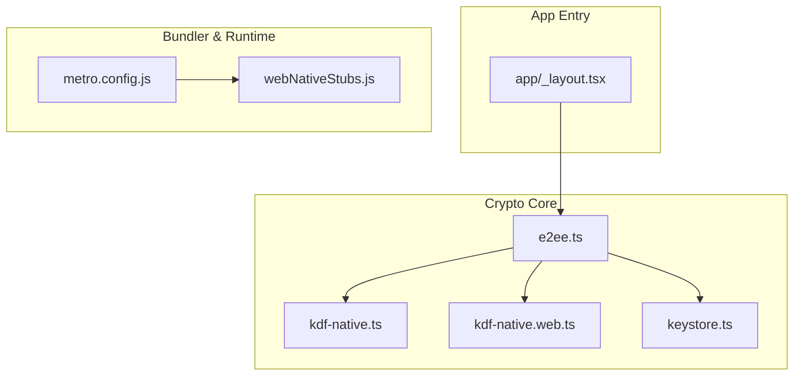
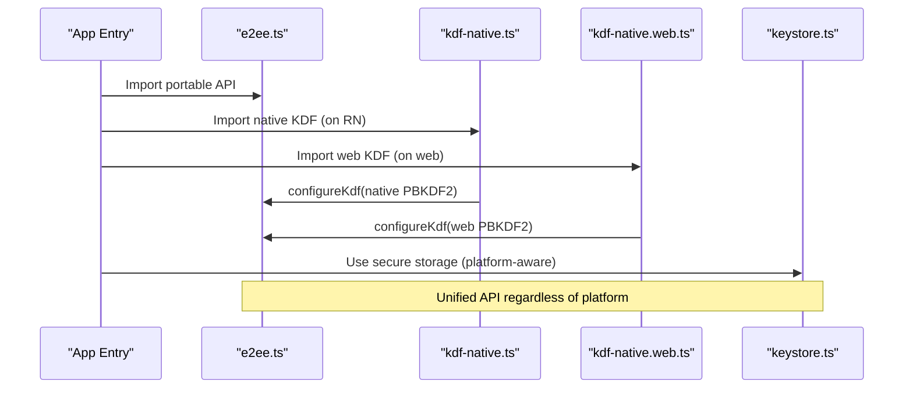
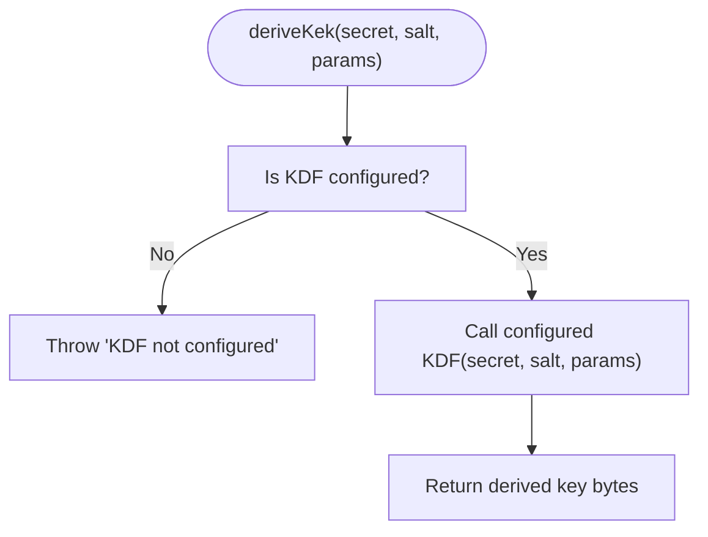
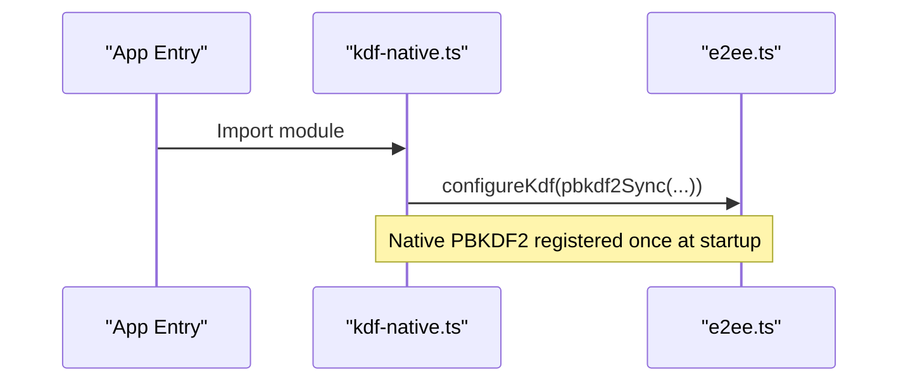
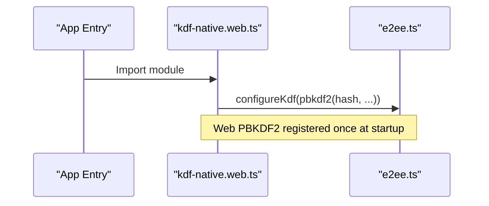
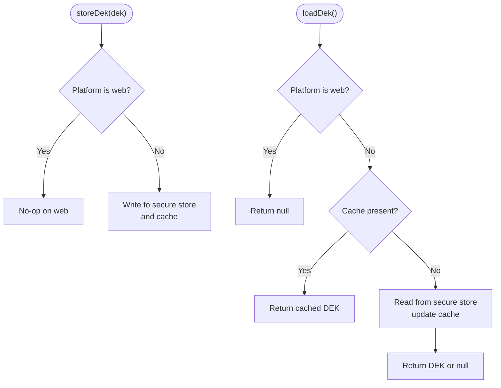
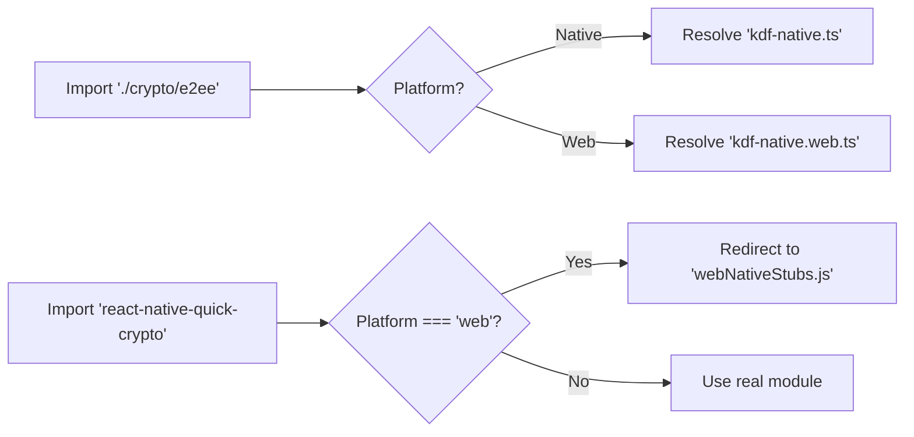
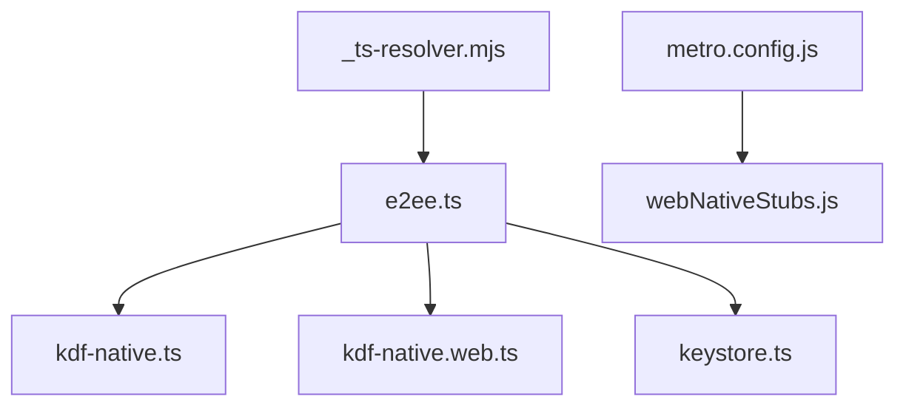

# Conditional Implementation

<cite>
**Referenced Files in This Document**
- [kdf-native.ts](file://src/crypto/kdf-native.ts)
- [kdf-native.web.ts](file://src/crypto/kdf-native.web.ts)
- [e2ee.ts](file://src/crypto/e2ee.ts)
- [keystore.ts](file://src/crypto/keystore.ts)
- [metro.config.js](file://metro.config.js)
- [webNativeStubs.js](file://src/webNativeStubs.js)
- [_ts-resolver.mjs](file://src/crypto/_ts-resolver.mjs)
- [app.config.js](file://app.config.js)
- [package.json](file://package.json)
</cite>

## Table of Contents
1. [Introduction](#introduction)
2. [Project Structure](#project-structure)
3. [Core Components](#core-components)
4. [Architecture Overview](#architecture-overview)
5. [Detailed Component Analysis](#detailed-component-analysis)
6. [Dependency Analysis](#dependency-analysis)
7. [Performance Considerations](#performance-considerations)
8. [Troubleshooting Guide](#troubleshooting-guide)
9. [Conclusion](#conclusion)

## Introduction
This document explains how the codebase implements conditional, platform-specific optimizations while preserving a unified API surface. It focuses on:
- How native and web implementations are selected at build time by the bundler
- The file naming conventions used to split platform-specific code
- How cryptographic operations are optimized per platform without changing application code
- Performance trade-offs between native and web implementations
- Practical examples from the end-to-end encryption (E2EE) subsystem

## Project Structure
The project uses a combination of Metro’s extension-based resolution and runtime guards to provide different implementations for native and web platforms:
- Platform-specific files use extensions like `.native.ts` and `.web.ts` so the bundler can choose the correct implementation automatically
- A central, portable core exposes a stable API and defers platform-specific details to injected implementations
- Native-only dependencies are stubbed out when building for web to avoid runtime crashes

**Diagram sources**
- [kdf-native.ts:1-22](file://src/crypto/kdf-native.ts#L1-L22)
- [kdf-native.web.ts:1-16](file://src/crypto/kdf-native.web.ts#L1-L16)
- [e2ee.ts:1-228](file://src/crypto/e2ee.ts#L1-L228)
- [keystore.ts:1-53](file://src/crypto/keystore.ts#L1-L53)
- [metro.config.js:1-37](file://metro.config.js#L1-L37)
- [webNativeStubs.js:1-12](file://src/webNativeStubs.js#L1-L12)

**Section sources**
- [kdf-native.ts:1-22](file://src/crypto/kdf-native.ts#L1-L22)
- [kdf-native.web.ts:1-16](file://src/crypto/kdf-native.web.ts#L1-L16)
- [e2ee.ts:1-228](file://src/crypto/e2ee.ts#L1-L228)
- [keystore.ts:1-53](file://src/crypto/keystore.ts#L1-L53)
- [metro.config.js:1-37](file://metro.config.js#L1-L37)
- [webNativeStubs.js:1-12](file://src/webNativeStubs.js#L1-L12)

## Core Components
- Portable E2EE core: Provides a unified API for encryption, key wrapping, and escrow workflows. It does not import platform-specific crypto directly; instead, it accepts a KDF implementation via configuration.
- Native KDF wiring: Registers a fast PBKDF2 implementation backed by native code for mobile devices.
- Web KDF wiring: Registers a pure-JS PBKDF2 implementation suitable for browsers where native modules are unavailable.
- Secure storage wrapper: Stores the Data Encryption Key (DEK) in the OS keystore on native platforms and gracefully no-ops on web.

Key responsibilities:
- e2ee.ts: Defines the public API, constants, and algorithms; injects the KDF at startup; throws if not configured
- kdf-native.ts: Configures the native PBKDF2 for mobile
- kdf-native.web.ts: Configures the web PBKDF2 using a pure-JS library
- keystore.ts: Abstracts secure storage with platform checks

**Section sources**
- [e2ee.ts:1-228](file://src/crypto/e2ee.ts#L1-L228)
- [kdf-native.ts:1-22](file://src/crypto/kdf-native.ts#L1-L22)
- [kdf-native.web.ts:1-16](file://src/crypto/kdf-native.web.ts#L1-L16)
- [keystore.ts:1-53](file://src/crypto/keystore.ts#L1-L53)

## Architecture Overview
The architecture separates concerns into a portable core and platform-specific adapters:
- Application code imports only the portable core
- At app entry, the appropriate KDF adapter is imported to configure the core
- The bundler resolves the correct adapter based on platform and file extensions
- Native-only third-party modules are stubbed during web builds to prevent runtime errors

**Diagram sources**
- [kdf-native.ts:1-22](file://src/crypto/kdf-native.ts#L1-L22)
- [kdf-native.web.ts:1-16](file://src/crypto/kdf-native.web.ts#L1-L16)
- [e2ee.ts:1-228](file://src/crypto/e2ee.ts#L1-L228)
- [keystore.ts:1-53](file://src/crypto/keystore.ts#L1-L53)

## Detailed Component Analysis

### Portable E2EE Core
- Exposes functions for encryption, decryption, key generation, and escrow management
- Uses a pluggable KDF interface to allow platform-specific implementations
- Enforces that the KDF must be configured before use; otherwise, it throws an error
- Implements base64 encoding/decoding and AES-GCM encryption using audited libraries

**Diagram sources**
- [e2ee.ts:136-150](file://src/crypto/e2ee.ts#L136-L150)

**Section sources**
- [e2ee.ts:1-228](file://src/crypto/e2ee.ts#L1-L228)

### Native KDF Adapter
- Imports a native PBKDF2 implementation optimized for mobile performance
- Registers the function with the portable core at startup
- Ensures the result is a plain Uint8Array for compatibility

**Diagram sources**
- [kdf-native.ts:1-22](file://src/crypto/kdf-native.ts#L1-L22)
- [e2ee.ts:136-150](file://src/crypto/e2ee.ts#L136-L150)

**Section sources**
- [kdf-native.ts:1-22](file://src/crypto/kdf-native.ts#L1-L22)

### Web KDF Adapter
- Uses a pure-JS PBKDF2 implementation suitable for browsers
- Avoids loading native-only modules on web
- Selects hash algorithm based on parameters provided by the core

**Diagram sources**
- [kdf-native.web.ts:1-16](file://src/crypto/kdf-native.web.ts#L1-L16)
- [e2ee.ts:136-150](file://src/crypto/e2ee.ts#L136-L150)

**Section sources**
- [kdf-native.web.ts:1-16](file://src/crypto/kdf-native.web.ts#L1-L16)

### Secure Storage Wrapper
- Wraps OS-backed secure storage for the DEK on native platforms
- Detects web platform and returns no-op behavior to keep the API consistent
- Caches the DEK in memory to reduce repeated secure store calls

**Diagram sources**
- [keystore.ts:1-53](file://src/crypto/keystore.ts#L1-L53)

**Section sources**
- [keystore.ts:1-53](file://src/crypto/keystore.ts#L1-L53)

### Bundler Resolution and Stubs
- Metro resolves platform-specific files by extension (.native.ts vs .web.ts)
- For web builds, native-only packages are replaced with minimal stubs to avoid runtime crashes
- Test runner uses a custom resolver to support extensionless imports in Node environments

**Diagram sources**
- [metro.config.js:14-31](file://metro.config.js#L14-L31)
- [webNativeStubs.js:1-12](file://src/webNativeStubs.js#L1-L12)
- [_ts-resolver.mjs:1-27](file://src/crypto/_ts-resolver.mjs#L1-L27)

**Section sources**
- [metro.config.js:1-37](file://metro.config.js#L1-L37)
- [webNativeStubs.js:1-12](file://src/webNativeStubs.js#L1-L12)
- [_ts-resolver.mjs:1-27](file://src/crypto/_ts-resolver.mjs#L1-L27)

## Dependency Analysis
- The portable core depends only on audited cryptographic primitives and standard APIs
- Platform-specific adapters depend on native or web-compatible libraries
- Metro config intercepts certain native-only modules during web builds to ensure stability
- Tests rely on a custom resolver to run without framework-specific features

**Diagram sources**
- [e2ee.ts:1-228](file://src/crypto/e2ee.ts#L1-L228)
- [kdf-native.ts:1-22](file://src/crypto/kdf-native.ts#L1-L22)
- [kdf-native.web.ts:1-16](file://src/crypto/kdf-native.web.ts#L1-L16)
- [keystore.ts:1-53](file://src/crypto/keystore.ts#L1-L53)
- [metro.config.js:1-37](file://metro.config.js#L1-L37)
- [webNativeStubs.js:1-12](file://src/webNativeStubs.js#L1-L12)
- [_ts-resolver.mjs:1-27](file://src/crypto/_ts-resolver.mjs#L1-L27)

**Section sources**
- [e2ee.ts:1-228](file://src/crypto/e2ee.ts#L1-L228)
- [kdf-native.ts:1-22](file://src/crypto/kdf-native.ts#L1-L22)
- [kdf-native.web.ts:1-16](file://src/crypto/kdf-native.web.ts#L1-L16)
- [keystore.ts:1-53](file://src/crypto/keystore.ts#L1-L53)
- [metro.config.js:1-37](file://metro.config.js#L1-L37)
- [webNativeStubs.js:1-12](file://src/webNativeStubs.js#L1-L12)
- [_ts-resolver.mjs:1-27](file://src/crypto/_ts-resolver.mjs#L1-L27)

## Performance Considerations
- Native PBKDF2: Significantly faster than pure-JS under Hermes; enables higher iteration counts within acceptable login times
- Web PBKDF2: Pure-JS implementation is slower; suitable for local runs but not intended as a production substitute for native
- Secure store access: Memoization reduces repeated native calls; web path avoids unnecessary overhead
- Build-time stubs: Prevent heavy native modules from being included in web bundles, reducing bundle size and avoiding runtime failures

Trade-offs:
- Security vs speed: Higher iterations improve security but increase latency; native path allows stronger defaults
- Portability vs performance: Portable core ensures consistent API; platform adapters optimize for each environment
- Bundle size vs functionality: Stubbing native-only modules keeps web builds lean

[No sources needed since this section provides general guidance]

## Troubleshooting Guide
Common issues and resolutions:
- KDF not configured: Ensure the platform-specific KDF adapter is imported at app entry before any cryptographic operations
- Web build crashes due to native modules: Verify Metro config redirects native-only modules to stubs during web builds
- Extensionless imports failing in tests: Use the test resolver hook to resolve TypeScript files without explicit extensions

Checklist:
- Confirm the correct KDF adapter is imported for the target platform
- Validate that native-only dependencies are stubbed for web builds
- Run tests with the provided resolver hook to ensure extensionless imports work

**Section sources**
- [e2ee.ts:140-150](file://src/crypto/e2ee.ts#L140-L150)
- [metro.config.js:14-31](file://metro.config.js#L14-L31)
- [_ts-resolver.mjs:1-27](file://src/crypto/_ts-resolver.mjs#L1-L27)

## Conclusion
The codebase achieves a clean separation between portable logic and platform-specific optimizations:
- A unified API surface simplifies application code
- File extension-based resolution selects the correct implementation automatically
- Native performance gains are leveraged where available, while web builds remain functional through pure-JS alternatives
- Robust bundler configuration prevents runtime issues by stubbing incompatible modules

This approach balances security, performance, and portability across platforms while maintaining a consistent developer experience.

[No sources needed since this section summarizes without analyzing specific files]